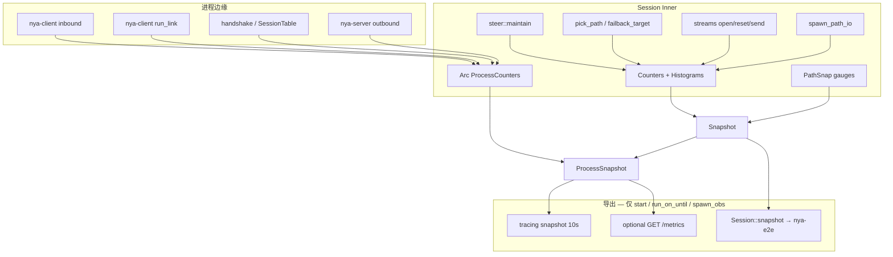
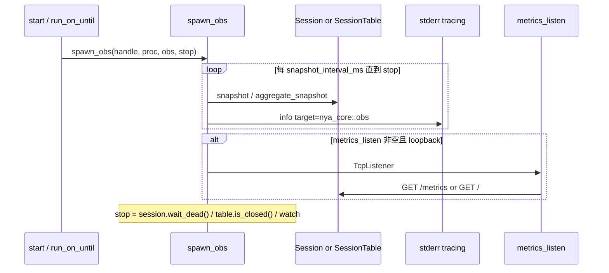

# 可观测性：业务质量计分卡与决策点调试

| 字段 | 值 |
| --- | --- |
| **Author** | nya-link-aggregation maintainers |
| **Date** | 2026-08-28 |
| **Status** | Draft |
| **Audience** | 熟悉 `nya-core` 会话 / 调度、`nya-client` / `nya-server` 运维面、以及 `nya-e2e` SLA 的工程师 |
| **Compatibility** | 扩展 `SessionSnapshot` 字段（`Snapshot` / `PathSnap` derive Default；`Counters` **手写** Default）；TOML 新增可选 `[obs]`；默认日志级别下决策点从 `info` 降到 `debug`；`migrates` 计入 `ensure_sticky` restick（e2e `mig=` 会变大，chatter 门仍只看 `failbacks`） |

---

## Overview

nya 是多路径 TCP+TLS overlay：应用流粘在最快 RTT class 上，路径变差时 migrate，恢复后 failback。项目是否「有用」，不取决于帧吞吐或 vanity counter，而取决于应用 TCP 看起来是否像一条稳定连接——流是否跑完、发送/乱序是否卡住、路径静默后多久切走、切换是在救命还是在 chatter。

现状是半套可观测性：`crates/nya-core/src/metrics.rs` 的 `Counters` 只活在进程里，`Session::snapshot()` 几乎只被 `nya-e2e` 读取；生产二进制没有任何导出。决策点（`steer::maybe_failback`、`maybe_speculative`、`migrate_from_path`）打在 `info!`，每条 STREAM_DATA / ACK / Ping 正确地保持沉默，但 `pick_path` 打分、HOL rebalance、send-blocked 跳连、reset 原因都是盲区。README 写 `RUST_LOG=nya_core=debug`，但 client/server `main.rs` 在 `from_default_env()` 之后 `add_directive("nya_core=info")`。tracing-subscriber 0.3 对**同等特异度**的 directive 是替换而不是取最大：`RUST_LOG=nya_core=debug` **一定会被盖成 info**。更具体的 target（例如 `nya_core::session::steer=debug`）仍然生效。

本设计先做模块 × 事件清单（该打的打、不该打的明确不打），然后：

1. **扩展现有 `Counters` / `Snapshot`**，补齐业务质量计分卡。探针语义写死（见 Q2/Q3/Q6），不把 overlay 计数假装成 e2e ping SLA。不引入第二套 metrics 库。
2. **决策点结构化 debug 日志**（候选、分数、chosen、reason）。只有 `format_candidates` 需要 `tracing::enabled!`；普通 `debug!` 字段在关闭时不求值。现有 per-stream `info!("failback")` / `info!("speculative migrate")` 降到 debug。
3. **导出贴合现有运维面**：`spawn_obs` 从 `nya_client::start` / `run_on_until` 拉起（**不**在 `Session::new`）；默认每 10s 一条结构化 snapshot 到 stderr；TOML `[obs].metrics_listen` 默认关。e2e harness 显式 `snapshot_interval_ms = 0`。

---

## Background & Motivation

### 现有架构（与可观测性相关的切片）

```text
inbound (SOCKS5 / forward)     nya-client::inbound
    │
    ▼
Session::open_stream           session/streams.rs
    │  pick_path_pref          scheduler.rs（纯函数，无 tracing）
    ▼
sticky STREAM_* 帧
    │
    ├─ steer::maintain (5ms)   degrade / down / speculative / failback / HOL
    │
    ▼
PathState dual writer          path.rs spawn_path_io
    ▼
TLS framed IO
    ▼
nya-server outbound            TcpStream::connect(target)
```

`Inner.metrics: Counters` 挂在每个 `Session` 上（`session/mod.rs`）。`SessionTable`（服务端多会话）没有聚合。客户端入站、服务端出站、握手失败、链路重连都不在 `Counters` 里。e2e `harness.rs` **不**走 `nya_client::start()`：它直接 `Session::new_client` + `spawn_links` + `serve_forward_listener` / `serve_socks5_listener`，服务端走 `run_on_until`。

### 现有 counters（`metrics.rs`）

| 字段 | 递增点 | 语义缺口 |
| --- | --- | --- |
| `path_added` | `Session::start_path` | 无 |
| `path_down` | `Session::path_failed` | 无 `path_degraded`；DOWN 后 path 从 HashMap 移除，活 snapshot 里不会出现 `state=down` |
| `migrates` | `maybe_speculative`、`migrate_from_path`、`send_data` 队列满跳姐妹 TCP | 三种原因混在一起；`ensure_sticky` 静默 restick **不计数** |
| `failbacks` | `maybe_failback` 且 `cur.link() != best.link()` | **只计跨 link**；同 link ClassEmpty 到姐妹不计入。e2e chatter（25/min）依赖这个语义，**不能改** |
| `failbacks_upgrade` / `failbacks_class_empty` | 同上，仅跨 link | 同 link 的 reason 丢失 |
| `hol_rebalances` | `maybe_hol` | **无日志**；`send_data` 首次变 bulk 的 `hol_place_bulk` **既不计数也不打日志** |
| `stream_resets` | `reset_stream` / `on_peer_reset` | 无 `ResetReason` 分解；无 `streams_opened` / `streams_closed`；`Session::shutdown` 发 `SessionDead` **不**走 `reset_stream`、**不**递增 |
| `bytes_data_tx` / `bytes_data_rx` | `send_data` / `drain_recv` 的 STREAM_DATA payload | 无控制面字节；Ping 走 `path.rs::send_frame`，**从不**经过 `Session::send_on_path` |
| `frame_send_drop` | `send_on_path` 队列满 | 无 urgent vs bulk 分解 |

`PathSnap` 有 `rtt_us` / `stable_rtt_us` / `class_rtt_us` / `inflight` / `sticky` / `alive`，缺 `state`（UP/DEGRADED）、`congested`、`last_rx_ago_us`、`link`。

### 现有 tracing

默认 `nya_client=info,nya_core=info`（client/server `main.rs`）。决策相关：

| 位置 | 级别 | 问题 |
| --- | --- | --- |
| `steer.rs` `maybe_failback` | **info**（已有 from/to RTT 字段） | 5ms tick × N 流；mixed soak 曾到数百次/分钟 |
| `steer.rs` `maybe_speculative` | **info** | 同上 |
| `steer.rs` `migrate_from_path` | **info** `"stream migrated"` | path down 时每条流一条 |
| `steer.rs` silent → down | **warn** | 保留（运维事件） |
| `steer.rs` silent → degraded | **info** | 保留 |
| `session/mod.rs` path added/down | **info** | 保留 |
| `scheduler.rs` | **无** | pick 打分完全看不见 |
| `maybe_hol` | 仅 counter | 决策无日志 |
| `streams.rs` `send_data` 跳连 | 仅 `migrates++` | 无日志 |
| `streams.rs` 首次 bulk `hol_place_bulk` | 无 | 不计 HOL |
| `nya-server/outbound.rs` `"outbound connected"` | **info** | **每条流一条**，生产噪音 |
| handshake | debug 无字段 | `"create-session written"` |
| STREAM_DATA / ACK / Ping | 无 | **正确，保持** |

`Counters` **没有 HTTP、没有定期日志、没有 stdout JSON**。生产运维只能看 stderr 文本；e2e 通过 `h.session.snapshot()` 读内部状态（`report.rs` 的 `tx/mig/down/drops`，`mixed.rs` 每 400ms 差分 `SwitchEvent`，`failbacks_per_min >= 25` 判 chatter）。

### 痛点

- 无法在生产回答「聚合有没有在干活」：流成功率、路径静默切换时延、发送/乱序 stall、goodput 都不存在。
- 决策为什么选这条路径，只能复现后再读代码。`pick_path` / `failback_target` 是纯函数，调用方也不 dump 候选。
- `info` 决策日志要么太吵（不能常开），要么（若关掉）什么都没有。缺少「默认安静、debug 时讲 why」的分层。
- e2e 已经在用 snapshot 做 SLA；生产与测试脱节。

---

## Goals & Non-Goals

### Goals

- 一张 **业务质量计分卡**（见 Proposed Design）：运维和 e2e 用同一组数字。每个 Q 的探针能从代码算出来；与 e2e ping SLA 的差异写明。
- **决策点 debug**：`pick_path`、migrate、failback、HOL（含首次 bulk）、path up/down/degraded、class 变化、stream open/reset、dial/handshake 失败。结构化字段。
- 日志给人看，metrics 给仪表盘和 SLA。扩展 `Counters`，不平行搞一套。
- 导出匹配「TOML + `RUST_LOG`、无额外 daemon」：定期 snapshot 日志 + 可选 `metrics_listen`（默认关）。
- 新 TOML 键走 `#[serde(deny_unknown_fields)]`，运维面保持小。日志 verbosity 只用 `RUST_LOG`。
- 单元测试钉住决策点递增；e2e 继续读 `Session::snapshot()`，不靠刮日志。`Snapshot` / `PathSnap` derive Default；`Counters` 手写 Default 以构造三个不同边界的 histogram。
- 修正 `EnvFilter`：未设置 `RUST_LOG` 时才落到 crate=info；设置了就不再 `add_directive` 覆盖。

### Non-Goals

- 每条 STREAM_DATA / ACK / Ping / Pong 打日志或 histogram。
- 把 `Tuning` 或健康公式旋钮暴露进 TOML。
- 默认启用 Prometheus crate、OpenTelemetry、tracing-jaeger、log 文件轮转、statsd/UDP。
- 分布式追踪（overlay 单进程，span 跨路径的 ROI 低）。
- 改 e2e SLA 阈值（25 failbacks/min 等）；只提供更好的内部数字给现有判定。
- 修 graceful close 后 `streams` HashMap 可能残留（超出观测范围；计数用 `counted_close` CAS，不 GC）。
- 把 `failbacks` 改成包含同 link——e2e chatter 语义冻结。
- 把 overlay stall / `failover_ms` 当作 e2e `gap_around` 的同一指标。
- 在 `Session::new` 里 spawn 观测任务（单测 / e2e 会话必须保持除现有 maintain tick 以外无额外副作用）。

---

## Proposed Design

### 原则

1. **数据路径安静，控制路径说话。** 帧循环、EWMA 更新、5ms 空转 maintain 不打日志。
2. **决策记 why，状态记 snapshot。** 一次 migrate 是 debug 事件；路径 RTT 是 gauge，走定期 snapshot，不跟每次 Pong。
3. **业务层优先，探针诚实。** 计数器组出流成功 / send-or-reorder stall / 路径静默切换 / chatter / overlay goodput，而不是「我们发了多少帧」。不把 overlay 内部时钟冒充应用 ping。
4. **关闭 debug 时：`debug!` 字段不求值。** 只有会 `format!` 整串候选的路径包 `tracing::enabled!(Level::DEBUG)`。stall / histogram observe 是**固定数据路径税**，与 debug 无关。
5. **一套数字，两处消费。** 同一 `Snapshot` + `ProcessSnapshot` 给 e2e、定期日志、`/metrics`。

### 架构



### 质量计分卡（「聚合有没有用」）

这是**唯一**需要出现在默认 snapshot / 告警思路里的集合。其余是排障用的内部计数。

| # | 问题 | 信号（overlay 实际能量的） | 好的样子（非正式） |
| --- | --- | --- | --- |
| Q1 | 流有没有跑完？ | `streams_opened`、`streams_closed`、`stream_resets_*`（含 shutdown 计入 `session_dead`）、`inbound_open_fail`、`outbound_dial_fail` | 稳态 `closed / (closed+reset)` 高；`DialFailed` 是目标侧；进程退出时 teardown 会抬高 `session_dead`，看稳态窗口不要看进程寿命 |
| Q2 | 发送或乱序交付有没有卡住？ | `stall_ms` histogram（离开 stall 时 observe）、`streams_stalled` gauge | **不是**「应用 TCP 空闲 / 慢消费者」。定义见下：send-unacked stall ∪ recv-**hole** stall。p99 与路径 `degrade_timeout` 同量级 |
| Q3 | 路径静默后多久切走？ | `failover_ms` histogram：**每个路径事件一次**，值为该 path 的 `last_rx_ago` | overlay 静默时长，与 e2e `failover_observed_ms`（应用 ping `gap_around`）**同量级、不同口径**。快路径 ≪ 1s |
| Q4 | 切换在救命还是 chatter？ | `migrates`、`failbacks`（跨 link）、`failbacks_upgrade`、`hol_rebalances`（含首次 bulk）、`failbacks_same_link` | soak 下 `failbacks/min < 25`（已有 e2e 门）；无故障时跨 link failback 接近 0 |
| Q5 | 路径质量分布？ | `PathSnap`：RTT / class / state / `last_rx_ago` / sticky；`path_down` vs `path_added` | 活 snapshot **没有 DOWN 路径**（`path_failed` 已从 HashMap 删掉）；`alive=false` 不应出现 |
| Q6 | 有用功 vs overlay 开销？ | `bytes_data_*` vs `bytes_wire_*`（encoded overlay，TLS/TCP 不含） | `data/wire` 高；`frame_send_drop` 持续上升 = 队列过深 |
| Q7 | 入站/出站在拒绝什么？ | `inbound_accept` / `inbound_reject` / `inbound_open_fail`；`outbound_dial_ok/fail` | 打开失败对齐 `NoPath` / `Dead`。Q7 是生产边缘指标；e2e notes **第一版不要求**（harness 仍走同一 `session.process()`，计数可用但 PR 5 不展示） |
| Q8 | 会话还在吗？ | `sessions_live`（gauge）、`sessions_created` / `sessions_dead`、`session_all_down_resets`、`reconnect_ok/fail` | 全 down 超过 `all_down_timeout_ms` 才拆；重连成功率高 |

e2e **继续**用应用层 ping（`WorkloadStats` p99、`gap_around`）做 SLA 对错。新 counters 是解释层，不替代 ping，也不宣称与 `failover_observed_ms` 同一指标。

#### Q2 stall — 精确定义

两路，**都不是应用空闲，也不是慢消费者**：

1. **Send-unacked stall。** 锁一次 `unacked`（谓词本来就要看是否非空）。map 非空，且 `now - send_origin_ms` 大于阈值。`send_origin_ms`（**同一把锁里**算）：
   - `last_ack_ms != 0` → `last_ack_ms`（`on_ack` 里 `send_acked` 前进时写入，`streams.rs`）。
   - `last_ack_ms == 0` → 最老 `Unacked.last_sent`（`stream.rs` 已是 `Instant`）换成 mono：`mono_ms().saturating_sub(last_sent.elapsed().as_millis() as u64).max(1)`。
   - **禁止**回落 `opened_ms`：SOCKS 流先 idle 再首包写入时 `unacked` 非空、`last_ack_ms == 0`，用 `opened_ms` 会在下一 tick 就过 `degrade_for`。首包刚发出 `last_sent ≈ now`，age ≈ 0，不算 stall。
2. **Recv-hole stall。** 锁一次 `recv_buf`，立刻放开：存在至少一个 key **且** `buf.get(recv_next)` 为 `None`（`min(keys) > recv_next`；`on_data` 丢掉 `offset < recv_next`）。`drain_recv` 在 `inbound_tx` 满时把**已到序** chunk 插回 `recv_next`（`streams.rs` 325–327 行）→ `min(key) == recv_next`，是 `slow_consumer` 流控，**不算** Q2。无洞则清 `recv_hole_since_ms = 0`。有洞时 origin：
   - `last_recv_ms != 0` → `last_recv_ms`（`drain_recv` 成功 `try_send` 时写）。
   - `last_recv_ms == 0` → `recv_hole_since_ms`（首次见到洞时 `store(now.max(1))`，之后保持）。这样 idle 很久才来第一段乱序不会立刻 stall。
   - **禁止**回落 `opened_ms`。

纯空闲（`unacked` 空且无洞）不算。不要把 `recv_buf` / `unacked` 锁持过 `try_send`。

阈值：sticky 路径还在则 `degrade_for(path)`；路径已 gone 则 `inner.cfg.tuning.loss_timeout_floor`。

`StreamState` 增加（无新 Mutex）：

```rust
pub last_ack_ms: AtomicU64,         // 0 = never；on_ack 前进时写
pub last_recv_ms: AtomicU64,        // 0 = never；drain_recv 成功交付时写
pub recv_hole_since_ms: AtomicU64,  // 0 = 当前无洞；仅 last_recv_ms==0 的 hole 时钟
pub stalled: AtomicBool,
pub stall_from_ms: AtomicU64,       // 0 = 未在 stall；进入时冻结 origin，离开时才读
pub opened_ms: AtomicU64,           // 只给 stream_lifetime_ms；与 stall 无关
pub counted_close: AtomicBool,
```

时钟：`metrics::mono_ms()` = 进程起点毫秒，Relaxed。`opened_ms` 仍 `mono_ms().max(1)`（寿命）。不要第四把锁。

**进入 / 离开（observe 用冻结原点，不用刷新后的 `last_*`）：**

`on_ack` 会推进 `last_ack_ms` **并**从 `unacked` 删掉已确认段；`drain_recv` 成功 `try_send` 会写 `last_recv_ms` **并**填洞。下一拍 `maintain` 时谓词已为 false，此时再算 `now - last_*` ≈ 0。恢复路径（p99 真正关心的样本）会塌成 0；reset/teardown 才碰巧还能看到旧 `last_*`。所以：

| 时刻 | 动作 |
| --- | --- |
| 谓词 false→true（`stalled` 还是 false） | `stall_from_ms.store(origin)`，origin 是**本 tick 谓词用的过期时钟**（send：`last_ack_ms` 或最老 `last_sent`；recv：`last_recv_ms` 或 `recv_hole_since_ms`；两路同时为真则 `min`）。然后 `stalled = true`。已在 stall 中**不要**刷新 `stall_from_ms`。 |
| 谓词 true→false，或 `finish_stream` 且 `stalled` | `stall_ms.observe(now.saturating_sub(stall_from_ms))`（`stall_from_ms` 为 0 则 skip，禁止 `now-0`），`stalled = false`，`stall_from_ms = 0`。**不要**再算 `progress_ms(last_*)`。 |
| 中间 tick 仍 stall | 不 observe、不改 `stall_from_ms` |

观察值 = 冻结 origin 到离开的时长（**含**越过阈值之前的等待）。不每 5ms observe，不打日志。

`maintain` 已有每 5ms clone 全部 `Arc<StreamState>`：对未 `reset` / 未 `counted_close` 的流跑上述状态机。gauge `streams_stalled` = 本 tick 结束后 `stalled == true` 的个数（`store` 当前值，不是 fetch_add）。

这是 O(streams) 固定税。每流大约 7 个原子量；send 路径的 `unacked` 锁本来就要拿。

PR 2 单测：构造 unacked + 过期 `last_sent` 进入 stall，再模拟 `on_ack` 清空 unacked 后跑 maintain → `stall_ms` 样本 ≥ 阈值，**不是** ~0；idle 数秒再 `unacked.insert` 刚 `last_sent=now` → 下一 tick **不** stall。

#### Q3 failover_ms — 精确定义

**每个路径静默/down 事件最多 1 个样本**，不是每条 sticky 流一个。

`PathState` 增加 `failover_recorded: AtomicBool`，`start_path` 时 false。

Observe 值 = `path.last_rx_ago().as_millis() as u64`。仅当 from 路径是 **仍在 HashMap 里的 DEGRADED** 或即将 `path_failed` 的静默路径，**不是** congested-but-UP，**也不是** missing（`get_path` = `None` 时没有 `PathState` 可 CAS，且 `path_failed` 已在 `remove` 前 observe 过）。

| 调用点 | 是否 observe | 规则 |
| --- | --- | --- |
| `Session::path_failed` | **是，一次** | `failover_recorded` CAS false→true 成功则 `observe(last_rx_ago)`，然后才 `migrate_from_path`。N 条 sticky 只产生 1 个样本 |
| `maybe_speculative` 且 `get_path` = `Some(p)` 且 `!p.is_up()`（仅 DEGRADED） | **是，每 path 一次** | 同一 `failover_recorded` CAS；第一条流迁走时记录，其余流只 `migrates++` |
| `maybe_speculative` 且 `get_path` = `None`（missing） | **否** | 无 `PathState` 可 CAS；`path_failed` 已记录。不要 invent 0ms 样本 |
| `maybe_speculative` / `ensure_sticky` 仅因 `is_congested()`（仍 UP） | **否** | `last_rx_ago ≈ 0`，不是 failover |
| `ensure_sticky` 路径 missing / 非 alive | **否** | 已由 `path_failed` 记录过；避免双计 |
| `maybe_failback` | **否** | 质量恢复，不是故障切换 |
| `migrate_from_path` 循环体内 | **否** | 避免 ×N stickies；p99 否则跟踪「死路径上有多少 sticky」 |

与 e2e：`report.rs` 的 `failover_observed_ms` 是应用 ping `gap_around`。overlay `failover_ms` 是路径静默时长。二者同量级（degrade/down 时钟），**不要**在文档或告警里写成「同口径」。

#### Q6 goodput — 精确定义（单一平面）

只在 IO 平面数 **encoded overlay 字节**（`Frame::encode()` 输出 = 类型字节+body）。`LengthDelimitedCodec` 的 4 字节 length、TLS record、TCP 都不计。

Ping/Pong **只**走 `path.rs::send_frame`，从不经过 `Session::send_on_path`。因此 TX **只**在 `send_frame` 计数；RX **只**在 `spawn_path_io` 成功 `Frame::decode(&bytes)` 之后用 `bytes.len()`。

拆分：

```text
encoded = frame.encode().len()           // TX，send_frame 里已有 encode
        = bytes.len()                    // RX，decode 前的 framed payload

若 Frame::StreamData(d):
    bytes_data_{tx,rx} += d.data.len()   // payload
    bytes_ctrl_{tx,rx} += encoded - d.data.len()
否则:
    bytes_ctrl_{tx,rx} += encoded

bytes_wire_* = data + ctrl               // 可导出，或 snapshot 时相加
goodput = data / wire                    // 重传的 STREAM_DATA 算 data，诚实反映 wire
```

**删除** `streams.rs` 里现有的 `bytes_data_tx`（`send_data`）和 `bytes_data_rx`（`drain_recv`）递增，避免双计。今天 `bytes_data_tx` 只在 `send_data` 首次入队时 +payload，**不**随 `retransmit_all_on` / hedge `send_data_frame` 再加。迁到 `send_frame` 之后，每条真正上线的 encoded StreamData（含 retry、hedge、speculative 重传）都算 data；队列满从未到达 `send_frame` 的 drop 不再算。e2e `report.rs` 的 `tx=` 仍读 `bytes_data_tx`，**不是 SLA 门**（只打印）：failover / hedge 场景会**升高**，仅 drop 多时略降。CHANGELOG 按此写，不要承诺「略降」。

`bytes_ctrl_*` 替代草案里「`send_frame` **或** `send_on_path`」的歧义：实现者没有或。

---

### 模块 × 事件清单

图例：`ops` = 默认 info/warn/error；`dbg` = 仅 debug；`met` = counter/gauge/histogram；`no` = 明确不打。

#### `nya-proto`（编解码）

| 事件 | 分类 | 说明 |
| --- | --- | --- |
| 帧 encode/decode 成功 | **no** | 纯函数，热路径 |
| `ProtoError` | **no**（调用方 `path.rs` 已 `warn!(..., "bad frame")`） | 避免双打 |

#### `nya-core::auth`

| 事件 | 分类 | 说明 |
| --- | --- | --- |
| HMAC / HKDF | **no** | 无决策；禁止把 proof/PSK 打进日志 |

#### `nya-core::health` / `tuning`

| 事件 | 分类 | 说明 |
| --- | --- | --- |
| `loss_timeout` / `should_failback` / `is_backup` | **no** | 纯函数；why 由调用方在 debug 里带公式结果 |

#### `nya-core::tls`

| 事件 | 分类 | 说明 |
| --- | --- | --- |
| `connect_pinned` TCP 连接 | 现有 debug，保持 | `tls.rs` 已有 `tcp connect/connected` |
| pin 失败 | 已是返回错误；调用方 `run_link` **ops warn** | 不在 tls 层重复 |
| exporter 字节 | **no** | 密钥材料 |

#### `nya-core::handshake`

| 事件 | 分类 | 说明 |
| --- | --- | --- |
| Create/Join 成功 | **dbg**（字段：`role=create\|join`, `path_name`；不要 session_id）+ **met** `handshake_create_ok` / `handshake_join_ok` | 服务端 `serve_one` 已有 info；在 **`nya-server::serve_one` / 客户端 `connect_one`** 递增 process counters，handshake.rs 保持无 process 依赖 |
| 失败 | **ops** `serve_one` 已 `error!(handshake failed)`；**met** 四个原子（见 ProcessCounters） | `Rejected("version")` → `handshake_fail_version`；`Rejected("auth")` → `_auth`；`UnknownSession` → `_unknown`；其余（`closed` / `Unexpected` / `Proto` / 其它 Rejected）→ `_other`。不打 PSK |
| 现有 `"create-session written"` | 加 `role="create"` 或删掉空串 | 低优先级 |

#### `nya-core::path`（`PathState` + `spawn_path_io`）

| 事件 | 分类 | 说明 |
| --- | --- | --- |
| `record_rtt` / EWMA / 每个 Pong | **no** | 10–50ms × N 路径 |
| class 真正改写 `rtt_class_us`（init freeze / raise / drop 7/8） | init **dbg**；raise/drop **info** `path, old_us, new_us, kind` | 稀有。raise 是每 hold 一次 7/8。init freeze 也置 permit；之后 drop 也是每 hold 一次，直到这次 drop 的 `new_us ≤ fast`（permit 清掉）。happy-path freeze（class==fast）不会 catch-up 清 permit，生产路径在会话剩余时间走 `permit && fast < class`，不再是「未 raise 过仍走 0.25/8 ms 门」。仅 poke class 的测试 / 已 catch-up 的路径仍走该门。另：`correlated silence`（membership=`degrade_for`，enter 要 `silent>=1`；字段 `quiet`/`silent`/`alive`/`known_quiet`/`budget_ms`）、`outlier recycle`（class 与 fast 相对同链路姐妹 class 都是 backup 才拆；class backup 但 fast 已回到 cliff 以下不拆）、`unknown session, will recreate` 也是 **info**。50 ms-only 3-of-4 不进 `corr`。DEGRADED 仍发 Ping（**no** 日志） |
| `mark_degraded` | **met** `path_degraded` 在 `steer::maintain` 调用处 | PathState 内部不打 |
| `next_ping` / ping 发出 | **no** 日志；字节走 Q6 `send_frame` | |
| writer 队列满 | 已由 `frame_send_drop`；**dbg** 当 `urgent` 失败时 `path, urgent=true` | bulk 满是预期，不要 info |
| `spawn_path_io` 读写/EOF/bad frame | 现有 warn/debug，保持 | |
| overlay 字节 | **met** 仅 `send_frame`（TX）与 decode 成功（RX），见 Q6 | **不**在 `send_on_path` |

#### `nya-core::scheduler`

| 事件 | 分类 | 说明 |
| --- | --- | --- |
| `pick_path_pref` / `pick_from` 内部循环 | **no** 在 scheduler 内 | 保持纯函数 |
| `format_candidates` | **dbg** 仅 `open_stream` 调用，且 `enabled!(DEBUG)` | 语法冻结见下 |
| `failback_target` 返回 None | **no** | 每 tick × 每流 |
| `should_rebalance_conn` false | **no** | 同上 |

#### `nya-core::session`（`mod.rs`）

| 事件 | 分类 | 说明 |
| --- | --- | --- |
| `start_path` 成功 | **ops info** 已有 + `path_added` | 保留 |
| max paths | **ops warn** 已有 | 保留 |
| `path_failed` | **ops info** 已有 + `path_down` + **hist** `failover_ms` 一次 | 保留 info |
| `shutdown` / `Inner::drop` | **ops info** 一次（仅 dead CAS 赢家）`reason=shutdown\|drop`；`sessions_dead++`、`sessions_live--`；剩余 id 走 `reset_stream(SessionDead)`（Drop 不发帧） | 抽 `Inner::mark_dead` / `finish_stream`；计数门是 `counted_close` CAS，见 Q1 |
| `handle_frame` StreamOpen 打到 client | **ops warn** 已有 | 保留 |
| 未知帧 | debug 已有 | 保留 |
| `ensure_sticky` 因 `!is_alive()` / missing 而 restick | **met** `migrates++`（语义扩展，见 PR 2）+ **dbg** `reason=ensure_sticky` | **不** observe `failover_ms`（见 Q3） |
| `ensure_sticky` 仅 congested 跳姐妹 | **met** `migrates++` + **dbg** `reason=ensure_sticky` | **不** observe failover |
| `send_on_path` drop | 已有 `frame_send_drop` | 见 path |
| `pick_pref` 用于 `open_stream` | **dbg** 候选 | 新流才 dump；`send_ack` fallback **不 dump** |

#### `nya-core::session::steer`

| 事件 | 分类 | 说明 |
| --- | --- | --- |
| silent → down | **ops warn** 已有 | 保留 |
| silent → degraded | **dbg** + **met** `path_degraded` | 20ms 假 degraded 会刷屏；path-down 仍是 warn |
| `maybe_speculative` 真正迁 | **dbg**（现 info 降级）+ `migrates`；failover hist 按 Q3 | 字段：stream_id, from, to, same_link, from_state |
| `maybe_speculative` 重传/hedge 单帧 | **no** | 热路径 |
| `maybe_failback` 真正迁 | **dbg**（现 info 降级，保留全部 RTT 字段）+ 跨 link 走现有 failback counters；同 link 走 `failbacks_same_link` | `reason=upgrade\|class_empty`，`cross_link=bool` |
| `maybe_hol` 真正迁 | **dbg** 新增 + 已有 `hol_rebalances` | from/to, inflight_from, inflight_to, bulk |
| `migrate_from_path` | **dbg** 每流（现 info 降级）+ `migrates`；**不**在循环里 observe failover | path-level info 已在 `path_failed` |
| all-down 超时 reset | **ops warn** 已有 + **met** `session_all_down_resets`；每条流走 `reset_stream(..., Timeout)`（已有 `stream_resets_timeout`） | 保留 warn |
| maintain 空转 | **no** | 5ms |

#### `nya-core::session::streams`

| 事件 | 分类 | 说明 |
| --- | --- | --- |
| `open_stream` | **met** `streams_opened` 仅在 sticky 指定成功之后；**dbg** stream_id, path_id, pref | 先 `pick_pref` 再 `alloc_local_stream`，避免 NoPath 孤儿。失败只反映为 `inbound_open_fail` |
| `accept_remote_stream` | **met** `streams_opened` 在 `set_sticky` 之后 | duplicate Open 已 warn+return，不计 |
| duplicate StreamOpen | **ops warn** 已有 | 保留 |
| `send_data` 每个 chunk | **no** 日志；**不再**在这里 `bytes_data_tx++` | 改到 `send_frame` |
| 队列满跳姐妹 | **dbg** + `migrates++` + **必记** `migrates_send_blocked++` | 不是可选 |
| 首次 chunk `> interactive_max` 且 `hol_place_bulk` 返回 Some | **dbg** `reason=hol_initial` + **`hol_rebalances++`** | 每流最多一次；Q4 否则低估 HOL |
| `reset_stream` / `on_peer_reset` / `mark_dead` | **met** 见 Q1：`counted_close` CAS 赢了才 `stream_resets_*` **或**（graceful）`streams_closed`，互斥；lifetime/stall 至多各 observe 一次；**dbg** stream_id, reason | `reset.swap` **只**防止第二条 `StreamReset` 帧，不是计数门。已 graceful 的流再 reset **不**进 `stream_resets_*` |
| graceful close | **met** `streams_closed`：`close_send` 与 `on_peer_close` **都**检查 `send_fin_sent && recv_fin`，`counted_close` CAS false→true 才 ++ 并 observe lifetime | **不**等 pump join（pump 是 detached `tokio::spawn`） |
| ACK / 重排 / window | **no** 日志；`last_ack_ms` / `last_recv_ms` 更新 | |
| stall 扫描 | **met** 见 Q2（hole 谓词；进入时冻 `stall_from_ms`；send 无 ACK 用最老 `Unacked.last_sent`） | maintain 已有流列表 |

#### `nya-core::stream`（`TunnelStream`）

| 事件 | 分类 | 说明 |
| --- | --- | --- |
| poll_read/write | **no** | |

#### `nya-client::lib`（`run_link` / `connect_one`）

| 事件 | 分类 | 说明 |
| --- | --- | --- |
| `"dialing"` | **ops info** 已有 | 保留 |
| `"session created"` | **ops info** 已有 | **不**递增 `reconnect_ok`（同一 `connect_one` 还会打 path up） |
| `"path up"` | **ops info** 已有 + **met** `reconnect_ok` **一次**（首次与重连都算成功上线） | 唯一 `reconnect_ok` 站点 |
| `"link failed"` | **ops warn** 已有 + **met** `reconnect_fail` | Create 失败已包含在内 |
| TLS/握手 timeout | 已进 `link failed` / `reconnect_fail` | v1 不拆 timeout 计数 |

#### `nya-client::inbound`

| 事件 | 分类 | 说明 |
| --- | --- | --- |
| socks5/forward listen | **ops info** 已有 | 保留 |
| SOCKS 握手/请求解析失败 | **met** `inbound_reject` + 现有 warn | **全部**：`not socks5`、`bad socks ver`、非 CONNECT（0x07）、坏 atyp（0x08）。不只 CONNECT/atyp |
| `open_stream` 失败 | **ops warn** 已有 + **met** `inbound_open_fail`；**dbg** `nya_core::hop` `outcome=open_fail`（`open_us` only） | socks 与 forward 都计 |
| 成功 `open_stream` 即将 copy | **met** `inbound_accept`；**不要** info | |
| copy 结束 | **no** info；**dbg** `target=nya_core::hop` `event=hop`（`open_us` / `first_rx_us` / `last_rx_us` / `copy_us`）；**met** snapshot-only hop hists（不进 catalog / `n_counter`） | |

#### `nya-server::lib`（`serve_one`）

| 事件 | 分类 | 说明 |
| --- | --- | --- |
| listening | **ops info** 已有 | 保留 |
| session created / path joined | **ops info** 已有 + handshake_create_ok / join_ok | session_id hex 不进定期 snapshot |
| handshake failed | **ops error** 已有 + 四个 `handshake_fail_*` | 见上映射 |
| 连接 closed | **ops warn** 已有 | 保留 |
| TLS accept 失败 | 走 `connection closed` | 足够 |

#### `nya-server::outbound`

| 事件 | 分类 | 说明 |
| --- | --- | --- |
| `"outbound connected"` | **dbg**（现 info 降级）+ **met** `outbound_dial_ok` 经由 `inc.process()` | |
| dial 失败 | **ops warn** 已有 + **met** `outbound_dial_fail`；**dbg** hop `outcome=dial_fail`（`dial_us` only）；已 `reset(DialFailed)` | 保留 warn |
| copy 结束 | **no** info；**dbg** `nya_core::hop`（`dial_us` / `ofirst` / `olast` / `max_gap` / `crx_at_gap` / `origin_at_gap` / `crx_at_olast`）；**met** snapshot-only origin hop hists | |

#### `nya-e2e`

| 事件 | 分类 | 说明 |
| --- | --- | --- |
| 现有 info（scenario start、fault） | 保持 | 测试工具 |
| 刮生产日志做断言 | **no** | 继续 `snapshot()` |
| 定期 snapshot 任务 | **关** | `harness.rs` 显式 `ObsOpts { snapshot_interval_ms: Some(0), .. }`；不依赖默认 |

### 决策点 debug 契约

所有决策日志使用 **tracing 字段**，message 只是短动词。常用字段：

```text
stream_id, from, to, from_name, to_name, same_link,
from_rtt_us, to_rtt_us, from_class_us, to_class_us,
from_inflight, to_inflight, from_sticky, to_sticky,
from_state, reason, pref, score, candidates
```

`from_state` 字符串（与 `PathSnap.state` 同一张表）：

| `PathState.state` | u8 | 日志 / `paths` 串 |
| --- | --- | --- |
| `STATE_UP` | 1 | `up` |
| `STATE_DEGRADED` | 2 | `deg` |
| `STATE_DOWN` | 3 | `down`（活 snapshot **不会出现**：`path_failed` 已 remove） |
| missing path | — | `gone` |

`reason` 稳定短字符串：

| 字符串 | 来源 |
| --- | --- |
| `speculative` | `maybe_speculative` |
| `path_down` | `migrate_from_path` |
| `ensure_sticky` | `ensure_sticky` |
| `send_blocked` | `send_data` 队列满 |
| `upgrade` / `class_empty` | `FailbackReason` |
| `hol_bulk` / `hol_rebalance` | `maybe_hol`（bulk vs interactive rebalance） |
| `hol_initial` | `send_data` 首次变 bulk 的 `hol_place_bulk` |
| `pick` | `open_stream` |

#### `format_candidates` 冻结语法

实现放在 `scheduler.rs`（与 `pick_from` 公式一处），仅 debug 调用：

```rust
pub fn format_candidates(
    paths: &[Arc<PathState>],
    cfg: &SessionConfig,
    pref: PickPref,
    chosen: Option<u32>,
) -> String;
```

对 `fastest_class_set` 的每个候选，按 `id` 升序，空格分隔，**无** backup 集合里的路径（那些已被 class 滤掉）。公式与 `pick_from` 逐字相同：

```text
load = load_term(p, cfg, pref)
score = class_rtt_us * load * 1024 + rtt_score_us(p, cfg) * load
```

单条记录语法（正则可测）：

```text
{name}{id={id} {state} rtt={rtt_us} class={class_us} load={load} score={score}{*}?}
```

- `{state}` ∈ `up` `|` `deg`（候选来自 alive set，无 `down`）
- `*` 仅当 `p.id == chosen`
- 无空格在 `}` 内字段之间以外：字段以**单个空格**分隔，顺序固定：`id state rtt class load score`
- 例：`a#0{id=1 up rtt=12000 class=12000 load=3 score=37748736*}`

被 class 过滤掉、但仍 alive 的路径不进主串；若 `enabled!(DEBUG)` 且存在 backup，追加 ` backup={name},...`（只名字，不计分），否则不加。单测锁：两个等 RTT 路径、sticky 不同，score 单调且 `*` 在 id 较小或 load 较小的那个上（与现有 `spreads_across_equal_rtt_connections` 一致）。

`send_ack` 里的 `pick_pref(Interactive)` **不调用** `format_candidates`。

Failback 已有字段（`steer.rs` 291–303 行）只改 `info!` → `debug!`。普通决策 `debug!` **不要**再包 `enabled!`。

### Stall / failover / 寿命 — 实现清单（给 PR 2）

见上文 Q2/Q3。寿命：`opened_ms` 在 `StreamState::new` 写入 `mono_ms().max(1)`；`finish_stream` 在 `counted_close` CAS 赢家上 observe `stream_lifetime_ms`（`now - opened_ms`），各流一次（graceful 与 reset 同一门，不双计）。

Q1 计数门（所有终结路径共用）：

```text
reset.swap(true)     → 只保证最多发一条 StreamReset / 一条 Inbound::Reset
counted_close CAS    → 唯一的 streams_closed XOR stream_resets_* 以及 lifetime/stall observe 门
```

| 路径 | 调用 | 赢 CAS 后 |
| --- | --- | --- |
| 双边 FIN | `close_send` / `on_peer_close` 当 `send_fin_sent && recv_fin` | `streams_closed++` |
| `reset_stream` / `on_peer_reset` | 现有函数；reason 分解 | `stream_resets++` 与对应 `stream_resets_*`（已 closed 则 CAS 失败，不加 reset） |
| `Session::shutdown` | `mark_dead` → 剩余 id `reset_stream(SessionDead)`（发帧） | 同上，reason=`SessionDead` |
| `Inner::drop` | `mark_dead` → `Inner::finish_stream(..., send_frame=false)` | 同一 CAS；TLS 可能已没了，不 `send_on_path` |

`all-down` 超时已走 `reset_stream(Timeout)`，不必第二条递增路径。`closed / (closed+reset)` 里每条流恰好一个桶。

### 直方图（可实现）

```rust
// crates/nya-core/src/metrics.rs

pub const FAILOVER_MS_BOUNDS: &[u64] = &[5, 10, 20, 50, 100, 200, 500, 1000, 2000];
pub const STALL_MS_BOUNDS: &[u64]     = &[20, 50, 100, 200, 500, 1000, 2000, 5000, 10000];
pub const LIFETIME_MS_BOUNDS: &[u64]  = &[100, 500, 1000, 5000, 30_000, 60_000, 300_000];

pub struct Histogram {
    bounds: &'static [u64],            // 桶上限，不含 +Inf
    buckets: Box<[AtomicU64]>,         // len = bounds.len() + 1（最后一格 +Inf）
    sum: AtomicU64,
    count: AtomicU64,
}

impl Histogram {
    pub fn new(bounds: &'static [u64]) -> Self { /* buckets 全 0，len = bounds.len()+1 */ }
    pub fn observe(&self, v: u64) { /* Relaxed；找最小 i 使 v <= bounds[i]，否则 Inf 格 */ }
    /// 始终拷贝全部桶原子（含 0），len 恒为 bounds.len()+1。count==0 也是全零 vec，不是空 vec。
    pub fn snap(&self) -> HistSnap { /* 逐格 load */ }
}

#[derive(Clone, Debug, Default)]
pub struct HistSnap {
    /// 原始（非累积）计数。聚合路径上 len 必须 = 对应 `*_MS_BOUNDS.len() + 1`。
    /// `Default` 是 `buckets: vec![]`，**只**给 e2e `fail_report` / `error_report` 占位；禁止拿来 `merge_add`。
    pub buckets: Vec<u64>,
    pub sum: u64,
    pub count: u64,
}

impl HistSnap {
    pub fn zeroed(bounds: &'static [u64]) -> Self {
        Self { buckets: vec![0; bounds.len() + 1], sum: 0, count: 0 }
    }
    /// lens 不等：`debug_assert` 后 **no-op**（生产 overlay 不 panic）。空 Default 与真实 snap 相加不是合法 spec。
    pub fn merge_add(&mut self, other: &HistSnap) { /* 逐格 + sum + count */ }
}

/// `p` ∈ (0, 100]。`count == 0` 或 buckets 空 → None。
/// 在命中的原始桶内对桶上下界做线性插值；+Inf 桶返回该桶下界（最后一个 finite bound）。
pub fn percentile(snap: &HistSnap, bounds: &[u64], p: f64) -> Option<u64>;
```

Prometheus 导出时再把 raw buckets **累加成** `_bucket{le=}`；内存里保持 raw，方便 `merge_add`。

`Counters` **不能** `#[derive(Default)]`（三个 histogram 边界不同）：

```rust
impl Default for Counters {
    fn default() -> Self {
        Self {
            // 所有 AtomicU64::new(0),
            failover_ms: Histogram::new(FAILOVER_MS_BOUNDS),
            stall_ms: Histogram::new(STALL_MS_BOUNDS),
            stream_lifetime_ms: Histogram::new(LIFETIME_MS_BOUNDS),
            ..
        }
    }
}
```

`Snapshot` / `PathSnap` 可以 `#[derive(Default)]`（e2e 占位：hist 空 vec）。**生产路径禁止用它做聚合起点。**

`Counters::snap_with_paths` 里三个 hist 一律 `Histogram::snap()`（全桶，含零）。

`SessionTable::aggregate_snapshot`：

```rust
let mut acc = Snapshot {
    failover_ms: HistSnap::zeroed(FAILOVER_MS_BOUNDS),
    stall_ms: HistSnap::zeroed(STALL_MS_BOUNDS),
    stream_lifetime_ms: HistSnap::zeroed(LIFETIME_MS_BOUNDS),
    ..Snapshot::default()
};
for s in sessions {
    let snap = s.snapshot();
    acc.failover_ms.merge_add(&snap.failover_ms);
    acc.stall_ms.merge_add(&snap.stall_ms);
    acc.stream_lifetime_ms.merge_add(&snap.stream_lifetime_ms);
    // 其它 counter 相加 …
}
```

PR 1 单测：100 个 50ms 样本 → p50/p99 落在 50 桶；`HistSnap::default().merge_add(real)` **不是** spec（空桶 no-op 或 debug_assert）；`zeroed(BOUNDS).merge_add(real) == real`；`snap()` 在 count=0 时 `buckets.len() == bounds.len()+1`。PR 5 用 `percentile(&snap.failover_ms, FAILOVER_MS_BOUNDS, 99.0)` 写 notes。

### 进程级接线（可实现）

`Arc<ProcessCounters>` **始终**挂在 `Inner` 上，构造时必有。没有 `process_attach`。

```rust
// Inner
metrics: Counters,
process: Arc<ProcessCounters>,

impl Session {
    pub fn process(&self) -> Arc<ProcessCounters> { self.inner.process.clone() }
}

fn new(
    cfg: SessionConfig,
    is_client: bool,
    incoming: Option<mpsc::Sender<IncomingStream>>,
    process: Option<Arc<ProcessCounters>>,
) -> Self {
    let process = process.unwrap_or_else(|| Arc::new(ProcessCounters::default()));
    process.sessions_created.fetch_add(1, Relaxed);
    process.sessions_live.fetch_add(1, Relaxed);
    // ...
}

pub fn new_client(cfg: SessionConfig) -> Self {
    Self::new(cfg, true, None, None)
}
pub fn new_server(cfg: SessionConfig) -> (Self, mpsc::Receiver<IncomingStream>) {
    // process = None → 私有 Arc；SessionTable 走 new(..., Some(table.proc))
}
```

`SessionTable`：

```rust
pub struct SessionTable {
    cfg: SessionConfig,
    sessions: Mutex<HashMap<[u8; 16], Session>>,
    closed: AtomicBool,
    process: Arc<ProcessCounters>,
}

impl SessionTable {
    pub fn new(cfg: SessionConfig) -> Self { /* 自建 ProcessCounters */ }
    pub fn process(&self) -> Arc<ProcessCounters> { self.process.clone() }
    pub fn aggregate_snapshot(&self) -> ProcessSnapshot { /* 见下 */ }
}
```

`create_with_incoming` 调用 `Session::new(cfg, false, Some(tx), Some(self.process.clone()))`，使所有会话 + `serve_one` / outbound 共享一份 process counters。`sessions_created/live` 只在 `Session::new` 加，table **不要**再加。

**`sessions_live` gauge：** 只在 `Session::new` `fetch_add(1)`；只在 `mark_dead` 的 `dead` CAS 成功分支 `fetch_sub(1)` 且 `sessions_dead++`。`shutdown` 与 `Inner::drop` 都走 `mark_dead`。已 dead 则 no-op。剩余流的 Q1 计数走 `counted_close`（`reset_stream(SessionDead)` / `finish_stream`），不是第二条 `sessions_*` 路径。

**Harness / 嵌入：** `Session::new_client` 自带私有 `ProcessCounters`。`serve_forward_listener` / `serve_socks5_listener` / `spawn_links` 通过 `session.process()` 递增，**不必**改函数签名、也不依赖 `start()`。`handle_incoming` 用 `inc.session.process()`。`run_on_until` 的 `SessionTable::process()` 给 `serve_one` 握手计数（握手发生在 session 创建前后：create 成功时 session 已有同一 Arc；join 时 `table.get` 的 session 也是同一 Arc；失败则用 `table.process()`，因为可能没有 session）。

`reconnect_ok` **只**在 `connect_one` 的 `"path up"` 处 +1。

握手失败分类（v1 四个原子，不用 `{reason}` label）：

| `HandshakeError` | 原子 |
| --- | --- |
| `Rejected(msg)` 且 msg 含 `"version"` | `handshake_fail_version` |
| `Rejected(msg)` 且 msg 含 `"auth"` | `handshake_fail_auth` |
| `UnknownSession` | `handshake_fail_unknown` |
| 其它 | `handshake_fail_other` |

另：`handshake_create_ok` / `handshake_join_ok`。总数 = ok + 四个 fail，不必再加 `handshake_fail` 总和原子。

### ProcessSnapshot 形状（v1 唯一）

**求和 counters + 扁平 paths。** 多于一个会话时 path 名加 4-hex session 前缀，避免两个客户端都叫 `a#0` 或服务端都叫 `init` 时 gauge 互相覆盖。

```rust
#[derive(Clone, Debug, Default)]
pub struct ProcessSnapshot {
    pub process: ProcessCountersSnap, // 所有 Atomic 的 load
    pub session: Snapshot,            // 所有会话 Counters + HistSnap merge_add；paths 见下
}

fn flatten_paths(sessions: &[( [u8;16], Snapshot )]) -> Vec<PathSnap> {
    let prefix = sessions.len() > 1;
    sessions.iter().flat_map(|(id, snap)| {
        snap.paths.iter().cloned().map(|mut p| {
            if prefix {
                p.name = format!("{}:{}", hex4(id), p.name); // 例 "a1b2:init"
            }
            p
        })
    }).collect()
}
```

单会话客户端：`paths` 仍是 `a#0` 原名。多会话服务端：`/metrics` 是全租户拓扑转储（安全节）。不提供 per-session 独立 snapshot 向量（v1 不做 `Vec<(session_key, Snapshot)>`）。

### 导出



**谁 spawn（唯一权威，删除「Session::new 里 spawn」）：**

| 进程 | 函数 | 行为 |
| --- | --- | --- |
| 客户端二进制 | `nya_client::start` / `run_with_inbounds` | `spawn_obs_session(session, cfg.obs)` |
| 服务端二进制 | `run_on_until` | `spawn_obs_table(table, cfg.obs, stop.clone())` |
| e2e harness | `harness.rs` `start` | **显式** `ClientConfig.obs` / `ServerConfig.obs` = `ObsOpts { snapshot_interval_ms: Some(0), metrics_listen: None, .. }`。即使以后有人改默认，harness 仍安静 |
| `Session::new_client` / `new_server` / 单元测试 | — | **不** spawn。除现有 `spawn_maintenance` 外无副作用 |

`spawn_obs_*` 在 `interval == 0` 时不拉 snapshot 循环；`metrics_listen` 空则不 bind。停止：客户端 `session.wait_dead()`；服务端 `stop.wait_for(|v| *v)` 与 `table.is_closed()`（`run_on_until` 已有 watch）。任务结束时 drop listener。

#### 10s snapshot 的 tracing 字段（一条 `info`，target `nya_core::obs`）

info 行是紧凑计分卡（**不再**带 `metrics=` 全量 catalog；catalog 在同 target 的 `debug`「snapshot metrics」以及 `/metrics` / OTLP metrics）：

```text
stall_p99_ms, failover_p99_ms, stall_count, failover_count,
paths_alive, streams_live, streams_closed, stream_resets,
path_down, path_degraded, probe_miss, failbacks, session_all_down_resets,
bytes_data_tx, bytes_ctrl_tx,
mig, hol, hedge, rtx, fb_slink, picks_unk, recycle, corr,
open_p99_ms, first_rx_p99_ms, last_rx_p99_ms,           # client; omit when count=0
dial_p99_ms, origin_first_p99_ms, origin_last_p99_ms,   # server; omit when count=0
tail = "<host> copy=<us|-> … sid=<id>",                 # omit if no hop this interval
paths = "<压缩串>",
links = "<线路汇总>",
streams = "<粘滞表，最多 64 条，多出 +N>"
"snapshot"
```

Hop p99 来自 `ProcessCounters` snapshot-only histograms（`STALL_MS_BOUNDS`），**不**进 `visit_metrics` / Prometheus（`n_counter` 仍为 50）。客户端只 observe `open` / `first_rx` / `last_rx`；服务端只 observe `dial` / `origin_first` / `origin_last`。`copy` / `cfirst` / `clast` / `crx_at_olast` / `max_gap` / `crx_at_gap` / `origin_at_gap` 只走 debug + `tail=`。

`tail=` 语法（µs；无时长门）：

```text
tail=<host> copy=<us|-> [open=<us>] [first_rx=<us|->] [last_rx=<us|->] [dial=<us>] [ofirst=<us|->] [olast=<us|->] [cfirst=<us|->] [clast=<us|->] [crx_at_olast=<us|->] [max_gap=<us|->] [crx_at_gap=<us|->] [origin_at_gap=<us|->] sid=<id>
```

始终 `host copy=… sid=…`。`copy` 在 copy 未开始时为 `-`（open-fail / dial-fail）。客户端有 `open` / `first_rx` / `last_rx`；服务端有 `dial` / `ofirst` / `olast` / `cfirst` / `clast` / `crx_at_olast` / `max_gap` / `crx_at_gap` / `origin_at_gap`。`-` 只在 copy 已跑但该字节从未到达时用。

curl `samples.csv` 的 `ts` 是**请求结束**时间；join：`host` + `copy_us ≈ wall_ms×1000` + hop copy-end 靠近 `ts`（start ≈ `ts − wall_ms`）。精确 join 是 client `sid` ↔ server `sid`。

分类（docs + canary，**不是**调度器输入；不要写成 Tuning 毫秒门）：

- `open_us` 很大 → overlay `wait_ready`
- `dial_us` 很大或 `ofirst` 一直 `-` → 源站 connect / connect 后沉默
- `ofirst` / client `first_rx` 主导 copy（tls≈ttfb）→ 源站 TLS
- **不要**把 copy 结束时 `olast≈copy` 当成源站（成功的 generate_204 几乎都这样）
- **不要**把最终 `crx_at_olast` 当成 GET 到达（TLS close_notify 会覆盖）
- `olast ≪ copy` → overlay 卡住已在 copy 缓冲里的 204
- max-gap ≈ remainder 且 `origin_at_gap ≈ olast ≈ copy`、`crx_at_gap ≪ olast` → GET 之后源站思考
- max-gap 是握手量级、`first_rx≈tls ≪ copy`、最终 `crx≈copy` → overlay 在握手后延迟了 GET

debug hop：`RUST_LOG=nya_core::hop=debug`。默认 info 期刊不打每条流。

完整 Q1–Q8 字段仍在 `format_snapshot_metrics` / Prometheus / OTLP metrics。

`paths` 压缩（单会话名；多会话 `path` 与 `link` 都带 4-hex 前缀，例如 `a1b2:a#0` / `a1b2:a`）：

```text
a#0=12/12/12ms up inf=0 st=2 cong=0 rx=3 tx=1 ping=0 q=0/0; a#1=13/12/12ms deg inf=8 st=0 cong=1 rx=40 tx=2 ping=1 q=0/3 unk
```

语法：`{name}={rtt}/{stable}/{class}ms {state} inf= st= cong= rx= tx= ping= q={urgent}/{bulk}{ bak}?{ unk}?`

`bak` 表示该路径相对本快照里已知 RTT 的最小 class 是 backup（`2×min+20ms`），不是 G4b 同链路回收候选。

`links`：`{name}={up}/{deg} {rtt_min}-{rtt_max}ms st= inf= cong= rx={fresh}/{stale} q={urgent}/{bulk}`

`streams`：`{id}={path} ping|bulk[ stall] u={unacked}`

客户端 snapshot 任务读 `session.snapshot()` + `session.process()` load；服务端读 `table.aggregate_snapshot()`。

#### `/metrics` 系列表

TYPE 行必写。counter 名加 `_total`；gauge 不加；histogram 用 raw→cumulative。

**Counters（type counter，无 label）**

| 字段 | 导出名 | 单位 |
| --- | --- | --- |
| `path_added` | `nya_path_added_total` | events |
| `path_down` | `nya_path_down_total` | events |
| `path_degraded` | `nya_path_degraded_total` | events |
| `migrates` | `nya_migrates_total` | events |
| `migrates_speculative` | `nya_migrates_speculative_total` | events |
| `migrates_path_down` | `nya_migrates_path_down_total` | events |
| `migrates_ensure_sticky` | `nya_migrates_ensure_sticky_total` | events |
| `migrates_send_blocked` | `nya_migrates_send_blocked_total` | events |
| `data_retransmit` | `nya_data_retransmit_total` | frames |
| `data_hedge` | `nya_data_hedge_total` | frames |
| `probe_miss` | `nya_probe_miss_total` | pings |
| `window_blocks` | `nya_window_blocks_total` | events |
| `picks_unknown_rtt` | `nya_picks_unknown_rtt_total` | streams |
| `picks_unknown_over_known` | `nya_picks_unknown_over_known_total` | streams |
| `failbacks` | `nya_failbacks_total` | events（跨 link） |
| `failbacks_upgrade` | `nya_failbacks_upgrade_total` | events |
| `failbacks_class_empty` | `nya_failbacks_class_empty_total` | events |
| `failbacks_same_link` | `nya_failbacks_same_link_total` | events |
| `hol_rebalances` | `nya_hol_rebalances_total` | events |
| `streams_opened` | `nya_streams_opened_total` | streams |
| `streams_closed` | `nya_streams_closed_total` | streams |
| `stream_resets` | `nya_stream_resets_total` | streams |
| `stream_resets_dial_failed` | `nya_stream_resets_dial_failed_total` | streams |
| `stream_resets_timeout` | `nya_stream_resets_timeout_total` | streams |
| `stream_resets_peer` | `nya_stream_resets_peer_total` | streams |
| `stream_resets_session_dead` | `nya_stream_resets_session_dead_total` | streams |
| `stream_resets_protocol` | `nya_stream_resets_protocol_total` | streams |
| `bytes_data_tx` | `nya_bytes_data_tx_total` | bytes |
| `bytes_data_rx` | `nya_bytes_data_rx_total` | bytes |
| `bytes_ctrl_tx` | `nya_bytes_ctrl_tx_total` | bytes |
| `bytes_ctrl_rx` | `nya_bytes_ctrl_rx_total` | bytes |
| `frame_send_drop` | `nya_frame_send_drop_total` | frames |
| `session_all_down_resets` | `nya_session_all_down_resets_total` | events |
| process handshake/inbound/outbound/reconnect/sessions_created/dead | `nya_handshake_create_ok_total` 等，与字段名 `nya_{field}_total` | |

**Gauges**

| 字段 | 导出名 | labels | 单位 |
| --- | --- | --- | --- |
| `streams_stalled` | `nya_streams_stalled` | 无 | streams |
| `streams_live` | `nya_streams_live` | 无 | streams |
| `sessions_live` | `nya_sessions_live` | 无 | sessions |
| `PathSnap.rtt_us` 等 | `nya_path_*` | `path`, `link` | 见实现 |
| `LinkSnap.*` | `nya_link_*` | `link` | 连接数 / RTT / sticky / 队列 / rx |

路径 `path`/`link` 与线路 `link`：单会话是 `a#0` / `a`；多会话服务端两边都带 4-hex，例如 `a1b2:a#0`、`a1b2:a`，禁止跨租户合并。`streams=` 只进 snapshot 日志，不进 Prometheus。

**Histograms**（`nya_failover_ms` / `nya_stall_ms` / `nya_stream_lifetime_ms`）

```
# HELP nya_failover_ms overlay path-silence to restick/down, milliseconds
# TYPE nya_failover_ms histogram
nya_failover_ms_bucket{le="5"} …
nya_failover_ms_bucket{le="10"} …
…
nya_failover_ms_bucket{le="+Inf"} …
nya_failover_ms_sum …
nya_failover_ms_count …
```

`le` 为累积值 = raw buckets 的前缀和。

#### HTTP 实现约束

放 `nya-core/src/export.rs`（二进制与将来 embedder 共用；不单放在 bin 以免 harness/server 复制）。

- 读 cap：**8 KiB**，超过直接关连接。
- 解析第一行 `METHOD SP PATH SP HTTP/x.y`，只接受 `GET /metrics` 与 `GET /`（精确 path，无前缀匹配、无 query 也行但 query 则 404）。
- 其它：`HTTP/1.1 404` 或 `405`。
- 成功：`HTTP/1.1 200`，`Content-Type: text/plain; version=0.0.4; charset=utf-8`，body 为 exposition，`Connection: close`。
- **bind 策略：** `metrics_listen` 必须是**数值** `SocketAddr`（`str::parse::<SocketAddr>()`），**禁止 hostname**。`127.0.0.1:9100`、`[::1]:9100` 可以；`localhost:9100` 在 loopback 检查之前就会 parse 失败。Parse 失败与非 loopback 同样处理：`warn!(listen, "metrics_listen invalid or not loopback, refusing")`，**不 bind**，snapshot 任务其余部分继续。不提供「我知道风险」的 TOML 开关（保持运维面小；真要 scrape 走 SSH 隧道或本机）。
- 无认证。多会话服务端 `/metrics` = 该进程全部客户端的路径拓扑。

### 配置

**日志级别：只走 `RUST_LOG`。**

```rust
// nya-client / nya-server main.rs
let filter = tracing_subscriber::EnvFilter::try_from_default_env()
    .unwrap_or_else(|_| {
        "nya_client=info,nya_core=info".parse().expect("static")
    });
```

e2e `init_tracing`：`try_from_default_env` 成功则**完全**尊重（不再 `add_directive` 把 `nya_core` 打回 warn）。失败才用 `nya_e2e=info,nya_client=warn,nya_server=warn,nya_core=warn`。这样 `RUST_LOG=nya_core=debug cargo test -p nya-e2e` 会看到 core debug，但 harness 的 interval=0 不会打 snapshot。

**TOML：顶层 `[obs]`，不进 `[session]`。**

```toml
[obs]
snapshot_interval_ms = 10000   # 0 = 关闭定期 snapshot；缺省 10000
metrics_listen = ""            # 空 = 不监听；非空必须是数值 loopback SocketAddr，例 "127.0.0.1:9100"（不要 localhost）
```

```rust
#[derive(Debug, Clone, Default, Deserialize)]
#[serde(deny_unknown_fields)]
pub struct ObsOpts {
    pub snapshot_interval_ms: Option<u64>,
    pub metrics_listen: Option<String>,
}

impl ObsOpts {
    /// None 字段 → 10s；Some(0) → 关闭。
    pub fn snapshot_interval(&self) -> Option<Duration> { ... }
    /// None / "" → None；其它原样交给 bind（数值 SocketAddr + loopback 检查）。
    pub fn metrics_listen(&self) -> Option<&str> { ... }
}
```

`ClientConfig` / `ServerConfig`：`#[serde(default)] pub obs: ObsOpts`。顶层目前没有 `deny_unknown_fields`，加 `obs` 向后兼容。`harness.rs` 构造 `ClientConfig` / `ServerConfig` 时必须填 `obs: ObsOpts { snapshot_interval_ms: Some(0), ..Default::default() }`（加字段后 struct 字面量要改）。

---

## API / Interface Changes

### `nya-core` 导出

```rust
pub use metrics::{
    percentile, HistSnap, Histogram, PathSnap, ProcessCounters, ProcessSnapshot,
    Snapshot as SessionSnapshot, FAILOVER_MS_BOUNDS, LIFETIME_MS_BOUNDS, STALL_MS_BOUNDS,
};
pub use cfg::ObsOpts;
```

`Session::snapshot()` 签名不变。新增 `Session::process()`、`SessionTable::process()` / `aggregate_snapshot()`。**不**加 `process_attach`、**不**加 `new_with_obs`。`ObsOpts` 不进 `SessionConfig`。

公开 `spawn_obs_session` / `spawn_obs_table`（`export.rs`），供 client `start`、server `run_on_until`、以及任何 embedder（含以后 harness 若要开 metrics）。

### 日志级别变化（有意）

| 调用 | 现在 | 改为 |
| --- | --- | --- |
| `info!("failback")` | info | debug |
| `info!("speculative migrate")` | info | debug |
| `info!("stream migrated")` | info | debug |
| `info!("outbound connected")` | info | debug |
| `info!("path silent, marking degraded")` | info | debug |
| `warn!("path silent, marking down")` | warn | 保持 |
| `info!("path added/down")` | info | 保持 |

### `open_stream` 小重排（PR 2，为 Q1）

现在：`alloc_local_stream`（插入 HashMap + spawn pump）→ `pick_pref` → `NoPath` 则泵和 map 泄漏且未 open 计数。

改为：`pick_pref` 先；失败直接 `Err(NoPath)`；成功再 `alloc` + `set_sticky` + `streams_opened++`。协议不变（仍先有 path 再 STREAM_OPEN）。

### `migrates` 语义扩展（用户可见计数）

`ensure_sticky` restick 今天不算 `migrates`。PR 2 起算入。e2e `mixed.rs` SwitchEvent / `report.rs` `mig=` 会变大。**25/min 门只读 `failbacks`，不受影响。** CHANGELOG 写明。

---

## Data Model Changes

### `Counters`

现有 11 个原子语义不变（`failbacks*` 仍跨 link）。新增：

```rust
pub path_degraded: AtomicU64,
pub failbacks_same_link: AtomicU64,
pub migrates_send_blocked: AtomicU64,
pub streams_opened: AtomicU64,
pub streams_closed: AtomicU64,
pub stream_resets_dial_failed: AtomicU64,
pub stream_resets_timeout: AtomicU64,
pub stream_resets_peer: AtomicU64,
pub stream_resets_session_dead: AtomicU64,
pub stream_resets_protocol: AtomicU64,
pub bytes_ctrl_tx: AtomicU64,
pub bytes_ctrl_rx: AtomicU64,
pub session_all_down_resets: AtomicU64,
pub streams_stalled: AtomicU64, // gauge：maintain 每 tick store
pub failover_ms: Histogram,
pub stall_ms: Histogram,
pub stream_lifetime_ms: Histogram,
```

`bytes_data_tx/rx` 保留，**递增点迁到** `send_frame` / decode（Q6）。`Snapshot` 镜像上述 + 三个 `HistSnap` + `paths`。e2e `fail_report` / `error_report` 改为 `SessionSnapshot::default()`。

### `PathSnap`

```rust
pub link: String,
pub state: u8,           // 1 up / 2 deg；活列表无 3
pub congested: bool,
pub last_rx_ago_us: u64,
pub rtt_known: bool,
```

### `ProcessCounters`

```rust
pub handshake_create_ok: AtomicU64,
pub handshake_join_ok: AtomicU64,
pub handshake_fail_auth: AtomicU64,
pub handshake_fail_version: AtomicU64,
pub handshake_fail_unknown: AtomicU64,
pub handshake_fail_other: AtomicU64,
pub inbound_accept: AtomicU64,
pub inbound_reject: AtomicU64,
pub inbound_open_fail: AtomicU64,
pub outbound_dial_ok: AtomicU64,
pub outbound_dial_fail: AtomicU64,
pub reconnect_ok: AtomicU64,
pub reconnect_fail: AtomicU64,
pub sessions_created: AtomicU64,
pub sessions_dead: AtomicU64,
pub sessions_live: AtomicU64, // gauge
```

`#[derive(Default)]` 可以（全原子 0）。

### 迁移

无磁盘。`StreamState` 加 5 个 `AtomicU64`/`AtomicBool`，无新锁。rolling：新计数从 0 起。

---

## Alternatives Considered

### A. 默认 Prometheus + `prometheus-client` + 常开 `/metrics`

- 优点：生态、Grafana、标准 histogram。
- 缺点：新依赖、必须选监听地址、公网 overlay 多一个 HTTP 面、与「四个 TOML 键」哲学冲突。
- **不用作默认。** 可选监听 + 手写 text。

### B. 只靠 tracing / log 刮取 / `tracing-subscriber` metrics layer

- 优点：零新导出面。
- 缺点：e2e 明确不刮日志；debug 默认关则计分卡消失；解析脆弱。
- **拒绝作为唯一方案。**

### C. 每会话独立 HTTP；或全局 `metrics` crate 单例

- 多会话 label `session_id` 基数和隐私差。
- **用 `ProcessCounters` + `aggregate_snapshot` 求和。**

### D. 决策继续留在 info

- mixed soak 证明 failback info 淹没 path down。
- **降到 debug。**

### E. OpenTelemetry traces

- 热路径 traces 仍过重。v1 只在进程边缘打控制面 span（`target=nya_otel`），SDK 在 `nya-obs`，默认关。数据面（STREAM_DATA / `add_path` 寿命）不打 span。

### F. statsd/UDP

- 又一个端口、防火墙和丢包；没有 pull 端的契约。stderr snapshot 已覆盖「无 scraper」场景。**不采用。**

### G. `/metrics` 只放在 client/server 二进制、nya-core 不导出

- harness 与 `run_on_until` 仍要同一实现。放 `nya-core::export` 避免复制。HTTP 默认仍不监听。

---

## Security & Privacy Considerations

| 风险 | 严重度 | 缓解 |
| --- | --- | --- |
| `/metrics` 暴露拓扑、RTT、sticky | 中 | 默认不监听；**非 loopback 拒绝 bind**；文档：公网暴露 ≈ 开放代理 |
| 多会话服务端 path label 碰撞 / 跨租户拓扑 | 中 | v1 接受：`len>1` 时 `path="{4hex}:{name}"`。仍是同进程全量转储，只给本机 scraper |
| SOCKS 目标 / outbound `target` | 低–中 | 成功路径不 info；失败 warn 仍带 host。metrics **只计数** |
| session_id / PSK / exporter / proof | 高（若泄漏） | 禁止进 snapshot / 候选串。`"session created"` hex 保持、不复制到 10s snapshot |
| metrics 端口无认证 | 中 | 非 loopback 拒绝；不做伪认证 |
| auth 失败用户枚举 | 低 | 保持 `"auth failed"`，不加 user_id |
| HTTP 请求过大 / path 穿越 | 低 | 8 KiB cap；精确 `GET /metrics` 与 `GET /` |
| OTLP `Authorization` / header 值进日志 | 高 | 禁止把 header 值打进 tracing；TOML 里不要用 PSK 当 token |
| 完整 session hex 进 Loki | 高 | OTLP logs DenyList 丢掉字段名 `session` / `psk` / `proof` / `exporter`；stderr 仍可打印 hex |
| SOCKS host 进 OTLP logs | 中 | 默认保留；`[obs.otel].redact_targets = true` 抹成 `*`（**只作用于 logs**，span 上的 `nya.host` 仍在） |

---

## 远程 OTLP

默认关。`[obs.otel].enabled = true` 才安装 exporter。开启时 `instance_name`（或 `NYA_INSTANCE_NAME`）trim 后不能为空，否则 `install()` 失败。endpoint 在 TOML 父/子表和 `OTEL_EXPORTER_OTLP_ENDPOINT` 都空同样失败。未知 TOML 键（含平铺 `endpoint_metrics`）是解析错误。

实现：crate `nya-obs`，只从 `nya-client` / `nya-server` 的 `main.rs` 调用。`nya-core` 只反序列化配置。metrics 名字只来自 `visit_metrics`（与 `/metrics`、snapshot 数字键同一份 catalog）。

### Resource（三信号同一套）

| Attribute | 值 |
| --- | --- |
| `service.namespace` | `nya-link-aggregation` |
| `service.name` | `nya-client` 或 `nya-server` |
| `service.version` | `CARGO_PKG_VERSION` |
| `service.instance.id` | 与 `nya.instance.name` **相同**（必填实例名，无 UUID） |
| `nya.project` | `nya-link-aggregation` |
| `nya.role` | `client` / `server` |
| `nya.instance.name` | `[obs].instance_name` 或 `NYA_INSTANCE_NAME` |
| `process.pid` | pid |
| `host.name` | `HOSTNAME`，否则 `gethostname`，否则 `unknown` |
| `deployment.environment` | `[obs.otel].environment`；空则省略 |

不读 `OTEL_SERVICE_NAME`。`OTEL_RESOURCE_ATTRIBUTES` 可追加，但不能覆盖上表里的身份键。

Prometheus 点号 → 下划线（`nya_instance_name`）。Tempo TraceQL 保留点。Loki 不会自动把 Resource 当 stream label，必须在 collector 里映射（`examples/otel-collector.yaml`）。Prometheus exporter 要 `resource_to_telemetry_conversion.enabled = true`，且 `translation_strategy: UnderscoreEscapingWithoutSuffixes`（catalog 名已带 `_total`，不要再加后缀）。

### `[obs.otel]` 键

| 键 | 默认 | 说明 |
| --- | --- | --- |
| `enabled` | `false` | 总开关 |
| `endpoint` | 空 | HTTP **基址**，如 `http://127.0.0.1:4318`。**nya-obs** 为每个信号拼接 `/v1/traces` `/v1/metrics` `/v1/logs`（`opentelemetry-otlp` 0.31 的 `with_endpoint` 不会自己追加）。父级可空，若每个 **enabled** 信号有自己的 `endpoint`。基址带 `?`/`#` 是 `install()` 错误；query 只允许写在完整 `/v1/{signal}` URL 上，token 走 `[obs.otel.headers]` |
| `protocol` | `http/protobuf` | 另可 `grpc`（须 `--features otel-grpc`） |
| `gzip` | `true` | HTTP 始终编了 gzip；gRPC 编进 `otel-grpc` |
| `timeout_ms` | 5000 | 每次 OTLP 导出超时；traces/logs `shutdown` flush。0.31 PeriodicReader **没有** collection timeout |
| `export_interval_ms` | 10000 | **仅 metrics** 推送间隔 |
| `sample_ratio` | `1.0` | traces；越界 `install()` 失败 |
| `environment` | 省略 | Resource `deployment.environment` |
| `redact_targets` | `false` | **仅 logs**：`host` / `target` / `nya.host` / `nya.target` / `server.address` → `*` |
| `[obs.otel.headers]` | 空 | 见下节认证 |

`[obs.otel.traces|metrics|logs]`：

| 键 | traces | metrics | logs | 默认 |
| --- | --- | --- | --- | --- |
| `enabled` | ✓ | ✓ | ✓ | 跟随父 `enabled`；父 `false` 则全关 |
| `endpoint` | ✓ | ✓ | ✓ | 父 / `OTEL_EXPORTER_OTLP_ENDPOINT` |
| `level` | 非法 | 非法 | ✓ | `info`（`error\|warn\|info\|debug\|trace`） |
| `queue_size` | ✓ | 非法 | ✓ | 8192 |
| `batch_size` | ✓ | 非法 | ✓ | 512（须 `<= queue_size`） |
| `delay_ms` | ✓ | 非法 | ✓ | 5000（须 `>= 10`） |

stderr 级别只看 `RUST_LOG`（默认 `nya_client|nya_server=info,nya_core=info,nya_obs=info`；`nya_obs=info` 在 `RUST_LOG` 已设但未点名 `nya_obs` 时仍会 `add_directive`）。OTLP logs 用 `logs.level`，两层 filter 独立：stderr `info` + 远程 `debug` 时 debug 会创建并上报、不打到 stderr。OTLP logs **不**摄入 `nya_core::obs` snapshot、`nya_obs` pulse、SDK crates。

### HTTP 认证（Basic / Bearer / 任意头）

没有单独的 `username` / `password` 键。认证走 **HTTP 头**（gRPC 则是 metadata）：

```toml
[obs.otel.headers]
Authorization = "Basic dXNlcjpwYXNz"
# Authorization = "Bearer change-me"
# X-Scope-OrgID = "fake"
```

Basic：`Authorization = Basic ` + Base64(`user:pass`)，例如 `printf 'user:pass' | base64`。环境变量（逗号分隔，同名 TOML 赢）：

```bash
OTEL_EXPORTER_OTLP_HEADERS="Authorization=Basic dXNlcjpwYXNz"
```

头值禁止进 tracing。不要把 overlay PSK 填进 headers。

### 环境变量

| 变量 | 行为 |
| --- | --- |
| `OTEL_SDK_DISABLED` | `true` 或 `1`：**永远**关，忽略 TOML |
| `OTEL_EXPORTER_OTLP_ENDPOINT` | TOML `endpoint` 为空时 |
| `OTEL_EXPORTER_OTLP_PROTOCOL` | TOML `protocol` 为空：`http/protobuf` / `http` / `grpc` |
| `OTEL_EXPORTER_OTLP_HEADERS` | 与 TOML headers 合并，同名 TOML 赢 |
| `OTEL_RESOURCE_ATTRIBUTES` | 追加 Resource，不能覆盖身份键 |
| `NYA_INSTANCE_NAME` | TOML `instance_name` 为空时 |
| `NYA_OTEL_LOG_LEVEL` | TOML `logs.level` 为空时 |

其余 `OTEL_*`（含 `OTEL_SERVICE_NAME`）应用层不读。Ctrl-C：先停 overlay，再 flush（默认 `timeout_ms`）。

### Cargo feature

`nya-client` / `nya-server` 默认 `otel`（链上 SDK，**运行时仍默认不导出**）。`--no-default-features` 只有 fmt。gRPC：`--features otel-grpc`。e2e 不启用 otel。

### Logs

全量 `tracing` 事件（无 allowlist，有 denylist），按 `logs.level` 裁。DenyList **target**：`nya_core::obs`、`nya_otel`、`nya_obs`、`opentelemetry` / `opentelemetry_sdk` / `opentelemetry_otlp`、`hyper` / `reqwest` / `tonic`。DenyList 字段名：`psk`、`proof`、`exporter`、`session`（完整 hex）。队列满丢最旧，最多每 10s 一条 `otel log queue full`，不堵 overlay。成功握手时若当前有控制面 span，日志会带 `trace_id` / `span_id`。

stderr 上 SDK `ExportError` 默认 `off`。`nya_obs` 对 BatchLog/BatchSpan 失败打第一条 ERROR，之后每 60s 一条 pulse（`sdk_name` + `error`/`status`，query 已剥）。**不**覆盖 metrics `PeriodicReader`（SDK `otel_debug!`）；metrics 是否到达看远端 series，不要用「pulse 安静」当三信号健康。

### Traces（控制面）

`target = nya_otel`，fmt 过滤器不含该 target，所以默认 stderr 不变。不包 `add_path.await` / `copy_bidirectional`。

| Span | 位置 | `otel.kind` |
| --- | --- | --- |
| `nya.startup` | `main`：start/bind + attach | internal |
| `nya.link.dial` | client `connect_pinned` | client |
| `nya.link.accept` | server TLS 成功后的 **marker**（`tls_ms`）；失败 accept **不**建 span | server |
| `nya.handshake` | overlay create/join 或 overlay 失败的 **marker**（`hs_ms`）；不跨 `add_path`。codec 噪声（HTTP `GET ` 等）无 span | client / server |
| `nya.path.up` | path 注册瞬间（毫秒） | internal |
| `nya.inbound.socks5` / `nya.inbound.forward` | 到 `open_stream` 返回；属性 `nya.open_us`。**不**包 `copy_bidirectional` | server |
| `nya.outbound.dial` | `TcpStream::connect`；属性 `nya.dial_us`。**不**包 copy | client |

失败：`otel.status_code=ERROR`。无协议 `traceparent`。

### Metrics

OTLP = `visit_metrics` 投影，cumulative。histogram 是 `_bucket`/`_sum`/`_count` + `le`，**不是** native histogram，`histogram_quantile` 只用 `/metrics`。无 `nya_bytes_wire_*`、无 `nya_link_rtt_known`。

---

## Observability

- **日志：** `target=nya_core::obs` 定期 snapshot；exporter bind/拒绝 `warn`；决策 `debug`。
- **远程 OTLP：** 见上一节。示例 pipeline `examples/otel-collector.yaml`。
- **告警（运维，非正式）：** `session_all_down_resets` 增加；`inbound_open_fail` / `stream_resets_timeout` 比率；`nya_failover_ms` p99 相对基线（**overlay 静默**，不是 e2e gap）；`failbacks` 速率（对齐 25/min）；无计划损伤时 `path_down` 持续增加。
- **不要**对 `migrates` 绝对阈值告警。

---

## Rollout Plan

1. 按 PR Plan：模型（含 histogram Default）→ 核心打点（含 stall/failover 规则）→ 边缘 process → 导出 → e2e notes。
2. 无 feature flag。HTTP 靠空 `metrics_listen`。
3. CHANGELOG：info→debug；`migrates` 含 `ensure_sticky`；`bytes_data_*` 改在 IO 平面——`tx=` 变为 **wire 上的 StreamData payload**（含 retry/hedge），drop 不再计入；failover 场景升高，不是「略降」。
4. 回滚：还原 PR；`metrics_listen` 留空即关 HTTP。
5. e2e：`harness.rs` `obs.snapshot_interval_ms = Some(0)`。SLA 字段不变。PR 5 notes 加 `failover_p99` / `stall_p99`（不进门）。Q7 边缘计数不进 e2e notes。
6. 验证：`cargo test --workspace --exclude nya-e2e`；degrade migrate ⇒ `migrates+1` 且 `path_down` 不变；`percentile` 与 `zeroed.merge_add` 单测；`ObsOpts` 未知键；`0.0.0.0:9100` 与 `localhost:9100` 均拒 bind；短 matrix 不刮日志；手工 `RUST_LOG=nya_core=debug` 与 `curl 127.0.0.1:9100/metrics`。

---

## Open Questions

（原 Q1–Q5 已收入 Key Decisions。无未决项阻塞 PR 1。）

1. 若将来需要公网 scrape，是否加显式 `metrics_allow_non_loopback`？v1 **不加**；用隧道。需要产品点头再开 issue。

---

## References

- `docs/ARCHITECTURE.md` — 数据路径、健康时钟、调度、流控
- `README.md` — `RUST_LOG=nya_core=debug`、`[session]` 四键、Tuning 不进 TOML
- `crates/nya-core/src/metrics.rs` — 现有 `Counters` / `PathSnap` / `Snapshot`
- `crates/nya-core/src/scheduler.rs` — `pick_path_pref`、`pick_from` 公式、`failback_target`、`FailbackReason`
- `crates/nya-core/src/session/steer.rs` — `maintain`、`maybe_speculative`、`maybe_failback`、`maybe_hol`、`migrate_from_path`
- `crates/nya-core/src/session/streams.rs` — `open_stream`、`send_data`、`hol_place_bulk`、`reset_stream`
- `crates/nya-core/src/session/mod.rs` — `start_path`、`path_failed`、`ensure_sticky`、`send_on_path`、`shutdown`、`snapshot`
- `crates/nya-core/src/path.rs` — `spawn_path_io`、`send_frame`、`record_rtt`、`update_class`、`is_schedulable`
- `crates/nya-core/src/handshake.rs`、`auth.rs`、`cfg.rs`
- `crates/nya-client/src/lib.rs`、`inbound.rs`、`main.rs`
- `crates/nya-server/src/lib.rs`、`outbound.rs`、`main.rs`
- `crates/nya-e2e/src/harness.rs`（`Session::new_client` + `spawn_links`，不走 `start`）、`report.rs`、`mixed.rs`、`workload.rs`、`scenarios.rs`
- `nya_proto::ResetReason`；`Frame::encode`

---

## Key Decisions

1. **计分卡 > vanity，探针写死。** Q2 = send-unacked ∪ recv-**hole** stall（`min(key) > recv_next`；in-order parked = 慢消费者，不算）。进入时冻 `stall_from_ms`，离开时 `observe(now - stall_from_ms)`，**不要**用恢复后刷新的 `last_*`。send 在 `last_ack_ms==0` 时用最老 `Unacked.last_sent`（同一次 `unacked` 锁），**不用** `opened_ms`。Q3 = 每路径一次 `last_rx_ago`；speculative 只对仍在的 DEGRADED；missing 不 observe。Q6 = 仅 `send_frame` / incoming encoded overlay，TLS 除外；wire 含 retry/hedge。
2. **扩展 `Counters`，不引入 metrics crate。** 三套冻结 bounds；`HistSnap` 存 raw；`percentile` 线性插值；聚合从 `HistSnap::zeroed(bounds)` 起 bucket-wise add。`Counters::default()` 手写。`HistSnap::default()` 空 vec 只给 e2e 占位。
3. **`failbacks` 仍只计跨 link。** 同 link 用 `failbacks_same_link`。
4. **决策日志默认 debug；拓扑/故障保持 info/warn。** 只有 `format_candidates` 用 `enabled!`。
5. **导出：默认 10s tracing snapshot；`metrics_listen` 默认空，必须是数值 loopback `SocketAddr`（不要 hostname）。** 手写 Prometheus text。`spawn_obs` 只从 `start` / `run_on_until`；**不**从 `Session::new`。
6. **`[obs]` 顶层两键，`deny_unknown_fields`。** 日志级别不进 TOML。
7. **`RUST_LOG` 权威。** `nya_core=debug` 今天被同等特异度 `add_directive` **覆盖**（不是风险）。更具体 target 仍赢。修复：`try_from_default_env().unwrap_or(default)`，成功则不再加 directive。
8. **e2e 不刮日志。** harness 显式 interval=0。应用 ping 仍是 SLA 来源。PR 5 展示 overlay p99 notes；Q7 生产-only 展示。
9. **scheduler 保持纯函数。** `format_candidates` 语法冻结，score = `pick_from` 公式。
10. **metrics 不含 host / PSK / exporter / 完整 session_id。** 非 loopback 拒 bind。
11. **ProcessCounters 挂在 `Inner`，永远有 `Session::process()`。** `sessions_live` 随 `dead` CAS。握手四个 fail 原子。`reconnect_ok` 只在 path up。harness 无需 `start()`。
12. **Q1 生命周期：** `open_stream` 先 pick 再 alloc。`counted_close` CAS 是 `streams_closed` XOR `stream_resets_*` 以及 lifetime/stall observe 的唯一门（`close_send` / `on_peer_close` / `reset_stream` / `on_peer_reset` / `mark_dead`）。`reset.swap` 只防第二帧。`mark_dead` 对剩余 id 调 `reset_stream(SessionDead)`（Drop 不发帧）。不 GC HashMap、不 join pump。
13. **ProcessSnapshot v1 = 求和 + 扁平 paths**；`sessions.len()>1` 时 `path` = `{4hex}:{name}`。默认 snapshot 间隔 10s。`failover_ms` 用 `last_rx_ago`。不要 json feature。
14. **首次 bulk `hol_place_bulk` 计入 `hol_rebalances`**，`reason=hol_initial`。
15. **stall 进入时冻 `stall_from_ms`，离开才 observe。** send 无 ACK 用 `Unacked.last_sent`；recv 无交付用 `recv_hole_since_ms`。`opened_ms` 只给寿命。禁止 `now-0` 和离开时重算 `last_*`。maintain 扫描是固定税。

---

## PR Plan

### PR 1 — Snapshot 模型：字段、直方图、`Default`

- **Title:** `obs: extend SessionSnapshot with quality fields and Default`
- **Files:** `crates/nya-core/src/metrics.rs`、`lib.rs`；`crates/nya-e2e/src/mixed.rs`、`scenarios.rs`（`fail_report` / `error_report` 改 `Default`；已核实仅这两处全字段字面量）
- **Depends on:** 无
- **Description:** 三套 `*_MS_BOUNDS`、`Histogram`、`HistSnap::zeroed`（raw 全桶）、`percentile`、手写 `Counters::default()`。`Snapshot`/`PathSnap` derive Default（e2e 占位；**不要**用空 hist 聚合）。`snap_with_paths` 始终 `Histogram::snap()` 全桶。单测：observe 进桶、p50/p99、`zeroed.merge_add(real)==real`、空 `Default` merge 不是 spec。不改运行时打点。

### PR 2 — 核心决策点：counters + 结构化 debug

- **Title:** `obs: instrument steer/streams/path decision points`
- **Files:** `session/steer.rs`、`session/streams.rs`、`session/mod.rs`、`path.rs`、`stream.rs`、`scheduler.rs`（`format_candidates`）
- **Depends on:** PR 1
- **Description:** 按清单递增；Q2/Q3/Q6 规则按本文实现（recv **hole** 谓词、进入冻 `stall_from_ms`、send 无 ACK 用最老 `Unacked.last_sent`、离开不重算 `last_*`、speculative 只对 DEGRADED、`failover_recorded` CAS、`send_frame` 字节、`open_stream` 先 pick、`counted_close` 唯一计数门、`mark_dead`→`reset_stream(SessionDead)`）。failback/migrate 降 debug；HOL 含 `hol_initial`。`migrates` 含 `ensure_sticky`（CHANGELOG）。单测：degrade migrate ⇒ migrates+1、path_down 不变；in-order parked 不 stall；idle 后首包 `last_sent=now` 不 stall；ACK 恢复后 `stall_ms` ≥ 阈值而非 ~0；reset 在已 closed 上不加 `stream_resets`；format_candidates 语法；NoPath 不 `streams_opened`。`scheduler` 行为单测保持。

### PR 3 — 边缘：inbound / outbound / handshake / reconnect

- **Title:** `obs: process counters on Inner; inbound/outbound/handshake/reconnect`
- **Files:** `metrics.rs`（`ProcessCounters`）；`session/mod.rs`（`Inner.process`、`mark_dead`、`SessionTable`）；`nya-client/src/{lib,inbound}.rs`；`nya-server/src/{lib,outbound}.rs`
- **Depends on:** PR 1（与 PR 2 并行；不改 handshake 协议，计数在 `serve_one` / `connect_one`）
- **Description:** `Session::process()` 始终可用。`sessions_live` + `mark_dead` CAS。`reconnect_ok` 仅 path up。握手四失败原子。`outbound connected` → debug。inbound 所有 SOCKS 解析失败 → `inbound_reject`。harness 无需改签名即可计数。

### PR 4 — 导出与配置

- **Title:** `obs: snapshot logs, optional /metrics, ObsOpts, fix RUST_LOG`
- **Files:** `nya-core/src/cfg.rs`、`export.rs`；`nya-client` / `nya-server` `config.rs` + `lib.rs`（`start` / `run_on_until` spawn）+ `main.rs`；`examples/*.toml` 注释；`nya-e2e/src/harness.rs`（**必填** `obs: interval 0`）；`README.md`
- **Depends on:** **PR 2 与 PR 3**（硬依赖：第一版生产 snapshot 必须有决策与边缘计数，不能全 0）
- **Description:** `ObsOpts`；`spawn_obs_session` / `spawn_obs_table`（不在 `Session::new`）；HTTP 8KiB、精确 GET；`metrics_listen` 必须数值 `SocketAddr` 且 loopback，`localhost` / `0.0.0.0` parse 失败或非 loopback 均拒 bind；EnvFilter 修复。单测：未知 TOML 键；空 listen 不 bind；`0.0.0.0:9100` 与 `localhost:9100` 拒 bind。README：计分卡、RUST_LOG、`[obs]`。

### PR 5 — e2e notes 与架构文档

- **Title:** `obs: e2e report overlay p99 notes; chatter still uses failbacks`
- **Files:** `nya-e2e/src/report.rs`、`mixed.rs`；`docs/ARCHITECTURE.md` 一小段
- **Depends on:** PR 2、PR 4（**不**依赖 PR 3：Q7 inbound/outbound 不进 e2e notes，生产-only）
- **Description:** notes 加 `failover_p99` / `stall_p99`（`percentile` + bounds），**不改** 25/min 门。`ScenarioReport::line` 可附 `resets`。短 matrix 全绿。
