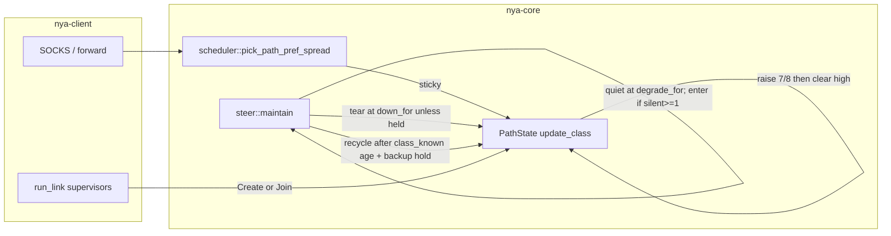

# Overlay algorithm completeness — second pass (post-3ecdabd soak)

| Field | Value |
| --- | --- |
| **Author** | nya-link-aggregation maintainers |
| **Date** | 2026-08-29 |
| **Status** | Draft |
| **Audience** | Senior engineers working in `nya-core` (`path.rs` `update_class`, `session/steer.rs` `maintain` / `maybe_recycle_outliers`, `health.rs`, tests in `path.rs` and `session/mod.rs`) |
| **Predecessor** | `docs/design-algorithm-completeness.md`, commit `3ecdabd` (“Close overlay holes found in the GZ–HK soak.”). Closed G1–G6 against log pack `20260829T0423Z`. This document does **not** re-litigate those fixes except to record what the new soak proved still works, and what residual holes they left. |
| **Lens** | 30-min generate_204 soak GZ–HK, binary `main` `3ecdabd`, log pack `nya-link-aggregation-logs-20260829T0910Z.tar.gz` (extracted `/tmp/nya-logs-0910/`, journals `/tmp/nya-jnl/client.journal` + `/tmp/nya-jnl/server.journal`). Two named links (`akcdn`, `soy`) × `connections=2`, both ~6–8 ms. Application 35051 ok / 1 curl-28 (0.003%). Overlay end-of-soak (client 09:08:40): `path_down=18 path_degraded=249 probe_miss=970 failbacks=0 session_all_down_resets=0 mig=111 hol=4 hedge=297 rtx=535 fb_slink=0 picks_unk=0 recycle=11 corr=0`. Used as a *lens* on the algorithm, **not** a target to fit. |
| **Compatibility** | No new TOML keys. `[session]` stays `ping_interval_min_ms` / `ping_interval_max_ms` / `all_down_timeout_ms` / `max_paths` with `#[serde(deny_unknown_fields)]`. Production algorithm path is one `Tuning::STANDARD` table; tests clone-and-mutate only. `PROTOCOL_VERSION` stays 1. No wire changes. `down_min_silence` / `ping_interval_*` / `unknown_degrade_min` / `interactive_max` / `class_drop_*` / `backup_rtt_*` / `failback_*` / `down_timeout_mult` are **not** retuned for the 7 ms path. Hybrid H2 enter stays at `down_for`; `ping_interval_max_ms` only affects quiet **membership**. H3’s serial 2 s recycle delay reuses `stable_up_hold`, it is not a new key. e2e impair stays outside TLS. |

---

## Overview

Commit `3ecdabd` closed six overlay holes (Join recreate, Create `path_name`, zero-load spread, class-drop pause, same-link outlier recycle, correlated-silence TCP hold, compact info scorecard). A second GZ–HK generate_204 soak on that binary confirmed each of those landings, then showed that two of them are operationally incomplete.

Class raise is specified as a 1 s continuous hold then one 7/8 store. `update_class` never clears `class_high_since` after the store, so after the first hold every Ping (~10 ms) does another 7/8. A 7 ms path becomes a 60 ms class in <200 ms of high samples and is recycled against a 7 ms sibling (`7×2+20 = 34` ms). That is H1.

Correlated silence is specified as N−1 of N≥3. The set is collected at `down_for` (~330 ms on a 7 ms path) on a 5 ms maintain tick. Paths’ `last_rx` are not synchronized, so sequential `down_for` crossings see N already 3, then 2, and tear independently. `corr=0` the entire soak while production still tore 3-of-4 at ~330 ms. Reconnects during the same delay freeze class on the 8th fast EWMA at 200 ms+ and recycle 1 s later. Those are H2 and H3.

This design closes H1–H3 without new operator knobs and without fitting formulas to 6–7 ms. Raise becomes a hold (clear `*high` after a successful 7/8, symmetric with drop). Correlated **membership** is collected at `degrade_for`; **enter / budget / `corr+=1`** only when that quiet set is N−1 of N≥3 **and** at least one member is already at `down_for`; tear stays at `down_for`; a known-RTT member of a correlated quiet set is held until `all_down_timeout`. Outlier recycle does not start its timer until class has been frozen for `cfg.tuning.stable_up_hold` (fail-closed: no timestamp, no recycle). Timeout-stable raise (`record_rtt` `high_since`) is left as “continuous after first hold” — that clock tracks a sustained delay for loss/down, which is a different job than class membership.

---

## Background & Motivation

### Current architecture (what we are not changing)

From `docs/ARCHITECTURE.md`: one overlay session, many TCP+TLS paths, streams sticky on one path. Scheduler:

1. Drop backups (`class > fastest × 2 + 20 ms`).
2. Restrict to the fastest class (`should_failback(candidate, best)` is false).
3. Score `class_rtt × load × 1024 + fast_rtt × load`, `load = 1 + inflight/bias + sticky`.

`steer` (5 ms tick): speculative migrate, failback, same-link HOL rebalance, G5 correlated silence, G4b outlier recycle. Timeouts from `Tuning::STANDARD` via `health.rs`. Operator TOML is only probe clamp, `max_paths`, `all_down_timeout`.

### Soak as a lens (not a fit target)

| Observation | What it is *not* | What it actually showed |
| --- | --- | --- |
| 35051 ok / 1 curl-28 (0.003%); TTFB ≥500 ms: 8; ≥1 s: 5; ≥3 s: 2 (YouTube 5046 ms, Cloudflare 5030 ms) | “overlay still loses 204s” | The two 5 s tails have `tls_ms ≈ ttfb` (Cloudflare 08:45:56 `tls_ms=5018`; YouTube 09:07:06 `tls_ms=5038`) and **no overlay event** in the surrounding 10 s (`path_down` stuck at 12 and 18 respectively). Origin, not an overlay hole. |
| failbacks=0, `fb_slink=0` | “failback is broken” | Both links ~6–8 ms, same class. `failback_abs` 8 ms floor. Correct. |
| `picks_unk=0` | “reopen G3” | Closed 204s drop sticky; info snapshots cannot prove spread. Do not reopen G3 without a new hole. |
| `kind="drop"` fires (soy#1 08:39:53, akcdn#0 08:39:57–58, soy 08:53:53–57, …) | “G4a pause did not land” | Drops fire instead of the old 7-minute grind. Works. |
| `recycle=11` | “G4b predicate is wrong” | Same-link backup vs sibling is the right predicate. Over-eager because of H1 (raise ratchet) and H3 (young high class), below. |
| `corr=0` the entire soak; `path_down=18` | “G5 did not land” | Same-tick N−1 predicate is in the binary (`steer.rs` L73) and `n4_three_silent_migrates_without_path_down` is green. Production tore 3-of-4 **sequentially** across ~165 ms (08:39:54), so the set was never exactly N−1 on one tick. Residual hole, not a revert. |
| `mig=111 hol=4 hedge=297 rtx=535` | “redesign hedge” | hedge/rtx 297/535 on 35k short 204s is consistent with unacked retry around `path_down`. 09:02:24 `akcdn#0` IO down: hedge 45→156 and rtx 115→235 in 10 s. No concrete bug in `maybe_speculative`. |
| Four paths alive, names `akcdn#0/#1 soy#0/#1` (no `init=`) | “G2 still names Create `init`” | Snapshots have no `init=`. Server HOL sibling naming is fixed. |
| Old client PID 3366936: six rounds of `join: handshake rejected: unknown session` after server bounce 08:37:52; new client PID 3413376 at 08:38:00 `session created path=akcdn#0` | “G1 recreate is still a hole” | Deploy window, **not** a remaining G1 bug. `will recreate` is 0 because the new process Created, it did not Join a dead id. Old Display is the old binary. |
| Scorecard keys `mig/hol/hedge/rtx/fb_slink/picks_unk/recycle/corr` on every 10 s info line | “put `metrics=` back” | G6 landed. Keep it. Do not reattach `metrics=`. |

Known 7 ms `down_for` is `down_min_silence + probe` ≈ 320+10 = **330 ms** (`steer.rs` `down_for`, `tuning.rs` `down_timeout`). Unknown-RTT uses `assumed_rtt = ping_interval_max * 2` then the same 320 ms floor + probe ≈ **370 ms** (`health.rs` `assumed_rtt`, test `unknown_down_grace_covers_200ms_first_pong`). `degrade_for` on a 7 ms known path is `ping_interval_max` = **50 ms** (`health.rs` `degrade_timeout`, test `degrade_covers_ping_max_on_fast_path`). None of H1–H3 is a reason to touch `ping_interval_*` or `down_min_silence`.

### What G1–G6 look like in this soak

| Gap | Status on `3ecdabd` | Residual |
| --- | --- | --- |
| **G1** recreate | Works on the new binary (`session created path=akcdn#0` at 08:38:00). | Old-binary leftover in the journal is deploy, not a hole. Do not reopen. |
| **G2** Create `path_name` | Snapshots have no `init=`. | None. |
| **G3** zero-load spread | `picks_unk=0`. | Closed 204s drop sticky so info snapshots cannot prove spread. Do not reopen without a new hole. |
| **G4a** class-drop pause | Drops fire (`kind="drop"`) instead of the old 7-minute grind. | None on the drop side. Raise is the dual hole (H1). |
| **G4b** outlier recycle | Fires (11 times). Predicate (UP + `class_known` + same-`link()` + `is_backup` vs sibling for `cfg.tuning.stable_up_hold`) is right. | Over-eager because of H1/H3. |
| **G5** correlated silence | Same-tick predicate is in the tree. `n4_three_silent_migrates_without_path_down` covers that case. | **`corr=0` the entire soak.** Sequential `down_for` crossings tear independently (H2). |
| **G6** info scorecard | All eight packed keys present. | Keep it. After H2, `corr` must increment on sequential N−1 **with someone at `down_for`**, not on 50 ms-only 3-of-4. Do not put `metrics=` back on info. |

### Pain points in code (cited)

- **H1.** `PathState::update_class` (`crates/nya-core/src/path.rs` L345–360): raise stores 7/8 when `class_high_since.elapsed() >= hold` and **does not** clear `*high`. Drop at L368–369 **does** clear `*low` and `*accum` after a successful store. After 1 s of continuous high, every subsequent Ping does another 7/8.
- **H2.** `Session::maintain` (`crates/nya-core/src/session/steer.rs` L63–108): `silent` is alive paths with `last_rx_ago() >= down_for(p)`; `correlated = alive.len() >= 3 && known_silent >= 1 && silent.len() == alive.len() - 1`; `tear = silent_this && (!rtt_known \|\| !correlated \|\| budget_elapsed)`. Maintain tick is 5 ms. `last_rx` is not synchronized. Sequential crossings never form the set.
- **H3.** `Session::maybe_recycle_outliers` (`steer.rs` L223–263): starts `outlier_since` as soon as `is_up() && class_known() && is_backup(class, sib)`. A new `PathState` freezes class on the 8th fast EWMA (`update_class` L319–333) during an ongoing delay, inits at 200 ms+, is immediately backup vs a 7 ms sibling, recycles 1 s later.

---

## Goals & Non-Goals

### Goals

- Close **H1–H3** with unit/session tests covering every named gap. Existing G1–G6 tests stay green.
- Keep a single production `Tuning::STANDARD`. Formulas stay RTT-adaptive. No new TOML or Tuning fields.
- Make `corr` a real production signal: sequential N−1 of N≥3 **with at least one path already at `down_for`** must enter correlated-silence, increment `correlated_silence`, and hold known-RTT TCP until `all_down_timeout`. Transient 3-of-4 at `degrade_for` only must **not** increment `corr`.
- Stop raise from singleton-classing a delay spike into a recycle. Stop recycle from eating a TCP whose class froze during the same delay that caused the reconnect.
- Update `docs/ARCHITECTURE.md` (Chinese) and `docs/OBSERVABILITY.md` for the three semantic changes. Commit this design as `docs/design-algorithm-completeness-2.md`. Add `nya-link-aggregation-logs-*.tar.gz` to `.gitignore` (not every `*.tar.gz`).

### Non-Goals

- New operator TOML knobs. Unknown `[session]` keys still deny.
- Retuning `ping_interval_min/max`, `down_min_silence` (320 ms), `unknown_degrade_min`, `interactive_max` (1500), `class_drop_*`, `backup_rtt_*`, `failback_*`, `down_timeout_mult` to the GZ–HK 6–7 ms path.
- Fitting class-drop thresholds or failback frac to soak histograms.
- Changing 7/8, `stable_raise_mult` / `stable_raise_add_us`, or `stable_up_hold`.
- Changing class init to min/median of 8 samples. `lucky_low_first_sample_does_not_freeze_class` is load-bearing.
- Redesigning hedge / rtx. No concrete bug in `maybe_speculative`.
- Packet-loss-inside-TLS in e2e. Impair harness still stalls outside TLS.
- Logging STREAM_DATA / ACK / Ping / Pong, or putting `metrics=` back on info.
- Changing HTTPS-204 bulk labeling.
- Bumping `PROTOCOL_VERSION`. No wire changes.
- Lengthening `all_down_timeout_ms` as a substitute for H2. Lengthening it still lengthens the correlated TCP hold; it does not make the same-tick predicate fire.

---

## Key Decisions

1. **Class raise clears `class_high_since` after a successful 7/8 store, symmetric with drop.** The hold is “continuous high for `stable_up_hold`, then one 7/8,” not “continuous high forever, 7/8 every sample after the first hold.” Any non-raise still clears high (jitter-low-tail must not singleton-class — keep `jitter_low_tail_does_not_singleton` / the raise-continuous-clear at `path.rs` L362). Tests with `stable_up_hold_us = 0` still ratchet every sample (`elapsed >= 0` after re-insert); that is why `confirmed_2_5x_raise_is_seven_eighths_not_assign` stays multi-step 7/8. Merge-gate unit test with **non-zero** hold: sample 1 does not store (hold not elapsed); after one hold, sample 2 stores 7/8; sample 3 immediately does not store; after a **second** hold, sample 4 stores again. Spikes are the soak case (one 7/8 + G4a drop can recover under backup). Sustained shifts are accepted: timeout-stable still ratchets so loss/down follow; all-path shifts lag scheduler class for a few seconds; one-path failback-but-not-backup stays a same-link HOL dest until class crosses `is_backup` (~4 extra holds on 8→80 ms). See H1 “Sustained shift.”

2. **Timeout-stable raise (`record_rtt` `high_since`, `path.rs` L286–311) is left as “continuous after first hold.”** That clock feeds loss/down. Tracking a sustained delay by keeping 7/8-ing stable RTT is a different job than class membership. Do **not** clear `high_since` after a stable store in this change set. Call it out in `ARCHITECTURE.md` so the two clocks are not “fixed” together later by accident.

3. **Correlated membership is `degrade_for`; enter/budget/`corr+=1` requires that set to be N−1 *and* at least one member already at `down_for`.** Quiet = alive with `last_rx_ago() >= degrade_for(p)`. Silent = alive with `last_rx_ago() >= down_for(p)`. `correlated ⇔ alive.len() ≥ 3 && known_quiet ≥ 1 && quiet.len() == alive.len() − 1 && silent.len() ≥ 1`. Tear stays at `down_for` (`tear = silent_this && (!rtt_known \|\| !correlated \|\| budget_elapsed)`). Once correlated, a known-RTT path that later reaches `down_for` is **held** (degrade + migrate stickies) until `all_down_timeout`, not torn. 3-of-4 merely past `degrade_for` (nobody at `down_for`) does **not** start an 8 s episode. Soak 08:39:54 still holds: A at 368 ms, B/C at 213/167 ms. Unknown-RTT still tears at `down_for`. All-N still tears at `down_for` (`n4_all_silent_tears`). N=1 / N=2 unchanged (`single_path_silence_still_downs_without_degraded`, `n2_both_silent_tears`, `n2_one_silent_downs`). Do **not** change `down_min_silence` (320 ms) or `all_down_timeout`. Existing same-tick `n4_three_silent_migrates_without_path_down` stays green. 3 independent 5-tuple deaths that *do* reach `down_for` while one path still RX are held — that is the G5 product choice, now sequential. `ping_interval_max_ms` affects **membership** (how early B/C join A’s quiet set), not enter.

4. **Outlier recycle does not start `outlier_since` until the path has been `class_known()` for `cfg.tuning.stable_up_hold`. Fail-closed: `class_known_since == None` means not aged, no recycle.** Recycle still uses `cfg.tuning.stable_up_hold` for the backup-hold, **not** `path.stable_up_hold_us`. Server still never recycles. Do not compare to the global fastest class. Do not recycle because a path would lose 1/N of new-stream picks (class score already loses). Record `class_known_since: Mutex<Option<Instant>>`, set via `note_class_known_now()` when the init window stores **and** from `inject_named`. Never clear until `PathState` is dropped (age from first freeze; a later raise on an old path does not re-wait the floor). Production serial delay is **2 s** for a path that is backup from freeze (1 s age floor + 1 s backup hold) — a deliberate product change, not a new TOML key. Do **not** change class init to min/median of 8 samples: a 246 ms init when all 8 samples are delayed is an honest reading; H2 + the young-class guard stop it from becoming a reconnect loop.

5. **One production `Tuning::STANDARD`. No new TOML.** H1 hold remains `PathState.stable_up_hold_us` (tests store ~50 ms). H2 budget remains `all_down_timeout`; enter remains `down_for` (hybrid). H3 age floor and G4b backup-hold both remain `cfg.tuning.stable_up_hold` (tests clone that field to 0 / 50 ms). Lengthening `all_down_timeout_ms` still lengthens correlated TCP hold. Tightening `ping_interval_max_ms` makes B/C join the quiet set earlier; it does **not** start the episode. Do not lower `ping_interval_max_ms` to “fix” `corr`.

6. **Hedge/rtx is not in this change set.** 297/535 on 35k short 204s matches unacked retry around `path_down` (09:02:24 `akcdn#0` IO down → hedge 45→156 in 10 s). No concrete bug in `maybe_speculative`. Failbacks=0 is correct.

7. **Info snapshot grammar is unchanged.** Keep `mig/hol/hedge/rtx/fb_slink/picks_unk/recycle/corr`. After H2, `corr` increments on the rising edge of the **hybrid** predicate (quiet N−1 **and** `silent.len() >= 1`), not on 3-of-4 at 50 ms. Rare-event `info!("correlated silence")` logs both `quiet` (degrade_for set) and `silent` (down_for set) so a soak can see the stagger (`silent` may be 1 when `quiet` is already N−1). Do not reattach `metrics=`. `n_counter` stays 50.

8. **Log packs are not source artifacts.** `.gitignore` currently lists `*.log` only. Packs `nya-link-aggregation-logs-20260829T0423Z.tar.gz` and `nya-link-aggregation-logs-20260829T0910Z.tar.gz` are untracked on `main` and **must not** be committed. Ignore `nya-link-aggregation-logs-*.tar.gz` in the docs-bearing PR — not every `*.tar.gz` (would hide cargo/vendor tarballs).

---

## Proposed Design

### Architecture (unchanged data path; class / silence / recycle clocks fixed)



### H1 — Class raise ratchets every sample after the first hold

#### Current

```345:360:crates/nya-core/src/path.rs
        if raise {
            *low = None;
            *accum = Duration::ZERO;
            let start = high.get_or_insert_with(Instant::now);
            if start.elapsed() >= hold {
                let new_us = (c_old * 7 + fast) / 8;
                self.rtt_class_us.store(new_us, Ordering::Relaxed);
                tracing::info!(
                    path = %self.name,
                    old_us = c_old,
                    new_us,
                    kind = "raise",
                    "class"
                );
            }
            return;
        }
```

Drop **does** clear after a successful store:

```363:378:crates/nya-core/src/path.rs
        if drop {
            let start = low.get_or_insert_with(Instant::now);
            if start.elapsed().saturating_add(*accum) >= hold {
                let new_us = (c_old * 7 + fast) / 8;
                self.rtt_class_us.store(new_us, Ordering::Relaxed);
                *low = None;
                *accum = Duration::ZERO;
                tracing::info!(/* kind = "drop" */);
            }
            return;
        }
```

Any non-raise still clears high at L362 (`*high = None`). That raise-continuous-clear is load-bearing: a jitter-low-tail must not freeze a raise.

#### Soak

```
08:42:16.174 soy#0 raise 8053 → 37805
08:42:16.174 soy#0 raise 37805 → 64061   (0.2 ms later)
08:42:16.181 soy#0 raise 64061 → 86538
08:42:16.514 soy#0 raise 86538 → 105884
08:42:20.567 soy#0 drop  105884 → 101765
08:42:21.488 outlier recycle class_us=101765
```

First 7/8: `(8053*7 + fast)/8 = 37805` ⇒ `fast ≈ 246 ms`. After 1 s of continuous high, class 7 ms → 37 ms on the first store, then 60 / 86 / 105 ms on the next Pings. Recycle because 101 ms > sibling×2+20 ms (7×2+20=34). Same cascade at 08:39:11 (7481→60319, recycle at 08:39:13), 08:40:01, 08:42:59, 09:03:00, 09:05:55.

H1 is not “recycle of a 37 ms class vs 7 ms.” `is_backup(37 ms, 7 ms)` is already true (37 > 34). The ratchet’s cost is that after the delay ends, drop cannot pull a 60–100 ms class back under the backup line in one `stable_up_hold`, so G4b fires on a 5-tuple that would have recovered. One 7/8 to ~37 ms plus G4a pause-drop (`37−7 = 30 > max(8, 0.25×37)`) returns class under 34 ms in one hold. The ratchet denies that recovery.

#### Fix

After a successful raise store, set `*high = None`:

```rust
        if raise {
            *low = None;
            *accum = Duration::ZERO;
            let start = high.get_or_insert_with(Instant::now);
            if start.elapsed() >= hold {
                let new_us = (c_old * 7 + fast) / 8;
                self.rtt_class_us.store(new_us, Ordering::Relaxed);
                *high = None; // NEW: one 7/8 per hold, symmetric with drop
                tracing::info!(
                    path = %self.name,
                    old_us = c_old,
                    new_us,
                    kind = "raise",
                    "class"
                );
            }
            return;
        }
        *high = None; // unchanged: any non-raise still clears
```

Do **not** change 7/8, `stable_raise_mult` (2), `stable_raise_add_us` (15_000), or `stable_up_hold` (1 s / `PathState.stable_up_hold_us`).

`stable_up_hold_us = 0` tests: after `*high = None`, the next sample `get_or_insert_with(Instant::now)` and `elapsed >= 0`, so they still ratchet every sample. `confirmed_2_5x_raise_is_seven_eighths_not_assign` (hold=0, 12 samples of 450 ms on a 180 ms class) stays multi-step 7/8, not assign-to-fast.

#### Timeout-stable raise is out of scope

```286:311:crates/nya-core/src/path.rs
        {
            let s_old = self.rtt_stable_us.load(Ordering::Relaxed);
            // ...
                    if start.elapsed() >= hold {
                        self.rtt_stable_us
                            .store((s_old * 7 + fast) / 8, Ordering::Relaxed);
                        // high_since NOT cleared — keep this
                    }
```

Leave it. Stable RTT drives `loss_timeout` / `down_timeout`. Continuous 7/8 after the first hold is how that clock follows a *sustained* delay without waiting another hold between steps. Class membership must not do the same thing, because class is the scheduler’s identity and G4b’s recycle input.

#### Sustained shift (accepted dual of the soak spike)

The soak argument (one 7/8 to ~37 ms plus G4a drop returns under 34 ms) is the *spike* case. Clearing `*high` also changes a **sustained** real RTT move:

| Case | After H1 | Why this is acceptable |
| --- | --- | --- |
| Spike on one 5-tuple, then fast recovers (soak 08:42:16) | One 7/8 per hold. G4a drop can pull ~37 ms back under `7×2+20=34` in one hold. | Chosen. The ratchet was the bug. |
| Sustained 8 ms→246 ms on **one** 5-tuple vs a 7 ms sibling | First store ≈37 ms, already `is_backup` (37 > 34). G4b recycles ~1 s later — same product as today, without the 60–100 ms overshoot. | Fine. |
| Sustained 8 ms→80 ms on **one** 5-tuple | First 7/8 ≈17 ms. `should_failback(17 ms, 8 ms)` is true (`failback_abs` 8 ms; 17−8 ≥ 8) so new-stream pick / `fastest_class_set` already leave it. **Not** backup (17 < 34). Today’s ratchet would hit backup in a handful of Pings after the hold and G4b could recycle ~1 s later. H1 needs ~4 additional holds (~5 s total) before `is_backup`. Until then the 80 ms TCP remains a same-link HOL / `backup_prefer_class` dest (`scheduler.rs` L508–511: same-link is always eligible if `is_schedulable()`). | Accepted. Failback already saves new streams after the first 7/8. HOL dest for a few extra seconds is cheaper than recycling a recovered 5-tuple. G4b still fires once class crosses backup. |
| **All four** paths move together (peer/routing) | No 7 ms sibling, G4b never fires. Class crawls 1 s per 7/8 (~5 s until `fast > class×2` fails: 246 ≯ 123×2). Score `class_rtt × load × 1024 + fast_rtt × load` lags on the 1024× class term. | Accepted. Timeout-stable **still ratchets**, so loss/down follow the delay. Class is membership, not the timeout clock. |

Do not “fix” this by also clearing timeout-stable `high_since` (Alternative C) or by shrinking `stable_raise_*` (fitting).

#### Tests (H1)

| Test | Where | Asserts |
| --- | --- | --- |
| `raise_store_clears_high_timer` | `path.rs` | `stable_up_hold_us ≈ 50 ms`; class 8 ms; fast ~200 ms (raise: 200 > 8×2 and 200 > 8+15). Sample 1: no store (hold not elapsed). Sleep ~50 ms, sample 2: stores 7/8 (`(8000×7+200000)/8 = 32000`). Sample 3 **immediately**: does **not** store. Sleep ~50 ms, sample 4: stores again (second hold; 200 > 32×2). Locks the 1-step-per-hold contract, not only “no immediate ratchet.” |
| `confirmed_2_5x_raise_is_seven_eighths_not_assign` | existing | hold=0 still multi-step 7/8. |
| `jitter_low_tail_does_not_singleton` | existing (scheduler) | still pass. |
| `class_hold_not_elapsed_does_not_store` | existing | still pass. |
| `drop_store_clears_accum` | existing | still pass (drop side unchanged). |

Do not require 1 s of wall clock. Mutate `path.stable_up_hold_us` like the other class tests.

---

### H2 — Correlated silence is same-tick exact N−1 of currently-alive, so sequential `down_for` crossings tear independently

#### Current

```63:108:crates/nya-core/src/session/steer.rs
        let alive: Vec<&Arc<PathState>> = paths.iter().filter(|p| p.is_alive()).collect();
        let silent: Vec<&Arc<PathState>> = alive
            .iter()
            .copied()
            .filter(|p| p.last_rx_ago() >= self.down_for(p))
            .collect();
        let known_silent = silent.iter().filter(|p| p.rtt_known()).count();
        let correlated = alive.len() >= 3 && known_silent >= 1 && silent.len() == alive.len() - 1;
        // rising edge: correlated_since, info!, correlated_silence++
        // ...
            let silent_this = ago >= self.down_for(p);
            let tear = silent_this && (!p.rtt_known() || !correlated || budget_elapsed);
```

`n4_three_silent_migrates_without_path_down` ages three of four to 400 ms on the **same** tick. Production never looks like that.

#### Soak 08:39:54 (`corr` stayed 0)

```
08:39:54.803 akcdn#0 silent down ago=368 ms down=367 ms
08:39:54.957 soy#0    silent down ago=367 ms down=365 ms   (+154 ms; N already 3)
08:39:54.968 soy#1    silent down ago=332 ms down=330 ms   (+11 ms)
```

At the first tear, soy#0 `last_rx_ago` ≈ 367−154 = **213 ms** and soy#1 ≈ 332−165 = **167 ms**: both past `degrade_for` (~50 ms) and both **short of** `down_for` (~330 ms). The remaining path (`akcdn#1`) still RX. Then reconnect storm 08:39:55–08:40:04: new TCPs init class at 246 ms / 214 ms, recycle, unknown-RTT tear at 373 ms (`akcdn#0` 08:40:02 `ago=373 down=370`), recycle soy#0 at 56 ms then 89 ms.

This is the G5 residual: the predicate is a set predicate on the **wrong threshold**, so it is operationally vacuous on unsynchronized `last_rx`.

#### Fix (algorithm, not a 7 ms retune)

Two jobs, two clocks. Do **not** glue them into one boolean.

1. **Set membership** — who is “going quiet,” so B/C at 213/167 ms join A at 330 ms: `degrade_for`.
2. **Episode enter** — `correlated_since`, `corr+=1`, 8 s budget start: only when that quiet set is N−1 **and** at least one member is already at `down_for`.

```
quiet       = alive with last_rx_ago() >= degrade_for(p)
silent      = alive with last_rx_ago() >= down_for(p)
known_quiet = count of quiet paths with rtt_known()

correlated ⇔
    alive.len() ≥ 3
    && known_quiet ≥ 1
    && quiet.len() == alive.len() − 1
    && silent.len() ≥ 1          // enter only once someone is actually at down_for

silent_this = last_rx_ago() >= down_for(p)                   // unchanged
tear        = silent_this && (!rtt_known || !correlated || budget_elapsed)  // unchanged
```

Quiet membership does **not** use `should_mark_degraded`’s in-flight-ping exception (a path with pending>0 && miss==0 can still be quiet). That is intentional: membership is “no RX for a probe cycle,” enter is “and someone has already hit the down clock.”

Once correlated, a known-RTT path that later reaches `down_for` is **held** (takes the else-if, `mark_degraded` + `maybe_speculative` restick) until `all_down_timeout`, not torn. Falling edge (`correlated` false) **clears** `correlated_since` (today L90–92); a path already past `down_for` then tears on that tick.

| Case | Behavior |
| --- | --- |
| N≥3, exactly N−1 quiet, ≥1 known-RTT in quiet, **≥1 already at `down_for`** | Enter correlated (`corr+=1`, budget starts). Known-RTT members at `down_for` degrade + migrate; TCP held until budget. Soak 08:39:54. |
| N≥3, exactly N−1 quiet, **nobody** at `down_for` (e.g. A/B/C at 80 ms, D fresh) | **Not** correlated. No `corr+=1`, no budget. Paths may still DEGRADE via existing `should_mark_degraded`. If they recover before `down_for`, no hold. |
| All-N quiet / all-N silent | **Not** correlated. Tear at `down_for` (`n4_all_silent_tears`). |
| N=1 | Tear at `down_for`, no `path_degraded++` (`single_path_silence_still_downs_without_degraded`). |
| N=2, one or both silent | Tear at `down_for` (`n2_one_silent_downs`, `n2_both_silent_tears`). First-pass draft table said `n2_both_silent_defers`; production and `3ecdabd` follow the formula (`alive.len() ≥ 3`). Do not reopen. |
| Unknown-RTT at `down_for` during a correlated episode | Tear. A newly dialed 5-tuple that never gets a first Pong must not hide behind the 8 s budget (`unknown_rtt_still_tears`). |
| Budget expiry | Tear the silent (down_for) known-RTT set; do not reset streams while an UP path remains (`correlated_budget_tears_silent_keeps_up`). |
| 3 independent 5-tuple deaths that *do* reach `down_for` while one path still RX | Held. That is the G5 product choice, now sequential. 50 ms-only 3-of-4 is **not** that product. |

Two-pass `maintain` shape is unchanged: expire, collect **quiet** and **silent**, then today’s if/else (`path_failed` **or** degrade). Immediate tears still do not increment `path_degraded`. G4b recycle still runs on remaining `is_up()` after this.

```mermaid
sequenceDiagram
  participant T as maintain 5ms
  participant A as akcdn#0
  participant B as soy#0
  participant C as soy#1
  participant D as akcdn#1
  Note over A,C: last_rx unsynchronized
  T->>A: ago=368 >= down_for
  T->>B: ago=213 >= degrade_for, < down_for
  T->>C: ago=167 >= degrade_for, < down_for
  T->>D: RX
  Note over T: quiet={A,B,C} N-1; silent={A} >= 1; enter correlated
  T->>A: hold (degrade + migrate), no path_failed
  Note over T: +154 ms
  T->>B: ago now >= down_for, still correlated, hold
  T->>C: ago now >= down_for, still correlated, hold
  Note over T: corr+=1; TCP alive until all_down_timeout
```

On a tick where A/B/C are at 80 ms and D is fresh: `quiet` is N−1 but `silent` is empty → **do not enter**. Budget does **not** start ~280 ms early. `ping_interval_max_ms` (fast-path `degrade_for`) only controls how early B/C join A’s set once A hits `down_for`. Do not lower `ping_interval_max_ms` to “fix” `corr`. Operators who raise `all_down_timeout_ms` still lengthen the hold.

Log on enter (once per episode, already info):

```rust
info!(
    alive = n,
    quiet = quiet.len(),
    silent = silent.len(),
    known_quiet,
    budget_ms = cfg.all_down_timeout.as_millis() as u64,
    "correlated silence"
);
```

`silent` is the down_for set (may be 1 when quiet is already N−1). That field is how a soak sees stagger. Soak greps `correlated silence` plus `corr=`. Transient 3-of-4 at 50 ms must **not** produce this line.

#### Mixed-version (unchanged from G5)

`spawn_path_io` EOF / read-error **break** at `path.rs` L516–522; `path_failed` is L581 after `framed.close()`. Same IO bypass as G5. Ship both binaries for a `corr` canary. A client-only canary will show no `corr` and the same mass `path_down`.

DEGRADED ping suppression (`path.rs` L553–556, “do not fill a silent pipe”) stays. Held paths do not Ping; recovery is peer-RX (`touch_rx`) or budget tear. Hybrid enter is what stops a 50 ms 3-of-4 from becoming an 8 s hold via that suppression. Do not reopen the G5 ping-suppression choice here.

#### Tests (H2)

Reuse `inject_named`, `age_rx`, `debug_maintain`. Default `SessionConfig` is enough (`degrade_for(7 ms) ≈ 50 ms`, `down_for(7 ms) ≈ 330 ms`). B/C at 80 ms are already DEGRADED by existing `should_mark_degraded` (`silence_without_ping_marks_degraded` uses 60 ms) — do **not** assert they are not DEGRADED. Speculative migrate of *their* stickies is existing, not H2.

| Test | Asserts |
| --- | --- |
| `n4_three_quiet_sequential_holds_until_budget` | Four known-RTT paths. Age A to 400 ms (`down_for`), B and C to 80 ms (`degrade_for` < ago < `down_for`), D fresh. Open a stream sticky on **A**. First `debug_maintain`: `path_down` **unchanged despite A being past `down_for`** (the distinguishing fact), `correlated_silence + 1`, sticky on A resticks (`migrates_speculative`). Do not require restick of B/C. Then `age_rx` B and C to 400 ms, second `debug_maintain`: still no `path_failed` on A/B/C, D remains. |
| `n4_three_quiet_no_down_for_does_not_hold` | Age A/B/C to ~80 ms, D fresh. `path_down` unchanged. **`correlated_silence` stays 0.** No `correlated silence` info. |
| `n4_quiet_recovers_before_down_for_tears` | Age A/B/C to ~80 ms, D fresh; `touch_rx` / `age_rx(0)` on B; then `age_rx` A to 400 ms. A **tears** (`path_down + 1`). Must not inherit a stale episode that never entered. |
| `n4_correlated_falling_edge_tears_silent` | Enter as in the sequential test (A=400, B/C=80). Then `touch_rx` on C (quiet no longer N−1). Next `debug_maintain`: `correlated_since` cleared; A (already past `down_for`) **tears**. |
| `n4_three_silent_migrates_without_path_down` | **existing** — same-tick 400/400/400 still green (those ages are also ≥ `degrade_for`, and `silent.len() >= 1`). |
| `n4_all_silent_tears` | **existing**. |
| `n2_both_silent_tears` / `n2_one_silent_downs` | **existing**. |
| `single_path_silence_still_downs_without_degraded` | **existing**. |
| `unknown_rtt_still_tears` | **existing**. |
| `correlated_budget_tears_silent_keeps_up` | **existing**. |

Do not add an e2e “stall the whole peer inside TLS.”

---

### H3 — Recycle of a freshly-inited high class during the same delay that caused reconnect

#### Current

```223:247:crates/nya-core/src/session/steer.rs
    fn maybe_recycle_outliers(&self) {
        let paths = self.path_list();
        let hold = self.inner.cfg.tuning.stable_up_hold;
        // ...
            if !p.is_up() || !p.class_known() {
                p.clear_outlier();
                continue;
            }
            // same-link min class among up + class_known
            if health::is_backup(&self.inner.cfg, p.class_rtt(), sib) {
                if p.mark_outlier() >= hold {
                    recycle.push(p.id);
                }
            } else {
                p.clear_outlier();
            }
```

Init freeze (`path.rs` L319–333): class stays 0 until 8 fast-EWMA samples, then stores `fast`. `lucky_low_first_sample_does_not_freeze_class` is why this is not min/median of 8.

#### Soak (after H2’s 08:39:54 tear, which H2 will mostly delete)

```
08:39:55.036 akcdn#0 path added (reconnect during delay)
08:39:57.313 akcdn#0 drop 246202 → 224526     // class froze at 246 ms
08:39:58.316 akcdn#0 drop 224526 → 201280
08:39:59.222 outlier recycle akcdn#0 class_us=201280
08:40:01.652 outlier recycle akcdn#0 class_us=214227
08:40:02.538 akcdn#0 silent down ago=373 down=370   // unknown-RTT floor
```

After H2 holds the original TCPs, this storm should mostly disappear. Residual: a new `PathState` that freezes class on the 8th fast EWMA during an ongoing delay (IO tear, all-N, unknown-RTT) inits at 200 ms+, is immediately backup vs a 7 ms sibling, recycles 1 s later, redials into the same delay.

#### Fix

Do **not** start `outlier_since` until the path has been `class_known()` for at least `cfg.tuning.stable_up_hold`. **Fail-closed:** `class_known_since == None` means not aged — no recycle. Forgotten init-window store must not make H3 a no-op while tests still pass.

```rust
// PathState (with_writers, next to outlier_since):
class_known_since: std::sync::Mutex::new(None),

pub(crate) fn note_class_known_now(&self) {
    *self.class_known_since.lock().unwrap() = Some(Instant::now());
}
pub(crate) fn backdate_class_known(&self, age: Duration) { /* test */ }
pub(crate) fn backdate_outlier(&self, age: Duration) { /* test */ }

// update_class init window, after rtt_class_us.store(fast):
self.note_class_known_now(); // then return — does not take class_high_since

// inject_named, after rtt_class_us.store(...):
p.note_class_known_now();

// maybe_recycle_outliers, after the is_up / class_known check:
let aged = match *p.class_known_since.lock().unwrap() {
    Some(t) => t.elapsed() >= hold,
    None => false, // fail-closed: no timestamp, no recycle
};
if !aged {
    p.clear_outlier();
    continue;
}
// existing same-link is_backup hold, still cfg.tuning.stable_up_hold
```

**Lifecycle**

| Event | `class_known_since` |
| --- | --- |
| `PathState::with_writers` | `None` |
| Init window 8th sample (`update_class` L319–333) | `note_class_known_now()` → `Some(now)` |
| `inject_named` (stores `rtt_class_us` directly) | `note_class_known_now()` so hold=0 recycle tests still fire (`elapsed >= Duration::ZERO`) |
| Raise / drop 7/8, DEGRADED↔UP (`touch_rx` L207–212), `clear_outlier` | **Unchanged.** Age from first freeze. A later 246 ms raise on an old path does not re-wait the floor. |
| `PathState` dropped | gone |

**Lock order.** Do **not** insert `class_known_since` into `path.rs` L341 (`class_high_since`, `class_low_since`, `class_low_accum`):

- Init window: store `rtt_class_us`, lock **only** `class_known_since`, return before L341.
- Raise/drop: lock order stays `class_high_since` → `class_low_since` → `class_low_accum`. Does not take `class_known_since` or `outlier_since`.
- `maybe_recycle_outliers` (maintain thread): lock `class_known_since` (read), then `outlier_since` via `mark_outlier` / `clear_outlier`. Never holds the class-high/low/accum trio.

**Who calls `note_class_known_now`.** Production: init window only. Tests: `inject_named` (covers `outlier_recycle_same_link_client` / `_not_on_server` / `_ignores_other_link` — they overwrite `rtt_class_us` after inject; the timestamp stays). `scheduler.rs` tests that store class directly do **not** recycle and do **not** need the helper. Path.rs class unit tests do not recycle.

Keep “do not read `path.stable_up_hold_us`” — `outlier_recycle_same_link_client` still stores `1_000_000_000` there; that remains load-bearing.

Production serial delay is **2 s** (`stable_up_hold` + `stable_up_hold`) for a path that is backup from freeze. Deliberate product change, not a TOML key. One extra drop 7/8 on a 246 ms init (246→~216), still backup vs 7 ms, still recycles — G4b remains the hammer for an honestly rotten 5-tuple. The age floor stops starting the backup timer during the 8-sample window / the same delay that caused the reconnect.

Do **not**:

- Change class init to min/median of 8 samples.
- Recycle vs the global fastest class.
- Recycle because the path would lose 1/N of new-stream picks.
- Read `path.stable_up_hold_us`.
- Recycle on the server (`is_client` gate stays).
- Fail-open (`None => aged`). That makes a forgotten init store a silent production no-op.

#### Tests (H3)

“First tick does not recycle” is **true today** without H3 (`mark_outlier()` returns `elapsed ≈ 0` unless `hold == 0`). It is **not** the merge gate.

| Test | Asserts |
| --- | --- |
| `outlier_recycle_young_class_waits_hold` | Client, `tuning.stable_up_hold = 50 ms`. `inject_named` soy#0 class 227 ms, soy#1 class 7 ms (`inject_named` already notes known). **Merge gate is two-phase, via `backdate_class_known` / `backdate_outlier` (no 100 ms sleep required):** (1) `note_class_known_now()` + `debug_maintain` → no recycle **and** `outlier_since` still `None` (age floor called `clear_outlier`). (2) `backdate_class_known(50 ms)` + maintain → still no recycle (backup timer *starts* now). (3) `backdate_outlier(50 ms)` + maintain → recycle (`path_outlier_recycle + 1`, soy#0 gone). Without H3, step (2) already recycles. |
| `class_init_window_notes_known_since` | `path.rs`. Fresh path, 7× `record_rtt` → `class_known_since` still `None`. 8th sample → `Some`. Fail-closed: a path that never froze must not recycle. |
| `outlier_recycle_same_link_client` | **existing** — `stable_up_hold = 0`; `inject_named` now notes known; age floor 0; still fires on first tick. |
| `outlier_recycle_not_on_server` | **existing**. |
| `outlier_recycle_ignores_other_link` | **existing**. |
| `lucky_low_first_sample_does_not_freeze_class` | **existing**. |

---

### Observability (G6 residual)

No new counters. `n_counter == 50` stays. Packed info keys stay.

After H2, a sequential 08:39:54-shaped event must:

- `info!(… "correlated silence")` once on **hybrid enter** (quiet N−1 **and** `silent.len() >= 1`), with `quiet` / `silent` / `alive` / `known_quiet` / `budget_ms`
- `corr` increment by 1 on the next 10 s snapshot
- **not** jump `path_down` by 3 at 330 ms

3-of-4 at `degrade_for` with nobody at `down_for` must **not** increment `corr` and must **not** emit the info line. Transient 50 ms quiet is not a production signal.

`docs/OBSERVABILITY.md` decision-point table already lists `correlated silence` as info. Update it to: membership is `degrade_for`, enter is hybrid (`silent.len() >= 1`); sequential N−1 with someone at `down_for` increments `corr`; same-tick N−1 still does.

Class raise/drop stay info. Init stays debug.

---

## API / Interface Changes

No public API, no wire, no TOML.

### `PathState`

```rust
// with_writers, next to outlier_since:
class_known_since: std::sync::Mutex::new(None),

pub(crate) fn note_class_known_now(&self);      // init window + inject_named
pub(crate) fn backdate_class_known(&self, age: Duration); // tests
pub(crate) fn backdate_outlier(&self, age: Duration);     // tests
#[cfg(test)]
pub(crate) fn outlier_since_for_test(&self) -> Option<Instant>; // peek: None after age-floor clear
```

Never cleared except `PathState` drop. `mark_outlier` / `clear_outlier` unchanged and do **not** touch `class_known_since`. `update_class` raise branch: `*high = None` after 7/8 store. Init window calls `note_class_known_now()` then returns (does not take `class_high_since`).

### `Session::maintain`

Quiet set at `degrade_for`. Enter / `correlated_since` / `corr+=1` only when `quiet.len() == alive.len()-1 && known_quiet >= 1 && silent.len() >= 1`. Tear formula unchanged. Log fields add `quiet` / `known_quiet`; `silent` stays the down_for set.

### `Session::maybe_recycle_outliers`

Age floor on `class_known_since` before `mark_outlier` (`None => not aged`). Hold constant remains `cfg.tuning.stable_up_hold`.

### TOML / Tuning / proto

**None.** `SessionOpts` still four keys (`cfg.rs` L131–137). `PROTOCOL_VERSION` stays 1.

---

## Data Model Changes

No durable store, no wire. In-memory only: `PathState.class_known_since` (`None` until init freeze / `inject_named`; never cleared). `class_high_since` semantics change (cleared after raise store). `Inner.correlated_since` rising edge stays “N−1 with someone at `down_for`” but **membership** of that N−1 is the `degrade_for` quiet set — same field, same enter clock as G5, sequential set.

Migration: rolling deploy. H1 is local to each process. H2 mixed-version: any old peer still tears via IO EOF; `corr` stays 0 until both sides are new (same as G5). H3 is client-only (server never recycles).

---

## Alternatives Considered

### H1 class raise

| Alternative | Trade-off |
| --- | --- |
| **A. Clear `*high` after 7/8 store (chosen)** | Dual of drop. One 7/8 per hold. No new constant. hold=0 tests still ratchet. Sustained all-path / failback-but-not-backup lag is accepted (see H1 “Sustained shift”). |
| B. Require a new hold constant / count K samples between 7/8s | Hidden K. Forbidden. |
| C. Also clear `record_rtt` `high_since` after stable 7/8 | Timeouts would lag a sustained delay. Different job; leave stable raise alone. Not a substitute for the scheduler-identity cost of one 7/8 per hold. |
| D. Shrink `stable_raise_mult` / add so 7 ms paths do not raise on a 246 ms spike | Fitting to GZ–HK. Forbidden. The spike *should* raise, once per hold. |
| E. Assign class to fast after hold instead of 7/8 | Rejected by `confirmed_2_5x_raise_is_seven_eighths_not_assign`. Chatter. |

### H2 correlated quiet

| Alternative | Trade-off |
| --- | --- |
| A. Quiet set at `degrade_for`, **enter also at `degrade_for`** | Sequential N−1 is visible at ~50 ms, but 3-of-4 independent probe misses start an 8 s episode and increment `corr` on jitter. Rejected. |
| **B. Hybrid: quiet at `degrade_for`, enter only if `silent.len() >= 1` (chosen)** | Soak 08:39:54 still holds (A at 368, B/C past degrade). 3-of-4 at 80 ms with nobody at 330 does **not** enter. `ping_interval_max_ms` is membership only. Zero new knobs. Same-tick test stays green. |
| C. Widen `down_for` / lower `down_min_silence` so 154 ms stagger still lands in one tick | Fitting the 7 ms path. Forbidden. Also makes independent 5-tuple death slower. |
| D. Windowed set: union of paths that crossed `down_for` in the last W ms | Hidden W. HashMap iteration plus a time window is a new clock. Hybrid uses clocks that already exist. |
| E. Correlate at N−1 **or more** (include all-N) | All-N blackhole would hold TCP 8 s; `blackhole_all_5s` p99 is worse than reconnect. `n4_all_silent_tears` stays. |
| F. N=2 both-silent defer (first-pass draft table) | Production `n2_both_silent_tears` follows `alive.len() ≥ 3`. Two-path sessions must still detect a dead 5-tuple. Do not reopen. |
| G. Lengthen `all_down_timeout_ms` | Does not make the same-tick predicate fire. Only lengthens a hold that never starts. |

### H3 young-class recycle

| Alternative | Trade-off |
| --- | --- |
| **A. Do not start `outlier_since` until `class_known` for `stable_up_hold`; fail-closed (chosen)** | Serial 2 s in production (deliberate delay, not a TOML key). Forgotten init store cannot silently disable H3. `inject_named` calls `note_class_known_now` so hold=0 tests still fire. |
| B. Overlap: start `outlier_since` immediately, require `class_known_since >= hold` at fire | First tick still blocked (good), but a 246 ms freeze that is backup from t=0 recycles at 1 s (same as today). Weaker against reconnect-during-delay. |
| F. Fail-open `None => aged` | Forgotten init-window store makes H3 a production no-op while tests still pass. Rejected. |
| C. Freeze class as min/median of 8 samples | Breaks `lucky_low_first_sample_does_not_freeze_class`. A lucky-low first Pong would singleton-class every sibling onto it. A 246 ms init of 8 delayed samples is honest. |
| D. Do not recycle until class has 7/8-dropped at least once | A persistently 246 ms 5-tuple would never recycle. G4b exists because 7/8 from 246→7 is ~16 holds. |
| E. Compare to global fastest class | Would redial a slower named link. Rejected in G4b; do not reopen. |

---

## Security & Privacy Considerations

- No new wire fields, no new listen address, no new log payload beyond `quiet` / `known_quiet` on an existing rare info event.
- Path names (`soy#0`) and class microseconds are existing surface.
- Recycle still tears a TCP the client already owns; the supervisor redials. No change to Create/Join auth.
- Correlated hold keeps TCPs alive during a peer stall. Mixed-version: old peer EOF still tears (availability, not a new trust boundary). An attacker who can stall three of four 5-tuples already can stall the overlay; holding TCP until `all_down_timeout` is the same give-up the operator already configured.

---

## Observability

| Question | Probe at default info after this work |
| --- | --- |
| Did raise ratchet? | `class` info: at most one `kind="raise"` per `stable_up_hold` per path. Soak-style 0.2 ms double-raise is a bug. |
| Did sequential N−1 hold TCP? | `correlated silence` info with `quiet=3, silent=1, alive=4` then `silent=3`; `corr+=1`; `path_down` does **not** jump by 3 at 330 ms. 3-of-4 at 50 ms with `silent=0` must **not** increment `corr`. |
| Did a young 246 ms class recycle in one hold? | `outlier recycle` must not fire until class has been known for `stable_up_hold` **and** backup for another `stable_up_hold` (serial 2 s). `recycle=` on the 10 s snapshot. |
| Did Join recreate after a bounce? | unchanged: `unknown session, will recreate` + `handshake_create_ok` |
| Are 204s pinned to one TCP? | unchanged: do not infer from closed-204 `st=` |
| Did we speculatively migrate at degrade? | `mig=` on the 10 s snapshot (unchanged packed counter) |

Alerting (optional, not in-tree): `nya_correlated_silence_total` should be **non-zero** on a 30 min GZ–HK soak that still has 3-of-4 **`down_for`** events with one path RX. A soak with `corr=0` and clustered `path silent, marking down` 150 ms apart is this bug still open. Do **not** alert on `corr` from 50 ms-only 3-of-4 — hybrid enter forbids that line.

---

## Rollout Plan

- **Feature flags:** none. Behavior changes are the algorithm.
- **Deploy order:** **Ship both binaries** for an H2 / `corr` canary (EOF bypass, same as G5). H1 and H3 are local to each process; client-only H3 is enough (server never recycles). H1 is useful on the server too (server class raise currently ratchets the same way and feeds HOL / backup_prefer).
- **Staged:** canary one GZ–HK pair **with both client and server**. Watch: `corr >= 1` during a stall without `path_down += N` at 330 ms; at most one `kind="raise"` per second per path; `recycle` not clustered on reconnect-during-delay; failbacks still ~0 on equal-class links; info snapshot size unchanged.
- **Rollback:** revert the PR. No TOML to undo.
- **Prefer one combined change set** (like `3ecdabd`). Do not soak-canary an H1-only or H2-only binary.
- **Risks**

| Risk | Sev | Mitigation |
| --- | --- | --- |
| Three independent 50 ms probe misses look correlated | Low | Hybrid enter: `silent.len() >= 1` required. Test `n4_three_quiet_no_down_for_does_not_hold`. 50 ms 3-of-4 may still DEGRADE (existing); it does not start the 8 s budget or increment `corr`. |
| 3 independent 5-tuple deaths that reach `down_for` while one RX are held | Low | G5 product, now sequential. Documented. Not a 50 ms-only hold. |
| `ping_interval_max_ms` affects quiet membership | Low | Membership only, not enter. Do not lower it to “fix” `corr`. Document in examples/TOML comment if operators already read `all_down_timeout` coupling. |
| H1 first 7/8 of 8 ms + 246 ms fast is already ~37 ms (`is_backup` vs 7 ms) | Med | Without the ratchet, G4a drop returns under 34 ms in one hold. With the ratchet it cannot. Test `raise_store_clears_high_timer` (including second hold stores). |
| H1 sustained 8→80 ms stays HOL dest ~5 s | Low | Accepted. `should_failback` already removes it from new-stream pick after the first 7/8. See H1 “Sustained shift.” |
| Young 246 ms class still recycles after 2 s | Low | Intended: honest high class vs 7 ms sibling is G4b. Serial 2 s is a deliberate product delay, not a TOML change. H2 removes most of those inits. |
| Forgotten `class_known_since` store | Med | Fail-closed (`None => not aged`) + `class_init_window_notes_known_since`. |
| One-sided H2 canary looks like a no-op (`corr=0`) | Med | Ship both; EOF bypass documented (G5). `path_failed` is `path.rs` L581 after close. |
| Lengthening `all_down_timeout_ms` lengthens silent TCP hold | Low/Med | Already operator coupling from G5; unchanged. |

---

## Open Questions

None that block implementation. Product forks are decided in Key Decisions (clear high after raise 7/8; leave timeout-stable raise; hybrid enter at `down_for` with quiet membership at `degrade_for`; fail-closed class-known age floor; serial 2 s recycle delay; no hedge redesign; no TOML).

If a follow-up wants timeout-stable raise to also clear `high_since` after 7/8, it is a separate design with loss/down tests — not this PR.

---

## Test plan (every named gap)

All production-path tests use `Tuning::STANDARD`. Short holds / `all_down_timeout` only via clone-and-mutate.

| Gap | Unit | Session | e2e |
| --- | --- | --- | --- |
| H1 | `raise_store_clears_high_timer` (non-zero hold: sample 1 no store, sample 2 stores, sample 3 immediate no store, sample 4 after second hold stores); existing raise/drop/jitter tests | — | — |
| H2 | — | `n4_three_quiet_sequential_holds_until_budget` (A past `down_for`); `n4_three_quiet_no_down_for_does_not_hold` (`corr` stays 0); `n4_quiet_recovers_before_down_for_tears`; `n4_correlated_falling_edge_tears_silent`; existing `n4_three_silent_migrates_without_path_down`, `n4_all_silent_tears`, `n2_*`, `single_path_silence_still_downs_without_degraded`, `unknown_rtt_still_tears`, `correlated_budget_tears_silent_keeps_up` | no inside-TLS stall |
| H3 | `class_init_window_notes_known_since` | `outlier_recycle_young_class_waits_hold` (two-phase: no recycle after 1×hold, recycle after 2×hold); existing `outlier_recycle_same_link_client` / `_not_on_server` / `_ignores_other_link` | — |

Existing tests that must stay green: `jitter_low_tail_does_not_singleton`, `one_low_sample_does_not_collapse_class`, `class_hold_not_elapsed_does_not_store`, `single_non_drop_pauses_low_timer`, `drop_store_clears_accum`, `lucky_low_first_sample_does_not_freeze_class`, `n4_three_silent_migrates_without_path_down`, `n4_all_silent_tears`, `n2_*`, `single_path_silence_still_downs_without_degraded`, `unknown_rtt_still_tears`, `outlier_recycle_same_link_client`, `outlier_recycle_not_on_server`, `outlier_recycle_ignores_other_link`, `confirmed_2_5x_raise_is_seven_eighths_not_assign`.

CI: `fmt`, `clippy`, `cargo test --exclude nya-e2e`, plus `nya-e2e` lib/bin as today. Full matrix local/nightly. e2e matrix is not a merge gate unless a scenario that already exists would regress (none identified).

---

## Docs to update (in the implementing PR, not only this design)

- `docs/ARCHITECTURE.md` (Chinese): class raise is one 7/8 per hold (timeout-stable is **not** the same clock); correlated **membership** is `degrade_for`, **enter** requires someone at `down_for`; recycle waits `stable_up_hold` after class init then another `stable_up_hold` of backup (serial 2 s).
- `docs/OBSERVABILITY.md`: `corr` increments on sequential N−1 **with `silent.len() >= 1`**; 50 ms-only 3-of-4 does not; `correlated silence` info fields include `quiet` / `silent`. Do not put `metrics=` back.
- This document lands as `docs/design-algorithm-completeness-2.md`.
- `.gitignore`: add `nya-link-aggregation-logs-*.tar.gz` (currently only `*.log`). Workspace currently has untracked `nya-link-aggregation-logs-20260829T0423Z.tar.gz` and `nya-link-aggregation-logs-20260829T0910Z.tar.gz` — do not add them. Do **not** ignore every `*.tar.gz`.

---

## References

- `docs/design-algorithm-completeness.md` — G1–G6, commit `3ecdabd`.
- `docs/ARCHITECTURE.md` — overlay model, class clocks, correlated N−1, same-link recycle.
- `docs/OBSERVABILITY.md` — snapshot grammar, class raise/drop info, `corr`.
- `crates/nya-core/src/path.rs` — `update_class` L317–383, `record_rtt` stable raise L286–311, init window L319–333.
- `crates/nya-core/src/session/steer.rs` — `maintain` L42–221, correlated L63–108, `maybe_recycle_outliers` L223–263, `maybe_speculative` L295–388, `degrade_for` / `down_for` L670–685.
- `crates/nya-core/src/health.rs` — `degrade_timeout` L104–119, `down_timeout` L17–19, `is_backup` L33–38, `assumed_rtt` L69–80.
- `crates/nya-core/src/tuning.rs` — `Tuning::STANDARD` (`down_min_silence=320ms`, `stable_up_hold=1s`, `stable_raise_mult=2`, `backup_rtt_mult=2` + 20 ms).
- `crates/nya-core/src/cfg.rs` — `SessionOpts` four keys, `deny_unknown_fields`.
- `crates/nya-core/src/session/mod.rs` — `inject_named` / `age_rx` / `debug_maintain` tests L1729–2003.
- Soak: `/tmp/nya-jnl/client.journal`, `/tmp/nya-logs-0910/…/results/204-soak/`.

---

## PR Plan

Default is **one combined change set**, same as `3ecdabd` for G1–G6. H1/H2/H3 interact in the reconnect storm; `path.rs` is in all three; a soak canary needs all of them plus both binaries. A two-PR split is an optional incremental path if review wants smaller diffs — not the delivery default.

### PR 1 (default) — Combined: raise hold, hybrid correlate, age-gate recycle

- **Title:** `overlay: stop class-raise ratchet; correlate quiet at degrade_for; age-gate recycle`
- **Files:**
  - `crates/nya-core/src/path.rs` (`*high = None` after raise 7/8; `class_known_since` in `with_writers`; `note_class_known_now` / `backdate_*`; init-window store; tests `raise_store_clears_high_timer`, `class_init_window_notes_known_since`)
  - `crates/nya-core/src/session/steer.rs` (quiet set at `degrade_for`; hybrid enter `silent.len() >= 1`; log fields; `maybe_recycle_outliers` fail-closed age floor)
  - `crates/nya-core/src/session/mod.rs` (`inject_named` calls `note_class_known_now`; tests `n4_three_quiet_sequential_holds_until_budget`, `n4_three_quiet_no_down_for_does_not_hold`, `n4_quiet_recovers_before_down_for_tears`, `n4_correlated_falling_edge_tears_silent`, `outlier_recycle_young_class_waits_hold`)
  - `docs/ARCHITECTURE.md` (raise is one 7/8 per hold; timeout-stable is not; quiet = `degrade_for`; enter requires `down_for`; recycle serial 2 s after class init)
  - `docs/OBSERVABILITY.md` (`corr` on sequential N−1 with `silent.len() >= 1`; `quiet`/`silent` fields)
  - `docs/design-algorithm-completeness-2.md` (this document)
  - `.gitignore` (`nya-link-aggregation-logs-*.tar.gz`)
- **Dependencies:** none.
- **Changes:** H1 raise-clear; H2 hybrid predicate; H3 fail-closed age floor. No TOML, no `PROTOCOL_VERSION` bump, no `n_counter` change. Merge gate: the full “Test plan” table, including `raise_store_clears_high_timer` (four-sample / two-hold script — not “two lines”), the sequential N−1 hold, the 80 ms false-positive (`corr` stays 0), falling-edge tear, and the two-phase young-class recycle (no recycle after 1×hold, recycle after 2×hold). PR body: do not commit log packs.

### Optional split (if review wants smaller diffs)

Land both in the same release train. Do not soak-canary after the first alone.

**PR 1a — Class raise is a hold, not a ratchet**

- **Title:** `overlay: clear class-raise timer after 7/8 store`
- **Files:** `crates/nya-core/src/path.rs` (`*high = None` after store; `raise_store_clears_high_timer`); one sentence in `docs/ARCHITECTURE.md` that raise is one 7/8 per hold and timeout-stable is not (`ARCHITECTURE.md` L63 “尖刺时不跟着跳 class” already describes the intended world).
- **Dependencies:** none.
- **Changes:** H1 only. Merge gate: `raise_store_clears_high_timer` (sample 1 no store, 2 stores, 3 immediate no store, 4 after second hold stores) plus existing `confirmed_2_5x_raise_is_seven_eighths_not_assign`, `class_hold_not_elapsed_does_not_store`, `jitter_low_tail_does_not_drop_class`, `jitter_low_tail_does_not_singleton`. The work is the test script, not two assignment lines.

**PR 1b — Hybrid correlate; age-gate outlier recycle; remaining docs**

- **Title:** `overlay: correlate quiet at degrade_for; wait stable_up_hold after class init before recycle`
- **Files:** remaining `path.rs` (`class_known_since`), `steer.rs`, `session/mod.rs` (`inject_named` + H2/H3 tests), `ARCHITECTURE.md` (quiet/enter/recycle), `OBSERVABILITY.md`, this design, `.gitignore`.
- **Dependencies:** none compile-time; **ship in the same release as 1a**.
- **Changes:** Hybrid enter; fail-closed age floor; `inject_named` notes known. Merge gate: H2/H3 tests in “Test plan.”
