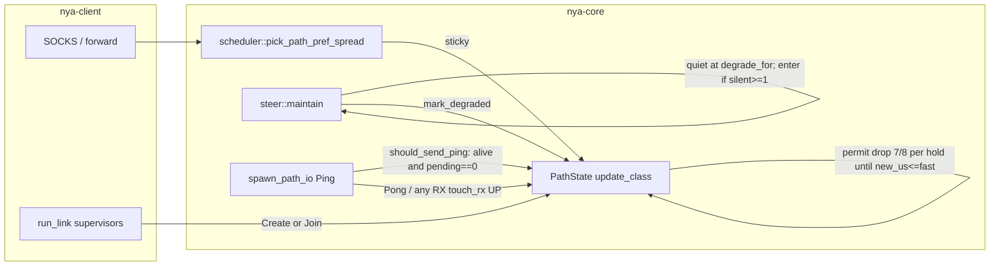
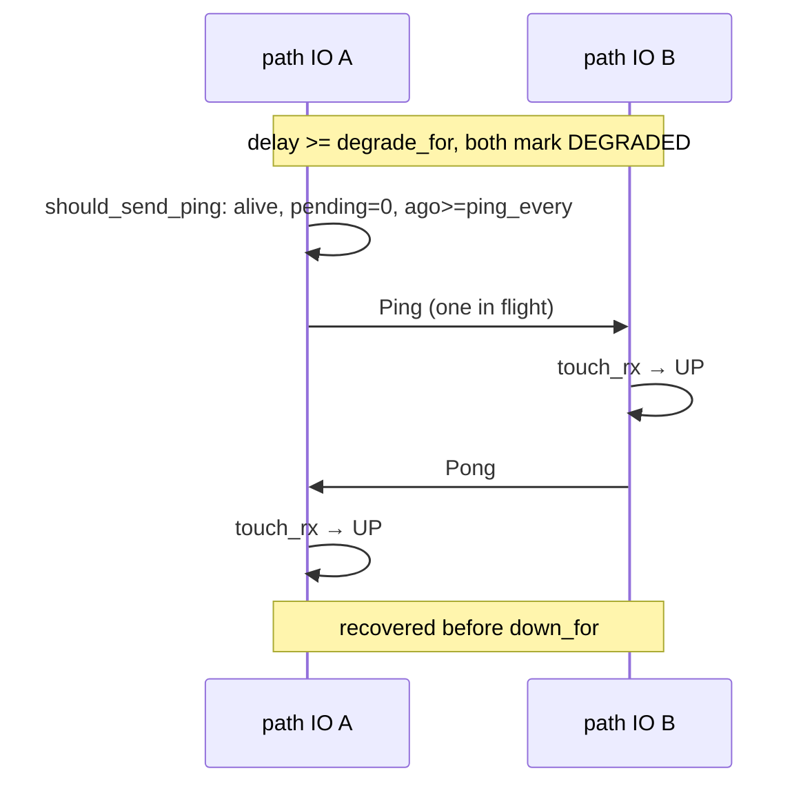

# Overlay algorithm completeness — third pass (post-27587fb soak)

| Field | Value |
| --- | --- |
| **Author** | nya-link-aggregation maintainers |
| **Date** | 2026-08-29 |
| **Status** | Draft |
| **Audience** | Senior engineers working in `nya-core` (`path.rs` `spawn_path_io` / `update_class`, `health.rs` `class_should_drop` via `Tuning`, `scheduler.rs` `path_score` / `fastest_class_set`, `session/steer.rs` `maintain`, tests in `path.rs` and `session/mod.rs`) |
| **Predecessor** | `docs/design-algorithm-completeness.md` (G1–G6, commit `3ecdabd`); `docs/design-algorithm-completeness-2.md` (H1–H3, commit `27587fb` “Stop class-raise ratchet; correlate sequential silence; age-gate recycle.”). This document does **not** re-litigate G1–G6 or H1–H3 except to record what the new soak proved still works, and what residual holes they left. |
| **Lens** | 30-min generate_204 soak GZ–HK, binary `main` `27587fb`, log pack `nya-link-aggregation-logs-20260829T1045Z.tar.gz` (extracted `/home/lyn/workspace/nya-link-aggregation/.local/logs-1045/`). Two named links (`akcdn`, `soy`) × `connections=2`, both ~6–8 ms. Application **36336 ok / 0 curl-28**. TTFB ≥500 ms: 0. Overlay end-of-soak (client PID 3452303, last snapshot 10:45:30Z): `path_down=1 path_degraded=68 probe_miss=265 failbacks=0 session_all_down_resets=0 mig=34 hol=0 hedge=53 rtx=100 fb_slink=0 picks_unk=0 recycle=0 corr=0`. Used as a *lens* on the algorithm, **not** a target to fit. |
| **Compatibility** | No new TOML keys. `[session]` stays `ping_interval_min_ms` / `ping_interval_max_ms` / `all_down_timeout_ms` / `max_paths` with `#[serde(deny_unknown_fields)]`. Production algorithm path is one `Tuning::STANDARD` table; tests clone-and-mutate only. `PROTOCOL_VERSION` stays 1. No wire changes. Do **not** retune `down_min_silence` / `ping_interval_*` / `unknown_degrade_min` / `interactive_max` / `class_drop_*` / `backup_rtt_*` / `failback_*` / `down_timeout_mult` / `stable_raise_*` / `stable_up_hold` to the GZ–HK 6–7 ms path. Do not redesign hedge. e2e impair stays outside TLS. Do not put `metrics=` back on info. Log packs `nya-link-aggregation-logs-*.tar.gz` stay gitignored; do not commit them. |

---

## Overview

Commit `27587fb` closed H1–H3 (raise is one 7/8 per `stable_up_hold`, correlated membership at `degrade_for` with hybrid enter at `down_for`, recycle age-gated on `class_known_since`). A third GZ–HK generate_204 soak on that binary confirmed each of those landings: one raise not a 0.2 ms cascade, `corr=0` on a single independent 5-tuple death, `recycle=0`, 0 curl-28 and 0 TTFB ≥500 ms. It also showed that two product assumptions they left in place are operationally incomplete.

H2 explicitly kept G5 ping suppression: DEGRADED/DOWN paths do not Ping (“do not fill a silent pipe”); recovery is peer-RX (`touch_rx`) or budget tear. `DOWN` already leaves `spawn_path_io`. `pending_ping_count() == 0` already admits at most one in-flight Ping. The `!path.is_up()` continue therefore only suppresses **DEGRADED**. When **both** sides are running and both degrade — idle path, no `STREAM_DATA`, generate_204 snapshots often `streams_live=0` — each side waits for the other to speak, neither does, and the 5-tuple tears at `down_for` as an independent death (N=1) or sits silent until `all_down_timeout` if held as N−1. That is **H4**. This idle-204 topology *can* hit it; this soak’s one `soy#1` silent-down at ~330 ms is **not** claimed as proof that H4 caused that tear (server tore the same 5-tuple at the same instant after clock alignment).

H1 made raise one 7/8 per hold, then clear `class_high_since`. Drop still requires `class − fast ≥ max(8 ms, 0.25 × class)`. One 7/8 toward a 2× spike yields `C' = 1.125 C`; recovered fast = `C`; gap = `0.125 C` which is strictly less than `0.25 × 1.125 C = 0.281 C`. The frac never unwinds one step. Soak server `soy#1`: one raise `7065 → 14048` µs at 10:16:40Z; recovered fast ~7 ms; gap 7.0 ms < **8 ms abs**; class stayed `7/6/14ms` on every snapshot from 10:16:49 through 10:20:49 (~4 min) until the 5-tuple died. `is_backup(14, 7)` is false (need >34). `should_failback(14, 7)` is false (need ≥8). `path_score` uses **raw** `class_rtt × load × 1024`, so a 14 ms class vs a 7 ms sibling is ~2× worse inside `fastest_class_set` (they are the same failback class). G3 exact-score spread never sees them as tied. G4b will not recycle. That is **H5** — the dual of H1.

This design closes H4–H5 without new operator knobs, without fitting formulas to 6–7 ms, and without changing `path_score` or `class_drop_*`. Ping while `is_alive()` (UP or DEGRADED); keep one in-flight Ping and the idle-gate on `last_rx`. Raise sets an in-memory unwind permit; drop is `class_should_drop || (permit && fast < class)`; G4a still one 7/8 per hold while permit is armed. **Do not clear the permit on a single non-raise `fast >= class` sample** — that is the raise/drop dead zone every EWMA recovery must cross (soak: ~25350 µs vs class 14048 after the 2× raise gate fails) and would abort the walk, leaving class at 14 ms. **Clear on a permit-drop store only when `new_us <= fast`** (integer 7/8 has met fast; happens when `c_old == fast + 1` because `(7(f+1)+f)/8 = f`). While `fast >= class` but no catch-up store yet, leave permit true and G4a-pause the low timer. After a raise, once fast has recovered below class, class 7/8-walks toward fast one hold at a time until `new_us <= fast`. Paths that never raised still need the 0.25/8 ms gate (jitter tests). Timeout-stable raise (`record_rtt` `high_since`) stays out of scope, same as H1. No new 1 ms Tuning constant.

---

## Background & Motivation

### Current architecture (what we are not changing)

From `docs/ARCHITECTURE.md`: one overlay session, many TCP+TLS paths, streams sticky on one path. Scheduler (`scheduler.rs` `fastest_class_set` L90–156, `path_score` L158–169):

1. Drop backups (`class > fastest × 2 + 20 ms`).
2. Restrict to the fastest class (`should_failback(candidate, best)` is false).
3. Score `class_rtt × load × 1024 + fast_rtt × load`, `load = 1 + inflight/bias + sticky`.

`steer` (5 ms tick): speculative migrate, failback, same-link HOL rebalance, H2 correlated silence, G4b outlier recycle. Timeouts from `Tuning::STANDARD` via `health.rs`. Operator TOML is only probe clamp, `max_paths`, `all_down_timeout`.

Class raise is already one 7/8 per `stable_up_hold` with `*high = None` after store (`path.rs` L349–365). Drop still pauses the low timer (G4a) and requires `Tuning::class_should_drop` (`tuning.rs` L174–178). Correlated membership is `degrade_for`; enter requires `silent.len() >= 1` (`steer.rs` L63–82). Recycle is fail-closed on `class_known_aged` (`steer.rs` L234–258).

### Soak as a lens (not a fit target)

Client started 10:14:00Z (PID 3452303, `session created path=soy#0` at 10:14:00.308). Server PID 9361 from 10:13:29Z. Clock skew GZ vs HK ≈ **15.2 s** — align events by pairing client silent-down `soy#1` 10:21:06.950 with server `path down path=soy#1` 10:20:51.748.

| Observation | What it is *not* | What it actually showed |
| --- | --- | --- |
| 36336 ok / 0 curl-28; TTFB ≥500 ms: 0. Google max 183 ms (was 344). YouTube/Cloudflare no ~5 s tails | “overlay is done” | H1–H3 landed. Previous 5 s tails were origin `tls_ms ≈ ttfb`. Residual holes are completeness, not SLA collapse. |
| failbacks=0, `fb_slink=0` | “failback is broken” | Both links ~6–8 ms, same class. `failback_abs` 8 ms floor. Correct. |
| `corr=0` the entire soak; `path_down=1` (`soy#1`, N=1 of 4, `ago=365ms down=364ms`) | “H2 did not land” | Hybrid enter correctly did **not** fire: `alive.len()≥3 && N−1` is false when N=1 of 4. Independent 5-tuple death. |
| `recycle=0` | “G4b/H3 is a no-op” | No reconnect storm. H1+H3. `is_backup(14 ms, 7 ms)` is also false, so H5’s stuck class would not have recycled even without H3. |
| `picks_unk=0` | “reopen G3” | Closed 204s drop sticky. Do not reopen G3 without a new hole. |
| One server `kind="raise"` `soy#1` 7065→14048 µs at 10:16:40Z; client had no raise info | “H1 ratchet still fires” | One 7/8, not the old 0.2 ms cascade. Residual: that 7/8 cannot unwind (H5). Snapshots 10:16:49–10:20:49: `soy#1=7/6/14ms` with recovered fast 7 ms, **no** `kind="drop"`. |
| `hedge=53` / `rtx=100` clustered on 10:17:00 (client `path_degraded` 4→21, `mig` 0→13, TTFB 100–150 ms at 10:16:54–58, 13 samples ≥100 ms) and 10:21:00 (`soy#1` death: `hedge` 22→48, `rtx` 41→83) | “redesign hedge” | Unacked retry around real delay / path_down. No concrete new bug in `maybe_speculative` (`steer.rs` L306–398). |
| `tls handshake eof` from `45.207.156.126` every ~70 s `suppressed=5–6` | “overlay path flap” | Extra SYNs to the listen port (CDN/scanner), not overlay paths. |
| Deploy window 10:13:29–10:14:00: old client PID 3413376 `unknown session, will recreate` then `session created`; new client 3452303 `session created path=soy#0` | “G1 still a hole” | Deploy, not a remaining G1 bug. |

Known 7 ms `down_for` is `down_min_silence + probe` ≈ 320+10 = **330 ms** (`steer.rs` `down_for` L685–696, `tuning.rs` `down_timeout` L138–141). Unknown-RTT `down_for` is **550 ms**, not 370 ms. Math: `rtt()`/`stable_rtt()` placeholder 20 ms, `assumed_rtt` = max(20, 20, `ping_interval_max * 2` = 100) = **100 ms** (`health.rs` L69–80); `probe_interval(100 ms)` = `ping_interval_max` = 50 ms; `down_timeout`: `5×100 + 50 = 550`, `min_silence = 320+50 = 370`, `clamp(550.max(370), 370, 5000) = 550`. In-tree comment at `steer.rs` L687–689 is “unknown 550ms → 510ms” (do not also feed `probe_interval_for` / `ping_min` into that probe term). 370 ms is only the floor when 5×RTT does not bind (known 7 ms). `degrade_for` on a 7 ms known path is `ping_interval_max` = **50 ms** (`health.rs` `degrade_timeout` L104–119). Unknown H4 window: degrade at `unknown_degrade_min` 300 ms, tear at 550 ms unless a Pong lands. None of H4–H5 is a reason to touch `ping_interval_*`, `down_min_silence`, `unknown_degrade_min`, or `class_drop_*`.

### What G1–G6 and H1–H3 look like in this soak

| Gap | Status on `27587fb` | Residual |
| --- | --- | --- |
| **H1** raise ratchet | Server `soy#1` **one** raise 7065→14048 µs at 10:16:40Z (`kind="raise"`), not the old 0.2 ms cascade. Client had no raise info. | One 7/8 cannot unwind (**H5**). |
| **H2** sequential correlate | `corr=0` the entire soak. Only 1 path_down (`soy#1`, N=1 of 4, `ago=365ms down=364ms`). Hybrid enter correctly did **not** fire. | None on this event. |
| **H3** young-class recycle | `recycle=0`. No reconnect storm. | None. |
| **G1** recreate | Deploy window 10:13:29–10:14:00: old client `unknown session, will recreate` then `session created`. Works. | Deploy, not a hole. |
| **G2** Create `path_name` | Snapshots have no `init=`. Names `akcdn#0/#1 soy#0/#1`. | None. |
| **G3** zero-load spread | `picks_unk=0`. | Do not reopen. |
| **G4a** drop pause | Drops not observed this soak (no high class to grind). | Drop gate cannot start (**H5**). |
| **G4b** outlier recycle | `recycle=0`. Predicate still `is_backup` vs same-link sibling. 14 ms vs 7 ms is not backup. | H5 walks class toward recovered fast so the 2× `path_score` loser shrinks without recycle. G4b still will not eat a same-class 14 ms path — that is correct. |
| **G5** ping suppression | Left in place by H2 design (“Do not reopen the G5 ping-suppression choice here”). | **H4.** |
| **G6** info scorecard | All eight packed keys present. End-of-soak line at 10:45:30Z is the grammar. | Keep it. Do not put `metrics=` back. After H4, a dual-degrade idle path must recover before `down_for`. After H5, a raise info must be followable by drop infos until a drop store’s `new_us <= fast`. |

### Soak events that are NOT holes

- failbacks=0: both links ~7 ms, same class. Correct.
- corr=0 with one independent 5-tuple death: correct (`alive.len()≥3 && N−1`).
- recycle=0: H1+H3, and 14 ms is not `is_backup` vs 7 ms.
- tls handshake eof from 45.207.156.126 every ~70s `suppressed=5–6`: extra SYNs to the listen port, not overlay paths.
- hedge=53 / rtx=100 clustered on 10:17:00 and 10:21:00. Unacked retry around real delay / path_down. No concrete new bug in `maybe_speculative`.
- 0 curl-28 / 0 TTFB≥500 ms: H1–H3 landed.
- soy#1 silent-down at 330 ms: **do not claim this soak proves H4 caused that tear**. Aligning clocks, server also tore soy#1 at the same instant — a real ~330 ms silence on that 5-tuple is the simpler reading. H4 is a first-principles hole that this idle-204 topology *can* hit, not a fit to this one death.

### Pain points in code (cited)

#### H4 — DEGRADED ping suppression

`crates/nya-core/src/path.rs` `spawn_path_io` ping arm L585–614:

```585:614:crates/nya-core/src/path.rs
                _ = tokio::time::sleep_until(next_ping) => {
                    if session.is_dead() || !path.is_alive() {
                        break;
                    }
                    let ago = path.last_rx_ago();
                    if ago >= ping_every && path.pending_ping_count() == 0 {
                        if !path.is_up() {
                            // DEGRADED/DOWN: do not fill a silent pipe (G5).
                            next_ping = tokio::time::Instant::now() + ping_every;
                            continue;
                        }
                        let ping = path.next_ping();
                        // ...
                    } else if ago < ping_every {
                        // Idle-gate the send; keep the deadline on last_rx.
                        next_ping = tokio::time::Instant::now()
                            + ping_every.saturating_sub(ago);
                    } else {
                        // pending > 0 and still silent.
                        next_ping = tokio::time::Instant::now() + ping_every;
                    }
                }
```

`is_alive()` is UP or DEGRADED (`path.rs` L154–157). The loop already exits on `!path.is_alive()` (L538–540 and L586–588). `path_failed` swaps `STATE_DOWN` then removes the path (`session/mod.rs` L266–285). DOWN never reaches the ping arm. The `pending_ping_count() == 0` gate already admits at most one **in-flight overlay** Ping. That is not a bound on kernel TCP occupancy and not “zero bytes”: after `expire_stale_pings(loss_timeout)` on the 5 ms tick (`steer.rs` L52–60), pending returns to 0 and the arm fires again. G5/H2 held paths therefore never probe; recovery is peer-RX (`touch_rx` L210–216) or budget tear. TX does **not** `touch_rx` (`note_tx` L275–277).

Cascade (algorithm, RTT-adaptive, not 7 ms-specific):

1. One-way delay ≥ `degrade_for` (fast path = `ping_interval_max`; 60 ms path = 2×RTT, `health.rs` `degrade_stays_2x_on_60ms`). Receiver marks DEGRADED (`steer.rs` L123–141, `should_mark_degraded`), stops pinging.
2. The other side’s last_rx was those pings. It too ages to `degrade_for`, degrades, stops pinging.
3. Idle path (no `STREAM_DATA`; generate_204 snapshots often `streams_live=0`): both silent. Tear at `down_for` as an independent 5-tuple (N=1), or hold 8 s if N−1 (and then still never recover if both sides suppressed).
4. Unknown-RTT new TCP: `unknown_degrade_min` 300 ms then suppress, never first Pong, tear at **550 ms**.

H2 design explicitly kept this (`docs/design-algorithm-completeness-2.md`: “Held paths do not Ping; recovery is peer-RX”). Reopen it: that product assumption is false when **both** sides are running and both degraded. Incoming `Ping` already `touch_rx`s (`path.rs` L566), so one-sided ping recovers a still-suppressed peer.

#### H5 — one 7/8 raise cannot unwind (dual of H1)

Drop gate `Tuning::class_should_drop` (`tuning.rs` L174–178):

```174:178:crates/nya-core/src/tuning.rs
    pub fn class_should_drop(&self, class_us: u64, fast_us: u64) -> bool {
        let need = self
            .class_drop_abs_us
            .max((class_us as f64 * self.class_drop_frac) as u64);
        class_us.saturating_sub(fast_us) >= need
    }
```

`class_drop_abs_us=8_000`, `class_drop_frac=0.25` (`tuning.rs` L108–109). Raise predicate is still `fast > class × 2 && fast > class + 15 ms` (`path.rs` L341–342, `stable_raise_mult=2`, `stable_raise_add_us=15_000`).

Math (not 7 ms fitting):

- One 7/8 toward `F = 2C`: `C' = (7C + 2C) / 8 = 1.125 C`. Recovered fast = `C`. Gap = `0.125 C`. Need `0.25 × 1.125 C = 0.281 C`. **`0.125 < 0.281`. Frac never unwinds one step.** Continuous high for ~4 more holds (H1 made those 1 s apart) is required before frac can drop; a spike that then recovers never gets those holds.
- Soak server `soy#1`: `(7065×7 + ~62929) / 8 = 14048`. Snapshot 10:16:39 already had `soy#1=51/6/7ms deg` (the delay); raise at 10:16:40; from 10:16:49 onward `soy#1=7/6/14ms up`. Recovered fast ~7 ms. Gap 7.0 ms < **8 ms abs**. Stuck at 14 ms until the 5-tuple died at 10:20:51Z. No `kind="drop"` in either journal.
- `is_backup(14 ms, 7 ms)` (`health.rs` L33–38): `14 > 7×2 + 20 = 34`? False.
- `should_failback(14 ms, 7 ms)` (`tuning.rs` L154–160): class-jump `14 ≥ 7×1.5 + 8 = 18.5`? False. Same-class delta `14−7 = 7 < max(8, 0.45×7) = 8`. False.
- `path_score` (`scheduler.rs` L158–169) uses **raw** `class_rtt × load × 1024 + fast × load`. Comment at L162–164: class dominates so a 1.7× fast spike cannot lose to a same-class-by-cliff slow path. A 14 ms class vs a 7 ms sibling is ~2× worse inside `fastest_class_set` (they are the same failback class, so both stay in the set). G3 exact-score spread never sees them as tied. G4b will not recycle.

H2 design claimed “One 7/8 to ~37 ms plus G4a drop returns under 34 ms” — that was the **246 ms** spike case (gap 30 ms ≥ 8 ms). A moderate raise-worthy spike (`F−C` in (15 ms, 64 ms) near, or any single 2× step far) is stuck.

Do **not** lower `class_drop_frac` to ~0.11 or `class_drop_abs_us` to fit 7 ms — that reopens jitter-low-tail (`jitter_low_tail_does_not_drop_class`: 180 vs 140, 40 ms < 0.25×180=45). Do **not** remove the 1024× class term from `path_score` (`jitter_low_tail_does_not_singleton` is load-bearing).

---

## Goals & Non-Goals

### Goals

- Close **H4–H5** with unit tests covering every named gap. Existing G1–G6 and H1–H3 tests stay green, including the jitter / raise-hold / correlate / recycle suite listed below.
- Keep a single production `Tuning::STANDARD`. Formulas stay RTT-adaptive. No new TOML or Tuning fields.
- After H4, a dual-degrade idle path must recover (Ping → Pong → `touch_rx` → UP) before `down_for` instead of tearing. After H5, a raise info must be followable by drop infos, one 7/8 per `stable_up_hold`, until a drop store’s `new_us <= fast` — soak 14048→7000 is ~20 holds (~20 s), not one store and not a permanent 14 ms class. EWMA descent through (class, 2×class] must **not** clear the permit.
- Update `docs/ARCHITECTURE.md` (Chinese) and `docs/OBSERVABILITY.md` for the two semantic changes. Land this design as `docs/design-algorithm-completeness-3.md`.

### Non-Goals

- New operator TOML knobs. Unknown `[session]` keys still deny. `SessionOpts` stays four keys (`cfg.rs` L131–137).
- Retuning `ping_interval_min/max`, `down_min_silence` (320 ms), `unknown_degrade_min`, `interactive_max` (1500), `class_drop_*`, `backup_rtt_*`, `failback_*`, `down_timeout_mult`, `stable_raise_*`, `stable_up_hold` to the GZ–HK 6–7 ms path.
- Lowering `class_drop_frac` / `class_drop_abs_us` to unwind one 7/8. That reopens jitter-low-tail.
- Changing 7/8, `path_score`’s 1024× class term, or quantizing class inside pick.
- Changing class init to min/median of 8 samples. `lucky_low_first_sample_does_not_freeze_class` is load-bearing.
- Timeout-stable raise (`record_rtt` `high_since`, `path.rs` L286–314). Same as H1: that clock tracks a sustained delay for loss/down.
- Redesigning hedge / rtx / speculative migrate. No concrete bug in `maybe_speculative`. Same-class no-failback is expected.
- Packet-loss-inside-TLS in e2e. Impair harness still stalls outside TLS. Do not require an e2e inside-TLS stall for H4.
- Logging STREAM_DATA / ACK / Ping / Pong, or putting `metrics=` back on info. No new snapshot counters.
- Bumping `PROTOCOL_VERSION`. No wire changes.
- “Ping only if not correlated.” Hidden coupling; rejected. Keep ping-while-`is_alive()` during the 8 s correlated hold; quantify the rate in Risks, do not special-case `steer.rs`.
- Slowing the probe on DEGRADED (would need a new constant).
- A new 1 ms / min-gap Tuning field on the permit predicate. `fast < class` opens the permit drop; catch-up is `new_us <= fast` on a drop store. Clearing on a single non-raise `fast >= class` sample is the dead-zone abort (rejected).
- try-send / timeout on the Ping `send_frame` `.await`. Accepted that a full TCP send buffer can stall `framed.next()`; follow-up, not this PR.

---

## Key Decisions

1. **H4: Ping while `is_alive()` (UP or DEGRADED). Delete the `if !path.is_up() { continue }` suppression.** DOWN already leaves the IO loop (`!path.is_alive()` at L538 and L586; `path_failed` is `STATE_DOWN` then map-remove). Keep `pending_ping_count() == 0` (one in-flight overlay Ping). Keep idle-gate on `last_rx` (`ago < ping_every`). Correlated-held DEGRADED paths **do** ping — that is how a resumed peer is discovered; suppression was what made dual-degrade a deadlock. Mixed-version: one-sided ping still recovers the suppressed side via `touch_rx` (incoming Ping at L566 already touches). Do **not** add a “ping only if not correlated” special case (hidden coupling to `steer.rs`’s set predicate). Do **not** slow the probe on DEGRADED (would need a new constant; `probe_interval_for` stays as today, `steer.rs` L698–705). Extract `PathState::should_send_ping(ago, ping_every) -> bool` so the predicate is unit-testable without TLS. Overlay `pending==0` is **not** “zero bytes on the wire”: `expire_stale_pings` uses `loss_timeout` (20 ms floor on a 7 ms path, `tuning.rs` L130–136), so a silent DEGRADED path sends about one Ping per loss timeout. Independent degrade→tear is ~280 ms extra; correlated 8 s hold is ~400 Pings/path. `send_frame` `.await` on the same `Framed` can stall `framed.next()` if the TCP send buffer is full — accepted; try-send/timeout is a follow-up. **Lock: TX does not `touch_rx`.** `note_tx` (`path.rs` L275–277) is last_tx only; `down_for` / hold stay RX-based (`touch_rx` L210–216).

2. **H5: Raise sets an unwind permit; drop gate is `class_should_drop || (permit && fast < class)`; clear permit only on a drop store with `new_us <= fast`.** Hold + G4a pause unchanged (`PathState.stable_up_hold_us`, accum on non-drop, `path.rs` L368–387): one 7/8 per `stable_up_hold` even while permit is armed. Permit is in-memory `AtomicBool` on `PathState`, set in `update_class` **after a raise store**, never set on init freeze (`path.rs` L322–337). **Do not** clear on a non-raise `fast >= class` sample: that band is the H1 raise/drop dead zone (`fast` in (class, 2×class]) every EWMA recovery must cross (soak: 62929 → … → 25350 vs class 14048; 25350 is not raise and not `fast < class`). While `fast >= class` and no catch-up store yet, leave permit true and G4a-pause the low timer (existing non-drop tail). A mid-walk spike in that band pauses the hold instead of spending the permit. **Clear on a permit-drop store iff `new_us <= fast`** — integer 7/8 has met fast; happens when `c_old == fast + 1` because `(7(f+1)+f)/8 = f`. After that, jitter-low-tail sees permit false and still needs the 0.25/8 ms gate. No fourth mutex; store/load `Relaxed` while already holding the high/low/accum trio, exactly like `rtt_class_us`. Paths that never raised still need the 0.25/8 ms gate. A raised 14 ms class with recovered 7 ms fast: permit true, once `fast < class`, 7/8 toward 7 **every hold** until `new_us <= fast` (~20 holds / ~20 s for 14048→7000 to snapshot 7 ms). A 180 ms class that never raised, 140 ms jitter: permit false, gate false, no drop. Timeout-stable raise (`record_rtt` `high_since`) is **out of scope** (same as H1). Do not change 7/8, `stable_raise_*`, `class_drop_*` numbers. Permit is not cleared in `path_failed` / `touch_rx` / `clear_outlier`; reconnect and `inject_named` are new `with_writers` (false).

3. **Do not change `path_score`.** Quantizing class inside pick reopens jitter-low-tail at score time. Recycle stays `is_backup` vs same-link sibling. Failback stays `should_failback`. A 14 ms class vs a 7 ms sibling is ~2× worse on the 1024× term **until** H5 walks class toward recovered fast, one 7/8 per hold. That walk *is* the fix for the soak 2× loser — not “accepted for one hold after recovery” (that language was wrong: one store leaves 13167 vs 7000, still ~1.9× and still under the 8 ms abs gate). Soak 14048→7000 is ~20 holds (~20 s production) to snapshot 7 ms; `path_score` 2× shrinks each hold. Do not special-case pick.

4. **Hedge / speculative migrate / same-class no-failback is out of scope.** 34 migrates + 0 failbacks on short 204s is expected (failback is class-jump). Long-lived stickies that left a 50 ms DEGRADED path stay on the dest — dest is same class; HOL rebalance still moves bulk. No concrete bug in `maybe_speculative` (`steer.rs` L306–398).

5. **One production `Tuning::STANDARD`. No new TOML.** H4 is a boolean delete. H5 reuses `stable_up_hold` / existing drop hold. `PROTOCOL_VERSION` stays 1 (`nya-proto/src/lib.rs` L17).

6. **Info snapshot grammar unchanged.** No new counters. Packed keys stay `mig/hol/hedge/rtx/fb_slink/picks_unk/recycle/corr`. After H4, a dual-degrade idle path must recover (Pong → `touch_rx` → UP) before `down_for` instead of tearing. After H5, a raise info must be followable by drop infos, one per hold, until a drop store’s `new_us <= fast` — not a permanent 14 ms class, not a single drop that leaves 13 vs 7, and not a permit clear in the (class, 2×class] EWMA dead zone. Do not put `metrics=` back. `n_counter` stays 50.

7. **Prefer one combined change set** (like `3ecdabd` / `27587fb`). H4 and H5 interact on a delay spike (raise + degrade + ping). Do not soak-canary H4-only: a dual-degrade that also raised would still be stuck at 14 ms on the recovered TCP, and an H5-only canary would still tear idle dual-degrade.

---

## Proposed Design

### Architecture (unchanged data path; ping predicate and class unwind fixed)



### H4 — DEGRADED still probes (one in-flight Ping)

#### Current

The ping arm is inlined on `is_up()` (`path.rs` L590–595). `is_up()` is `state == STATE_UP` (L150–152). DEGRADED is alive (L154–157) but not up. Comment at L592 is the G5 leftover: “DEGRADED/DOWN: do not fill a silent pipe.”

`touch_rx` (L210–216) already restores UP from DEGRADED without resetting `up_since` (failback must not be postponed by flaps). Incoming any-frame at L566 calls `touch_rx` then `handle_frame`. A Ping that lands on a suppressed peer is enough to recover that peer; the suppressed peer currently never sends the Ping that would recover *us*.

`probe_interval_for` (`steer.rs` L698–705): unknown RTT uses `ping_interval_min` (10 ms); known uses `clamp(min(fast, stable), ping_min, ping_max)`. H4 does not change this.

#### Soak

Not a fit. `soy#1` silent-down client 10:21:06.950 `ago=365.119ms down=364.691ms`; server `path down path=soy#1 path_id=4` at 10:20:51.748, `path added path=soy#1 path_id=5` 222 ms later. Clock-aligned, both sides tore the same 5-tuple. A real ~330 ms silence is the simpler reading. H4 is the dual-degrade deadlock the idle-204 topology *can* hit: snapshots at rest are `streams_live=0`, so the only RX that keeps `last_rx` fresh is Ping/Pong. Once both sides have marked DEGRADED, that RX stops.

Unknown-RTT is the same shape: `degrade_timeout` floors at `unknown_degrade_min` 300 ms (`health.rs` L117–118); then suppression; tear at **550 ms** without a first Pong (`steer.rs` L687–689; `assumed_rtt=100`, `probe=50`, `5×100+50=550`). After 300 ms there are ~250 ms of DEGRADED, not ~70 ms. The deadlock still exists; the window is wider than the inherited 370 ms figure from `docs/design-algorithm-completeness.md`.

#### Fix

Extract a predicate and delete the `is_up()` continue:

```rust
impl PathState {
    /// UP and DEGRADED probe; DOWN does not. At most one in-flight Ping.
    /// Idle-gate is `ago >= ping_every` here (`idle_gate_does_not_probe`).
    pub(crate) fn should_send_ping(&self, ago: Duration, ping_every: Duration) -> bool {
        self.is_alive() && self.pending_ping_count() == 0 && ago >= ping_every
    }
}
```

`spawn_path_io` ping arm becomes:

```rust
let ago = path.last_rx_ago();
if path.should_send_ping(ago, ping_every) {
    let ping = path.next_ping();
    if let Err(e) = send_frame(..., Frame::Ping(ping)).await {
        warn!(...);
        break;
    }
    next_ping = tokio::time::Instant::now() + ping_every;
} else if ago < ping_every {
    next_ping = tokio::time::Instant::now() + ping_every.saturating_sub(ago);
} else {
    // pending > 0 (or DOWN, which already broke the loop).
    next_ping = tokio::time::Instant::now() + ping_every;
}
```

Do **not** pass `correlated` in. Do **not** multiply `ping_every` on DEGRADED. After `expire_stale_pings` on the 5 ms tick (`steer.rs` L52–60) pending returns to 0 and the next ping arm fires again — existing loss accounting, not a new retry clock. Cadence while silent DEGRADED is about **one Ping per `loss_timeout`**, not zero bytes: on a 7 ms path `loss_timeout` floors at 20 ms (`tuning.rs` L130–136, L86–88). Ping encode is 17 B (`T_PING` + two u64s, `frame.rs` L83–86 / L190–194) + u32be length prefix + TLS. Independent degrade→tear (~50 ms to 330 ms) is ~280 ms of extra probes and is cheap. Correlated N−1 hold is `all_down_timeout` = 8 s (`cfg.rs` L121) on N−1 sockets: 8 s / 20 ms ≈ **400 Pings/path**. `probe_miss` will jump versus this soak’s 265. `send_frame` is `.await`ed on the same `Framed` as reads (`path.rs` L597–602); if the TCP send buffer is full (peer not ACKing), that await stalls `framed.next()` — the `touch_rx` recovery this design relies on. Accepted; try-send/timeout is a follow-up, not this PR.

**Lock:** TX does **not** `touch_rx`. `note_tx` (`path.rs` L275–277) updates `last_tx` only. `down_for` / correlated hold stay RX-based (`touch_rx` L210–216). Sending Ping cannot fake liveness.



Mixed-version: new side pings, old suppressed side receives Ping, `touch_rx` → UP, then the old `is_up()` gate lets it ping again. One-sided deploy still recovers. Both-old remains the dual-degrade deadlock until both binaries are new — same class of mixed-version as G5/H2 EOF bypass, not a new wire.

Session tests `silence_without_ping_marks_degraded`, `n4_three_silent_migrates_without_path_down`, `n4_three_quiet_sequential_holds_until_budget` age `last_rx` and call `debug_maintain`; they do **not** run `spawn_path_io`. They stay green: H4 does not change `should_mark_degraded` or the tear formula.

No pair/session IO test currently drives `spawn_path_io` through a DEGRADED Ping (`hs_pair.rs` is a handshake smoke; `session/mod.rs` injects paths without framed IO). Do not invent a heavy TLS harness. Unit-test the predicate.

#### Tests (H4)

| Test | Where | Asserts |
| --- | --- | --- |
| `degraded_path_still_probes` | `path.rs` | `mark_degraded()`; `pending==0`; `should_send_ping(ago=ping_every, ping_every)` is **true**. |
| `down_path_does_not_probe` | `path.rs` | `state = STATE_DOWN`; `should_send_ping` is **false** even with `ago >= ping_every` and pending 0. |
| `pending_ping_blocks_probe` | `path.rs` | UP (or DEGRADED); `next_ping()`; `should_send_ping` is **false**. |
| `idle_gate_does_not_probe` | `path.rs` | UP, pending 0, `ago < ping_every` (e.g. `ping_every - 1ns`) → **false**. Idle-gate lives in `should_send_ping`. |
| `up_path_still_probes` | `path.rs` | UP, pending 0, `ago >= ping_every` → **true**. UP is not accidentally suppressed. |
| `silence_without_ping_marks_degraded` | existing session | still green (ages `last_rx`, `debug_maintain`; no IO). |
| `n4_three_silent_migrates_without_path_down` | existing | still green. |
| `n4_three_quiet_sequential_holds_until_budget` | existing | still green. |

Do not require an e2e inside-TLS stall. PR checklist: deletion of `if !path.is_up() { continue }` (an engineer could extract `should_send_ping`, pass unit tests, and leave the suppression arm in place).

---

### H5 — raise sets an unwind permit so class 7/8-walks toward recovered fast until `new_us <= fast`

#### Current

Raise store (`path.rs` L349–365) already clears `*high` (H1). Drop (`L368–387`) is `t.class_should_drop(c_old, fast)` then G4a hold/accum. Init freeze (`L322–337`) stores fast and `note_class_known_now()`, does not take `class_high_since`. Timeout-stable (`L286–314`) is a separate ratchet; leave it.

```341:343:crates/nya-core/src/path.rs
        let raise = fast > c_old.saturating_mul(t.stable_raise_mult)
            && fast > c_old + t.stable_raise_add_us;
        let drop = t.class_should_drop(c_old, fast);
```

#### Soak

```
10:16:39Z  soy#1=51/6/7ms deg     (delay; class still 7)
10:16:40Z  class soy#1 old_us=7065 new_us=14048 kind="raise"
10:16:49Z  soy#1=7/6/14ms up      (fast recovered; class stuck)
… every 10 s snapshot …
10:20:49Z  soy#1=7/6/14ms up      (still stuck; gap 7 ms < 8 ms abs)
10:20:51Z  path down soy#1         (independent 5-tuple death)
```

No `kind="drop"` on server or client for this path. Client class never left 7 ms (no raise info). After reconnect, server `soy#1` re-inits at 7 ms (`path_id=5`). The 14 ms identity lived ~4 minutes on a recovered 7 ms TCP, ~2× worse on `path_score`, same failback class, not backup, not recycled.

H2’s “one 7/8 to ~37 ms plus G4a drop returns under 34 ms” was the 246 ms spike (gap 30 ≥ 8). This soak’s raise-worthy spike was ~63 ms on a 7 ms class: one 7/8 to 14 ms, gap under both floors.

#### Fix

Add `class_unwind_permit: AtomicBool` next to the other class clocks in `PathState` (`path.rs` L52–58). Init `false` in `with_writers` (L78–106). **Do not** put it in the `class_high_since` / `class_low_since` / `class_low_accum` lock trio (L345). Atomic, same pattern as `congested` / `failover_recorded`. Store/load `Relaxed` **while already holding the trio**, exactly like `rtt_class_us`; never take a mutex for the permit; never acquire the trio while “holding” the atomic. Today one path IO task calls `record_rtt`; that is enough lock-order.

```rust
        if raise {
            *low = None;
            *accum = Duration::ZERO;
            let start = high.get_or_insert_with(Instant::now);
            if start.elapsed() >= hold {
                let new_us = (c_old * 7 + fast) / 8;
                self.rtt_class_us.store(new_us, Ordering::Relaxed);
                *high = None;
                self.class_unwind_permit.store(true, Ordering::Relaxed); // NEW: raise store
                tracing::info!(/* kind = "raise" */);
            }
            return;
        }
        *high = None;
        let drop = t.class_should_drop(c_old, fast)
            || (self.class_unwind_permit.load(Ordering::Relaxed) && fast < c_old);
        if drop {
            let start = low.get_or_insert_with(Instant::now);
            if start.elapsed().saturating_add(*accum) >= hold {
                let new_us = (c_old * 7 + fast) / 8;
                self.rtt_class_us.store(new_us, Ordering::Relaxed);
                *low = None;
                *accum = Duration::ZERO;
                // NEW: clear only when integer 7/8 has met fast.
                // (7(f+1)+f)/8 = f when c_old == fast + 1.
                if new_us <= fast {
                    self.class_unwind_permit.store(false, Ordering::Relaxed);
                }
                tracing::info!(/* kind = "drop" */);
            }
            return;
        }
        // NEW: do NOT clear here. Descent through (class, 2×class]
        // is not raise and not fast < class — leave permit true and
        // G4a-pause the low timer (existing non-drop tail).
        if let Some(start) = low.take() {
            *accum = accum.saturating_add(start.elapsed());
        }
```

Raise still returns before the drop check (a still-high fast will not drop-via-permit). Permit is set only after a **store**, not on hold-not-elapsed. Permit is never set in the init window. A later raise while permit is already true is a no-op store of `true`.

**Do not clear permit on a single non-raise `fast >= class` sample.** After a raise store, recovered samples are not a step function: `record_rtt` does `fast = (old×8 + sample×2)/10` (`path.rs` L281–287). Soak: class 14048, raise-time fast ~62929, recovered samples ~7000. EWMA: 51800 → 42840 → 35672 → 29938 (still raise, `> 2×14048` and `> 14048+15000`) → **25350**. 25350 is not a raise (25350 < 28096 and < 29048) and not `fast < class` (25350 > 14048). Clearing in that tail aborts the walk; later samples reach 7000 with permit already false; `class_should_drop(14048, 7000)` is still 7048 < 8000; class stays 14 ms. A mid-walk spike with `class <= fast <= 2×class` (e.g. one 50 ms Pong while class is 14048: `0.8×7000+0.2×50000 = 15600`) would do the same. That band is exactly the H1 raise/drop dead zone. Recovery *must* pass through it. The primed four-sample script hides it by `rtt_ewma_us.store(8000)`.

**Clear on a permit-drop store iff `new_us <= fast`.** Integer 7/8 toward `f < c` eventually reaches `c_old == fast + 1`, then `(7(f+1)+f)/8 = f`. Until then (`new_us > fast`) permit stays true and the walk continues. After catch-up, jitter-low-tail hours later sees permit false and still needs the 0.25/8 ms gate.

`path_failed` / `touch_rx` / `clear_outlier` do **not** touch the permit. Reconnect and `inject_named` (`session/mod.rs` L1733–1741) are new `with_writers` (false). No fourth mutex. A leftover Arc (path IO still in `handle_frame` / `on_pong` after map-remove) can still `record_rtt` and 7/8 a dying path’s class; harmless for scheduling. `PathState` drop ends it.

Do **not** add a min-gap constant. A permit-drop with `new_us > fast` (class 13250, fast 13200 → 13243) **leaves permit true**. A permit-drop that has met fast (`c_old == fast + 1`) clears.

```mermaid
flowchart TD
  Sample[record_rtt fast] --> Init{class == 0?}
  Init -->|n < 8| Wait[no store, permit stays false]
  Init -->|n >= 8| Freeze["store fast; note_class_known_now; permit false"]
  Init -->|class set| Raise{fast > 2x class and +15ms?}
  Raise -->|yes, hold elapsed| Rstore["7/8 store; high=None; permit=true"]
  Raise -->|yes, hold not elapsed| Rwait[no store]
  Raise -->|no| Drop{"class_should_drop OR permit and fast < class?"}
  Drop -->|yes, hold elapsed, new_us > fast| Dstore["7/8 store; permit stays true"]
  Drop -->|yes, hold elapsed, new_us <= fast| Ddone["7/8 store; permit=false"]
  Drop -->|yes, hold not elapsed| Dwait[G4a accum]
  Drop -->|no, fast in (class, 2x class]| Pause["G4a pause; permit stays true"]
  Drop -->|no, else| Pause2[G4a pause low timer]
```

Worked examples:

| Case | Permit | Gate | Result |
| --- | --- | --- | --- |
| Soak: class 14048 µs, fast ~7000, after raise | true | `class_should_drop` false (7048 < 8000); `permit && fast < class` true | Every `stable_up_hold`, one 7/8 toward 7 ms. First store: `(14048×7 + 7000) / 8 = 13167` (`13167 > 7000`, permit **stays true**). ~20 holds (~20 s) until snapshot class is 7 ms (`path_score` 2× → ~1.07×); integer 7/8 continues until `new_us <= fast`, then permit clears. |
| EWMA dead zone: class 14048, fast 25350 (after 62929→…→25350) | true | not raise (25350 < 28096); not `fast < class` | **No drop store, permit stays true**, G4a pause. Clearing here is the bug. `permit_survives_ewma_descent_dead_zone`. |
| Mid-walk spike: class 14048, fast 15600 | true | same dead zone | Pause the hold; permit stays. Does not spend the walk. |
| Small dip not catch-up: class 13250, fast 13200 | true | `fast < class` | One 7/8 → 13243 (`13243 > 13200`); permit **still true**. Later recovered-8 ms hold still drops. |
| Catch-up: `c_old == fast + 1` | true → false | `fast < class` | `(7(f+1)+f)/8 = f`; `new_us <= fast`; permit **false**. Then 180 vs 140 / 220 vs 180 do not drop. |
| Jitter: class 180 ms, fast 140 ms, never raised | false | 40 ms < 0.25×180=45 | No drop. `jitter_low_tail_does_not_drop_class`. |
| Same-class gap: 220 vs 180, hold=0 | false | 40 < 0.25×220=55 | No drop. `class_same_class_gap_does_not_drop`. |
| Already-wide: 280 vs 180, hold=0 | false | 100 ≥ 0.25×280=70 | Drop 7/8 via the existing gate. `class_hold_zero_drop_is_seven_eighths_vs_fast`. Permit stays false. |
| Init freeze 8th sample | false | n/a | `class_init_window_notes_known_since` plus permit-false assertion. |

Do **not** 7/8 all the way to fast in one hold. Do **not** assign class to fast. `confirmed_2_5x_raise_is_seven_eighths_not_assign` stays.

`path_score` / `is_backup` / `should_failback` unchanged. The 2× score hole is closed by the walk, not by a single drop info: one store leaves 13167 vs 7000 (still ~1.9×, still under the 8 ms abs / 0.25 frac gate, still not backup, still not failback). G4a one-hold spacing is the dual of H1’s one raise per hold; the permit stays armed across those holds. A path that keeps raising (sustained high) re-arms each raise store; when fast finally recovers, the walk starts. No new Tuning field.

#### Tests (H5)

The 8 ms class + 200 ms raise used by `raise_store_clears_high_timer` produces `(8000×7 + 200000) / 8 = 32000`. Recovered 8 ms has gap 24 ms ≥ 8 ms abs, so `class_should_drop` is **already true**. That pair does **not** lock H5 (it would drop today after G4a hold). The merge-gate test must use a raise whose recovered gap sits **under** both floors.

Raise needs `fast > 2×class` and `fast > class + 15 ms`. After one 7/8, recovered `fast = class_0` must satisfy `C' − C_0 < max(8 ms, 0.25 C')`. For `C_0 = 8000` that is `F ∈ (23000, 72000)` µs. **50 ms** is in range: `C' = (8000×7 + 50000) / 8 = 13250`; gap vs 8 ms = 5250 < 8000; `class_should_drop(13250, 8000)` is false; `permit && 8000 < 13250` is true. Integer `(13250×7 + 8000) / 8 = 12593`.

**Prime `rtt_ewma_us` (and `rtt_stable_us`) like `raise_store_clears_high_timer`** (`path.rs` L909–942). `record_rtt` computes `fast = (old×8 + sample×2) / 10` then `update_class(fast)` (`path.rs` L281–287). If sample 3 is only `record_rtt(8 ms)` with ewma still 50 ms: fast = (50000×8 + 8000×2)/10 = 41600, which is still a **raise** vs 13250 (41600 > 2×13250 and > 13250+15000) — the merge gate would fail looking like “H5 broken.”

Exact four-sample script for `raise_permit_allows_drop_below_abs_floor` (`stable_up_hold_us = 50_000`):

```text
(1) rtt_class_us=8000, rtt_ewma_us=50000, rtt_stable_us=8000,
    record_rtt(50 ms)                         → no store (hold)
(2) sleep ~50 ms, ewma still 50000,
    record_rtt(50 ms)                         → store 13250, permit true,
                                                !Tuning::STANDARD.class_should_drop(13250, 8000)
(3) rtt_ewma_us.store(8000), rtt_stable_us.store(8000),
    record_rtt(8 ms) immediately              → no store (G4a hold)
(4) sleep ~50 ms, ewma still 8000,
    record_rtt(8 ms)                          → store 12593, permit still true
```

Then a **second** hold of recovered 8 ms: start the next G4a hold, sleep ~50 ms, ewma 8000, `record_rtt(8 ms)` → store `(12593×7 + 8000) / 8 = 12018` (integer), permit still true (`12018 > 8000`). That is the walk, not a one-shot. This script is the abs-floor lock; **it is not a substitute** for walking ewma through (class, 2×class] — it jumps 50000→8000 in one assignment and never hits the dead zone.

| Test | Where | Asserts |
| --- | --- | --- |
| `raise_permit_allows_drop_below_abs_floor` | `path.rs` | The primed-ewma four-sample script above, plus a fifth recovered-8 ms hold stores 12018 with permit **still true** (`12018 > 8000`). Locks unwind below the abs floor, not “`class_should_drop` widened.” |
| `permit_survives_ewma_descent_dead_zone` | `path.rs` | After raise store to 13250 with fast 50000 (same as sample 2), **do not** `ewma.store(8000)`. Feed `record_rtt` samples that walk ewma down through (class, 2×class] — not raise (`fast ≤ 13250×2` and not `> 13250+15000`), not `fast < class`. No sleep that would complete a raise hold. Permit **stays true**, class stays 13250, no drop store. (EWMA 50000→41600→34880→29504 still raise vs 13250; next 8 ms sample ≈ 25199 is in the dead zone.) |
| `permit_not_spent_on_one_us_dip` | `path.rs` | After raise to 13250, `rtt_ewma_us.store(13200)`, one hold, `record_rtt` ≈ 13200 µs: stores `(13250×7+13200)/8 = 13243` (`13243 > 13200`). Permit **still true**. Then prime ewma 8000, one hold, `record_rtt(8 ms)`: stores toward 8 ms, permit still true (`new_us > 8000`). Do **not** use 13249: `(13250×7+13249)/8 = 13249` **is** catch-up (`new_us <= fast`) and must clear. |
| `permit_clears_when_seven_eighths_meets_fast` | `path.rs` | After drop(s) with permit true, a permit-drop store with `c_old == fast + 1` (e.g. class 8001, ewma 8000, hold elapsed) stores `new_us = 8000` and **clears** permit (`new_us <= fast`). Then poked 180 vs 140 / 220 vs 180 (hold=0) does **not** drop — permit already false, gate false. Replaces `permit_clears_when_fast_ge_class`, which locked the dead-zone abort. |
| `jitter_low_tail_does_not_drop_class` | existing | permit false (never raised); 140 vs 180 hold=0 does not drop. |
| `class_same_class_gap_does_not_drop` | existing | 220 vs 180 hold=0 no drop. |
| `one_low_sample_does_not_collapse_class` | existing | still green. |
| `jitter_low_tail_does_not_singleton` | existing `scheduler.rs` L1026 | still green. Do not change `path_score`. |
| `class_hold_zero_drop_is_seven_eighths_vs_fast` | existing | 280 vs 180 **does** drop (gate already true); permit false throughout. |
| `lucky_low_first_sample_does_not_freeze_class` | existing | still green. |
| `raise_store_clears_high_timer` | existing | H1 still: sample 1 no store, 2 stores, 3 immediate no store, 4 after second hold stores. |
| `class_init_window_notes_known_since` | existing + one assert | After 8th sample, permit is **false**. Init freeze is not a raise. Optional: `inject_named` path with class poked has permit false. |

Do not require 1 s of wall clock. Mutate `path.stable_up_hold_us` like the other class tests. `#[cfg(test)] pub(crate) fn class_unwind_permit_for_test(&self) -> bool` to peek the atomic.

---

### Observability (no grammar change)

No new counters. `n_counter == 50` stays. Packed info keys stay.

After H4, a dual-degrade idle path must:

- keep sending Ping while DEGRADED and `pending==0` (cadence ≈ one per `loss_timeout` once expired, not one forever)
- recover to UP on Pong / any RX (`touch_rx`) **before** `down_for`
- **not** increment `path_down` solely because both sides degraded on an idle 204
- TX must not fake that recovery (`note_tx` ≠ `touch_rx`)

After H5, a raise info must be followable by **drop infos**, one per `stable_up_hold`, until a drop store’s `new_us <= fast`. Soak-style `7/6/14ms` for minutes after a raise, with recovered fast and a single drop (or none), is this bug still open. A raise followed by silence through the (class, 2×class] dead zone with no later drops is the EWMA-abort bug. `corr` unchanged (H2). Do not put `metrics=` back.

`docs/OBSERVABILITY.md` decision-point table (class raise/drop info, L334) already says raise is one 7/8 per hold. Add: after a raise, drop infos continue one per hold while `fast < class`; permit clears only when that drop’s `new_us <= fast`; DEGRADED still emits Ping (no log — Ping stays **no** per L337).

---

## API / Interface Changes

No public API, no wire, no TOML.

### `PathState`

```rust
// with_writers, next to class_high_since / class_known_since:
class_unwind_permit: AtomicBool, // false

pub(crate) fn should_send_ping(&self, ago: Duration, ping_every: Duration) -> bool;
// true iff is_alive() && pending_ping_count()==0 && ago >= ping_every

#[cfg(test)]
pub(crate) fn class_unwind_permit_for_test(&self) -> bool;
```

`update_class` raise store: `class_unwind_permit.store(true)`. Drop store: `store(false)` **only if** `new_us <= fast`. Non-raise / non-drop tail (including `fast >= class` in the (class, 2×class] dead zone): **does not** clear; G4a pause. Init window: does not touch it (stays false). `spawn_path_io` calls `should_send_ping` instead of inlining `is_up()`. `path_failed` / `touch_rx` / `clear_outlier` do not touch the permit.

### `Session::maintain` / `maybe_recycle_outliers` / `path_score`

**Unchanged.** H4 is local to the IO ping arm. H5 is local to `update_class`’s drop boolean.

### TOML / Tuning / proto

**None.** `SessionOpts` still four keys (`cfg.rs` L131–137). `PROTOCOL_VERSION` stays 1. `class_drop_abs_us` / `class_drop_frac` / `stable_raise_*` / `stable_up_hold` stay.

---

## Data Model Changes

No durable store, no wire. In-memory only:

- `PathState.class_unwind_permit: AtomicBool` (`false` until a raise **store**; stays true across drop stores while `new_us > fast` and through the (class, 2×class] dead zone; `false` on a drop store with `new_us <= fast`; never set on init). Reconnect / `inject_named` are new `with_writers` (false). Not cleared in `path_failed`.
- Ping predicate semantics: DEGRADED is a probing state, not a silent state. Overlay pending ≠ TCP occupancy.

Migration: rolling deploy. H5 is local to each process (server class is what the soak stuck; client class never raised). H4 mixed-version: new side pings, old suppressed side recovers via `touch_rx` on the incoming Ping; both-old remains the deadlock. Ship both binaries for an H4 canary (same advice as G5/H2, different reason: here one-sided **helps**).

---

## Alternatives Considered

### H4 DEGRADED ping

| Alternative | Trade-off |
| --- | --- |
| **A. Ping while `is_alive()`; keep pending==0 and idle-gate (chosen)** | Dual-degrade recovers. Overlay pending==0 is one in-flight Ping, not zero wire bytes: ~one Ping / `loss_timeout` (20 ms floor on 7 ms), 17 B + length + TLS. Independent degrade→tear ~280 ms extra. Correlated 8 s hold ~400 Pings/path; `probe_miss` will jump vs this soak’s 265. `send_frame` `.await` can stall `framed.next()` if TCP send buffer is full — accepted; try-send/timeout is a follow-up. TX does not `touch_rx`. Mixed-version one-sided ping recovers the old side. |
| B. Ping DEGRADED only if not correlated | Hidden coupling to `steer.rs`’s set predicate. A held N−1 is exactly the dual-degrade we must recover; suppressing there preserves the deadlock. **Not taken.** The 8 s hold is the real G5 tension and is accepted with numbers in Risks, not a special case. |
| C. Slow the probe on DEGRADED (new `degraded_ping_mult`) | New constant, forbidden TOML/Tuning growth. `ping_every` is already RTT-adaptive. Rejected. |
| D. Keep suppression; recover only via STREAM_DATA / peer-RX | Product assumption H2 wrote down. False when both sides are idle (204 `streams_live=0`). The hole. |
| E. Widen `down_for` so dual-degrade has more time to see accidental RX | Fitting. Does not create the Ping that would recover. Independent 5-tuple death gets slower. Forbidden. |
| F. Require an e2e inside-TLS stall as merge gate | Impair harness is outside TLS. Session tests do not run `spawn_path_io`. Predicate unit tests are the gate. Rejected as a merge requirement. |

### H5 class unwind

| Alternative | Trade-off |
| --- | --- |
| **A. Raise-store sets permit; drop is `class_should_drop \|\| (permit && fast < class)`; clear on drop store iff `new_us <= fast` (chosen)** | Walks 14→7 across ~20 holds without touching `class_drop_*` or `path_score`. EWMA descent through (class, 2×class] keeps the permit and G4a-pauses. Jitter paths never raised, permit false, existing tests stay green. After catch-up (`new_us <= fast`) a raise from hours ago cannot 7/8 140 vs 180. G4a hold unchanged. No new TOML, no 1 ms min-gap constant. |
| B. Lower `class_drop_frac` to ~0.11 or `class_drop_abs_us` below 7 ms | Fits GZ–HK. Reopens `jitter_low_tail_does_not_drop_class` (40 ms < 0.25×180; 40 > 0.11×180). Forbidden. |
| C. Quantize / ignore class in `path_score` so 14 vs 7 tie-break on fast | Reopens jitter-low-tail at score time. Comment at `scheduler.rs` L162–164 and `jitter_low_tail_does_not_singleton` are load-bearing. Rejected. |
| D. Recycle on “same-class but 2× score” instead of `is_backup` | Would redial a 14 ms TCP that is about to unwind. G4b exists for honest backups (>2×+20 ms). Do not reopen. |
| E. Assign class to fast after raise hold / drop in one shot | Rejected by `confirmed_2_5x_raise_is_seven_eighths_not_assign`. Chatter. |
| F. One drop-store always clears the permit | Dual of H1 on paper. Spends the permit on a 1 µs EWMA dip; soak happy path one-shots 14048→13167 and leaves ~1.9× `path_score` forever. Rejected. |
| G. Also clear timeout-stable `high_since` after 7/8 | Out of scope, same as H1. Loss/down must follow a sustained delay. |
| H. `permit && fast < class && (class-fast) >= 1 ms` hysteresis | New constant, strictly less than `class_drop_abs_us` so 7048 µs still unwinds. Forbidden TOML/Tuning growth. Catch-up is `new_us <= fast` on a drop store. |
| I. Clear permit on any non-raise `fast >= class` sample (previous draft) | Aborts the walk in the H1 dead zone. Soak EWMA 62929→25350 vs class 14048 is not raise and not `fast < class`; `store(false)` then leaves 14 ms forever (`class_should_drop(14048, 7000)` still 7048 < 8000). Mid-walk 50 ms Pong (fast 15600) would also abort. `permit_clears_when_fast_ge_class` as specified **locked this bug**. Rejected. |

---

## Security & Privacy Considerations

- No new wire fields, no new listen address, no new log payload. Class raise/drop stay the existing info events (`path, old_us, new_us, kind`). Ping still has **no** log (`OBSERVABILITY.md` L337).
- Path names (`soy#0`) and class microseconds are existing surface.
- H4 sends Ping on a DEGRADED 5-tuple the process already owns (~one per `loss_timeout` while silent). That is not a new trust boundary. An attacker who can stall RX already degrades the path; probing does not enlarge the attack. `pending_ping_max` (32) and `expire_stale_pings` stay. TX does not `touch_rx`, so an attacker cannot keep a path UP by refusing to ACK while we probe.
- Mixed-version H4: new peer’s Ping is an already-valid overlay frame; old peer `touch_rx`s. No handshake change.

---

## Observability

| Question | Probe at default info after this work |
| --- | --- |
| Did dual-degrade recover? | Idle 204, both sides DEGRADED: `path_down` does **not** jump at `down_for` for that pair; path returns `up` on the next snapshot. `probe_miss` may tick (expired in-flight Ping) — existing counter, not a new one. |
| Did a 14 ms class stay forever after a 7 ms recover? | `class` info: `kind="raise"` then drop infos one per `stable_up_hold` until snapshot class has walked to recovered fast (~20 s for 14→7). Soak-style `7/6/14ms` for minutes, or a single drop leaving `7/6/13ms`, is H5 still open. |
| Did raise ratchet? | Unchanged H1: at most one `kind="raise"` per `stable_up_hold` per path. |
| Did sequential N−1 hold TCP? | Unchanged H2: `corr+=1` only with `silent>=1`. This soak’s N=1 of 4 correctly left `corr=0`. |
| Did we speculatively migrate at degrade? | `mig=` on the 10 s snapshot (unchanged). |
| Did Join recreate after a bounce? | unchanged: `unknown session, will recreate` + `session created` |

Alerting (optional, not in-tree): a 30 min GZ–HK soak that still has a `kind="raise"` whose path’s snapshot class stays ~2× fast for many `stable_up_hold` with no walk of `kind="drop"` is H5 open. A soak whose idle paths tear in pairs at `down_for` with `path_degraded` just before, and no RX in between, is H4 open. Do **not** alert on this soak’s single `soy#1` 330 ms death as H4. `probe_miss` jumping on a correlated 8 s hold is expected after H4, not a regression by itself.

---

## Rollout Plan

- **Feature flags:** none. Behavior changes are the algorithm.
- **Deploy order:** **Ship both binaries.** H5 is useful on the server (soak stuck class was server `soy#1`) and the client. H4 mixed-version is **benign**: one-sided ping recovers the old suppressed side. Both-old remains the deadlock. Unlike G5/H2, a client-only H4 canary can still show recovery when the server is the silent one.
- **Staged:** canary one GZ–HK pair with both client and server. Watch: a raise info followed by drop infos one per hold until class has walked to recovered fast (not a permanent 14 ms class, not a single 14→13 drop); idle snapshots staying `up` rather than pairing `deg` then `path_down` at ~330 ms (known) / ~550 ms (unknown); `corr` still 0 on N=1 of 4; `recycle` still 0 unless a real backup; failbacks still ~0 on equal-class links; info snapshot size unchanged; `kind="raise"` still at most one per hold; `probe_miss` may jump on a correlated hold (expected).
- **Rollback:** revert the PR. No TOML to undo.
- **Prefer one combined change set** (like `3ecdabd` / `27587fb`). Do not soak-canary an H4-only or H5-only binary: a delay spike raises class **and** degrades; ping recovers the TCP, permit drops the class. Splitting them leaves the other half of the same event.
- **Risks**

| Risk | Sev | Mitigation |
| --- | --- | --- |
| DEGRADED Ping fills TCP, not just overlay pending | Med | Overlay `pending==0` is one in-flight Ping. After expire (`loss_timeout`, 20 ms floor on 7 ms), the arm fires again: ~one Ping / 20 ms while silent DEGRADED. Payload 17 B + u32be length + TLS. Independent degrade→tear ~280 ms extra (cheap). Correlated 8 s hold ≈ 400 Pings/path; `probe_miss` will jump vs this soak’s 265. Accepted. Tests: `pending_ping_blocks_probe`, `idle_gate_does_not_probe`. |
| `send_frame` `.await` stalls `framed.next()` if TCP send buffer is full | Med | Same `Framed` as reads (`path.rs` L597–602). Blocks the `touch_rx` recovery this design relies on. Accepted; try-send/timeout is a follow-up, not this PR. TX does **not** `touch_rx` (`note_tx` L275–277 vs `touch_rx` L210–216), so `down_for` / hold stay RX-based. |
| One-sided H4 looks like a no-op if the new side is the one that still RX | Low | Ship both. One-sided still helps when the new side is the silent one. |
| Permit lets a post-raise small dip 7/8 | Low | Intended when `new_us > fast` (`permit_not_spent_on_one_us_dip` uses 13250 vs 13200 → 13243). Catch-up (`c_old == fast + 1`) **does** clear (`permit_clears_when_seven_eighths_meets_fast`). EWMA descent through (class, 2×class] must **not** clear (`permit_survives_ewma_descent_dead_zone`). Later 140 vs 180 jitter needs the 0.25/8 ms gate. Jitter-only never sets permit (`jitter_low_tail_does_not_drop_class`). |
| Walk takes ~20 s to shrink 14 vs 7 to snapshot 7 ms | Low | Intended. Dual of H1’s one 7/8 per hold. `path_score` 2× shrinks each hold. Do not assign-to-fast. |
| Forgotten permit-set on init freeze | Med | Init window returns before raise/drop and does not store true. Test assert on `class_init_window_notes_known_since`. Fail-closed: forgotten set means no unwind, not extra drops. |
| Widening `class_drop_*` instead of permit | High | Merge gate asserts `!class_should_drop(13250, 8000)` after the raise store. Existing jitter tests stay green. |
| Changing `path_score` “to hide 14 vs 7” | High | Forbidden. `jitter_low_tail_does_not_singleton` is the lock. The walk closes the 2× hole. |

---

## Open Questions

None that block implementation. Product forks are decided in Key Decisions (ping while `is_alive()`; no correlated special case; no slower DEGRADED probe; no try-send this PR; raise-store permit; clear on drop store iff `new_us <= fast`; do **not** clear on non-raise `fast >= class`; no 1 ms min-gap constant; do not change `path_score` / `class_drop_*`; no hedge redesign; no TOML; combined change set).

If a follow-up wants try-send/timeout on the Ping write so a full TCP send buffer cannot stall `framed.next()`, it is a separate IO design — not this PR.

If a follow-up wants timeout-stable raise to also clear `high_since` after 7/8, it is the same out-of-scope item H1 left (loss/down tests) — not this PR.

---

## Test plan (every named gap)

All production-path tests use `Tuning::STANDARD`. Short holds only via `path.stable_up_hold_us` store (class tests) or `cfg.tuning` clone-and-mutate (session tests).

| Gap | Unit | Session | e2e |
| --- | --- | --- | --- |
| H4 | `degraded_path_still_probes`; `down_path_does_not_probe`; `pending_ping_blocks_probe`; `idle_gate_does_not_probe`; `up_path_still_probes`; PR grep: `if !path.is_up() { continue }` **deleted** from `spawn_path_io` | existing `silence_without_ping_marks_degraded`, `n4_three_silent_migrates_without_path_down`, `n4_three_quiet_sequential_holds_until_budget` stay green | no inside-TLS stall |
| H5 | `raise_permit_allows_drop_below_abs_floor` (primed-ewma four-sample script: class=8000, ewma=50000 → 13250, permit true, `!class_should_drop(13250, 8000)`; ewma.store(8000); G4a; 12593 with permit still true because 12593 > 8000); `permit_survives_ewma_descent_dead_zone` (walk ewma through (class, 2×class], no `ewma.store(8000)`); `permit_not_spent_on_one_us_dip` (13250 vs 13200 → 13243, permit still true); `permit_clears_when_seven_eighths_meets_fast` (`c_old == fast + 1` clears, then 180 vs 140 does not drop); init freeze permit false; existing raise/drop/jitter tests | — | — |

Existing tests that must stay green: `jitter_low_tail_does_not_drop_class`, `class_same_class_gap_does_not_drop`, `one_low_sample_does_not_collapse_class`, `jitter_low_tail_does_not_singleton`, `class_hold_zero_drop_is_seven_eighths_vs_fast`, `lucky_low_first_sample_does_not_freeze_class`, `raise_store_clears_high_timer`, `class_init_window_notes_known_since`, `class_hold_not_elapsed_does_not_store`, `single_non_drop_pauses_low_timer`, `drop_store_clears_accum`, `confirmed_2_5x_raise_is_seven_eighths_not_assign`, `silence_without_ping_marks_degraded`, `n4_three_silent_migrates_without_path_down`, `n4_three_quiet_sequential_holds_until_budget`, `n4_three_quiet_no_down_for_does_not_hold`, `n4_all_silent_tears`, `n2_*`, `single_path_silence_still_downs_without_degraded`, `unknown_rtt_still_tears`, `outlier_recycle_same_link_client`, `outlier_recycle_young_class_waits_hold`.

CI: `fmt`, `clippy`, `cargo test --exclude nya-e2e`, plus `nya-e2e` lib/bin as today. Full matrix local/nightly. e2e matrix is not a merge gate unless a scenario that already exists would regress (none identified; impair stays outside TLS).

---

## Docs to update (in the implementing PR, not only this design)

- `docs/ARCHITECTURE.md` (Chinese), L63 class paragraph. Replace/extend the raise sentence with exactly:

  > raise 仍是 hold 后一次 7/8；raise store 置 unwind permit；fast < class 时每 hold 一次 7/8；仅当这次 drop store 的 new_us ≤ fast 才清 permit（整数 7/8 追上 fast）。EWMA 从尖刺回落到 (class, 2×class] 死区时 permit 保持。未 raise 过的路径仍走 0.25/8 ms 门。timeout-stable 仍不是这套时钟。DEGRADED 仍探活（在途 Ping 最多一条）。

  Do not retell G1–G6 / H1–H3 except to keep the hybrid-correlate sentences accurate.
- `docs/OBSERVABILITY.md`: class raise should be followable by drop after recovery; `corr` unchanged; Ping still **no** log; do not put `metrics=` back.
- This document lands as `docs/design-algorithm-completeness-3.md`.
- `.gitignore` already has `nya-link-aggregation-logs-*.tar.gz` (L12). Workspace currently has untracked `nya-link-aggregation-logs-20260829T0423Z.tar.gz`, `…T0910Z.tar.gz`, `…T1045Z.tar.gz` — do not add them. Do **not** ignore every `*.tar.gz`.

---

## References

- `docs/design-algorithm-completeness.md` — G1–G6, commit `3ecdabd`.
- `docs/design-algorithm-completeness-2.md` — H1–H3, commit `27587fb`.
- `docs/ARCHITECTURE.md` — overlay model, class clocks, DEGRADED/down, correlated N−1, same-link recycle, score formula.
- `docs/OBSERVABILITY.md` — snapshot grammar, class raise/drop info, Ping **no** log, `corr`.
- `crates/nya-core/src/path.rs` — `is_up` / `is_alive` L150–157, `touch_rx` L210–216, `note_tx` L275–277, `record_rtt` EWMA L281–287 and timeout-stable L286–314, `update_class` L320–388, `mark_degraded` L438–445, `spawn_path_io` ping arm L585–614, tests L700–969.
- `crates/nya-core/src/session/steer.rs` — `maintain` L42–232, correlated L63–82, `maybe_recycle_outliers` L234–274, `maybe_speculative` L306–398, `degrade_for` / `down_for` / `probe_interval_for` L681–705.
- `crates/nya-core/src/health.rs` — `is_backup` L33–38, `should_failback` L59–65, `assumed_rtt` L69–80, `should_mark_degraded` L89–99, `degrade_timeout` L104–119.
- `crates/nya-core/src/tuning.rs` — `Tuning::STANDARD` (`class_drop_abs_us=8_000`, `class_drop_frac=0.25`, `stable_raise_mult=2`, `stable_raise_add_us=15_000`, `stable_up_hold=1s`, `down_min_silence=320ms`), `class_should_drop` L174–178.
- `crates/nya-core/src/scheduler.rs` — `fastest_class_set` L90–156, `path_score` L158–169 (1024× class term, comment L162–164), `backup_prefer_class` same-link always eligible L506–511, `jitter_low_tail_does_not_singleton` L1026.
- `crates/nya-core/src/cfg.rs` — `SessionOpts` four keys L131–137, `deny_unknown_fields`.
- `crates/nya-core/src/session/mod.rs` — `path_failed` L266–285, `inject_named` / `age_rx` / `debug_maintain` tests L1729–2156.
- `crates/nya-proto/src/lib.rs` — `PROTOCOL_VERSION = 1` L17.
- `crates/nya-proto/src/frame.rs` — `Ping` L83–86, `T_PING` encode 17 B L190–194.
- Soak: `.local/logs-1045/client/nya-client.journal`, `.local/logs-1045/server/nya-server.journal`, `.local/logs-1045/results/204-soak/` (gitignored via `.local/` and the tar glob).

---

## PR Plan

Default is **one combined change set**, same as `3ecdabd` for G1–G6 and `27587fb` for H1–H3. H4 and H5 interact on a delay spike (raise + degrade + ping); `path.rs` is in both; a soak canary needs all of them plus both binaries. A two-PR split is an optional incremental path if review wants smaller diffs — not the delivery default, and **not** a soak-canary point.

### PR 1 (default) — Combined: DEGRADED still probes; raise sets unwind permit

- **Title:** `overlay: probe while degraded; walk class 7/8 toward recovered fast after a raise`
- **Files:**
  - `crates/nya-core/src/path.rs` (`should_send_ping`; **delete** `if !path.is_up() { continue }`; `class_unwind_permit` in `with_writers`; set on raise store; drop boolean `class_should_drop || (permit && fast < class)`; on drop store clear **only if** `new_us <= fast`; do **not** clear in the non-raise / non-drop tail; tests `degraded_path_still_probes`, `down_path_does_not_probe`, `pending_ping_blocks_probe`, `idle_gate_does_not_probe`, `up_path_still_probes`, `raise_permit_allows_drop_below_abs_floor`, `permit_survives_ewma_descent_dead_zone`, `permit_not_spent_on_one_us_dip`, `permit_clears_when_seven_eighths_meets_fast`; permit-false assert on `class_init_window_notes_known_since`)
  - `docs/ARCHITECTURE.md` — L63 class paragraph, exact sentence:

    > raise 仍是 hold 后一次 7/8；raise store 置 unwind permit；fast < class 时每 hold 一次 7/8；仅当这次 drop store 的 new_us ≤ fast 才清 permit（整数 7/8 追上 fast）。EWMA 从尖刺回落到 (class, 2×class] 死区时 permit 保持。未 raise 过的路径仍走 0.25/8 ms 门。timeout-stable 仍不是这套时钟。DEGRADED 仍探活（在途 Ping 最多一条）。
  - `docs/OBSERVABILITY.md` (raise should be followable by drop infos until `new_us <= fast`; `corr` unchanged; do not put `metrics=` back)
  - `docs/design-algorithm-completeness-3.md` (this document)
- **Dependencies:** none.
- **Changes:** H4 ping-while-alive; H5 raise-store permit that stays armed through the (class, 2×class] dead zone and across drop stores while `new_us > fast`; clears only when a drop store has `new_us <= fast`. No TOML, no `PROTOCOL_VERSION` bump, no `n_counter` change, no `path_score` change, no `class_drop_*` change, no `steer.rs` change. Merge gate: the full “Test plan” table, including `permit_survives_ewma_descent_dead_zone` (must not jump ewma 50000→8000). PR checklist: the `is_up()` continue is gone. Primed-ewma four-sample script (abs-floor lock only; not a substitute for the dead-zone test):

```text
(1) class=8000, ewma=50000, stable=8000, record_rtt(50 ms)     → no store
(2) sleep ~50 ms, same ewma, record_rtt(50 ms)                → 13250, permit true,
                                                                !class_should_drop(13250, 8000)
(3) ewma.store(8000), stable.store(8000), record_rtt(8 ms)    → no store (G4a)
(4) sleep ~50 ms, ewma 8000, record_rtt(8 ms)                 → 12593, permit still true
                                                                  (12593 > 8000; not catch-up)
```

Existing jitter / H1 / H2 / H3 suite green. PR body: do not commit log packs.

### Optional split (if review wants smaller diffs)

Land both in the same release train. **Do not soak-canary after the first alone.**

**PR 1a — DEGRADED still probes**

- **Title:** `overlay: send Ping while path is alive, not only UP`
- **Files:** `crates/nya-core/src/path.rs` (`should_send_ping`; delete `is_up()` continue; H4 tests); one sentence in `docs/ARCHITECTURE.md` that DEGRADED still probes (one in-flight Ping).
- **Dependencies:** none.
- **Changes:** H4 only. Merge gate: `degraded_path_still_probes` / `down_path_does_not_probe` / `pending_ping_blocks_probe` / `idle_gate_does_not_probe` / `up_path_still_probes`; PR grep that `if !path.is_up() { continue }` is gone; existing silence/correlate tests. The work is extracting a testable predicate, not deleting two lines without tests.

**PR 1b — Raise unwind permit; remaining docs**

- **Title:** `overlay: walk class 7/8 toward recovered fast after a raise store`
- **Files:** remaining `path.rs` (`class_unwind_permit`, drop boolean, clear on drop store iff `new_us <= fast`, `raise_permit_allows_drop_below_abs_floor` primed-ewma script, `permit_survives_ewma_descent_dead_zone`, `permit_not_spent_on_one_us_dip`, `permit_clears_when_seven_eighths_meets_fast`, init permit-false), `ARCHITECTURE.md` (exact L63 sentence), `OBSERVABILITY.md`, this design.
- **Dependencies:** none compile-time; **ship in the same release as 1a**.
- **Changes:** H5 only. Merge gate: the primed-ewma four-sample script (permit still true after 12593 because 12593 > 8000), `permit_survives_ewma_descent_dead_zone` (must not `ewma.store(8000)`), `permit_not_spent_on_one_us_dip`, `permit_clears_when_seven_eighths_meets_fast`, plus existing jitter / `raise_store_clears_high_timer` / `class_init_window_notes_known_since`.
