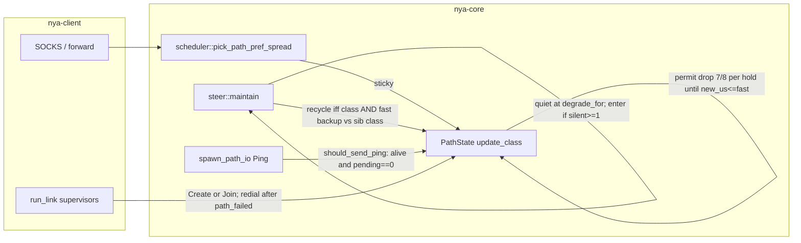
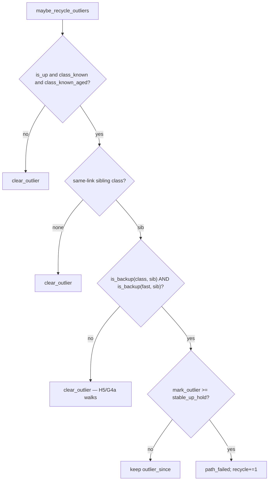

# Overlay algorithm completeness — fourth pass (post-4c59f73 soak)

| Field | Value |
| --- | --- |
| **Author** | nya-link-aggregation maintainers |
| **Date** | 2026-08-29 |
| **Status** | Draft |
| **Audience** | Senior engineers working in `nya-core` (`session/steer.rs` `maybe_recycle_outliers`, tests in `session/mod.rs`) |
| **Predecessor** | `docs/design-algorithm-completeness.md` (G1–G6, commit `3ecdabd`); `docs/design-algorithm-completeness-2.md` (H1–H3, commit `27587fb`); `docs/design-algorithm-completeness-3.md` (H4–H5, commit `4c59f73` “Probe while degraded; walk class 7/8 toward recovered fast after a raise.”). This document does **not** re-litigate G1–G6 or H1–H5 except to record what the new soak proved still works, and what residual holes they left. |
| **Lens** | 30-min generate_204 soak GZ–HK, binary `main` `4c59f73`, log pack `nya-link-aggregation-logs-20260829T1223Z.tar.gz` (extracted `/home/lyn/workspace/nya-link-aggregation/.local/logs-1223/nya-link-aggregation-logs-20260829T1223Z/`; journals `/tmp/nya-logs-1223/client.journal` + `/tmp/nya-logs-1223/server.journal`). Two named links (`akcdn`, `soy`) × `connections=2`, both ~6–7 ms. Application **34066 ok / 10 curl-28 (0.029%)**. TTFB ≥500 ms: 7; ≥1 s: 2; ≥3 s: 0. Overlay end-of-soak (client PID **3491374**, last soak-window snapshot 12:22:50.717Z): `path_down=52 path_degraded=163 probe_miss=2145 failbacks=0 session_all_down_resets=0 mig=83 hol=3 hedge=1978 rtx=2102 fb_slink=0 picks_unk=0 recycle=10 corr=0`. `probe_miss` plateaus at **2152** on the 12:23:30Z snapshot (other counters unchanged). Used as a *lens* on the algorithm, **not** a target to fit. Previous soak on `27587fb`: 36336 ok / **0** curl-28 / **0** TTFB ≥500 ms / `recycle=0`. |
| **Compatibility** | No new TOML keys. `[session]` stays `ping_interval_min_ms` / `ping_interval_max_ms` / `all_down_timeout_ms` / `max_paths` with `#[serde(deny_unknown_fields)]`. Production algorithm path is one `Tuning::STANDARD` table; tests clone-and-mutate only. `PROTOCOL_VERSION` stays 1. No wire changes. Do **not** retune `down_min_silence` / `ping_interval_*` / `unknown_degrade_min` / `interactive_max` / `class_drop_*` / `backup_rtt_*` / `failback_*` / `down_timeout_mult` / `stable_raise_*` / `stable_up_hold` to the GZ–HK 6–7 ms path. Do not redesign hedge. Do not undo H4 (ping while `is_alive()`). Do not undo H5 (unwind permit). Do not change `path_score`’s 1024× class term. e2e impair stays outside TLS. Do not put `metrics=` back on info. Log packs `nya-link-aggregation-logs-*.tar.gz` stay gitignored; do not commit them. Land this design as `docs/design-algorithm-completeness-4.md`. |

---

## Overview

Commit `4c59f73` closed H4–H5 (DEGRADED still probes; raise sets an unwind permit so class 7/8-walks toward recovered fast until `new_us <= fast`). A fourth GZ–HK generate_204 soak on that binary confirmed both landings: `probe_miss` jumped 265→~2152 as H4 predicted; idle snapshots recover to `up`; 14 raises are one 7/8 per `stable_up_hold` (not a 0.2 ms cascade); the under-cliff raise `7702→14566` is followed by a permit walk `14566→13633→12816→…`. It also showed that G4b recycle, left class-only by G4/H3, **wins the race against that walk** whenever a 7/8 crosses `is_backup`.

`maybe_recycle_outliers` (`crates/nya-core/src/session/steer.rs` L234–274) recycles an UP, class-known, age-gated path when `is_backup(class, sibling_class)` for `stable_up_hold` (1 s). It does **not** look at fast EWMA. One 7/8 from a backup-crossing class toward recovered fast is still backup; recycle hold **equals** one G4a/H5 drop hold; recycle always wins. Replacement TCP in this soak comes back `7/6/7ms` — the old 5-tuple was fine. H4 amplified the crossing: DEGRADED pings produce more high-RTT samples during a delay, so class raises further (46–74 ms) and **crosses** the backup cliff (`7×2+20 = 34` ms). That is H4 working; the missing interaction is G4b vs the walk. That is **H6** — the dual of H5.

This design closes H6 without new operator knobs and without fitting formulas to 6–7 ms. Recycle requires **both** class **and** fast to be backup vs the same-link sibling class. Fast recovered under the cliff: `clear_outlier`, H5/G4a walks. Fast still backup for a full hold: still recycle (G4b’s job). Init-freeze-high is the same predicate (no new H7 rule). Client-only stays. `path_score` / `is_backup` / `class_drop_*` unchanged. Drop-info level stays as H5 specified (raise followable by drop infos until `new_us <= fast`). Ping stays **no** log. Do not put `metrics=` back. A 1 ms drop-info grain is a follow-up if chatter still hurts after H6 — not this PR.

---

## Background & Motivation

### Current architecture (what we are not changing)

From `docs/ARCHITECTURE.md`: one overlay session, many TCP+TLS paths, streams sticky on one path. Scheduler (`scheduler.rs` `fastest_class_set`, `path_score` L158–169):

1. Drop backups (`class > fastest × 2 + 20 ms`).
2. Restrict to the fastest class (`should_failback(candidate, best)` is false).
3. Score `class_rtt × load × 1024 + fast_rtt × load`, `load = 1 + inflight/bias + sticky`.

`steer` (5 ms tick): speculative migrate, failback, same-link HOL rebalance, H2 correlated silence, G4b outlier recycle. Timeouts from `Tuning::STANDARD` via `health.rs`. Operator TOML is only probe clamp, `max_paths`, `all_down_timeout`.

Class raise is already one 7/8 per `stable_up_hold` with `*high = None` and `class_unwind_permit = true` after store (`path.rs` L358–375). Drop is `class_should_drop || (permit && fast < class)`, G4a pause, clear permit only when `new_us <= fast` (`path.rs` L378–400). Ping while `is_alive()` (`path.rs` `should_send_ping` L272–274, ping arm L608–631). Recycle is fail-closed on `class_known_aged` then class-only `is_backup` (`steer.rs` L234–274).

### Soak as a lens (not a fit target)

Client PID **3491374** from systemd restart 11:52:30Z (`session created path=akcdn#1` at 11:52:30.739). Server PID **9674**. Old client PID 3452303 is the previous soak process (`unknown session, will recreate` at 11:52:19 then `Stopping nya-client.service`); ignore it except as deploy/recreate. Soak window 2026-08-29T11:52:50Z–12:22:50Z. `REPORT.md` and `summary.json` agree: 34076 samples, 34066 ok / 10 fail, all ten `curl_exit=28`.

| Observation | What it is *not* | What it actually showed |
| --- | --- | --- |
| 34066 ok / 10 curl-28 (0.029%); TTFB ≥500 ms: 7; ≥1 s: 2; ≥3 s: 0. Previous `27587fb`: 36336 / 0 / 0 | “H4/H5 regressed the data path” | The ten curl-28s (8 s SOCKS connect timeout) cluster on recycle / `path_down` minutes. Overlay capacity blip from tearing recovered TCPs. H4/H5 themselves worked. |
| failbacks=0, `fb_slink=0` | “failback is broken” | Both links ~6–7 ms, same class. `failback_abs` 8 ms floor. Correct. |
| `corr=0` the entire soak (no `correlated silence` info on PID 3491374) | “H2 did not land” | No N−1 of N≥3 with someone at `down_for`. Independent tears + recycle storms. Correct. |
| `picks_unk=0` | “reopen G3” | Closed 204s drop sticky. Do not reopen G3. |
| `probe_miss` 0→2145 at 12:22:50.717Z, 2152 at 12:23:30Z (H4 predicted a jump vs 265) | “DEGRADED ping is a bug” | H4 expected. Idle snapshots still recover to `up`. Not the dual-degrade deadlock. |
| 14 raises, **210 drops**. Example: raise `akcdn#0` 7702→14566 then drops 14566→13633→12816→… | “H5 walk did not land” | Walk lands **when class stays under `is_backup`**. 16 of 210 drops are 1 µs catch-up (`old_us - new_us == 1`). |
| Two raises 1 s apart: 7575→46184 then 46184→74477 at 11:55:39/40 | “H1 ratchet still fires” | Not a 0.2 ms cascade. Second raise crossed `is_backup` (74 ms vs 7 ms sibling; cliff 7×2+20=34 ms). |
| `recycle=10` vs previous soak `0` | “H3 age-gate is a no-op” | Age-gate did not prevent recycle of **old** paths whose class just raised into backup. Young init-freeze still waited ~2 s then recycled. Residual is class-only G4b (**H6**), not H3. |
| `hedge=1978` / `rtx=2102` | “redesign hedge” | Unacked STREAM_DATA retry after flaps (`maybe_speculative` L361–397). The first +150 hedge in 10 s (11:54:20→11:54:30, hedge 46→196) is **independent** `path_down` (soy#1 + akcdn#0 at 11:54:19; `recycle` still 0; first curl-28 at 11:54:27). Later clusters (11:59, 12:07–12:12, 12:21) sit on recycle / unknown-550 windows and dominate the 1978. Previous soak also hedged on real flaps (`hedge=53` on `27587fb`). Do not redesign hedge. |
| `tls handshake eof` from 45.207.156.126 every ~70 s `suppressed=5–6` | “overlay path flap” | Extra SYNs to the listen port, not overlay paths. |

Known 7 ms `down_for` is `down_min_silence + probe` ≈ 320+10 = **330 ms** (`steer.rs` `down_for` L685–696). Unknown-RTT `down_for` is **550 ms** (`assumed_rtt=100`, `probe=50`, `5×100+50=550`; comment at L687–689). `is_backup` is `rtt > min × 2 + 20 ms` (`health.rs` L33–38, `tuning.rs` `backup_rtt_mult=2.0` / `backup_rtt_add=20ms` L95–96). None of H6 is a reason to touch `ping_interval_*`, `down_min_silence`, `unknown_degrade_min`, `class_drop_*`, or `backup_rtt_*`.

### What H4–H5 (and G1–G6 / H1–H3) look like in this soak

| Gap | Status on `4c59f73` | Residual |
| --- | --- | --- |
| **H4** DEGRADED still probes | `probe_miss` 0→2145/2152 (H4 design predicted a jump vs 265). Idle snapshots still recover to `up`. Ping arm is `should_send_ping` (`path.rs` L613); the `if !path.is_up() { continue }` suppression is gone. | Not the dual-degrade deadlock. H4 **amplified** backup-crossing raises (more high-RTT samples while DEGRADED). That is H4 working. |
| **H5** raise then 7/8 walk | 14 raises, **210 drops**. Under-cliff example: raise `akcdn#0` 7702→14566 at 11:56:11.047 then drops 14566→13633→12816→12103→… (~1 Hz, G4a hold). Permit walk lands. | Walk is racing G4b recycle (below). 16 of 210 drops are 1 µs catch-up steps (operability, not a permit bug). Do **not** clear the permit early. |
| **H1** one 7/8 per hold | Two raises 1 s apart: 7575→46184 then 46184→74477 at 11:55:39.011 / 11:55:40.014. First 7/8: `(7575×7 + F)/8 = 46184` ⇒ `F ≈ 316 ms`. Not a 0.2 ms cascade. | Second raise crossed `is_backup` (74 ms vs 7 ms sibling; cliff 34 ms). One 7/8 of a large spike is *supposed* to be able to cross backup; G4b must not tear the recovered TCP. |
| **H2** correlate | `corr=0` entire soak; zero `correlated silence` info on PID 3491374. | None. |
| **H3** young-class recycle age-gate | Age-gate did not prevent recycle of **old** paths whose class just raised into backup. Init-freeze `soy#0` added 11:56:11.541, recycle 11:56:13.916 (~2.4 s ≈ serial 2 s). `recycle=10` vs previous soak `0`. | **H6.** H3 is doing its job (young path waits); the predicate it gates is still class-only. |
| **G4b** same-link outlier recycle | Fires 1–2 s after a backup-crossing raise / init-freeze. Replacement TCP is immediately `7/6/7ms`. | Recycle keys off **class only**. |
| **G1** recreate | Deploy window 11:52:19–11:52:30: old PID `unknown session, will recreate`; new PID `session created`. Works. | Deploy, not a hole. |
| **G2** Create `path_name` | Snapshots have no `init=`. Names `akcdn#0/#1 soy#0/#1`. | None. |
| **G3** zero-load spread | `picks_unk=0`. | Do not reopen. |
| **G4a** drop pause | 210 drops, one per hold. | Walk cannot finish when G4b tears first. |
| **G5 / H2** correlated hold | `corr=0`; tears are independent + recycle. | None on this event. |
| **G6** info scorecard | All eight packed keys present. End-of-soak grammar matches. | Keep it. Do not put `metrics=` back. |

### Recycles this soak (client 3491374)

Verified `outlier recycle` info lines:

| # | Time (Z) | Path | `class_us` | Preceding raise / freeze |
| --- | --- | --- | --- | --- |
| 1 | 11:55:41.566 | akcdn#0 | 74477 | two raises 7575→46184→74477 |
| 2 | 11:56:13.916 | soy#0 | 119263 | init freeze high (~135 ms); one drop 135198→119263 |
| 3 | 11:58:51.436 | akcdn#1 | 53507 | drop 60105→53507 (class already backup) |
| 4 | 12:00:43.401 | akcdn#0 | 52553 | raise 6998→52553 |
| 5 | 12:02:33.566 | akcdn#0 | 44450 | raise 6914→44450 |
| 6 | 12:08:38.701 | soy#1 | 382331 | init freeze high; one drop 435826→382331 |
| 7 | 12:09:13.711 | soy#0 | 143204 | two raises 7744→93319→143204 |
| 8 | 12:12:09.666 | akcdn#1 | 43751 | raise 7093→43751 |
| 9 | 12:12:20.896 | soy#1 | 47810 | raise 7342→47810 |
| 10 | 12:17:45.031 | soy#0 | 41058 | raise 7024→45903; recycle class already one 7/8 down |

Raises that did **not** recycle (class stayed under `is_backup` vs a ~7 ms sibling):

- 11:56:11 akcdn#0 7702→14566 (14.5 ms < 34 ms — H5 walk ran: 14566→13633→…)
- 12:00:43 soy#0 8142→11372
- 12:10:44 akcdn#0 7195→9309
- 12:17:51 soy#1 6979→9217
- 12:18:46 akcdn#1 7272→9915

Those stayed under the cliff. Recycle is not random; it is `is_backup(class, sibling_class)` winning a 1 s race against one 7/8 drop.

### Smoking gun (H6)

```
11:55:39.011Z  class akcdn#0 7575→46184 kind=raise     (7/8 toward a ~316 ms spike)
11:55:40.014Z  class akcdn#0 46184→74477 kind=raise
11:55:40.717Z  snapshot akcdn#0=64/34/74ms up … bak    (fast still decaying; class 74; marked bak)
11:55:41.566Z  outlier recycle path=akcdn#0 class_us=74477
11:55:50.717Z  snapshot akcdn#0=7/6/7ms up             (replacement 5-tuple is the same 7 ms link)
```

Math (not 7 ms fitting): `is_backup(74 ms, 7 ms)` is `74 > 7×2 + 20 = 34`. First H5 drop from 74477 toward fast ~7000 is `(74477×7 + 7000)/8 = 66042` µs (`74477×7 = 521339`) — still backup. Recycle hold **equals** one G4a/H5 drop hold (`cfg.tuning.stable_up_hold` = 1 s, `tuning.rs` L103). Recycle always wins the race. Integer 7/8 then leaves `bak` in **~8 holds** (~8 s; `new < 34 ms`). Catch-up until `new_us <= fast` (~7 ms) is gap×7/8 per hold: **~80 holds / ~80 s**, not 20 s. After 20 holds class is ~11 ms (already not `bak`, still a `path_score` loser). The under-cliff soak walk 14.5→7 *does* reach 1 ms snapshot grain in ~20 s; that duration does not transfer to a 74 ms start.

Previous soak’s raise 7→14 ms (`27587fb` server `soy#1` 7065→14048) was **not** backup vs 7 (need 34), so G4b never fired and H5 looked like the remaining hole. This soak produced backup-crossing raises because H4 kept pinging through the delay.

Same hole on **init freeze high** (permit false, H5 not involved): `soy#0` added 11:56:11.541, class freeze ~135198 µs (debug `kind=init`, not on info), one drop 135198→119263 at 11:56:12.919, recycle 11:56:13.916. `class_should_drop(135 ms, 7 ms)` is already true (gap 128 ≥ 0.25×135); G4a would walk under 34 ms in ~12 holds. Recycle tears after one hold (~serial 2 s = H3 age floor + backup hold). Then unknown-RTT 550 ms `down_for` on the new TCP (`steer.rs` L685–696) can cascade (`soy#1` four `path_down`s in four seconds around 12:08:34–38: path_id 25, 28 at `ago=553 down=550`, 29, 30 recycle).

### Existing tests lock H6 as intended behavior

`inject_named` (`session/mod.rs` L1733–1741) stores **ewma, stable, and class** to `rtt_ms * 1000`, then `note_class_known_now()`. Positive recycle tests then poke **only class**:

```1961:1974:crates/nya-core/src/session/mod.rs
    async fn outlier_recycle_same_link_client() {
        let mut cfg = SessionConfig::default();
        cfg.tuning.stable_up_hold = Duration::ZERO;
        let client = Session::new_client(cfg);
        let bad = inject_named(&client, 1, "soy#0", 7);
        bad.rtt_class_us.store(227_000, Ordering::Relaxed);
        bad.stable_up_hold_us
            .store(1_000_000_000, Ordering::Relaxed);
        inject_named(&client, 2, "soy#1", 7);
        inject_named(&client, 3, "akcdn#0", 7);
        let before = client.snapshot().path_outlier_recycle;
        client.debug_maintain();
        assert_eq!(client.snapshot().path_outlier_recycle, before + 1);
```

`fast` stays 7 ms, class 227 ms, hold=0, asserts recycle. That is recovered-fast + stale-high class — **the soak bug**. `outlier_recycle_young_class_waits_hold` (L2007–2036) uses the same poke. After H6 those tests must store fast/ewma high (e.g. 227 ms) for a positive recycle. New tests: `outlier_skips_recovered_fast` (class 227 / ewma 7 / hold=0 / no recycle) **and** `outlier_clears_when_fast_recovers_mid_hold` (timer starts while both backup, then ewma drops — the soak order).

### Pain points in code (cited)

#### H6 — G4b recycle races the class walk (the dual of H5)

```234:258:crates/nya-core/src/session/steer.rs
    fn maybe_recycle_outliers(&self) {
        let paths = self.path_list();
        let hold = self.inner.cfg.tuning.stable_up_hold;
        let mut recycle = Vec::new();
        for p in &paths {
            if !p.is_up() || !p.class_known() || !p.class_known_aged(hold) {
                p.clear_outlier();
                continue;
            }
            let best_sib = paths
                .iter()
                .filter(|q| q.id != p.id && q.is_up() && q.class_known() && q.link() == p.link())
                .map(|q| q.class_rtt())
                .min();
            let Some(sib) = best_sib else {
                p.clear_outlier();
                continue;
            };
            if health::is_backup(&self.inner.cfg, p.class_rtt(), sib) {
                if p.mark_outlier() >= hold {
                    recycle.push(p.id);
                }
            } else {
                p.clear_outlier();
            }
        }
```

`p.rtt()` is already the fast EWMA (`path.rs` L188–191). `is_backup` already takes any `Duration` (`health.rs` L33–38). The sibling compared against is still **sibling class**, not sibling fast — same as today. Recycle still requires `is_up()` (DEGRADED during the spike `clear_outlier`s; the 1 s hold starts after `touch_rx` restores UP, which is exactly when fast is decaying through 64 ms toward 7 ms).

H5 permit (`path.rs` L59–60, L366, L378–390) is the right tool to *walk* class; it is the wrong tool to *skip* recycle. Init freeze never sets the permit (`update_class` init window L331–346 returns before raise). A still-slow path that keeps raising would re-arm permit forever and never recycle if we keyed off it.

---

## Goals & Non-Goals

### Goals

- Close **H6** with session tests covering recovered-fast skip, **mid-hold fast recovery** (`clear_outlier` after the timer started), and honest-slow recycle. Existing G1–G6 and H1–H5 tests stay green, including the jitter / raise-hold / permit / correlate / recycle suite listed below.
- Keep a single production `Tuning::STANDARD`. Formulas stay RTT-adaptive. No new TOML or Tuning fields.
- After H6, a backup-crossing raise (or init freeze high) whose fast recovers under the cliff within `stable_up_hold` must **not** increment `recycle` / tear the 5-tuple; H5/G4a must be allowed to walk class. A path whose **fast** stays backup vs the sibling class for a full hold must still recycle.
- Update `docs/ARCHITECTURE.md` (Chinese) recycle sentence. Leave `docs/OBSERVABILITY.md` drop-info at H5 (raise followable by drop infos). Land this design as `docs/design-algorithm-completeness-4.md`.

### Non-Goals

- New operator TOML knobs. Unknown `[session]` keys still deny. `SessionOpts` stays four keys (`cfg.rs` L131–137).
- Retuning `ping_interval_min/max`, `down_min_silence` (320 ms), `unknown_degrade_min`, `interactive_max` (1500), `class_drop_*`, `backup_rtt_*`, `failback_*`, `down_timeout_mult`, `stable_raise_*`, `stable_up_hold` to the GZ–HK 6–7 ms path.
- Lengthening recycle hold (a new multiple of `stable_up_hold` is a new constant / fitting).
- Skipping recycle solely because `class_unwind_permit` is true.
- Undoing H4 (ping while `is_alive()`).
- Undoing H5 (permit walk, including 1 µs catch-up until `new_us <= fast`). Do **not** clear the permit early to “leave ~2× `path_score`”.
- Changing `path_score`’s 1024× class term, `is_backup` formula, or `class_drop_*`.
- Recycle on “same-class but 2× `path_score`” (rejected in H5 alternatives).
- Redesigning hedge / rtx / speculative migrate. Independent 330 ms deaths still hedge (11:54, `recycle=0`); recycle/cascade storms dominate the rest of 1978. Neither is a new bug in `maybe_speculative`.
- Changing class init to min/median of 8 samples. `lucky_low_first_sample_does_not_freeze_class` is load-bearing.
- Timeout-stable raise (`record_rtt` `high_since`, `path.rs` L298–324). Same as H1/H5: that clock tracks a sustained delay for loss/down.
- Packet-loss-inside-TLS in e2e. Impair harness still stalls outside TLS.
- Logging STREAM_DATA / ACK / Ping / Pong, or putting `metrics=` back on info. No new snapshot counters. `n_counter` stays 50. Do **not** demote `kind=drop` info in this PR (H5 trail stays).
- Bumping `PROTOCOL_VERSION`. No wire changes.
- Server-side recycle. Server still does not dial.
- Fitting the 6–7 ms GZ–HK path. The cliff 34 ms is `7×2+20`; the same hole exists on any topology where one 7/8 can cross `is_backup` vs a sibling.

---

## Key Decisions

1. **H6: recycle iff both class and fast are backup vs the same-link sibling class.** In `maybe_recycle_outliers`, after resolving `sib` (min same-link sibling `class_rtt()`, unchanged): `if is_backup(p.class_rtt(), sib) && is_backup(p.rtt() /* fast */, sib) { mark_outlier; recycle if >= hold } else { clear_outlier }`. Fast recovered under the cliff (7 ms vs sibling 7 ms): **do not recycle**. Class does **not** stay 74 ms: ~**8 holds** (~8 s) to leave `bak` (`new < 34 ms`); catch-up to `new_us <= fast` (~7 ms) is ~**80 holds / ~80 s**; after 20 holds snapshot class is ~11 ms (already not `bak`, still a `path_score` loser). Pick already treats a high class as `bak` / class-jump; H5 walks it back. Fast still backup for a full hold (honestly slow 5-tuple, e.g. 80 ms vs 7 ms sibling): **still recycle**. G4b’s job. Compare both against sibling **class**, not sibling fast — same identity G4b already uses. Client-only stays (`steer.rs` L162–164). Do not read `path.stable_up_hold_us`. Re-evaluate the AND **every tick** (do not latch `outlier_since` on class-only and only consult fast at fire).

2. **Do not skip recycle solely because `class_unwind_permit` is true.** Init freeze never sets it (`path.rs` L331–346). A still-slow path that keeps raising would re-arm permit on every raise store (`path.rs` L366) and never recycle. Permit is the H5 walk gate, not a G4b inhibit.

3. **Do not lengthen recycle hold.** Recycle hold stays `cfg.tuning.stable_up_hold` (1 s). A new multiple is a new constant / fitting to “give the walk N steps.” One extra drop from 74 ms is still backup; you would need ~**8 holds** to walk *under* 34 ms (~**12** from 135 ms) — that is a fitted wait, not a first-principles hold. Fast-backup is the honest signal that the 5-tuple is still slow.

4. **Do not undo H4.** DEGRADED ping is why dual-degrade idle paths recover, and why `probe_miss` jumped. More high-RTT samples during a delay are H4 working; they make class more likely to *cross* backup, which is why H6 must look at fast. Suppressing DEGRADED ping to “avoid backup-crossing raises” reopens the dual-degrade deadlock.

5. **Do not change `path_score`, `is_backup`, or `class_drop_*`.** Quantizing class inside pick reopens jitter-low-tail (`jitter_low_tail_does_not_singleton`, `scheduler.rs` L158–169 comment). Lowering the backup cliff to spare 14 ms classes is a GZ–HK fit and is unnecessary: 14 ms is already not backup. Recycle on “same-class but 2× `path_score`” was rejected in H5 and would redial the 14.5 ms TCP that this soak *successfully* walked.

6. **Init freeze high is H6, not a new H7 rule.** If the 8 samples were a delay and fast then recovers within hold, `clear_outlier`. If fast stays high, recycle. `lucky_low_first_sample_does_not_freeze_class` stays. Do not change class init to min/median.

7. **Positive recycle tests must store fast/ewma high, not only class.** `outlier_recycle_same_link_client` / `outlier_recycle_young_class_waits_hold` currently poke `rtt_class_us = 227_000` on a 7 ms inject — after H6 that must *not* recycle. Two new tests: (a) `outlier_skips_recovered_fast` — class 227 ms, ewma 7 ms, hold=0, **no** recycle, path remains, `outlier_since` is `None` (timer never starts). (b) `outlier_clears_when_fast_recovers_mid_hold` — both clocks 227 ms, age-gated, one maintain so `outlier_since` is `Some`, then ewma 7 ms, maintain → no recycle, path remains, `outlier_since` is `None`. (b) is the soak smoking gun; (a) alone does not lock AND-every-tick `else clear`. `outlier_recycle_ignores_other_link` already injects 227 ms on both clocks; leave it. `outlier_recycle_not_on_server` may store ewma high for honesty; the assertion is still “server never recycles.”

8. **Do not change drop-info level in this PR.** H5 required a raise info to be followable by drop infos until `new_us <= fast`. This soak’s under-cliff walk that **proved H5** starts `14566→13633` (933 µs); 206/210 drops are `< 1 ms`. A 1000 µs info floor would make that entire walk debug. Park a 1 ms grain as a **follow-up** if chatter still hurts after H6. Do **not** pick a fitted threshold to keep 933 µs. Ping stays **no** log. Do not put `metrics=` back.

9. **One production `Tuning::STANDARD`. No new TOML.** H6 is a boolean AND on an existing predicate. `PROTOCOL_VERSION` stays 1 (`nya-proto/src/lib.rs` L17). `n_counter` stays 50.

10. **Prefer one combined change set** (like `3ecdabd` / `27587fb` / `4c59f73`). This PR is **H6 only**: `maybe_recycle_outliers`, recycle tests, `ARCHITECTURE.md` recycle sentence, this design. Drop-info logging is not in the diff.

---

## Proposed Design

### Architecture (unchanged data path; recycle predicate gains fast)



### H6 — recycle requires fast backup too

#### Current

Class-only `is_backup` after H3 age-gate (`steer.rs` L234–258). Fast is unused. `p.rtt()` already exists (`path.rs` L188–191). Snapshot `bak` is a **global** min class (`session/mod.rs` L686–700), not same-link — a slower named link can show `bak` without being a G4b candidate. G4b itself is same-`link()` vs sibling class. That split stays.

#### Soak

Backup-crossing raise: see smoking gun above. Fast at the 11:55:40.717Z snapshot is **64 ms** (still backup vs 7) and decaying; recycle fires 850 ms later on class 74477. EWMA `(old×8 + sample×2)/10` from 64 ms toward 7 ms samples is under 34 ms in a handful of Pongs — by fire time fast is recovered, class is not. Replacement `akcdn#0=7/6/7ms` at 11:55:50 proves the 5-tuple was fine.

Init freeze: `soy#0` path_id=9 added 11:56:11.541, drop 135198→119263, recycle 11:56:13.916. Permit is false. H5 is not in this event. Fast-backup is the only signal that distinguishes “8 delayed samples, TCP is actually 7 ms” from “this 5-tuple is honestly 135 ms.”

#### Fix

```rust
            if health::is_backup(&self.inner.cfg, p.class_rtt(), sib)
                && health::is_backup(&self.inner.cfg, p.rtt(), sib)
            {
                if p.mark_outlier() >= hold {
                    recycle.push(p.id);
                }
            } else {
                p.clear_outlier(); // includes: class backup but fast recovered → H5/G4a walks
            }
```

Worked examples (sibling class 7 ms, cliff 34 ms):

| Case | class | fast | Recycle? |
| --- | --- | --- | --- |
| Soak smoking gun at fire time | 74 ms | ~7 ms | **No.** `clear_outlier`. Leaves `bak` in ~8 holds; catch-up to ~7 ms in ~80 holds; after 20 holds snapshot ~11 ms. |
| Snapshot 11:55:40 (fast still 64 ms) | 74 ms | 64 ms | Timer **runs** (both backup). Next ticks: when fast `< 34 ms`, `clear_outlier`. Does not survive the 1 s hold on this topology. |
| Honest slow 5-tuple | 80 ms | 80 ms | **Yes** after hold. G4b. |
| Init freeze, delay then recover | 135 ms | 7 ms within hold | **No.** Walk under 34 ms in ~12 holds via `class_should_drop` (gate already true); catch-up to 7 ms is longer. |
| Init freeze, TCP actually slow | 135 ms | 135 ms for 1 s after age | **Yes.** |
| Under-cliff raise 14.5 ms | 14.5 ms | 7 ms | Class not backup. No recycle. H5 walk (this soak, 11:56:11). |
| Both soy paths 227 ms | 227 ms | 227 ms | `is_backup(227, 227)` false. No recycle. Unchanged. |
| Permit true, fast recovered | 74 ms | 7 ms | **No** because fast, not because permit. |



Do **not** compare fast to the global fastest class (would redial a legitimately slower named link — same G4b non-goal as G1 design). Do **not** compare to sibling fast (sibling class is the scheduler identity; sibling fast can spike without a class raise). Do **not** require `class_should_drop` (honest 80 vs 7 already drops; recovered 7 vs class 74 also drops via permit; the recycle question is “is this 5-tuple still slow,” which is fast vs cliff).

DEGRADED still `clear_outlier` via the `is_up()` gate (L239–241). During the spike the path is often DEGRADED (H4 pings); the 1 s hold starts after UP. That is existing. H6 does not change it.

Lock order unchanged: `maybe_recycle_outliers` still reads `class_known_since` then `outlier_since` via `mark_outlier` / `clear_outlier`. Never holds the class-high/low/accum trio. `p.rtt()` / `p.class_rtt()` are atomics.

#### Tests (H6)

All production-path tests use `Tuning::STANDARD`. Recycle hold via `cfg.tuning.stable_up_hold` clone-and-mutate (0 / 50 ms). Do **not** store `path.stable_up_hold_us` to fire recycle (`outlier_recycle_same_link_client` already stores `1_000_000_000` there; keep that as the “must not read path hold” lock).

| Test | Where | Asserts |
| --- | --- | --- |
| `outlier_recycle_same_link_client` | **update** `session/mod.rs` | After `inject_named(..., 7)`, store **both** `rtt_class_us` **and** `rtt_ewma_us` to 227_000 (stable optional). hold=0. Recycle fires. Documents: positive recycle is recovered-class **and** recovered-fast backup, not class-only. |
| `outlier_recycle_young_class_waits_hold` | **update** | Same: poke ewma 227_000 as well as class. Two-phase age-gate still: no recycle after 1×hold, recycle after 2×hold. Without ewma high, phase 3 would fail after H6. |
| `outlier_skips_recovered_fast` | **new** | Client, `stable_up_hold = 0`. `inject_named` soy#0 7 ms, soy#1 7 ms. Poke soy#0 `rtt_class_us = 227_000`, leave ewma 7 ms. `debug_maintain` → `path_outlier_recycle` unchanged, soy#0 **remains**, `outlier_since_for_test()` is `None` (`clear_outlier`, timer never starts). Hold=0 skip. **Not** sufficient alone: an implementer who latches `outlier_since` on class-only and checks fast only at fire still passes this. |
| `outlier_clears_when_fast_recovers_mid_hold` | **new (merge gate)** | Client, `cfg.tuning.stable_up_hold = 50 ms`. `inject_named` soy#0/#1 at 7 ms. Poke soy#0 **both** `rtt_class_us` and `rtt_ewma_us` to 227_000. `backdate_class_known(50 ms)` + one `debug_maintain` → `outlier_since_for_test()` is `Some` (timer started; both clocks backup). Then `rtt_ewma_us.store(7_000)`. Next `debug_maintain` → `path_outlier_recycle` **unchanged**, soy#0 **remains**, `outlier_since_for_test()` is `None`. Locks AND-every-tick `else { clear_outlier }` when class is still backup and fast recovered. Soak order: 11:55:40 both backup (`64/34/74ms`), then fast falls under 34 ms. |
| `outlier_recycle_not_on_server` | existing; optionally poke ewma 227_000 | Server still does not recycle. |
| `outlier_recycle_ignores_other_link` | existing | `inject_named(..., 227)` already sets both clocks. Still no recycle (different `link()`). |
| H1 / H5 / H4 / H2 / G4a suite | existing | stay green. Recycle tests above are the only ones whose *positive* case depended on class-only. |

Do not require 1 s of wall clock. `debug_maintain` + `backdate_*` as today.

```mermaid
sequenceDiagram
  participant IO as path IO
  participant C as update_class
  participant M as maintain
  participant R as maybe_recycle_outliers
  IO->>C: high RTT samples (H4 DEGRADED ping)
  C->>C: raise 7/8 (H1 one per hold) → class 74ms, permit true
  IO->>IO: Pong recovers, fast EWMA → 7ms, UP
  M->>R: is_backup(class 74, sib 7) true
  R->>R: is_backup(fast 7, sib 7) false
  R->>R: clear_outlier
  C->>C: permit drop 7/8 per hold until new_us<=fast
  Note over R,C: 5-tuple kept; replacement TCP not needed
```

### Drop-info level (follow-up, not this PR)

Today every permit catch-up is `tracing::info!` (`path.rs` L392–398). This soak: 210 info drops in 30 min, 16 of them `old_us - new_us == 1`, 206 `< 1 ms`. That is operability chatter, not an H6 hole.

H5 required a raise info to be followable by drop infos until `new_us <= fast`. This soak’s under-cliff walk that **proved H5** starts `14566→13633` (933 µs). A 1000 µs info floor would make that entire walk debug; the four `≥ 1 ms` drops (15935 / 6598 / 53495 / 4845 µs) are the high-class 7/8s that then recycled — after H6, remaining info drops may be rare anyway.

**This PR does not change log level.** If chatter still hurts after H6, a follow-up may log `kind=drop` at info only when `old_us - new_us >= 1000` (1 ms snapshot grain) and debug otherwise. Do **not** pick a fitted threshold to keep 933 µs. Permit semantics stay `new_us <= fast`. Ping stays no log. Do not put `metrics=` back.

### Soak events that are NOT holes

- **failbacks=0:** both links ~7 ms, same class. Correct.
- **corr=0:** no N−1. Correct. Do not retune `ping_interval_max` to “create” `corr`.
- **picks_unk=0:** closed 204s. Do not reopen G3.
- **hedge=1978 / rtx=2102:** unacked STREAM_DATA retry after flaps (`maybe_speculative` L361–397). Split two sources: **independent 330 ms deaths** still hedge — first burst +150 in 10 s at 11:54:20→11:54:30 (hedge 46→196) while `recycle` is still **0** (`path down` soy#1 and akcdn#0 at 11:54:19; first curl-28 at 11:54:27). Previous soak also hedged on real flaps (`hedge=53` on `27587fb`). **Recycle / unknown-550 cascades** dominate the rest (11:59, 12:07–12:12, 12:21). Do not call the first burst a recycle-storm effect. Do not redesign hedge in this PR.
- **probe_miss=2145 at 12:22:50.717Z / 2152 at 12:23:30Z:** H4 expected vs previous 265.
- **curl-28 (10×, 8 s SOCKS connect timeout)** cluster on `path_down` minutes: 11:54 (independent deaths, `recycle=0`), then 11:58, 12:07, 12:08, 12:09, 12:10, 12:12, 12:21 (recycle / cascade). Overlay capacity blip. After H6 the recycle-tied cluster should collapse toward the `27587fb` zero; 11:54-style independent deaths can still produce a curl-28.
- **TTFB ≥500 with `tls_ms ≈ ttfb`** (play 792/775, google 1124/1083, youtube 1436/1361): origin. Overlay-attribution ones sit on flap windows (gstatic 783/301 at 12:00:40 next to raise/recycle 12:00:42–43; play 686/259 at 12:00:43; google 505/442 at 12:03:41 next to soy silent-downs; play 500/251 at 12:07:54 next to akcdn#1 silent-down).
- **`tls handshake eof` from 45.207.156.126 every ~70 s `suppressed=5–6`:** extra SYNs, not overlay paths.
- **550 ms unknown silent-down:** correct `down_for` for a new TCP with no Pong (`steer.rs` L687–689). The cascade is from wrong recycle, not a reason to retune `unknown_degrade_min` / `down_timeout`.
- **H5 1 µs drop-info tail (16 of 210):** algorithmically the catch-up until `new_us <= fast`. Do **not** clear the permit early (leaves ~2× `path_score`). Do **not** demote drop info in this PR.
- **path_down=52 vs previous 1:** 10 recycles + unknown-550 cascades + known-330 independent deaths. Not a G5 regression (`corr` stayed 0; these were not N−1).

---

## API / Interface Changes

No public API, no wire, no TOML.

### `Session::maybe_recycle_outliers`

Predicate becomes:

```text
is_up && class_known && class_known_aged(hold)
&& same-link sibling class exists
&& is_backup(class, sib) && is_backup(fast, sib)
→ mark_outlier; recycle if elapsed >= hold
else clear_outlier
```

`health::is_backup`, `PathState::rtt` / `class_rtt`, H3 age-gate, client-only, info `outlier recycle` fields (`path`, `class_us`) **unchanged**. Optional: log `fast_us` on the recycle info line so a soak can see both clocks. Not required; snapshot already has `fast/stable/class`. Prefer **not** adding fields unless review wants them — keep the rare-event grammar stable.

### `PathState::update_class`

**Unchanged.** Permit semantics frozen. Drop-info level unchanged in this PR.

### `path_score` / `is_backup` / `class_should_drop` / `should_send_ping`

**Unchanged.**

### TOML / Tuning / proto

**None.** `SessionOpts` still four keys (`cfg.rs` L131–137). `PROTOCOL_VERSION` stays 1. `backup_rtt_mult` / `backup_rtt_add` / `stable_up_hold` stay.

---

## Data Model Changes

No durable store, no wire. In-memory: none for H6 (the fast EWMA already exists). Recycle timer still `outlier_since`; still cleared when the AND fails.

Migration: rolling deploy. H6 is **client-only** (server `maintain` never recycles, L162–164). Mixed-version: old client still tears recovered TCPs; new client keeps them. Server class/HOL is unaffected by client recycle. Ship the client for the canary; shipping both is still right so H4/H5 stay matched.

---

## Alternatives Considered

| Alternative | Trade-off |
| --- | --- |
| **A. Skip recycle when fast recovered: `is_backup(class, sib) && is_backup(fast, sib)` (chosen)** | One AND. No new constant. Recovered 5-tuple kept; honest slow 5-tuple still recycled after 1 s. Init freeze high covered without an H7 rule. Permit unused (init freeze never sets it). Existing G4b same-link / client-only / age-gate stay. Tests that poked only class must be updated — they were locking the bug. |
| B. Lengthen recycle hold (2–N × `stable_up_hold`) | New multiple, forbidden TOML/Tuning growth, fitted to “how many 7/8s to walk under 34 ms.” From 74 ms you need ~**8** holds to leave `bak`, not 2. From 135 ms you need ~**12**. A single hold length cannot cover both without being “wait for the walk,” which is G4a’s job. Fast-backup already distinguishes the two. **Rejected.** |
| C. Skip recycle while `class_unwind_permit` is true | Init freeze never sets permit (`soy#0` 11:56:13 would still recycle). A still-slow path that keeps raising re-arms permit and would **never** recycle — G4b’s job disappears for the honest backup H4 is pinging. **Rejected.** |
| D. Undo H4 (stop pinging DEGRADED) so class raises less often across the cliff | Reopens the dual-degrade deadlock H4 closed. This soak’s `probe_miss` jump and idle-`up` recovery are H4 working. Backup-crossing is the *correct* class response to a 316 ms spike; the bug is tearing the TCP after fast recovers. **Rejected.** |
| E. Lower the backup cliff (`backup_rtt_mult` / `backup_rtt_add`) so 46–74 ms is not backup vs 7 | Fits GZ–HK. Reopens HOL/backup identity for any topology whose same-link outlier is “only” 2×. 14.5 ms already is not backup — the cliff is not why the 14 ms H5 walk survived, and lowering it does not save a 74 ms class. Forbidden retune. **Rejected.** |
| F. Recycle on “same-class but 2× `path_score`” | Rejected in H5. Would redial the 14.5 ms TCP this soak walked. G4b exists for honest backups (`>2×+20 ms`). |
| G. Assign class to fast after raise / skip the walk | Rejected by `confirmed_2_5x_raise_is_seven_eighths_not_assign`. Chatter. H6 lets the walk *finish* instead of shortening it. |
| H. Change class init to min/median of 8 samples so freeze is not 135 ms | Rejected since H3. A 135 ms init when all 8 samples are delayed is an honest reading; if fast then recovers, H6 keeps the TCP. |
| I. Retune `unknown_degrade_min` / `down_timeout` because of 550 ms cascades | The cascade is wrong recycle → new TCP with no Pong. Unknown 550 ms `down_for` is correct (`steer.rs` L687–689). Forbidden. |
| J. Redesign hedge because hedge=1978 | Unacked retry (`maybe_speculative` L361–397). Independent 330 ms deaths still hedge (11:54, `recycle=0`; also `hedge=53` on `27587fb`). Recycle storms dominate the rest. Fix the wrong recycles; do not redesign hedge. |

---

## Security & Privacy Considerations

- No new wire fields, no new listen address. Recycle info stays `path, class_us` (existing). Optional `fast_us` would be the same RTT surface already on snapshots.
- Path names (`soy#0`) and class microseconds are existing surface.
- H6 **reduces** teardowns: fewer extra SYNs from `run_link` redial, fewer unknown-RTT 550 ms deaths. It does not enlarge the trust boundary.
- Client-only: a malicious sibling RTT cannot make the server tear paths it cannot redial.
- Mixed-version: old client still over-recycles; no handshake change.

---

## Observability

| Question | Probe at default info after this work |
| --- | --- |
| Did we tear a recovered 5-tuple? | `recycle=` on the 10 s snapshot; `outlier recycle` info. After H6, a raise whose next snapshot shows `fast/class` with fast under the cliff and class still high must **not** be followed by `recycle+=1` / replacement `7/6/7ms` 1–2 s later. `kind="drop"` info (H5 trail, unchanged) should walk class instead. |
| Did H5 still walk? | Raise info, then drop infos one per hold (H5 trail, still info) and snapshot class shrinking on the **same** `path_id`. After a 74 ms backup-crossing raise: leaves `bak` in ~8 s; ~11 ms by 20 s; ~7 ms by ~80 s. **Do not** gate a canary on “74→7 in 20 s” — that false-fails a correct landing that still shows `7/6/11ms`. The under-cliff 14.5→7 walk *does* hit 1 ms grain in ~20 s; do not transfer that duration. Soak-style `recycle` 1–2 s after `64/34/74ms bak` is H6 still open. |
| Did G4b still fire on an honest backup? | `recycle+=1` when snapshot shows fast **and** class above `sib×2+20` for a full hold (e.g. `80/80/80ms bak` vs sibling `7/7/7ms`). |
| Did raise ratchet? | Unchanged H1: at most one `kind="raise"` per `stable_up_hold` per path. |
| Did dual-degrade recover? | Unchanged H4: idle snapshots stay `up`; `probe_miss` may tick. |
| Did sequential N−1 hold TCP? | Unchanged H2: `corr+=1` only with `silent>=1`. This soak correctly left `corr=0`. |
| Did we speculatively migrate / hedge around a real flap? | `mig=` / `hedge=` / `rtx=` on the 10 s snapshot. After H6, hedge/rtx should not storm on recovered-TCP recycles. Independent 330 ms deaths (11:54-style) may still hedge. Do not alert on hedge alone. |

Alerting (optional, not in-tree): a 30 min GZ–HK soak with `recycle` clustered 1–2 s after a raise whose snapshot already shows recovered fast is H6 open. `recycle` on a path whose snapshot fast is still backup is G4b working. Do **not** alert on `probe_miss` vs the 265 baseline (H4). Do **not** put `metrics=` back. `n_counter` stays 50.

Info snapshot grammar unchanged. Packed keys stay `mig/hol/hedge/rtx/fb_slink/picks_unk/recycle/corr`.

---

## Rollout Plan

- **Feature flags:** none. Behavior change is the algorithm.
- **Deploy order:** **Client carries H6.** Server never recycles. Shipping both is still preferred so H4/H5 stay matched; a client-only H6 canary is enough to stop the recycle storm.
- **Staged:** canary one GZ–HK pair. Watch: `recycle` not firing 1–2 s after a raise whose snapshot is `64/34/74ms bak` (same `path_id`, not a replacement `7/6/7ms`); class shrinking each hold; snapshot grain **74→~11 ms by 20 s** and **~7 ms by ~80 s**. **Do not** gate on “74→7 in 20 s” — a correct H6 landing still shows `7/6/11ms` at 20 s. Also: init-freeze-high that recovers does not recycle; honest backup still recycles; `corr` still 0 on N=1 of 4; failbacks still ~0 on equal-class links; recycle-tied curl-28 / TTFB≥500 should move toward the `27587fb` zero (11:54-style independent deaths can remain); `probe_miss` stays in the H4-high regime; info snapshot size unchanged; `kind="raise"` still at most one per hold; drop infos still follow a raise at default info.
- **Rollback:** revert the PR. No TOML to undo.
- **Prefer one combined change set** (like `3ecdabd` / `27587fb` / `4c59f73`). This PR is H6 only. A later drop-info log-level change is not a soak-canary of H6.
- **Risks**

| Risk | Sev | Mitigation |
| --- | --- | --- |
| Honest slow 5-tuple never recycles because fast dips under the cliff once per hold | Low | `is_backup` slack is `2× + 20 ms`. A true 80 ms vs 7 ms sibling stays backup through ~0.3 jitter. Borderline 40 ms vs 7 may clear; class still walks; HOL dest until class crosses. Accepted — do not lower the cliff. Tests: updated positive recycle with ewma 227 ms. |
| Fast still 64 ms at snapshot, recycle hold starts, then fast recovered — H6 must clear mid-hold | Med if tests omit it | Each maintain tick re-evaluates; `else clear_outlier` resets `outlier_since`. Do **not** latch the timer on class-only and only check fast at fire. Hold=0 `outlier_skips_recovered_fast` does **not** lock this. Merge gate: `outlier_clears_when_fast_recovers_mid_hold`. |
| Forgotten ewma poke in positive tests: CI goes green with zero recycles | High | Update `outlier_recycle_same_link_client` to store ewma 227_000 **and** still assert `+1`. A test that only pokes class and expects recycle is the bug locked in. |
| Skipping via permit instead of fast | High | Init freeze (`soy#0` 135 ms, permit false) would still recycle. Code review: predicate is `p.rtt()`, not `class_unwind_permit`. |
| Lengthening hold “just in case” | Med | Forbidden new constant. Review: `hold` remains `cfg.tuning.stable_up_hold`. |
| Canary gates on 74→7 in 20 s | Med | False-fail: after 20 holds class is ~11 ms. Gate on same `path_id`, no recycle 1–2 s after `64/34/74ms bak`, class shrinking, ~11 ms by 20 s / ~7 ms by ~80 s. |
| Drop-info demotion hides H5 walk at default info | n/a this PR | Not in the change set. Follow-up only if chatter remains after H6. |
| Hedge/rtx stay high after H6 | Med | Independent 330 ms deaths (11:54) may still hedge. Recycle-tied storms should fall. Do not redesign hedge in this PR. |

---

## Open Questions

None that block implementation. Product forks are decided in Key Decisions (AND class+fast backup vs sibling class; AND-every-tick `else clear`; no permit skip; no longer hold; no H4 undo; no cliff retune; no `path_score` change; init freeze is H6 not H7; drop-info level **not** this PR; combined H6-only change set).

If a follow-up wants `kind=drop` info only when `old_us - new_us >= 1000`, wait until after an H6 soak: H5’s info trail is load-bearing for the 14.5→7 walk. Do not pick a fitted threshold to keep 933 µs.

If a follow-up wants `fast_us` on the `outlier recycle` info line, it is a one-field grammar add — not this PR unless review asks.

If a follow-up wants timeout-stable raise to also clear `high_since` after 7/8, it is the same out-of-scope item H1/H5 left — not this PR.

If a follow-up wants try-send/timeout on the Ping write (H4), it is a separate IO design — not this PR.

---

## Test plan (every named gap)

All production-path tests use `Tuning::STANDARD`. Recycle hold only via `cfg.tuning` clone-and-mutate.

| Gap | Unit | Session | e2e |
| --- | --- | --- | --- |
| H6 skip recovered fast (timer never starts) | — | `outlier_skips_recovered_fast`: class 227 ms, ewma 7 ms, hold=0, **no** recycle, path remains, `outlier_since` is `None` | no |
| H6 mid-hold fast recovery (timer started, then clear) | — | `outlier_clears_when_fast_recovers_mid_hold`: hold=50 ms; both clocks 227; age + maintain → `outlier_since` `Some`; ewma 7_000; maintain → no recycle, path remains, `outlier_since` `None` | no |
| H6 still recycles honest backup | — | `outlier_recycle_same_link_client` stores **ewma and class** 227 ms, hold=0, recycle +1, path gone | no |
| H3 age-gate still serial | — | `outlier_recycle_young_class_waits_hold` with ewma **and** class 227 ms: no recycle after 1×hold, recycle after 2×hold | no |
| Server / other-link | — | existing `outlier_recycle_not_on_server`, `outlier_recycle_ignores_other_link` | no |
| H5 permit walk | existing `path.rs` permit tests | — | — |
| H4 ping-while-alive | existing `should_send_ping` tests | existing silence/correlate | no |

Existing tests that must stay green: `jitter_low_tail_does_not_drop_class`, `class_same_class_gap_does_not_drop`, `one_low_sample_does_not_collapse_class`, `jitter_low_tail_does_not_singleton`, `class_hold_zero_drop_is_seven_eighths_vs_fast`, `lucky_low_first_sample_does_not_freeze_class`, `raise_store_clears_high_timer`, `class_init_window_notes_known_since` (permit false), `raise_permit_allows_drop_below_abs_floor`, `permit_survives_ewma_descent_dead_zone`, `permit_not_spent_on_one_us_dip`, `permit_clears_when_seven_eighths_meets_fast`, `degraded_path_still_probes`, `down_path_does_not_probe`, `pending_ping_blocks_probe`, `idle_gate_does_not_probe`, `up_path_still_probes`, `silence_without_ping_marks_degraded`, `n4_three_silent_migrates_without_path_down`, `n4_three_quiet_sequential_holds_until_budget`, `n4_three_quiet_no_down_for_does_not_hold`, `n4_all_silent_tears`, `n2_*`, `single_path_silence_still_downs_without_degraded`, `unknown_rtt_still_tears`.

CI: `fmt`, `clippy`, `cargo test --exclude nya-e2e`, plus `nya-e2e` lib/bin as today. Full matrix local/nightly. e2e matrix is not a merge gate unless a scenario that already exists would regress (none identified; impair stays outside TLS). Recycle is client-supervisor redial — session `debug_maintain` is the gate, not e2e.

---

## Docs to update (in the implementing PR, not only this design)

- `docs/ARCHITECTURE.md` (Chinese), L77 recycle sentence. Replace/extend with exactly:

  > 同链路 TCP 相对姐妹 class 已是 backup、且自身 fast 也是 backup、且 class 已冻结满 `stable_up_hold`、再持续这两者 `stable_up_hold` 时，客户端主动拆掉重拨（串行 2s）。class 仍 backup 但 fast 已回到 cliff 以下时不拆，交给 class 7/8 走回。

  Do not retell G1–G6 / H1–H5 except to keep the hybrid-correlate / permit-walk sentences accurate.

- `docs/OBSERVABILITY.md`: **leave L334 as-is** (raise followable by drop infos until `new_us ≤ fast`; Ping **no** log). Optionally one sentence that H6 recycle does not fire when class is backup but fast has recovered under the cliff. Do not put `metrics=` back. Do not change drop-info level in this PR.

- This document lands as `docs/design-algorithm-completeness-4.md`.

- `.gitignore` already has `nya-link-aggregation-logs-*.tar.gz` (L12) and `.local/` (L14). Workspace currently has untracked `nya-link-aggregation-logs-20260829T0423Z.tar.gz`, `…T0910Z.tar.gz`, `…T1045Z.tar.gz`, `…T1223Z.tar.gz` — do not add them. Do **not** ignore every `*.tar.gz`.

---

## Completeness verdict

The overlay algorithm is **not** complete on `4c59f73`. H4 and H5 did what they were specified to do; G4b was specified as class-only and now races the walk they enabled. Unexpected behavior in this soak (recycle=10, path_down=52, recycle-tied curl-28 and hedge/rtx) is that race, not a new hedge/H4/H5 bug. The 11:54 hedge burst / first curl-28 is an independent 330 ms death (`recycle=0`).

Remaining first-principles hole: **H6** (recycle must see fast, AND-every-tick). After H6, this soak does not show another algorithm hole. Remaining optimization space is operability (1 µs drop-info chatter — **follow-up**, keep H5’s info trail in this PR) and previously parked items (timeout-stable raise ratchet; Ping `send_frame` `.await` stall). Do not spend it on GZ–HK 6–7 ms fitting.

---

## References

- `docs/design-algorithm-completeness.md` — G1–G6, commit `3ecdabd`.
- `docs/design-algorithm-completeness-2.md` — H1–H3, commit `27587fb`.
- `docs/design-algorithm-completeness-3.md` — H4–H5, commit `4c59f73`.
- `docs/ARCHITECTURE.md` — overlay model, class clocks, DEGRADED/down, correlated N−1, same-link recycle, score formula.
- `docs/OBSERVABILITY.md` — snapshot grammar, class raise/drop info, Ping **no** log, `corr`.
- `crates/nya-core/src/session/steer.rs` — `maintain` L42–232, correlated L63–82, `maybe_recycle_outliers` L234–274, `maybe_speculative` L306–397, `degrade_for` / `down_for` / `probe_interval_for` L681–705.
- `crates/nya-core/src/path.rs` — `rtt` L188–191, `class_rtt` L200–203, `should_send_ping` L272–274, `record_rtt` EWMA L288–327, `update_class` L329–406, permit L59–60 / L366 / L378–390, `mark_outlier` / `clear_outlier` / `class_known_aged` L408–427, ping arm L608–631.
- `crates/nya-core/src/health.rs` — `is_backup` L33–38, `assumed_rtt` L69–80.
- `crates/nya-core/src/tuning.rs` — `Tuning::STANDARD` (`backup_rtt_mult=2.0`, `backup_rtt_add=20ms`, `stable_up_hold=1s`, `class_drop_abs_us=8_000`, `class_drop_frac=0.25`), `class_should_drop` L174–178.
- `crates/nya-core/src/scheduler.rs` — `path_score` L158–169 (1024× class term), `backup_prefer_class` same-link always eligible L506–511.
- `crates/nya-core/src/cfg.rs` — `SessionOpts` four keys L131–137, `deny_unknown_fields`.
- `crates/nya-core/src/session/mod.rs` — `snapshot` bak L686–700, `inject_named` L1733–1741, recycle tests L1961–2036.
- `crates/nya-proto/src/lib.rs` — `PROTOCOL_VERSION = 1` L17.
- Soak: `.local/logs-1223/…/results/204-soak/{REPORT.md,summary.json,samples.csv}`, journals `/tmp/nya-logs-1223/client.journal` (PID 3491374) and `server.journal` (PID 9674).

---

## PR Plan

Default is **one combined change set**, same as `3ecdabd` / `27587fb` / `4c59f73`. This repo lands algorithm completeness as one commit on main, not a Graphite stack. This PR is **H6 only**. Drop-info log level is a follow-up if chatter still hurts after an H6 soak — not in the default diff.

### PR 1 (default) — Recycle only when fast is still backup

- **Title:** `overlay: recycle same-link outlier only when fast is still backup`
- **Files / components:**
  - `crates/nya-core/src/session/steer.rs` — `maybe_recycle_outliers`: AND `is_backup(p.class_rtt(), sib) && is_backup(p.rtt(), sib)`; else `clear_outlier`
  - `crates/nya-core/src/session/mod.rs` — update `outlier_recycle_same_link_client` and `outlier_recycle_young_class_waits_hold` to store fast/ewma high; add `outlier_skips_recovered_fast` and `outlier_clears_when_fast_recovers_mid_hold`; keep server / other-link tests
  - `docs/ARCHITECTURE.md` — L77 recycle sentence (exact Chinese text in “Docs to update”)
  - `docs/OBSERVABILITY.md` — optional one sentence that H6 does not recycle recovered fast; **do not** change L334 drop-info level
  - `docs/design-algorithm-completeness-4.md` — this document
- **Dependencies:** none (lands on `4c59f73`).
- **Description:** G4b recycle was class-only and wins a 1 s race against the H5/G4a 7/8 walk whenever a raise or init freeze crosses `is_backup`. Require fast EWMA to be backup vs the same-link sibling class too; re-evaluate the AND every tick (`else clear_outlier`). Recovered-fast + stale-high class is walked, not torn. Honest slow 5-tuple still recycles. No TOML, no `PROTOCOL_VERSION` bump, no `n_counter` change, no `path_score` / `is_backup` / `class_drop_*` / H4 / H5 change, **no `path.rs` drop-log change**. Merge gate: `outlier_skips_recovered_fast` (timer never starts) **and** `outlier_clears_when_fast_recovers_mid_hold` (timer started, then fast recovered) **and** updated positive recycle (both clocks 227 must still recycle). PR body: do not commit log packs.
- **Test plan (PR checklist):**
  1. `outlier_recycle_same_link_client` stores `rtt_ewma_us` 227_000 as well as class; asserts recycle +1.
  2. `outlier_skips_recovered_fast` class 227 / ewma 7 / hold=0 / no recycle / path remains / `outlier_since` is `None`.
  3. `outlier_clears_when_fast_recovers_mid_hold` hold=50 ms; both clocks 227; age + maintain → `outlier_since` `Some`; ewma 7_000; maintain → no recycle, path remains, `outlier_since` `None`.
  4. `outlier_recycle_young_class_waits_hold` still two-phase with ewma 227_000.
  5. Existing H1–H5 / correlate / jitter suite green.
  6. `path.rs` drop `tracing::info!` **unchanged**. No `metrics=` on info.

### Follow-up (not this change set; only if chatter remains after H6 soak)

**PR 2 — Drop-info 1 ms grain (optional)**

- **Title:** `obs: log class drop at info only when delta >= 1ms`
- **Files:** `crates/nya-core/src/path.rs` drop log, `docs/OBSERVABILITY.md` L334.
- **Dependencies:** PR 1 (H6) soaked. Do not land in the same commit as H6.
- **Changes:** log level only. Must not touch `class_unwind_permit`. Do not pick a fitted threshold to keep 933 µs. Omit entirely if H5 drop infos should stay at default info (review position for this pass: omit).
