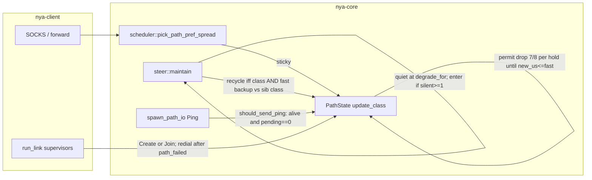
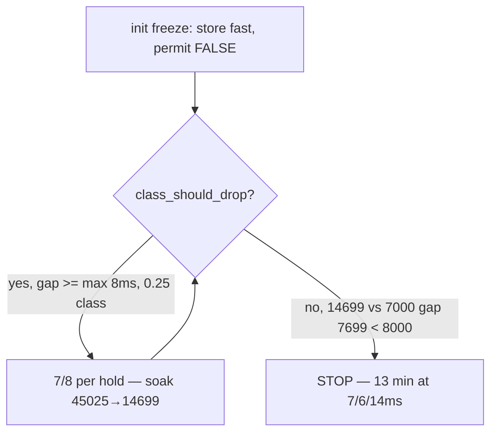

# Overlay algorithm completeness — fifth pass (post-d67ec7d soak)

| Field | Value |
| --- | --- |
| **Author** | nya-link-aggregation maintainers |
| **Date** | 2026-08-29 |
| **Status** | Draft |
| **Audience** | Senior engineers working in `nya-core` (`path.rs` `update_class` / `record_rtt`, tests in `path.rs`; recycle stays in `session/steer.rs`) |
| **Predecessor** | `docs/design-algorithm-completeness.md` (G1–G6, commit `3ecdabd`); `docs/design-algorithm-completeness-2.md` (H1–H3, commit `27587fb`); `docs/design-algorithm-completeness-3.md` (H4–H5, commit `4c59f73`); `docs/design-algorithm-completeness-4.md` (H6, commit `d67ec7d` “Recycle same-link outlier only when fast is still backup.”). This document does **not** re-litigate G1–G6 or H1–H6 except to record what the new soak proved still works, and what residual they left. |
| **Lens** | 30-min generate_204 soak GZ–HK, 9× generate_204, 2026-08-29T13:10:48Z–13:40:48Z, binary `main` `d67ec7d`, log pack `nya-link-aggregation-logs-20260829T1341Z.tar.gz` (extracted `/home/lyn/workspace/nya-link-aggregation/.local/logs-1341/`; journals `.local/logs-1341/client.journal` + `server.journal`). Two named links (`akcdn`, `soy`) × `connections=2`, both ~6–7 ms. `[session]` ping 10–50 ms, `all_down_timeout_ms=8000`. Application **36362 ok / 0 fail / 0 curl-28**. TTFB ≥500 ms: 4; ≥1 s: 3; ≥3 s: 0. Overlay end-of-soak (client PID **3527202**, 13:40:48.597Z): `closed=36365 down=11 deg=75 miss=582 hedge=43 rtx=80 rec=0 corr=0 mig=27 hol=0 stream_resets=4 session_all_down_resets=0 failbacks=0 picks_unk=0` paths `soy#1=8/7/8ms up soy#0=7/6/7ms up akcdn#1=7/6/14ms up akcdn#0=6/2/6ms up`. Used as a *lens* on the algorithm, **not** a target to fit. Contrast previous soak on `4c59f73`: 34066 ok / **10** curl-28; `recycle=10`; `path_down=52`; `hedge=1978` `rtx=2102`. |
| **Compatibility** | No new TOML keys. `[session]` stays `ping_interval_min_ms` / `ping_interval_max_ms` / `all_down_timeout_ms` / `max_paths` with `#[serde(deny_unknown_fields)]`. Production algorithm path is one `Tuning::STANDARD` table; tests clone-and-mutate only. `PROTOCOL_VERSION` stays 1. No wire changes. Do **not** retune `down_min_silence` / `ping_interval_*` / `unknown_degrade_min` / `interactive_max` / `class_drop_*` / `backup_rtt_*` / `failback_*` / `down_timeout_mult` / `stable_raise_*` / `stable_up_hold` to the GZ–HK 6–7 ms path. Do not undo H4 (ping while `is_alive()`). Do not undo H5 (permit walk until `new_us <= fast`, including 1 µs catch-up). Do not undo H6 (recycle AND fast backup, AND-every-tick `else clear`). Do not change `path_score`’s 1024× class term. Do not change `is_backup`. Do not change `class_drop_*` formulas (the 8 ms floor is not the bug; missing permit on init is). Do not change class init to min/median of 8 samples. Do not put `metrics=` back on info. Ping stays **no** log. `n_counter` stays 50. Log packs `nya-link-aggregation-logs-*.tar.gz` stay gitignored; do not commit them. Land this design as `docs/design-algorithm-completeness-5.md`. |

---

## Overview

Commit `d67ec7d` closed H6 (same-link outlier recycle requires **both** class **and** fast to be backup vs the sibling class; AND re-evaluated every tick). A fifth GZ–HK generate_204 soak on that binary confirmed the landing: `recycle=0` the entire soak; zero `outlier recycle` infos; a backup-crossing init freeze (`akcdn#1` class 45025 µs at 13:27:11) did **not** tear the replacement TCP; H5/G4a `class_should_drop` walked 45025→14699; the previous soak’s recycle-tied curl-28 / hedge storm collapsed (`hedge` 1978→43, `path_down` 52→11, curl-28 10→0). Application 36362 / 0 / 0.

It also showed that H6 **revealed** a hole design-4 explicitly parked. Design-4 Key Decision 6 said “Init freeze high is H6, not a new H7 rule” — that was about **recycle**. H6 did its job: 45 ms is backup vs 7 (`45 > 7×2+20 = 34`) but fast had already recovered to ~7 ms by the first drop store (implied fast 6993 µs on `45025→40271`), so `clear_outlier`. The residual is **class stuck in the `class_should_drop` dead zone** because unwind permit is raise-only. At class=14699 µs vs fast≈7000, gap=7699 < `class_drop_abs_us=8000` → drop gate false, permit false, walk **stops**. Snapshot `akcdn#1=7/6/14ms up` from 13:27:28 through 13:40:48 (~13 min). `is_backup(14 ms, 7 ms)` is false, so pick still considers it, but `path_score` is `class_rtt × load × 1024 + fast_rtt × load` — a 14 ms class vs a 6–7 ms sibling is ~2× worse. That TCP is benched for the rest of the session.

H5 permit exists precisely to walk **below** this 8 ms floor until `new_us <= fast` (`raise_permit_allows_drop_below_abs_floor`, `permit_clears_when_seven_eighths_meets_fast`). Init never gets it (`update_class` L331–346 returns before raise; `class_init_window_notes_known_since` L962–979 **locks this**: `assert!(!p.class_unwind_permit_for_test(), "init freeze is not a raise")`). Previously G4b would have recycled the 45 ms TCP (class-only) and we would never have seen the 13-minute 14 ms bench. That is **H7** — arm the same permit bit on init freeze so the existing drop arm can walk through the floor. It is **not** the same product as raise-only H5: H5 arms permit only after a confirmed `2×+15 ms` raise (rare); H7 arms it on **every** path’s 8th sample, and happy-path freeze (`class == fast`) never catch-up-clears, so `permit && fast < class` bypasses the 0.25/8 ms gate for the rest of the session unless a later dip walks to `new_us <= fast`. Paths that never raised no longer keep that gate. Accepted (Key Decision 2).

This is first-principles, not GZ–HK fitting. Any topology where 8 init samples freeze class more than `class_drop_abs` above later fast **or freeze already under that floor vs later fast** (14 vs 7) will stick. The 8 ms floor is `class_drop_abs_us`; the hole is “no unwind permit after init”, not the floor value.

This design closes H7 without new operator knobs and without fitting formulas to 6–7 ms. After storing class and `note_class_known_now()` in the init branch, set `class_unwind_permit = true` (same store as the raise path at L366). At freeze instant class == fast, so `permit && fast < class` is false — no immediate drop. When later Pongs pull fast below class (H4 still pinging; EWMA `(old×8+sample×2)/10`), the existing drop arm walks 7/8 per `stable_up_hold` until `new_us <= fast`, **through** the `class_should_drop` 8 ms floor — including the freeze-already-under-the-floor case a `class_should_drop`-store latch would miss. Client and server both run `PathState::update_class`; recycle stays client-only. `path_score` / `is_backup` / `class_drop_*` / H4 / H5 / H6 unchanged. Drop-info level stays as H5 specified. Ping stays **no** log. Do not put `metrics=` back.

---

## Background & Motivation

### Current architecture (what we are not changing)

From `docs/ARCHITECTURE.md`: one overlay session, many TCP+TLS paths, streams sticky on one path. Scheduler (`scheduler.rs` `fastest_class_set`, `path_score` L158–169):

1. Drop backups (`class > fastest × 2 + 20 ms`).
2. Restrict to the fastest class (`should_failback(candidate, best)` is false).
3. Score `class_rtt × load × 1024 + fast_rtt × load`, `load = 1 + inflight/bias + sticky`.

`steer` (5 ms tick): speculative migrate, failback, same-link HOL rebalance, H2 correlated silence, G4b/H6 outlier recycle. Timeouts from `Tuning::STANDARD` via `health.rs`. Operator TOML is only probe clamp, `max_paths`, `all_down_timeout`.

Class raise is already one 7/8 per `stable_up_hold` with `*high = None` and `class_unwind_permit = true` after store (`path.rs` L358–375). Drop is `class_should_drop || (permit && fast < class)`, G4a pause, clear permit only when `new_us <= fast` (`path.rs` L378–400). Init freeze stores current fast at sample 8, `note_class_known_now()`, **returns before raise**, **does not set permit** (`path.rs` L331–346). Ping while `is_alive()` (`path.rs` `should_send_ping` L272–274, ping arm L608–631). Recycle is client-only, H3 age-gated, H6 class **and** fast backup vs sibling class (`steer.rs` L234–264).

### Soak as a lens (not a fit target)

Client restarted 13:10:28Z PID **3527202** (`session created path=akcdn#0` at 13:10:28.618). Server PID 9908 after recreate. Old PID 3491374 is the previous soak / deploy recreate (`unknown session, will recreate` at 13:10:17 then systemd restart) — ignore except as G1 deploy. Soak window 2026-08-29T13:10:48Z–13:40:48Z. `REPORT.md` and `summary.json` agree: 36362 samples, 36362 ok / 0 fail, 0 `curl_exit=28`.

| Observation | What it is *not* | What it actually showed |
| --- | --- | --- |
| 36362 ok / 0 curl-28; TTFB ≥500 ms: 4; ≥1 s: 3; ≥3 s: 0. Previous `4c59f73`: 34066 / 10 / 7 | “H6 regressed the data path” | Recycle-tied curl-28 / hedge storm collapsed. H6 landed. Residual is a benched TCP, not lost 204s. |
| failbacks=0, `fb_slink=0` | “failback is broken” | Both links ~6–7 ms, same class. `failback_abs` 8 ms floor. Correct. |
| `corr=0` the entire soak (no `correlated silence` info on PID 3527202) | “H2 did not land” | Soy dual-silence is 2 of 4, not N−1 of N≥3. Independent known-RTT ~330 ms deaths are N=1 of 4. Correct per current rule. |
| `picks_unk=0` | “reopen G3” | Closed 204s drop sticky. Do not reopen G3. |
| `recycle=0`; zero `outlier recycle` infos | “H6 is a no-op / G4b died” | Backup-crossing init 45 ms did **not** recycle because fast recovered. Honest 80 vs 7 for a full hold was not observed. H6’s skip path worked; G4b’s positive path is unexercised this soak, not weakened. |
| 12 `kind=drop` infos, **zero** `kind=raise` | “H5 walk did not land” | Permit walk is raise-only. The 12 drops are G4a `class_should_drop` from the 45 ms init freeze down to the 8 ms floor, then **silence** (stuck). |
| `probe_miss` 582 (previous H4 soak 2145) | “H4 ping-while-alive regressed” | H4 expected, quieter session (no recycle storm). Idle snapshots stay `up`. deg=75. |
| `hedge=43` / `rtx=80` (previous 1978 / 2102) | “redesign hedge” | Leftover from independent 330 ms deaths + soy stall. Do not redesign hedge. |
| End-of-soak `akcdn#1=7/6/14ms up` | “snapshot grain / EWMA bug” | Class 14699 µs stuck. Fast and stable recovered. **H7.** |
| `akcdn#0=6/2/6ms` (stable=2 ms) after 13:24 | “class hole / retune stable EWMA” | `record_rtt` pulls stable down on sample `< stable` via `(s_old*3+sample)/4`. Lucky-low sample. `down_for` still clamps to 320 ms. Not H7. |

Known 7 ms `down_for` is `down_min_silence + probe` ≈ 320+10 = **330 ms** (`steer.rs` `down_for` L691–701). Unknown-RTT `down_for` is **550 ms** (`assumed_rtt=100`, `probe=50`, `5×100+50=550`; comment at L692–695). `is_backup` is `rtt > min × 2 + 20 ms` (`health.rs` L33–38, `tuning.rs` `backup_rtt_mult=2.0` / `backup_rtt_add=20ms` L95–96). `class_should_drop` is `gap >= max(class_drop_abs_us=8000, 0.25 * class)` (`tuning.rs` L174–178). None of H7 is a reason to touch `ping_interval_*`, `down_min_silence`, `unknown_degrade_min`, `class_drop_*`, or `backup_rtt_*`.

### What G1–G6 / H1–H6 look like in this soak

| Gap | Status on `d67ec7d` | Residual |
| --- | --- | --- |
| **H6** recycle iff class AND fast backup vs sibling class | `recycle=0`. Backup-crossing init 45 ms (`akcdn#1` freeze 45025 µs at 13:27:11) did **not** recycle; replacement TCP kept; H5/G4a `class_should_drop` walked 45025→14699. Previous soak’s recycle-tied curl-28 / hedge storm collapsed (`hedge` 1978→43, `path_down` 52→11, curl-28 10→0). | Walk stopped at the 8 ms floor because permit is raise-only. **H7.** H6 itself landed. |
| **H5** raise then 7/8 walk | No raise this soak (no `kind=raise`). Permit walk is raise-only. | See H7. Do not undo H5. |
| **H4** DEGRADED still probes | `probe_miss` 582 (not 2145; quieter session). Idle snapshots stay `up`. deg=75. | None. |
| **H1** one 7/8 per hold | No raise to observe. 12 drops are one per `stable_up_hold` (~1 Hz). | Do not reopen. |
| **H2** correlate N−1 of N≥3 | `corr=0`. Soy dual-silence is 2 of 4, not N−1. Correct per `steer.rs` L79–82. `n2_both_silent_tears` / `n4_three_silent_*` lock current rule. | Topology gap on 2×2 named-link stall is **not** this PR (H8, parked). |
| **H3** young-class age-gate | Not exercised (no recycle). | None. |
| **G4b** honest backup recycle | Not observed (no honest 80 vs 7 for a full hold). | Do not weaken. H6’s positive tests (`outlier_recycle_same_link_client` with both clocks 227 ms) stay. |
| **G4a** drop pause | 12 drops, one per hold, then stop. Pause itself works. | Gate cannot start below the abs floor without permit. |
| **G3** zero-load spread | `picks_unk=0`. | Do not reopen. |
| **G1** recreate | Deploy 13:10:17 `unknown session, will recreate` then new PID `session created`. Works. | Deploy, not a hole. |
| **G2** Create `path_name` | Snapshots have no `init=`. Names `akcdn#0/#1 soy#0/#1`. | None. |
| **G6** info scorecard | All eight packed keys present. End-of-soak grammar matches. | Keep it. Do not put `metrics=` back. |

### Smoking gun (H7)

After `akcdn#1` silent-down 13:27:09.787 (`ago=330.86ms down=330ms`, known-RTT) and redial `path_id=15` added 13:27:10.015:

```
13:27:11.485Z  class akcdn#1 45025→40271 kind=drop     (init freeze ~45 ms; kind=init is debug-only)
13:27:12.518Z  40271→36118
13:27:13.548Z  36118→32487
13:27:14.577Z  32487→29322
13:27:15.606Z  29322→26558
13:27:16.641Z  26558→24132
13:27:17.677Z  24132→21990
13:27:18.597Z  snapshot akcdn#1=7/6/21ms up            (walk in progress; fast already 7)
13:27:18.706Z  21990→20117
13:27:19.743Z  20117→18481
13:27:20.777Z  18481→17052
13:27:21.806Z  17052→15793
13:27:22.835Z  15793→14699 kind=drop
13:27:28.597Z  snapshot akcdn#1=7/6/14ms up            (fast already 7 ms)
13:40:48.597Z  snapshot akcdn#1=7/6/14ms up            (STUCK 14 ms class for the remaining ~13 min)
```

Twelve `kind=drop` infos, then silence. Zero recycle. Reverse the first 7/8: `(45025×7 + F)/8 = 40271` ⇒ `F = 6993` µs. Fast had already recovered to ~7 ms by the **first** drop store (~1.5 s after add; H4 still pinging). Last drop implied F ≈ 7041. H6 correctly skipped recycle (`is_backup(7 ms, sibling ~7 ms)` is false). G4a `class_should_drop` then walked until it could not.

Math (not 7 ms fitting):

- Init freeze (`path.rs` `update_class` L331–346) stores current `fast` at sample 8, **returns before raise**, **does not set `class_unwind_permit`**. Test `class_init_window_notes_known_since` (`path.rs` L962–979) **locks this**: `assert!(!p.class_unwind_permit_for_test(), "init freeze is not a raise")`.
- Drop arm is `class_should_drop || (permit && fast < class)` (`path.rs` L378–379).
- `class_should_drop` (`tuning.rs` L174–178): `gap >= max(class_drop_abs_us=8000, 0.25 * class)`.
- At class=14699 µs, fast≈7000: gap=7699 < 8000 → **false**. Permit is false. Walk **stops**.
- `is_backup(14 ms, sibling ~6–7 ms)` is `14 > 7×2+20=34`? **No** — not bak, so pick still considers it, but `path_score` (`scheduler.rs` L158–169) is `class_rtt × load × 1024 + fast_rtt × load`. Zero-load: `14699×1024+7000 = 15_058_776` vs sibling `6000×1024+6000 = 6_150_000` (~2.45×). That TCP is benched for the rest of the session.
- H5 permit exists precisely to walk **below** this 8 ms floor until `new_us <= fast`. Init never gets it.

Integer 7/8 from 14699 toward fast=7000, once permit is armed (`new_us = (c_old×7 + fast)/8`):

| Hold | new_us | Snapshot grain (`us/1000`) | Notes |
| --- | --- | --- | --- |
| 0 | 14699 | 14 ms | stuck today |
| 1 | 13736 | 13 ms | already under 2× of 7 ms sibling |
| 8 | 9644 | 9 ms | `path_score` ~1.38× vs 7 ms class |
| 16 | 7906 | 7 ms | 1 ms snapshot grain reached |
| 56 | 7000 | 7 ms | integer stores until `new_us <= fast` |
| ~67 | — | 7 ms | continuous `ln(7699)/ln(8/7) ≈ 67` tail; **canary ~70 s** |

Leaves the ~2× `path_score` loser in **1 hold** (under 2× of sibling class) / **~8 holds** to ~1.4×; snapshot 7 ms in **~16 s**. Integer 7/8 from 14699 toward 7000 is **56** stores; the continuous tail `ln(Δ)/ln(8/7)` is **~67** holds (`ln(906)/ln(8/7) ≈ 51` after grain, plus 16). Do **not** gate a canary on “14→7 in 8 s” (false-fails `7/6/9ms` at 8 s) and do **not** gate catch-up on 56 s. Canary: continuing drop infos past 14699, same `path_id`, no recycle, ~7 ms grain by **~16 s**, catch-up by **~70 s**. The soak-style `7/6/14ms` for minutes after an init freeze whose fast is already 7 is H7 still open.

### Existing tests lock H7 as intended behavior

```962:979:crates/nya-core/src/path.rs
    fn class_init_window_notes_known_since() {
        let p = path();
        for _ in 0..7 {
            p.record_rtt(Duration::from_millis(10));
            assert!(
                p.class_known_since_for_test().is_none(),
                "init window must not timestamp before freeze"
            );
            assert!(!p.class_known());
        }
        p.record_rtt(Duration::from_millis(10));
        assert!(p.class_known());
        assert!(p.class_known_since_for_test().is_some());
        assert!(
            !p.class_unwind_permit_for_test(),
            "init freeze is not a raise"
        );
    }
```

That assertion is load-bearing for the *current* product choice (permit = raise-only) and is the soak bug locked in. After H7 it **must change**: permit true after the 8th sample. Init is still not a raise (no `kind=raise` info; init stays `debug` `kind=init`).

`class_same_class_gap_does_not_drop` (`path.rs` L875–887) pokes class 220 vs fast 180 with permit false and expects no drop. It does **not** go through init. It stays: do **not** set permit on every tick where class > fast.

`lucky_low_first_sample_does_not_freeze_class` (`path.rs` L836–855) stays. Init still stores current fast at sample 8, not min/median.

H5 permit suite (`raise_permit_allows_drop_below_abs_floor`, `permit_clears_when_seven_eighths_meets_fast`, `permit_survives_ewma_descent_dead_zone`, `permit_not_spent_on_one_us_dip`) stays. Recycle suite (H6) stays green — H7 must not skip recycle via permit.

### Pain points in code (cited)

#### H7 — init freeze never arms the unwind permit

```329:346:crates/nya-core/src/path.rs
    fn update_class(&self, fast: u64) {
        let c_old = self.rtt_class_us.load(Ordering::Relaxed);
        if c_old == 0 {
            // Do not freeze class on the first sample — a lucky-low Pong
            // (90ms on a 180ms path) would class-jump every sibling onto it.
            let n = self.class_init_n.fetch_add(1, Ordering::Relaxed) + 1;
            if n >= 8 {
                self.rtt_class_us.store(fast, Ordering::Relaxed);
                self.note_class_known_now();
                tracing::debug!(
                    path = %self.name,
                    old_us = 0u64,
                    new_us = fast,
                    kind = "init",
                    "class"
                );
            }
            return;
        }
```

Comment on the field (`path.rs` L59–60): “Set on a class-raise store; cleared on a drop store iff `new_us <= fast`.” Raise store at L366 is the only `store(true)`. Drop arm at L378–379 cannot walk below `class_drop_abs_us` without that flag.

H4 is why the 8 delayed samples exist at all: DEGRADED (and the young UP TCP) still Ping, so the init window fills during a delay, freezes at 45 ms, then Pongs pull fast to 7 ms. That is H4 working. Suppressing DEGRADED ping to “avoid a high freeze” reopens the dual-degrade deadlock.

---

## Goals & Non-Goals

### Goals

- Close **H7** with path tests covering: init-permit-true after freeze; permit walk **below** the `class_should_drop` abs floor after init (not via raise); walk **until** `new_us <= fast` on the init path (permit clears, then 180 vs 140 / 220 vs 180 do not drop); identical-sample freeze does not drop; production-shaped init then jitter-low-tail **does** 7/8. Existing G1–G6 and H1–H6 tests stay green, including the jitter / raise-hold / permit / correlate / recycle suite listed below. Poke-class jitter tests staying green is **not** sufficient.
- Keep a single production `Tuning::STANDARD`. Formulas stay RTT-adaptive. No new TOML or Tuning fields.
- After H7, an init freeze whose later fast sits under the 8 ms / 25% floor must 7/8-walk toward fast one hold at a time until `new_us <= fast`. Snapshot must not sit at `7/6/14ms` for minutes. Identical-sample freeze (class == fast) must not 7/8; real Pongs that pull fast 1 µs below class start a G4a-paced info drop (accepted; parked 1 ms grain).
- Update `docs/ARCHITECTURE.md` (Chinese) class-clock sentence and `docs/OBSERVABILITY.md` L334 so they do **not** still say never-raised paths use the 0.25/8 ms gate. Drop-info level stays H5 (init stays debug `kind=init`; drop infos still follow when walking). Land this design as `docs/design-algorithm-completeness-5.md`.

### Non-Goals

- New operator TOML knobs. Unknown `[session]` keys still deny. `SessionOpts` stays four keys (`cfg.rs` L131–137).
- Retuning `ping_interval_min/max`, `down_min_silence` (320 ms), `unknown_degrade_min`, `interactive_max` (1500), `class_drop_*`, `backup_rtt_*`, `failback_*`, `down_timeout_mult`, `stable_raise_*`, `stable_up_hold` to the GZ–HK 6–7 ms path.
- Lowering `class_drop_abs_us` / `class_drop_frac` so 14.7 vs 7 drops without permit. That reopens jitter-low-tail (`jitter_low_tail_does_not_drop_class`: 180 vs 140, 40 ms < 0.25×180=45). The floor is not the bug.
- Assigning class to fast at freeze or after recovery.
- Setting permit on every tick where `class > fast`. Breaks `class_same_class_gap_does_not_drop` (poked 220 vs 180, permit false).
- Skipping recycle because permit is true. H6 already uses fast; design-4 rejected permit-as-G4b-inhibit. Init freeze high with recovered fast is H6’s skip; honest slow 5-tuple still recycles.
- Undoing H4 / H5 / H6. Do **not** clear the permit early to “leave ~2× `path_score`”.
- Changing `path_score`’s 1024× class term, `is_backup` formula, or `class_drop_*`.
- Changing class init to min/median of 8 samples. `lucky_low_first_sample_does_not_freeze_class` is load-bearing. Init still stores current fast at sample 8.
- Timeout-stable raise (`record_rtt` `high_since`, `path.rs` L298–324). Same as H1/H5: that clock tracks a sustained delay for loss/down.
- Per-link correlate / hold TCP when a named link’s both conns are silent while another link is healthy (**H8**). Not this PR. Documented under “not a hole” / Alternatives.
- Redesigning hedge / rtx / speculative migrate.
- Packet-loss-inside-TLS in e2e. Impair harness still stalls outside TLS.
- Logging STREAM_DATA / ACK / Ping / Pong, or putting `metrics=` back on info. No new snapshot counters. `n_counter` stays 50. Do **not** demote `kind=drop` info in this PR (H5 trail stays; after H7 the remaining 14→7 walk is ~16 snapshot-grain infos plus a 1 µs catch-up tail through ~70 s — still not 210).
- Bumping `PROTOCOL_VERSION`. No wire changes.
- Server-side recycle. Server still does not dial. H7 **does** change server class (same `update_class`).
- Fitting the 6–7 ms GZ–HK path. The 8 ms floor is `class_drop_abs_us`; the same hole exists on any topology where freeze class − later fast < that floor.

---

## Key Decisions

1. **H7: init freeze sets `class_unwind_permit = true` (same store as a raise).** In `PathState::update_class` init branch, after `rtt_class_us.store(fast)` and `note_class_known_now()`, `class_unwind_permit.store(true, Ordering::Relaxed)`. At freeze instant class == fast, so `permit && fast < class` is false — no immediate drop. When later Pongs pull fast below class, the existing drop arm (`class_should_drop || (permit && fast < class)`, G4a one 7/8 per `stable_up_hold`, clear only when `new_us <= fast`) walks **through** the 8 ms / 25% floor. Init stays `debug` `kind=init` — not a raise info. Field comment at L59–60 extends: set on raise **or** init freeze. Do **not** switch to latching permit only on a `class_should_drop` drop store (Alternative M): that continues a 45→14 mid-walk but misses freeze-already-under-the-floor (14 vs 7), which is the first-principles hole and the merge gate.

2. **Always-on init permit is a product change, not “the same as H5 after a raise.”** H5 arms permit only after a confirmed `2×+15 ms` raise store — rare. H7 arms it on **every** production path’s 8th sample. Permit clears only on a drop store with `new_us <= fast` (`path.rs` L389–391). Happy-path freeze has `class == fast`, so there is **never** a drop store, so permit **stays true for the rest of the session**. After that, `permit && fast < class` bypasses `class_should_drop` on all live paths that completed init. H5’s “paths that never raised still need the 0.25/8 ms gate” is **reversed** for production. The 0.25/8 ms gate remains only for (a) tests that poke `rtt_class_us` without going through init, and (b) paths that have already catch-up-cleared. Accepted because: (a) the hole is freeze already under the abs floor (14 vs 7; `class_should_drop` never true), (b) the only simple latch that covers it is always-on, (c) H5 already chases after any raise, (d) G4a 1 s hold + 7/8 still rate-limits, (e) raise back from stuck-low still needs `fast > 2×class` **and** `+15 ms`. Stuck-low (accepted, not a surprise): after init at 180 ms, a 140 ms jitter-low tail walks class toward 140 (`class_should_drop(180000, 140000)` is false: gap 40 ms < `0.25×180=45`); first 7/8 is `(180000×7+140000)/8 = 175000`; once class is 140 ms, a true 180 ms sibling cannot raise that path back (`fast > 2×140 = 280 ms` binds). Zero-load `path_score`: `140000×1024+140000 = 143_500_000` vs `180000×1024+180000 = 184_500_000` — the jittery TCP is **~22%** cheaper and wins picks until a later catch-up or a 280 ms+ spike. Identical-sample freeze does not 7/8 (`init_freeze_equal_fast_does_not_drop`); real Pongs that pull fast 1 µs below class start a G4a-paced info drop after every freeze — H5 chatter, now on the happy path. Parked 1 ms grain. Alternative “only arm if freeze would already `class_should_drop` vs some later fast” cannot know later fast at freeze time (Alternative F). Alternative “latch permit on a `class_should_drop` drop store” (M) keeps the jitter floor on happy-path init and **misses** 14 vs 7.

3. **Do not skip recycle solely because permit is true.** H6 already uses fast; design-4 rejected permit-as-G4b-inhibit (a still-slow path that keeps raising re-arms permit and would never recycle). H7 arms permit on init; that must not become a G4b inhibit. Recycle predicate stays `is_backup(class, sib) && is_backup(fast, sib)` (`steer.rs` L256–257). The soak 45 ms freeze with recovered 7 ms fast is already a skip via **fast**, not via permit.

4. **Do not assign class to fast. Do not lower `class_drop_abs_us` / `class_drop_frac`. Do not change `path_score` or `is_backup`.** Assign-to-fast is rejected by `confirmed_2_5x_raise_is_seven_eighths_not_assign` and would chatter. Lowering the floor to let 14.7 vs 7 drop without permit reopens `jitter_low_tail_does_not_drop_class`. Quantizing class inside pick reopens `jitter_low_tail_does_not_singleton`. 14 ms is already not backup; the cliff is not why the TCP is benched — `path_score`’s 1024× class term is, and the walk is the fix.

5. **Do not set permit on every tick where `class > fast`.** That would walk paths whose class was stored without a freeze/raise — `class_same_class_gap_does_not_drop` pokes class 220 vs fast 180 with permit false and expects no drop. Permit is armed at **class store events** (init freeze, raise store), not as a continuous “class is high” predicate.

6. **Do not change class init to min/median of 8 samples.** `lucky_low_first_sample_does_not_freeze_class` is load-bearing. A 45 ms freeze when all 8 samples are delayed is an honest reading; if fast then recovers, H7 walks class. H6 keeps the TCP. Init still stores current fast at sample 8.

7. **Init-window permit-true is necessary, not sufficient.** Flip `class_init_window_notes_known_since` (or add `init_permit_true_after_freeze`): after the 8th sample, permit is **true**; init is a class store that may need unwind, not a raise (still no `kind=raise` info). The old `"init freeze is not a raise"` permit-false assertion **locks the bug**. Floor-bypass merge gate `init_permit_walks_below_class_drop_floor` stays (14 vs 7, `!class_should_drop`, two 7/8 steps). **Also required:** an init-path analog of `permit_clears_when_seven_eighths_meets_fast` (walk until `new_us <= fast`, permit **false**, then 180 vs 140 and 220 vs 180 do **not** drop); `init_freeze_equal_fast_does_not_drop`; `init_then_jitter_low_tail_does_drop` (8×180 then 140 **does** 7/8) so poke-class tests cannot hide the product change.

8. **Do not change drop-info level in this PR.** H5 required a raise (now also an init freeze) to be followable by drop infos until `new_us <= fast`. This soak: 12 info drops then silence (the problem is the silence, not the 12). After H7 the remaining 14→7 walk is ~16 snapshot-grain infos plus a 1 µs catch-up tail through **~70 s** — still not the previous 210. Park a 1 ms grain as a **follow-up** if chatter still hurts after H7. Ping stays **no** log. Do not put `metrics=` back.

9. **H8 (per-link correlate for 2×2 named-link stall) is not this PR.** Soy stall 13:24:25–13:24:42 was a real named-link failure, recovered in ~17 s, 0 curl-28 (akcdn held). H2’s N≥3 global rule is load-bearing (`n2_both_silent_tears`). Changing correlate is high risk; previous rounds are one gap per commit. Document the topology gap (production is 2×2, so a single-link stall is never H2) so a later pass can pick it up without re-deriving.

10. **One production `Tuning::STANDARD`. No new TOML.** H7 is one `store(true)` on an existing atomic. `PROTOCOL_VERSION` stays 1 (`nya-proto/src/lib.rs` L17). `n_counter` stays 50 (`export.rs` L371).

11. **Prefer one combined change set** (like `3ecdabd` / `27587fb` / `4c59f73` / `d67ec7d`). This PR is **H7 only**: `path.rs` init permit, tests, `ARCHITECTURE.md` class-clock sentence, this design. Recycle / ping / `class_drop_*` / drop-info logging are not in the diff.

12. **Both ends sample RTT.** Permit on init is a `path.rs` change, so **both** client and server class clocks. Recycle stays client-only. Ship both binaries; a client-only H7 canary still un-benches the client’s pick, which is where generate_204 lands.

---

## Proposed Design

### Architecture (unchanged data path; init freeze arms unwind permit on every path)



### H7 — init freeze arms unwind permit

#### Current

```329:379:crates/nya-core/src/path.rs
    fn update_class(&self, fast: u64) {
        let c_old = self.rtt_class_us.load(Ordering::Relaxed);
        if c_old == 0 {
            let n = self.class_init_n.fetch_add(1, Ordering::Relaxed) + 1;
            if n >= 8 {
                self.rtt_class_us.store(fast, Ordering::Relaxed);
                self.note_class_known_now();
                tracing::debug!(/* kind = "init" */);
            }
            return; // never reaches raise/drop; permit stays false
        }
        // ...
        if raise { /* ... permit.store(true); return; */ }
        let drop = t.class_should_drop(c_old, fast)
            || (self.class_unwind_permit.load(Ordering::Relaxed) && fast < c_old);
```

`with_writers` inits permit false (L105). Reconnect / `inject_named` are new `with_writers` (false) until the 8th sample.

#### Soak

See smoking gun. Freeze 45025, fast recovered to ~6993 by first drop, `class_should_drop` walked twelve 7/8s to 14699, stopped (`7699 < 8000`), sat at `7/6/14ms` for ~13 min. H6 did not recycle (fast not backup). H5 permit was false (not a raise).

#### Fix

```rust
            if n >= 8 {
                self.rtt_class_us.store(fast, Ordering::Relaxed);
                self.note_class_known_now();
                // Class store that may need unwind if later Pongs pull
                // fast under class (including below class_should_drop).
                // class == fast here, so permit && fast < class is false.
                self.class_unwind_permit.store(true, Ordering::Relaxed);
                tracing::debug!(
                    path = %self.name,
                    old_us = 0u64,
                    new_us = fast,
                    kind = "init",
                    "class"
                );
            }
            return;
```

No other branch changes. Drop arm, G4a hold, clear-on-`new_us <= fast`, raise store, H4 ping, H6 recycle: untouched.

```mermaid
flowchart TD
  Sample[record_rtt fast] --> Init{class == 0?}
  Init -->|n < 8| Wait[no store, permit stays false]
  Init -->|n >= 8| Freeze["store fast; note_class_known_now; permit TRUE"]
  Freeze --> Equal{"fast < class? at freeze: no"}
  Equal -->|no| Idle["no drop at freeze; permit stays true"]
  Init -->|class set| Raise{fast > 2x class and +15ms?}
  Raise -->|yes, hold elapsed| Rstore["7/8 store; high=None; permit=true"]
  Raise -->|yes, hold not elapsed| Rwait[no store]
  Raise -->|no| Drop{"class_should_drop OR permit and fast < class?"}
  Drop -->|yes, hold elapsed, new_us > fast| Dstore["7/8 store; permit stays true"]
  Drop -->|yes, hold elapsed, new_us <= fast| Ddone["7/8 store; permit=false"]
  Drop -->|yes, hold not elapsed| Dwait[G4a accum]
  Drop -->|no, fast in (class, 2x class]| Pause["G4a pause; permit stays true"]
  Drop -->|no, else| Pause2[G4a pause low timer]
```

Contrast with today (the soak stop):



Worked examples:

| Case | Permit | Gate | Result |
| --- | --- | --- | --- |
| Soak: freeze 45025, fast ~7000 after H4 Pongs | true (H7) | `class_should_drop` true until ~15 ms, then `permit && fast < class` | Already walks 45→14.7 via G4a. **Continues**: 14699→13736→…→7906 (~16 holds, snapshot 7 ms)→ catch-up by **~70 s**. |
| Happy-path freeze 8× 10 ms | true **for the rest of the session** unless a later dip catch-up-clears | class == fast; `fast < class` false | No drop on an identical extra sample. `init_freeze_equal_fast_does_not_drop`. Real Pongs 1 µs below class start a G4a-paced info drop (accepted chatter). Permit does **not** clear at freeze. |
| Freeze 14 ms, recover 7 ms, hold=0 | true | `class_should_drop(14000, 7000)` **false** (gap 7000 < 8000); permit true | First store `(14000×7+7000)/8 = 13125`. Permit stays (`13125 > 7000`). Floor-bypass merge gate. Walk continues until `new_us <= fast` (`init_permit_clears_when_seven_eighths_meets_fast`). |
| Jitter poke 220 vs 180, never init | false | 40 < 0.25×220=55 | No drop. `class_same_class_gap_does_not_drop`. **Not production.** |
| Jitter poke 180 vs 140, never init | false | 40 < 0.25×180=45 | No drop. `jitter_low_tail_does_not_drop_class`. **Not production.** |
| Production after init: 8× 180 ms then 140 ms | true | `class_should_drop(180000, 140000)` **false**; `permit && fast < class` | **Does** 7/8: `(180000×7+140000)/8 = 175000`. `init_then_jitter_low_tail_does_drop`. |
| Stuck-low aftermath (accepted) | true until catch-up | class walked to 140 ms; true RTT 180 ms | Raise needs `fast > 2×140 = 280 ms` **and** `+15 ms`. 180 cannot raise back. Zero-load `path_score` 143.5 M vs 184.5 M — jittery TCP **~22%** cheaper. |
| After init catch-up (`new_us <= fast`) | **false** | 180 vs 140 / 220 vs 180 | No drop. Init analog of `permit_clears_when_seven_eighths_meets_fast`. |
| Honest slow 5-tuple, freeze 80 ms, fast stays 80 | true | not `fast < class` | No drop via permit. H6 recycles after hold if sibling class is 7. |
| Raise 8→13.25 ms (existing H5) | true on raise store (already true after init) | unchanged | Existing tests stay green. Init permit already true is a no-op store of true. |

Do **not** 7/8 all the way to fast in one hold. Do **not** assign class to fast. `path_failed` / `touch_rx` / `clear_outlier` still do **not** touch the permit. Reconnect is new `with_writers` (false) until the next 8th sample.

Lock order unchanged: init window does not take the high/low/accum trio (returns first). Permit `store(true)` at freeze is Relaxed without that trio, same as today’s init `rtt_class_us.store`. Raise/drop still store/load permit while holding the trio (`path.rs` L353–354).

#### Tests (H7)

All production-path tests use `Tuning::STANDARD`. Short holds via `path.stable_up_hold_us` store (existing class-test pattern). Do **not** require 1 s of wall clock.

Load-bearing today (must stay, with one assertion flip):

| Test | After H7 |
| --- | --- |
| `class_init_window_notes_known_since` | **update**: after 8th sample, `class_unwind_permit_for_test()` is **true**. Comment: init is a class store that may need unwind, not a raise. Still `kind=init` debug (not asserted via tracing). `class_known_since` still Some. |
| `lucky_low_first_sample_does_not_freeze_class` | unchanged. |
| `class_same_class_gap_does_not_drop` | unchanged — pokes class, does not go through init, permit false, 220 vs 180 no drop. **Not** the production lock. |
| `jitter_low_tail_does_not_drop_class` | unchanged poke-class. Production after init **does** drop: `init_then_jitter_low_tail_does_drop`. |
| `raise_permit_allows_drop_below_abs_floor` / `permit_clears_when_seven_eighths_meets_fast` / `permit_survives_ewma_descent_dead_zone` / `permit_not_spent_on_one_us_dip` | unchanged. |
| Recycle suite (H6) | unchanged. Positive recycle still both clocks 227 ms. `outlier_skips_recovered_fast` still skip via fast, not permit. |

New tests (merge gates):

| Test | Where | Asserts |
| --- | --- | --- |
| `init_permit_true_after_freeze` | `path.rs` — **or** the updated `class_init_window_notes_known_since` | 8 samples same RTT (e.g. 10 ms). After 8th: `class_known()`, `class_known_since` Some, `class_unwind_permit_for_test()` **true**. After 7th: permit false, class unknown. Necessary, not sufficient. |
| `init_permit_walks_below_class_drop_floor` | `path.rs` **(floor-bypass merge gate)** | Go through `record_rtt` init window, not a raise. 8× `record_rtt(14 ms)` freezes class at 14000 (EWMA of identical samples). Prime `rtt_ewma_us` / `rtt_stable_us` to 7000 (same priming as H5 — otherwise one 7 ms sample leaves ewma `(14000×8+7000×2)/10 = 12600` and muddies the gate). `stable_up_hold_us = 0` (or 50 ms + sleep like H5). `record_rtt(7 ms)` → store `(14000×7+7000)/8 = 13125`. Assert `!Tuning::STANDARD.class_should_drop(14000, 7000)` so this drop is **permit**, not the 0.25/8 ms gate (gap 7000 < 8000). Permit **stays true** (`13125 > 7000`). A second hold stores `(13125×7+7000)/8 = 12359` (integer), permit still true. Do **not** use 15 ms freeze vs 7 ms: `class_should_drop(15000, 7000)` is **true** (gap 8000 ≥ 8000) and would not lock H7. Two steps lock floor bypass, **not** catch-up. |
| `init_permit_clears_when_seven_eighths_meets_fast` | `path.rs` **(required; init analog of H5 catch-up)** | Freeze via 8× `record_rtt` (e.g. 14 ms). Prime fast below class with `!class_should_drop` (7000 vs 14000). `stable_up_hold_us = 0`. Loop `record_rtt` until a drop store has `new_us <= fast`. Assert permit **false**. Then poke class 180000 / ewma 140000 / `record_rtt(140 ms)` → class stays 180000; poke 220000 vs 180000 → no drop. Without this, CI can go green with permit true and two 7/8 steps while catch-up and post-catch-up jitter floor are untested on freeze. |
| `init_freeze_equal_fast_does_not_drop` | `path.rs` **(required)** | 8× `record_rtt(10 ms)`, `stable_up_hold_us = 0`, one more `record_rtt(10 ms)`: class stays 10000, no 7/8. Locks freeze instant (class == fast) does not drop. Does **not** prove “no chatter” on real Pongs. |
| `init_then_jitter_low_tail_does_drop` | `path.rs` **(required; product-change lock)** | 8× `record_rtt(180 ms)` freeze. Prime `rtt_ewma_us` / `rtt_stable_us` to 140000. `stable_up_hold_us = 0`. `record_rtt(140 ms)` → store `(180000×7+140000)/8 = 175000`. Assert `!class_should_drop(180000, 140000)` so this is permit, not the 0.25/8 ms gate. Poke-class `jitter_low_tail_does_not_drop_class` staying green must **not** hide this. |

Do not jump ewma 45000→7000 and call that the floor lock if the first store is still `class_should_drop` (it would pass **without** permit). The floor-bypass gate’s first recovered store must have `!class_should_drop(c_old, fast)`.

Optional soak-replay (not a substitute for the 14 vs 7 gate **or** the catch-up test): 8× 45 ms freeze, prime ewma 7000, hold=0, loop `record_rtt(7 ms)` until `class_should_drop` is false, then one more store happens and class < that floor. That is still not catch-up-to-fast.

```mermaid
sequenceDiagram
  participant IO as path IO
  participant C as update_class
  participant S as path_score
  IO->>C: 8 delayed Pongs (H4 still probing)
  C->>C: freeze class=45ms, permit=true (H7)
  Note over C: class==fast, no drop yet
  IO->>IO: Pongs recover, fast EWMA → 7ms
  C->>C: class_should_drop walks 45→14.7 (already true)
  C->>C: permit drop 14.7→13.7→… until new_us<=fast
  S->>S: 1024× class shrinks each hold; TCP kept (H6)
```

### Soak events that are NOT holes

1. **google.com.hk max 2271 ms** at 13:25:19.988Z: `ttfb_ms=2270.8`, `tls_ms=2195.7`, overlay delta ~75 ms. Origin TLS. Same for connectivitycheck 1138.6 (`tls_ms=1003.5` at 13:25:09.462, next to akcdn#1 silent-down 13:25:09.962) and google.hk 1040.5 (`tls_ms=1030.9` at 13:24:55). REPORT’s “仍是尾部” is origin, not overlay. Fourth ≥500 ms is cloudflare 640 (`tls_ms=589` at 13:19:32).

2. **Independent known-RTT ~330 ms deaths:** akcdn#0 13:21:58 `ago=334.9 down=332.8`; akcdn#1 13:25:09 `ago=372.3 down=370`; akcdn#1 13:27:09 `ago=330.9 down=330`. `down_for = max(5×rtt, 320ms)+probe`. Real silence, not a hair-trigger. Do **not** retune `down_min_silence`. Modest hedge on those windows.

3. **Soy named-link stall 13:24:25–13:24:42.** soy#0 silent-down `ago=445.7 down=442.8` (known), soy#1 `ago=547.2 down=546.2` (unknown 550), then reconnect storm: RST (`path_id=6` added 13:24:26.807, read failed 145 ms later), 550 ms unknown-RTT downs on young TCPs (`path_id=7` added 13:24:27.401 down 13:24:28.007 `ago=550.2 down=550`), tls connect timeout (soy#0 13:24:37.728, soy#1 13:24:41.713), soy#1 silent 2.07 s / 2.93 s. Snapshot 13:24:28 `soy#1=283/250/432ms` (honestly slow, then died). Snapshot 13:24:38 **no soy paths** (both down; `paths_alive=2`, only akcdn). Recovered 13:24:48 `soy#1=8/7/8 soy#0=7/7/7`. Application: 0 curl-28 (akcdn held). H2 did not fire: 2 of 4 ≠ N−1 of N≥3 (`steer.rs` L79–82). `n2_both_silent_tears` / `n4_three_silent_*` lock current rule. 550 ms unknown `down_for` is correct (`steer.rs` L691–701, `assumed_rtt=100ms` when unknown: `5×100+50=550`). Design-4 said the 550 cascade was from wrong recycle; this soak shows it also happens on a **real** named-link stall. That is not a reason to retune `unknown_degrade_min` / `down_timeout_*`.

   **H8 (parked):** per-link correlate / hold TCP when a named link’s both conns are silent while another link is healthy. Lean: **not this PR**. Reasons: 0 timeouts; tails are origin; tearing a dead named link and redialing recovered in ~17 s; H2’s N≥3 global rule is load-bearing (`n2_both_silent_tears` L1838–1850 — N=2 both silent **must** tear); changing correlate is high risk; previous rounds are one gap per commit. Production is 2×2, so a single-link stall is never H2. A later pass can pick this up without re-deriving. Do **not** silently drop it — see Alternatives.

4. **akcdn#0 snapshot `6/2/6ms`** (stable=2 ms) for most of the soak after 13:24. `record_rtt` (`path.rs` L303–306) pulls stable down on sample `< stable` via `(s_old*3+sample)/4`. Lucky-low sample. `down_for` still clamps to 320 ms (`tuning.rs` L138–141). Not a class hole. Do not retune stable EWMA. Do not treat as H7.

5. **failbacks=0, picks_unk=0, hol=0, corr=0:** both links same class. Correct.

6. **Drop-info chatter:** this soak 12 `kind=drop` infos (the 45→14 walk), then silence (stuck). Design-4 parked 1 ms info grain as follow-up after H6. Chatter is **not** the problem this soak. After H7 the remaining 14→7 walk is ~16 snapshot-grain infos plus a 1 µs catch-up tail through **~70 s**. Still not 210. Keep drop-info at info (H5 trail). Do **not** demote in this PR. Happy-path freeze also makes every later 1 µs `fast < class` dip a G4a-paced info drop — accepted product of always-on permit, same parked grain.

7. **hedge=43 / rtx=80:** leftover from independent 330 ms deaths + soy stall. Do not redesign hedge.

8. **probe_miss=582:** H4 expected, quieter than 2145.

9. **`stream_resets=4`**, **`session_all_down_resets=0`** on the end-of-soak line (`13:40:48.597Z`). Those are different fields. Packed scorecard `resets=4` was `stream_resets`, not all-path-down. `session_all_down_resets=0` is the all-path-down / correlated-budget counter — not a new hole (0 curl-28; session never all-down). Do not retune `all_down_timeout`.

---

## API / Interface Changes

No public API, no wire, no TOML.

### `PathState::update_class`

Init freeze (n ≥ 8, `c_old == 0`) additionally:

```text
rtt_class_us.store(fast)
note_class_known_now()
class_unwind_permit.store(true)   // NEW
debug kind=init                   // unchanged
return
```

Raise store, drop boolean, G4a, clear-on-`new_us <= fast`: **unchanged**. `should_send_ping`, `record_rtt` EWMA / timeout-stable: **unchanged**. `class_unwind_permit_for_test` already exists (`path.rs` L452–454).

### `Session::maybe_recycle_outliers` / `path_score` / `is_backup` / `class_should_drop` / `should_send_ping`

**Unchanged.**

### TOML / Tuning / proto

**None.** `SessionOpts` still four keys (`cfg.rs` L131–137). `PROTOCOL_VERSION` stays 1. `class_drop_abs_us` / `class_drop_frac` / `stable_raise_*` / `stable_up_hold` stay.

---

## Data Model Changes

No durable store, no wire. In-memory: `class_unwind_permit` already exists; H7 stores `true` at init freeze (was false until a raise store). Reconnect / `inject_named` still start false (`with_writers` L105) until the 8th sample.

Migration: rolling deploy. H7 is local to each process’s class clock (both client and server sample RTT). Mixed-version: old side still benches a high init class; new side walks. Pick is local, so a client-only canary un-benches client `open_stream`. Server class still feeds server HOL / backup dest — ship both. Recycle stays client-only (H6).

---

## Alternatives Considered

| Alternative | Trade-off |
| --- | --- |
| **A. Init freeze sets permit (chosen)** | One `store(true)` on an existing atomic. Freeze instant does not drop (class == fast). Walks through the 8 ms floor, **including freeze-already-under-the-floor** (14 vs 7). Recycle unused (H6 already uses fast). No new TOML. Product cost: every production path has permit true until catch-up; happy-path freeze never catch-up-clears; 0.25/8 ms gate no longer protects never-raised production paths; stuck-low 180→140 cannot raise back (`fast > 280 ms`); `path_score` tilts ~22% toward the jittery TCP. Accepted (KD2). Poke-class jitter tests staying green is not the product lock — `init_then_jitter_low_tail_does_drop` is. |
| B. Lower `class_drop_abs_us` below 7 ms / shrink `class_drop_frac` | Fits GZ–HK. Reopens `jitter_low_tail_does_not_drop_class`. Forbidden retune. The floor is not the bug. **Rejected.** |
| C. Assign class to fast after init / skip the walk | Rejected by `confirmed_2_5x_raise_is_seven_eighths_not_assign`. Chatter. H7 lets the walk *start*, it does not shorten 7/8. |
| D. Change class init to min/median of 8 samples so freeze is not 45 ms | Rejected since H3. A 45 ms init when all 8 samples are delayed is an honest reading; if fast then recovers, H6 keeps the TCP and H7 walks class. `lucky_low_first_sample_does_not_freeze_class` is load-bearing. |
| E. Set permit on every tick where `class > fast` | Walks poked-class tests (`class_same_class_gap_does_not_drop` 220 vs 180). Permit is a store-event latch, not a continuous predicate. **Rejected.** |
| F. Only arm permit if freeze class would already `class_should_drop` vs some **later** fast | Clairvoyant. Cannot know later fast at freeze time. A 14 ms freeze vs later 7 ms is *not* `class_should_drop` at freeze (class == fast) and *not* at recover (gap 7 < 8) — that is the soak hole. **Rejected.** |
| **M. Latch permit on a `class_should_drop` drop store** (not F) | Set `class_unwind_permit = true` when G4a stores a `class_should_drop` drop (soak first `45025→40271`). Continues the twelve-drop walk through the 8 ms floor. Happy-path init stays permit-false; `jitter_low_tail_does_not_drop_class` stays meaningful for production. **Misses freeze-already-under-the-floor** (14 vs 7, gap 7000 < 8000 — the merge gate and the first-principles hole). **Rejected.** |
| G. Skip recycle while permit is true (revisit design-4 C) | A still-slow path that keeps raising re-arms permit and never recycles. Init freeze with recovered fast is already a skip via H6 fast. **Rejected.** |
| H. Undo H4 so the init window does not fill with delayed samples | Reopens dual-degrade deadlock. 45 ms freeze is H4 working during a real ~330 ms death + redial. **Rejected.** |
| I. Recycle on “same-class but 2× `path_score`” so the 14 ms TCP is torn | Rejected in H5. Would redial a recovered 7 ms 5-tuple. G4b exists for honest backups (`>2×+20 ms`). H6 already skipped this freeze because fast recovered. |
| J. Demote `kind=drop` info to debug / 1 ms grain in this PR | H5 trail is load-bearing; this soak’s problem is silence after 12 drops, not chatter. After H7, ~16 snapshot-grain infos plus a ~70 s 1 µs tail, still not 210. Follow-up. **Not this PR.** |
| K. H8: per-link correlate when both conns of a named link are silent and another link is healthy | 2×2 topology gap: a single-link stall is 2 of 4, never H2. This soak’s soy stall recovered in ~17 s with 0 curl-28. `n2_both_silent_tears` is load-bearing. High risk, one-gap-per-commit. **Parked.** See Open Questions. |
| L. Retune `unknown_degrade_min` / `down_timeout` / `down_min_silence` because of 550 ms soy cascade or 330 ms deaths | Real stall / real silence. Unknown 550 ms `down_for` is correct. Forbidden. |

---

## Security & Privacy Considerations

- No new wire fields, no new listen address, no new log payload. Class init stays debug `kind=init`; raise/drop stay the existing info events (`path, old_us, new_us, kind`). Ping still has **no** log (`OBSERVABILITY.md` L334).
- Path names (`soy#0`) and class microseconds are existing surface.
- H7 does not enlarge the trust boundary. It walks an in-memory class clock on a 5-tuple the process already owns. Recycle is unchanged (does not tear more).
- Mixed-version: old peer still benches its own class; no handshake change.

---

## Observability

| Question | Probe at default info after this work |
| --- | --- |
| Did an init freeze bench a recovered TCP at ~2× `path_score`? | After a redial, debug `kind=init` (or the first `kind=drop` from a high class with no preceding `kind=raise`) must be followable by drop infos one per hold until snapshot class has walked to recovered fast. Soak-style `7/6/14ms` for minutes, with recovered fast and no further drops, is H7 still open. **Do not** gate a canary on “14→7 in 8 s” — after 8 holds class is ~9.6 ms; snapshot 7 ms is ~16 s; catch-up by **~70 s** (integer 56 stores, continuous ≈67). |
| Did H6 still skip recovered-fast recycle? | `recycle=` stays 0 on a freeze whose next snapshot already shows fast under the cliff. `outlier recycle` info must not fire. |
| Did G4b still fire on an honest backup? | `recycle+=1` when snapshot shows fast **and** class above `sib×2+20` for a full hold. Not observed this soak; do not weaken. |
| Did raise ratchet? | Unchanged H1: at most one `kind="raise"` per `stable_up_hold` per path. This soak had zero raises. Init is **not** a raise info. |
| Did dual-degrade recover? | Unchanged H4: idle snapshots stay `up`; `probe_miss` may tick. |
| Did sequential N−1 hold TCP? | Unchanged H2: `corr+=1` only with `silent>=1`. This soak correctly left `corr=0` (soy stall was 2 of 4). |
| Did we speculatively migrate / hedge around a real flap? | `mig=` / `hedge=` / `rtx=` on the 10 s snapshot. Independent 330 ms deaths and a real named-link stall may still hedge. Do not alert on hedge alone. |

Alerting (optional, not in-tree): a 30 min GZ–HK soak whose path snapshot sits at `fast/stable/class` with class ≈ 2× fast for many `stable_up_hold` after an init freeze (no `kind=raise`, no further `kind=drop`) is H7 open. `recycle` clustered 1–2 s after a freeze whose snapshot already shows recovered fast is H6 open (must stay closed). Do **not** alert on `probe_miss` vs the 265 / 2145 baselines (H4). Do **not** put `metrics=` back. `n_counter` stays 50.

Info snapshot grammar unchanged. Packed keys stay `mig/hol/hedge/rtx/fb_slink/picks_unk/recycle/corr`. Init stays debug.

---

## Rollout Plan

- **Feature flags:** none. Behavior change is the algorithm.
- **Deploy order:** **Ship both binaries.** H7 is local `update_class` on every process that samples RTT. Client-only un-benches client pick (generate_204). Server class still feeds server HOL / `backup_prefer_class`. Recycle is client-only and unchanged.
- **Staged:** canary one GZ–HK pair with both client and server. Watch: after a redial that freezes class high (first `kind=drop` from tens of ms with no `kind=raise`), drop infos continue one per hold **past** the 8 ms floor until snapshot class meets recovered fast (~16 s to 7 ms grain from 14.7; catch-up by **~70 s**). Same `path_id`, `recycle` still 0 if fast recovered. Must **not** sit at `7/6/14ms` for minutes. Also: identical-sample freeze does not 7/8 at session start; a 1 µs `fast < class` dip after freeze may start a G4a-paced info drop (accepted); `corr` still 0 on N=1 of 4 and on 2-of-4 soy-style stalls; failbacks still ~0 on equal-class links; `probe_miss` stays in the H4 regime; info snapshot size unchanged; `kind="raise"` still at most one per hold; drop infos still at default info.
- **Rollback:** revert the PR. No TOML to undo.
- **Prefer one combined change set** (like `3ecdabd` / `27587fb` / `4c59f73` / `d67ec7d`). This PR is H7 only. A later drop-info log-level change or H8 per-link correlate is not a soak-canary of H7.
- **Risks**

| Risk | Sev | Mitigation |
| --- | --- | --- |
| Identical-sample freeze 7/8s | Low | At freeze class == fast so `fast < class` is false. Required: `init_freeze_equal_fast_does_not_drop`. |
| Real Pongs 1 µs below class start G4a-paced info drops after every freeze | Low/accepted | Same H5 chatter, now on the happy path (permit never clears unless catch-up). 1 s hold rate-limits. Parked 1 ms grain. Do not demote in this PR. |
| Production path after freeze chases jitter-low-tail (180→140; 7→5) | Med/accepted | Product fork (KD2), **not** “same as H5.” G4a 1 s + 7/8 rate-limits. Required: `init_then_jitter_low_tail_does_drop`. Poke-class jitter tests staying green do **not** lock this. |
| Stuck-low: class walked to 140 ms, true RTT 180 ms, cannot raise back | Med/accepted | Raise needs `fast > 2×class` **and** `+15 ms` → 280 ms vs 140. Zero-load `path_score` tilts **~22%** toward the jittery TCP (`143.5 M` vs `184.5 M`). Documented, not a surprise. Catch-up still needs `new_us <= fast` (a later equal-RTT recovery does not raise). |
| Forgotten permit-set: CI goes green because 45→14 still walks via `class_should_drop` | High | Floor-bypass `init_permit_walks_below_class_drop_floor` asserts `!class_should_drop(14000, 7000)` before the store. A 15 ms vs 7 ms freeze would **not** lock H7. Flip `class_init_window_notes_known_since` to permit **true**. Catch-up test required so two 7/8 steps are not enough. |
| Using permit to skip recycle | High | Recycle code not in the diff. Review: `steer.rs` predicate still `p.rtt()`, not `class_unwind_permit`. H6 tests stay green. |
| Lowering `class_drop_*` “instead of permit” | High | Forbidden. Merge gate asserts the abs-floor `class_should_drop` is still false at 14 vs 7. Existing jitter tests stay green. |
| Changing `path_score` “to hide 14 vs 7” | High | Forbidden. `jitter_low_tail_does_not_singleton` is the lock. The walk closes the 2× hole. |
| Canary gates on 14→7 in 8 s, or catch-up in 56 s | Med | False-fail: after 8 holds class is ~9.6 ms; continuous tail ≈67 holds. Gate on continuing drop infos past 14699, same `path_id`, no recycle, ~7 ms grain by ~16 s / catch-up by **~70 s**. |
| Drop-info demotion hides the H7 walk at default info | n/a this PR | Not in the change set. Follow-up only if chatter remains after H7. |
| H8 soy stall still tears unknown-550 TCPs | Low/accepted | 0 curl-28 this soak. Parked. Do not retune `down_for`. |

---

## Open Questions

None that block implementation. Product forks are decided in Key Decisions (**always-on init permit**, with the 0.25/8 ms gate no longer protecting never-raised production paths and stuck-low ~22% `path_score` tilt accepted; not a `class_should_drop`-store latch; no permit-as-recycle-skip; no assign-to-fast; no floor retune; no continuous class>fast permit; no init min/median; drop-info level **not** this PR; H8 **not** this PR; combined H7-only change set).

If a follow-up wants `kind=drop` info only when `old_us - new_us >= 1000`, wait until after an H7 soak: H5/H7’s info trail is load-bearing for the 14.7→7 walk (first permit step 14699→13736 is 963 µs — a 1000 µs floor would make that entire remaining walk debug, same trap design-4 parked for the 933 µs H5 step). Do not pick a fitted threshold to keep 963 µs.

If a follow-up wants **H8** (per-link correlate: hold a named link’s TCPs when both conns are silent and another named link is healthy), it is a new predicate next to H2’s global N−1 of N≥3. Production 2×2 never hits H2 on a single-link stall. Must not break `n2_both_silent_tears`. Not this PR.

If a follow-up wants timeout-stable raise to also clear `high_since` after 7/8, it is the same out-of-scope item H1/H5/H6 left — not this PR.

If a follow-up wants try-send/timeout on the Ping write (H4), it is a separate IO design — not this PR.

---

## Test plan (every named gap)

All production-path tests use `Tuning::STANDARD`. Class hold only via `path.stable_up_hold_us` store.

| Gap | Unit | Session | e2e |
| --- | --- | --- | --- |
| H7 permit true after freeze | `init_permit_true_after_freeze` / updated `class_init_window_notes_known_since`: 8th sample permit **true** | — | no |
| H7 walk below abs floor | `init_permit_walks_below_class_drop_floor`: 8× `record_rtt(14 ms)` freeze 14000; ewma.store(7000); hold=0 or 50 ms+sleep; `!class_should_drop(14000, 7000)`; store 13125, permit still true; second hold 12359, permit still true | — | no |
| H7 walk until catch-up | `init_permit_clears_when_seven_eighths_meets_fast`: freeze via init; `!class_should_drop`; loop hold=0 until `new_us <= fast`; permit **false**; then 180 vs 140 and 220 vs 180 do **not** drop | — | no |
| H7 freeze instant | `init_freeze_equal_fast_does_not_drop` **required**: 8× 10 ms + one more 10 ms, class stays 10000 | — | no |
| H7 production jitter chase | `init_then_jitter_low_tail_does_drop` **required**: 8× 180 ms then 140 ms **does** 7/8 to 175000; `!class_should_drop(180000, 140000)` | — | no |
| H5 permit walk | existing `raise_permit_*` / `permit_*` | — | — |
| H6 recycle | existing `outlier_*` | existing | no |
| H4 ping-while-alive | existing `should_send_ping` tests | existing silence/correlate | no |

Existing tests that must stay green: `jitter_low_tail_does_not_drop_class`, `class_same_class_gap_does_not_drop`, `one_low_sample_does_not_collapse_class`, `jitter_low_tail_does_not_singleton`, `class_hold_zero_drop_is_seven_eighths_vs_fast`, `lucky_low_first_sample_does_not_freeze_class`, `raise_store_clears_high_timer`, `class_init_window_notes_known_since` (**permit true**), `raise_permit_allows_drop_below_abs_floor`, `permit_survives_ewma_descent_dead_zone`, `permit_not_spent_on_one_us_dip`, `permit_clears_when_seven_eighths_meets_fast`, `degraded_path_still_probes`, `down_path_does_not_probe`, `pending_ping_blocks_probe`, `idle_gate_does_not_probe`, `up_path_still_probes`, `silence_without_ping_marks_degraded`, `n4_three_silent_migrates_without_path_down`, `n4_three_quiet_sequential_holds_until_budget`, `n4_three_quiet_no_down_for_does_not_hold`, `n4_all_silent_tears`, `n2_both_silent_tears`, `n2_one_silent_downs`, `single_path_silence_still_downs_without_degraded`, `unknown_rtt_still_tears`, `outlier_recycle_same_link_client`, `outlier_recycle_young_class_waits_hold`, `outlier_skips_recovered_fast`, `outlier_clears_when_fast_recovers_mid_hold`, `outlier_recycle_not_on_server`, `outlier_recycle_ignores_other_link`.

CI: `fmt`, `clippy`, `cargo test --exclude nya-e2e`, plus `nya-e2e` lib/bin as today. Full matrix local/nightly. e2e matrix is not a merge gate unless a scenario that already exists would regress (none identified; impair stays outside TLS). H7 is `record_rtt` / `update_class` — path unit tests are the gate, not e2e.

---

## Docs to update (in the implementing PR, not only this design)

- `docs/ARCHITECTURE.md` (Chinese), L63 class paragraph. Replace/extend the raise/permit sentence with exactly:

  > raise 仍是 hold 后一次 7/8；raise store 与 init freeze 都置 unwind permit。完成 init 的生产路径 permit 为真，直到某次 drop store 的 new_us ≤ fast 才清；happy-path freeze（class==fast）不会 catch-up 清 permit，故 `permit && fast < class` 在会话剩余时间绕过 0.25/8 ms 门。fast < class 时每 hold 一次 7/8。EWMA 从尖刺回落到 (class, 2×class] 死区时 permit 保持。仅 poke class 的测试、以及已经 catch-up 清 permit 的路径仍走 0.25/8 ms 门。timeout-stable 仍不是这套时钟。DEGRADED 仍探活（在途 Ping 最多一条）。

  Recycle sentence at L77 stays (H6). Do not retell G1–G6 / H1–H6 except to keep the hybrid-correlate / H6 recycle sentences accurate. Do **not** leave “未 raise 过的路径仍走 0.25/8 ms 门” as if that were production.

- `docs/OBSERVABILITY.md` L334: **replace** “未 raise 过的路径仍走 0.25/8 ms 门” with the same product wording as ARCHITECTURE (permit from raise **or** init; happy-path freeze does not catch-up-clear; gate remains for poke-class / post-catch-up). Init stays debug `kind=init`; drop infos still follow when walking (now after init freeze as well as after raise) until `new_us ≤ fast`. Do not put `metrics=` back. Do not change drop-info level in this PR. Ping **no** log. Suggested L334 clause:

  > 稀有。raise 是每 hold 一次 7/8。init freeze 也置 permit；之后 drop 也是每 hold 一次，直到这次 drop 的 `new_us ≤ fast`（permit 清掉）。happy-path freeze（class==fast）不会 catch-up 清 permit，生产路径在会话剩余时间走 `permit && fast < class`，不再是「未 raise 过仍走 0.25/8 ms 门」。仅 poke class 的测试 / 已 catch-up 的路径仍走该门。

- This document lands as `docs/design-algorithm-completeness-5.md`.

- `.gitignore` already has `nya-link-aggregation-logs-*.tar.gz` (L12) and `.local/` (L14). Workspace currently has untracked `nya-link-aggregation-logs-20260829T0423Z.tar.gz`, `…T0910Z.tar.gz`, `…T1045Z.tar.gz`, `…T1223Z.tar.gz`, `…T1341Z.tar.gz` — do not add them. Do **not** ignore every `*.tar.gz`.

---

## Completeness verdict

The overlay algorithm is **not** complete on `d67ec7d`. H6 did what it was specified to do (recycle=0; 45 ms freeze kept because fast recovered). Unexpected behavior in this soak is **akcdn#1 benched at 14 ms class for 13 minutes** after an init freeze that `class_should_drop` walked to the 8 ms floor and then stopped because permit is raise-only. That is **H7**: arm unwind permit on init freeze so class walks through the floor, including freeze-already-under-the-floor (14 vs 7). The latch is the same bit as H5; the **product** is not raise-only H5 — every production path that completes init has permit true until catch-up, and happy-path freeze never catch-up-clears.

Remaining first-principles hole: **H7** (init freeze must arm unwind permit; always-on, not a `class_should_drop`-store latch). After H7, this soak does not show another algorithm hole that this PR should spend. Remaining optimization space is operability (1 µs / sub-1 ms drop-info chatter — **follow-up**, keep H5’s info trail in this PR) and previously parked items (timeout-stable raise ratchet; Ping `send_frame` `.await` stall; possible later **H8** per-link correlate for 2×2 named-link stall). Do not spend it on GZ–HK 6–7 ms fitting.

---

## References

- `docs/design-algorithm-completeness.md` — G1–G6, commit `3ecdabd`.
- `docs/design-algorithm-completeness-2.md` — H1–H3, commit `27587fb`.
- `docs/design-algorithm-completeness-3.md` — H4–H5, commit `4c59f73`.
- `docs/design-algorithm-completeness-4.md` — H6, commit `d67ec7d`. Predecessor; do not re-litigate H6 except as proven-landed.
- `docs/ARCHITECTURE.md` — overlay model, class clocks L63, DEGRADED/down, correlated N−1, same-link recycle L77, score formula.
- `docs/OBSERVABILITY.md` — snapshot grammar, class raise/drop info L334, Ping **no** log, `corr`.
- `crates/nya-core/src/path.rs` — `rtt` L188–191, `class_rtt` L200–203, `should_send_ping` L272–274, `record_rtt` EWMA L288–327, `update_class` L329–406, permit field L59–60 / raise L366 / drop L378–390, init window L331–346, `mark_outlier` / `clear_outlier` / `class_known_aged` L408–427, ping arm L608–631, `class_init_window_notes_known_since` L962–979, `lucky_low_first_sample_does_not_freeze_class` L836–855, `class_same_class_gap_does_not_drop` L875–887, H5 permit tests L1047–1166.
- `crates/nya-core/src/session/steer.rs` — `maintain` L42–232, correlated L63–82 / L79–82, `maybe_recycle_outliers` L234–280, `degrade_for` / `down_for` / `probe_interval_for` L687–711.
- `crates/nya-core/src/health.rs` — `is_backup` L33–38, `assumed_rtt` L69–80.
- `crates/nya-core/src/tuning.rs` — `Tuning::STANDARD` (`backup_rtt_mult=2.0`, `backup_rtt_add=20ms`, `stable_up_hold=1s`, `class_drop_abs_us=8_000`, `class_drop_frac=0.25` L95–109), `class_should_drop` L174–178.
- `crates/nya-core/src/scheduler.rs` — `path_score` L158–169 (1024× class term).
- `crates/nya-core/src/cfg.rs` — `SessionOpts` four keys L131–137, `deny_unknown_fields`.
- `crates/nya-core/src/session/mod.rs` — `n2_both_silent_tears` L1838–1850, `n4_three_silent_migrates_without_path_down` L1867, `n4_all_silent_tears` L1908, `unknown_rtt_still_tears` L1925, H6 recycle tests L1961–2087.
- `crates/nya-core/src/export.rs` — `n_counter == 50` L371.
- `crates/nya-proto/src/lib.rs` — `PROTOCOL_VERSION = 1` L17.
- Soak: `.local/logs-1341/client.journal` (PID 3527202; ignore 3491374 except deploy), `.local/logs-1341/server.journal`, `.local/logs-1341/nya-link-aggregation-logs-20260829T1341Z/results/204-soak/{REPORT.md,summary.json,samples.csv}`.

---

## PR Plan

Default is **one combined change set**, same as `3ecdabd` / `27587fb` / `4c59f73` / `d67ec7d`. This repo lands algorithm completeness as one commit on main, not a Graphite stack. This PR is **H7 only**. Drop-info log level and H8 per-link correlate are follow-ups — not in the default diff.

### PR 1 (default) — Init freeze arms class unwind permit

- **Title:** `overlay: arm class unwind permit on init freeze so class walks below the drop floor`
- **Files / components:**
  - `crates/nya-core/src/path.rs` — `update_class` init branch: after store + `note_class_known_now()`, `class_unwind_permit.store(true)`; field comment L59–60; flip `class_init_window_notes_known_since` permit assertion to true; add `init_permit_walks_below_class_drop_floor` (8× 14 ms freeze, ewma 7 ms, `!class_should_drop`, 7/8 to 13125 then 12359, permit stays); add `init_permit_clears_when_seven_eighths_meets_fast` (walk until catch-up, permit false, then 180 vs 140 / 220 vs 180 do not drop); add `init_freeze_equal_fast_does_not_drop` **required**; add `init_then_jitter_low_tail_does_drop` **required** (8×180 then 140 **does** 7/8)
  - `docs/ARCHITECTURE.md` — L63 class-clock sentence (exact Chinese text in “Docs to update”; production always-on permit, not “never-raised still 0.25/8 ms”)
  - `docs/OBSERVABILITY.md` — **replace** L334 “未 raise 过的路径仍走 0.25/8 ms 门”; drop infos also follow an init freeze until `new_us ≤ fast`; init stays debug; **do not** change drop-info level
  - `docs/design-algorithm-completeness-5.md` — this document
- **Dependencies:** none (lands on `d67ec7d`).
- **Description:** H6 stopped tearing recovered TCPs after a high init freeze, which revealed that permit is raise-only: `class_should_drop` walks to the 8 ms abs floor and stops, leaving a ~2× `path_score` loser for the rest of the session (soak: `akcdn#1=7/6/14ms` for 13 min). Arm unwind permit at init freeze (always-on: every production path until catch-up; happy-path freeze never catch-up-clears). Class == fast at that instant (no identical-sample drop); later recovered fast walks 7/8 per hold through the floor until `new_us <= fast`. Do not skip recycle via permit. Do not latch permit only on a `class_should_drop` drop store (misses 14 vs 7). Do not change `class_drop_*`, `path_score`, `is_backup`, H4/H5/H6, TOML, or `PROTOCOL_VERSION`. Merge gates: floor-bypass `!class_should_drop(14000, 7000)` **and** walk until catch-up, permit clears **and** init-window permit **true** **and** `init_then_jitter_low_tail_does_drop`. PR body: do not commit log packs.
- **Test plan (PR checklist):**
  1. `class_init_window_notes_known_since` (or `init_permit_true_after_freeze`): 8th sample permit **true**.
  2. `init_permit_walks_below_class_drop_floor`: freeze 14000 via 8× `record_rtt(14 ms)`; `!class_should_drop(14000, 7000)`; store 13125 then 12359; permit stays true. **Plus** `init_permit_clears_when_seven_eighths_meets_fast`: walk until `new_us <= fast`, permit **false**, then 180 vs 140 / 220 vs 180 do **not** drop.
  3. `init_freeze_equal_fast_does_not_drop` **required**: freeze 10 ms, one more 10 ms, class unchanged.
  4. `init_then_jitter_low_tail_does_drop` **required**: 8× 180 ms then 140 ms stores 175000. Existing poke-class `jitter_low_tail_does_not_drop_class` / `class_same_class_gap_does_not_drop` still no drop.
  5. Existing H1–H6 / correlate / recycle suite green.
  6. `steer.rs` recycle predicate **unchanged**. `path.rs` drop `tracing::info!` **unchanged**. No `metrics=` on info. No new TOML.

### Follow-up (not this change set)

**PR 2 — Drop-info 1 ms grain (optional, after H7 soak)**

- **Title:** `obs: log class drop at info only when delta >= 1ms`
- **Files:** `crates/nya-core/src/path.rs` drop log, `docs/OBSERVABILITY.md` L334.
- **Dependencies:** PR 1 (H7) soaked. Do not land in the same commit as H7.
- **Changes:** log level only. Must not touch `class_unwind_permit`. Do not pick a fitted threshold to keep 963 µs (14699→13736). Omit entirely if H5/H7 drop infos should stay at default info (review position for this pass: omit).

**PR 3 — H8 per-link correlate (optional, later completeness pass)**

- **Title:** `overlay: hold a named link’s TCPs when its sibling is silent and another link is healthy`
- **Files:** `crates/nya-core/src/session/steer.rs` correlate predicate, session tests (`n2_both_silent_tears` must stay: N=2 **global** both-silent still tears), `docs/ARCHITECTURE.md` correlate sentence.
- **Dependencies:** H7 soaked. Do not mix with H7.
- **Changes:** new predicate, not a retune of `down_for` / `unknown_degrade_min`. Must not fire on N=2-only topologies in a way that disables 5-tuple death. Production 2×2 soy-stall is the motivating event (this soak 13:24:25–13:24:42). Only if a later soak shows a completeness hole (timeouts / overlay-attributed tails) rather than expected failover.
