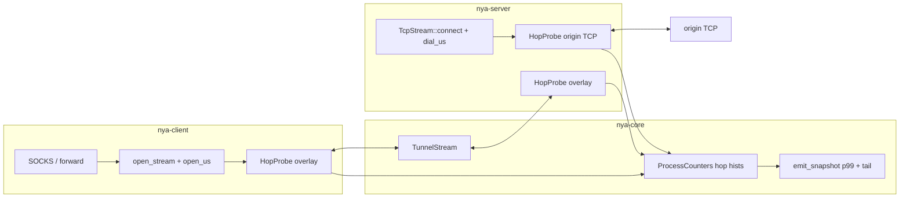

# Overlay algorithm completeness — sixth pass (post-939523a soak)

| Field | Value |
| --- | --- |
| **Author** | nya-link-aggregation maintainers |
| **Date** | 2026-08-29 |
| **Status** | Draft |
| **Audience** | Senior engineers working at the process edge (`nya-client` inbound, `nya-server` outbound) and `nya-core` snapshot / `ProcessCounters`. Algorithm files (`path.rs` `update_class`, `session/steer.rs` recycle) are **out of the change set** except as soak evidence. |
| **Predecessor** | `docs/design-algorithm-completeness.md` (G1–G6, commit `3ecdabd`); `docs/design-algorithm-completeness-2.md` (H1–H3, commit `27587fb`); `docs/design-algorithm-completeness-3.md` (H4–H5, commit `4c59f73`); `docs/design-algorithm-completeness-4.md` (H6, commit `d67ec7d`); `docs/design-algorithm-completeness-5.md` (H7, commit `939523a` “Arm class unwind permit on init freeze so class walks below the drop floor.”). This document does **not** re-litigate G1–G6 or H1–H7 except to record what this soak proved still works. |
| **Lens** | 30-min generate_204 soak GZ–HK, 9 URLs, 2026-08-29T14:32:57Z–15:02:57Z, binary `main` `939523a`, log pack `nya-link-aggregation-logs-20260829T1503Z.tar.gz` (extracted `/home/lyn/workspace/nya-link-aggregation/.local/logs-1503/`; journals `.local/logs-1503/client.journal` PID **3565417** is this soak — PID **3527202** is the previous soak / deploy leftover, ignore except G1; `.local/logs-1503/server.journal` PID **10156**). Results `.local/logs-1503/nya-link-aggregation-logs-20260829T1503Z/results/204-soak/{REPORT.md,summary.json,samples.csv}`. Two named links (`akcdn`, `soy`) × `connections=2`, ping 10–50 ms, `all_down_timeout_ms=8000`, OTEL on. Application **35864 samples, 35863 ok / 1 fail (curl 28), 0.003%**. TTFB ≥500 ms: 3; ≥1 s: 2; ≥3 s: 1. Google p99 78.12 ms. End-of-soak client snapshot 15:06:08.160Z PID 3565417: `closed=35872 down=11 deg=44 miss=612 hedge=217 rtx=229 recycle=1 corr=0 mig=22 hol=2 stream_resets=3 session_all_down_resets=0 failbacks=0 picks_unk=0 stall_p99_ms=300 failover_p99_ms=500 stall_count=834 failover_count=14` paths `akcdn#0=7/6/7ms up; akcdn#1=7/6/6ms up; soy#1=7/7/7ms up; soy#0=7/7/7ms up`. Used as a *lens* on the algorithm and on max-attribution, **not** a target to fit. |
| **Compatibility** | No new TOML keys. `[session]` stays `ping_interval_min_ms` / `ping_interval_max_ms` / `all_down_timeout_ms` / `max_paths` with `#[serde(deny_unknown_fields)]` (`cfg.rs` L130–137). Production algorithm path is one `Tuning::STANDARD` table; tests clone-and-mutate only. `PROTOCOL_VERSION` stays 1 (`nya-proto/src/lib.rs` L17). No wire changes. Do **not** retune `down_min_silence` / `ping_interval_*` / `unknown_degrade_min` / `interactive_max` / `class_drop_*` / `backup_rtt_*` / `failback_*` / `down_timeout_mult` / `stable_raise_*` / `stable_up_hold` / `path_score` weights to the GZ–HK 6–7 ms path. `interactive_max` is **1500 bytes** (`tuning.rs` L64, L112), **not** milliseconds — do not reuse it as a latency log gate. Do not undo G1–G6 or H1–H7. Do not unpark H8. Do not change drop-info log level (1 µs chatter is the parked follow-up from design-5). Ping stays **no** log. Do not put `metrics=` back on info snapshot. `n_counter` stays 50. Log packs `nya-link-aggregation-logs-*.tar.gz` stay gitignored; do not commit them. Land this design as `docs/design-algorithm-completeness-6.md`. |

---

## Overview

Commit `939523a` closed H7 (init freeze arms `class_unwind_permit` so class 7/8-walks through the `class_should_drop` abs floor). A sixth GZ–HK generate_204 soak on that binary confirmed the landing: first snapshot 14:32:48 already `akcdn#0=7/6/7ms; akcdn#1=7/6/7ms; soy#1=7/7/7ms; soy#0=7/7/7ms` — no `7/6/14ms` bench. Hundreds of `kind=drop` infos (553 total, 85 of them 1 µs) are the accepted always-on-permit catch-up trail from design-5, not a hole. H6’s positive path fired for the first time: 14:54:59 `outlier recycle path=soy#0 class_us=203702` after the sibling class became honest 7 ms; AND-every-tick skipped while soy#1 class was 56 ms. H8 (2×2 named-link stall) showed up again (soy dual silent-down 14:35:28, 3× `tls connect timeout` per path until 14:35:32) with **0** application fails and **no** overlay_delta ≥ 200 ms in that window — expected failover, stay parked.

The overlay path/steer/scheduler algorithm looks **complete** on `939523a` for this soak. There is no state-machine bug, no missing migrate/recycle/raise/drop state, and no reason to retune.

What is **not** complete is max-attribution. Constraint 4: every soak max / tail must be attributable as overlay (this project) vs origin / TLS / public Internet. Curl samples have `ts,url,ok,http_code,ttfb_ms,total_ms,tls_ms,curl_exit,wall_ms,err` and **no** `stream_id`. Overlay journals at info are the 10 s `nya_core::obs` snapshot plus path down/degrade, class raise/drop, recycle. STREAM_DATA / ACK / Ping stay silent; `open_stream` pick is debug-only. OTLP spans `nya.inbound.socks5` / `nya.inbound.forward` cover **to `open_stream` return only** then `drop(span)` before `copy_bidirectional`; `nya.outbound.dial` covers **only** `TcpStream::connect` then `drop(span)` before copy. No `traceparent`. Origin TLS is end-to-end inside copy, so client copy duration cannot split overlay vs origin by itself.

This soak’s REPORT names the gap: clients3 max 5042 ms and cloudflare max 1535 ms are **unattributed**. Verification:

| When | What | ttfb | tls | overlay_delta | What current logs can prove |
| --- | --- | --- | --- | --- | --- |
| 14:43:40.570 | clients3 max | 5042.2 | 5034.2 | **8.1** | `tls≈ttfb` ⇒ origin TLS. Last path_down 14:41:01; next 14:44:29. Concurrent clients3 samples immediately after are ~35 ms. **Origin, by tls matching only.** |
| 14:47:26.729 | cloudflare max | 1534.7 | 672.9 | **861.8** | Only overlay_delta ≥ 200 besides the fail. Curl `ts` is **end-of-request**; start ≈ `ts − wall` ≈ 14:47:25.185. Same-second completions: connectivitycheck 144.7 (d=63.8); google.hk / clients3 / play ~35 ms. soy#1 raise 7385→53440 at 14:47:26.131, soy#0 raise 7282→86239 at 14:47:26.319 (**during** this request); akcdn#0 silent-down 14:47:27.090 **after** end. Global overlay not stalled, but **cannot prove** origin HTTP-after-TLS vs this-stream overlay. First-byte clocks will show ServerHello ≈ `tls_ms`; they do **not** clock the 861 ms remainder. Copy-end `olast ≈ copy` is true of almost every successful 204 and is **not** a verdict. Final-origin-read `crx_at_olast` is **not** GET-arrival (trailing close_notify). **`max_gap` / `crx_at_gap` / `origin_at_gap` (origin-read contest) is the join.** |
| 14:38:20.523 | gstatic curl-28 | 0 | 0 | — wall 8012, “Connection timed out after 8002 milliseconds” | Curl `ts` is end. Start ≈ 14:38:12.5 / end 14:38:20.5, overlapping akcdn#0 `path down` 14:38:12.751 (soy#1 path_down 14:38:09 is before start). Other URLs completed around the start (youtube 296.9 at 14:38:09.302; play 119.5; clients3 136.1; google.hk 100.1). `session_all_down_resets=0`. Symptom matches **either** overlay `wait_ready(all_down_timeout=8s)` **or** origin TCP/TLS hang on that one stream. **Unattributable without hop clocks.** |

`tls_ms≈ttfb` is a real matching rule for TLS-dominated max (clients3). It is **not** sufficient for curl-28 (`tls=0`) or HTTP-after-TLS remainder (cloudflare 861). Concurrent-fast-URLs are circumstantial, not a join.

This design closes **H9 — stream hop split** (first-byte **and** last-byte clocks, plus a **max-gap** sample on origin reads and a final `crx_at_olast`) so a later soak can classify those three rows from journals the operator already collects, without fitting thresholds, without a new TOML key, without a Prometheus name, and without treating origin slowness as an overlay bug. Algorithm files stay untouched. First-byte-only would leave cloudflare 861 as the same hole, moved past ServerHello. Copy-end `origin_last ≈ copy` is also not a verdict (true of almost every successful 204). Final-origin-read overlay last_rx is not GET-arrival (trailing TLS close_notify overwrites it). Constraint 4 names that row, so H9 keeps the origin read that **maximizes** `(origin_elapsed − overlay.last_rx)`.

---

## Background & Motivation

### Current architecture (what we are not changing)

From `docs/ARCHITECTURE.md`: one overlay session, many TCP+TLS paths, streams sticky on one path. Scheduler (`scheduler.rs` `fastest_class_set`, `path_score`): drop backups (`class > fastest × 2 + 20 ms`); restrict to fastest class; score `class_rtt × load × 1024 + fast_rtt × load`.

`steer` (5 ms tick): speculative migrate, failback, same-link HOL rebalance, H2 correlated silence, G4b/H6 outlier recycle. Timeouts from `Tuning::STANDARD` via `health.rs`. Operator TOML is only probe clamp, `max_paths`, `all_down_timeout`.

Class: init freeze stores fast at sample 8 and **sets unwind permit** (H7, `path.rs` L338–344). Raise is one 7/8 per `stable_up_hold` with permit true (`path.rs` L365–381). Drop is `class_should_drop || (permit && fast < class)`, G4a pause, clear permit only when `new_us <= fast` (`path.rs` L385–406). Ping while `is_alive()` (H4). Recycle is client-only, H3 age-gated, H6 class **and** fast backup vs sibling class, AND re-evaluated every tick (`steer.rs` L234–278).

Application data path (`ARCHITECTURE.md` L21–39):

```text
SOCKS5 / forward
  → Session::open_stream          (wait_ready + pick + STREAM_OPEN)
  → TunnelStream (duplex)
  → copy_bidirectional(socks_tcp, tun)     // client; SOCKS success already sent
  → server IncomingStream
  → TcpStream::connect(target)             // origin; not started until STREAM_OPEN arrives
  → copy_bidirectional(origin_tcp, overlay)
```

Critical lifecycle (`crates/nya-client/src/inbound.rs` L182–220, `crates/nya-server/src/outbound.rs` L10–47):

1. Client `open_stream` (`session/streams.rs` L22–60) calls `wait_ready(all_down_timeout)` (`session/mod.rs` L191–193, default 8 s) **then** pick **then** `STREAM_OPEN`. SOCKS reply success is sent **after** `open_stream` returns (`inbound.rs` L198–205). Client does **not** wait for server origin connect.
2. Server `handle_incoming` (`outbound.rs` L21–32) `TcpStream::connect`s **then** `copy_bidirectional`. Dial fail already `warn`s with `stream_id` and `IncomingStream::reset(DialFailed)` (`outbound.rs` L34–44, `session/mod.rs` L43–47).
3. Origin TLS is **end-to-end** inside copy. Client copy duration includes origin TLS/HTTP and cannot split overlay vs origin by itself.
4. Split **must** use server-side origin TCP first-byte **and last-byte**, plus overlay `last_rx` **sampled at the max-gap origin read** (not the last origin byte), vs client `open_stream` time, joined by `stream_id` (already on `StreamOpen`, `nya-proto/src/frame.rs` L125–128, and on `IncomingStream` / `TunnelStream.id`). First-byte alone attributes wait_ready / dial / TLS-dominated max. Copy-end `olast ≈ copy` does **not** split origin-slow-HTTP vs overlay-delayed-GET. Final `crx_at_olast` does **not** either (close_notify). HTTP-after-TLS remainder (cloudflare 861) needs `max_gap` / `crx_at_gap` / `origin_at_gap`.

OTLP (`docs/OBSERVABILITY.md` L1164–1177): control-plane only. `nya.inbound.socks5` / `nya.inbound.forward` (`inbound.rs` L80–93, L182–199) drop the span before copy. `nya.outbound.dial` (`outbound.rs` L14–26) drops the span after connect. No `traceparent`. Data path is not spanned (intentional; ~20 streams/s this soak).

Info snapshot (`export.rs` `emit_snapshot` L129–168): packed scorecard + `stall_p99_ms` / `failover_p99_ms` from `catalog.rs` `snapshot_p99` L727–731. **No** hop fields. `n_counter == 50` (`export.rs` L371). Info must not attach `metrics=`.

### Soak as a lens (not a fit target)

Client restarted 14:32:38Z PID **3565417** (`session created path=akcdn#1` at 14:32:38.182). Server PID **10156** (recreate 14:32:22 from previous client). Old client PID 3527202 is the previous soak process — ignore except as G1 deploy. Soak window 2026-08-29T14:32:57Z–15:02:57Z. `REPORT.md` and `summary.json` agree: 35864 samples, 35863 ok / 1 fail, one `curl_exit=28`.

| Observation | What it is *not* | What it actually showed |
| --- | --- | --- |
| 35863 ok / 1 curl-28 (0.003%); TTFB ≥500 ms: 3; ≥1 s: 2; ≥3 s: 1. Google p99 78.12 ms. Previous `d67ec7d`: 36362 / 0 / 4 ≥500 | “H7 regressed the data path” | One curl-28, unattributed. Algorithm residuals are not lost 204s at scale. |
| First snapshot 14:32:48 all four paths `7/6/7` or `7/7/7` ms; end `akcdn#1=7/6/6ms` not `7/6/14ms` | “H7 did not land” | Init permit walked. No benched TCP. **H7 closed.** |
| 553 `kind=drop` infos, 85 with `old_us - new_us == 1`; 5 raises | “reopen drop-info level” | Always-on init permit catch-up (design-5 KD2). Parked 1 ms grain. Do not demote in this pass. |
| `recycle=1`; one `outlier recycle` at 14:54:59 soy#0 `class_us=203702` | “H6 is a no-op / G4b over-tears” | **H6 positive path**, first time. See smoking gun below. |
| soy dual silent-down 14:35:28 both `ago≈330 down=330` (known-RTT), 10 ms apart, then 3× `tls connect timeout` per path until 14:35:32 | “unpark H8” | Application in that window: 0 fails; max overlay_delta **53.4 ms** (cloudflare HTTP remainder, typical). akcdn held. Design-5: only unpark if timeouts / **overlay-attributed** tails. |
| failbacks=0, `fb_slink=0`, `corr=0`, `picks_unk=0` | “failback / H2 / G3 broken” | Both links ~6–7 ms, same class. Soy stall is 2 of 4, not N−1 of N≥3. Closed 204s drop sticky. Correct. |
| `probe_miss` 612 | “H4 ping-while-alive regressed” | H4 expected. Idle snapshots stay `up`. |
| `hedge=217` / `rtx=229` (jump 0→130 on the 14:38:18 snapshot after soy#1 + akcdn#0 downs) | “redesign hedge” | Unacked STREAM_DATA retry after real flaps. Do not redesign hedge. |
| clients3 5042 / cloudflare 1535 / gstatic curl-28 | “overlay max; retune” | Unattributed. **H9.** Forbidden to fit. |
| play.googleapis 817.3 (`tls=778.9`, delta 38.4) at 14:40:17 | “fourth overlay tail” | TLS-dominated remainder < 200. Not a third overlay_delta≥200. |

Known 7 ms `down_for` is `down_min_silence + probe` ≈ 320+10 = **330 ms**. Unknown-RTT `down_for` is **550 ms** (`assumed_rtt=100`, `probe=50`, `5×100+50=550`). `is_backup` is `rtt > min × 2 + 20 ms`. None of H9 is a reason to touch those.

### What G1–G6 / H1–H8 look like in this soak

| Gap | Status on `939523a` | Residual |
| --- | --- | --- |
| **H7** init freeze arms unwind permit | First snapshot already 7 ms class on all four; no 14 ms bench. 553 drops are the permit trail (including 1 µs catch-up). End `akcdn#1=7/6/6ms`. | Chatter. Parked 1 ms grain. **H7 itself landed.** |
| **H6** recycle iff class AND fast backup vs sibling class | Positive path 14:54:59. AND-every-tick skipped while sibling class was 56 ms; recycled once sibling was 7 ms. `recycle=1`. | None. Do not undo. |
| **H5** raise then 7/8 walk | 5 raises, each followed by drop infos. soy#0 7335→26506 at 14:54:41 then 26506→24124→…→14989 before the silent-down. | Permit walk works. |
| **H4** DEGRADED still probes | `probe_miss` 612. Idle snapshots stay `up`. deg=44. | None. |
| **H1** one 7/8 per hold | Raises 1 s apart at 14:47:26.13 / 14:47:27.18 (soy#1 7385→53440→72198). Not a 0.2 ms cascade. | None. |
| **H2** correlate N−1 of N≥3 | `corr=0`. Soy dual-silence is 2 of 4. Correct (`steer.rs` L79–82). | Topology gap is **H8**, parked. |
| **H3** young-class age-gate | Recycle at 14:54:59 was of `path_id=12` added 14:54:49.910 (~9 s old, aged). | None. |
| **H8** per-link correlate for 2×2 named-link stall | Soy stall 14:35:28–14:35:32 recovered in ~4 s; 0 curl-28; no overlay_delta≥200. | **Stay parked.** Not a completeness hole this soak. |
| **G4a** drop pause | Drops one per hold. | None. |
| **G4b** honest backup recycle | The 14:54:59 event **is** G4b/H6: snapshot 14:54:58 `soy#0=42/28/203ms up bak` vs `soy#1=7/7/7ms`; both clocks backup vs 7. Replacement 14:55:08 `soy#0=7/7/7ms`. | Working. |
| **G3** zero-load spread | `picks_unk=0`. | Do not reopen. |
| **G1** recreate | Deploy 14:32:22 server `path read failed` EOF then new client PID `session created`. | Deploy, not a hole. |
| **G2** Create `path_name` | Names `akcdn#0/#1 soy#0/#1`. No `init=`. | None. |
| **G6** info scorecard | All eight packed keys present. | Keep it. Do not put `metrics=` back. **Add hop p99 + interval-max (H9), not new packed counter keys.** |

### H6 positive path (first observation; not a bug)

```
14:54:41.046Z  class soy#0 7335→26506 kind=raise
14:54:42–48    drops 26506→24124→22067→20248→18636→17259→16041→14989
14:54:48.160Z  snapshot soy#0=7/7/16ms up     (walk in progress; fast already 7)
14:54:49.676Z  path silent, marking down soy#0 ago=532.728ms down=528.43ms
               (unknown-RTT clock, not 330 ms known)
14:54:49.910Z  path up soy#0 path_id=12
14:54:50.229Z  class soy#1 7377→55851 kind=raise   (sibling class now 56 ms)
14:54:51.643Z  class soy#0 249688→226693 kind=drop
               implied fast: (249688×7+F)/8=226693 ⇒ F=65728 µs ≈ 66 ms
14:54:52.846Z  226693→203702
               66 ms is backup vs soy#1 class 7 (cliff 34) but NOT vs soy#1 class 56
               (is_backup(66, 56) = 66 > 56×2+20=132? no) — H6 AND false, no recycle
14:54:57.127Z  path down soy#1 path_id=9 (peer close, no silent-down warn)
14:54:57.351Z  soy#1 path_id=13 added; 14:54:57.751 down; 14:54:57.977 path_id=14
14:54:58.160Z  snapshot soy#0=42/28/203ms up bak; soy#1=7/7/7ms up
               now is_backup(class 203, sib 7) AND is_backup(fast 42, sib 7)
14:54:59.156Z  outlier recycle path=soy#0 class_us=203702
14:55:08.161Z  snapshot soy#0=7/7/7ms up      (replacement 5-tuple)
```

That is H6 AND-every-tick working, not a bug. Do not reopen recycle. Do not treat the 249688 µs init freeze as H7-still-open: permit walked 249688→203702 in two holds; recycle then tore an honest backup, which is G4b’s job.

### Tails that are NOT algorithm holes, and are NOT attributable

**clients3 5042.2 ms** at 14:43:40.570Z: `tls_ms=5034.2`, delta 8.1 ms. Next clients3 at 14:43:41.006 is 35.7 ms. Overlay journals: quiet (last path_down 14:41:01 soy#1 silent-down; next 14:44:29 akcdn#0 peer close). Origin TLS by `tls≈ttfb`. H9 still records it so the next soak does not re-ask “is 5 s overlay?”.

**cloudflare 1534.7 ms** at 14:47:26.729Z: `tls_ms=672.9`, delta **861.8 ms**. Curl `ts` is end-of-request; start ≈ 14:47:25.185 (`ts − wall_ms`). Completions in that window: connectivitycheck 144.7 (d=63.8), google.hk 35.8, clients3 33.7; youtube 140.2 at 14:47:25.184 is another URL finishing at this request’s **start**, not a same-second overlay stall. soy pair raised at 14:47:26.13 / .32 **while this request was in flight**; akcdn#0 silent-down 14:47:27.090 **after** end. Global overlay had fast siblings. First-byte H9 would show `first_rx≈ofirst≈673` and `copy≈1534` — ServerHello on time, remainder unattributed. Copy-end `olast≈copy` is the expected outcome for this **successful** 204 and does **not** decide origin vs overlay. Final-origin-read `crx_at_olast` is **not** GET-arrival: origin TLS close_notify is a later non-empty read, after curl has TTFB’d and sent close_notify, so overlay last_rx ≈ copy and origin-think would look like overlay-delayed-GET. **`max_gap` is the join:** on each origin read, `gap = origin_elapsed − overlay.last_rx` (missing overlay last_rx as 0); keep the max. Trailing close_notify has a small gap and loses. Origin-think 861 ms wins with overlay last_rx still at GET (`crx_at_gap` near tls ~673, `origin_at_gap` ~1534, `max_gap` ~861). Handshake-scale max-gap plus `first_rx≈tls ≪ copy` and final `crx≈copy` → overlay delayed GET. `olast ≪ copy` → overlay holding a 204 already in the copy buffer.

**gstatic curl-28** at 14:38:20.523Z: wall 8012 ms, tls=0, ttfb=0. Curl `ts` is **end**; start ≈ **14:38:12.5**, end 14:38:20.5. That window overlaps akcdn#0 `path down` 14:38:12.751 (peer close, no silent-down warn). soy#1 path_down 14:38:09 is **before** start. `open_stream` waits `wait_ready(8s)` then returns **before** server `TcpStream::connect`. Curl’s 8 s timer therefore covers: (a) SOCKS CONNECT blocked in `wait_ready` / `NoPath`; (b) SOCKS success then TLS hang waiting for origin ServerHello, which hangs equally if server connect hangs or if origin TLS hangs. Other URLs completed around the start (youtube 296.9 at 14:38:09.302; play 119.5; clients3 136.1; google.hk 100.1). `session_all_down_resets=0`. Paths_alive never 0. That **weakly** argues against all-path `wait_ready`, but does not prove origin — the slow stream could still have been the one `open_stream` that raced the 14:38:12.751 flap. Unattributable without hop clocks. **H9.**

**play 817.3** at 14:40:17.801: tls 778.9, delta 38.4. TLS-dominated. Not overlay_delta≥200.

**H8 soy stall 14:35:28–32:** 101 samples in 14:35:28–32 (inclusive); max overlay_delta 53.4 ms; 0 fails. Do not unpark.

### Pain points in code (cited)

#### H9 — no hop split; max cannot be attributed

```182:205:crates/nya-client/src/inbound.rs
    let span = tracing::info_span!(
        target: "nya_otel",
        "nya.inbound.socks5",
        ...
    );
    let opened = session
        .open_stream(Target { host: host.clone(), port })
        .instrument(span.clone())
        .await;
    match opened {
        Ok(mut tun) => {
            drop(span);
            ...
            reply(&mut tcp, 0x00).await?;
            let _ = tokio::io::copy_bidirectional(&mut tcp, &mut tun).await;
```

```14:32:crates/nya-server/src/outbound.rs
            let span = tracing::info_span!(
                target: "nya_otel",
                "nya.outbound.dial",
                ...
            );
            let connected = TcpStream::connect((inc.target.host.as_str(), inc.target.port))
                .instrument(span.clone())
                .await;
            match connected {
                Ok(mut tcp) => {
                    drop(span);
                    ...
                    debug!(stream_id = inc.stream_id, %target, "outbound connected");
                    let _ = tokio::io::copy_bidirectional(&mut tcp, &mut inc.io).await;
```

`TunnelStream` (`stream.rs` L133–170) is a pure duplex forwarder — no first-byte or last-byte clock. `ProcessCounters` (`metrics.rs` L537–555) has accept/dial counters and **no** hop histograms. `emit_snapshot` (`export.rs` L129–168) has `stall_p99_ms` / `failover_p99_ms` but nothing for open/dial/first-byte/last-byte. OBSERVABILITY inbound table L417–418: “成功 `open_stream` 即将 copy — **不要** info”; “copy 结束 — **no**”. That quiet default is load-bearing at 20 streams/s; H9 must not info-log every stream. First-byte CAS-once cannot clock HTTP-after-TLS remainder (cloudflare 861); copy-end `last_rx ≈ copy` cannot either; overwriting `crx_at_olast` on every origin read cannot either (close_notify). A max-gap contest on origin reads can, without parsing TLS.

---

## Goals & Non-Goals

### Goals

- Close **H9** so a soak max is attributable as overlay vs origin / TLS / public net from default-info journals plus debug hop lines, joined by `stream_id` across client/server, approximately joined to curl by `(dest host, hop copy-end near csv ts, copy_us ≈ wall_ms)` — csv `ts` is **end-of-request**. All three named rows (clients3 5042, cloudflare 861 remainder, gstatic curl-28) are in scope; first-byte-only is not sufficient; copy-end `olast ≈ copy` is not sufficient; final-origin-read `crx_at_olast` is not GET-arrival.
- Keep a single production `Tuning::STANDARD`. No new TOML or Tuning fields. `PROTOCOL_VERSION` stays 1. No wire fields.
- Data-path tax negligible: one CAS per direction on first non-empty poll; Relaxed store of elapsed on every subsequent non-empty **read** for `last_rx`; origin read additionally Relaxed-loads overlay `last_rx`, overwrites final `crx_at_olast`, and maybe-replaces the max-gap trio (not a Tuning threshold, not a log-in-poll). No per-STREAM_DATA log. No always-on OTLP copy span. Do not parse TLS.
- Default journals stay info: hop completion is `debug!(target: "nya_core::hop")`; snapshot grows by hop p99 fields (like `stall_p99_ms`) — client `open`/`first_rx`/`last_rx`, server `dial`/`origin_first`/`origin_last` — plus one compact interval-max `tail=` field (includes `max_gap=` / `crx_at_gap=` / `origin_at_gap=` / `crx_at_olast=`). No new Prometheus catalog names (`n_counter` stays 50).
- Classification rule is **docs + canary**, not a scheduler input. Do not retune overlay because origin TLS was 5 s. Do not invent a millisecond gate. Do **not** treat copy-end `olast ≈ copy` as origin. Do **not** use final `crx_at_olast` as GET-arrival.
- Tests: HopProbe first-byte **and** last_rx (second read advances last, not first); origin max-gap **keeps** an earlier large-gap GET sample when a later origin read has overlay last_rx near now; EOF with no new bytes does not update; no info on a 40 ms copy; snapshot tail/p99 fields; emit-path-only tail take (shared `/metrics` snap does not steal); existing e2e unscrape-logs (harness `snapshot_interval_ms=0`); dial-fail still resets. Do not add e2e SLA on `origin_first`.
- Docs: `OBSERVABILITY.md` span table + snapshot grammar. `ARCHITECTURE.md` only a one-sentence process-edge pointer if needed. This design lands as `docs/design-algorithm-completeness-6.md`.

### Non-Goals

- Any algorithm change in `path.rs` / `steer.rs` / `scheduler.rs` / `health.rs` / `tuning.rs`.
- New operator TOML knobs. Unknown `[session]` keys still deny. `SessionOpts` stays four keys.
- Retuning any `Tuning::STANDARD` constant, `path_score` weights, `class_drop_*`, `is_backup`, hold durations, ping clamp, `interactive_max` (1500 **bytes**).
- Unparking H8. Unparking 1 ms drop-info grain. Timeout-stable raise. Ping `send_frame` `.await` try-send.
- Bumping `PROTOCOL_VERSION`. Adding `traceparent` on the overlay wire. Changing the soak harness in this repo to emit `stream_id` (optional docs note only).
- Info-logging every stream (~35k / 30 min). Putting `metrics=` back. New `nya_*_total` / `nya_*_ms` Prometheus names.
- Wrapping `copy_bidirectional` in an always-on OTLP span.
- Treating origin slowness as an overlay bug. Fitting GZ–HK 6–7 ms.
- Changing drop-info level. Logging STREAM_DATA / ACK / Ping.

---

## Key Decisions

1. **H9 is the only spend. Algorithm is complete on `939523a` for this soak.** H7 landed (no 14 ms bench). H6 positive path worked. H8 is expected failover (0 fails, no overlay-attributed tail). 1 µs drop-info chatter stays parked. Do not retune. Do not invent a path/steer bug.

2. **Matching mechanism is missing; constraint 4 requires closing it — including cloudflare 861.** `tls≈ttfb` attributes TLS-dominated max (clients3). It does not attribute curl-28 or HTTP-after-TLS remainder (cloudflare 861). Concurrent-fast-URLs are not a join. First-byte probes alone leave the 861 ms remainder as the same hole (ServerHello on time, copy still 1534). Copy-end `origin_last ≈ copy` is also not a verdict: copy ends on EOF shortly after the last origin byte, so `olast ≈ copy` on almost every **successful** generate_204 (origin-slow-HTTP, overlay-delayed-GET, and a healthy 35 ms 204). Architect decides the mechanism: **dual-end first-byte + last-byte probes + max-gap sample on origin reads (`max_gap` / `crx_at_gap` / `origin_at_gap`) + final `crx_at_olast` + `stream_id` join + snapshot p99/interval-max.** Not a scheduler input. Do not narrow H9. Do not treat copy-end `olast ≈ copy` as origin. Do **not** use final-origin-read `crx_at_olast` as GET-arrival (trailing TLS close_notify overwrites it).

3. **`HopClock` behind `Arc` + `HopProbe<T: AsyncRead + AsyncWrite + Unpin>` in `nya-core` (new `hop.rs`, next to `stream.rs`).** First-byte: one CAS per direction on first non-empty poll. Last-byte: Relaxed store of `start.elapsed()` on **every** non-empty read (`last_rx_us`). Two probes on one `copy_bidirectional` share clocks. Origin `poll_read` on non-empty (not EOF) keeps **two** samples (Relaxed, no threshold): (1) **max-gap** — `gap = origin_elapsed − overlay.last_rx` (missing overlay last_rx as 0); if `gap` greater than stored `max_gap`, replace `max_gap`, `crx_at_gap`, `origin_at_gap`; (2) **final** `crx_at_olast` always overwritten (last origin byte, including close_notify). Trailing close_notify has a small gap and loses the max-gap contest; origin-think 861 ms wins with overlay last_rx still at GET. Client wraps overlay only (no peer sample). No log inside `poll_read` / `poll_write`. No millisecond gate. Do not parse TLS.

4. **Join key is existing `stream_id`.** Already on `StreamOpen`, `IncomingStream.stream_id`, `TunnelStream.id`. No wire change. Approximate join to curl: `(dest host, hop copy-end near csv ts, copy_us ≈ wall_ms)`. **csv `ts` is end-of-request**; start ≈ `ts − wall_ms`; close ≈ `ts`. Do not change the soak harness in this repo. Do not add curl `stream_id`.

5. **Emission is quiet-default. Explicit hist map.** Always `debug!(target: "nya_core::hop", event = "hop", …)` (default journals stay info). Never info-log every stream, and **never promote to info based on duration** (`interactive_max` is 1500 bytes, not a latency gate; do not invent a 200 ms overlay_delta log threshold). Snapshot p99: **client** `open_p99_ms` / `first_rx_p99_ms` / `last_rx_p99_ms` from client `open` / `first_rx` / `last_rx` only; **server** `dial_p99_ms` / `origin_first_p99_ms` / `origin_last_p99_ms` from server `dial` / `origin_first` / `origin_last` only. Server snapshot **omits** client p99 keys; client **omits** dial/origin_*. `copy`, `first_tx`, `cfirst`, `clast`, `crx_at_olast`, `max_gap`, `crx_at_gap`, `origin_at_gap` are **debug + `tail=` only — never `observe`** (not a 7th hist). Reuse `Histogram` + `percentile` + `STALL_MS_BOUNDS`. **Do not** add Prometheus names. Snapshot-only hists live on `ProcessCounters`, not `Counters` / `visit_metrics`. `n_counter` stays 50.

6. **Interval-max ranking is `max` of present hop times, take-on-emit, and the take is not inside `snap()`.** Cumulative p99 (like `stall_p99_ms`) hides a single 5042 in 35k samples. Interval-max surfaces it. Rank = max of present hop times (missing = `None`, not 0). Compare-and-replace runs **under the `hop_tail` mutex** (Issue 6). `ProcessCounters::snap()` copies hop histograms (cumulative) and does **not** consume tail. `emit_snapshot` today only sees `&ProcessSnapshot` (`export.rs` L129); `spawn_obs_session` / `spawn_obs_table` share one `snap` closure with `/metrics` (`export.rs` L30–77, L91–94, L118). **Split the closures:** `/metrics` and OTLP keep hist-copy-only `snap()`. The 10 s tick (1) `snap()`s, (2) `take_interval_tail()` on the **live** `ProcessCounters` (`session.process()` on client; `SessionTable::process()` on server — hops already share that Arc via `create_with_incoming`), (3) passes `(ProcessSnapshot, Option<HopTail>)` into `emit_snapshot`. Always emit `tail=` when any hop was recorded in the interval, including a 40 ms copy — no fitted millisecond threshold.

7. **Classification is docs + canary, not scheduler. Operators compare numbers; no millisecond gate; no “large” constant.**
   - `dial_us` large or `origin_first` never after a long wait → origin connect / origin silent after connect.
   - `open_us` large → overlay `wait_ready`.
   - `origin_first` / client `first_rx` dominate copy (TLS-dominated, clients3) → origin TLS. Do not retune overlay.
   - Client `first_rx` ≫ server `origin_first + dial` + path RTT → overlay delay **before** first origin byte.
   - **Do not treat copy-end `olast ≈ copy` as origin.** That is true of almost every successful generate_204 (copy ends on EOF shortly after the last origin byte), including origin-slow-HTTP, overlay-delayed-GET, and a healthy 35 ms 204. Copy-end `clast ≈ copy` is also not a split (curl `close_notify` is a non-empty overlay read at teardown).
   - **Do not use final-origin-read `crx_at_olast` as GET-arrival.** Origin TLS `close_notify` is a later non-empty origin read; by then curl has TTFB’d and sent close_notify, so overlay `last_rx` ≈ copy and origin-think looks like overlay-delayed-GET.
   - **HTTP-after-TLS remainder (cloudflare 861).** Compare qualitatively to path RTT / handshake (`ofirst`) / remainder (`copy − ofirst`) on the same snapshot; no millisecond constant:
     - `olast ≪ copy` → overlay holding 204 already in tokio’s copy buffer (overlay write blocked). Uses **final** `olast` / `copy`.
     - max-gap ≈ remainder **and** `origin_at_gap ≈ olast ≈ copy`, `crx_at_gap ≪ olast` → origin think after GET (cloudflare 861: `crx_at_gap` near tls ~673, `origin_at_gap` ~1534, `max_gap` ~861). Trailing close_notify has a small gap and loses.
     - max-gap is handshake-scale (not the remainder), `first_rx≈tls ≪ copy`, final `crx_at_olast≈copy` → overlay delayed GET after handshake.
   - curl-28: server `dial_us≈8000` → origin connect; client `open_us≈8000` → overlay `wait_ready`; dial small and `origin_first` never → origin/TLS after connect.

8. **OTLP stays control-plane.** Record `nya.open_us` on the existing inbound span (already covers `open_stream`) and `nya.dial_us` on the existing outbound span (already covers connect). Do **not** wrap `copy_bidirectional` in a new span. Do **not** extend the dial span through copy. Optional first-origin-byte marker span is rejected (20/s, and the debug log + snapshot already hold the number).

9. **Do not unpark H8, drop-info grain, timeout-stable raise, or Ping try-send.** This soak does not show overlay-attributed tails from 2×2 named-link stall. 1 µs drop infos are accepted H7 chatter.

10. **One production `Tuning::STANDARD`. No new TOML. `PROTOCOL_VERSION` stays 1.** H9 is process-edge clocks + snapshot fields.

11. **Prefer one combined change set** (like `3ecdabd` / `27587fb` / `4c59f73` / `d67ec7d` / `939523a`). This PR is **H9 only**. Follow-ups stay out of the default diff.

12. **Ship both binaries.** Client hop (open / first_rx / last_rx) and server hop (dial / origin_first / origin_last / max-gap trio / final `crx_at_olast`) are the join. A client-only canary cannot attribute curl-28 vs origin connect, nor origin think-time vs overlay-delayed-GET for cloudflare 861 (`max_gap` / `crx_at_gap` are server-side).

---

## Proposed Design

### Architecture (unchanged data path; hop clocks at the process edge)



```mermaid
sequenceDiagram
  participant Curl
  participant Inbound as inbound.rs
  participant Sess as open_stream
  participant Out as outbound.rs
  participant Origin
  Curl->>Inbound: SOCKS CONNECT
  Note over Inbound: t0
  Inbound->>Sess: open_stream (wait_ready ≤ 8s)
  Sess-->>Inbound: TunnelStream id=S
  Note over Inbound: open_us = t0 elapsed; SOCKS success
  Inbound->>Inbound: HopProbe wrap tun; copy
  Sess->>Out: STREAM_OPEN id=S
  Note over Out: t1
  Out->>Origin: TcpStream::connect
  Origin-->>Out: connected
  Note over Out: dial_us; HopProbe origin + overlay
  Curl->>Inbound: ClientHello
  Inbound->>Out: overlay first byte
  Out->>Origin: ClientHello
  Origin-->>Out: ServerHello
  Note over Out: origin_first_rx_us
  Out->>Inbound: ServerHello
  Note over Inbound: first_rx_us
  Curl->>Curl: tls_ms
  Curl->>Inbound: GET (TLS appdata)
  Inbound->>Out: overlay last_rx advances (GET)
  Out->>Origin: GET
  Origin-->>Out: HTTP 204 / more TLS
  Note over Out: origin last_rx; max_gap contest (GET wins vs close_notify)
  Out->>Inbound: remainder
  Note over Inbound: last_rx_us
  Curl->>Curl: ttfb
  Note over Inbound,Out: copy ends → debug hop + observe + interval-max
```

### H9 — `HopProbe` + dual-end record + snapshot

#### `HopClock` + `HopProbe` (`crates/nya-core/src/hop.rs`, new)

Two wrappers on one `copy_bidirectional` must see each other’s `last_rx`. Put the atomics on a shared `HopClock` behind `Arc`. The origin probe keeps **two** samples on each non-empty origin read (not EOF): a **max-gap** contest (GET-arrival) and a **final** overlay last_rx (teardown). Do not parse TLS. Do not use final `crx_at_olast` as GET-arrival.

```rust
pub struct HopClock {
    start: Instant,
    first_rx_us: AtomicU64, // 0 = never; CAS elapsed.max(1) on first non-empty read
    first_tx_us: AtomicU64, // 0 = never; optional, debug only
    last_rx_us: AtomicU64,  // 0 = never; Relaxed store elapsed.max(1) on EVERY non-empty read
}

impl HopClock {
    pub fn new() -> Arc<Self> { /* start = Instant::now(); atomics 0 */ }
    pub fn first_rx_us(&self) -> Option<u64> { nz(self.first_rx_us.load(Relaxed)) }
    pub fn first_tx_us(&self) -> Option<u64> { nz(self.first_tx_us.load(Relaxed)) }
    pub fn last_rx_us(&self) -> Option<u64> { nz(self.last_rx_us.load(Relaxed)) }
}

/// Origin-probe peer samples. All 0 = never. Debug + tail only; never observe.
pub struct OriginPeerSlots {
    /// Overlay last_rx at the *last* origin byte (close_notify can overwrite GET).
    pub crx_at_olast: AtomicU64,
    /// Winning `origin_elapsed − overlay.last_rx` (missing overlay last_rx as 0).
    pub max_gap_us: AtomicU64,
    /// Overlay last_rx when max_gap won (GET-arrival for origin-think).
    pub crx_at_gap: AtomicU64,
    /// Origin elapsed when max_gap won.
    pub origin_at_gap: AtomicU64,
}

pub struct HopProbe<T> {
    inner: T,
    clock: Arc<HopClock>,
    /// Origin probe only: overlay clock whose last_rx is sampled on origin reads.
    peer: Option<Arc<HopClock>>,
    /// Origin probe only.
    slots: Option<Arc<OriginPeerSlots>>,
}

impl<T> HopProbe<T> {
    pub fn wrap(inner: T, clock: Arc<HopClock>) -> Self { /* peer/slots None */ }
    /// Origin side. `slots` start at 0 (`None`).
    pub fn sample_peer_last_on_read(self, peer: Arc<HopClock>, slots: Arc<OriginPeerSlots>) -> Self { ... }
    pub fn clock(&self) -> &Arc<HopClock> { &self.clock }
    pub fn into_inner(self) -> T { self.inner }
}

impl<T: AsyncRead + Unpin> AsyncRead for HopProbe<T> {
    fn poll_read(mut self: Pin<&mut Self>, cx: &mut Context<'_>, buf: &mut ReadBuf<'_>) -> Poll<io::Result<()>> {
        let before = buf.filled().len();
        let polled = Pin::new(&mut self.inner).poll_read(cx, buf);
        if let Poll::Ready(Ok(())) = &polled {
            if buf.filled().len() > before {
                let us = self.clock.start.elapsed().as_micros() as u64;
                let us = us.max(1);
                let _ = self.clock.first_rx_us.compare_exchange(0, us, Relaxed, Relaxed);
                self.clock.last_rx_us.store(us, Relaxed); // not CAS-once; not a log
                if let (Some(peer), Some(slots)) = (self.peer.as_ref(), self.slots.as_ref()) {
                    let crx = peer.last_rx_us.load(Relaxed); // 0 = overlay never read
                    let gap = us.saturating_sub(crx);
                    slots.crx_at_olast.store(crx, Relaxed); // final; close_notify may overwrite
                    if gap > slots.max_gap_us.load(Relaxed) {
                        slots.max_gap_us.store(gap, Relaxed);
                        slots.crx_at_gap.store(crx, Relaxed);
                        slots.origin_at_gap.store(us, Relaxed);
                    }
                }
            }
        }
        polled
    }
}
```

Same for `poll_write` → `first_tx_us` on `Ok(n) if n > 0` (CAS-once on **this** clock; last-write is **not** required). `poll_flush` / `poll_shutdown` forward. No tracing in poll. No STREAM_DATA awareness. No millisecond gate, no Tuning threshold. EOF (`Ok` with no new bytes) still does **not** update first/last/gap (TCP FIN is safe; TLS close_notify is a non-empty read and **does** update — that is why max-gap, not final `crx_at_olast`, is GET-arrival). Origin `poll_read` is single-threaded per stream; Relaxed load/compare/store of the gap trio is enough. Trailing close_notify: overlay last_rx already ≈ copy, `gap` is small, **loses** the max-gap contest. Origin-think 861 ms: overlay last_rx still at GET, `gap` ≈ remainder, **wins**.

`nya-core/src/lib.rs`: `mod hop; pub use hop::{HopClock, HopProbe, OriginPeerSlots};`.

#### Server (`outbound.rs`)

Time `TcpStream::connect` → `dial_us`. On Ok: two `HopClock`s + origin probe samples overlay last_rx (max-gap **and** final):

```rust
let origin_clock = HopClock::new();
let overlay_clock = HopClock::new();
let slots = Arc::new(OriginPeerSlots { /* atomics 0 */ });
let mut origin = HopProbe::wrap(tcp, origin_clock.clone())
    .sample_peer_last_on_read(overlay_clock.clone(), slots.clone());
let mut overlay = HopProbe::wrap(inc.io, overlay_clock.clone());
let copy = tokio::io::copy_bidirectional(&mut origin, &mut overlay).await;
fn nz(v: u64) -> Option<u64> { (v != 0).then_some(v) }
let crx_at_olast = nz(slots.crx_at_olast.load(Relaxed));
let max_gap = nz(slots.max_gap_us.load(Relaxed));
let crx_at_gap = nz(slots.crx_at_gap.load(Relaxed));
let origin_at_gap = nz(slots.origin_at_gap.load(Relaxed));
```

After `copy_bidirectional` (Ok **or** Err):

- `dial_us`
- `origin_first_rx_us` = `origin_clock.first_rx_us()` (first byte **from origin** after connect)
- `origin_last_rx_us` = `origin_clock.last_rx_us()` (last non-empty read **from origin**)
- `client_first_rx_us` = `overlay_clock.first_rx_us()` (first byte **from overlay** = client) — **debug + tail only**
- `client_last_rx_us` = `overlay_clock.last_rx_us()` — **debug + tail only** (copy-end value includes close_notify; **not** a GET-arrival clock)
- `crx_at_olast` = overlay `last_rx` **as of the last origin byte** — **debug + tail only**; may be teardown (close_notify). Used with `olast`/`copy` for `olast ≪ copy` and “final crx ≈ copy”. **Not** GET-arrival.
- `max_gap` / `crx_at_gap` / `origin_at_gap` — **debug + tail only**; GET-arrival contest. Trailing close_notify loses.
- `copy_us` = connect-return → copy-end (`Some` only if copy started; **never 0-as-missing**) — **debug + tail only**
- `stream_id = inc.stream_id`, `host = inc.target.host` (no port, for curl join)

On dial fail: `debug!` with `dial_us` only (`copy` / `ofirst` / `olast` / `cfirst` / `clast` / `crx_at_olast` / `max_gap` / `crx_at_gap` / `origin_at_gap` omitted as `None`); then existing `warn!` + `inc.reset(ResetReason::DialFailed)`. Do not skip reset. Record `nya.dial_us` on the existing span before drop (`outbound.rs` L14–26); add `nya.dial_us = tracing::field::Empty` at span creation. Do **not** wrap copy in an OTLP span.

`debug!(stream_id, %target, "outbound connected")` (`outbound.rs` L31) stays; hop debug is a **different** event at copy-end / dial-fail (`target: "nya_core::hop"`, `event = "hop"`), not a second “connected”.

#### Client (`inbound.rs` socks **and** forward)

Time `open_stream` → `open_us` (includes `wait_ready`). On Ok: wrap **overlay** `tun` only (not SOCKS tcp — first SOCKS byte is curl ClientHello, not the split):

```rust
let clock = HopClock::new();
let mut overlay = HopProbe::wrap(tun, clock.clone());
```

Client does **not** need `sample_peer_last_on_read` (`OriginPeerSlots` is server-side). After copy (Ok **or** Err):

- `open_us`
- `first_rx_us` = overlay first byte (HTTPS ServerHello arrival)
- `last_rx_us` = overlay last non-empty read (last origin data through overlay)
- `first_tx_us` optional debug (ClientHello leaving into overlay)
- `copy_us` = open-return → copy-end (`Some` only if copy started)
- `stream_id = tun.id`, `host`

On open fail: `debug!` hop with `open_us` only (`copy` / `first_rx` / `last_rx` omitted as `None`); then existing `warn!` + SOCKS 0x04. Record `nya.open_us` on the existing inbound span before drop.

SOCKS success reply stays **after** `open_stream` returns, **before** copy (`inbound.rs` L204–205). Do not wait for origin connect.

#### `ProcessCounters::record_hop` (single debug site)

Add to `metrics.rs` (process edge, not session `Counters`):

- `hop_open_ms: Histogram` (STALL_MS_BOUNDS)
- `hop_first_rx_ms: Histogram`
- `hop_last_rx_ms: Histogram`
- `hop_dial_ms: Histogram`
- `hop_origin_first_ms: Histogram`
- `hop_origin_last_ms: Histogram`
- `hop_tail: Mutex<Option<HopTail>>`

`ProcessCounters` today is `#[derive(Default)]` (`metrics.rs` L536–537) of atomics only. Switch to a manual `Default` like `Counters` (`metrics.rs` L195–238). `ProcessCountersSnap` gains the six `HistSnap`s (not the live mutex).

**Hist map (Issue 2 — explicit, not “matching hist”):**

| Field | End | Histogram | Snapshot p99 |
| --- | --- | --- | --- |
| client `open_us` | client | `hop_open_ms` | `open_p99_ms` (client only) |
| client `first_rx_us` | client | `hop_first_rx_ms` | `first_rx_p99_ms` (client only) |
| client `last_rx_us` | client | `hop_last_rx_ms` | `last_rx_p99_ms` (client only) |
| server `dial_us` | server | `hop_dial_ms` | `dial_p99_ms` (server only) |
| server `origin_first_rx_us` | server | `hop_origin_first_ms` | `origin_first_p99_ms` (server only) |
| server `origin_last_rx_us` | server | `hop_origin_last_ms` | `origin_last_p99_ms` (server only) |
| `copy_us`, `first_tx_us`, `cfirst`, `clast`, `crx_at_olast`, `max_gap`, `crx_at_gap`, `origin_at_gap` | either | **never `observe`** | debug + `tail=` only |

Server snapshot **omits** `open_p99_ms` / `first_rx_p99_ms` / `last_rx_p99_ms` (those hists stay at count 0 on the server; Option fields omit). Client **omits** `dial_p99_ms` / `origin_first_p99_ms` / `origin_last_p99_ms`. Do **not** observe server `client_last_rx_us` into `hop_last_rx_ms` (that would make server `last_rx_p99_ms` mean “last byte from curl”). `n_counter` stays 50; `visit_metrics` stays off this list.

`record_hop(sample)`:

1. `debug!(target: "nya_core::hop", event = "hop", stream_id, host, copy_us, open_us, first_rx_us, last_rx_us, first_tx_us, dial_us, origin_first_rx_us, origin_last_rx_us, client_first_rx_us, client_last_rx_us, crx_at_olast, max_gap, crx_at_gap, origin_at_gap, outcome)` — omit `None` fields. `outcome = ok | open_fail | dial_fail | copy_err`.
2. Observe **only** the six mapped fields above when `Some`. Missing hops are `None` / omitted / formatted `-`. **Never observe 0** for a missing clock. **Never observe** `copy` / `first_tx` / `cfirst` / `clast` / `crx_at_olast` / `max_gap` / `crx_at_gap` / `origin_at_gap`. Dial-fail and open-fail do not observe `copy`.
3. Under one `hop_tail.lock()`: if `sample.rank_us()` > current tail `rank_us` (or current is `None`), replace. `rank_us` = max of **present** hop times (`None` does not count as 0). Two copy-end tasks must not both read then both write without the lock; `take` while the lock is held either sees the winner or leaves it for the next interval, not neither.

`HopTail` (crate-visible, `metrics.rs` or `hop.rs`) holds the same optional hop fields plus `host`, `stream_id`, `rank_us`. `export.rs` formats it with the one `tail=` grammar. Do not put `HopTail` on `ProcessSnapshot` — that would tempt `/metrics` to serialize it.

`snap()` copies hop hists (cumulative). Does **not** take tail. `/metrics` / `aggregate_snapshot` / `format_snapshot_metrics` / `visit_metrics` / `nya-obs` call this path.

`take_interval_tail() -> Option<HopTail>`: `Mutex::lock` take. Called **only** from the 10 s tick in `run_obs` (see spawn split below), never from `snap()`.

#### Spawn / `run_obs` split (`export.rs` L30–127)

Today one closure feeds both `/metrics` and `emit_snapshot(&snap())`:

```30:48:crates/nya-core/src/export.rs
      let snap = {
          let session = session.clone();
          move || ProcessSnapshot {
              process: session.process().snap(),
              session: session.snapshot(),
          }
      };
      run_obs(interval, listen, snap, async {
          session.wait_dead().await;
      })
```

`run_obs` L91–94 clones that `snap` into `serve_metrics`; L118 does `emit_snapshot(&snap())`. Putting `take_interval_tail` inside the shared closure is the path of least resistance and **steals** the journal field on a scrape.

Specify:

```rust
// hist-copy-only; used by /metrics and OTLP
let snap = { let session = session.clone(); move || ProcessSnapshot {
    process: session.process().snap(),
    session: session.snapshot(),
}};
// live counters; 10 s tick only
let take_tail = { let session = session.clone(); move || session.process().take_interval_tail() };

async fn run_obs<F, T, S>(..., snap: F, take_tail: T, stop: S)
where
    F: Fn() -> ProcessSnapshot + Send + Sync + 'static,
    T: Fn() -> Option<HopTail> + Send + Sync + 'static,
{
    // HTTP: snap() only — never take_tail
    // tick: let ps = snap(); let tail = take_tail(); emit_snapshot(&ps, tail);
}

fn emit_snapshot(ps: &ProcessSnapshot, tail: Option<HopTail>) { ... }
```

Server: `spawn_obs_table` uses `table.aggregate_snapshot()` for `snap` and `table.process().take_interval_tail()` for the tick. Server hops already land on that shared `Arc<ProcessCounters>` (`create_with_incoming` passes `Some(self.process.clone())`, `session/mod.rs` L986–991; `IncomingStream::process` L49–51). Tests must record through `SessionTable::process()`, not a dangling per-session `ProcessCounters::default()`.

If `interval` is `None` (metrics-only), `take_tail` is never called. Fine.

#### Snapshot (`export.rs` `emit_snapshot`)

Extend the existing info line (`export.rs` L133–162). Option fields omit when `count==0`, same as today’s first snapshot omitting `stall_p99_ms` when `stall_count=0`.

```text
open_p99_ms, first_rx_p99_ms, last_rx_p99_ms,           # client only; omit on server
dial_p99_ms, origin_first_p99_ms, origin_last_p99_ms,   # server only; omit on client
tail=...   # see grammar below; omit the field if no hop in the interval
```

`hop_p99` uses `metrics::percentile` + `STALL_MS_BOUNDS` locally in `export.rs` (do not add names to `visit_metrics`; do not change `catalog.rs` `snapshot_p99` stall/failover pair unless a small helper is cleaner). `n_counter == 50` assert stays.

**One `tail=` grammar** (info snapshot; compact µs; no fitted threshold). Debug hop may omit `None` fields; the snapshot string is fixed:

```text
tail=<host> copy=<us|-> [open=<us>] [first_rx=<us|->] [last_rx=<us|->] [dial=<us>] [ofirst=<us|->] [olast=<us|->] [cfirst=<us|->] [clast=<us|->] [crx_at_olast=<us|->] [max_gap=<us|->] [crx_at_gap=<us|->] [origin_at_gap=<us|->] sid=<id>
```

Pinned rules:

- Always `host copy=… sid=…`.
- `copy` is a number if copy started, `-` if it did not (open-fail / dial-fail).
- Include `open=` only on the client; `dial=` only on the server.
- Use `-` for `first_rx` / `last_rx` / `ofirst` / `olast` / `cfirst` / `clast` / `crx_at_olast` / `max_gap` / `crx_at_gap` / `origin_at_gap` **only when copy ran** but that byte never arrived (or overlay had never read when that origin sample was taken). If copy did not run, omit those keys.
- Omit keys the end does not have (client has no `dial`/`ofirst`/`olast`/`cfirst`/`clast`/`crx_at_olast`/`max_gap`/`crx_at_gap`/`origin_at_gap`; server has no `open`/`first_rx`/`last_rx`).
- `crx_at_olast` is **server-only**, overlay `last_rx` at the **last** origin byte (may be teardown). `max_gap` / `crx_at_gap` / `origin_at_gap` are **server-only**, the winning origin-read contest — GET-arrival, not close_notify.

Examples (info snapshot field value):

```text
clients3.google.com copy=5042242 open=82 first_rx=5034100 last_rx=5041000 sid=12345
clients3.google.com copy=5042242 dial=18440 ofirst=5012000 olast=5040000 cfirst=9100 clast=5039000 crx_at_olast=5038000 max_gap=5000000 crx_at_gap=30000 origin_at_gap=5030000 sid=12345
cp.cloudflare.com copy=1534800 dial=20000 ofirst=672000 olast=1534000 cfirst=8000 clast=1533000 crx_at_olast=1532000 max_gap=861000 crx_at_gap=680000 origin_at_gap=1534000 sid=88
www.gstatic.com copy=8012000 open=75 first_rx=- last_rx=- sid=99
www.gstatic.com copy=- dial=8001000 sid=99
```

Host is `Target.host` only (no port) so curl URL `https://clients3.google.com/generate_204` joins. Truncate host at 48 chars if needed. If no hop in the interval, omit the `tail` field entirely.

Packed keys `mig/hol/hedge/rtx/fb_slink/picks_unk/recycle/corr` **unchanged**.

#### Classification rule (docs + canary; **not** scheduler)

Operators compare the two journals. Do **not** encode a millisecond gate in Tuning.

Worked against this soak, once H9 exists:

| Sample | Client hop | Server hop | Verdict |
| --- | --- | --- | --- |
| clients3 5042, tls≈ttfb | `open` small; `first_rx≈last_rx≈copy≈5.04s` | `dial` small; `ofirst≈olast≈5.03s`; max-gap also ~5 s (ClientHello/GET sit under the same TLS stall) | Origin TLS. First-byte dominates. Do not retune. |
| cloudflare 1534, delta 861 | `first_rx≈tls 673ms`; `copy≈1534` | `ofirst≈673`; `olast≈copy≈1534` (expected on a **successful** 204 — **not** a verdict). Final `crx_at_olast` may be ≈ copy (close_notify) — **not** GET-arrival. **`olast ≪ copy` → overlay holding 204.** **max-gap ≈ 861 remainder, `origin_at_gap ≈ olast ≈ copy`, `crx_at_gap` near tls ~673 → origin think after GET.** **max-gap handshake-scale (not remainder), `first_rx≈tls ≪ copy`, final `crx≈copy` → overlay delayed GET** | First-byte cannot decide. Copy-end `olast≈copy` cannot. Final `crx_at_olast` cannot. Max-gap can. Do not retune on origin. |
| gstatic curl-28 wall 8012, start ≈ 14:38:12.5 / end 14:38:20.5 | `open_us≈8000` → overlay `wait_ready` / `NoPath`; `open` small + `first_rx=-` + `copy≈8000` → wait after SOCKS success | `dial_us≈8000` → origin connect; `dial` small + `ofirst=-` → origin/TLS after connect | Join by `sid`. |

Path RTT this topology is ~7 ms. Compare max-gap qualitatively to handshake (`ofirst`) vs remainder (`copy − ofirst`) vs path RTT on the **same** snapshot. Do **not** encode “≫” / “≈” / “≪” / “handshake-scale” as a Tuning millisecond constant. Do **not** treat copy-end `olast ≈ copy` as origin. Do **not** treat final `crx_at_olast` as GET-arrival.

#### Join to curl (approximate; harness unchanged)

Exact: client journal `sid` ↔ server journal `sid`. Approximate to `samples.csv`:

- same `host` substring
- `copy_us` within ~10% of `wall_ms×1000` (uniqueness key on tails)
- hop copy-end near csv **`ts`**
- hop start near **`ts − wall_ms`**

**csv `ts` is end-of-request** (or record-after-finish), not start. Evidence: clients3 5042.2 at `14:43:40.570` (wall 5052) is followed by the next clients3 at `14:43:41.006` (436 ms later) — a synchronous per-URL worker cannot start a 5 s request and another 436 ms later. gstatic curl-28 at `14:38:20.523` (wall 8012) is preceded by gstatic `14:38:12.002` (gap ≈ wall) and followed by `14:38:20.983`. Close ≈ `ts`; start ≈ `ts − wall_ms`. The curl-28 window is start ≈ **14:38:12.5** / end **14:38:20.5**, overlapping akcdn#0 `path down` 14:38:12.751.

Do **not** use `ts + (wall − ttfb)` — that is ~8 s late when ttfb is 0. Collisions at ~2.2 streams/s/host are resolvable by `copy_us` uniqueness on tails (5042 vs 35). Document in OBSERVABILITY; do not change the soak harness in this repo.

### Soak events that remain NOT holes (algorithm)

1. **H7 chatter:** 553 drops / 85 × 1 µs. Design-5 KD2 / parked 1 ms grain. Do not demote.
2. **H6 recycle 14:54:59:** honest backup after sibling class recovered. Replacement 7 ms.
3. **H8 soy stall 14:35:28–32:** 101 samples in 14:35:28–32 (inclusive); 0 fails, max overlay_delta 53.4 ms. Stay parked.
4. **Independent known-RTT ~330 ms deaths:** 14:41:01 soy#1, 14:47:27 akcdn#0 (after the cloudflare sample). Real silence. Do not retune `down_min_silence`.
5. **Peer EOF path_downs without silent-down warn:** 14:38:09 soy#1, 14:38:12 akcdn#0, 14:44:29 akcdn#0, 14:54:57 soy#1. Expected.
6. **failbacks=0, picks_unk=0, corr=0, session_all_down_resets=0.** Correct.
7. **hedge 0→130 at 14:38.** Flap retry. Do not redesign hedge.
8. **Young soy#1 path_id=13 died in 400 ms** after 14:54:57 redial. Unknown-RTT `down_for` ≈ 550 ms floor; peer still bad. Expected; H6 then recycled the bak sibling. Do not retune `unknown_degrade_min`.

---

## API / Interface Changes

No public wire, no TOML, no Tuning.

### New: `nya_core::{HopClock, HopProbe<T>}`

See above. Public so `nya-client` / `nya-server` can wrap. Tests in `hop.rs` (first-byte, last_rx, max-gap keeps GET, close_notify-sized second read does not erase).

### `ProcessCounters`

New histograms — **only** client `open`/`first_rx`/`last_rx` and server `dial`/`origin_first`/`origin_last` — plus `record_hop` + `take_interval_tail`. `copy` / `first_tx` / `cfirst` / `clast` / `crx_at_olast` / `max_gap` / `crx_at_gap` / `origin_at_gap` never observed. `snap()` grows `ProcessCountersSnap` with six `HistSnap`s (empty-zeroed when unused). Manual `Default`. Rank update under `hop_tail` mutex.

### `emit_snapshot` / `run_obs` / `spawn_obs_session` / `spawn_obs_table`

`emit_snapshot(ps: &ProcessSnapshot, tail: Option<HopTail>)`. `run_obs` takes a hist-copy `snap` closure **and** a `take_tail` closure; HTTP uses `snap` only; the 10 s tick takes tail on live counters. Spawn sites pass `session.process()` (client) or `table.process()` (server). No `metrics=` on info.

### `visit_metrics` / Prometheus / OTLP metrics catalog

**Unchanged.** `n_counter == 50` stays. Hop hists are snapshot-only.

### OTLP spans

Existing inbound/outbound spans gain a duration attribute (`nya.open_us` / `nya.dial_us`). Span extent **unchanged** (still not copy).

### `Session::open_stream` / `IncomingStream::reset` / recycle / class

**Unchanged.**

---

## Data Model Changes

No durable store, no wire. In-memory only: per-stream `HopProbe` atomics (dropped with the wrapper); process-level hop histograms (lifetime); interval tail mutex (cleared every 10 s tick via `take_interval_tail`, not via `snap()`).

Migration: rolling deploy. Mixed-version: old binary emits no hop fields; new side still records its half. Attribution of curl-28 and cloudflare 861 needs **both** ends. Ship both binaries. Client-only canary still attributes `open_us≈8000` vs small `open_us` (overlay wait_ready vs everything after SOCKS success) but cannot see origin connect or `origin_last`.

Load: this soak ~20 streams/s. One CAS per first byte per direction; Relaxed store + `Instant::elapsed` on every non-empty **read** for `last_rx`; origin read additionally Relaxed-loads overlay `last_rx`, overwrites final `crx_at_olast`, and maybe-replaces the max-gap trio (no log, no threshold, no TLS parse). `debug!(target: "nya_core::hop")` at 20/s only when that target is enabled. Default info journal: +~80–180 bytes per 10 s snapshot line.

---

## Alternatives Considered

| Alternative | Trade-off |
| --- | --- |
| **A. H9 HopClock + HopProbe first/last-byte + max-gap + final `crx_at_olast` + debug + snapshot p99/tail (chosen)** | Negligible data-path tax. Default journals stay info. Join by existing `stream_id`. No TOML, no proto bump, no Prometheus names. Attributes wait_ready / dial / TLS-dominated max. HTTP-after-TLS remainder (cloudflare 861) via **max-gap** vs remainder vs handshake — **not** via copy-end `olast ≈ copy`, **not** via final-origin-read `crx_at_olast`. |
| B. NO_COMMIT because algorithm looks complete | Violates constraint 4. Next soak will again ask to retune overlay for origin 5 s TLS. **Rejected.** |
| C. Info-log every hop | 35k lines / 30 min. OBSERVABILITY L417–418 forbids info on successful copy. **Rejected.** |
| D. Promote hop to info when copy_us ≥ N ms | Fitted threshold. `interactive_max` is bytes. Design-5 parked 1 ms drop grain for the same reason. Interval-max on the snapshot is the threshold-free substitute. **Rejected.** |
| E. Always-on OTLP span around `copy_bidirectional` | 20 spans/s; OBSERVABILITY non-goal (`docs/OBSERVABILITY.md` L1166: 不包 `copy_bidirectional`). **Rejected.** |
| F. Wire `traceparent` / hop timestamps on STREAM_OPEN | `PROTOCOL_VERSION` bump. Forbidden this pass. `stream_id` already joins. **Rejected.** |
| G. Change soak harness to log overlay `stream_id` | Out of this repo’s soak scripts unless a tiny docs note. Approximate `(host, hop copy-end near csv ts, copy_us≈wall)` is enough for tails (`ts` is end-of-request). **Not this PR.** |
| H. Use `tls≈ttfb` + concurrent-fast-URLs only | clients3 works; curl-28 and cloudflare 861 do not. Circumstantial, not a join. **Insufficient.** |
| I. Log STREAM_DATA / ACK timestamps | Hot path. Forbidden. HopProbe first-byte + last_rx is the cheap substitute. **Rejected.** |
| J. Unpark H8 because soy stalled at 14:35 | 0 fails, overlay_delta max 53.4 ms. Design-5 rule: only unpark on timeouts / overlay-attributed tails. **Rejected this pass.** |
| K. Retune `class_drop_*` / `down_min_silence` / ping / `path_score` because of 5042 / 1534 / 8012 | Forbidden fitting. Those rows are unattributed, not overlay bugs. **Rejected.** |
| L. Put hop hists in `visit_metrics` / Prometheus | Breaks `n_counter == 50`. Snapshot-only is enough for soak journals. **Rejected.** |
| M. Lifetime-max tail without take-on-emit | 5042 would stick on every later snapshot; `/metrics` snap would race the journal. Take-on-emit, copy hists. **Rejected lifetime-max.** |
| N. Extend `nya.outbound.dial` until first origin byte | Cheap marker, but holds a span for 5 s on origin TLS. Debug log already has `origin_first_rx_us`. Keep span = connect only + `nya.dial_us` attribute. **Rejected span-extend.** |
| **O. Last-byte / `last_rx` on the same wrapper (accepted as a clock, not as copy-end origin)** | Relaxed store of elapsed on every non-empty read. Needed for `olast ≪ copy` (overlay-held 204). Copy-end `olast ≈ copy` is **not** origin: true of almost every successful 204. **Folded into A as a clock.** Narrowing H9 to first-byte-only is **rejected**. Treating copy-end `olast ≈ copy` as origin is **rejected**. |
| **P. Overwrite `crx_at_olast` on every origin read and treat it as GET-arrival (rejected)** | Trailing TLS close_notify is a later non-empty origin read; by then curl has TTFB’d and sent close_notify, so overlay last_rx ≈ copy and origin-think looks like overlay-delayed-GET. The test “second origin read refreshes the slot” encoded that overwrite. **Rejected** as GET-arrival. Final `crx_at_olast` is **kept** for `olast ≪ copy` and “final crx ≈ copy” only. |
| **Q. Max-gap contest on origin reads (accepted, folded into A)** | On each non-empty origin read, `gap = origin_elapsed − overlay.last_rx` (missing overlay last_rx as 0). If `gap` greater than stored `max_gap`, replace `max_gap`, `crx_at_gap`, `origin_at_gap`. Trailing close_notify has a small gap and loses; origin-think 861 ms wins with overlay last_rx still at GET. No TLS parse, no Tuning millisecond gate. Debug + `tail=` only; never `observe`. **Accepted.** |

---

## Security & Privacy Considerations

- No new wire fields, no new listen address. Hop debug includes `host` (already on `nya.outbound.dial` `server.address` and inbound `nya.host`) and `stream_id` (already on dial-fail warn).
- Interval-max `tail=` on info snapshots adds one dest host per 10 s. Same class of identifier as existing `nya.host` / path names. Do not log URL path or curl.
- `PiiLogLayer` denylist (`psk`, `proof`, `exporter`, `session` hex) unchanged. Host is not on that list today (inbound spans already export it).
- Mixed-version: no handshake change. Old peer ignores extra log fields it never emits.
- HopProbe does not inspect payload bytes beyond “non-empty”. `last_rx` stores elapsed only. `max_gap` / `crx_at_gap` / `origin_at_gap` / `crx_at_olast` are timestamp samples, not payload. Do not parse TLS.

---

## Observability

| Question | Probe at default info after this work | Debug |
| --- | --- | --- |
| Was clients3 5042 overlay or origin TLS? | Next 10 s snapshot `tail=` with `ofirst`/`olast`/`first_rx`/`last_rx` ≈ copy, `open`/`dial` small. | Client/server `nya_core::hop` lines, join `sid`. |
| Was cloudflare 861 overlay or origin HTTP-after-TLS? | `first_rx≈ofirst≈tls`; `olast≈copy` is **not** a verdict; final `crx_at_olast` may be ≈ copy (close_notify). Then max-gap ≈ remainder with `crx_at_gap≪olast` (origin think after GET) vs handshake-scale max-gap + final `crx≈copy` (overlay delayed GET) vs `olast≪copy` (overlay holding 204). Concurrent-fast URLs stay circumstantial. | Same. |
| Was curl-28 `wait_ready` or origin connect? | `tail=` `open≈8000` vs `dial≈8000` vs both small with `first_rx=-` `ofirst=-`. Join hop copy-end to csv `ts` (end); start ≈ 14:38:12.5. | Same. |
| Did we info-log 35k streams? | No. Snapshot size +~100 B / 10 s. | Canary `RUST_LOG=nya_core::hop=debug,nya_core::obs=info` — not `nya_core=debug` (that drowns hop in `pick`). |
| Did H7 still walk? | `kind=drop` infos; snapshot class 7 ms. Unchanged. | — |
| Did H6 still recycle honest backup? | `recycle=1` + `outlier recycle` info. Unchanged. | — |
| Did H8 stay a non-event for application? | 0 curl-28 during soy dual-down; after H9, hop lines in that window should show small `open_us` (akcdn held). | — |

Alerting (optional, not in-tree): do **not** alert on hop p99 of generate_204 origin TLS. Do **not** alert on copy-end `olast ≈ copy` (true of healthy 204s). Alert on client `open_p99_ms` rising while server `dial_p99_ms` stays low (overlay ready-gate), or client `first_rx_p99` ≫ server `origin_first_p99` + path RTT (overlay data path). Cloudflare-class remainders are a journal `max_gap` / `crx_at_gap` vs remainder vs handshake read, not an in-tree alert. Do **not** put `metrics=` back. `n_counter` stays 50.

Canary of H9 (not H7): a 30 min GZ–HK soak whose journals contain `tail=` for the csv max rows, with `sid` joinable client↔server. The 5042-class row shows `ofirst`/`first_rx` dominating (origin TLS) rather than `open_us≈5000`. The cloudflare-861 row is classifiable via **`max_gap` / `crx_at_gap` / `origin_at_gap` vs remainder vs handshake** (not via copy-end `olast≈copy`, not via final `crx_at_olast≈copy`). The curl-28 row is classifiable as open vs dial vs origin_first-never, with hop copy-end near csv `ts` and start ≈ `ts − wall`. Do **not** gate canary on “p99 < X ms” — that is fitting. Debug canary: `RUST_LOG=nya_core::hop=debug,nya_core::obs=info` shows `event=hop` at ~20/s and **no** hop at info.

---

## Rollout Plan

- **Feature flags:** none. Observability addition, not an algorithm change.
- **Deploy order:** **Ship both binaries.** Attribution needs both hop halves.
- **Staged:** canary one GZ–HK pair. Watch: info snapshot gains hop p99 / `tail=` and does **not** gain per-stream hop infos (journal line rate stays ~1 snapshot / 10 s + rare path/class/recycle). `RUST_LOG=nya_core::hop=debug,nya_core::obs=info` on a short canary shows `event=hop` at ~20/s and **no** hop at info (`nya_core=debug` also enables `pick` at ~20/s — do not use it as the hop canary). Dial-fail still `warn` + `stream_resets_dial_failed`. `n_counter==50`. Packed keys unchanged. Class raise/drop / recycle / silent-down unchanged. H7 walk and H6 recycle still behave. `/metrics` scrape does not clear `tail=`.
- **Rollback:** revert the PR. No TOML to undo. Mixed-version: old side simply lacks hop fields.
- **Prefer one combined change set.** This PR is H9 only. H8 / drop-info grain are follow-ups.
- **Risks**

| Risk | Sev | Mitigation |
| --- | --- | --- |
| Info-log every stream | High | Single `debug!` site in `record_hop`. Test: 40 ms copy produces no info hop line. Review: no `info!` in `hop.rs` / copy-end paths. |
| Fitted duration gate sneaks in (`interactive_max` as ms, overlay_delta≥200 info) | High | Forbidden. Interval-max has no threshold. `interactive_max` stays 1500 bytes. |
| `/metrics` snap() consumes interval tail | High | Split closures: `snap()` hist-copy-only; 10 s tick calls `take_interval_tail()` on live `session.process()` / `table.process()`; `emit_snapshot(&ps, tail)`. Test: fake `/metrics` does not clear tail. |
| Rank check-then-act drops the 5042 | Med | Compare-and-replace under `hop_tail` mutex. Test: two samples, larger rank wins; take concurrent with update does not drop both. |
| Prometheus catalog grows (`n_counter != 50`) | High | `visit_metrics` not in the diff except if a test needs a comment. Assert stays 50. |
| Data-path tax (Instant + atomic every non-empty read) | Low | First-byte CAS-once; `last_rx` is Relaxed store + elapsed only, no log, no threshold. 20 streams/s generate_204 is a handful of TLS/HTTP records. |
| Missing first_rx / copy observed as 0 ms p99 | Med | Observe only `Some`. Missing = `None` / omit / `-`. Never `copy_us = 0` meaning “copy never started.” |
| Client-only deploy cannot split curl-28 | Low/accepted | Document; ship both. Client `open_us` still splits wait_ready vs after-SOCKS. |
| OTLP copy span accidentally added | High | Span extent tests: inbound span still ends at `open_stream`; outbound at `connect`. |
| Join collision to curl | Low | Tails have unique `copy_us`. `sid` join is exact for overlay halves. csv `ts` is **end**; hop copy-end near `ts`, start ≈ `ts − wall`. |
| Unparking H8 / retune in the same PR | High | Algorithm files not in the diff. PR checklist. |
| e2e starts scraping journals / SLA on origin_first | Med | Harness stays `snapshot_interval_ms=0`. No new e2e SLA. Short matrix unscrape-logs. |

---

## Open Questions

None that block implementation. Product forks are decided in Key Decisions (H9 hop split with last_rx **and** max-gap, not first-byte-only, not copy-end `olast≈copy` as origin, not final `crx_at_olast` as GET-arrival; explicit six-hist map; quiet default `nya_core::hop`; spawn/`run_obs` closure split; mutex-held rank update; take-on-emit interval-max; csv `ts` is end-of-request; no duration-promoted info; no proto bump; no H8; no drop-info demotion; both binaries; classification is not scheduler).

If a follow-up wants curl `stream_id` in the soak harness, it is out of this repo unless a tiny example note is added — not required for H9.

If a follow-up wants 1 ms drop-info grain, wait for an H9 soak; the H7 trail is still load-bearing.

If a follow-up wants H8, it still requires overlay-attributed tails or timeouts from 2×2 named-link stall, not expected failover.

---

## Test plan (every named gap)

All production-path algorithm tests stay on `Tuning::STANDARD`. H9 tests do not clone Tuning.

| Gap | Unit | Session | e2e |
| --- | --- | --- | --- |
| HopProbe first non-empty read/write | `hop.rs`: tokio duplex; write 3 bytes; assert `first_rx_us` Some and ≥1; empty `poll_read` EOF does not set; second read does **not** change first_rx | — | no |
| HopProbe last_rx advances | Same duplex: two non-empty reads; `last_rx_us >= first_rx_us` and second read increases `last_rx` only | — | no |
| Origin max-gap keeps GET | Two `HopClock`s. Overlay read at t_get (GET). Origin read at t_204 with large `t_204 − t_get` → `max_gap` / `crx_at_gap` / `origin_at_gap` capture GET. Then overlay last_rx jumps to “now” (close_notify) and a second origin read happens: `crx_at_olast` **updates** to near-now, but `max_gap` / `crx_at_gap` / `origin_at_gap` **must not** change. Origin read with overlay never-read: gap = origin_elapsed, may win if first. EOF with no new bytes does not update first/last/gap | — | no |
| No info on a 40 ms copy | `record_hop` with copy_us=40_000: no `info!` hop (`target: "nya_core::hop"` debug only). Snapshot may still have `tail=` (threshold-free). Prefer a tracing capture in `export.rs` / `metrics.rs` tests; do not add a duration promotion function | — | no |
| Snapshot p99 + tail | Observe a 5042 ms origin_first/origin_last + 80 µs open; `open_p99_ms` in first bucket; `origin_first_p99` / `origin_last_p99` near 5042; `take_interval_tail` returns host/sid/copy; second take is None | — | no |
| `/metrics` does not steal tail | `snap()` leaves tail in place; only the 10 s emit path (`take_tail` closure) clears. Fake `/metrics` call does not | — | no |
| Mutex rank update | Two `record_hop` samples; larger `rank_us` wins under the lock. `take` concurrent with update does not drop the winner from both this interval and the next | — | no |
| Missing hops are None | Dial-fail / open-fail: `copy` is `None`, not 0; not observed into copy/first_rx hists | — | no |
| Catalog freeze | existing `n_counter == 50` | — | no |
| Dial-fail still resets | outbound path still `reset(DialFailed)` after `record_hop`; existing `stream_resets_dial_failed` accounting | existing session reset tests stay green | no |
| Open-fail records open_us | inbound Err path calls `record_hop` then existing warn / SOCKS 0x04 | — | no |
| e2e unscrape-logs | — | — | harness `snapshot_interval_ms=0` unchanged; short_matrix does not scrape journals; **no** origin_first SLA |

Existing tests that must stay green: H1–H7 path/steer/session suite listed in design-5 (init permit, recycle AND, correlate, ping-while-alive, jitter poke-class). `interactive_max == 1500` (`tuning.rs` L235). `SessionOpts` four keys. `PROTOCOL_VERSION == 1`.

CI: `fmt`, `clippy`, `cargo test --exclude nya-e2e`, plus `nya-e2e` lib/bin as today. Full matrix local/nightly. H9 is process-edge — unit tests are the gate, not e2e SLA.

---

## Docs to update (in the implementing PR, not only this design)

- `docs/OBSERVABILITY.md`
  - Snapshot grammar L753–762: add client `open_p99_ms` / `first_rx_p99_ms` / `last_rx_p99_ms`, server `dial_p99_ms` / `origin_first_p99_ms` / `origin_last_p99_ms` (omit the other end’s keys), and the **one** `tail=` grammar including server `max_gap=` / `crx_at_gap=` / `origin_at_gap=` / `crx_at_olast=` (copy always present as number or `-`; `-` on first/last/crx/gap only when copy ran but the byte never arrived).
  - Inbound L417–418: copy-end stays **no info**; add **dbg** `target=nya_core::hop` fields; **met** snapshot-only hists (not catalog).
  - Outbound / `nya-server`: same for dial-fail (existing warn) + hop debug.
  - Traces table L1166–1177: spans still do not wrap copy; attributes `nya.open_us` / `nya.dial_us`; still no `traceparent`.
  - Classification rule (H9) as a short subsection under snapshot: wait_ready / dial / first-byte overlay / origin TLS / `olast ≪ copy` (overlay holding) / max-gap ≈ remainder with `crx_at_gap≪olast` (origin think after GET) / handshake-scale max-gap + final `crx≈copy` (overlay delayed GET). **Do not** classify copy-end `olast≈copy` as origin. **Do not** use final `crx_at_olast` as GET-arrival. Curl join: `ts` is end-of-request.
- `docs/ARCHITECTURE.md` observability paragraph L103–109: one sentence that process-edge hop p99 / interval-max live on the info snapshot and are **not** scheduler inputs. Do not retell G1–H7.
- This document lands as `docs/design-algorithm-completeness-6.md`.
- `.gitignore` already has `nya-link-aggregation-logs-*.tar.gz` (L12) and `.local/` (L14). Do not add the 1503 pack.

---

## Completeness verdict

**Algorithm (nya-core path / steer / scheduler) is complete on `939523a` for this soak.** Unexpected behavior is explained:

- H7 did its job: first snapshot 7 ms class on all four paths; no 13-minute 14 ms bench.
- H6’s positive path fired once (soy#0 class 203702 vs sibling 7 ms, fast also backup) and correctly skipped while sibling class was 56 ms.
- H8 soy dual-down was expected failover (akcdn held, 101 samples in 14:35:28–32 inclusive, 0 fails, overlay_delta max 53.4 ms). Stay parked.
- 553 drop infos / 85 × 1 µs are accepted always-on-permit chatter. Parked 1 ms grain.
- Independent ~330 ms known-RTT deaths and peer-EOF downs are real silence / real close.
- clients3 5042 is origin TLS by `tls≈ttfb` (delta 8.1) but that matching rule does not generalize.
- cloudflare 1534 delta 861 and gstatic curl-28 wall 8012 are **unattributed** with current logs. First-byte clocks would still leave the 861 ms remainder unattributed. Copy-end `olast ≈ copy` would still not decide origin vs overlay on a successful 204. Final-origin-read `crx_at_olast` would still collapse origin-think into overlay-delayed-GET after close_notify. H9 therefore includes `last_rx` **and** a max-gap contest on origin reads (`max_gap` / `crx_at_gap` / `origin_at_gap`), with final `crx_at_olast` kept only for `olast ≪ copy` and “final crx ≈ copy”.

**H9 is the only spend:** a missing matching mechanism (first-byte + last-byte + max-gap), not a missing migrate/recycle/raise state. Without it we will keep being asked to treat origin 5 s TLS — or an 861 ms HTTP remainder — as overlay and forbidden-fit.

**What stays parked:** H8 (per-link correlate for 2×2 named-link stall); 1 ms drop-info grain; timeout-stable raise (`record_rtt` `high_since`); Ping `send_frame` `.await` try-send/timeout.

Do not change code “because we still want to optimize.” Do not retune `Tuning::STANDARD`.

---

## References

- `docs/design-algorithm-completeness.md` — G1–G6, commit `3ecdabd`.
- `docs/design-algorithm-completeness-2.md` — H1–H3, commit `27587fb`.
- `docs/design-algorithm-completeness-3.md` — H4–H5, commit `4c59f73`.
- `docs/design-algorithm-completeness-4.md` — H6, commit `d67ec7d`.
- `docs/design-algorithm-completeness-5.md` — H7, commit `939523a`. Predecessor; do not re-litigate H7 except as proven-landed.
- `docs/ARCHITECTURE.md` — overlay model, class clocks L63, data path L21–39, observability L103–109.
- `docs/OBSERVABILITY.md` — snapshot grammar L753–762, inbound copy L410–418, OTLP spans L1164–1177, e2e `snapshot_interval_ms=0` L744.
- `crates/nya-client/src/inbound.rs` — SOCKS L119–220, forward L65–117, span drop before copy L93 / L199, `copy_bidirectional` L98 / L205.
- `crates/nya-server/src/outbound.rs` — dial span L14–26, connect L21–23, copy L32, dial-fail reset L34–44.
- `crates/nya-core/src/session/streams.rs` — `open_stream` L22–60, `wait_ready` L26, `IncomingStream` build L90–95.
- `crates/nya-core/src/session/mod.rs` — `IncomingStream` L36–52, `wait_ready` L191–193, `wait_paths` L197–218, `SessionError::NoPath` L888–889, `process()` L118–120, `reset` L43–47, `finish_stream` dial-fail counter L669.
- `crates/nya-core/src/stream.rs` — `TunnelStream` L133–170, `interactive_max` bulk flag L44.
- `crates/nya-core/src/export.rs` — `spawn_obs_session` L30–48, `spawn_obs_table` L51–77, `run_obs` L79–127 (shared snap vs tick), `emit_snapshot` L129–168, `n_counter == 50` L371.
- `crates/nya-core/src/catalog.rs` — `visit_metrics` L112, `snapshot_p99` L727–731.
- `crates/nya-core/src/metrics.rs` — `STALL_MS_BOUNDS` L14, `Histogram` L36–65, `percentile` L124–150, `ProcessCounters` L537–555.
- `crates/nya-core/src/path.rs` — H7 init permit L338–344, drop arm L385–406.
- `crates/nya-core/src/session/steer.rs` — H6 recycle L234–278.
- `crates/nya-core/src/cfg.rs` — `SessionOpts` four keys L130–137.
- `crates/nya-core/src/tuning.rs` — `interactive_max: 1500` L64 / L112 (bytes).
- `crates/nya-proto/src/lib.rs` — `PROTOCOL_VERSION = 1` L17.
- `crates/nya-proto/src/frame.rs` — `StreamOpen { stream_id, target }` L125–128, `Target` Display L28–36.
- `crates/nya-e2e/src/harness.rs` — `snapshot_interval_ms: Some(0)` L119 / L149.
- Soak: `.local/logs-1503/client.journal` (PID 3565417; ignore 3527202 except deploy), `.local/logs-1503/server.journal` (PID 10156), `.local/logs-1503/nya-link-aggregation-logs-20260829T1503Z/results/204-soak/{REPORT.md,summary.json,samples.csv}`.

---

## PR Plan

This repo lands completeness as **one commit on main**, not a Graphite stack (same as `3ecdabd` / `27587fb` / `4c59f73` / `d67ec7d` / `939523a`). Default change set is **H9 only**. Follow-ups (H8, drop-info grain, timeout-stable raise, Ping try-send) stay out of the default diff.

### PR 1 (default) — Stream hop split so soak max is attributable

- **Title:** `obs: hop-split first/last-byte + max-gap so soak max is overlay vs origin`
- **Files / components:**
  - `crates/nya-core/src/hop.rs` — **new**: `HopClock` (`Arc`), `OriginPeerSlots`, `HopProbe<T>`, first-byte CAS + `last_rx` Relaxed store, `sample_peer_last_on_read` (final `crx_at_olast` overwrite **and** max-gap contest), tests (`first_rx`; EOF does not update; last_rx advances; second origin read with overlay last_rx near now does **not** erase an earlier large-gap GET)
  - `crates/nya-core/src/lib.rs` — `mod hop; pub use hop::{HopClock, HopProbe, OriginPeerSlots}`
  - `crates/nya-core/src/metrics.rs` — `ProcessCounters` hop hists (**only** client open/first_rx/last_rx and server dial/origin_first/origin_last) + `hop_tail` mutex; manual `Default`; `record_hop` (debug target `nya_core::hop`; never observe copy/cfirst/clast/crx_at_olast/max_gap/crx_at_gap/origin_at_gap; rank update under lock); `take_interval_tail`; `ProcessCountersSnap` hist fields; `snap()` does **not** take tail
  - `crates/nya-core/src/export.rs` — **`spawn_obs_session` / `spawn_obs_table` / `run_obs` closure split**; `emit_snapshot(&ProcessSnapshot, Option<HopTail>)`; client-only vs server-only p99 keys; one `tail=` grammar with `max_gap=` / `crx_at_gap=` / `origin_at_gap=` / `crx_at_olast=`; `n_counter == 50` unchanged; tests for tail take-once, fake `/metrics` does not steal, 40 ms copy not info-promoted
  - `crates/nya-client/src/inbound.rs` — time `open_stream`; wrap overlay `TunnelStream` with its own `HopClock`; `record_hop` after copy and on open fail; `nya.open_us` on existing span
  - `crates/nya-server/src/outbound.rs` — time `connect`; two `HopClock`s; origin probe `sample_peer_last_on_read(overlay_clock, slots)`; `record_hop` after copy and on dial fail **before** `reset(DialFailed)`; `nya.dial_us` on existing span; **no** copy span. Server hops land on **`SessionTable`’s shared `ProcessCounters`**
  - `docs/OBSERVABILITY.md` — snapshot grammar, inbound/outbound hop debug (`nya_core::hop`), span attributes, classification including max-gap (not copy-end `olast≈copy` as origin, not final `crx_at_olast` as GET), curl `ts` = end-of-request
  - `docs/ARCHITECTURE.md` — one process-edge sentence (not algorithm)
  - `docs/design-algorithm-completeness-6.md` — this document
- **Dependencies:** none (lands on `939523a`).
- **Description:** Algorithm is complete on this soak (H7 walked; H6 recycled once correctly; H8 not a completeness hole). Max/tail matching is not: clients3 5042 is origin TLS by `tls≈ttfb` only; cloudflare 1534 delta 861 and gstatic curl-28 wall 8012 cannot join overlay vs origin. First-byte-only cannot classify the 861 ms remainder; copy-end `olast≈copy` cannot either; final-origin-read `crx_at_olast` cannot either (trailing close_notify). Add dual-end first-byte and last-byte probes, `HopClock` sharing, max-gap contest on origin reads plus final `crx_at_olast`, `stream_id` join, `nya_core::hop` debug lines, snapshot p99 (explicit six-hist map) + interval-max `tail=`, and a `run_obs` snap/take split so `/metrics` cannot steal the journal field. No TOML, no `PROTOCOL_VERSION` bump, no Prometheus names, no `metrics=` on info, no per-stream info, no copy span, no TLS parse, no algorithm retune, no H8. Merge gates: HopProbe first-byte + last_rx + max-gap keeps GET across a later small-gap origin read; `record_hop` debug-only on 40 ms; never observe copy/cfirst/clast/crx_at_olast/max_gap; tail take-once and not via `snap()`; mutex rank; `n_counter==50`; dial-fail still resets. PR body: do not commit log packs.
- **Test plan (PR checklist):**
  1. `HopProbe` first non-empty read sets `first_rx_us`; EOF / empty does not; write sets `first_tx_us`; second read advances `last_rx_us` only. Origin max-gap **keeps** an earlier large-gap GET sample when a later origin read has overlay last_rx near now (`crx_at_olast` may update; `max_gap` / `crx_at_gap` / `origin_at_gap` must not).
  2. 40 ms copy: no info hop line (`nya_core::hop` debug); snapshot may list it as `tail=` (no threshold).
  3. Snapshot: client observes only open/first_rx/last_rx; server observes only dial/origin_first/origin_last; `copy`/`cfirst`/`clast`/`crx_at_olast`/`max_gap`/`crx_at_gap`/`origin_at_gap` never observed; `take_interval_tail` once then None; `snap()` / fake `/metrics` does not consume tail; larger rank wins under mutex; `n_counter==50`.
  4. Dial-fail still `IncomingStream::reset(DialFailed)` after record; `copy` is `None` not 0. Open-fail still SOCKS 0x04 / forward warn after record.
  5. Existing H1–H7 / correlate / recycle suite green. `path.rs` / `steer.rs` / `tuning.rs` **unchanged**.
  6. No `metrics=` on info. Ping still no log. Drop-info level unchanged. No new TOML. `PROTOCOL_VERSION` stays 1. `interactive_max` still 1500 bytes.
  7. e2e harness still `snapshot_interval_ms=0`; short_matrix does not scrape journals; no origin_first SLA.

### Follow-up (not this change set)

**PR 2 — Drop-info 1 ms grain (optional, after H9 soak)**

- **Title:** `obs: log class drop at info only when delta >= 1ms`
- **Files:** `crates/nya-core/src/path.rs` drop log, `docs/OBSERVABILITY.md` L334.
- **Dependencies:** H7 soaked (already) and H9 soaked. Do not land in the same commit as H9.
- **Changes:** log level only. Must not touch hop split or `class_unwind_permit`. This soak: 553 drops / 85 × 1 µs. Omit entirely if H5/H7 drop infos should stay at default info (review position for this pass: omit).

**PR 3 — H8 per-link correlate (optional, later completeness pass)**

- **Title:** `overlay: hold a named link’s TCPs when its sibling is silent and another link is healthy`
- **Files:** `crates/nya-core/src/session/steer.rs` correlate predicate, session tests (`n2_both_silent_tears` must stay), `docs/ARCHITECTURE.md` correlate sentence.
- **Dependencies:** H9 soaked so a later soy-stall can prove overlay-attributed tails vs origin. Do not mix with H9.
- **Changes:** new predicate, not a retune of `down_for`. This soak’s 14:35:28 soy stall recovered in ~4 s with 0 curl-28 and overlay_delta max 53.4 ms — **not** enough to unpark. Only if a later soak shows timeouts / overlay-attributed tails from 2×2 named-link stall.
