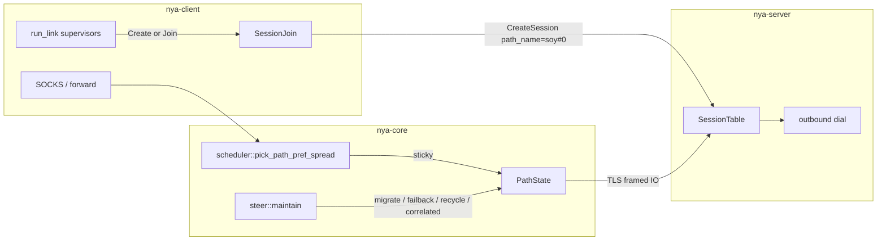
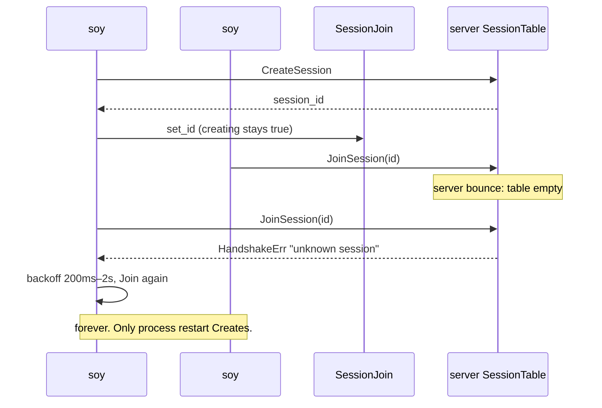
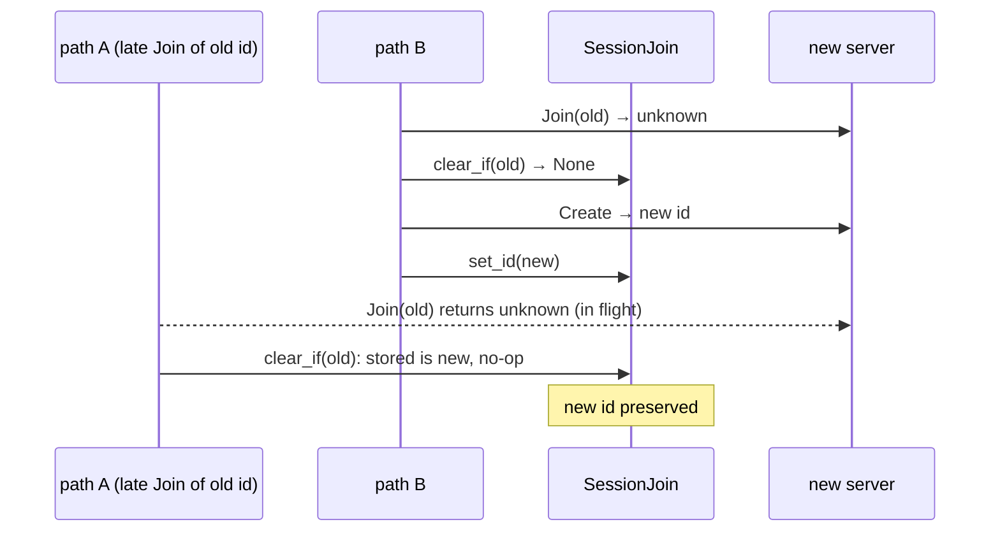
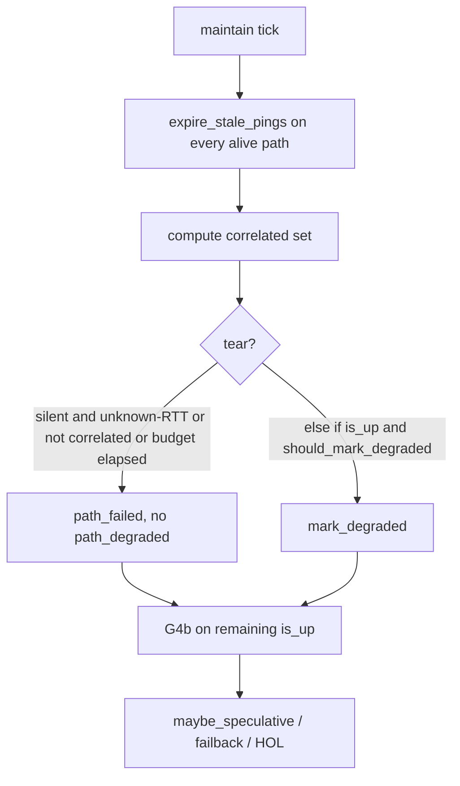

# Overlay algorithm completeness + observability

| Field | Value |
| --- | --- |
| **Author** | nya-link-aggregation maintainers |
| **Date** | 2026-08-29 |
| **Status** | Draft |
| **Audience** | Senior engineers working in `nya-proto`, `nya-core` (`handshake.rs`, `scheduler.rs`, `path.rs`, `session/steer.rs`, `export.rs`), `nya-client` (`lib.rs` `SessionJoin`), docs |
| **Lens** | 30-min generate_204 soak GZ–HK, binary `257b9535`, log pack `nya-link-aggregation-logs-20260829T0423Z.tar.gz`. Two named links (`akcdn`, `soy`) × `connections=2`, both ~6–7 ms. Application 35510 ok / 4 curl-28. Overlay: failbacks=0 (same class, correct), path_down+13, path_degraded+43, probe_miss+681, all_down_resets=0. Used as a *lens* on the algorithm, **not** a target to fit. |
| **Compatibility** | No new TOML keys. `[session]` stays `ping_interval_min_ms` / `ping_interval_max_ms` / `all_down_timeout_ms` / `max_paths` with `#[serde(deny_unknown_fields)]`. Production algorithm path is one `Tuning::STANDARD` table; tests clone-and-mutate only. `PROTOCOL_VERSION` stays 1. CreateSession gains an **optional trailing** `path_name` (old peers ignore extra bytes; trailing bytes must be a well-formed `put_str` or decode errors). `down_min_silence` / `ping_interval_*` are **not** retuned for the 7 ms path. e2e impair stays outside TLS. |

---

## Overview

The overlay is sticky-per-path TCP+TLS, not an MPTCP stripe. New streams stay in the fastest RTT class; `steer::maintain` migrates off unhealthy paths and failbacks when a better class is stable. A GZ–HK generate_204 soak did not break that model, but it exposed six completeness holes: Join never recreates after a server bounce; the session-creator TCP is named `"init"` on the server so it has no same-`link()` sibling; zero-load pick pins every short stream to the lowest `path_id`; class drop's 1 s hold is cleared by a single non-drop sample, so a same-link outlier TCP is never recycled; per-path `down_timeout` tears every 5-tuple when the peer process stalls; and the default info snapshot cannot prove speculative migrate / HOL / hedge.

This design closes all six without new operator knobs and without fitting formulas to 7 ms. Handshake learns to Create again on `unknown session` (and only that). CreateSession carries the client path name so server `link_key` matches. New-stream pick spreads **exact integer-µs score ties** by `stream_id` (failback/HOL keep min-id). Class drop *pauses* the low timer instead of clearing it, and the client supervisor redials an UP TCP that has been a same-link backup for `cfg.tuning.stable_up_hold` — not because it would win 1/N of new streams (class score already loses), but because it stays schedulable and is preferred as a same-link HOL/backup dest. Correlated silence is a two-pass set predicate (`alive.len() ≥ 2`): collect, then today’s if/else (`path_failed` **or** degrade, never both in the same tick). Immediate tears do not increment `path_degraded`. Deferred known-RTT silent paths degrade and stay TCP-alive; stickies migrate when an UP dest exists. All-N silent keeps TCP (streams stall until same-tick reset; curl-28 in that window is expected). Info snapshots and rare-event logs carry the counters needed to diagnose the above, without putting the 6–7 KiB catalog blob back on info.

---

## Background & Motivation

### Current architecture (what we are not changing)

From `docs/ARCHITECTURE.md`: one overlay session, many TCP+TLS paths, streams sticky on one path. Scheduler:

1. Drop backups (`class > fastest × 2 + 20 ms`).
2. Restrict to the fastest class (`should_failback(candidate, best)` is false).
3. Score `class_rtt × load × 1024 + fast_rtt × load`, `load = 1 + inflight/bias + sticky`.

`steer` (5 ms tick): speculative migrate, failback, same-link HOL rebalance. Timeouts from `Tuning::STANDARD` via `health.rs`. Operator TOML is only probe clamp, `max_paths`, `all_down_timeout`.

### Soak as a lens (not a fit target)

| Observation | What it is *not* | What it actually showed |
| --- | --- | --- |
| failbacks=0 | “failback is broken” | Both links ~6–7 ms, same class. `failback_target` correctly refuses same-class hop (`scheduler.rs` class-jump gate). |
| path_down+13, path_degraded+43, probe_miss+681, all_down_resets=0 | “need a lower `down_min_silence`” | 320 ms floor did its job against delay spikes; the session never went all-down. Downs clustered (04:06:43 three of four within 60 ms at `ago≈330 ms down=330 ms`) — correlated silence, not four independent 5-tuple deaths. |
| soy#0 5 downs vs soy#1 1; all 204s on first-connected path | “soy is worse than akcdn” | Zero-load tie-break is min `path_id`. Sequential sticky=0/inflight=0 streams all pin to the first TCP. |
| soy#0 class 227 ms vs sibling 7 ms, ~7 min to grind to 77 ms | “class EWMA is too slow” | `update_class` clears `class_low_since` on *any* non-drop sample. Bimodal pings reset the 1 s hold. Path stays UP because 237 ms < 320 ms `down_min_silence`, so it is never torn. |
| three rounds of all-four-paths `join: handshake rejected: unknown session` after server bounce; only a client unit restart recovered | “handshake auth flake” | `SessionJoin::set_id` is write-once. Every reconnect `Join`s. Server restart empties `SessionTable`; client never `Create`s again. |
| server path `init` vs client `soy#0` | documented as intended (`ARCHITECTURE.md` L55) | `path::link_key("init") ≠ link_key("soy#0")`. Server `backup_prefer_class` / HOL / `should_rebalance_conn` cannot find the creator TCP's sibling. |
| production ran at info; `pick` / `migrate` / `failback` / `class` are `debug!` | OTEL hardening already dropped `metrics=` (good) | Compact scorecard omits `migrates_*`, `hol_rebalances`, `data_hedge`, `data_retransmit`, `failbacks_same_link`. Cannot prove speculative migrate at 50 ms degrade. |

The four curl-28s (0.011 %) are consistent with the correlated-silence teardowns plus unknown-RTT reconnects that lived ~370 ms and died again. Known 7 ms `down_for` is `down_min_silence + probe` ≈ 320+10 = **330 ms** (`steer.rs` `down_for`); unknown-RTT uses `assumed_rtt = ping_interval_max * 2` then the same 320 ms floor + probe ≈ **370 ms** (`health.rs` `assumed_rtt`, test `unknown_down_grace_covers_200ms_first_pong`). Fixing G5 removes that loop; G1 removes the post-bounce deadlock; G3 stops pinning every 204 on the first TCP; G4 recycles the rotten same-link 5-tuple that stays a HOL/backup dest. None of that is a reason to touch `ping_interval_*` or `down_min_silence`.

### Pain points in code (cited)

- **G1.** `crates/nya-client/src/lib.rs` `SessionJoin`: after `set_id`, `connect_one` always takes `Role::Join`. `creating` stays `true` forever on success. `client_join_session` maps `HandshakeErr` to `HandshakeError::Rejected(message)`, so the client never even produces `HandshakeError::UnknownSession`. `ProcessCounters::inc_handshake_fail` therefore counts soak rejects as `handshake_fail_other`, not `handshake_fail_unknown`.
- **G2.** `server_accept_handshake` (`handshake.rs` L138) hardcodes `path_name: "init".into()`. `CreateSession` (`nya-proto` `frame.rs`) has `version`, `user_id`, `nonce`, `proof` — **no** `path_name`. Join already carries `path_name` and binds it into `join_proof`.
- **G3.** `scheduler::pick_from` L181–183: equal score then known-RTT then **lowest id**. `open_stream` picks *before* allocating `stream_id`. Unit test `spreads_across_equal_rtt_connections` only spreads by bumping `sticky` between picks.
- **G4.** `PathState::update_class` L372: `*low = None` on any non-raise, non-drop sample. Raise already requires a continuous 1 s hold (`class_high_since`). Drop does not.
- **G5.** `steer::maintain` L60–62: `if ago >= self.down_for(p) { path_failed(p.id) }` independently per path. `all_down_timeout` only resets *streams* after every path is already DOWN.
- **G6.** `export.rs::emit_snapshot` scorecard: `path_down`, `path_degraded`, `probe_miss`, `failbacks`, `session_all_down_resets`. The migrate/HOL/hedge counters exist on `Counters` / Prometheus and are absent from info.

---

## Goals & Non-Goals

### Goals

- Close **G1–G6** with unit (and where noted session/e2e) tests covering every named gap.
- Keep a single production `Tuning::STANDARD`. Formulas stay RTT-adaptive.
- Iterate logs so a default-info soak can answer: did we speculatively migrate, recycle an outlier, recreate after unknown-session, and suppress correlated `path_failed`?
- Compact info snapshot stays **~1–2 KiB**. Full catalog remains debug / `/metrics` / OTLP metrics.
- Update `docs/ARCHITECTURE.md` (Create path is not `"init"` by design) and `docs/OBSERVABILITY.md` (scorecard fields, rare-event info).

### Non-Goals

- New operator TOML knobs. Unknown `[session]` keys still deny.
- Retuning `ping_interval_min/max`, `down_min_silence` (320 ms), `unknown_degrade_min`, `interactive_max` (1500) to the GZ–HK 7 ms path.
- Fitting class-drop thresholds, failback frac, or `down_timeout_mult` to soak histograms.
- Packet-loss-inside-TLS in e2e. Impair harness still stalls outside TLS.
- Logging STREAM_DATA / ACK / Ping / Pong, or putting `metrics=` back on info.
- Changing HTTPS-204 bulk labeling in this change set (see G6 / classification). A single first overlay frame `> interactive_max` (TLS certs) marks the stream bulk today (`streams.rs` `send_data`). That did not cause the four curl-28s; retuning 1500 would. A real rule (e.g. bulk only after two consecutive large frames, or SOCKS CONNECT stays interactive until N large DATA) is a follow-up with its own HOL tests, not a soak fit.
- Server-side dial. Only the client supervisor redials (`run_link`).
- Bumping `PROTOCOL_VERSION`. Optional trailing `path_name` is enough.

---

## Key Decisions

1. **Unknown-session is the only Join error that forgets `session_id`.** Join timeout, TLS EOF, `Rejected("auth failed")`, and `Unexpected` leave the stored id in place. Forgetting on those would Create a second session while the first is still valid. Wipe is compare-and-clear: only if the stored id still equals the rejected Join id, so a late unknown-session cannot clobber a newer Create.

2. **CreateSession already authenticates the user; `path_name` is a label, not a new HMAC input.** Append an optional trailing length-prefixed string after `proof`. `create_proof` stays `HMAC(psk, "nya-create-v1" || exporter || nonce || user_id)`. Old servers ignore extra bytes (`Frame::decode` does not require the parser to consume the payload). Old clients omit the field; new servers fall back to `"init"`. Join continues to bind `path_name` in `join_proof`. `PROTOCOL_VERSION` stays 1.

3. **New-stream spread is exact integer-µs `(score, known)` ties only, via `stream_id` modulo; failback/HOL/backup keep min-id.** Changing `pick_from` globally would rotate `failback_target` / `hol_place_bulk_fallback` among equal peers and reintroduce Upgrade chatter. `open_stream` `fetch_add`s the spread key, then `pick_path_pref_spread`; on `None` return `NoPath` **without** `alloc_local_stream` (no pump leak). In-class 6 vs 7 ms is the same class (`failback` abs 8 ms) but **not** an exact score — sequential 204s stay on 6 ms. `load_term` still removes a busy sibling from the tied set.

4. **Class drop pauses the low timer; it does not clear on a single non-drop sample.** Raise stays continuous (any non-raise still clears `class_high_since`) so jitter-low-tail cannot singleton-class. Drop accumulates only while `class_should_drop` is true; a high sample freezes elapsed time. After a successful 7/8 drop, **zero** accum and `class_low_run` (today’s `update_class` does *not* clear `class_low_since` after store — copying that would grind every sample after the first hold). 7/8 and `class_drop_abs_us` / `class_drop_frac` are unchanged. Existing `jitter_low_tail_does_not_singleton` / `one_low_sample_does_not_collapse_class` must still pass. Class hold continues to read `PathState.stable_up_hold_us`.

5. **Outlier recycle is client-only, same-`link()`, vs raw sibling `class_rtt()`, hold `cfg.tuning.stable_up_hold`.** Recycle because the outlier stays `is_schedulable()`, occupies a `{link}#{i}` slot, and is preferred as a same-link HOL / `backup_prefer_class` dest (`pick_backup` class 0) while class is stale-high. New-stream pick already avoids it: `pick_from` scores **raw** `class_rtt() * load * 1024 + fast * load`, so 227 vs 7 is ~32× worse. Do **not** compare to the global fastest class (that would redial a legitimately slower named link). Recycle **must not** read `path.stable_up_hold_us`. Require `class_known()` on both sides. Recycle is `path_failed` → path IO exits → `run_link` redials. Server `maintain` never recycles.

6. **Correlated-silence TCP-tear budget is `SessionConfig.all_down_timeout`, not `down_timeout * k`.** Predicate (one formula): `alive.len() ≥ 3 && known_silent ≥ 1 && silent.len() == alive.len() − 1` (N−1 of N≥3 only). All-N still tears at `down_for`: a total blackhole collapses TCP RTO, and reconnect recovers faster than an 8 s hold (`blackhole_all_5s`). Soak evidence was 3-of-4 with one path still RX. `maintain` is **two-pass**: expire then collect then today’s if/else (`path_failed` **or** degrade). Immediate tears do **not** increment `path_degraded`. N=1 / N=2 / unknown-RTT still tear at `down_for`. Mixed-version: any old peer tears via IO EOF. At N−1 budget expiry, tear the silent TCPs; do not reset streams while an UP path remains.

7. **Info snapshot grows by a short packed scorecard, not the catalog.** Frozen info keys: `mig`, `hol`, `hedge`, `rtx`, `fb_slink`, `picks_unk`, `recycle`, `corr` (plus existing unpacked `path_down` / `failbacks` / `probe_miss`). `PathSnap.backup` is computed in `Session::snapshot` (has `inner.cfg`) with `health::is_backup(cfg, class_rtt, min class_rtt_us among rtt_known)` — global snapshot min, not same-link min — so a slower named link can show `bak` without being a G4b candidate. `format_paths` only appends ` bak`. Rare events (class raise/drop, correlated-silence enter, unknown-session recreate, outlier recycle) become structured **info**. `pick` / `migrate` / `failback` stay `debug!`. Do not reattach `metrics=`.

8. **One production `Tuning::STANDARD`.** G4a class hold = `PathState.stable_up_hold_us` (tests may store ~50 ms; no 1 s wall clock). G4b recycle hold = `SessionConfig.tuning.stable_up_hold` (tests clone that field to 0 / 50 ms). G5 budget = `all_down_timeout`. No new Tuning or TOML fields. Lengthening `all_down_timeout_ms` also lengthens correlated TCP hold.

---

## Proposed Design

### Architecture (unchanged data path, handshake identity fixed)



### G1 — Join `unknown session` recreates

#### Current flow



`connect_one` (`nya-client/src/lib.rs` L158–183): if `get_id()` is `Some`, always `Role::Join`. The Create CAS only runs when id is `None`. After a successful Create, `creating` is never set back to `false` (L206–208). `clear_if` **must** store `creating = false` or the next CAS never wins. Waiters at L175–176 are not sitting in that loop at wipe time (they already took `Role::Join`); they only matter for a concurrent Create wave *after* wipe — `notify_waiters` is for that post-wipe race, not for the in-flight Joins.

`client_join_session` (`handshake.rs` L71–74):

```rust
Frame::JoinSessionOk(_) => Ok(()),
Frame::HandshakeErr(e) => Err(HandshakeError::Rejected(e.message)),
```

Server writes `message: "unknown session"` and returns `HandshakeError::UnknownSession` locally. The client never sees that variant. Soak log `join: handshake rejected: unknown session` is `Rejected` Display (`handshake rejected: {0}`) wrapped by `join: {e}`.

#### Fix

**1. Map the wire error on the client (and keep server as-is).**

In `client_join_session`:

```rust
Frame::HandshakeErr(e) if e.message == "unknown session" => {
    Err(HandshakeError::UnknownSession)
}
Frame::HandshakeErr(e) => Err(HandshakeError::Rejected(e.message)),
```

Exact match on the server's constant string. `inc_handshake_fail` then increments `handshake_fail_unknown` (already wired in `metrics.rs` L575–576). Today those soak rejects are `handshake_fail_other` because the client only produces `Rejected`. Do **not** treat `Rejected("auth failed")` or IO as session-gone.

**Log line change.** `HandshakeError::UnknownSession` Display is `unknown session`, so the Join error becomes `join: unknown session` instead of soak’s `join: handshake rejected: unknown session`. Grep the new string plus the recreate info: `unknown session, will recreate`.

**2. Compare-and-clear on the Join that used that id.**

```rust
impl SessionJoin {
    /// Forget `sid` only if it is still the stored id.
    /// Sets `creating = false` and notifies waiters so the next
    /// `connect_one` can CAS Create.
    fn clear_if(&self, sid: [u8; SESSION_ID_LEN]) -> bool {
        let mut g = self.id.lock().unwrap();
        if *g == Some(sid) {
            *g = None;
            self.creating.store(false, Ordering::SeqCst);
            self.ready.notify_waiters();
            true
        } else {
            false
        }
    }
}
```

In `Role::Join(sid)` error path:

```rust
Ok(Err(e)) => {
    span.record("otel.status_code", "ERROR");
    session.process().inc_handshake_fail(&e);
    if matches!(e, HandshakeError::UnknownSession) {
        if join.clear_if(sid) {
            info!(path = %path_name, "unknown session, will recreate");
        }
    }
    return Err(anyhow::anyhow!("join: {e}"));
}
```

Join **timeout** (`Err(_)` of `timeout`) and TLS connect failure do **not** call `clear_if`.

**3. Four supervisors after a wipe: one Create, others Join the new id.**

This is the existing Create CAS (L160–183). After `clear_if`, id is `None` and `creating` is `false`. The next `connect_one` (after reconnect backoff) races the CAS: one Create, others wait on `ready` / `join_poll` then Join. Do not add a second Create path.

**Race that `clear_if` exists to prevent:**



Without compare-and-clear, A's late error wipes B's new session and the pack Joins a now-forgotten id.

**4. Do not Create while a session is still valid.** The only "session gone" signal is `HandshakeErr("unknown session")` / `HandshakeError::UnknownSession`. A Join that times out at `handshake_timeout` (or RTT-scaled 400 ms–3 s) may simply be a slow path; the id stays.

#### Tests (G1)

| Test | Where | Asserts |
| --- | --- | --- |
| `join_unknown_session_maps_variant` | `handshake.rs` | Duplex server with empty table; `client_join_session` returns `HandshakeError::UnknownSession`, not `Rejected`. |
| `join_auth_failed_is_rejected` | `handshake.rs` | Bad proof stays `Rejected`, does not map to UnknownSession. |
| `clear_if_only_matching_sid` | `nya-client` `SessionJoin` tests | `set_id(A); clear_if(B)` leaves A; `clear_if(A)` yields `None` and `creating == false`. |
| `clear_if_does_not_clobber_newer_id` | same | `set_id(old); set_id(new); clear_if(old)` keeps new. |
| `four_waiters_one_create_cas` | `nya-client` `SessionJoin` unit (fake Role CAS, **not** TLS / `connect_one`) | After `clear_if`, four concurrent CAS attempts: exactly one wins Create; others wait then see the new id. Merge gate is `clear_if` + wire mapping; this is extra coverage, not a TLS integration. |
| `join_timeout_does_not_clear` | client | Fake Join that never replies until timeout; stored id unchanged. |
| e2e bounce | `nya-e2e` | **Not a merge gate.** `conn_churn` already kills *connections*, not `SessionTable`. Optional if harness grows a server bounce. |

---

### G2 — Create path named from the client, not `"init"`

#### Wire

`CreateSession` today (`frame.rs` L198–204, decode L267–279):

```
u8 T_CREATE | u8 version | u16be user_id_len | user_id | nonce[32] | proof[32]
```

`Frame::decode` does **not** reject leftover bytes. Appending an optional `put_str(path_name)` is a compatible extension:

```
… proof[32] | u16be path_name_len | path_name   // new clients always write this
```

Old clients omit the field entirely (not an empty string). Decode:

```rust
T_CREATE => {
    // version, user_id, nonce, proof as today
    let path_name = if p.off < buf.len() { p.str()? } else { String::new() };
    Frame::CreateSession(CreateSession { version, user_id, nonce, proof, path_name })
}
```

If leftover bytes exist they **must** be a well-formed `put_str`; a 1-byte tail returns `ProtoError::Truncated` and Create fails (broken peer after TLS — acceptable). Encode always writes `path_name` (empty string is `u16be 0`). Server:

```rust
let path_name = if c.path_name.is_empty() {
    "init".into()
} else {
    c.path_name
};
Ok(HandshakeResult::Created { session, session_id, incoming, path_name })
```

`create_proof` / `nya-create-v1` **unchanged**. Path name is not auth-bound on Create (the TCP is already TLS-pinned + PSK-proved as this user). Join still HMACs `path_name`.

`client_create_session` gains `path_name: &str`. Call sites (exactly these): `nya-client` `connect_one` L197 (same `path_name` as Join); `handshake.rs` tests L204 / L220; `tls.rs` L266 / L320; `examples/hs_pair.rs` L54. Server `serve_one` already threads `HandshakeResult::Created { path_name }` into `add_path` (`nya-server/src/lib.rs` L223–258) — no server-file change in PR1.

#### Why this is a bug, not a feature

`docs/ARCHITECTURE.md` L55: “创建会话的那条路径在服务端记为 `init`.” That was convenient when Create had no name field. Consequences:

- `path::link_key("init")` is `"init"`. `link_key("soy#0")` is `"soy"`.
- Server `backup_prefer_class` (`scheduler.rs` L461–473) “same-link TCP is always eligible” never sees `soy#1` as a sibling of the creator TCP.
- `should_rebalance_conn` and `hol_place_bulk` same-link scan miss it.
- Snapshot `paths=` on the server shows `init=…` next to `soy#1`, `akcdn#0`, `akcdn#1`.

The creator TCP is an ordinary connection in `{link}#{i}` space (usually `#0` of whichever supervisor won the Create CAS). It must use that name on both sides.

#### Mixed-version

| Client | Server | Behavior |
| --- | --- | --- |
| new | new | names match (`soy#0`) |
| new | old | extra bytes ignored; server still `"init"` (partial deploy, HOL sibling still wrong on server) |
| old | new | no trailing string → `"init"` fallback |

G2 is complete only when **both** sides are new. No version bump; operators rolling one side first keep working, with the old `"init"` hole until the other side lands.

#### Tests (G2)

| Test | Where | Asserts |
| --- | --- | --- |
| `create_session_roundtrip_path_name` | `nya-proto` `frame.rs` | encode/decode `path_name = "soy#0"`. |
| `create_session_old_bytes_decode_empty_name` | `nya-proto` | Hand-built payload **without trailing bytes** → `path_name == ""` → server `"init"`. |
| `create_session_malformed_tail_truncated` | `nya-proto` | 1-byte leftover after proof → `ProtoError::Truncated`. |
| `create_then_join_uses_client_path_name` | `handshake.rs` | `HandshakeResult::Created { path_name }` is `"soy#0"`, not `"init"`; `link_key` equals the Join sibling's link. |
| `empty_path_name_falls_back_to_init` | `handshake.rs` | Old-style frame (no tail) → `"init"` (compat). |
| `create_proof_unchanged` | `auth.rs` | Same `create_proof(psk, exporter, nonce, user_id)` bytes as a stored vector. API has **no** `path_name` argument (`auth.rs` L7–14). |

Update `ARCHITECTURE.md` L55 to: CreateSession carries `{link}#{i}`; server uses it; `"init"` is only the missing-field fallback.

---

### G3 — Zero-load pick spreads inside the fastest class

#### Current

```158:191:crates/nya-core/src/scheduler.rs
pub(crate) fn pick_from(
    candidates: &[&Arc<PathState>],
    cfg: &SessionConfig,
    pref: PickPref,
) -> Option<u32> {
    // ...
        let better = score < best_score
            || (score == best_score && known && !best_known)
            || (score == best_score && known == best_known && p.id < best_id);
```

`open_stream` (`streams.rs` L27–32) picks *then* allocates `next_stream_id`. Sequential generate_204s: sticky=0, inflight=0, `load_term` = 1 for every UP path in class. All 204s pin to the first-connected TCP (lowest `next_path_id`, starting at 1 in `Session::new`). Soak: that was flaky `soy#0`.

Existing `spreads_across_equal_rtt_connections` / `mixes_same_class_named_links` increment sticky between picks — they prove **load** spread, not zero-load spread.

#### Fix

Keep `pick_from` min-id for failback / HOL / backup. Add spread variants **next to** the existing functions (`scheduler.rs`):

```rust
pub(crate) fn pick_from_spread(
    candidates: &[&Arc<PathState>],
    cfg: &SessionConfig,
    pref: PickPref,
    stream_id: u32,
) -> Option<u32> { /* same score as pick_from; on (score, known) tie see below */ }

pub fn pick_path_pref_spread(
    paths: &[Arc<PathState>],
    cfg: &SessionConfig,
    pref: PickPref,
    stream_id: u32,
) -> Option<u32> {
    pick_from_spread(&fastest_class_set(paths, cfg), cfg, pref, stream_id)
}
```

`Session::pick_pref` is **unchanged** (still `pick_path_pref` → `pick_from`). `ensure_sticky` / `failback_target` / `hol_place_bulk_fallback` / `pick_backup` keep `pick_from`.

Algorithm, concretely:

1. Compute `score = class * load * 1024 + fast * load` as today (`load_term` unchanged; Interactive still uses `bias/4`).
2. Track the min score among known-RTT-preferring candidates (same `known` rule as today).
3. Collect every candidate with that **exact** `(score, known)` pair. Spread is exact integer-µs score ties only. In-class 6 vs 7 ms (`failback` abs 8 ms, same class) is **not** a tie — sequential 204s stay on 6 ms. Do not add an epsilon.
4. If one element → that id (`load_term` still removes a busy sibling from the tied set).
5. If many → sort by `path_id` (HashMap order is not stable), index `stream_id.wrapping_sub(1) % n`.

`stream_id` starts at 1 (`next_stream_id` initial). Stream 1 → index 0 (lowest id, same as today for the first stream), stream 2 → index 1, … Sequential 204s walk the tied set. Same `stream_id` is session-stable among a frozen tied set.

`Session::open_stream` (`streams.rs`; preserve the NoPath-orphan invariant documented as “先 pick 再 alloc” in `OBSERVABILITY.md`):

```rust
self.wait_ready(self.inner.cfg.all_down_timeout).await?;
let id = self.inner.next_stream_id.fetch_add(1, Ordering::Relaxed);
let Some(path_id) = self.pick_pref_spread(PickPref::Interactive, id) else {
    // id consumed; do NOT alloc_local_stream (no HashMap insert, no pump).
    return Err(SessionError::NoPath);
};
let (tun, _st) = self.alloc_local_stream(id);
self.set_sticky(id, path_id);
self.inner.metrics.streams_opened.fetch_add(1, Ordering::Relaxed);
// note_unknown_pick + debug candidates + StreamOpen as today
```

A skipped `stream_id` on `NoPath` is acceptable (ids are not scarce). An implementer who `alloc_local_stream`s before pick reopens the orphan the observability work closed.

This must not reintroduce Upgrade chatter: `failback_target` still refuses same-class hops except class-jump, and dest pick among equals is still min-id (deterministic, not rotating each 5 ms tick).

#### Tests (G3)

| Test | Asserts |
| --- | --- |
| `zero_load_sequential_spreads` | Four equal 7 ms paths, sticky=0, inflight=0. `pick_from_spread` for stream_ids 1..=8 uses **≥2** distinct path ids (actually all four with 4 paths × 2). |
| `zero_load_spreads_across_named_links` | `akcdn#0/#1` + `soy#0/#1`, all 7 ms. Sequential spreads across ≥2 connections **and** ≥2 `link_key`s. |
| `load_still_beats_spread` | `a#0` inflight = `inflight_bias`, `a#1` inflight = 0, equal RTT. Spread pick for every stream_id returns `a#1`. Existing `skips_congested_when_sibling_is_free` / `stays_on_fast_link_despite_bulk` stay green. |
| `spread_does_not_spill_class` | Busy 9 ms vs empty 21 ms still picks 9 ms (`does_not_spill_to_slower_link_when_fast_is_busy`). |
| `failback_still_min_id_on_tie` | Two equal in-class dests: `failback_target` dest is the lower path_id on every call (no rotation). Existing chatter tests (`spike_escape_1_7x_not_jitter`, `all_elevated_does_not_dump_to_slow`, `jitter_low_tail_does_not_singleton`) unchanged. |
| session: sequential `open_stream` | `pair_echo` with two equal paths; open eight `TunnelStream`s and **keep them alive**; assert distinct `st.sticky` values (or record `path_id` at open). After close, `sticky_count` returns to 0 (`maybe_count_graceful`) — do not infer spread from `st=` on closed 204s. |

---

### G4 — Class drop hold + same-link outlier recycle

#### G4a. Class drop hold

`PathState::update_class` (`path.rs` L313–373):

- **Raise:** `fast > class × 2` and `fast > class + 15 ms`, then 1 s continuous (`class_high_since`). Any non-raise clears `high`.
- **Drop:** `class_should_drop` = `class − fast ≥ max(8 ms, 0.25 × class)`, then 1 s (`class_low_since`). **Any non-drop currently does `*low = None`.**

Soak after idle: soy#0 class 227 ms, sibling 7 ms. Fast bimodal ~7 ms (drop: 227−7 ≥ 56.75) and ~200 ms (not drop: 227−200 = 27 < 56.75). Each 200 ms sample reset the 1 s timer. 7/8 almost never fired; ~7 minutes to grind 227 → 77 ms. Path stayed UP (237 ms < 320 ms `down_min_silence`).

**Fix: pause, don't clear.** Accumulate drop-sample time; freeze on non-drop; clear only on raise or after a successful 7/8 store.

```rust
// PathState fields (replace Option<Instant> class_low_since with):
class_low_accum_us: AtomicU64,          // paused total
class_low_run: Mutex<Option<Instant>>,  // current drop streak start

fn update_class(&self, fast: u64) {
    // init window (8 samples) unchanged
    // raise branch: *class_low_run = None; class_low_accum_us = 0; (same as *low = None)
    if drop {
        let run = class_low_run.get_or_insert_with(Instant::now);
        let total = Duration::from_micros(accum) + run.elapsed();
        if total >= hold {
            let new_us = (c_old * 7 + fast) / 8;
            rtt_class_us.store(new_us);
            class_low_accum_us = 0;
            *class_low_run = None;
            info!(path, old_us = c_old, new_us, kind = "drop", "class");
        }
        return;
    }
    // non-raise, non-drop: pause
    if let Some(run) = class_low_run.take() {
        class_low_accum_us += run.elapsed().as_micros() as u64;
    }
}
```

A single 200 ms sample no longer zeros the timer. A 90 ms jitter-low-tail still adds only one probe interval to `accum` (~10–50 ms) against a 1 s hold, then 180 ms samples pause; `one_low_sample_does_not_collapse_class` and `jitter_low_tail_does_not_singleton` stay green. `class_should_drop` / 7/8 / `class_drop_frac` are **unchanged** — we are not widening the drop gate.

Hold duration is `PathState.stable_up_hold_us` (same as today, `path.rs` L332). Tests mutate that atomic to ~50 ms (existing class-test pattern); **do not** require 1 s of wall clock.

Raise stays strict-continuous so a delay-spike high tail cannot freeze a raise, and a lucky-low still cannot singleton the class (`scheduler` `jitter_low_tail_does_not_singleton` is the membership test; path-level `jitter_low_tail_does_not_drop_class` is the gate).

Promote class raise/drop logs from `debug!` to **`info!` in PR2** (with recycle / correlated `info!`). Init-class (`kind = "init"`) stays debug. `OBSERVABILITY.md` currently says class rewrite is debug; PR3 flips **raise/drop only**.

#### G4b. Same-link outlier recycle (client only)

Class drop even with pause still 7/8-steps toward fast (~8–10 holds from 227 ms → ~7 ms). That is seconds, not minutes. Recycle is still required, **not** because the outlier would win 1/N of new streams after G3.

`pick_from` scores **raw** `class_rtt() * load * 1024 + fast * load` (`scheduler.rs` L176–179), not `effective_class_rtt`. A 227 ms class vs 7 ms class is ~32× worse and loses every zero-load pick. `fastest_class_set` *membership* can still include it because `effective_class_rtt` yields fast when `should_failback(class, fast)` (`scheduler.rs` L43–51, L102–107) — that is why it stays in the class set and remains a same-link HOL / `backup_prefer_class` dest (`pick_backup` class 0, L529–531), not why it wins `open_stream`. Recycle because the outlier stays `is_schedulable()`, occupies a `{link}#{i}` slot, and is preferred as that same-link HOL/backup dest while class is stale-high.

**Recycle rule** (evaluated in `steer::maintain` **after** G5 silence/tear on remaining `is_up()` paths, **client only**):

A path `p` is recycled when all of:

1. `inner.is_client` (server does not dial).
2. `p.is_up()` (not already DOWN/DEGRADED — those take the silence path).
3. `p.class_known()`.
4. There exists at least one other **alive, `class_known()`, same `p.link()`** sibling `s`.
5. `health::is_backup(cfg, p.class_rtt(), best_sibling.class_rtt())` — i.e. `p.class > sibling.class × 2 + 20 ms`. Compare to the **same-link** min class, **not** `fastest_class_set` / global min.
6. That backup relation has held continuously for **`cfg.tuning.stable_up_hold`** (1 s on `Tuning::STANDARD` L103). Recycle **must not** read `path.stable_up_hold_us` (that atomic is the class/stable raise hold; G4a tests store 0 there without meaning “recycle now”). Store `outlier_since: Mutex<Option<Instant>>` on `PathState`; clear when any of 2–5 fails.

On fire: `info!(path, sib, class_us, sib_class_us, "outlier recycle")`, increment a new counter `path_outlier_recycle`, then `path_failed(p.id)`.

`path_failed` already: marks DOWN, `migrate_from_path`, removes from the map. `spawn_path_io` loop exits on `!path.is_alive()`, `done` completes, `add_path` returns, `connect_one` returns `Ok(())`, `run_link` resets backoff to min and redials. No new client channel.

**What we deliberately do not recycle**

| Situation | Why |
| --- | --- |
| `akcdn` class 60 ms, `soy` class 7 ms, each link's connections agree | Different `link()`. A slower *named link* is a class member or backup for pick, not a redial. |
| Single `connections=1` link | No sibling. |
| Both soy#0 and soy#1 at 227 ms | `is_backup(227, 227)` is false. |
| Young path, `class_init_n < 8` | `class_known()` false. |
| Path DEGRADED/DOWN | Silence / G5 owns it. |
| Server session | `is_client == false`. |

Do **not** add a TOML knob. G4a tests mutate `path.stable_up_hold_us` (~50 ms) or inspect `class_low_accum_us` / `class_low_run` (`pub(crate)` under `#[cfg(test)]`). G4b tests: `Session::new_client` with **cloned** `tuning.stable_up_hold = 0` / 50 ms — setting `p.stable_up_hold_us.store(0)` will **not** fire recycle.

#### Tests (G4)

| Test | Asserts |
| --- | --- |
| `one_low_sample_does_not_collapse_class` | **existing** — still pass. |
| `jitter_low_tail_does_not_drop_class` | **existing**. |
| `jitter_low_tail_does_not_singleton` | **existing** (scheduler). |
| `bimodal_does_not_reset_class_low_hold` | class 227 ms; `stable_up_hold_us ≈ 50 ms`; alternate `record_rtt(7 ms)` / `record_rtt(200 ms)` with majority 7 ms; after ~50 ms sleep (or inspect accum ≥ hold) class 7/8-drops. **No 1 s wall clock.** |
| `single_non_drop_pauses_low_timer` | Start drop with 7 ms, one 200 ms, then 7 ms; inspect `class_low_accum_us` / `class_low_run` (without sleep, elapsed ≈ 0 so pause vs clear is only distinguishable by fields). |
| `raise_still_clears_low` | Drop accum then a raise sample zeros accum and run. |
| `drop_store_clears_accum` | After a successful 7/8 drop, accum=0 and `class_low_run=None` (unlike current `update_class`, which leaves `class_low_since` set). |
| `outlier_recycle_same_link` | `soy#0` class 227 ms, `soy#1` class 7 ms, both UP; **`cfg.tuning.stable_up_hold = Duration::ZERO`**; `debug_maintain` on a **client** session → `soy#0` gone (`path_outlier_recycle=1`, `path_down+1`), `soy#1` remains. |
| `outlier_does_not_recycle_other_link` | `akcdn#0` 60 ms class, `soy#0` 7 ms; maintain does **not** drop akcdn. |
| `outlier_needs_sibling` | Single path 227 ms vs nothing; not recycled. |
| `outlier_skips_unfrozen_class` | `class_known()==false`; not recycled. |
| `outlier_ignores_path_stable_up_hold_us` | `p.stable_up_hold_us.store(0)` with `cfg.tuning.stable_up_hold = 1s`; one maintain tick does **not** recycle. |
| `server_does_not_recycle` | `Session::new_server`, same soy pair; maintain leaves both. |

---

### G5 — Correlated silence ≠ per-path down

#### Current

```42:83:crates/nya-core/src/session/steer.rs
    fn maintain(&self) {
        // ...
            if ago >= self.down_for(p) {
                warn!(path = %p.name, ?ago, down = ?self.down_for(p), "path silent, marking down");
                self.path_failed(p.id);
```

`down_for` = `Tuning::down_timeout(assumed_rtt, probe)` = `max(5×rtt, 320 ms)+probe`, cap 5 s. On a 7 ms path with `ping_max=50 ms` this is ~330 ms — matching soak `ago≈330ms down=330ms`.

04:06:43 three of four paths silent-down within 60 ms. 04:08:33 both akcdn torn; young reconnects lived ~370 ms and died again (unknown-RTT `down_for` ≈ 370 ms). `all_down_timeout=8 s` only resets streams after every path is already DOWN; it does not stop tearing TCP. Tearing four 5-tuples because the *peer process* stalled is the wrong move: the next dials are unknown-RTT and inherit the same floor.

#### Correlated predicate

Let `alive` = paths with `is_alive()` (UP or DEGRADED). Let `silent` = alive paths with `last_rx_ago() >= down_for(p)`. Let `known_silent` = count of silent paths with **`rtt_known()`** (not `class_known()`).

This is the spec (copy this; do not implement the N=1-inclusive draft):

```
correlated ⇔
    alive.len() ≥ 3
    && known_silent ≥ 1
    && silent.len() == alive.len() - 1
```

Commentary only (not a second formula):

- N=1 / N=2 / all-N: **not** correlated. Silence uses `down_for`. All-N blackhole must tear so TCP RTO does not outlast a reconnect (`blackhole_all_5s` p99).
- N≥3 and exactly N−1 silent: defer (soak: 3 of 4). The remaining path still RX, so this is not “peer fully stuck”.
- `known_silent ≥ 1`: if every silent member is unknown-RTT, do **not** enter correlated.

#### Two-pass `maintain` (collect the set, then today’s if/else)

Today (`steer.rs` L42–82) is mutually exclusive and runs expire first:

```
expire_stale_pings; probe_miss += miss     // health.rs L86–88: should_mark_degraded after expire
if ago >= down_for { path_failed }         // no path_degraded++
else if is_up && should_mark_degraded { mark_degraded; path_degraded++ }
```

Correlated is a **set** predicate. The first path in `path_list()` cannot know whether N−1 of N are silent. HashMap iteration order is not stable. A one-pass fold will tear early paths before the set is known. Do **not** invert this into “always degrade then maybe tear”: `should_mark_degraded` is true whenever `ago >= down_for` (degrade_for ≪ down_for) unless a young ping is in flight, so that would `path_degraded++` *and* `path_down++` on every immediate tear (N=1, N=2 one-silent, unknown-young, all-unknown). Soak greps and G6 `path_degraded` would stop meaning “degraded but still alive.”

`should_mark_degraded` is specified to run *after* `expire_stale_pings` (`health.rs` L86–88). Omitting expire leaves `pending > 0 && miss == 0` and production paths with an in-flight ping never degrade; unit tests that `age_rx` without `next_ping` still pass.

Patch structure for `maintain` (keep today’s if/else **shape**):

1. Snapshot `path_list()` (already copied).
2. For every alive path: `expire_stale_pings(loss_for)`; add the return to `probe_miss` (unchanged).
3. Build `alive`, `silent` (`last_rx_ago() >= down_for(p)`), `known_silent`. Compute `correlated`; on rising edge set `Inner.correlated_since`, `info!`, `correlated_silence++`; on falling edge clear the Instant.
4. For each still-alive path:

```
tear = silent && (unknown-RTT || !correlated || budget elapsed)
if tear { warn; path_failed }                          // no path_degraded++
else if is_up && should_mark_degraded { mark_degraded; path_degraded++ }
```

   Deferred known-RTT (`tear == false`, `ago >= down_for`) takes the else-if and becomes DEGRADED without `path_down`. Immediate tears do **not** bump `path_degraded`.
5. If budget expired and `!has_alive_path()`, reset streams in this tick (`session_all_down_resets++`) — do not wait for `all_down_since` (`path_failed` would set it to *now*, which is the 16 s trap).

G4b recycle runs on remaining `is_up()` paths **after** this, using the same snapshot plus the post-tear map.



#### Tear policy and all-N product

- **Degrade only when not tearing this tick.** Deferred known-RTT silent paths (`tear == false`) take the else-if and become DEGRADED. Immediate tears skip `path_degraded`. `degrade_timeout` on a 7 ms path is `ping_interval_max` (50 ms).
- **Speculative migrate / hedge when an UP dest exists.** Soak 3-of-4: stickies leave via `maybe_speculative` onto the remaining UP path without tearing TCP. `backup_prefer_class` returns `None` if `cur.is_alive()` and no schedulable dest (`scheduler.rs` L478–480), so **all-N DEGRADED cannot restick**.
- **All-N silent (chosen product):** keep TCP. `wait_paths` counts `is_alive() && rtt_known()` (`mod.rs` L198–202), so `open_stream` still succeeds and `fastest_class_set` falls through to `is_alive()` (L116–121). New stickies may land on silent DEGRADED paths. Streams stall until same-tick reset at `all_down_timeout`. **curl-28 during that 8 s peer stall is expected.** Do **not** treat correlated-all as `NoPath` / fail `wait_ready` (rejected: extra ready semantics; mass-tearing is what caused the young-reconnect flap).
- **Unknown-RTT** silent paths still `path_failed` at `down_for` even during a correlated episode. A newly dialed 5-tuple that never gets a first Pong must not hide behind the 8 s budget.
- **Budget = `cfg.all_down_timeout`** (default 8 s, already operator-facing). Justification: that timer is “how long we tolerate a stalled overlay before giving up.” When every (or N−1) path is silent together, the 5-tuple is not the problem; waiting the give-up timer is. `down_timeout * k` would invent a hidden k. Operators who raise `all_down_timeout_ms` to 60 s also keep silent TCPs 60 s.
- **`correlated_since: Mutex<Option<Instant>>` on `Inner`.** Set on the first tick the predicate is true; clear when it is false. Do not use `last_rx_ago >= all_down_timeout` alone — after a mass reconnect `last_rx` is fresh.
- **8 s vs 16 s trap.** At budget expiry: `path_failed` the known-silent set, and if `!has_alive_path()` reset streams in the **same tick** (`session_all_down_resets++`). `all_down_since` handling stays as a backstop for the non-correlated all-down case.

#### Mixed-version (G5 is a no-op unless both sides are new)

`spawn_path_io` `path_failed`s on EOF / read error (`path.rs` L491–497, L551), which **bypasses** the silence predicate.

| Client | Server | Behavior |
| --- | --- | --- |
| new | new | correlated defer on both; TCP held until budget |
| new | old | old server `path_failed` at ~330 ms → TLS close → new client IO exits → client `path_failed` regardless of `correlated_since`. No `corr`. Same mass `path_down`. |
| old | new | old client tears at ~330 ms → EOF on new server. G5 inert. |

**Ship both binaries.** Do not treat a one-sided client canary as a G5 canary.

Log once per episode at info:

```rust
info!(
    alive = n,
    silent = silent.len(),
    known_silent,
    budget_ms = cfg.all_down_timeout.as_millis() as u64,
    "correlated silence"
);
```

Increment `correlated_silence` (new counter) on enter, not every 5 ms tick.

Single-path silence: existing `warn!(path, ?ago, down, "path silent, marking down")` stays.

#### Tests (G5)

Use `debug_maintain` plus synthetic `last_rx` / RTT. Clone `SessionConfig` in tests: `all_down_timeout = 200 ms`, `tuning.down_min_silence = 50 ms` so the test does not sleep 8 s.

| Test | Asserts |
| --- | --- |
| `single_path_silence_still_downs` | N=1 (or N=4 with only one past `down_for`): that path `path_failed` at `down_for`; others untouched; **`path_degraded` unchanged** vs a baseline taken after expire (immediate tear must not take the else-if). |
| `n2_both_silent_defers` | Two known-RTT paths both past `down_for` (`age_rx`): neither DOWN until `all_down_timeout`; **both DEGRADED** (`tear == false` takes the else-if). |
| `n2_one_silent_downs` | One of two silent: that one DOWN at `down_for` (not correlated); that path’s `path_degraded` does **not** increment. |
| `n4_three_silent_migrates_no_down` | Three known-RTT past `down_for`, **one UP**: none of the three `path_failed` before budget; sticky resticks (`migrates_speculative`); all three DEGRADED. |
| `n4_all_silent_degrades_no_migrate` | Four known-RTT past `down_for`: all DEGRADED, `path_down` unchanged until budget; **do not** assert `migrates_speculative` (no UP dest). |
| `unknown_young_tears_during_correlated` | Three known silent (deferred) + one unknown-RTT past `down_for`: the unknown is `path_failed` **without** `path_degraded++`; the three DEGRADED, not DOWN. |
| `all_unknown_not_correlated` | Four unknown-RTT silent: all `path_failed` at `down_for` (`known_silent == 0`); `path_degraded` unchanged. |
| `budget_expiry_tears_and_resets_streams` | Four known silent; after `all_down_timeout`, `path_down += 4`, `session_all_down_resets >= 1` in the same tick if streams exist. |
| existing `degraded_migrates_to_sibling_without_path_down` | stays (single-path degrade with an UP sibling). |
| `health::down_timeout` tests | **unchanged** — 320 ms floor, unknown 200 ms first Pong, 12 ms path extra=250 ms. |

Do not add an e2e “stall the whole peer inside TLS.” Impair stays outside TLS; a unit-level `last_rx` freeze is the right probe.

---

### G6 — Observability that can diagnose G1–G5

#### Info snapshot scorecard

`emit_snapshot` (`export.rs` L129–154) today:

```
stall_p99_ms, failover_p99_ms, stall_count, failover_count,
paths_alive, streams_live, streams_closed, stream_resets,
path_down, path_degraded, probe_miss, failbacks, session_all_down_resets,
bytes_data_tx, bytes_ctrl_tx, paths=, links=, streams=
```

**Add** (all already on `Snapshot` except two new counters):

```
migrates_speculative, migrates_path_down, migrates_ensure_sticky, migrates_send_blocked,
hol_rebalances, data_hedge, data_retransmit, failbacks_same_link,
picks_unknown_rtt, path_outlier_recycle, correlated_silence
```

Compact encoding to hold the 1–2 KiB budget (four paths + scorecard today is a few hundred bytes; the catalog was 6–7 KiB). Frozen `info!` keys (packed, not nine extra top-level u64s):

| Key | Value |
| --- | --- |
| `mig` | `"spec/down/ens/blk"` e.g. `12/3/0/1` |
| `hol` | `hol_rebalances` u64 |
| `hedge` | `data_hedge` u64 |
| `rtx` | `data_retransmit` u64 |
| `fb_slink` | `failbacks_same_link` u64 |
| `picks_unk` | `picks_unknown_rtt` u64 |
| `recycle` | `path_outlier_recycle` u64 |
| `corr` | `correlated_silence` episodes u64 |

Keep the existing unpacked `path_down` / `failbacks` / `probe_miss` (soak greps). Do **not** attach `metrics=` on info. Debug line stays `format_snapshot_metrics`.

e2e `report.rs` already prints `mig spec/down/ens/blk` from Snapshot fields. Packed info `mig=` is a **second grammar**; they are independent (do not parse one from the other).

`picks` (every `open_stream`) is `streams_opened` — already implied; do not add a second counter. `picks_unknown_rtt` is the cheap diagnostic.

#### `paths=` flags

Today: `{name}={rtt}/{stable}/{class}ms {state} inf= st= cong= rx= tx= ping= q={u}/{b}{ unk}?`

`emit_snapshot` / `format_paths` only see `ProcessSnapshot` / `&[PathSnap]` — **no** `SessionConfig`. Do not call `health::is_backup` in `format_paths` and do not hardcode `2.0` / `20 ms`.

- Add `pub backup: bool` on `PathSnap`.
- Compute it in `Session::snapshot` (has `inner.cfg`) after `snap_with_paths`: min = `class_rtt_us` among `rtt_known` in **this snapshot** (global, not same-link). `backup = rtt_known && is_backup(cfg, class_rtt, min)`. A slower named link can show `bak` without being a G4b recycle candidate.
- `format_paths` only appends ` bak` when `p.backup`. Tests in `export.rs` set `PathSnap.backup = true` rather than re-deriving.
- Keep ` unk`. **Skip the Prometheus `backup` label** (series churn).

Example: `soy#0=7/7/227ms up inf=0 st=12 cong=0 rx=3 tx=1 ping=0 q=0/0 bak` (` bak` before optional ` unk`).

Budget: four paths × ~80 chars + packed scorecard ≪ 2 KiB. Size test: 4-path fixture + scorecard `< 2048`.

#### Rare-event info (not hot path)

| Event | Level | Fields | Today |
| --- | --- | --- | --- |
| class raise / drop (7/8 store) | **info** | `path`, `old_us`, `new_us`, `kind` | `debug!` |
| correlated silence **enter** | **info** | `alive`, `silent`, `known_silent`, `budget_ms` | — |
| unknown-session recreate | **info** | `path` | plus Join error `join: unknown session` (was `join: handshake rejected: unknown session`) |
| outlier recycle | **info** | `path`, `sib`, `class_us`, `sib_class_us` | — |
| path silent-down (`path_failed` from silence) | **warn** (keep) | `path`, `ago`, `down` | already warn |
| pick / migrate / failback / HOL | **debug** (keep) | existing | debug |
| STREAM_DATA / ACK / Ping | none (keep) | | |

Class init (`kind=init`) stays debug (eight samples × N paths at session start).

#### New catalog counters

Add to `Counters` / `visit_metrics` / Prometheus (debug snapshot + `/metrics` + OTLP). Must touch **all** of:

- `Counters` (hand-written `Default`, `metrics.rs` L193+)
- `Counters::snap_with_paths`
- `Snapshot` fields
- `Snapshot::add_counters` — **required**; the compiler will not catch a missed merge, and `SessionTable::aggregate_snapshot` would silently zero the new fields
- `visit_metrics` (`catalog.rs`)
- `export.rs` `catalog_includes_held_and_snapshot_uses_catalog_names`: bump `assert_eq!(n_counter, 48)` to **`n_counter == 50`** (**PR2**, with `catalog.rs` — otherwise a split PR2 fails CI)

| Name | Help |
| --- | --- |
| `nya_path_outlier_recycle_total` | client same-link outlier TCP recycled |
| `nya_correlated_silence_total` | correlated-silence episodes entered |

Do not add a `picks_total` (use `streams_opened`). Counters, `visit_metrics`, `n_counter == 50`, and the two `prometheus_metric_names` asserts land in **PR2** (they live in `export.rs` today). Packed info keys and `format_paths` ` bak` land in **PR3**.

#### HTTPS 204 labeled `bulk`

`send_data` (`streams.rs` L206–208): first piece `n > interactive_max` (1500) CAS-es `st.bulk`. Tunneled HTTPS sends TLS certs > 1500 on the first large DATA, so generate_204 streams show as `bulk` in `streams=`. **Do not change `interactive_max=1500` in this work.** A real classification rule (two consecutive large frames, or “interactive until N large DATA”) needs HOL isolation tests for true bulk and is a follow-up. Note it in `ARCHITECTURE.md` as known: snapshot `ping|bulk` is overlay-frame size, not SOCKS command.

#### Tests (G6)

| Test | Asserts |
| --- | --- |
| `format_paths_flags_bak_and_unk` | `export.rs`: `PathSnap.backup = true` → ` bak`; `rtt_known=false` → ` unk`. Do not re-derive `is_backup` in the test. |
| `format_paths_no_bak_when_backup_false` | `backup = false` → no `bak`. |
| snapshot scorecard helper | packed keys `mig` / `hol` / `hedge` / `rtx` / `fb_slink` / `picks_unk` / `recycle` / `corr` present; `metrics=` **not** in the info field set; 4-path fixture + scorecard `< 2048`. |
| catalog includes new names | `prometheus_metric_names` contains `nya_path_outlier_recycle_total`, `nya_correlated_silence_total`; `n_counter == 50`. |

Docs: `OBSERVABILITY.md` 10 s snapshot field list; decision-point table (class / correlated / recycle / recreate → info). `ARCHITECTURE.md` observability paragraph.

---

## API / Interface Changes

### `nya-proto` `CreateSession`

```rust
pub struct CreateSession {
    pub version: u8,
    pub user_id: String,
    pub nonce: [u8; NONCE_LEN],
    pub proof: [u8; PROOF_LEN],
    pub path_name: String, // new; empty = legacy
}
```

`PROTOCOL_VERSION` remains 1. `JoinSession` unchanged.

### `nya-core` handshake

```rust
pub async fn client_create_session<T: AsyncRead + AsyncWrite + Unpin>(
    io: &mut T,
    psk: &[u8],
    exporter: &[u8],
    user_id: &str,
    path_name: &str, // new
) -> Result<[u8; SESSION_ID_LEN], HandshakeError>;
```

Call sites (exactly): `nya-client` `connect_one` L197; `handshake.rs` L204 / L220; `tls.rs` L266 / L320; `examples/hs_pair.rs` L54.

`client_join_session`: map `"unknown session"` → `HandshakeError::UnknownSession`. Join error Display becomes `join: unknown session`.

### `nya-core` scheduler

```rust
pub fn pick_path_pref_spread(
    paths: &[Arc<PathState>],
    cfg: &SessionConfig,
    pref: PickPref,
    stream_id: u32,
) -> Option<u32>; // fastest_class_set + pick_from_spread

pub(crate) fn pick_from_spread(
    candidates: &[&Arc<PathState>],
    cfg: &SessionConfig,
    pref: PickPref,
    stream_id: u32,
) -> Option<u32>;
```

`pick_path` / `pick_path_pref` / `pick_from` keep min-id tie-break. `Session::pick_pref` unchanged.

### `Session::open_stream`

`fetch_add` the spread key, `pick_pref_spread`, on `None` return `NoPath` **without** `alloc_local_stream`; on success `alloc_local_stream` + `set_sticky` as today.

### `PathState`

Replace `class_low_since: Mutex<Option<Instant>>` with accum + run. Add `outlier_since: Mutex<Option<Instant>>`.

### `Inner`

`correlated_since: Mutex<Option<Instant>>`.

### `PathSnap`

`pub backup: bool` (Default false). Filled in `Session::snapshot`. `format_paths` reads it. No Prometheus label.

### `Counters` / catalog

`path_outlier_recycle`, `correlated_silence` on `Counters` (hand-written Default), `snap_with_paths`, `Snapshot`, **`Snapshot::add_counters`**, `visit_metrics`. `n_counter == 50`.

### TOML / Tuning

**None.** `SessionOpts` still four keys (`ping_interval_min_ms`, `ping_interval_max_ms`, `all_down_timeout_ms`, `max_paths`). No new `Tuning` fields. Recycle hold = `cfg.tuning.stable_up_hold` (not `path.stable_up_hold_us`). Correlated budget = `all_down_timeout` (operator coupling: raising it lengthens silent-TCP hold).

---

## Data Model Changes

No durable store. Wire: optional trailing string on CreateSession (see G2). In-memory only: `SessionJoin` wipe, `PathState` class-low accum + `outlier_since`, `Inner.correlated_since`, `PathSnap.backup`, two counters.

Migration: rolling deploy, Create path name is best-effort until both sides are new. No session_id disk cache exists today — G1 is the whole persistence story (in-process `SessionJoin` mutex).

---

## Alternatives Considered

### G1 recreate

| Alternative | Trade-off |
| --- | --- |
| **A. Compare-and-clear on UnknownSession only (chosen)** | Precise. Join timeout / EOF cannot split-brain a live session. |
| B. Clear id on any Join failure | Fast recovery after a bounce that surfaces as EOF, but Create-while-alive if the server is slow. Two sessions, split streams. |
| C. Server accepts Join for unknown id by auto-creating | Moves identity to the server; Join proof is bound to `session_id` via HKDF, so auto-create cannot verify. Would need a new frame. |

### G2 path name

| Alternative | Trade-off |
| --- | --- |
| **A. Optional trailing `path_name`, proof unchanged (chosen)** | Mixed-version safe. `PROTOCOL_VERSION` stays 1. |
| B. Bind `path_name` into `create_proof` | New client vs old server = auth fail on Create. Not acceptable for a label. |
| C. Bump `PROTOCOL_VERSION` to 2 | Forces lockstep. Unnecessary given leftover-byte ignore. |
| D. Infer name from the first Join and rename `init` | Racey; HOL is wrong until the first Join; snapshot still shows `init` for the creator's lifetime before rename. |

### G3 spread

| Alternative | Trade-off |
| --- | --- |
| **A. `stream_id.wrapping_sub(1) % n` on new-stream pick only (chosen)** | Stream 1 → index 0 (same as today’s first pick). Deterministic, session-stable, sequential 204s walk the set, no PathState, failback/HOL untouched. Plain `stream_id % n` would send the first 204 to the second path (`1 % 4 == 1`). |
| B. Change `pick_from` min-id → hash globally | `failback_target` / HOL would rotate every tick among equals → Upgrade chatter. |
| C. Session round-robin atomic | Spreads sequential opens, but a second `ensure_sticky` pick (if it used the counter) would hop. Extra session state. Stream id already exists. |
| D. Least-recently-picked timestamp | Needs `Instant` per path, races with maintain, not session-stable for a given stream. |

### G4a class drop

| Alternative | Trade-off |
| --- | --- |
| **A. Pause accum (chosen)** | Single high sample cannot reset; jitter-low-tail still cannot reach 1 s of drop-sample time. No new constant. |
| B. Require K consecutive non-drop to cancel | Needs a K in Tuning. K=3 is another hidden knob. Pause is the dual of raise's continuity without inventing K. |
| C. Drop class immediately when `class_should_drop` | Reintroduces jitter-low-tail singleton (the reason for the 1 s hold + 0.25×class gate). |
| D. Shrink `class_drop_frac` / hold to fit 7 ms | Fitting. Forbidden. |

### G4b recycle

| Alternative | Trade-off |
| --- | --- |
| **A. Client `path_failed` after same-link backup hold (chosen)** | Reuses supervisor redial. Scope is `link()`, not global class. |
| B. Compare to global fastest class | Would redial a slower named link that is working as designed. |
| C. Server also recycles | Server does not dial; tearing a path without a redial shrinks the session. |
| D. Wait for class 7/8 to catch up | Seconds of 7/8 vs 1 s recycle. New-stream pick already loses on raw class score; the TCP still sits as a same-link HOL/backup dest. |

### G5 correlated silence

| Alternative | Trade-off |
| --- | --- |
| **A. Budget = `all_down_timeout` (chosen)** | Operator already expressed give-up. Zero new knobs. Peer stall is not an RTT event. |
| B. `down_timeout * k` (e.g. k=8) | Hidden k. On 7 ms ≈ 2.6 s; on 180 ms hits `down_timeout_ceil` then ×k. Less predictable than the give-up timer. |
| C. Never tear TCP until `all_down_timeout` even for a single path | Disables 5-tuple failure detection. A truly dead soy#0 would sit DEGRADED for 8 s. |
| D. Require all N (no N−1) | Soak 3-of-4 would still tear three TCPs; the remaining one dies 60 ms later; young reconnects flap. |
| E. All-N: fail `wait_ready` / `NoPath` for new opens while deferring `path_failed` | Avoids landing 204s on silent DEGRADED. Extra ready semantics; rejected. Keep TCP; curl-28 in the 8 s stall is the accepted cost. |

### G6 snapshot

| Alternative | Trade-off |
| --- | --- |
| **A. Packed scorecard + rare info events (chosen)** | Diagnoses G3–G5 at default info; stays ~1–2 KiB. |
| B. Put `metrics=` back on info | Just removed in otel hardening (~6–7 KiB, Loki flood). |
| C. Promote pick/migrate/failback to info | Hot: every 204 and every 5 ms steer. Soak would drown. Counters + rare events are the right layer. |

---

## Security & Privacy Considerations

- **Create `path_name` is not HMAC-bound.** A mutator on the wire after TLS could rename the path. Path names are local labels (`{link}#{i}`), not authz. TLS + Create PSK still prove the user. Join still binds name to session_key. Threat: confused same-link HOL grouping if an on-path attacker could rewrite frames — they cannot without breaking TLS.
- **Unknown-session recreate.** An attacker who can inject `HandshakeErr("unknown session")` on a Join (again: inside TLS) could force Create. That is equivalent to already being the TLS peer. Do not treat unauthenticated TCP resets as unknown-session.
- **`clear_if` compare-and-clear** prevents a late error from dropping a new `session_id` (availability, not confidentiality).
- Snapshot path names (`soy#0`) and counters are existing surface; packed scorecard does not add payload bytes or destinations. No new listen address. `[obs]` still default-off for OTLP.
- HandshakeErr string compare is exact `"unknown session"` so a verbose auth error cannot trigger recreate.

---

## Observability

Covered in G6. Summary of the production question → probe map after this work:

| Question | Probe at default info |
| --- | --- |
| Did Join recreate after a bounce? | `unknown session, will recreate` + `handshake_create_ok` / `handshake_fail_unknown` |
| Is the creator TCP a sibling on the server? | server `paths=` shows `soy#0` not `init` |
| Are 204s pinned to one TCP? | `paths=` `st=` spread; sequential opens after G3 |
| Is a same-link outlier rotting? | `paths=` `bak`, `class` info drop, `recycle=` / `outlier recycle` |
| Was a mass down peer-stall or 5-tuple? | `correlated silence` info + `corr=`; `path_down` should *not* jump by N at 330 ms |
| Did we speculatively migrate at degrade? | `mig=spec/…` on the 10 s snapshot |

Alerting (optional, not in-tree): `nya_correlated_silence_total` rate, `nya_path_outlier_recycle_total` rate, `nya_handshake_fail_unknown_total` followed by `nya_handshake_create_ok_total`.

---

## Rollout Plan

- **Feature flags:** none. Behavior changes are the algorithm.
- **Deploy order:** **Ship both binaries.** G2 mixed-version: names stay `"init"` until both sides are new. G5 mixed-version: any old peer tears via IO EOF (`spawn_path_io` L491–497, L551) and G5 is inert — a client-only canary will show no `corr` and the same mass `path_down`. Do not treat one-sided deploy as a G5 canary.
- **Staged:** canary one GZ–HK pair **with both client and server**. Watch: `handshake_fail_unknown` then `handshake_create_ok` on a server bounce; `corr` during a stall without `path_down += N` at 330 ms; `recycle` on same-link outliers (snapshot `bak` also flags slower named links — not a recycle assertion); info snapshot size (journal line length); failbacks still ~0 on equal-class links (G3 must not create Upgrade chatter).
- **Rollback:** revert the PR. No TOML to undo. Mixed-version Create still handshakes (path `"init"` fallback).
- **Risks**

| Risk | Sev | Mitigation |
| --- | --- | --- |
| Late unknown-session wipes a new id | High | `clear_if` compare-and-clear; test |
| G3 spread causes failback chatter | High | spread only at `open_stream`; exact-score ties only; existing chatter tests |
| Class pause lets jitter-low-tail drop | High | existing singleton tests; accum only while `class_should_drop` |
| Recycle redials a slower named link | Med | same-`link()` + `class_known` + `is_backup` vs sibling (not snapshot `bak`) |
| Correlated defer hides a dead 5-tuple | Med | unknown-RTT still tears; N=1 still tears (`alive.len() ≥ 2`); N=2 requires both |
| Give-up becomes 16 s | Med | reset streams at correlated budget expiry |
| One-sided G5 canary looks like a no-op | Med | ship both; EOF bypass documented |
| All-N 8 s stall lands new 204s on DEGRADED | Med | accepted; curl-28 expected; better than young-reconnect flap |
| Lengthening `all_down_timeout_ms` lengthens silent TCP hold | Low/Med | operator coupling; document in examples/TOML comment |
| Info snapshot grows past 2 KiB | Low | packed fields; no catalog; four-path budget `< 2048` |
| Recycle flap on a persistently bad 5-tuple | Low | `cfg.tuning.stable_up_hold` 1 s + class init 8 samples; backoff resets on `Ok` which is intended |

---

## Open Questions

None that block implementation. The product forks above are decided in Key Decisions (unknown-session-only wipe; trailing path_name; exact-score `wrapping_sub(1) % n` spread; pause not K-streak; same-link recycle vs HOL dest not 1/N pick; `all_down_timeout` correlated budget; all-N keep TCP; two-pass maintain: expire then collect then tear-XOR-degrade with `alive.len() ≥ 2`; no 204 classification change).

If a follow-up wants bulk-classification hysteresis (two consecutive frames `> interactive_max`), it is a separate design with HOL tests — not this PR.

---

## Test plan (every named gap)

All production-path tests use `Tuning::STANDARD`. Short holds / `all_down_timeout` only via clone-and-mutate.

| Gap | Unit | Session | e2e |
| --- | --- | --- | --- |
| G1 | handshake map + `SessionJoin::clear_if` (**merge gate**); four-waiter as fake Role CAS unit | — | optional server bounce (not a merge gate) |
| G2 | proto roundtrip + old bytes + 1-byte tail Truncated + handshake `path_name` | — | names appear in snapshot if a scenario dumps `paths=` |
| G3 | `zero_load_sequential_spreads` + load-beats-spread + failback min-id | keep eight `TunnelStream`s alive; assert `st.sticky` | existing HOL / failback matrix must stay green |
| G4a | bimodal pause with ~50 ms `stable_up_hold_us` or accum inspect; drop-store clears accum; existing jitter tests | — | — |
| G4b | recycle same-link via `cfg.tuning.stable_up_hold=0`; ignores `path.stable_up_hold_us`; not other-link / not server | `debug_maintain` client | — |
| G5 | N=1 downs **without** `path_degraded++`; N=2 both DEGRADED; N=4 3-silent migrates; N=4 all-silent **no** migrate assert; unknown young; budget expiry | expire + collect + tear-XOR-degrade; `age_rx` + `debug_maintain` | no inside-TLS stall |
| G6 | `format_paths` from `PathSnap.backup`; `n_counter == 50`; scorecard `< 2048` | — | — |

CI: `fmt`, `clippy`, `cargo test --exclude nya-e2e`, plus `nya-e2e` lib/bin as today. Full matrix local/nightly.

---

## References

- `docs/ARCHITECTURE.md` — overlay model, handshake, class clocks, `"init"` (to be corrected).
- `docs/OBSERVABILITY.md` — snapshot grammar, catalog, decision-point debug.
- `docs/design-otel-prod-hardening.md` — why `metrics=` left info; `down_min_silence` out of scope.
- `crates/nya-core/src/tuning.rs` — `Tuning::STANDARD`.
- `crates/nya-core/src/handshake.rs` — `server_accept_handshake`, `"init"`, `UnknownSession`.
- `crates/nya-core/src/scheduler.rs` — `pick_from`, `failback_target`, `backup_prefer_class`.
- `crates/nya-core/src/path.rs` — `update_class`, `link_key`.
- `crates/nya-core/src/session/steer.rs` — `maintain`, `down_for`, speculative migrate.
- `crates/nya-core/src/export.rs` — `emit_snapshot`, `format_paths`.
- `crates/nya-client/src/lib.rs` — `SessionJoin`, `connect_one`, `run_link`.
- `crates/nya-proto/src/frame.rs` — `CreateSession` layout.
- Soak: binary `257b9535`, `nya-link-aggregation-logs-20260829T0423Z.tar.gz`.

---

## PR Plan

Preferred delivery is **one change set** (handshake name, join recreate, scheduler, class, correlated silence, snapshot) because the soak lens, `ARCHITECTURE.md`, and G6 verification are one story. If review wants independently mergeable PRs, split as follows. Each PR is reviewable and shippable without the next; PR2 is the only one that depends on PR1 (server `link_key` for HOL siblings — client G4b does not need it).

### PR 1 — Handshake completeness: unknown-session recreate + Create path name

- **Title:** `handshake: recreate on unknown session; CreateSession carries path_name`
- **Files:** `crates/nya-proto/src/frame.rs`; `crates/nya-core/src/handshake.rs`; `crates/nya-core/src/auth.rs` (tests only); `crates/nya-core/src/tls.rs` (call sites); `crates/nya-core/examples/hs_pair.rs`; `crates/nya-client/src/lib.rs` (`SessionJoin::clear_if`, Join error path, `client_create_session(..., path_name)`); `docs/ARCHITECTURE.md` (drop “记为 init”).
- **Dependencies:** none.
- **Changes:** Optional trailing `path_name` on Create; empty → server `"init"`. `client_join_session` maps `"unknown session"` to `HandshakeError::UnknownSession`. `clear_if` compare-and-clear; Create CAS unchanged. **Merge gate:** mapping + `clear_if` tests. Four-waiter is a `SessionJoin` fake-CAS unit, not TLS. No Tuning/TOML.

### PR 2 — Pick spread, class drop pause, outlier recycle, correlated silence

- **Title:** `overlay: spread zero-load picks; pause class-drop hold; recycle same-link outliers; defer correlated path_failed`
- **Files:** `crates/nya-core/src/scheduler.rs` (`pick_from_spread`, `pick_path_pref_spread`); `crates/nya-core/src/path.rs` (class-low accum, **raise/drop `info!`**, `outlier_since`); `crates/nya-core/src/session/steer.rs` (two-pass G5: expire then tear-XOR-degrade, G4b after tear); `crates/nya-core/src/session/streams.rs` (`open_stream`: fetch_add → pick → alloc-on-success only); `crates/nya-core/src/session/mod.rs` (`Inner.correlated_since`, `pick_pref_spread`, `PathSnap.backup` in `snapshot`); `crates/nya-core/src/metrics.rs` (`Counters` Default, `snap_with_paths`, `Snapshot`, **`add_counters`**, `PathSnap.backup`); `crates/nya-core/src/catalog.rs` (`visit_metrics`, two counters); `crates/nya-core/src/export.rs` (**only** `n_counter == 50` and the two new `prometheus_metric_names` asserts in `catalog_includes_held_and_snapshot_uses_catalog_names` — required for CI if split).
- **Dependencies:** PR 1 (server path names so HOL/backup siblings match; G4b itself is client-side and could land without PR 1, but the stack is cleaner with names first).
- **Changes:** Exact-score `wrapping_sub(1) % n` spread; class-low pause + clear-after-7/8; client outlier recycle via `cfg.tuning.stable_up_hold`; two-pass correlated predicate (`alive.len() ≥ 2`) + expire-then-if/else + `all_down_timeout` budget + same-tick stream reset. **Class raise/drop `debug!` → `info!` lives here** (with recycle / correlated `info!`), not PR3. Tests: G3, G4, G5 tables. No TOML. `Tuning::STANDARD` untouched (G4a tests store `path.stable_up_hold_us`; G4b/G5 clone `tuning.stable_up_hold` / `all_down_timeout` / `down_min_silence`).

### PR 3 — Snapshot scorecard + docs

- **Title:** `obs: algorithm scorecard on info snapshot; paths= bak; OBSERVABILITY raise/drop info`
- **Files:** `crates/nya-core/src/export.rs` (packed keys `mig`/`hol`/`hedge`/`rtx`/`fb_slink`/`picks_unk`/`recycle`/`corr`; `format_paths` ` bak` — **not** the `n_counter` bump, that is PR2); `docs/OBSERVABILITY.md` (scorecard; class raise/drop info, init stays debug); `docs/ARCHITECTURE.md` observability paragraph. Recreate info already in PR1; class/correlated/recycle info already in PR2.
- **Dependencies:** PR 2 for `path_outlier_recycle` / `correlated_silence` / `PathSnap.backup`. Can merge after PR 1 alone with a reduced scorecard (`mig` / `hol` / `hedge` / `rtx` / `fb_slink` / `picks_unk` need no new counters).
- **Changes:** Packed info fields; `paths=` `bak` from `PathSnap.backup`; size assertion `< 2048` for a 4-path fixture. Do not reattach `metrics=`. e2e `report.rs` grammar unchanged.

If the team prefers a **single PR**, concatenate 1→2→3 as three commits with the same file lists (rollback is still the whole PR). That is the recommended path: G6 is how we prove G3–G5 on the next soak, and splitting obs out means a canary without `mig=` / `corr=`.
