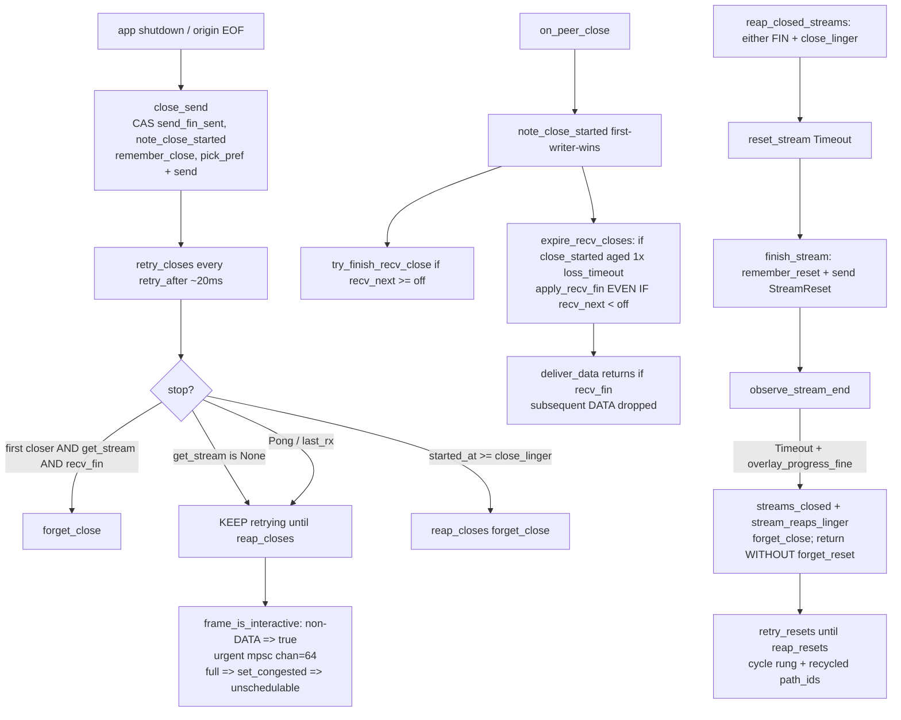
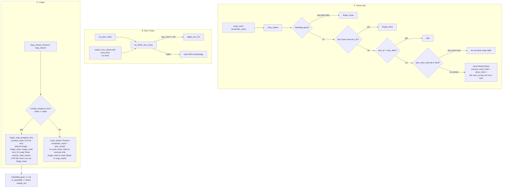
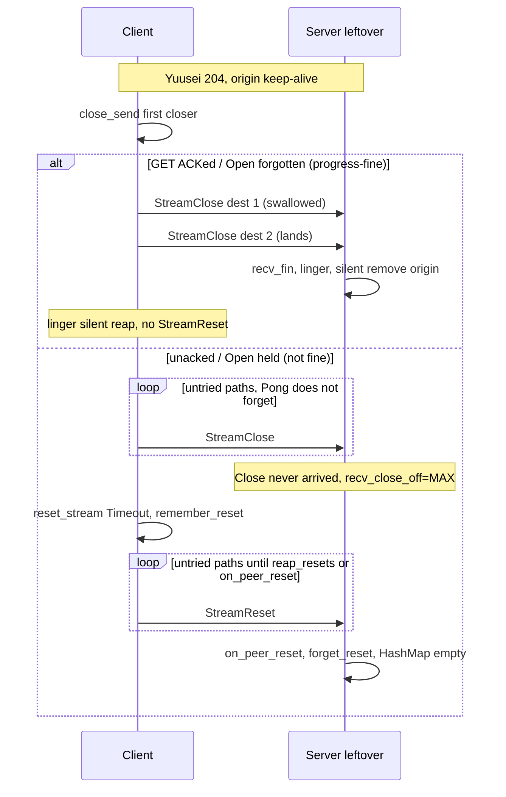

# Close / Reset delivery regression after v0.1.2 (`1997fd1`)

| Field | Value |
| --- | --- |
| **Title** | Close/Reset/linger/expire state-machine fix for the v0.1.2 delivery regression |
| **Author** | nya-link-aggregation maintainers |
| **Date** | 2026-09-08 |
| **Status** | Implemented |
| **Audience** | Senior engineers who already know `nya-core` session / scheduler / health, `nya-client` inbound, `nya-server` outbound, and `nya-e2e` SLA |
| **Predecessor** | `docs/design-live-session-reap-pick-rtt.md` (**Implemented-with-regression** — Close/Reset *delivery* clauses superseded by this doc; pick-hit RTT / P2 test-lock / P3 HOL-chan non-goal stand). Close-retry series: `docs/design-close-retry-silent-pick.md`. Freeze `2c34217` / Release v0.1.0. |
| **Compatibility** | `PROTOCOL_VERSION` **stays 2**. No CloseAck. No new TOML keys. `[session]` stays `deny_unknown_fields` (four keys, `cfg.rs` L130–137). One production `Tuning::STANDARD`. Tests clone-and-mutate. Version stays `0.1.2` in the mechanism PR; release tag is later. |
| **Intended repo path** | `docs/design-close-reset-delivery-regression.md` |

---

## Overview

Release v0.1.2 (`1997fd1`, deployed 2026-09-07 ~10:04Z yuusei / ~10:06Z hytron) did what it was asked: leftover server streams on a live Yuusei session went 81 → 0. It did that by deleting `close_rx_after_send` (Pong on a multiplexed path treated as Close ACK) and giving hygiene `StreamReset` an Open/Close-shaped side table.

Those two changes are still the correct leftover contract. They are **not** a complete Close/Reset/linger/expire state machine. On a healthy 3×2 pool they turned the load-bearing “Close is sent once” stop into a timer-spray of urgent FINs, let Close overtake in-flight DATA and `expire_recv_closes` FIN holes at 1× `loss_timeout` (20 ms floor), and linger-Reset progress-fine half-closes (Hytron origin-EOF while the client is still draining). File downloads interrupt; overlay stall 129 → 305 ms on Yuusei; hop `ConnectionReset` 1.67 → 6.18 / hour on Hytron.

This design fixes the **state machine**, not the clocks. `Tuning::STANDARD`, TOML defaults, `chan`, HOL numeric, `close_linger`, `loss_timeout_floor`, `path_score`, `class_drop_*`, `down_min_silence` stay frozen. `PROTOCOL_VERSION` stays 2. No CloseAck. The Yuusei leftover invariant still holds: server leftover after client `counted_close` + swallowed Close still drains. Drain is Close retry onto untried dests (production 204 is typically progress-fine after the GET is ACKed) **and**, when overlay is **not** fine (`acked < next` / Open held / recv holes), no-progress Timeout Reset with retry. Progress-fine + `!recv_fin` linger is a **silent** HashMap remove — we do **not** expand Reset to every `!recv_fin` linger (that is the Hytron hop-RST). We do **not** restore Pong-as-ACK.

---

## Background & Motivation

### What `1997fd1` shipped (do not reopen)

Commit `1997fd1` (`session: Close retry ignores Pong; Reset rehomes; pick-hit RTT`), current main `832fe17` (Release v0.1.2):

- Deleted `close_rx_after_send` (`mod.rs` used to `forget_close` when `path.last_rx > Close.sent_at`). Multiplexed Pong is not Close delivery. Unit test `close_retry_continues_while_path_pongs` locks this.
- Hygiene `StreamReset` got `Inner.resets` / `remember_reset` / `retry_resets` / `reap_resets` / `retry_reset_from`. `finish_stream` remembers even if `pick_pref` is `None`; `on_peer_reset` `forget_reset`s; `mark_dead` clears `resets` **after** the stream loop.
- Linger accounting unchanged: `overlay_progress_fine` → `stream_reaps_linger` + `streams_closed`, **not** `stream_resets_timeout`. **But linger still `reset_stream(Timeout)`** (`steer.rs` `reap_closed_streams` L359–361 → `finish_stream` L1249–1305).
- Pick-hit RTT (`nya_pick_rtt_us`, `nya_path_picks_total`) and `n_counter == 54` stand. Out of scope here.
- Second closer stays quiet via `observe_stream_end` `forget_close` (not via Pong). Do not resurrect ~50 Close frames per HTTP complete.

Yuusei leftover **goal worked**: server `streams_held` leftover 81 (stalled 36) → 0.

### Production evidence (Signoz, 2026-09-07). Path quality is not the story.

Both instances v0.1.2 after ~10:04–10:06Z. Pre window freeze `2c34217` / 0.1.0. RTT still 7–9 ms, `failbacks=0`, `all_down=0`. `path_down` ~70–110/h similar. Path write-stalled ~450 → ~414 (not the regression).

**Yuusei** (Mihomo generate_204, short streams) — clean A/B:

| signal | 0.1.0 (~24h) | 0.1.2 (~17h) |
| --- | --- | --- |
| stall avg | 129 ms | 305 ms |
| stream lifetime avg | 417 ms | 910 ms (hugs `close_linger=1s`) |
| stall >10s samples | 5 / 24h | 219 / 17h (~62×) |
| server `streams_held` leftover | 81 (stalled 36) | 0 |
| `close_retry` | n/a | 30037 client / 1034 server (~2.05/stream) |
| `reset_retry` | n/a | 809 client / 1380 server |
| `reaps_linger` | n/a | 24 / 28 |

**Hytron** (long-lived / downloads):

| signal | 0.1.0 | 0.1.2 |
| --- | --- | --- |
| stall avg | 2306 ms | 2910 ms |
| HOL / hour | baseline | 1.9–2.2× |
| server `window_blocks` per stream | 0.68 | 1.12 |
| stall >10s / hour | 816 | 1481 (1.8×) |
| hop `ConnectionReset` / hour (server) | 1.67 | 6.18 (3.7×) |
| `close_retry` | n/a | 163151 client (~2.4/stream), bursts to 41/s |
| `reset_retry` | n/a | 47862 client (~15 per linger reap), bursts to 20/s |
| `reaps_linger` | n/a | 3136 / 3071 (**4.7% of streams**) |
| leftover held vs live | balanced | balanced (69=69) |

`close_retry` ~2.05–2.4/stream is **not** “50 Closes on every HTTP”. It is the first-closer half-close population (Hytron 4.7% linger × ~path-count-to-cycle) plus a couple of rehomes on short streams whose `recv_fin` missed the 20 ms floor. The theoretical bound is still `close_linger / loss_timeout_floor` ≈ 50, and `pick_retry_path`’s last rung **cycles** onto an already-tried alive path (`scheduler.rs` L506–511), so a first closer that stays in `Inner.closes` for a full linger *does* spray ~50 urgent FINs. Measured 15 `reset_retry` per linger reap is that cycle plus recycled `path_id`s (`path_down` ~87/h, new ids not in `tried`).

### Current code (main `832fe17` / mechanism `1997fd1`) — line-accurate



Relevant sites (current main):

| Site | Behavior today |
| --- | --- |
| `frame_is_interactive` (`mod.rs` L1157–1162) | `StreamData` ≤ `interactive_max` **or any non-DATA** → urgent. Close and Reset jump bulk DATA. |
| `send_on_path` (`mod.rs` L1171–1208) | Urgent full → `set_congested(true)` + `frame_send_drop`. `is_schedulable` = UP && !congested && !write_stalled. |
| `close_send` (`streams.rs` L304–334) | CAS `send_fin_sent`; `note_close_started`; `remember_close` (even if enqueue fails, with one `pick_retry`); `maybe_count_graceful`. |
| `retry_closes` (`mod.rs` L745–801) | `reap_closes` first. First closer (`!second`): `forget_close` only if `get_stream` **and** `recv_fin`. **`get_stream` None does not forget** — retry continues until linger. No Pong stop. Always `pick_retry_tried` (includes cycle rung). |
| `reap_closes` (`mod.rs` L729–743) | `started_at.elapsed() >= close_linger`; no `streams` lookup. |
| `on_peer_close` (`streams.rs` L509–521) | `note_close_started`; CAS `recv_close_off`; `try_finish_recv_close`. |
| `try_finish_recv_close` (`streams.rs` L531–540) | FIN only if `recv_next >= off`. Correct. |
| `expire_recv_closes` (`streams.rs` L542–565) | If `recv_close_off != MAX` and `!recv_fin` and `close_started_ms` aged `loss_timeout(min_known_rtt)` (~20 ms) → `apply_recv_fin` **even if `recv_next < off`**. |
| `deliver_data` (`streams.rs` L398–418) | Returns if `reset \|\| recv_fin`. Post-expire DATA is dropped. |
| `apply_recv_fin` (`streams.rs` L523–529) | CAS `recv_fin`; `Inbound::Close`; `forget_close`; `maybe_count_graceful`. |
| `StreamState::note_close_started` (`stream.rs` L107–112) | CAS `close_started_ms` 0→now. **First writer wins** (local `close_send` **or** `on_peer_close`). |
| `reap_closed_streams` (`steer.rs` L334–362) | `counted_close \|\| reset` → `remove_held_stream`. Else either FIN and `close_started` aged `close_linger` → **`reset_stream(Timeout)`**. No `overlay_progress_fine` gate on the *send*. |
| `reap_stream` (`streams.rs` L354–367) | Pump join: counted → remove; both FIN → graceful; else `finish_stream(Timeout, send_frame=true)`. |
| `overlay_progress_fine` (`mod.rs` L960–975) | `acked >= next` then (`recv_fin` **or** (`send_fin` and Open not held)). Does **not** look at recv holes (`recv_next < recv_close_off`). |
| `finish_stream` (`mod.rs` L1249–1306) | `reset.swap`; `Inbound::Reset`; if `send_frame && !dead` → `remember_reset` + send; `counted_close` CAS → `observe_stream_end`; `remove_held_stream`. |
| `observe_stream_end` (`mod.rs` L1308–1366) | Timeout + `overlay_progress_fine` → linger counters, `forget_close`, **`return` without `forget_reset`**. Every other counted end `forget_close` at the bottom. Never `forget_reset` except via `on_peer_reset` / `finish_stream(send_frame=false)` / `reap_resets`. |
| `remove_held_stream` (`mod.rs` L1084–1091) | HashMap remove, unstick, `release_unacked`, `forget_open`. **Not** `forget_close` / `forget_reset`. |
| `retry_resets` (`mod.rs` L885–924) | No streams lookup. No “HashMap gone” stop. Cycle rung. `reap_resets` at `started_at >= close_linger`. |
| `maybe_hol` / `scan_stall` (`steer.rs` L396+, L525+) | Walk `is_steerable()` = `!reset && !counted_close`. Linger half-closes stay steerable until `reset_stream` flips both. |
| `pick_retry_path` last rung (`scheduler.rs` L506–511) | `is_alive() && id != current` — **already-tried paths are eligible**. DATA needs this so a copy does not stall after FIFO cap 8. Close/Reset inherit it. |

`maintain` order (`steer.rs` L203–243): `reap_closed_streams` → HOL/stall/speculative → `retry_opens` → `retry_closes` → `retry_resets` → `expire_early_data` → `expire_recv_closes`.

### Five interacting bugs (verify; do not paper over)

**1. Close retry storms on live TCPs.** After deleting Pong-as-ACK, first closer rehomes every `retry_after` (~20 ms floor) onto another path until `recv_fin` or linger. Close is urgent. A 6-path pool with the cycle rung fills `chan=64` urgent → `set_congested` → path unschedulable → DATA/ACK delay → stall 129→305 ms, new >10 s tail, Hytron `window_blocks` 0.68→1.12 and HOL 1.9–2.2×. Typical HTTP second closer is already quiet (`observe_stream_end` forget). The spray is **first closer** (server origin-EOF on a download; client 204 drop) and the HashMap-gone hole: if `get_stream` is None, `retry_closes` does **not** `forget_close`.

**2. Close overtaking in-flight DATA + `expire_recv_closes` at 1× `loss_timeout`.** Close retried onto a sister TCP can beat remaining DATA (independent writer halves; Close is urgent, bulk DATA is not). `expire_recv_closes` then applies `recv_fin` after 20 ms even if `recv_next < final_offset`. `close_started_ms` is first-writer-wins, so a GET `close_send` can make expire fire **immediately** when peer Close arrives with holes. `deliver_data` drops subsequent DATA. Truncated downloads.

**3. Linger Timeout still sends `StreamReset`.** `reap_closed_streams` → `reset_stream(Timeout)` after 1 s of either FIN. `overlay_progress_fine` only changes *accounting* (linger vs product timeout); `finish_stream` still `remember_reset` + send Reset + `Inbound::Reset`. A download whose origin EOFed (server `send_fin`, `acked == next`) while the client is still draining is Reset after 1 s → hop `ConnectionReset` (`hop.rs` copy_err, `nya-server` `outbound.rs` `copy_bidirectional`). 4.7% of Hytron streams. Yuusei lifetime hugging 1 s is the same half-close sitting in linger.

**4. Reset table not forgotten on the linger path.** `observe_stream_end` linger branch `forget_close` then `return` without `forget_reset`. Reset retries another linger. `pick_retry_path` cycles tried ids; `path_down` recycles ids → ~15 `reset_retry` per linger reap, more urgent RST on live download TCPs.

**5. `retry_closes` if the stream is already gone.** First-closer stop is `get_stream` then `recv_fin`. HashMap gone ⇒ `get_stream` is None ⇒ retry until linger. `observe_stream_end` *should* have `forget_close` on every counted end (L1345 linger and L1364 others) — verify every site, keep them, **and** stop in `retry_closes` when HashMap is gone so a snapshot-vs-remove race cannot emit until linger. Second closer already forgets via `observe_stream_end`. Do not restore ~50 Close frames per HTTP complete.

A fix that only stops Close retry on HashMap-missing but still linger-Resets in-flight half-close, or still expire-FINs holes at 20 ms, is **not thorough**.

### Exhaustive Close/Reset/linger/expire/pump-end/HOL interaction matrix

| Event | HashMap | `Inner.closes` | `Inner.resets` | Wire | Pump | HOL / stall | Product counter |
| --- | --- | --- | --- | --- | --- | --- | --- |
| Typical HTTP both-FIN | `maybe_count_graceful` removes | `observe_stream_end(None)` forgets | empty | Close once per direction | `Inbound::Close` | leave (`counted_close`) | `streams_closed` |
| First closer, Close in flight, no `recv_fin` | stays (steerable) | retry | empty | Close rehome | send half done | **enters `maybe_hol`** | `close_retry` |
| First closer, `recv_fin` | maybe graceful | forget | empty | stop Close | both halves | leave | `streams_closed` |
| HashMap gone, Close table still held (**bug 5**) | gone | **retry until linger** | — | extra urgent Close | n/a | n/a | `close_retry` |
| Peer Close with holes | stays | n/a | n/a | — | no `Inbound::Close` yet | stall if recv hole | — |
| `expire_recv_closes` 20 ms with holes (**bug 2**) | stays until graceful | `apply_recv_fin` forgets Close | — | — | `Inbound::Close` **early** | leave or linger | truncated download |
| `try_finish_recv_close` `recv_next >= off` | maybe graceful | forget | empty | — | `Inbound::Close` | leave | `streams_closed` |
| Linger, `overlay_progress_fine` (**bug 3+4**) | `reset_stream` removes | forget in linger branch | **remember + retry** | **StreamReset** | `Inbound::Reset` | leave | `stream_reaps_linger` (not timeout) |
| Linger, **not** `overlay_progress_fine` (Yuusei leftover) | `reset_stream` removes | forget | remember + retry | StreamReset | `Inbound::Reset` | leave | `stream_resets_timeout` |
| Pump join, not both FIN (`reap_stream`) | `finish_stream` Timeout | forget | remember | StreamReset | already joined | leave | timeout or linger |
| In-flight, no FIN, no Reset | stays | empty | empty | — | copy | HOL/stall observational | must **not** GC |
| `on_peer_reset` | `finish_stream(send_frame=false)` | forget | forget | none | `Inbound::Reset` | leave | reason-based |
| `path_failed` | stays | `retry_close_from` (same Close stop set as `retry_closes`, then untried rehome) | `retry_reset_from` | rehome if table still held | — | — | `close_retry` / `reset_retry` |
| `path_failed` after silent linger | already gone | **no-op** (`observe_stream_end` already `forget_close`; stop set also HashMap-gone) | empty (never `remember_reset`) | none | — | — | — |
| `mark_dead` | Reset all | `closes.clear()` **before** loop | `resets.clear()` **after** loop | SessionClose + Reset | Reset | — | `session_dead` |
| Recycled `path_id` during Reset retry (**bug 4**) | already gone | empty | new id not in `tried` | more RST | n/a | urgent fill | `reset_retry` ~15/reap |

---

## Goals & Non-Goals

### Goals

1. **Close retry stop set (no Pong-as-ACK).** First closer stops on `recv_fin`. **Both roles stop when the stream is gone from HashMap.** Same stop set on `retry_closes` **and** `retry_close_from` (`path_failed` is not ordered relative to linger). `reap_closes` still bounds the table at `started_at >= close_linger`. Second closer stays quiet via existing `observe_stream_end` forget. `close_retry_continues_while_path_pongs` stays green.
2. **Close/Reset timer-rehome does not cycle tried live paths.** DATA keeps the last rung of `pick_retry_path` (must not stall a copy). Close and Reset skip an `alt` already in `tried`. `push_tried` FIFO-8 is **unchanged** (DATA). With N≤8 (production 3×2 is 6) no-cycle ≡ each live dest at most once per linger; with N>8 eviction can re-allow an old dest (accepted, not production). Cap vs linger: first closer **without** `recv_fin` on a 6-path pool, `close_retry <= 6`, not ~50. New `path_id`s after recycle remain eligible; `path_failed` still immediate-rehomes.
3. **Linger + `overlay_progress_fine`: do not send `StreamReset`, do not `remember_reset`.** Product accounting stays linger (`stream_reaps_linger` + `streams_closed`, not `stream_resets_timeout`). Local HashMap remove is enough when overlay is making progress — including progress-fine + `!recv_fin` (production Yuusei 204 after GET ACK). Real no-progress Timeout still sends Reset with retry (unacked / Open held / recv holes). Do **not** expand Reset to all `!recv_fin` linger (Hytron origin-EOF hop-RST). Leftover drain for the progress-fine closer is Close landing on an untried dest (`leftover_drains_via_close_retry_when_progress_fine`).
4. **`expire_recv_closes` must not apply `recv_fin` while `recv_next < final_offset`.** Holes wait for DATA retry/hedge. No new millisecond constant. Do not expire holes at all in `expire_recv_closes`; `try_finish_recv_close` already FINs when `recv_next >= off`; no-progress linger Reset is the bound if DATA never comes. Yuusei leftovers are Close never arrived (`recv_close_off == MAX`) so expire is already a no-op.
5. **`overlay_progress_fine` is false while recv holes remain** (`recv_close_off != MAX && recv_next < off`). Progress is not fine if we know a final offset we have not reached. Mechanism predicate, not a clock.
6. **`observe_stream_end` linger path `forget_reset` (CAS-winner only).** If we no longer send Reset for progress-fine linger, the table must not retry. No-progress Timeout keeps retry until peer Reset or `reap_resets` (`started_at >= close_linger`). Do **not** `forget_reset` merely because HashMap is gone, and do **not** `forget_reset` after a lost `counted_close` CAS — leftover Reset must still be delivered.
7. **HOL.** Progress-fine linger streams leave the HashMap via `remove_held_stream` (same as today, without Reset) so they stop `is_steerable` / `maybe_hol` / `scan_stall`. Specify the remove path below.
8. **In-flight copies with no FIN and no Reset are not GC’d.** Hytron origin-idle / long-lived.
9. **Merge-gate unit tests** that would have been RED on `1997fd1` and GREEN after this fix (list below). `n_counter` stays 54. Prefer no new catalog name; reuse `stream_reaps_linger` for HashMap remove without Reset.
10. **e2e.** `cargo test -p nya-e2e` `short_matrix` green. Mixed soak must not introduce new SLA reds / chatter / all-down.

### Non-Goals

- Restoring `close_rx_after_send` / Pong-as-Close-ACK.
- CloseAck, new `ResetReason`, `PROTOCOL_VERSION` bump.
- New TOML keys. `[session]` stays four keys, `deny_unknown_fields`.
- Any numeric change to `Tuning::STANDARD` (`close_linger`, `loss_timeout_*`, `chan`, HOL slack, `down_min_silence`, `class_drop_*`, `path_score`, `interactive_max`).
- Growing `chan`. Retuning HOL.
- Idle-timeout of streams with **neither** FIN (would GC Hytron origin-idle).
- Changing `maybe_failback` (already removed from `maintain`).
- Pick-hit RTT / `nya_path_picks_total` / `n_counter` 54.
- Version bump off `0.1.2` in the mechanism PR.
- Using stall **mean** as a product gate.
- Fitting GZ–HK soak by twisting numbers.

---

## Key Decisions

1. **Do not restore Pong-as-ACK.** `close_rx_after_send` stays deleted. `close_retry_continues_while_path_pongs` stays. Multiplexed `last_rx` is still not Close delivery. Leftover Close delivery is retry until `recv_fin` / HashMap-gone / linger, then no-progress Reset retry.

2. **Close forget set after this change (exhaustive).** Keep: `reap_closes`; first-closer `recv_fin` in `retry_closes`; `apply_recv_fin`; `observe_stream_end` on every counted end; `mark_dead` `closes.clear()`. **Add:** `retry_closes` **and** `retry_close_from` when `get_stream` is None (both roles) or first closer `recv_fin`. **Still not a forget site:** `remove_held_stream`. **Still deleted:** `close_rx_after_send`.

3. **Close/Reset do not take `pick_retry_path`’s cycle rung.** DATA still does (`retry_expired_unacked`). After every live path is in `tried`, Close/Reset timer-rehome is a no-op (table stays for `path_failed` of a new id and for `reap_*` at linger). This is “when we retry”, not a new millisecond. `push_tried` FIFO-8 is unchanged — do **not** raise the cap to “fix” Close. Production N=6 never evicts; N>8 (`max_paths` default 32) can rehome an evicted id (accepted). Caps `close_retry` at ~path count for a first closer that lives a full linger on a 3×2 pool, which is what production 2.05–2.4/stream already looks like *until* FIFO cycle + recycle turn it into 50 / 15.

4. **Progress-fine linger is a local reap, not a wire Reset.** `reap_closed_streams` / `reap_stream` call a new `linger_reap_progress_fine` when `overlay_progress_fine`; otherwise `reset_stream(Timeout)` as today. No `remember_reset`. Product counters still go through `observe_stream_end(Some(Timeout))` so `stream_reaps_linger` is reused. Pump is unblocked with the same `recv_fin.swap` CAS as `apply_recv_fin` (`if !recv_fin.swap(true) { try_send(Inbound::Close) }`), not `Inbound::Reset`. Hytron origin-EOF + client still draining: Close has been retried for up to 1 s; HashMap remove is enough; hop `ConnectionReset` stops. **`forget_reset` only on the `counted_close` CAS-winner silent path** (inside `observe_stream_end` linger, which only runs if this helper won the CAS). A belt `forget_reset` *after* a lost CAS would delete a concurrent no-progress `Inner.resets` — the Yuusei miss.

5. **No-progress linger still Resets and retries. Progress-fine + `!recv_fin` does not.** Unacked / Open-held leftover: `overlay_progress_fine` is false → `reset_stream` + `Inner.resets` + `retry_resets` (no cycle) + `reap_resets`. `server_leftover_close_swallowed_reset_retried` stays green. Production Yuusei 204 (GET ACKed, `send_fin`, Open forgotten, `recv_close_off == MAX`) is progress-fine: drain is Close retry landing on another dest, locked by `leftover_drains_via_close_retry_when_progress_fine`. Residual D (Close missed every untried dest, silent reap, leftover sits) stays documented — soak-followup only; **do not** send Reset for all `!recv_fin` linger in this PR. Do not `forget_reset` just because HashMap is gone.

6. **`expire_recv_closes` never FINs holes.** The function becomes “`try_finish_recv_close` for every stream” — a no-op unless `recv_next >= off`. Keep the `maintain` call (`steer.rs` L243) as a belt if a future path advances `recv_next` without `drain_recv`. `close_started_ms` first-writer-wins **stops being an expire clock**; it remains the linger clock (frozen 1 s). Using `close_linger` as a hole-wait in expire would retune a different clock’s *role* — rejected. DATA retry/hedge already uses `loss_timeout`. If DATA never comes, linger (no-progress Reset, because holes make `overlay_progress_fine` false) is the bound.

7. **`overlay_progress_fine` grows one recv-hole clause.** `recv_close_off != MAX && recv_next < off` → false. Silent-remove must not drop a stream that still owes the app `final_offset - recv_next` bytes. Yuusei leftover: `recv_close_off == MAX`, clause skipped.

8. **`observe_stream_end` linger branch also `forget_reset` — and that is the only silent-path `forget_reset`.** It runs only if `linger_reap_progress_fine` won `counted_close`. No-progress Timeout takes the `Some(reason)` branch and does **not** `forget_reset` (delivery continues). Do **not** `forget_reset` after a lost CAS.

9. **No new catalog name.** `n_counter` stays 54. Silent linger remove reuses `nya_stream_reaps_linger_total`. A split “linger-without-Reset vs linger-Reset” would be catalog noise: the wire difference is “was `reset_retry` / hop RST”. Watch `stream_reaps_linger` vs `reset_retry` vs hop `ConnectionReset`.

10. **Clocks, proto, TOML, `chan`, HOL numeric stay frozen.** One `Tuning::STANDARD`. Tests clone-and-mutate `close_linger` only, as today. Do **not** use `pair_echo` (it sets `loss_timeout_floor = 150 ms`) for 20 ms-floor Close-retry gates.

11. **One mechanism PR.** This is one state machine. Docs ride in the same PR (ARCHITECTURE stream-control paragraph + OBSERVABILITY linger semantics + predecessor pointer). Version stays 0.1.2.

12. **`push_tried` only on successful send for Close and Reset retry.** Current `retry_closes` (`mod.rs` L796–798) and `retry_resets` (L919–921) on failed `send_on_path` still `sent_at = now; push_tried(alt)`. Combined with no-cycle, a full urgent queue (the production failure mode) burns every dest and then never timer-rehomes; progress-fine linger then silent-reaps with Close never landed. **On fail: update `sent_at` only (rate-limit); leave `alt` out of `tried`.** Same gate as `close_retry++` / `reset_retry++`. Same rule for `retry_close_from` / `retry_reset_from` (`retry_close_from` already has no fail-`else` — keep it that way). Do **not** change `push_tried`’s FIFO-8 (DATA still needs it). `remember_close` / `remember_reset` on the *first* send still record the dest that was attempted (existing first-send path); retry is the hole.

---

## Proposed Design



### A. Close retry stop set + no cycle

`retry_closes` (`mod.rs` L745–801) after this change:

```text
reap_closes()                         # keep; started_at >= close_linger; no streams lookup
snapshot Inner.closes
for each id:
  match get_stream(id) {
    None => { forget_close(id); continue; }          # NEW both roles
    Some(st) if !second && st.recv_fin => { forget_close(id); continue; }  # keep
    Some(_) => {}
  }
  if sent_at.elapsed() < retry_after(from) { continue; }
  let Some(alt) = pick_retry_untried(&tried) else { continue; }
  if send_on_path(alt, StreamClose) {
      push_tried(alt); sent_at = now; close_retry++   # KD 12: success only
  } else {
      sent_at = now;                                  # rate-limit; alt stays eligible
  }
```

`retry_close_from` (`path_failed`, `mod.rs` L803–835) gets the **same stop set** before send, then immediate rehome (no `retry_after`). Today’s snap is only `(id, tried, final_offset)` — **extend it with `second_closer`**, matching `retry_closes` (`mod.rs` L747–761). Defaulting `second = false` would treat a true second closer as first closer on `path_failed` (usually already forgotten; still the wrong predicate).

```text
snapshot (id, tried, final_offset, second_closer)   # NEW: include second_closer
for each:
  match get_stream(id) {
    None => { forget_close(id); continue; }           # NEW
    Some(st) if !second_closer && st.recv_fin => { forget_close(id); continue; }  # NEW
    Some(_) => {}
  }
  let Some(alt) = pick_retry_untried(&tried) else { continue; }
  if send_on_path(...) { push_tried; sent_at = now; close_retry++ }
  # no fail-else today — keep it that way (do not push_tried on fail)
```

Immediate rehome onto an **untried** live dest still happens; cycling back onto a just-died sibling’s replacement is a *new* id and is eligible. After silent linger, `path_failed` is a **no-op** because `observe_stream_end` already `forget_close`d — not because HashMap-gone is skipped.

Do **not** add a `last_rx > sent_at` stop. Do **not** skip rehome merely because the from-path is `is_loss_fresh` — that is Pong-as-ACK by another name, and it would fail `close_retry_continues_while_path_pongs` if the test’s two dests never rehomed.

**FIFO-8.** `push_tried` (`mod.rs` L577–586) still evicts oldest at `len == 8`. `pick_retry_untried` only sees the last 8 ids. Production 3×2 (N=6): cap never evicts; after all dests tried the cycle rung is the only pick and the helper returns None. `max_paths` default 32: N>8 can re-allow an evicted dest. Accepted; not production. Do not raise the cap. The 6-path unit is the production bound.

Helper (one function, used by Close **and** Reset retry, not by DATA):

```rust
fn pick_retry_untried(&self, tried: &[u32]) -> Option<u32> {
    let alt = self.pick_retry_tried(tried)?;
    if tried.contains(&alt) {
        None
    } else {
        Some(alt)
    }
}
```

Do **not** change `pick_retry_path` itself — DATA (`retry_expired_unacked`, `rehome_unacked_from`) must keep the cycle rung.

**Why HashMap-gone is safe for leftover Close.** `observe_stream_end` already `forget_close`s on every counted end. HashMap-gone in `retry_closes` is belt-and-suspenders against (i) `remove_held_stream` without observe (today only `reap_closed_streams` drop_ids of already-counted/reset), (ii) snapshot-then-remove race that would otherwise send until linger. After progress-fine silent reap, HashMap is gone on the same `maintain` tick *before* `retry_closes` (`steer.rs` L203 then L240), so Close spray stops the moment linger reaps.

**Why we still retry Close on a Ponging path for first closer without `recv_fin`.** Write half swallowed, read half Pongs — Pong must not forget the table. Two leftover shapes (do **not** collapse them):

- **No-progress** (`acked < next` / Open held / recv holes): Close retry onto untried dests until linger, **then** Reset until `reap_resets` (~2× `close_linger` from client FIN). Locked by `server_leftover_close_swallowed_reset_retried`.
- **Progress-fine 204** (GET ACKed, `send_fin`, Open forgotten, `recv_close_off == MAX`, `!recv_fin`): Close retry onto untried dests until linger / HashMap-gone, **then silent reap — no Reset**. Drain is dest-2 Close landing (`leftover_drains_via_close_retry_when_progress_fine`). Residual D if every dest missed. Adding Reset after this linger undoes the Hytron hop-RST fix.

### B. `expire_recv_closes` — holes are not a 20 ms FIN

```543:565:crates/nya-core/src/session/streams.rs
    pub(super) fn expire_recv_closes(&self) {
        let wait = health::loss_timeout(&self.inner.cfg, self.min_known_rtt());
        // ...
            if start != 0 && now.saturating_sub(start) >= wait_ms {
                self.apply_recv_fin(&st);
            }
```

Replace the body with:

```rust
pub(super) fn expire_recv_closes(&self) {
    let sts: Vec<Arc<StreamState>> = self
        .inner
        .streams
        .lock()
        .unwrap()
        .values()
        .cloned()
        .collect();
    for st in sts {
        self.try_finish_recv_close(&st);
    }
}
```

`try_finish_recv_close` already returns if `off == MAX || recv_fin || recv_next < off`. Expire no longer has a clock. Comment today (“Peer Close beat in-flight DATA. Wait one loss_timeout, then FIN anyway.”) is the bug; replace with: **belt; FIN only when `recv_next >= off`. Not a clock.** Keep the `maintain` call (`steer.rs` L243). `drain_recv` (L445) and `on_peer_close` (L520) already call `try_finish_recv_close`; the sweep is for hole-fill that raced with Close or a future path that advances `recv_next` without `drain_recv`. Do not delete it as dead. Holes wait for DATA retry; no-progress linger is the bound.

**Why this does not leave Yuusei leftovers.** Leftover is Close never arrived. `recv_close_off` stays `u64::MAX` (`stream.rs` L85). Both `try_finish_recv_close` and today’s expire skip `off == MAX`. Expire is a no-op on leftovers either way. Leftover drain is Close retry + no-progress Reset, not recv-FIN.

**`close_started_ms` first-writer-wins** remains the linger clock. A GET `close_send` then peer Close with holes no longer FINs at 0 ms. Linger still counts from the GET FIN (frozen 1 s). If holes remain at linger, the new hole clause of `overlay_progress_fine` is false → no-progress Reset (DATA had up to 1 s of retry/hedge). Acceptable vs 20 ms truncate. Do not add a second timestamp.

### C. `overlay_progress_fine` — holes are not fine

```rust
fn overlay_progress_fine(&self, st: &StreamState) -> bool {
    let acked = st.send_acked.load(Ordering::Relaxed);
    let next = st.send_next.load(Ordering::Relaxed);
    if acked < next {
        return false; // unacked DATA
    }
    let off = st.recv_close_off.load(Ordering::Relaxed);
    if off != u64::MAX && st.recv_next.load(Ordering::Relaxed) < off {
        return false; // known Close offset not reached
    }
    if st.recv_fin.load(Ordering::Relaxed) {
        return true;
    }
    if !st.send_fin_sent.load(Ordering::Relaxed) {
        return false;
    }
    !self.inner.opens.lock().unwrap().contains_key(&st.id)
}
```

| Shape | Fine? | Linger action |
| --- | --- | --- |
| Hytron server: origin EOF, `send_fin`, `acked == next`, client still draining, `recv_close_off == MAX` | **yes** (`send_fin`, Open forgotten) | silent HashMap remove, no Reset |
| Hytron client: peer Close with holes | **no** (hole clause) | wait; at linger Reset (DATA never came) |
| Same, holes filled | `try_finish` → `recv_fin` → graceful if both FIN | not in linger list |
| Yuusei leftover server: Close never arrived, unacked toward gone client | **no** (`acked < next`) | Reset + retry |
| Yuusei **client** 204: GET ACKed, `send_fin`, Open forgotten, `recv_close_off == MAX`, `!recv_fin` | **yes** | silent HashMap remove, **no** Reset; drain is Close retry onto dest 2 (`leftover_drains_via_close_retry_when_progress_fine`) |
| Yuusei leftover server: Close landed, origin keep-alive, `recv_fin`, no unacked | **yes** (`recv_fin`) | silent remove (client already gone) |
| Open never ACKed, `send_next == 0` | **no** (opens held) | Timeout Reset (existing unit) |
| Neither FIN | n/a | not linger-eligible |

### D. Linger: silent remove vs Reset

`reap_closed_streams` (`steer.rs` L334–362):

```text
counted_close || reset  → remove_held_stream          # keep
neither FIN             → continue                    # keep (in-flight / origin-idle)
either FIN, close_started aged close_linger:
    if overlay_progress_fine(st) → linger_reap_progress_fine(id)
    else                         → reset_stream(id, Timeout)   # remember_reset + retry
```

New `linger_reap_progress_fine` (session, next to `finish_stream`). `reap_closed_streams` (maintain) and `reap_stream` (pump-join, `streams.rs` L168–169) can run the same id concurrently — **`forget_reset` must not sit outside the CAS**:

```text
st = get_stream(id) or return
if !overlay_progress_fine(st) { reset_stream(id, Timeout); return }  # raced to unacked/Open/holes
if counted_close CAS fails:
    return  # concurrent reset_stream / graceful owns the end; do NOT touch Inner.resets
if !overlay_progress_fine(st):          # re-check after CAS
    # We own counted_close. reset_stream / finish_stream would skip observe
    # (CAS already won). Observe first so Timeout counters run; linger branch
    # is not taken (!fine ⇒ no forget_reset). Then the full first_reset body:
    observe_stream_end(st, Some(Timeout))  # stream_resets_timeout, forget_close, NO forget_reset
    finish_stream(id, Some(Timeout), true) # Inbound::Reset, notify, remember even if
                                           # pick_pref None, enqueue-fail pick_retry
    return                                 # finish_stream already remove_held_stream
# Do not re-sketch remember_reset + send here — that drops notify / local Reset /
# path_id=0 remember / enqueue-fail pick_retry and drifts vs finish_stream.
observe_stream_end(st, Some(Timeout))   # fine → linger counters, forget_close, forget_reset
# Unblock pump with the same CAS as apply_recv_fin (streams.rs L523–526).
# Do not call apply_recv_fin itself (it maybe_count_graceful / forget_close on a path
# that already counted linger). Do not try_send(Close) if recv_fin was already true —
# rely on the existing Close or on inbound_tx drop after remove_held_stream
# (pump `Reset | None => break` skips w.shutdown(); that is pre-existing if the
# earlier Close try_send failed because the channel was full).
if !st.recv_fin.swap(true, SeqCst) {
    inbound_tx.try_send(Inbound::Close)  # NOT Inbound::Reset; NOT wire Close/Reset
}
remove_held_stream(id)
```

Do **not** call `finish_stream` / `reset_stream` on the still-fine path. That is what sends Reset. Do **not** `forget_reset` after a lost CAS — that deletes a concurrent no-progress Reset table (Yuusei miss).

`observe_stream_end` linger branch (`mod.rs` L1335–1346): add `forget_reset(st.id)` next to `forget_close`. Still `return` before the generic `forget_close` at L1364. This is the **only** silent-path `forget_reset`; it runs only if this helper won `counted_close` and is still progress-fine.

`reap_stream` (pump join, `streams.rs` L354–367):

```text
counted_close → remove_held_stream
both FIN      → maybe_count_graceful
overlay_progress_fine → linger_reap_progress_fine
else          → finish_stream(Timeout, send_frame=true)
```

**HOL remove path.** `is_steerable` is `!reset && !counted_close` (`stream.rs` L103–105). Silent reap CASes `counted_close` then `remove_held_stream`. Next `maintain` does not include the id in the steerable snapshot (`steer.rs` L204–211). They stop entering `maybe_hol` / `scan_stall` / `maybe_speculative`. During the 1 s *before* linger they still HOL — that is existing half-close behaviour and is **not** this regression (HOL 1.9× is urgent congestion from Close/Reset spray + expire truncate, not leftover occupancy). Do not retune HOL.

**Pump.** Server origin-EOF: send pump already `close_send`; recv pump waits for client Close. Local `Inbound::Close` (only if this path flipped `recv_fin`) completes `copy_bidirectional` without RST. Client still draining: they have (or will have) our Close from up to 1 s of retry; our HashMap is gone; their later Close hits `on_peer_close` → `get_stream` None → no-op. Graceful.

**Client write-half-close (pre-existing, now silent).** `close_started_ms` first-writer-wins remains the linger clock. A SOCKS client that half-closes write after GET (`close_send`, `send_fin`, GET ACKed, Open forgotten, `recv_close_off == MAX`) is `overlay_progress_fine` **while the server is still sending the body**. After 1 s, silent reap local-EOFs the recv pump and drops the HashMap **without** Reset. Today this already aborts at 1 s via `reset_stream`. Not a new truncate vs `1997fd1`, and **not** Hytron hop-RST (that is server origin-EOF). HTTP/1.1 keepalive usually does not half-close; HTTP/1.0 / some curl paths do. Out of scope to add a second timestamp (LOOP-POLICY).

**Residual D (documented, not a retune; product choice for this PR):** if Close never landed **and** the closer is `overlay_progress_fine` (GET ACKed, `send_fin`, no `recv_fin`), silent reap sends no Reset. Leftover then depends on the 1 s of Close retry having hit at least one of ~N untried paths (KD 12: enqueue-fail does **not** burn dests). Production leftover went 81 → 0 with Close retry actually running; the Reset belt was what killed Hytron drains. Merge-gate: `leftover_drains_via_close_retry_when_progress_fine` (Close swallowed on dest 1, delivered on dest 2, no Reset). If a post-fix soak shows leftover climbing again on 204s *and* `close_retry` per first-closer stream is 0, that is this residual — then, as soak-followup, send Reset for `!recv_fin` after linger even if send-side looks fine. **Do not** take that expansion in this PR.

### E. Reset retry after the linger split

`retry_resets` / `retry_reset_from`: use `pick_retry_untried` (no cycle). Keep:

- No HashMap lookup (table outlives the stream — leftover delivery). Do **not** add a HashMap-gone `forget_reset`.
- `reap_resets` at `started_at >= close_linger`.
- `forget_reset` from `on_peer_reset`, `finish_stream(send_frame=false)`, `mark_dead` after the stream loop, **and** `observe_stream_end` linger (CAS-winner silent path only).
- **KD 12:** `push_tried` only on successful send. On fail, `sent_at = now` only (`retry_resets` L919–921 today burns `alt`; stop that). `retry_reset_from` already has no fail-`else` — keep it.

Progress-fine linger never `remember_reset`s, so `retry_resets` is quiet on Hytron 4.7%. No-progress leftover still rehomes across untried dests, including a later `path_added` (`path_id == 0` in `retry_reset_from`). `reset_retry` counts successful rehomes only, as today.

`mark_dead` order unchanged: `closes.clear()` before the `finish_stream` loop; `resets.clear()` after; skip `remember_reset` when `dead`.

### F. Interaction with DATA retry, window, stall, hop RST

- **DATA retry** (`retry_expired_unacked`) unchanged, including cycle rung. Holes after Close overtake fill via existing unacked retry / hedge at `loss_timeout`. That is the hole-wait clock — already there, not a new constant.
- **Window.** Urgent Close/Reset fill was delaying ACKs (`window_blocks` 0.68→1.12). No-cycle Close + no progress-fine Reset removes that load. Do not grow `chan`.
- **Stall.** Expire-FIN holes marked recv-hole stall then dropped DATA (stall >10 s 62× on Yuusei). After B, holes stay holes until DATA or linger. Stall CDF 20–50 ms bucket (DATA retry) should remain; right tail of truncated downloads should collapse. Stall **mean** is not a gate.
- **Hop `ConnectionReset`.** `finish_stream` `Inbound::Reset` → `copy_bidirectional` error → `hop.rs` `copy_err=ConnectionReset`. Silent linger does not take that path. Server leftover no-progress Reset still can; volume is leftover, not 4.7% of downloads.

```mermaid
sequenceDiagram
  participant O as Origin
  participant S as Server streams
  participant C as Client streams
  Note over O,S: Hytron download, origin EOF
  O->>S: last DATA + copy Ok(0)
  S->>S: close_send / remember_close
  loop untried paths only, until recv_fin or linger
    S->>C: StreamClose (urgent)
  end
  C->>C: recv_close_off set; holes wait DATA retry
  C->>C: try_finish_recv_close when recv_next >= off
  Note over S: close_linger, overlay_progress_fine
  S->>S: linger_reap_progress_fine<br/>no StreamReset, HashMap remove
  C->>C: app drain, then close_send (second closer forgets)
  Note over S,C: on_peer_close get_stream None = no-op
```



---

## API / Interface Changes

Public crate API (`Session::open_stream`, SOCKS, `IncomingStream::reset`) unchanged. Wire unchanged.

| Item | Change |
| --- | --- |
| `retry_closes` | HashMap-gone / first-closer `recv_fin` → `forget_close`; `pick_retry_untried`; `push_tried` on success only |
| `retry_close_from` | **same stop set** as `retry_closes` then untried immediate rehome; snap **includes `second_closer`** (today’s snap does not); no fail-`push_tried` |
| `retry_resets` / `retry_reset_from` | refuse cycle rung; `push_tried` on success only; still no HashMap-gone forget |
| `pick_retry_path` | **unchanged** (DATA cycle rung stays) |
| `Session::pick_retry_untried` | new private helper |
| `expire_recv_closes` | only `try_finish_recv_close`; no `loss_timeout` FIN |
| `overlay_progress_fine` | hole clause |
| `reap_closed_streams` / `reap_stream` | branch on `overlay_progress_fine` |
| `linger_reap_progress_fine` | new; no wire Reset; `forget_reset` **only** on `counted_close` CAS-ok + still fine; re-check-false → `observe` then `finish_stream` (do not inline first_reset) |
| `observe_stream_end` linger branch | also `forget_reset` (CAS-winner only) |
| `finish_stream` / `remember_reset` | unchanged, but no longer reached from progress-fine linger |
| `Counters` / catalog / `n_counter` | **no new names**. 54 stays |
| `PROTOCOL_VERSION` / `ResetReason` / TOML / `Tuning::STANDARD` | unchanged |

---

## Data Model Changes

Session-memory only. No on-disk schema. No new fields on `CloseUnacked` / `ResetUnacked` / `StreamState`.

`recv_close_off` / `close_started_ms` / `Inner.closes` / `Inner.resets` keep their current layout. Semantics:

- `close_started_ms` — linger clock only (not expire). Client write-half-close after GET still starts it.
- `Inner.closes` — forgotten on HashMap-gone / first-closer `recv_fin` in both `retry_closes` and `retry_close_from`, as well as the previous sites.
- `Inner.resets` — not populated by progress-fine linger; forgotten on linger `observe_stream_end` **only if that path won `counted_close`**. Enqueue-fail does not `push_tried`.

---

## Alternatives Considered

### 1. Restore `close_rx_after_send` (Pong as Close ACK)

Would stop the urgent spray on a live pool (that was the load-bearing stop). Reopens the 5-day Yuusei leftover: write swallowed, read Pongs, Close forgotten, one-shot Reset miss. Predecessor already proved this is a multiplexed-path bug. **Rejected.** `close_retry_continues_while_path_pongs` is the lock.

### 2. Skip Close timer-rehome while `from` is `is_loss_fresh`

Keeps the table (not a forget), only defers spray. That is still “Pong means Close is in the pipe.” A silent write half with a talking read half is the leftover hole. Would fail `close_retry_continues_while_path_pongs` if both dests are fresh. **Rejected.**

### 3. Use `close_linger` as the expire hole-wait instead of `loss_timeout`

Would change expire from 20 ms to 1 s without adding a field. Prompt: that is a numeric retune of a different clock’s *role*. Holes would still FIN with `recv_next < off`. **Rejected.** Do not expire holes at all.

### 4. New `ResetReason::Linger` / CloseAck / proto bump

Honest on the wire. `PROTOCOL_VERSION` stays 2. **Rejected.**

### 5. Idle-timeout steerable streams with no overlay progress for `close_linger`

Would reap Yuusei leftovers without Reset. Also reaps Hytron origin-idle (`max_gap` hundreds of seconds). Violates “must not GC in-flight (no FIN, no Reset)”. **Rejected.**

### 6. Only HashMap-gone Close stop, still linger-Reset, still expire-FIN holes

Not thorough (prompt). Would miss download truncate and hop RST. **Rejected as the sole fix.**

### 7. Progress-fine skip of Close *timer-rehome* (keep table for `path_failed`)

Cuts Hytron first-closer 1 s spray. Client leftover after an ACKed GET is also progress-fine — Close would be sent once; if swallowed, silent linger sends no Reset; leftover returns. **Rejected.** Close retry on first closer without `recv_fin` stays until HashMap-gone / linger; no-cycle is the spray cap.

### 8. `forget_reset` when HashMap is gone

Would stop leftover Reset delivery (client linger already removed HashMap, server still needs the frame). **Rejected.** Only `forget_reset` on peer Reset, reap, dead, and the **CAS-winner** progress-fine linger observe (we never sent one). A belt after a lost CAS is a cross-path cancel.

### 9. New counter `stream_reaps_linger_silent` vs linger-Reset

Catalog bump. Default is reuse `stream_reaps_linger`. Distinguish via `reset_retry` / hop RST staying flat on Hytron. **Rejected.**

### 10. Lengthen `close_linger` / raise `loss_timeout_floor` so one-shot Close/Reset lands

Numeric fitting of GZ–HK. **Rejected** (LOOP-POLICY).

---

## Security & Privacy Considerations

- No new frame, no new plaintext, no new handshake field. Close/Reset retry is the existing `StreamClose` / `StreamReset`.
- Duplicate Close remains `recv_fin` CAS; second copy is a no-op. Silent reap uses the same `if !recv_fin.swap(true) { try_send(Close) }` as `apply_recv_fin` so it cannot enqueue two `Inbound::Close` against a concurrent `apply_recv_fin`.
- Silent linger does **not** widen the abort surface: it *stops* sending Timeout Reset at a peer that is still draining. Threat model for a peer already able to send Close/Reset is unchanged.
- Local `Inbound::Close` on silent reap is the same EOF the pump already handles from `apply_recv_fin`, and only if this path flipped `recv_fin`.
- No user data in `tried` / side tables.

---

## Observability

No catalog bump. `n_counter == 54` stays (`export.rs` L428–429). `Counters::default` handwritten, untouched.

| Signal | After this fix | Product reading |
| --- | --- | --- |
| `nya_close_retry_total` | first closer, untried rehomes only; completed HTTP ≈ 0–path-count, not ~50 | expected on leftover/first-closer; **not** a page |
| `nya_reset_retry_total` | quiet on progress-fine linger; leftover no-progress only | Hytron should collapse vs 47862/17h |
| `nya_stream_reaps_linger_total` | HashMap remove with or without Reset | hygiene; soak `(closed - linger) / opened` |
| `nya_stream_resets_timeout_total` | no-progress only (unacked / Open held / holes at linger) | must **not** absorb Hytron 4.7% |
| `nya_streams_held` / `_live` | Yuusei leftover still 0; Hytron held ≈ live | page if 204s accumulate held |
| hop `copy_err=ConnectionReset` | should return toward 0.1.0 (1.67/h) | download interrupt |
| `window_blocks` / `hol_rebalances` | should ease with urgent spray gone | not a retune gate |
| stall mean | not a gate | CDF 20–50 ms bucket is DATA retry working |

Logs: Close/Reset retry stay `debug!(stream_id, from, to, "close_retry"|"reset_retry")`. Silent linger stays `debug!(reason="linger")` (existing). No per-STREAM_DATA logs. Do not info-log per Close.

`export.rs` info snapshot: no new packed field required (`linger=` / `close_retry=` already exist on the e2e report line, `crates/nya-e2e/src/report.rs` L152–161). Do not attach `metrics=` on info.

---

## Rollout Plan

No feature flag (no new TOML). One production `Tuning::STANDARD`. Both ends already on v2.

1. Land the mechanism PR (code + unit tests + ARCHITECTURE/OBSERVABILITY/predecessor pointer). Version stays `0.1.2`.
2. `cargo test -p nya-core` session tests; `cargo test -p nya-e2e --test matrix short_matrix`.
3. Canary `prod-gz-yuusei` then `prod-gz-hytron` (same binary).
4. Watch 17h-class window:

   | Signal | Expect vs v0.1.2 |
   | --- | --- |
   | Yuusei server `streams_held` leftover | stays ~0 (do **not** regress 81) |
   | Yuusei stall avg / >10 s | toward 0.1.0 (129 ms / 5 per 24h), not a numeric SLO |
   | Hytron hop `ConnectionReset` / hour | toward 1.67, not 6.18 |
   | Hytron `reaps_linger` 4.7% | may stay (half-close still reaps at 1 s) but **without** Reset/`reset_retry` storm |
   | `close_retry` / stream | ≤ path count on completed HTTP; leftover first closer untried-capped |
   | `reset_retry` | collapse on Hytron; leftover-only on Yuusei |
   | `failbacks` / `session_all_down_resets` / mixed SLA | no new reds |
   | `path_down` | similar 70–110/h (not this story) |

5. **Rollback:** revert the PR. Wire still v2. Restoring progress-fine linger Reset reintroduces hop RST; restoring expire-FIN reintroduces truncate; restoring cycle rung reintroduces urgent spray. Acceptable as rollback.

Hangover from v0.1.2: streams already linger-Resetting in flight at deploy will complete under the old binary’s tables; new closes after deploy take the new state machine. No session bounce required for *this* fix (unlike `1997fd1` leftover hangover).

---

## Risks

| Risk | Sev | Mitigation |
| --- | --- | --- |
| Yuusei leftover returns because progress-fine silent reap sends no Reset and Close missed all untried paths | Med | Close retried onto every untried dest for 1 s (~N copies, N=6). KD 12: enqueue-fail does not burn dests. Locked by `leftover_drains_via_close_retry_when_progress_fine`. Soak: `held` vs `opened`. Residual D documented; do not expand Reset to all `!recv_fin`. |
| Silent `forget_reset` races `reset_stream` and deletes leftover Reset | High | `forget_reset` only on `counted_close` CAS-ok + still fine. Lost CAS returns without touching `Inner.resets`. Unit: `linger_silent_cas_loss_preserves_reset_table`. |
| First-closer 1 s still emits up to ~path-count urgent Closes (not 0) | Low | No-cycle cap; FIFO-8 unchanged (N=6 never evicts). Completed HTTP stops on `recv_fin` / HashMap-gone. `chan=64` not grown. |
| DATA cycle rung still sprays when Close would not | Low | DATA is not FIN; bulk queue does not `set_congested`. Out of scope. |
| Holes never filled, linger Reset at 1 s still truncates | Low | Bound is existing `close_linger`. 128 KiB window, 7 ms RTT, DATA retry at 20 ms — 1 s is many retries. Honest RST after 1 s of loss, not 20 ms. |
| GET `close_started` 900 ms ago + peer Close with holes → linger in 100 ms | Low | `close_started` stays first-writer-wins (frozen). Hole clause → no-progress Reset. Do not add a second clock. |
| Client write-half-close after GET, body still arriving: 1 s silent local-EOF | Low | Pre-existing abort at 1 s via `reset_stream`; now silent (no hop RST). Not Hytron 4.7% (server origin-EOF). No second timestamp. |
| Local `Inbound::Close` on silent reap EOFs an origin keep-alive | Low | Same as today’s linger Reset abort of origin, without RST to a gone client. Only if this path flipped `recv_fin`. |
| `pick_retry_untried` accidentally used for DATA | High | Review gate: only `retry_closes` / `retry_close_from` / `retry_resets` / `retry_reset_from`. |
| `n_counter` drift | High | Do not add a counter. Assert 54 stays. |
| Mixed soak Close chatter looking like failback chatter | Low | `failbacks` still cross-link only. e2e chatter door unchanged. |

---

## Open Questions

None that block implementation. Resolved here:

- No proto bump; no CloseAck; no `ResetReason::Linger`.
- No Pong-as-ACK; no `is_loss_fresh` Close short-circuit.
- No new Tuning/TOML keys; `close_linger` duration unchanged.
- Expire does not FIN holes; no hole-wait constant.
- Progress-fine linger (including `!recv_fin`): silent HashMap remove, reuse `stream_reaps_linger`, no Reset. Drain via Close retry (`leftover_drains_via_close_retry_when_progress_fine`).
- No-progress linger: Reset + retry, no cycle rung. `forget_reset` never after a lost `counted_close` CAS.
- HashMap-gone / first-closer `recv_fin` stops Close on both `retry_closes` and `retry_close_from`; does not stop Reset.
- `push_tried` on successful Close/Reset send only (KD 12). FIFO-8 unchanged.
- `n_counter` 54; no new catalog name.
- One mechanism PR; version 0.1.2.

Soak-followup (not this PR): if Yuusei `streams_held` leftover climbs while `close_retry` per first-closer is ~0, residual D fired — then send Reset for `!recv_fin` after linger even if send-side looks fine. Do **not** restore Reset for progress-fine linger that already has `recv_fin` (Hytron origin-EOF).

---

## Tests required

Merge gates that would have been **RED on `1997fd1`** and **GREEN after this fix**, unless labelled **control (GREEN on `1997fd1` too)**. Clone-and-mutate `close_linger` only. Helpers: `inject_live` / `inject_live_cap` / `stuff_urgent_keep_schedulable` / `handle_frame` / `debug_maintain` (existing). Do **not** use `fill_urgent` for pick-then-enqueue-fail. Do **not** use `pair_echo` for these gates (`mod.rs` L1876–1882 sets `loss_timeout_floor = 150 ms` and would hide cycle spray in a 200 ms window). Use `inject_live` or `pair_echo_cfg` with untouched `Tuning::STANDARD`. Existing `half_close_linger_reaps_stream_table` may keep mutating `loss_timeout_floor` + `close_linger` (pre-existing).

| Test | Gate |
| --- | --- |
| `close_retry_continues_while_path_pongs` (existing) | **Keep.** Pong/`last_rx=now` must not cancel first-closer Close retry (`close_retry` increases at least once). |
| `close_retry_rehomes_first_closer` (existing) | Keep. First closer timer rehome. |
| `close_retry_stops_on_recv_fin` | Existing first-closer + `on_peer_close` → `retry_closes` no-op. If not named, assert inside `close_retry_rehomes_first_closer` or a sibling: inject `handle_frame(StreamClose)` so `recv_fin`, `debug_maintain`, `close_retry` unchanged and `Inner.closes` empty. |
| **`close_retry_stops_when_stream_gone`** (new) | `remember_close` on an id **not** in HashMap (or `remove_held_stream` after `remember_close` without `forget_close`); age `sent_at`; `debug_maintain`; `Inner.closes` empty; `close_retry` does **not** step. RED on `1997fd1` (`get_stream` None continues). Same stop via `path_failed` → `retry_close_from` (HashMap gone or `recv_fin` → forget, no send). |
| **`close_retry_does_not_cycle_tried_paths`** (new) | **RED cycle lock.** Two named `inject_live` dests; first closer; peer does **not** Close (hold `IncomingStream` / do not `handle_frame(StreamClose)`); age `sent_at` twice; after both ids are in `tried`, further `debug_maintain` does not increment `close_retry`. Table still held until linger. |
| **`close_retry_first_closer_six_path_capped`** (new) | **RED on `1997fd1` (cycle rung).** Same shape as the 2-dest cycle test, 6 `inject_live` dests, STANDARD `loss_timeout_floor` (20 ms), clone-and-mutate `close_linger` only. Peer does **not** Close. Age past several `retry_after`. Assert `close_retry <= 6` **and** further maintains do not increment. Do **not** use `pair_echo`. |
| `close_retry_completed_short_stream_capped` (new, **control**) | Graceful echo (write, read, drop) on 6 dests via `pair_echo_cfg` + untouched STANDARD floor **or** `inject_live`. Wait well under `close_linger` (e.g. 200 ms); `close_retry <= 6`. **GREEN on `1997fd1` too** (`recv_fin` / `observe_stream_end` already stop). Do not label RED. `second_closer_does_not_retry_until_linger` stays. |
| **`close_retry_enqueue_fail_does_not_burn_dest`** (new) | **KD 12 / RED if burn-on-fail + no-cycle.** Two `inject_live` dests; `stuff_urgent_keep_schedulable` on **both**; first closer; age `sent_at`; `debug_maintain` (failed send: `close_retry` unchanged, **`alt` not in `tried`**, `sent_at` refreshed). Re-age `sent_at` (or sleep `retry_after`, same as `close_retry_continues_while_path_pongs`); drain one dest’s urgent; `debug_maintain` **must** increment `close_retry`. Without re-aging, KD 12’s fail-path `sent_at = now` makes `retry_after` skip a correct implementation. |
| **`expire_recv_close_does_not_fin_holes`** (new) | **Download truncate.** Two dests. Deliver `StreamData` offset 100 (hole at 0) then `StreamClose { final_offset: Some(200) }` on the sister path. Age `close_started_ms` past `loss_timeout` (or sleep 30 ms + `debug_maintain`). Assert `recv_fin == false`, `recv_next == 0`, stream still in HashMap. Then deliver offset 0 DATA of length 200; assert `recv_fin == true` (or `recv_next >= 200` then `try_finish`). RED on `1997fd1` (`expire_recv_closes` FINs at 20 ms). |
| **`expire_recv_close_fins_when_contiguous`** (new) | Close with `final_offset == recv_next`; `debug_maintain`; `recv_fin` true. Control that expire still completes the no-hole case via `try_finish_recv_close`. |
| **`linger_progress_fine_does_not_send_reset`** (new) | **Hytron copy.** `inject_live` two dests; open; write DATA; **`handle_frame(StreamAck { acked_offset: send_next, ... })`** so `on_ack` `forget_open`s and `send_acked == send_next` (do **not** store `send_acked` directly — Open held ⇒ `overlay_progress_fine` false ⇒ still `reset_stream`). `close_send` (`send_fin`); **do not** `recv_fin`; keep `IncomingStream` / pump alive. Clone-and-mutate `close_linger` (80 ms). Drain **both** writer and urgent receivers: **no `Frame::StreamReset`**. `stream_reaps_linger +1`; `stream_resets_timeout` unchanged; `reset_retry` unchanged; HashMap empty; `Inner.resets` empty; **`st.reset == false`** (silent path must not `reset.swap`). RED on `1997fd1`. |
| **`linger_silent_cas_loss_preserves_reset_table`** (new) | Race: `remember_reset` + `reset.swap` / `counted_close` already true as if `reset_stream` won; then `linger_reap_progress_fine`. Assert `Inner.resets` still held. Alternatively: `overlay_progress_fine` true, CAS stolen by a concurrent `reset_stream(Timeout)` with unacked (force `send_acked < send_next` on the no-progress path); silent helper must not `forget_reset`. |
| **`leftover_drains_via_close_retry_when_progress_fine`** (new) | **Production Yuusei 204.** Two named `inject_live` dests on client and server. Client writes GET; **`handle_frame(StreamAck)`** so Open is forgotten and `send_acked == send_next`. Swallow Close on dest 1; **feed Close to the server on dest 2**. Clone-and-mutate `close_linger` only. Assert server HashMap empty, `reset_retry` unchanged, **no `Frame::StreamReset`** on the writers. RED on a silent-reap bug that never retried Close; GREEN after dest-2 Close lands. |
| `server_leftover_close_swallowed_reset_retried` (existing) | **Must stay green.** No-progress lock: Close swallowed on **all** dests, no ACK so `acked < next`, first Reset enqueue stuffed, `reset_retry >= 1`, server HashMap empty. |
| `in_flight_copy_not_reaped_before_fin` (existing) | Keep. Neither FIN survives 2× mutated linger. |
| `second_closer_does_not_retry_until_linger` (existing) | Keep. `close_retry < 10`; `Inner.closes` empty after graceful. |
| `half_close_linger_reaps_stream_table` (existing) | Keep as Close-arrived control. After this fix: HashMap empty, timeout unchanged, linger +1, **and** no Reset frame required. Extend assert: `reset_retry` unchanged if progress-fine. |
| `on_peer_reset_forgets_reset_table` / `reset_retry_*` (existing) | Keep. No-progress path still remembers when `pick_pref` is None, rehomes on enqueue-fail, stops at `close_linger`. |
| `linger_without_stream_empties_closes` (existing) | Keep. `reap_closes` no streams lookup. |
| `graceful_close_reaps_stream_table` (existing) | Keep. Both HashMaps empty. |

**e2e**

- `cargo test -p nya-e2e --test matrix short_matrix` green. Existing `prod_like_close_swallowed` (SOCKS `read` Ok(0) within 400 ms, Timeout delta 0) stays. `short_stream_churn` `held ≤ live+2` is a **client** ghost door, not Yuusei leftover proof.
- Unit test `expire_recv_close_does_not_fin_holes` encodes Close-overtake. **No new e2e row required** unless that unit cannot hold `recv_buf` holes across `debug_maintain` — then extend `prod_like_close_swallowed` with a bulk payload (e.g. 64 KiB) and a last_rx-singleton Close dest so Close rides a sister path; gate is full read of the payload then Ok(0), not truncated length.
- `nya-e2e --mixed`: no new SLA reds, no chatter (`failbacks/min`), no `all_down`.

---

## Docs

In the mechanism PR:

- `docs/ARCHITECTURE.md` stream-control paragraph (L105): first closer Close stop = `recv_fin` / HashMap-gone / linger, **not** path `last_rx` (same stop on `retry_close_from`); Close/Reset retry does **not** cycle tried live paths (DATA still may); `push_tried` on successful Close/Reset send only; `expire_recv_closes` does not FIN holes (belt `try_finish` sweep stays on `maintain`); progress-fine linger is HashMap remove **without** `STREAM_RESET` (`forget_reset` only if `counted_close` CAS won); no-progress linger still Reset-retries; linger still is not product `stream_resets_timeout`. HOL sentence unchanged (`chan` 64, do not grow).
- `docs/OBSERVABILITY.md`: Q1 / Key Decision 12 — linger on a live session may GC HashMap **without** a hygiene Reset when `overlay_progress_fine`; `nya_reset_retry_total` is leftover / no-progress only; `nya_stream_reaps_linger_total` covers both silent remove and (rare) received Timeout classified linger. `n_counter` 54. Do not page `close_retry` / `reset_retry` / linger.
- `docs/design-live-session-reap-pick-rtt.md`: set **Status** to `Implemented-with-regression (Close/Reset delivery superseded by docs/design-close-reset-delivery-regression.md)`. Do **not** rewrite history. Add a short pointer at the top: v0.1.2 leftover goal held; Close cycle + expire-FIN holes + progress-fine linger Reset are the regression; pick-hit RTT / P2 / P3 stand. `expire_recv_closes` “unchanged” (that doc L332) is the clause this doc retracts.

Copy this file to `docs/design-close-reset-delivery-regression.md`.

---

## References

- `docs/design-live-session-reap-pick-rtt.md` — Implemented-with-regression predecessor (`1997fd1`).
- `docs/design-close-retry-silent-pick.md` — Close side table, linger *accounting*, `last_rx > sent_at` short-circuit (retracted for first closer by the predecessor; this doc does not bring it back).
- `docs/ARCHITECTURE.md`, `docs/OBSERVABILITY.md`, `.local/LOOP-POLICY.txt`
- `crates/nya-core/src/session/{mod,streams,steer}.rs` — `retry_closes`, `retry_resets`, `expire_recv_closes`, `reap_closed_streams`, `finish_stream`, `observe_stream_end`, `overlay_progress_fine`, `frame_is_interactive`
- `crates/nya-core/src/scheduler.rs` — `pick_retry_path` cycle rung L506–511
- `crates/nya-core/src/stream.rs` — `note_close_started`, `is_steerable`, `recv_close_off`
- `crates/nya-core/src/{tuning,cfg,catalog,export,metrics}.rs`
- `crates/nya-proto/src/lib.rs` — `PROTOCOL_VERSION = 2`
- `crates/nya-e2e/src/scenarios.rs` — `prod_like_close_swallowed`
- `crates/nya-e2e/src/report.rs` L152–161 — packed `close_retry=` / `linger=`
- Production: Signoz 2026-09-07, `prod-gz-yuusei` / `prod-gz-hytron`, deploy ~10:04–10:06Z, v0.1.2 vs freeze `2c34217`

---

## PR Plan

One state machine — prefer a single mechanism PR. Split only if catalog/docs were forced; they are not (`n_counter` 54). Version stays 0.1.2 in the mechanism PR; release tag is later.

### PR 1 — `session: Close/Reset delivery: no hole-FIN, no progress-fine Reset, no tried-cycle`

- **PR title:** `session: Close/Reset delivery: no hole-FIN, no progress-fine Reset, no tried-cycle`
- **Files/components:**
  - `crates/nya-core/src/session/mod.rs` — `pick_retry_untried`; `retry_closes` HashMap-gone / `recv_fin` forget + no-cycle + `push_tried` on success only; `retry_close_from` **same stop set** + no-cycle; `retry_resets` / `retry_reset_from` no-cycle + success-only `push_tried`; `overlay_progress_fine` hole clause; `linger_reap_progress_fine` (`forget_reset` only on `counted_close` CAS-ok); `observe_stream_end` linger `forget_reset`; unit tests listed above
  - `crates/nya-core/src/session/streams.rs` — `expire_recv_closes` → `try_finish_recv_close` only; `reap_stream` branches on `overlay_progress_fine`
  - `crates/nya-core/src/session/steer.rs` — `reap_closed_streams` branches on `overlay_progress_fine`
  - `docs/ARCHITECTURE.md` — stream-control paragraph
  - `docs/OBSERVABILITY.md` — linger Reset vs silent remove
  - `docs/design-live-session-reap-pick-rtt.md` — Status Implemented-with-regression + pointer
  - `docs/design-close-reset-delivery-regression.md` — this file, Status → Implemented after merge
- **Dependencies:** none. Can merge alone on current main (`832fe17` / `1997fd1`).
- **Description:** Stop the v0.1.2 delivery regression without restoring Pong-as-ACK and without retuning `Tuning::STANDARD`. Close retry stops on `recv_fin` (first closer) and HashMap-gone (both), including `retry_close_from`; does not cycle tried live paths; `push_tried` only on successful Close/Reset send. `expire_recv_closes` never FINs holes. Progress-fine linger removes the HashMap without `StreamReset` / `remember_reset` (reuse `stream_reaps_linger`; `forget_reset` only on `counted_close` CAS-ok). No-progress linger still Reset-retries. `n_counter` 54. No TOML / proto / `chan` / HOL numeric change. Merge gates: existing Pong / leftover-Reset / in-flight / second-closer tests plus HashMap-gone stop, 2-dest + 6-path first-closer no-cycle, enqueue-fail does not burn dest, no hole-FIN, no progress-fine Reset (StreamAck, `reset` flag false), silent CAS-loss preserves Reset table, `leftover_drains_via_close_retry_when_progress_fine`. Graceful-echo cap is a control (GREEN on `1997fd1`). e2e `short_matrix` green.
- **Version:** stay `0.1.2`. Do not tag.

### PR 2 (later, not this series) — Release tag

- **PR title:** `Release v0.1.3` (or whatever `docs/RELEASE.md` says next)
- **Files/components:** workspace `Cargo.toml` `version`; `docs/RELEASE.md` procedure
- **Dependencies:** PR 1 on main, CI green, canary Signoz as in Rollout
- **Description:** Patch tag only. No algorithm. Follow `docs/RELEASE.md` annotated tag.

No catalog PR. No HOL/`chan` PR. No pick-hit RTT PR (already on main).
