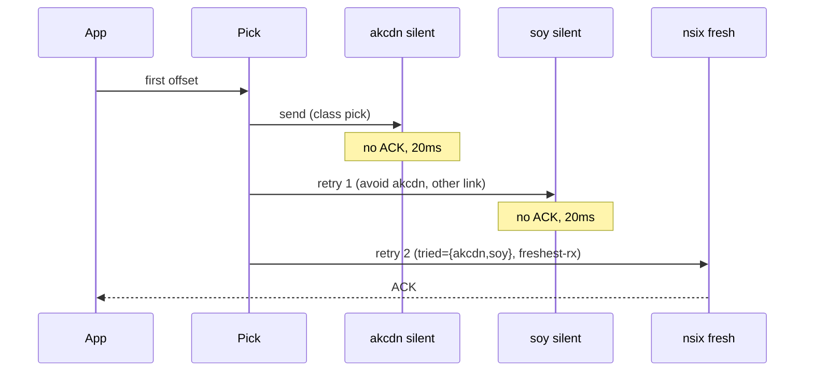

# Close retry and silent-path pick: leftover overlay holes after path-agnostic offsets

| Field | Value |
| --- | --- |
| **Title** | Close retry, silent-path pick, tried-set, linger accounting |
| **Author** | nya-link-aggregation maintainers |
| **Date** | 2026-08-31 |
| **Status** | Implemented |
| **Audience** | Senior engineers working in `nya-core` session / scheduler / health, `nya-proto` frames, and `nya-e2e` prod-like first-byte SLA |
| **Predecessor** | `docs/design-path-agnostic-offset.md` (Implemented). `PROTOCOL_VERSION=2` / ALPN `nya/2`, commit `24298e3`. Production proof: `prod-gz-yuusei` deployed ~2026-08-31 08:41 UTC. |
| **Compatibility** | `PROTOCOL_VERSION` **stays 2**. Close is already a frame; retry is the same frame. No new TOML keys. No new absolute-ms business thresholds in `Tuning`. One production `Tuning::STANDARD`. |

---

## Overview

Path-agnostic offsets landed. Production `prod-gz-yuusei` (deploy ~2026-08-31 08:41 UTC; window 08:42–09:26 UTC) already proves the core contract: sticky is gone from the send path (`migrates_*=0`), stream success 90.2% → 98.3% on a clean window, stall CDF grew a 20–50 ms bucket matching `loss_timeout` floor. Residual failures are **not** "retry didn't land" in the happy path. They are leftover contracts that still treat a silent-but-UP 5-tuple as live, send StreamClose once into its TLS buffer, ping-pong retries across two dying ISPs, count half-close linger as `stream_resets_timeout`, and restick last-send off DEGRADED (`failbacks_class_empty`).

**This design closes those holes.** Pick excludes paths whose `last_rx_ago >= loss_timeout(path.rtt)` (same clock as unacked retry) and, when every candidate is past that, falls back to the **current `pick_from` candidate list** (the class set from `fastest_class_set`) — not a global alive promotion. Each in-flight copy (DATA / Open / Close) remembers tried `path_id`s so the third attempt lands on a not-yet-tried, freshest-rx TCP instead of A↔B ping-pong. StreamClose gets an `OpenUnacked`-style side table and `retry_closes` in `maintain`, with immediate rehome on `path_failed`. There is no CloseAck: both roles retry until `started_at.elapsed() >= close_linger` (`reap_closes` does not look up `inner.streams`); first closer also stops on `recv_fin`. Happy-path short-circuit: after `retry_after`, stop only if `last_rx` is **newer than `sent_at`**. Half-close linger stops incrementing product `stream_resets_timeout`. `maybe_failback` stops being a send contract. e2e merge gates reproduce the production 3×2 shape with SOCKS first-byte — not ping-1500 ms survival. The Close-swallowed and two-ISP holes are new; silent-up first-byte folds into the existing `prod_like_one_conn_hole_first_byte`.

Clocks stay RTT multiples of existing `loss_timeout` / `down_timeout`. Path down remains pool hygiene, not a TTFB switch. One copy in flight at a time (no concurrent k-send). Overlay cannot invent a fourth ISP: nsix dual-down and the 09:07:31 all-ISP cascade are underlay; this series keeps using whatever named links still have a live TCP and does not retune down clocks to hide true all-path silence.

---

## Background & Motivation

### What already works (do not reopen)

Commit `24298e3` (`docs/design-path-agnostic-offset.md`):

- Each new offset / StreamOpen is sent **once** on `pick_pref` / `pick_pref_spread`.
- Unacked retry at `health::loss_timeout(cfg, path.rtt)` (`session/mod.rs` `retry_after`, `retry_expired_unacked`).
- StreamOpen side table `OpenUnacked { path_id, sent_at, target }` with `retry_opens` / `retry_open_from`.
- `send_data` no longer reads sticky as a send contract (`ensure_sticky` is gone). `set_sticky` still runs as **last-send** for HOL / snapshots / `load_term`.
- `PROTOCOL_VERSION = 2`, ALPN `nya/2` (`nya-proto/src/lib.rs`).
- Concurrent k-send of one offset was rejected and stays rejected.

Production on the 3×2 pool (akcdn / soy / nsix × 2 overlay TCPs, RTT 6.7–8 ms) showed the stall CDF 20–50 ms bucket and `migrates_*=0`. The data plane retry of DATA/Open is the working mechanism.

### Production residuals (SigNoz, `prod-gz-yuusei`, 08:42–09:26 UTC, ~45 min)

| Residual | Rate / shape | Mechanism today |
| --- | --- | --- |
| `stream_resets_timeout` | 1.7–2.7%, still 0–4/min in quiet minutes (09:11–09:30) | Mix of linger reap, pump-end reap, and true no-path |
| StreamClose one-shot | Close swallowed → peer never FINs → 1 s linger → Timeout + ~1000 ms stall sample | `close_send` (`streams.rs` L291–307): `pick_pref` + `send_on_path` once. `send_on_path` returns true once queued into the TLS TCP buffer |
| Silent-but-UP still picked | 20–50 ms window: retry fires, pick still chooses the dying TCP | `is_schedulable()` = UP && !congested (`path.rs` L174–176). Degrade waits `max(loss, probe+rtt, ping_interval_max=50ms)` (`health.rs` `degrade_timeout`) |
| Retry A↔B ping-pong | Two dying ISPs; third healthy unused | `pick_retry_path` (`scheduler.rs` L465–487) avoids only the single previous `path_id`, prefers another `link_key`, then `pick_from` |
| `failbacks_class_empty` | ~148 / 45 min | `maybe_failback` (`steer.rs` L399–471) resticks last-send off DEGRADED. Send path already ignores sticky |
| nsix dual-down | ~80 each of `#0`/`#1` / 45 min client | Underlay. Overlay cannot invent a fourth ISP |
| 09:07:31 all-ISP cascade | ~3 s, 38 streams that minute 89.5% success, hedge 872, `session_all_down_resets=0` | Correlated silence. Session survived. Residual timeouts there are true all-path |

Stall CDF (client, 45 min): **32% in (20, 50] ms** (working retry); median in 50–100 ms; **mean 670 ms is right-tail** (linger 1 s + cascade + ping-pong). Do not use stall mean as a product gate.

`nya.open_us` / SOCKS span only covers `open_stream` return (~20–50 µs), not app first-byte. e2e gates must be SOCKS new-stream first-byte like existing `prod_like_*_first_byte`.

### Clocks (do not retune)

On a 7 ms path with `Tuning::STANDARD` + `SessionConfig` defaults:

| Clock | Formula | 7 ms path |
| --- | --- | --- |
| `loss_timeout` | `clamp(2×RTT, 20ms, 2000ms)` | **20 ms floor** |
| `degrade_timeout` | `max(loss, probe+rtt, ping_interval_max)` | **50 ms** (`ping_interval_max`) |
| `down_timeout` | `max(5×RTT, down_min_silence=320ms) + probe` | **~330 ms** |
| `close_linger` | `Tuning::STANDARD.close_linger` | **1 s** (table hygiene, not a TTFB switch) |
| `all_down_timeout` | operator TOML, default 8 s | session-level give-up |
| `maintain_interval` | 5 ms | retry detection granularity |

The 20–50 ms hole is structural: retry is willing at 20 ms, path state is still UP until 50 ms, `is_schedulable()` is still true, `pick_pref` / `pick_retry_path` can still land on the silent TCP.

### Current Close / linger / pick (the leftover contracts)

```text
app shutdown
  → spawn_pump read Ok(0)
  → close_send: CAS send_fin_sent, pick_pref, send_on_path(Close) ONCE
  → if that 5-tuple is silent-but-UP: Close sits in TLS buffer, peer never FINs
  → close_linger 1s
  → reap_closed_streams → reset_stream(Timeout)     # steer.rs L284–311
  → or reap_stream on pump end if not both FINs      # streams.rs L328–340
  → stream_resets_timeout++, stall_ms ~1000 ms
```

DATA and Open already retry (`retry_expired_unacked` / `retry_opens`). Close does not.

`pick_retry_path` today:

```465:487:crates/nya-core/src/scheduler.rs
pub fn pick_retry_path(paths: &[Arc<PathState>], cfg: &SessionConfig, avoid: u32) -> Option<u32> {
    let avoid_link = paths
        .iter()
        .find(|p| p.id == avoid)
        .map(|p| p.link().to_string());
    let pick_with = |pred: fn(&PathState) -> bool| -> Option<u32> {
        let diverse: Vec<&Arc<PathState>> = paths
            .iter()
            .filter(|p| {
                p.id != avoid
                    && pred(p)
                    && avoid_link.as_deref().map(|l| p.link() != l).unwrap_or(true)
            })
            .collect();
        if !diverse.is_empty() {
            return pick_from(&diverse, cfg, PickPref::Any);
        }
        let other: Vec<&Arc<PathState>> =
            paths.iter().filter(|p| p.id != avoid && pred(p)).collect();
        pick_from(&other, cfg, PickPref::Any)
    };
    pick_with(|p| p.is_schedulable()).or_else(|| pick_with(|p| p.is_alive()))
}
```

Avoid one `path_id`. Two dying named links ping-pong; nsix sits unused until one of them hits `down_for` (~330 ms).

`ResetReason` (`nya-proto/src/frame.rs` L59–67) is `Unknown / DialFailed / Timeout / PeerReset / SessionDead / Protocol`. There is no Linger variant. Adding one is a wire change → proto bump. **Out of scope.** Product "timeout" must mean overlay/application progress failure, not FIN-on-dead-TCP, without a new variant.

---

## Goals & Non-Goals

### Goals

1. **Skip silent-but-UP at pick time.** `pick_pref` / `pick_from` / `pick_from_spread` exclude `last_rx_ago >= loss_timeout(path.rtt)` when any candidate in the **current class set** is fresher. Do not wait for `mark_degraded`. All-stale fallback is that same candidate list, not a slower-class promotion.
2. **Tried `path_id`s per in-flight copy.** Unacked / OpenUnacked / CloseUnacked remember recently tried ids. Third attempt lands on a not-yet-tried, freshest-rx path if one exists. One copy in flight.
3. **StreamClose RTT-scaled retry**, same shape as Open: side table, `retry_closes` / `reap_closes` in `maintain`, immediate rehome on `path_failed`. No CloseAck. Both roles hard-stop when `started_at.elapsed() >= close_linger` with **no** `inner.streams` lookup. First closer also stops on `recv_fin`. Duplicate Close is already idempotent (`on_peer_close`).
4. **Linger accounting.** Half-close reap must not increment `stream_resets_timeout` when overlay progress was fine. New counter `stream_reaps_linger`. No proto bump.
5. **Stop send-contract failback.** `maybe_failback` restick is not a send contract. Last-send is diagnostic + HOL placement only.
6. **e2e merge gates** on the 3×2 prod shape with SOCKS first-byte that reproduce the production holes (including Close swallowed — the scenario current e2e missed).
7. **Honest all-path / dual-ISP-down.** Keep using remaining named links. Do not retune down clocks. Do not require 98% success on true all-path blackhole.

### Non-goals

- Concurrent k-send of one offset (rejected; stays rejected).
- New absolute millisecond business knobs in `Tuning` / TOML. `close_linger` stays 1 s; we change what it *counts as*, not the duration.
- New `ResetReason` variant / `PROTOCOL_VERSION` bump. Retrying existing Close is enough. Linger is local accounting.
- Fixing underlay ISP death (nsix dual-down, 09:07:31 cascade). Overlay cannot invent a fourth ISP.
- Using stall **mean** as a product gate.
- Deleting `StreamState.sticky` in this series (already last-send only). Do not restore it as a send contract.
- Changing `down_min_silence` / `ping_interval_*` / `loss_timeout_floor` / `unknown_degrade_min`.
- Origin behaviour, new frame types, mixed-version peers.

---

## Proposed Design

```mermaid
flowchart TB
  subgraph pick [A. Pick]
    P[pick_from / pick_from_spread via loss_fresh_or_all] --> F{any class-set candidate with last_rx_ago < loss_timeout?}
    F -->|yes| Fresh[score the fresh subset]
    F -->|no| Class[fall back to the same class-set list]
  end
  subgraph tried [B. Tried set]
    U[Unacked / OpenUnacked / CloseUnacked] --> T["tried: Vec<path_id> FIFO cap 8"]
    T --> R[retry avoids tried]
    R --> Third[3rd attempt: untried + min last_rx_ago]
  end
  subgraph close [C. Close retry]
    App[app shutdown] --> CS[close_send]
    CS --> CU[CloseUnacked]
    CU --> First{recv_fin already?}
    First -->|no first closer| RC[retry until recv_fin or started_at >= close_linger]
    First -->|yes second closer| SC[retry until started_at >= close_linger; optional stop if last_rx newer than sent_at after retry_after]
    CU --> PF[path_failed → retry_close_from]
  end
  subgraph linger [D. Linger]
    L[reap_closed_streams @ close_linger] --> Q{overlay progress fine?}
    Q -->|yes| GL[streams_closed + stream_reaps_linger]
    Q -->|no| TO[stream_resets_timeout]
  end
```



### A. Skip silent paths at pick time

**Helper** (new, `scheduler.rs` or `health.rs`; prefer `scheduler.rs` next to pick, using existing `health::loss_timeout`):

```rust
pub fn is_loss_fresh(cfg: &SessionConfig, p: &PathState) -> bool {
    p.last_rx_ago() < health::loss_timeout(cfg, p.rtt())
}
```

Same clock as `Session::retry_after` (`session/mod.rs` L372–376): `health::loss_timeout(&cfg, p.rtt())` on **fast** EWMA, not stable, not class. No new floor/ceil.

**Shared two-pass helper** — both `pick_from` **and** `pick_from_spread` consume it. `open_stream` uses `pick_pref_spread` → `pick_from_spread` (`scheduler.rs` L199–220), which today calls `pick_from` for `best_id` then **re-selects among all original `candidates` with the same `path_score`**. Filtering only inside `pick_from` leaks: spread can rotate onto a silent equal-score sibling (the TTFB path). Do not re-expand ties onto the unfiltered list.

```rust
fn loss_fresh_or_all<'a>(
    cfg: &SessionConfig,
    cands: &[&'a Arc<PathState>],
) -> Vec<&'a Arc<PathState>> {
    let fresh: Vec<_> = cands
        .iter()
        .copied()
        .filter(|p| is_loss_fresh(cfg, p))
        .collect();
    if fresh.is_empty() {
        cands.to_vec() // same class-set list; not a global alive promotion
    } else {
        fresh
    }
}
```

`pick_from` scores `loss_fresh_or_all(...)`. `pick_from_spread` takes the **same** subset, then rotates ties inside it. `pick_pref` / `pick_path` / `hol_place_bulk_fallback` / in-class pick inherit via `pick_from`.

Do **not** change `PathState::is_schedulable()`. Silent-but-UP stays UP until `degrade_timeout`. Pool hygiene (`mark_degraded` / `path_failed`) is unchanged. Pick simply refuses to *use* a path that is already past the retry clock when a fresher **class-set** candidate exists.

**`fastest_class_set`** keeps its existing ladder (`schedulable && rtt_known && !backup` → `schedulable` → `is_up` → `alive`). Freshness is **not** applied by dropping silent paths out of the class set — otherwise all-silent would empty the class set and skip the fallback. All-stale fallback is this class-set list. A slower-class path that is loss-fresh is **not** considered on first send. On the 3×2 ~7 ms pool that is a no-op (one class). Mixed-class pools first-send into a silent fast class and wait for retry — `pick_retry_path` is not class-gated (PR 2), which is the intended escape. Do not imply first-send promotes a fresh backup ISP.

**`pick_retry_path`:** PR 1 does **not** change its signature. After PR 1 it inherits `pick_from` two-pass among the candidates it already built (`avoid` one id, prefer other `link_key`). PR 2 owns `tried: &[u32]` and min-`last_rx_ago` rungs (see B).

**Idle healthy paths stay eligible.** `last_rx` is touched on any frame including Pong (`path.rs` `spawn_path_io` L596). On a 7 ms path, `probe_interval` clamps to `ping_interval_min=10ms`, so idle `last_rx_ago` is typically < 10 ms, which is **below** `loss_timeout=20ms`. On a 60 ms path, `loss_timeout=120ms` while probe clamps to 50 ms — still fresh. The skip is tighter than degrade (20 vs 50 ms) exactly on the fast class, which is the production hole.

**HOL dest (bulk and interactive).** Two sites today only require `is_schedulable()`:

- `hol_place_bulk` same-link `find` (`steer.rs` L332–337)
- `maybe_hol` non-bulk `should_rebalance_conn` (`scheduler.rs` L491–501; `steer.rs` L356–363)

Add `is_loss_fresh` to **both** (one predicate, not a new clock). `should_rebalance_conn` is the interactive isolation path; leaving it unfiltered fights A — last-send can restick interactive onto a silent sister until the next `pick_pref`. Removing `maybe_failback` (E) makes this the remaining restick.

**Unknown-RTT new path.** `PathState::rtt_us` returns `Tuning::STANDARD.unknown_rtt_us` (20_000 µs) when EWMA is 0 (`path.rs` L182–188). `loss_timeout` is `clamp(2×RTT, 20ms, 2000ms)` → **40 ms**, not the 20 ms floor. `PathState::new` sets `last_rx=now` (`path.rs` L95). Handshake does not `touch_rx` until the first decoded frame in `spawn_path_io` (L596). A new path with no rx for 40 ms is skipped when a sampled-fresh peer exists; first Pong on a 7 ms path is usually earlier. If every remaining class-set candidate is that new, fallback to the same list. Acceptable.

**Unit tests** (`scheduler.rs`, reuse `mk_named` + backdate `last_rx` like session `age_rx` at `session/mod.rs` L2031):

- Three 7 ms UP paths; age one to 30 ms (`>= loss_timeout`, `< degrade`); `pick_path` never returns it.
- Age all three to 30 ms; `pick_path` still returns some class-set id (fallback, not empty).
- Two equal-score UP paths, age one to 30 ms; `pick_path_pref_spread` for every `stream_id` in 1..=8 never returns the aged id while the other is fresh (the spread leak).
- `should_rebalance_conn` is false when `alt` is aged 30 ms even if inflight slack would otherwise move.
- Unknown-RTT path aged 25 ms is still fresh (`loss_timeout=40ms`); aged 45 ms is skipped if a known-fresh peer exists; all-unknown falls back to the candidate list.
- (PR 1, inherit only) `pick_retry_path(..., avoid=silent)` with a fresh other-link path: dest is the fresh one. Do not change the `avoid: u32` API here.

### B. Remember tried `path_id`s per in-flight copy

One copy in flight. The table entry is **replaced** on retry, not appended as concurrent copies.

**DATA** — `Unacked` (`stream.rs` L24–28):

```rust
pub struct Unacked {
    pub data: Vec<u8>,
    pub path_id: u32,
    pub last_sent: Instant,
    /// Path ids this copy has already been *attempted* on, including `path_id`.
    /// FIFO cap 8 (vec bound, not a Tuning knob). See `push_tried`.
    pub tried: Vec<u32>,
}
```

**`push_tried` (one helper, used everywhere):**

```rust
fn push_tried(tried: &mut Vec<u32>, id: u32) {
    if tried.last() == Some(&id) {
        return;
    }
    tried.retain(|x| *x != id);
    if tried.len() == 8 {
        tried.remove(0); // FIFO drop-oldest, then push
    }
    tried.push(id);
}
```

Every `path_id` that `send_on_path` was **attempted** on is pushed — not only `rehome_unacked`. Today `send_data` on `send_on_path` false mutates `path_id` in place (`streams.rs` L265–276) and does **not** call `rehome_unacked`; `open_stream` `remember_open`s only the final id (L57–65). If those sites skip `push_tried`, first-send-blocked / first-Open-blocked lose the failed id and can ping-pong back to it.

Push sites:

| Site | What to push |
| --- | --- |
| `send_data` first insert | chosen `path_id` (attempted, even if `send_on_path` false) |
| `send_data` send-blocked alt | alt id |
| `rehome_unacked` | `to` |
| `remember_open` | the id actually attempted; if first `send_on_path` fails and alt is tried, push **both** |
| `retry_opens` / `retry_open_from` | dest id |
| `remember_close` / `retry_closes` / `retry_close_from` | same as Open |

`path_id` / `sent_at` still update to the current in-flight copy (one copy at a time). Memory is per **offset** (window ~128 KiB / payload), ~tens of `Unacked` × 8 ids — not `8 × streams`. Negligible.

**Open** — `OpenUnacked` (`session/mod.rs` L33–37): add `tried: Vec<u32>`. `remember_open` seeds it via `push_tried`. `retry_opens` / `retry_open_from` pass `&o.tried` into pick.

**Close** — new side table, same shape (see C).

**`pick_retry_path` signature** (PR 2; PR 1 leaves `avoid: u32`):

```rust
pub fn pick_retry_path(
    paths: &[Arc<PathState>],
    cfg: &SessionConfig,
    tried: &[u32],
) -> Option<u32>
```

`tried` empty ⇒ behave as today with `avoid = 0` (no exclusion) except inherited `pick_from` freshness. Callers always pass at least the current `path_id`.

Rungs, first match wins:

1. Not in `tried`, `is_loss_fresh`, `is_schedulable`, different `link_key` from the **current** in-flight id (`tried.last()` or `path_id`).
2. Not in `tried`, `is_loss_fresh`, `is_schedulable`.
3. Not in `tried`, `is_schedulable`.
4. Not in `tried`, `is_alive()`.
5. `is_alive()` except `tried.last()` / current in-flight id (cycle after the FIFO cap; do not stall; do not send a second copy on the same TCP). After 8 distinct attempts the oldest id is evicted and eligible again.

Among a rung, pick **min `last_rx_ago`**, tie-break existing `path_score` (class × load). Retry's job is "this TCP is still talking", not load spread. That is the "third attempt lands on not-yet-tried, freshest-rx" rule.

Cap 8 is a vec bound. Production `max_paths` default 32 (`cfg.rs` L122); live 3×2 is 6. **Not a TOML key.** `pick_retry_path` is **not** class-gated — a silent fastest-class first-send can escape onto a fresh slower ISP here. That is intentional and distinct from A's class-set fallback.



Today retry 2 would avoid soy and return to akcdn. After B it cannot.

Keep `Session::pick_retry(avoid: u32)` as a thin wrapper `pick_retry_path(..., &[avoid])` for call sites that only know the last id (e.g. `send_on_path` false on first send). Unacked / Open / Close retry use the full `tried` slice.

**Unit tests:**

- Existing `retry_prefers_other_named_link` still passes with `tried=[akcdn#0]`.
- New: akcdn#0 + soy#0 both schedulable, nsix#0 schedulable; `tried=[akcdn#0, soy#0]` ⇒ nsix#0.
- New: only avoid is alive ⇒ `None` (same as `retry_none_when_only_avoid_is_alive`).
- Session: extend `expired_unacked_retries_other_link` to three links, expire twice, assert third `path_id` is the never-tried one.

### C. StreamClose (and StreamReset if needed) RTT-scaled retry

**Do not bump `PROTOCOL_VERSION`.** `Frame::StreamClose` is `T_CLOSE = 0x0b` (`frame.rs` L182). Peer `on_peer_close` (`streams.rs` L473–482) is already idempotent:

```473:482:crates/nya-core/src/session/streams.rs
    pub(super) fn on_peer_close(&self, id: u32) {
        let Some(st) = self.get_stream(id) else {
            return;
        };
        st.note_close_started();
        if !st.recv_fin.swap(true, Ordering::SeqCst) {
            let _ = st.inbound_tx.try_send(Inbound::Close);
        }
        self.maybe_count_graceful(&st);
    }
```

There is **no CloseAck** and we do not invent one (`PROTOCOL_VERSION` stays 2). `recv_fin` is set only in `on_peer_close` when the **peer** sends `StreamClose` — the other direction. It is not an ACK of our FIN. `send_on_path` returning true means the frame hit the path `mpsc` (TLS TCP buffer), which we correctly reject as success.

Do **not** claim the general contract is “Close not ACKed.” Split first-closer vs second-closer. **Drop `sent_on_fresh` + `maintain_interval` as a delivery proxy.** `is_loss_fresh` at send time is receive-side (`last_rx_ago < loss_timeout`): a blackholed 5-tuple that recently got a Pong is still “fresh” for ~20 ms — that is the hole. `maintain_interval` (5 ms) is shorter than `loss_timeout` and one RTT; it cannot distinguish “path still talking” from “last_rx is 4 ms old and the TCP is already blackholed.”

| Role | How we know | Stop retrying when | Why |
| --- | --- | --- | --- |
| **First closer** (`recv_fin == false` at `close_send`) | We FINed; peer has not | `recv_fin` **or** `started_at.elapsed() >= close_linger` **or** stream reset / session dead | Proxy, not CloseAck. Origin-slow half-close: ~50 duplicate Closes / 1 s. Idempotent; waste only |
| **Second closer** (`recv_fin` already true at `close_send`) | Typical HTTP/SOCKS: server already sent response + Close, client then shutdown-write | `started_at.elapsed() >= close_linger` **or** session dead. Happy-path short-circuit: after `retry_after(path)`, `forget_close` only if `last_rx` Instant is **newer than `sent_at`** (a frame arrived after Close went out; Pong counts) | `recv_fin` cannot be the stop. Hard bound is linger on `CloseUnacked.started_at`, **not** `inner.streams`. Short-circuit is post-send rx, not pre-send freshness |

**Rejected:**

- Second-closer one-shot, only A (loss-fresh pick), D converting the peer’s linger into `stream_reaps_linger`. A path can die after queue.
- `sent_on_fresh` at send time plus one maintain tick. That is the same lie as `send_on_path == true`.

Linger-only (no short-circuit) is a valid simpler subset: both roles retry until `close_linger`. Duplicate Close is idempotent. Specify the `last_rx > sent_at` short-circuit so a healthy HTTP second-closer does not emit ~50 Closes; if an implementation omits it, linger still caps the table.

**Side table** on `Inner`, mirroring `opens`. It **outlives** `counted_close` / `remove_held_stream` for the second closer:

```rust
struct CloseUnacked {
    path_id: u32,
    sent_at: Instant,    // last send; drives retry_after and last_rx short-circuit
    started_at: Instant, // first remember_close; never reset on retry
    tried: Vec<u32>,
    /// `true` if `recv_fin` was already set at `close_send`.
    second_closer: bool,
}
// Inner.closes: Mutex<HashMap<u32, CloseUnacked>>
```

Keep it on the session (like Open), not only on `StreamState`, so `retry_closes` / `reap_closes` can snapshot without holding `streams`. Sending `StreamClose { stream_id }` does not require the stream HashMap entry.

**`close_send`** (`streams.rs` L291–307):

1. CAS `send_fin_sent` (unchanged; still one logical Close).
2. `note_close_started` (unchanged; stream linger clock for first closer still in `streams`).
3. `pick_pref(PickPref::Any)` — now silent-skipping (A).
4. `remember_close`: insert `CloseUnacked { path_id, sent_at: now, started_at: now, tried: [path_id], second_closer: recv_fin }` **even if** `send_on_path` fails. `started_at` is set once; later rehomes only update `sent_at` / `path_id` / `tried`.
5. If `send_on_path` is false, `pick_retry` + send + `push_tried` alt (same as `send_data` blocked).
6. `maybe_count_graceful` if `recv_fin` is already true — **product accounting may close the stream**, but **do not `forget_close`**.

**`reap_closes` + `retry_closes`** in `maintain`, next to `retry_opens` (`steer.rs` L203). `reap_closes` **must not** look up `inner.streams`:

```rust
fn reap_closes(&self) {
    let linger = self.inner.cfg.tuning.close_linger;
    let drop: Vec<u32> = self
        .inner
        .closes
        .lock()
        .unwrap()
        .iter()
        .filter(|(_, c)| c.started_at.elapsed() >= linger)
        .map(|(id, _)| *id)
        .collect();
    for id in drop {
        self.forget_close(id); // no streams lookup
    }
}

fn retry_closes(&self) {
    self.reap_closes();
    // snapshot Inner.closes (second closer may already be counted_close)
    // first closer: if recv_fin → forget_close; else if sent_at >= retry_after → rehome
    // second closer (and first, as short-circuit):
    //   if sent_at.elapsed() >= retry_after(path)
    //      && path still live
    //      && *path.last_rx.lock() > sent_at  // rx AFTER this Close
    //      → forget_close
    //   else if sent_at >= retry_after → rehome
    // pick_retry_path(paths, cfg, &tried); send StreamClose; push_tried; sent_at = now
    // increment close_retry only (NOT note_retry / data_hedge / data_retransmit)
}
```

`mark_dead` / `shutdown` drops `Inner.closes` (or `forget_close` every id). No leak across session death.

**`retry_close_from(dead)`** from `path_failed`, next to `retry_open_from` (`session/mod.rs` L320–321):

```rust
self.rehome_unacked_from(path_id);
self.retry_open_from(path_id);
self.retry_close_from(path_id);
```

Immediate rehome; do not wait `retry_after` — the path is gone. Do **not** reset `started_at`.

**Forget** (and only these):

- `reap_closes` when `started_at.elapsed() >= close_linger` (both roles; **no** `inner.streams`).
- First closer: `on_peer_close` (`recv_fin` rose); stream `reset` / session dead.
- Either role: `last_rx > sent_at` after `retry_after` (short-circuit).
- Session `mark_dead`.
- **Not** `maybe_count_graceful` / `remove_held_stream`. `remove_held_stream` still `forget_open` and unstick; Close table is independent. First closer’s stream linger (`reap_closed_streams`) still walks `streams`; that path also `forget_close` if the id is still present — belt and suspenders with `reap_closes`.

**Metrics.** Do **not** fold Close retry into `data_hedge` / `data_retransmit` (`note_retry` at `mod.rs` L379–393). New counter `close_retry` — every successful rehome of Close (timer or `path_failed`). Optional `debug!(stream_id, from, to, "close_retry")`.

Not a TOML key. `Counters::default` is **handwritten** (`metrics.rs` L199): new fields must touch `Counters`, `Snapshot`, `snap_with_paths` / `snapshot()`, `add_counters`, `catalog.rs` (`nya_close_retry_total`), `export.rs`.

**StreamReset.** `finish_stream` (`session/mod.rs` L759–793) is also one-shot `pick_pref` + `send_on_path(StreamReset)`. After A, that pick already skips silent-but-UP. Do **not** keep a Reset side table after `remove_held_stream`. Not a merge gate. If linger still sends a hygiene Reset (D), pick a loss-fresh path and send once.

**Both ends.** `close_send` runs in `spawn_pump` on client and server. The table is per-session. Server Close swallowed is the same hole (often the **second closer** on the client); the same code path covers it.

**Unit tests** (`session/mod.rs`) — both roles. Do **not** assert forget after `maintain_interval` on a still-silent path.

- **First closer:** two named paths; `close_send` with `recv_fin=false`; age CloseUnacked `sent_at` past `retry_after`; `debug_maintain`; Close frame queued on the other path; `close_retry` +1. Inject `on_peer_close` → `retry_closes` is a no-op (`forget_close`). Duplicate `on_peer_close` still one `streams_closed`.
- **Second closer, swallowed (matches short-circuit negation):** set `recv_fin` first, then `close_send`; `maybe_count_graceful` may run; **`Inner.closes` still held**. Backdate `last_rx` of the chosen path so it is **older than `sent_at`** (and `>= loss_timeout` ago); age `sent_at` past `retry_after`; `debug_maintain`; Close retried onto a fresh path (`close_retry` +1). Table **not** forgotten.
- **Second closer, short-circuit:** after `close_send`, `touch_rx` on the dest (`last_rx > sent_at`); age `sent_at` past `retry_after`; `debug_maintain`; `Inner.closes` forgotten **without** a rehome.
- **Linger reap without streams (Issue 2):** second closer; no live path (or never a successful send); age `started_at` by `close_linger`; `debug_maintain`; `Inner.closes` is **empty** and retries stop. Do not insert the id back into `streams`.
- `path_failed` of the Close path immediately rehomes Close (either role); `started_at` unchanged.

### D. Linger accounting

`reap_closed_streams` (`steer.rs` L284–311) and `reap_stream` (`streams.rs` L328–340) both call `reset_stream(id, ResetReason::Timeout)` → `observe_stream_end` → `stream_resets_timeout`. Quiet-minute 0–4/min drip is this, not TTFB.

**No new `ResetReason`.** Existing variants (`frame.rs` L59–67) stay. Product timeout = overlay/application **progress** failure.

**Progress-fine predicate** (local, no wire). `send_next` and `send_acked` both start at 0 (`StreamState::new`), so `acked >= next` alone is true with no DATA and no ACK. Open is forgotten only on `StreamAck` (`on_ack` → `forget_open`, `streams.rs` L437); there is no OpenAck — Open with no DATA never gets an ACK. A stream that sent StreamOpen + StreamClose into a blackhole must **not** count as linger-closed.

```rust
fn overlay_progress_fine(&self, st: &StreamState) -> bool {
    let send_fin = st.send_fin_sent.load(Ordering::Relaxed);
    let recv_fin = st.recv_fin.load(Ordering::Relaxed);
    let acked = st.send_acked.load(Ordering::Relaxed);
    let next = st.send_next.load(Ordering::Relaxed);
    if acked < next {
        return false; // unacked DATA
    }
    if recv_fin {
        return true; // peer delivered; our Open existed
    }
    if !send_fin {
        return false;
    }
    // send_fin, no recv_fin: Open must have been ACKed (opens table dropped).
    // send_next > 0 also implies a DATA ACK path ran, but Open-only
    // half-close never increments send_next.
    !self.inner.opens.lock().unwrap().contains_key(&st.id)
}
```

Equivalent: `acked >= next && (recv_fin || (send_fin && !opens.contains(id)))`. Open-never-ACKed (`opens` still held) is **not** fine. Unacked DATA is **not** fine.

Receiver path: `on_peer_reset` → `finish_stream(..., Some(Timeout), false)` does **not** set `recv_fin`. A Reset-only abort of a stream that never FINed still Times out (predicate false unless they already had a FIN from a prior Close).

**Linger reap classification:**

| Local state at `close_linger` | Count as | Overlay Reset? |
| --- | --- | --- |
| `overlay_progress_fine` (typical half-close waiting on origin FIN, or Close in flight while peer is slow) | `streams_closed` **and** `stream_reaps_linger` | Send `StreamReset(Timeout)` **once** on a loss-fresh path for peer table hygiene. Receiver: if *they* are also `overlay_progress_fine`, they count linger too (see below), not Timeout |
| `send_fin_sent` but unacked DATA / Open still pending | `stream_resets_timeout` (true overlay failure) | `StreamReset(Timeout)` as today |
| neither FIN, pump ended | `stream_resets_timeout` | as today |
| both FINs | already `maybe_count_graceful`; should not be in the linger list | none |

**Receiver of `StreamReset(Timeout)`:** `on_peer_reset` → `finish_stream(..., Some(Timeout), false)`. Change `observe_stream_end` so that a Timeout **reason** with `overlay_progress_fine` increments `stream_reaps_linger` + `streams_closed`, **not** `stream_resets` / `stream_resets_timeout`. That stops the server-side Timeout drip when the client linger-aborts a half-close that already delivered.

Wire reason stays `Timeout` (hygiene abort). Local product metric does not.

**Dashboard identity** (today `streams_closed` is both-FIN only, `observe_stream_end` `None` branch, `mod.rs` L815–821):

```text
streams_closed          = both_FIN + linger_as_closed
stream_reaps_linger     = linger_as_closed            (hygiene; not TTFB)
stream_resets_timeout   = overlay progress failure    (product TTFB fail)
```

Soak watch: `(streams_closed - stream_reaps_linger) / streams_opened`, **not** raw `streams_closed / streams_opened`. The latter will rise by absorbing half-closes that previously counted as Timeout (including a swallowed second-closer Close that hits linger). Operators who already chart success as `closed/opened` must subtract linger. Keep sending hygiene `StreamReset(Timeout)` as specified.

**`stream_reaps_linger`:** new `AtomicU64` on `Counters` (handwritten `Default`, same touch-list as `close_retry`), snapshot field, `catalog.rs` `nya_stream_reaps_linger_total` ("half-close linger reaps; not a TTFB timeout"). Include in `add_counters`. Log at `debug` with `stream_id` / `reason=linger`.

**Do not change `close_linger` duration.** 1 s remains the table bound. `half_close_linger_reaps_stream_table` (`session/mod.rs` L1924–1968) still asserts HashMap empty after linger. Extend it: `stream_resets_timeout` unchanged, `stream_reaps_linger` +1 (and `streams_closed` +1).

**Unit tests** (with the existing linger test):

- Open never ACKed (`opens` still held, `send_next==0`), Close sent, linger reap → `stream_resets_timeout +1`, `stream_reaps_linger` unchanged.
- DATA fully ACKed (`send_acked == send_next > 0`), half-close linger → `stream_reaps_linger +1`, `stream_resets_timeout` unchanged.

**`reap_stream` (pump end)** uses the same classifier. Today `Ok(0)` on send plus peer Close never arriving hits Timeout here too.

**Stall samples.** Linger Timeout today observes ~1000 ms into `stall_ms` on `finish_stream` if `st.stalled`. After C, Close retry should FIN before linger in the swallowed-TCP case, so that right-tail shrinks. Linger-as-closed still observes stall-on-finish if the stream was marked stalled; do not special-case stall mean. Do not use stall mean as a gate.

### E. Stop send-contract failback

`send_data` already picks every offset (`pick_pref`). `maybe_failback` (`steer.rs` L399–471) still `set_sticky` off DEGRADED / class-empty and increments `failbacks_class_empty` (~148 / 45 min). That is last-send chatter, not TTFB.

**Change:** stop calling `maybe_failback` from `maintain` (`steer.rs` L199–202). Leave `failback_target` / `FailbackReason` in `scheduler.rs` (unit tests, possible future diagnostic). Leave `failbacks_*` counters in place so production can prove they stay ~0.

Do **not** increment `failbacks_*` from HOL.

**Last-send is diagnostic + HOL placement only:**

| Site | Keep `set_sticky`? | Why |
| --- | --- | --- |
| `send_data` / `open_stream` / `accept_remote_stream` | yes | last-send for snapshot `StreamSnap.path`, `load_term` spread, HOL |
| `maybe_hol` / `hol_place_bulk` | yes | same-link bulk vs interactive isolation (`conn_has_interactive` reads sticky, `steer.rs` L318–324) |
| `maybe_failback` | **delete the call** | not a send contract |

`load_term` (`scheduler.rs` L29–37) still adds `sticky_count`. That is a mild last-send spread term, not sticky-as-home. Out of scope to remove.

HOL may stay. It isolates bulk vs interactive on same-link TCPs. Dest pick inherits silent-skip (A): `should_rebalance_conn` and `hol_place_bulk` both require `is_loss_fresh` (PR 1).

### F. e2e that reproduces production (merge gates)

Must use `prod_like_spec` (akcdn / soy / nsix, 10 ms class, `connections: 2`) and `socks_first_byte` / `collect_first_bytes` (`crates/nya-e2e/src/scenarios.rs` L651–740). Helpers already exist: `blackhole_conn_for`, `set_conn_blackhole` (`impair.rs` L203–221), `h.link("akcdn")`.

**Not** ping interval 40 ms / ping timeout 1500 ms / `Sla::failover(..., 1500)`. Those gated survival, not TTFB.

Register **new** scenarios in `catalog()` as **short** (not `long: true`) so `crates/nya-e2e/tests/matrix.rs` `short_matrix` is the merge gate. Do **not** add a near-duplicate of `prod_like_one_conn_hole_first_byte`. Spend PR 6 budget on Close-swallowed (2) and two-ISP (3); keep all-path (5) as SOCKS first-byte / `all_down_resets` (distinct from existing ping-1500 `blackhole_all_5s`).

e2e numeric p99s are **lab ceilings**, not Tuning knobs. Narrate budgets as `k × loss_timeout(rtt) + RTT` (`k` = number of dying named links the first send can miss). Existing `first_byte_sla(120, 0.95)` on 10 ms class already encodes ~one retry + slack.

#### Scenario 1 — Silent-but-UP first-byte (fold into existing)

**Do not add** `prod_like_silent_up_first_byte`. Existing `prod_like_one_conn_hole_first_byte` (`scenarios.rs` L745–768) is already `prod_like_spec` + 3× baseline + `akcdn` conn 0 blackhole + `collect_first_bytes(16, 250ms)` + `first_byte_sla(120, 0.95)`. Collect starts immediately (window ≪ `down_min_silence`).

**Add asserts** on that existing scenario:

- `session_all_down_resets==0`
- `stream_resets_timeout` delta stays low (0 on n=16 is the target)

Extra vs baseline in `loss_timeout + RTT` order, **not** down clock. May already pass via DATA retry today; the new asserts are the regression gate for A, not a new catalog row.

#### Scenario 2 — Close swallowed by silent TCP (**the scenario e2e missed**)

**Name:** `prod_like_close_swallowed`

**Reproduces:** application close when `pick_pref`'s loss-fresh set is a **singleton blackholed 5-tuple**, so Close is queued into a silent-but-UP TCP; peer must see FIN without waiting `close_linger` as Timeout.

`close_send` (`streams.rs` L303–304) uses `pick_pref(PickPref::Any)`, **not** sticky/last-send. Do not pin via sticky. Do not “fix” the test by sending Close on last-send.

**Invariant at close instant:** `loss_fresh_or_all` of the class set is a singleton whose 5-tuple is blackholed, and ≥1 other named link is live (its `last_rx` may already be stale). Pin via **last_rx**, not sticky:

1. `start(prod_like_spec())`.
2. `connect_socks_echo`, echo a small payload (stream is live, both directions). Snapshot client `stream_resets_timeout` (`h.session` is the **client**, `harness.rs` L24; `Snapshot.stream_resets_timeout` already exists). There is no server session on the harness — do not require server counters. Client `read` Ok(0) implies the server sent Close.
3. Blackhole 5 of 6 conns (`akcdn` 0+1, `soy` 0+1, `nsix` 0). Echo one more payload so the remaining TCP (`nsix#1`) is the only `last_rx`-fresh path.
4. **Swap:** clear the 5, blackhole that remaining idx (`nsix` 1). The previously-fresh TCP is now the only still-fresh (recent `last_rx`) member of the class set, and it is blackholed. The other five are live but `last_rx_ago` is growing; until they exceed `loss_timeout` they may still look fresh — so **close immediately** after the swap (do not wait for the 5 to go stale, or wait just long enough that only the blackholed one still has `last_rx` from step 3). The implementer must make the singleton true at close: either close before the unblackholed five get a Pong, or keep them blackholed until close and only unblackhole after Close is queued (then they become the retry dest). Preferred: keep the 5 blackholed through `shutdown(Write)`, then unblackhole them so retry has a dest — at close instant the fresh set is the singleton blackhole; after unblackhole, retry (C) / pick (A) uses nsix's sibling or another ISP.
5. `tcp.shutdown(Write)` then `read` until Ok(0) / EOF.

**Pass (the gate):**

- `read` returns Ok(0) within **200 ms** lab ceiling (`3 × loss_timeout_floor + several RTTs`, not `close_linger=1s`). That is both FINs; linger will not fire.
- After that success, optionally a short settle (< linger): client `snapshot().stream_resets_timeout` delta **== 0**.
- `close_retry` is **diagnostic notes only**. A may already skip the silent path (`close_retry==0` and still Ok(0)) — do **not** require `close_retry≥1`.
- `min_success` is not the first-byte SLA.

Do not treat `stream_resets_timeout` delta 0 **at the 200 ms wall without Ok(0)** as a pass: linger has not fired yet even if Close is still in a blackhole.

#### Scenario 3 — Two dying ISPs, third healthy

**Name:** `prod_like_two_isp_hole_first_byte`

**Reproduces:** A↔B ping-pong while nsix is unused. This is new (not a duplicate of one-conn or one-link hole).

**Steps:**

1. Baseline: 3× `socks_first_byte` as in `prod_like_one_conn_hole_first_byte`.
2. `akcdn` set_conn_blackhole 0 and 1; `soy` set_conn_blackhole 0 and 1; **nsix stays up**.
3. `collect_first_bytes` n=16, timeout 250 ms.
4. Also run one long-lived SOCKS stream, close it (first-byte **and** close must use nsix).
5. Clear.

**Pass:** `first_byte_sla(180, 0.95)` — lab ceiling allows **two** `loss_timeout` misses + RTT + slack, still ≪ 320 ms down. `stream_resets_timeout` delta low (no linger Timeout on the close). `session_all_down_resets==0`. Notes: hedge/rtx may rise; that is expected.

#### Scenario 4 — nsix dual-down, other ISPs live

**Keep** `prod_like_one_link_hole_first_byte`. Overlay cannot invent a fourth ISP; this proves we keep using the other two named links.

**Add asserts** (same scenario, not a new Tuning):

- `min_success ≥ 0.95` (already).
- `stream_resets_timeout` delta stays low (no linger Timeout storm). Compare before/after snapshot; 0 on n=16 is the target.
- `session_all_down_resets==0`.

Do not send new offsets / Close onto the silent pair (A+B+C).

#### Scenario 5 — True all-path blackhole

**Name:** `prod_like_all_path_blackhole`

**Reproduces:** 09:07:31-class correlated / all-path silence. **Do not require 98% success.**

**Steps:**

1. `start(prod_like_spec())`, baseline one first-byte.
2. Blackhole **all six** conns for **2 s** (`< all_down_timeout=8s`, `> down_timeout~330ms` so paths may tear and `run_link` redial).
3. During hold: SOCKS first-bytes may fail. Record `session_all_down_resets` and `correlated_silence`.
4. Clear all blackholes.
5. Recovery: `socks_first_byte` succeeds within 400 ms.

**Pass:**

- `session_all_down_resets == 0` across the scenario (session did not hit the 8 s give-up).
- After clear, first-byte succeeds.
- During hold, `min_success` is **not** gated (set `min_success: 0.0` or skip `Sla` success; custom asserts).
- Do **not** retune `down_min_silence` if this is ugly. Paths tearing at `down_for` on all-N is existing policy (`steer.rs` L75–78 comment: all-N tears at `down_for`).

Optional sibling (same PR or notes): **N−1** blackhole (5 of 6) for 2 s. Correlated hold should keep the 5 from tearing (`correlated && !budget_elapsed`). Remaining TCP serves; `min_success ≥ 0.95`; `session_all_down_resets==0`. That is the 09:07:31 survival shape (`session_all_down_resets=0`, ~3 s). A makes pick skip the silent five.

#### SLA summary (merge gates)

| When | First-byte extra | `min_success` | Timeout reset | Session |
| --- | --- | --- | --- | --- |
| ≥1 named link still has a live TCP (existing one-conn / one-link, scenario 3) | `k × loss_timeout + RTT` order, k = dying named links hit before a live one | **≥ 0.95** | timeout-rate assert on existing one-conn and one-link | `all_down_resets=0` |
| Scenario 2 close | SOCKS `shutdown(Write)` then `read` Ok(0) within 200 ms | n/a | client `stream_resets_timeout` delta 0 **after** Ok(0) (and optional settle). `close_retry` notes only | — |
| True all-path (scenario 5) | not gated | not gated | true no-path Timeouts allowed | **not** `all_down` reset before `all_down_timeout`; recovery after |

Do not use stall mean. Do not use `nya.open_us`.

---

## API / Interface Changes

| Surface | Change |
| --- | --- |
| `PROTOCOL_VERSION` / ALPN | **unchanged** (2 / `nya/2`) |
| `Frame` / `ResetReason` | **unchanged**. Close retry = same `StreamClose`. Linger does not add a variant |
| TOML / `SessionConfig` | **no new keys**. `[session]` still `ping_interval_*` / `all_down_timeout` / `max_paths` |
| `Tuning::STANDARD` | **no new fields**, no retune of `loss_timeout_*` / `down_*` / `close_linger` / `ping` |
| `scheduler::pick_retry_path` | PR 2: `avoid: u32` → `tried: &[u32]`. PR 1 does not touch the signature |
| `scheduler::loss_fresh_or_all` | new helper consumed by **both** `pick_from` and `pick_from_spread` |
| `scheduler::is_loss_fresh` | new helper |
| `scheduler::should_rebalance_conn` | also require `is_loss_fresh` on `alt` (PR 1) |
| `Unacked` / `OpenUnacked` | add `tried: Vec<u32>`; `push_tried` FIFO cap 8 |
| `Inner.closes` | new `HashMap<u32, CloseUnacked>` with `started_at`; outlives `counted_close` for second closer |
| `Counters` | `close_retry`, `stream_reaps_linger`. Handwritten `Default` (`metrics.rs` L199) |
| `catalog.rs` | `nya_close_retry_total`, `nya_stream_reaps_linger_total` |
| `maintain` | `reap_closes()` + `retry_closes()`; drop `maybe_failback` call |
| `path_failed` | also `retry_close_from` |
| `observe_stream_end` | Timeout + `overlay_progress_fine` → linger counters, not `stream_resets_timeout` |

Public crate API (`Session::open_stream`, inbound SOCKS) unchanged.

---

## Data Model Changes

No on-disk schema. Session-memory only.

```text
Unacked        { data, path_id, last_sent, tried: Vec<u32> }
OpenUnacked    { path_id, sent_at, target, tried: Vec<u32> }
CloseUnacked   { path_id, sent_at, started_at, tried, second_closer }
               // new, Inner.closes; not dropped by remove_held_stream
               // started_at = first remember_close; reap_closes uses it
```

`tried` includes every id `send_on_path` was attempted on. FIFO drop-oldest when `len==8` before push (`push_tried`). No migration. Streams in flight during a rolling restart are v2↔v2; both ends already speak Close.

`StreamState.sticky` remains last-send (`AtomicU32`). Not a send contract.

`forget_close` is **not** in `remove_held_stream`. Both roles: `reap_closes` when `started_at.elapsed() >= close_linger` (no `streams` lookup). First closer also: `on_peer_close` / stream reset. Either role: `last_rx > sent_at` after `retry_after`. `mark_dead` drops the map. `forget_open` stays in `remove_held_stream`.

---

## Alternatives Considered

### 1. Wait for `mark_degraded` / shrink `ping_interval_max` so UP means "fresh"

Degrade is a probe-send cycle (`max(loss, probe+rtt, ping_max=50ms)`). Shrinking `ping_interval_max` is an operator-facing absolute ms change and still leaves a gap between `loss_timeout` (20 ms) and degrade. Pick would keep using silent-UP until state flips. **Rejected.** Skip at pick with the retry clock; leave degrade/down as pool hygiene.

### 2. Concurrent k-send of Close / DATA (reopen first-arrival)

User already rejected k-copy. Duplicate Close is harmless, but k-DATA is bandwidth × k and was explicitly out. Close retry is one copy, timeout, replace path. **Rejected.**

### 2b. Second-closer one-shot (only A; D converts peer linger)

Would skip a Close table after `counted_close` and rely on loss-fresh pick plus linger-as-closed on the peer. A path can die after `send_on_path` queues; production quiet-minute drip includes client-shutdown-after-server-FIN. **Rejected.** Keep `Inner.closes` until `started_at >= close_linger` (and the `last_rx > sent_at` short-circuit).

### 2c. `sent_on_fresh` at send time + one `maintain` tick

`is_loss_fresh` is pre-send `last_rx`. A silent-but-UP TCP that Ponged 4 ms ago is still “fresh”; 5 ms later the table would drop with Close in the TLS buffer. Contradicts the age-`last_rx`-then-retry test. **Rejected.** Short-circuit only if `last_rx` is **newer than `sent_at`** after `retry_after`. Hard stop is `started_at` + `close_linger` via `reap_closes` with no `streams` lookup.

### 3. New `ResetReason::Linger` (proto bump)

Would make peer accounting honest on the wire. Requires `PROTOCOL_VERSION=3`, mixed-session pain, and is unnecessary: local `overlay_progress_fine` already distinguishes linger from TTFB Timeout, and Close is already a frame. **Rejected** unless a later soak proves the wire reason itself is the leak (it is not).

### 4. Count all linger as graceful, never send StreamReset

Cleans the counter and avoids peer Timeout, but a swallowed Close that exhausted retries would leak the server stream until origin ends (server `close_started==0`, not in the linger list). Need a hygiene Reset on linger so the peer drops. Local accounting (D) stops that Reset from looking like TTFB. **Rejected as the sole mechanism;** combined with D's classifier.

### 5. Keep `maybe_failback` but stop incrementing `failbacks_class_empty`

Still resticks last-send, still moves HOL's view of "where is interactive", still burns `failback_cooldown`. The send path ignores sticky; the restick does no TTFB work. **Weaker than deleting the call.** Chosen: delete the `maintain` call, keep counters at 0.

### 6. Retune `down_min_silence` / `close_linger` to hide tails

Stall mean 670 ms is linger + cascade + ping-pong. Shortening linger hides Timeout counts without delivering FIN. Shortening down tears healthy 80–250 ms delay spikes (existing comment on `down_min_silence`). **Rejected.** Fix Close retry and pick; leave clocks.

---

## Security & Privacy Considerations

- No new frame, no new plaintext, no new handshake field. Close retry is the existing `StreamClose { stream_id }`.
- Duplicate Close: `recv_fin` CAS; second copy is a no-op. No double `Inbound::Close` into the app duplex.
- Duplicate Open remains `try_alloc_local_stream` vacant-only (one origin dial). Unchanged.
- Linger hygiene `StreamReset(Timeout)` can abort origin copy at `close_linger` (same as today). Classifier only changes **counters**, not who is reset, except we still reset. Threat model unchanged: a peer already able to send Close/Reset can do so.
- `tried: Vec<u32>` is in-memory, per copy, dropped with the stream. No user data.
- Early DATA / window not doubled: Close has no window credit.

---

## Observability

### Counters

| Name | When | Product reading |
| --- | --- | --- |
| `nya_stream_resets_timeout_total` | overlay progress **failed** (no-path, unacked DATA died, Open never ACKed) | TTFB / stream-fail. Quiet-minute drip should collapse after D+C |
| `nya_stream_reaps_linger_total` | half-close reap or Timeout-Reset received with `overlay_progress_fine` | hygiene. **Not** a TTFB page. Subtract from `streams_closed` for soak success |
| `nya_streams_closed_total` | both-FIN **+** linger-as-closed | `closed - linger` vs opened is the identity; raw `closed/opened` will rise |
| `nya_close_retry_total` | Close rehome (timer or `path_failed`) | expected under silent TCP; not an error |
| `nya_data_hedge_total` / `nya_data_retransmit_total` | DATA / Open retry only (unchanged) | do not mix Close into these |
| `nya_failbacks_class_empty_total` | should go to ~0 after E | chatter, not SLO. Keep the series |
| `nya_session_all_down_resets_total` | unchanged | scenario 5 gate: stays 0 before 8 s |
| `stall_ms` | unchanged clock (`loss_timeout` of unacked path) | CDF 20–50 ms bucket is success. **Mean is not a gate** |

`export.rs` snapshot line: add `linger=` and `close_retry=` next to `resets=` / `closed=`. Do not re-add `metrics=` on info.

### Logs

- `retry_closes` / `retry_close_from`: `debug!(stream_id, from, to, "close_retry")`.
- Linger reap: `debug!(stream_id, "stream linger reap")` — not `warn`. Timeout progress-failure keeps existing `stream end` debug.
- Do not info-log per Close retry (maintain 5 ms × N streams).

### Alerts

- Page on `stream_resets_timeout / streams_opened` remaining high **after** this series on a window with ≥1 named link live — that is true overlay failure.
- Soak success chart: `(streams_closed - stream_reaps_linger) / streams_opened`. Do not page on raw `streams_closed / streams_opened` rising (linger absorption).
- Do **not** page on `stream_reaps_linger`, `close_retry`, `path_down`, `failbacks_*`.
- `session_all_down_resets > 0` is already a session-level incident.

---

## Rollout Plan

Single production `Tuning::STANDARD`, both ends already on v2. No mixed-session story.

1. Land PRs in order (see PR Plan). Each is mergeable with unit tests; e2e gates in PR 6.
2. Deploy client+server together as usual (already v2). Behaviour is additive on existing frames.
3. Watch 45 min on `prod-gz-yuusei`:
   - `stream_resets_timeout` rate well below 1.7–2.7% in quiet minutes (linger drip gone).
   - Soak success: `(streams_closed - stream_reaps_linger) / streams_opened`, not raw `closed/opened`.
   - `stream_reaps_linger` absorbs the quiet-minute half-closes.
   - `failbacks_class_empty` ~0.
   - stall CDF keeps the 20–50 ms bucket; **right-tail / mean** shrinks (no 1 s linger Timeout on swallowed Close).
   - nsix dual-down still happens; timeout rate on remaining links stays low.
   - all-ISP cascade: `session_all_down_resets=0` if hold < 8 s; do not retune down.
4. **Rollback:** revert the PRs. v2 wire unchanged. No flag needed (no new TOML). If a PR must be gated, a compile-time `#[cfg]` is worse than a clean revert — this is not a long-lived flag.

Feature flags: none. One algorithm table.

---

## Risks

| Risk | Sev | Mitigation |
| --- | --- | --- |
| Idle path skipped because last Pong is 20–50 ms old | Med | Probe on 7 ms class is 10 ms; `loss_timeout` 20 ms. Unit test idle-fresh. If a soak shows healthy idle skipped, the bug is probe not firing, not this skip |
| All-stale class set: fallback first-sends into silent fast class | Low | Documented. `pick_retry_path` is not class-gated. Cannot invent an ISP. Scenario 5 does not require 98% |
| Close retry storms on origin-slow half-close (first closer; Close delivered, origin never FINs) | Med | Retry until `recv_fin` or `started_at >= close_linger`. 1 s / 20 ms ≈ 50 Close frames. `reap_closes` then `forget_close` with no streams lookup. Second closer: same linger cap; happy path stops when `last_rx > sent_at` after `retry_after` (~one extra Close, not 50) |
| Linger counted closed while Open never ACKed / DATA lost | Med | Predicate requires `acked >= next` **and** (`recv_fin` or `opens` not held). Unit tests both lies |
| Hygiene `StreamReset(Timeout)` still increments peer Timeout if we forget the receiver classifier | Med | Same `overlay_progress_fine` in `observe_stream_end` for both sender linger and received Timeout |
| Tried-set memory | Low | Cap 8 × in-flight **offsets** (window / payload), not × streams. Negligible |
| HOL last-send on a just-silent path until next send | Low | `should_rebalance_conn` and `hol_place_bulk` require `is_loss_fresh` (PR 1). Next offset / Close pick skips it |
| Two copies of Close from `maintain` + `path_failed` race | Low | Idempotent peer. Accept; do not build a send-lock |
| e2e scenario 2 Close dest not last-send | Med | Pin via last_rx singleton blackhole, not sticky. Gate is SOCKS `read` Ok(0) within 200 ms; `close_retry` notes only |

---

## Open Questions

None that block implementation. Resolved here:

- No proto bump; no `ResetReason::Linger`; no CloseAck.
- First closer: retry until `recv_fin` or `started_at >= close_linger`. Second closer: same linger cap on `CloseUnacked.started_at` (`reap_closes`, no `streams` lookup). Short-circuit: `last_rx > sent_at` after `retry_after`. No `sent_on_fresh`.
- No k-send.
- No new Tuning/TOML keys.
- `maybe_failback` call removed, not just silenced.
- StreamReset is not a side-table retry; Close is.
- Stall mean is not a gate.
- All-stale fallback is the class-set candidate list, not global alive promotion.
- Scenario 1 folds into existing `prod_like_one_conn_hole_first_byte`.

Soak-followup (not this series): if quiet-minute `stream_resets_timeout` remains after C+D, it is true no-path / unacked DATA, not linger — attribute with hop clocks (`design-algorithm-completeness-6.md` H9), do not retune.

---

## Key Decisions

1. **Skip silent-but-UP at pick, don't wait for `mark_degraded`.** `is_schedulable()` stays UP&&!congested (pool state). Shared `loss_fresh_or_all` feeds **both** `pick_from` and `pick_from_spread`. All-stale fallback is the **class-set candidate list**, not a global alive promotion. `should_rebalance_conn` and `hol_place_bulk` also require `is_loss_fresh`.
2. **Tried `path_id`s per in-flight copy, one copy at a time.** Every `send_on_path` attempt is `push_tried` (FIFO cap 8). Third attempt must hit a not-yet-tried, freshest-rx TCP. No concurrent k-send.
3. **Close retries the existing frame. No CloseAck.** `send_on_path` is not success. Both roles hard-stop at `started_at.elapsed() >= close_linger` via `reap_closes` (no `inner.streams`). First closer also stops on `recv_fin`. Happy-path short-circuit: `last_rx` Instant newer than `sent_at` after `retry_after`. No `sent_on_fresh`. `PROTOCOL_VERSION` stays 2.
4. **Linger is not product Timeout.** `overlay_progress_fine` requires ACKed DATA **and** (`recv_fin` or Open forgotten). Identity: `streams_closed = both_FIN + linger_as_closed`; soak watch `closed - linger` vs opened. Wire `ResetReason` unchanged. Hygiene Reset may still go out.
5. **`maybe_failback` is not a send contract.** Remove the `maintain` call. Last-send + HOL stay. `failbacks_class_empty` expected ~0.
6. **Clocks stay existing RTT multiples.** No new absolute-ms business knobs. Down clock stays pool hygiene. `close_linger` stays 1 s as a table bound. Unknown-RTT `loss_timeout` is **40 ms** (2 × 20 ms placeholder), not the 20 ms floor.
7. **e2e merge gates are SOCKS first-byte on the 3×2 prod shape.** Close swallowed (pin via last_rx singleton, gate is `read` Ok(0) within 200 ms) and two-ISP hole are new. Silent-up first-byte folds into existing `prod_like_one_conn_hole_first_byte`. All-path does not require 98% success. Stall mean is not a gate.
8. **Do not pretend to fix ISP death.** nsix dual-down and 09:07:31 cascade: keep using remaining live named links; do not retune down to hide them.

---

## References

- `docs/design-path-agnostic-offset.md` — Implemented predecessor; k-send rejected.
- `docs/design-first-arrival-path-pool.md` — rejected concurrent k-send.
- `crates/nya-core/src/session/{mod,streams,steer}.rs` — `close_send`, `reap_stream`, `retry_opens`, `retry_expired_unacked`, `retry_open_from`, `path_failed`, `maybe_failback`, `reap_closed_streams`, `observe_stream_end`.
- `crates/nya-core/src/scheduler.rs` — `pick_from`, `pick_retry_path`, `failback_target`, `is_schedulable` usage, `load_term`.
- `crates/nya-core/src/path.rs` — `last_rx_ago`, `is_schedulable`, `is_up`, `touch_rx`.
- `crates/nya-core/src/{health,tuning}.rs` — `loss_timeout`, `degrade_timeout`, `down_timeout`, `close_linger`.
- `crates/nya-proto/src/frame.rs` — `ResetReason`, `StreamClose`.
- `crates/nya-proto/src/lib.rs` — `PROTOCOL_VERSION = 2`.
- `crates/nya-e2e/src/{scenarios,impair,harness}.rs` — `prod_like_spec`, `socks_first_byte`, `set_conn_blackhole`, existing `prod_like_*_first_byte`.
- Production: `prod-gz-yuusei`, deploy ~2026-08-31 08:41 UTC, window 08:42–09:26 UTC.

---

## PR Plan

Incremental, each PR independently reviewable and mergeable. Do not bundle Close retry with pick skip just because they share a soak; they have different tests.

### PR 1 — Skip silent-but-UP at pick time

- **Title:** `pick: exclude paths with last_rx_ago >= loss_timeout`
- **Files:** `crates/nya-core/src/scheduler.rs` (`is_loss_fresh`, `loss_fresh_or_all`, `pick_from` + `pick_from_spread` consume it, `should_rebalance_conn` + `is_loss_fresh`); `crates/nya-core/src/session/steer.rs` (`hol_place_bulk` dest `is_loss_fresh`). **Do not rewrite `pick_retry_path`.** Unit tests in `scheduler.rs` (age `last_rx`; helpers: `age_rx` in `session/mod.rs` L2031, `mk_named` in `scheduler.rs`).
- **Deps:** none.
- **Description:** Pick-time filter, same clock as unacked retry. Fallback to the original **class-set** candidate list when every member is stale. Spread must not re-expand ties onto silent siblings. Interactive HOL (`should_rebalance_conn`) and bulk HOL both skip silent dests. Do not change `is_schedulable`, degrade, or down. No wire / Tuning / TOML change. `pick_retry_path` inherits `pick_from` two-pass with the existing `avoid: u32` API.
- **Merge gate:** the new unit tests (aged path never picked; spread never returns aged equal-score sibling; unknown-RTT 25 ms still fresh / 45 ms skipped; `should_rebalance_conn` false on aged alt). Existing e2e is not the PR 1 gate.

### PR 2 — Tried path_ids on Unacked / OpenUnacked

- **Title:** `retry: avoid tried path_ids; third attempt uses freshest-rx`
- **Files:** `crates/nya-core/src/stream.rs` (`Unacked.tried`); `crates/nya-core/src/session/mod.rs` (`OpenUnacked.tried`, `push_tried`, `rehome_unacked`, send-blocked alt, `remember_open` both ids, `retry_expired_unacked`, `retry_opens`, `pick_retry` wrapper); `crates/nya-core/src/scheduler.rs` (`pick_retry_path(..., tried: &[u32])` rungs + min `last_rx_ago` — **this PR owns the signature**).
- **Deps:** PR 1 (`is_loss_fresh` / `pick_from` two-pass exist). Can stack.
- **Description:** One copy in flight. Every `send_on_path` attempt is `push_tried`; FIFO drop-oldest at 8. Third attempt cannot A↔B ping-pong if a third path exists. Apply freshness on each retry rung here.
- **Merge gate:** unit test `tried=[akcdn,soy] ⇒ nsix`; send-blocked first path is in `tried`; existing retry tests; `retry_none_when_only_avoid_is_alive`.

### PR 3 — StreamClose RTT-scaled retry

- **Title:** `close: retry StreamClose like StreamOpen`
- **Files:** `crates/nya-core/src/session/{mod,streams,steer}.rs` (`CloseUnacked` with `started_at` / `second_closer`, `remember_close` / `forget_close` **not** from `remove_held_stream`, `reap_closes`, `retry_closes`, `retry_close_from` from `path_failed`, `close_send`, `mark_dead` drops the map); `crates/nya-core/src/metrics.rs` + `catalog.rs` + `export.rs` (`close_retry`; handwritten `Counters::default`).
- **Deps:** PR 1–2 (pick + tried).
- **Description:** No CloseAck. Both roles: `reap_closes` when `started_at >= close_linger` with no `streams` lookup. First closer also stops on `recv_fin`. Short-circuit: `last_rx > sent_at` after `retry_after`. Duplicate Close stays idempotent. No proto bump. Increment `close_retry` only — **not** `note_retry`.
- **Merge gate:** unit tests: first-closer timer rehome + stop on `on_peer_close`; second closer retried when `last_rx` is older than `sent_at`; second closer forgotten when `last_rx > sent_at` after `retry_after`; second closer + no live path, after `close_linger` the map is empty; `path_failed` rehome does not reset `started_at`. Not yet the e2e Close scenario (PR 6).

### PR 4 — Linger accounting

- **Title:** `metrics: linger reap is not stream_resets_timeout`
- **Files:** `crates/nya-core/src/session/{mod,streams,steer}.rs` (`overlay_progress_fine` with opens-held check, `reap_closed_streams`, `reap_stream`, `observe_stream_end`); `metrics.rs` / `catalog.rs` / `export.rs` (`stream_reaps_linger`; handwritten `Default`); `half_close_linger_reaps_stream_table` asserts Timeout unchanged.
- **Deps:** none strictly; land after or with PR 3 so Close retry + linger classifier meet in one soak. Independently mergeable: even without Close retry, quiet-minute Timeout drip moves to linger.
- **Description:** No `ResetReason` variant. Hygiene `StreamReset(Timeout)` may still be sent; both sides classify with `overlay_progress_fine`. `close_linger` duration unchanged. Identity: `streams_closed = both_FIN + linger_as_closed`.
- **Merge gate:** linger still reaps the HashMap; Open-never-ACKed linger → `stream_resets_timeout +1`; DATA-ACKed half-close linger → `stream_reaps_linger +1` / Timeout unchanged.

### PR 5 — Stop `maybe_failback` send-contract restick

- **Title:** `steer: drop maybe_failback restick (last-send is HOL only)`
- **Files:** `crates/nya-core/src/session/steer.rs` (remove `maybe_failback` call from `maintain`; function can stay `#[cfg(test)]` or deleted if tests move to `failback_target`). Keep `failbacks_*` counters.
- **Deps:** none. HOL (`maybe_hol`) stays; PR 1 already loss-fresh-filters HOL dest.
- **Description:** Send path already uses `pick_pref`. ClassEmpty chatter should go to 0. Do not delete `failback_target` unit tests.
- **Merge gate:** scheduler `failback_target` tests still pass; no session test requires `failbacks_class_empty > 0`.

### PR 6 — e2e production-shape merge gates

- **Title:** `e2e: close-swallowed, two-ISP hole, all-path blackhole`
- **Files:** `crates/nya-e2e/src/scenarios.rs` (new scenarios 2, 3, 5 + catalog entries; timeout-rate + `session_all_down_resets==0` on existing `prod_like_one_conn_hole_first_byte` and `prod_like_one_link_hole_first_byte`). Pin helper next to `socks_first_byte` for last_rx-singleton blackhole.
- **Deps:** PR 1–4 (scenario 2 needs C+D; scenario 3 needs A+B).
- **Description:** 3×2 `prod_like_spec`, SOCKS first-byte, **not** ping-1500. Register **new** rows as short catalog entries so `short_matrix` is the gate. **Do not** add `prod_like_silent_up_first_byte`.
  - fold asserts into `prod_like_one_conn_hole_first_byte` (scenario 1)
  - `prod_like_close_swallowed` (**required**; current e2e missed this). Pin via last_rx singleton, not sticky. Gate: `shutdown(Write)` then `read` Ok(0) within 200 ms; client Timeout delta 0 after. `close_retry` notes only
  - `prod_like_two_isp_hole_first_byte`
  - keep `prod_like_one_link_hole_first_byte` + timeout-rate / `all_down_resets` assert
  - `prod_like_all_path_blackhole` (`all_down_resets=0`, recovery after; no 98% during hold)
- **Merge gate:** `cargo test -p nya-e2e --test matrix short_matrix` green. Scenario 2: Ok(0) < 200 ms, Timeout delta 0. Scenario 3 + existing one-conn/one-link: `min_success ≥ 0.95` while ≥1 named link live.

### PR 7 — Docs

- **Title:** `docs: Close retry / silent pick in ARCHITECTURE and OBSERVABILITY`
- **Files:** `docs/ARCHITECTURE.md`, `docs/OBSERVABILITY.md`, this file's status → Implemented after the code PRs.
- **Deps:** PR 1–6.
- **Description:** Path-agnostic offsets + Close retry + pick skip. `stream_resets_timeout` means progress failure. Last-send is HOL, not send. Stall mean is not SLO. No proto bump.
