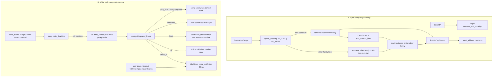

# Split-family origin DNS, write-stall congested-not-tear

| Field | Value |
| --- | --- |
| **Title** | Split-family origin DNS, write-stall congested-not-tear |
| **Author** | nya-link-aggregation maintainers |
| **Date** | 2026-09-01 |
| **Status** | Draft |
| **Audience** | Senior engineers working in `nya-core` hop / path IO / session send, `nya-server` outbound, and `nya-e2e` prod-like first-byte SLA |
| **Predecessor** | `docs/design-origin-he-io-backpressure.md` (deployed `bbb1349` / `cf94b09` fmt). Origin HE 20 ms CAD, DOWN close_notify, write deadline = `retry_after`, Instant-kept first RTT. |
| **Compatibility** | `PROTOCOL_VERSION` **stays 2** / ALPN `nya/2`. No new TOML keys. `[session]` stays `deny_unknown_fields`. One production `Tuning::STANDARD` (clone-and-mutate in tests). Path-agnostic offsets stay: one copy in flight, retry different `path_id`, first-arrival. **No concurrent k-copy.** `maybe_failback` stays off the send path. `chan` stays 64. Overlay `spawn_links` / `connect_pinned` (named IPs) **not** HE'd. |

---

## Overview

`bbb1349` landed origin Happy Eyeballs **after** `lookup_host`, TLS close_notify on DOWN, a write deadline equal to `retry_after`, and Instant-kept first RTT. Production on `prod-gz-yuusei` (window **02:16Z–03:11Z**, ~55 min, ~2500 streams) confirms the predecessor contracts that worked: `frame_send_drop` 49715/212 → **14/18**, `migrates_send_blocked` 1287 → **0**, path RTT latest **7.2–7.6 ms**, client unexpected-eof WARN **409 → 0**, `failbacks_*=0`, `all_down_resets=0`.

Two residuals did **not** land, and they are this design:

1. **Residual A — gstatic 205 ms is still ~1/15.5.** `nya.outbound.dial` `www.gstatic.com:443` n=31: 29× 1.8–4.1 ms, 1× 11.5 ms (CAD+IPv4 working), **2× 204.2 / 205.4 ms**. Same timer cluster as pre-HE (3/50 ≈ 1/17). Root cause: `connect_origin` awaits dual-stack `lookup_host` **then** races TCP. glibc `getaddrinfo(AF_UNSPEC)` waits for AAAA; the TCP race cannot start until lookup returns. HE CAD cannot beat a lookup that has not finished.
2. **Residual B+C — write deadline tears all six; `Exit::Child` abort skips close_notify.** `write_deadline() == retry_after() == loss_timeout(min_alive_fast)` is a **20 ms floor** on a 7 ms pool. `write_one` `timeout(deadline, send_frame)` on `TimedOut` returns `Err(TimedOut)` with **no log**. Supervisor `Exit::Child` **aborts without close_notify**. Production 02:56:22: all six down in 225 ms, 27 `path_id`s in 1.6 s, server unexpected-eof WARN 42 → **623**. Tearing even one dest under bulk rehomes unacked onto the remaining writers; they all miss 20 ms too.

**This design is two coupled-but-separable contracts.** Origin hostname lookup splits A / AAAA (`getaddrinfo(AF_INET)` ∥ `getaddrinfo(AF_INET6)`). The first family that returns addresses starts connecting immediately; the other family joins the race when it arrives, still CAD-spaced at `origin_connect_attempt_delay` = 20 ms = `loss_timeout_floor`. Write timeout is **congested, not Child-abort**: never cancel an in-flight `send_frame` (that poisons `FramedWrite`); mark the dest `write_stalled` / unschedulable; **read** continues (`tokio::io::split`); **ping send waits behind the in-flight flush** (one `FramedWrite`, TLS records ordered). Retry logic already skips `!is_schedulable()`. A permanently stuck writer is torn by *peer* `down_timeout` (~330 ms) with close_notify, not by a 20 ms `TimedOut` Child abort. Unknown / just-joined dests use `unknown_degrade_min` (300 ms) as `write_deadline`, not the 20 ms floor. Close_notify stays on Idle/Down; only true IO error / peer reset aborts without close. No new `[session]` TOML keys (`dns-lookup` is a Cargo dep, not `SessionOpts`). No proto bump. No overlay HE. F1 dual-stack public-internet e2e stays out of `catalog()`.

---

## Background & Motivation

### What already works (do not reopen)

Commit `bbb1349` (`docs/design-origin-he-io-backpressure.md`):

- `connect_origin` / `interleave_families` / `race_origin_addrs` / `race_origin_connects` in `crates/nya-core/src/hop.rs`. CAD = `Tuning::STANDARD.origin_connect_attempt_delay` = 20 ms. Literal IP is one connect. `JoinSet::abort_all` on first `Ok`. Nodelay only in the helper. Overlay `connect_pinned` / `spawn_links` unchanged.
- DOWN uses the Idle close_notify recipe (`FramedWrite::close`, join `ping_interval_max` 50 ms). Write child does not `return Ok` on `!is_alive` / `is_dead`. Unexpected-eof WARNs only if the path is still UP.
- Urgent `try_send` full → `set_congested` + drop + false; **never** `path_failed`. `retry_expired_unacked` success-gates `note_retry`; `retry_not_before` rate-limits. Ping-due arm in biased select.
- Instant kept in `late_ping`; unknown path no wall-clock; unknown Instant cap `unknown_degrade_min` 300 ms.
- e2e F2 `prod_like_silent_tear_no_eof_cascade`, F3 `prod_like_blocked_writer_no_drop_storm` are short catalog rows. F1 is **not** in `catalog()`.

Do not retune `loss_timeout_floor` / `down_min_silence` / `ping_interval_*` / `interactive_max`. Do not restore `maybe_failback`. Do not concurrent k-copy. Do not HE overlay link dial. Do not change `chan` 64.

### Production evidence (`prod-gz-yuusei`, 02:16Z–03:11Z, post-`bbb1349`)

New run_ids: server `20260901T021450Z-afcc40b0`, client `20260901T021534Z-5aa1d319`. Compared to last ~52 min of `f11f33f` (01:22Z–02:14Z) at similar load (~2500 streams, ~1.6–2.3 GB client tx).

#### What landed

| Series | `f11f33f` last 52 min | `bbb1349` 55 min |
| --- | --- | --- |
| `frame_send_drop` | 49715 / 212 | **14 / 18** |
| `migrates_send_blocked` | 1287 | **0** |
| Path RTT latest | — | **7.2–7.6 ms** |
| Path RTT max | 0.6–1.2 s | **90–296 ms** (Instant 300 ms cap) |
| `picks_unknown_over_known` | 12 | 0 |
| stream success | 98.9% | 99.4% |
| client unexpected-eof WARN | 409 | **0** |
| `failbacks_*` / `all_down_resets` | 0 | 0 |
| overlay `nya.open_us` p99 | — | 0.4 ms |

Literal-IP dests stay dest-shaped (175.99 ~23 ms, cloudflare ~3 ms). `173.249.210.102` p50 161 ms / max 2.2 s is origin soak — **not this bug**.

#### Residual A: gstatic 205 ms still 2/31 ≈ 1/15.5

`nya.outbound.dial` `www.gstatic.com:443`, n=31 in the new window:

```
29 × 1.8–4.1 ms
 1 × 11.5 ms     ← CAD+IPv4 (or slow-but-alive AAAA) working
 2 × 204.2 ms at 02:44:10.718 and 205.4 ms at 02:44:15.416
```

Same **timer** cluster as pre-HE (3/50 ≈ 1/17). Underlay direct IPv4 still ~10 ms. User generate_204 through overlay still ~every 15th ~200 ms.

Code: `crates/nya-core/src/hop.rs` `connect_origin`:

```375:382:crates/nya-core/src/hop.rs
pub async fn connect_origin(host: &str, port: u16, cad: Duration) -> io::Result<TcpStream> {
    if let Ok(ip) = host.parse::<IpAddr>() {
        return connect_and_nodelay(SocketAddr::new(ip, port)).await;
    }
    let addrs: Vec<SocketAddr> = tokio::net::lookup_host((host, port)).await?.collect();
    race_origin_addrs(addrs, cad).await
}
```

Tokio 1.53.1 `lookup_host` is `getaddrinfo(AF_UNSPEC)`. glibc waits for AAAA (nss-dns timeout / sequential A+AAAA / hanging AAAA). `race_origin_addrs` never sees the A records until that wait ends. The 11.5 ms sample is HE working **when lookup is fast**. The 205 ms samples are lookup, not connect.

A unit that **joins** both family lookups then races must take ≥ 180 ms against hang-AAAA fixtures (`sequential_join_then_race_waits_for_slow_family`). That is the merge gate for “do not wait for the slower family,” not live glibc `lookup_host` and not public-internet F1. Residual A in production is proven after PR 1 by Signoz `nya.lookup_a_us` vs `nya.dial_us`.

#### Residual B+C: write deadline tears all six

| | `f11f33f` last 52 min | `bbb1349` 55 min |
| --- | --- | --- |
| `path_down` = `join_ok` | 460 / 453 | **1606 / 1609 (×3.5)** |
| client unexpected-eof WARN | 409 | 0 |
| server unexpected-eof WARN | 42 | **623** |
| `path write failed` WARN | 6+1 | **0** (timeout is silent) |
| hedge / stream | 26.6 / 8.5 | 11.5 / 2.4 |

`write_deadline()` == `retry_after()` == `loss_timeout(min_alive_fast)` (`session/mod.rs` L431–443) → **20 ms floor** on a 7 ms pool. `write_one` (`path.rs` L791–796) `timeout(deadline, send_frame)` on `Err(_) => WriteOne::TimedOut`. Write child `return Err(TimedOut)` **without warn** (L690–694, L723–727, L756–760). Supervisor `Exit::Child` aborts without close_notify (`path.rs` L829–832).

Predecessor merge-gate said: urgent-full is congested **not** `path_failed`; write timeout **is** `path_failed`. That gate is now **falsified under bulk**: 20 ms TCP flush is common; tearing the dest + abort-without-close recreates the EOF cascade on the peer.

Production flap **02:56:22** (client path_ids 1275→1301, **27 path_ids in 1.6 s**):

```
02:56:22.262–.487  all six down (225 ms)
02:56:22.495–.709  all six added
02:56:22.766–.981  new six die in 74–270 ms
02:56:23.096–.477  another wave + nsix#0 tls connect timeout
```

Per-path recycle median gap **600–740 ms** during storms. Six paths down counts are uniform (~250–296 each) — not one bad ISP. `all_down_resets` stays 0 because reconnect is fast; the application still sees a hole.

Mechanism: dest 1 flush > 20 ms → `TimedOut` → `Exit::Child` abort (no close_notify) → `path_failed` → `rehome_unacked_from` dumps every in-flight offset onto dests 2–6 → those writers now have a burst + the same 20 ms deadline → they timeout → all six down. Peer sees abort-without-close (server unexpected-eof WARN 623). The just-joined replacements are unknown; first write still has a 20 ms deadline because `min_alive_fast` of the remaining pool (or floor) wins; they die in 74–270 ms.

Existing unit `write_timeout_tears_only_blocked_path` (`session/mod.rs` L3233–3254) **encodes the false gate**: it asserts `get_path(stall_id).is_none()`. That test is rewritten, not kept as a lock.

### Clocks (do not retune)

On a 7 ms path with `Tuning::STANDARD` + `SessionConfig` defaults:

| Clock | Formula | 7 ms path | This design |
| --- | --- | --- | --- |
| `loss_timeout` | `clamp(2×RTT, 20ms, 2000ms)` | **20 ms floor** | **unchanged**; still `retry_after` |
| `write_deadline` known dest | was `== retry_after` | 20 ms | **still** `retry_after` (stall mark, not tear) |
| `write_deadline` unknown / no `min_alive_fast` | was 20 ms floor | 20 ms (bug) | **`unknown_degrade_min` 300 ms** |
| `origin_connect_attempt_delay` | = `loss_timeout_floor` | **20 ms** | **unchanged**; not RFC 8305 250 ms |
| `ping_interval_max` | SessionConfig | **50 ms** | idle/DOWN close join; **not** unknown write bound |
| `down_min_silence` | 320 ms | **~330 ms** down | peer silent-down of a dest whose ping send is stuck behind a pinned flush; close_notify |
| `unknown_degrade_min` | 300 ms | Instant cap (predecessor D) | **also** unknown `write_deadline` |
| glibc AAAA wait / `TCP_RTO_MIN` | kernel / nss | **~200 ms** | must not sit in front of the TCP race |

Do not raise `loss_timeout_floor` to hide 200 ms. Do not use RFC 8305 250 ms CAD. Do not invent a new TOML key.

---

## Goals & Non-Goals

### Goals

1. **Split-family origin lookup.** A / AAAA resolutions run concurrently. First family that returns addresses starts connecting immediately. The other family joins the in-flight race when it arrives, CAD-spaced from the last start (skip CAD if already elapsed or no connect in flight). Literal IP still one connect. `origin_connect_attempt_delay` stays 20 ms. `race_origin_connects` `JoinSet::abort_all` on first success stays. Unit-inject: hang AAAA 200 ms, A in 1 ms → `connect_origin` / `race_origin_lookups` returns in **CAD + IPv4**, not 205 ms. Sequential **join** of both lookup futures then race **fails** that test (`sequential_join_then_race_waits_for_slow_family`).
2. **Write timeout is congested, not Child-abort.** If `send_frame` exceeds `write_deadline`, do **not** `path_failed` that 5-tuple, do **not** cancel the in-flight send (codec poison), do **not** `Exit::Child` abort. Mark the path write-stalled / unschedulable (`!is_schedulable()`). **Read continues** (`tokio::io::split`). **Ping send waits behind the in-flight flush** — `FramedWrite` is one sink; the outer `ping_due` arm cannot run until `write_one` returns. Unacked retry already rehomes to a different `path_id`. A permanently stuck writer is torn by **peer** `down_timeout` (~330 ms) with close_notify, not by a 20 ms `TimedOut` Child abort. Do not add a second “stalled-too-long” clock.
3. **Unknown / just-joined `write_deadline` is `unknown_degrade_min` (300 ms).** Not `loss_timeout_floor` (20 ms), not `ping_interval_max` (50 ms, still tight vs handshake), not `ack_rtt_max` (2 s). Cite existing Tuning field. Clone-and-mutate in tests.
4. **Every locally-initiated non-success write-child exit sends close_notify.** Idle, Down, `wait_dead`. Only true IO error / peer reset aborts without close. `Exit::Child` from `TimedOut` is the prod bug — after this ship `TimedOut` is **not an exit**.
5. **Logs that diagnose the two residuals at `logs.level=info`.** Span attrs on `nya.outbound.dial` for lookup family timings; one `info` when `dial_us >= 100ms`. One `info` `path write stalled` per stall **episode**, not per frame, not `path_failed`. Snapshots stay denylisted (`nya_core::obs=off` in OTLP log filter). Do not info every 204 HE winner. Do not per-stream info on the data path.
6. **e2e simulates the two write environments separately.** DNS AAAA hang is a unit gate (not F1 in `catalog()`). **Infinite HOL** (`set_conn_stall`): other five stay up; `path_down` delta **≤ 1** (stalled dest may peer-silent-down at ~330 ms); **never** all-six-down in 600 ms; `frame_send_drop` ~0; n=16 first-byte p99 ≪ 120 ms. **Slow-but-alive flush** is **not** a `transmit` sleep: pace the **fwd ingress read** (same `select` arm as `blocked`) with an RTO-shaped `sleep_until(fwd_next_read)` arm (`if paced`, so the impair still reads after inflight empties) and **fill the overlay kernel send buffer** so `send_frame` actually blocks > 20 ms, then still *completes*. Pass: observe `write_stalled` **and** `path_down` delta **== 0**. Until that impair exists and is red on current main, the unit six-`start_path` duplex tests are the 02:56:22 lock — not a green-on-main F3b. Existing `prod_like_*`, `delay_60ms`, `delay_200ms` stay green.

### Non-goals

- RFC 8305 250 ms CAD.
- Raising `loss_timeout_floor` / `down_min_silence` / `ping_interval_*` / `interactive_max`.
- Concurrent k-copy / restore `maybe_failback`.
- Happy Eyeballs on overlay `spawn_links` / `connect_pinned`.
- IPv4-only origin policy.
- New TOML / `PROTOCOL_VERSION` bump / new Prometheus names.
- Dual-stack public-internet F1 in `catalog()` (predecessor parked; still parked).
- Class 1 µs info chatter (parked since design-5).
- Tearing the stalled 5-tuple on write timeout (rejected; see Alternatives). If an implementer ships tear-this-one, it **must** take the Down close_notify path and must **not** use a 20 ms deadline on unknown dests — production 02:56:22 still prefers congested-not-tear, so this document does not leave that fork open.

---

## Proposed Design



### A. Split-family origin lookup

**Contract:** A dual-stack origin whose AAAA lookup hangs ~200 ms must not add those 200 ms to user TTFB when A is already in hand. IPv4-only and literal-IP dests must not change. Overlay link dial must not change. CAD stays 20 ms. No RFC 8305 250 ms.

#### A1. Why HE-after-lookup is not HE

`race_origin_connects` is correct **once addresses exist**. Production gstatic 205 ms is **before** the first `TcpStream::connect`. The 11.5 ms sample proves CAD+IPv4 works when `lookup_host` returns fast. The 2/31 205 ms samples are `getaddrinfo(AF_UNSPEC)` waiting on AAAA.

Do **not** use RFC 8305 250 ms CAD. Do **not** retune `origin_connect_attempt_delay`. Do **not** add a TOML key.

#### A2. Production lookup: parallel `getaddrinfo` per family

Tokio **1.53.1** (`Cargo.lock`) `tokio::net::lookup_host` is `ToSocketAddrs` → `getaddrinfo(AF_UNSPEC)` with **no family filter**. `std::net::ToSocketAddrs` in `spawn_blocking` is the same call. `nya-core` is `#![forbid(unsafe_code)]` (`lib.rs` L19), so in-tree `libc::getaddrinfo` is out. Hickory is **not** in `Cargo.lock`. Workspace `libc` exists (`Cargo.toml` L32; `nya-obs` uses it) but nya-core does not depend on it today.

Pin **`dns-lookup = "4"`** (lock **4.0.1**) in `crates/nya-core/Cargo.toml`. It is a Cargo dep, **not** a `[session]` TOML key (`SessionOpts` still `deny_unknown_fields`, four keys). It wraps `getaddrinfo` with nsswitch `/etc/hosts`. Prefer `SockType::Stream` / `AddrFamily::{Inet, Inet6}` so nya-core does **not** take a `libc` dep. Do not pull hickory.

```rust
// crates/nya-core/src/hop.rs

#[derive(Clone, Copy, Debug, PartialEq, Eq)]
pub enum OriginFamily {
    V4,
    V6,
}

fn lookup_family_blocking(host: &str, port: u16, family: OriginFamily) -> io::Result<Vec<SocketAddr>> {
    use dns_lookup::{AddrFamily, AddrInfoHints, LookupError, LookupErrorKind, SockType, getaddrinfo};
    let hints = AddrInfoHints {
        socktype: SockType::Stream.into(),
        address: match family {
            OriginFamily::V4 => AddrFamily::Inet.into(),
            OriginFamily::V6 => AddrFamily::Inet6.into(),
        },
        ..AddrInfoHints::default()
    };
    match getaddrinfo(Some(host), Some(&port.to_string()), Some(hints)) {
        Ok(iter) => Ok(iter
            .filter_map(Result::ok)
            .map(|a| a.sockaddr)
            .filter(|a| match family {
                OriginFamily::V4 => a.is_ipv4(),
                OriginFamily::V6 => a.is_ipv6(),
            })
            .collect()),
        Err(e) if is_family_empty(&e) => Ok(Vec::new()),
        Err(e) => Err(e.into()), // LookupError: From → io::Error; no Uncategorized wrap
    }
}

fn is_family_empty(e: &LookupError) -> bool {
    // Locale-independent. glibc gai_strerror is translated; do not match English.
    // EAI_NONAME / EAI_NODATA / EAI_ADDRFAMILY / EAI_AGAIN / EAI_SOCKTYPE.
    matches!(
        e.kind(),
        LookupErrorKind::NoName
            | LookupErrorKind::NoData
            | LookupErrorKind::Family
            | LookupErrorKind::Again
            | LookupErrorKind::Socktype
    )
}
```

Empty-family (`Ok(vec![])`): this family has nothing; continue with the other. SERVFAIL / timeout (`Again`) on **one** family: same. **Unknown** `LookupErrorKind` (Fail / Memory / System / IO / Unknown): return `Err` from `lookup_family_blocking`. The coordinator (A4) treats a one-family `Err` as an empty queue for that family, keeps `last_err`, and only returns `AddrNotAvailable` (or that last error) when **both** families have finished with no addresses. Do **not** fail the whole dial because AAAA SERVFAIL'd while A has addrs.

Do **not** set `AI_V4MAPPED` / `AI_ADDRCONFIG`. IPv4-mapped `::ffff:` partitions as v6 if they appear; do not unmap (predecessor A2). Do **not** match `e.to_string()` / `gai_strerror` substrings.

Production async wrapper:

```rust
async fn lookup_family(host: String, port: u16, family: OriginFamily) -> io::Result<Vec<SocketAddr>> {
    tokio::task::spawn_blocking(move || lookup_family_blocking(&host, port, family))
        .await
        .unwrap_or_else(|e| Err(io::Error::new(io::ErrorKind::Other, e)))
}
```

`spawn_blocking` cannot be aborted. After the TCP race wins, the slower `getaddrinfo` may still occupy a blocking thread until it returns (typically the 205 ms AAAA wait, not a 5 s hang). Tokio's blocking pool default is 512; origin dial rate is tens/s. **Do not** wait for the slower lookup on the success path. **Do not** add a lookup timeout (that invents a clock). Drop the JoinHandle.

#### A3. Injectable seam: `race_origin_lookups`

Keep `race_origin_connects` (already-ordered connect futures) and `interleave_families` (complete list). They stay unit-tested. Production `connect_origin` **stops** calling `lookup_host` then `race_origin_addrs`.

```rust
type FamilyLookup = Pin<Box<dyn Future<Output = io::Result<Vec<SocketAddr>>> + Send>>;
type OriginConnect = Pin<Box<dyn Future<Output = io::Result<TcpStream>> + Send>>;

/// Unit-test seam. `v4` / `v6` are lookup futures, not connect futures.
/// First family that returns addrs starts connecting immediately.
pub async fn race_origin_lookups(
    v4: FamilyLookup,
    v6: FamilyLookup,
    cad: Duration,
    connect: impl Fn(SocketAddr) -> OriginConnect + Send + 'static,
) -> io::Result<TcpStream> {
    race_origin_lookups_meta(v4, v6, cad, connect)
        .await
        .map(|d| d.tcp)
}

pub struct OriginDial {
    pub tcp: TcpStream,
    pub meta: OriginDialMeta,
}

#[derive(Clone, Debug, Default)]
pub struct OriginDialMeta {
    pub lookup_a_us: Option<u64>,
    pub lookup_aaaa_us: Option<u64>,
    /// `None` = that lookup still pending at return; `Some(0)` = completed empty.
    pub n_v4: Option<u32>,
    pub n_v6: Option<u32>,
    /// `"v4"` | `"v6"` | `"literal"`
    pub winner: &'static str,
}
```

`connect_origin` keeps returning `io::Result<TcpStream>` so existing hop tests (`connect_origin_literal_ipv4`) stay. It records span attrs from `OriginDialMeta` internally (A6). Tests that need meta call `connect_origin_meta` (same body, returns `OriginDial`). Outbound uses `connect_origin_meta` so the slow-dial `info` has fields without reading span internals.

```rust
pub async fn connect_origin(host: &str, port: u16, cad: Duration) -> io::Result<TcpStream> {
    connect_origin_meta(host, port, cad).await.map(|d| d.tcp)
}

pub async fn connect_origin_meta(host: &str, port: u16, cad: Duration) -> io::Result<OriginDial> {
    if let Ok(ip) = host.parse::<IpAddr>() {
        let tcp = connect_and_nodelay(SocketAddr::new(ip, port)).await?;
        return Ok(OriginDial {
            tcp,
            meta: OriginDialMeta {
                winner: "literal",
                ..OriginDialMeta::default()
            },
        });
    }
    let host_v4 = host.to_string();
    let host_v6 = host.to_string();
    race_origin_lookups_meta(
        Box::pin(lookup_family(host_v4, port, OriginFamily::V4)),
        Box::pin(lookup_family(host_v6, port, OriginFamily::V6)),
        cad,
        |a| Box::pin(connect_and_nodelay(a)) as OriginConnect,
    )
    .await
}
```

`race_origin_addrs` stays for complete-list callers / tests. It does **not** split lookup. A test named `sequential_join_then_race_waits_for_slow_family` **joins** both injectable lookup futures then calls `race_origin_addrs` and **asserts elapsed ≥ 180 ms** against hang-AAAA fixtures. That proves sequential *join* waits; it does **not** claim to exercise Tokio/`getaddrinfo(AF_UNSPEC)`. Residual A in production is Signoz `nya.lookup_a_us` vs `nya.dial_us` after PR 1.

#### A4. Race coordinator when families arrive at different times

```mermaid
sequenceDiagram
  participant D as connect_origin_meta
  participant A as AF_INET getaddrinfo
  participant AAAA as AF_INET6 getaddrinfo
  participant R as OriginRace JoinSet
  D->>A: spawn_blocking
  D->>AAAA: spawn_blocking
  A-->>D: A in 1ms, n_v4=1
  D->>R: start v4[0] immediately
  Note over R: CAD 20ms timer running
  R-->>D: TcpStream Ok at ~5–10ms
  D->>R: abort_all losers
  Note over AAAA: still pending; JoinHandle dropped
  D-->>D: return; lookup_aaaa_us = None
```

State:

| Field | Role |
| --- | --- |
| `v4_q` / `v6_q` | `VecDeque<SocketAddr>` not yet started |
| `set` | `JoinSet<io::Result<TcpStream>>` in-flight connects |
| `last_start` | `Option<Instant>` of last `set.spawn` |
| `last_family` | `Option<OriginFamily>` of last start (next start prefers the other) |
| `v4_done` / `v6_done` | lookup completed? |
| `last_err` | last connect or lookup hard-fail |

On a family lookup `Ok(addrs)`:

1. Record `lookup_a_us` / `lookup_aaaa_us` = elapsed of **that** lookup future (not total dial). Set `n_v4` / `n_v6` = `Some(len as u32)` including `Some(0)` for completed empty. Leave the other family's `n_*` **`None`** until that lookup completes.
2. Push addrs onto that family's queue **in getaddrinfo order**.
3. If `set` is empty (nothing in flight): `start_next` immediately (do not wait CAD).
4. Else if `last_start.elapsed() >= cad`: `start_next` immediately.
5. Else: wait remaining CAD as today.

`start_next`:

1. Prefer the **other** family than `last_family` if that queue is non-empty; else the same family; else the only non-empty queue.
2. Pop one addr, `set.spawn(connect(addr))`, set `last_start` / `last_family`.
3. Hard-fail of a connect (`Ok(Err(_))`): `start_next` immediately (predecessor A3.5 — do not wait CAD). Loopback v6 with nothing listening stays fast.
4. First `Ok(Ok(tcp))`: `abort_all`, drain joins, return `OriginDial` with `winner` = family of the winning addr (`tcp.peer_addr()` is_ipv4 / is_ipv6; literal already returned).
5. Both lookups done, both queues empty, `set` empty: `Err(last_err or AddrNotAvailable)`. A one-family lookup `Err` (not `is_family_empty`) is stored as `last_err` and that family's queue stays empty; do **not** fail the dial while the other family can still produce addrs.

`race_origin_connects` today (`hop.rs` L431–460, **not** `path.rs`) selects only JoinSet + CAD. The new coordinator must also poll the two lookup futures for the **whole** race, including after the first connect has started (`second_family_joins_race_prefers_other_family`). Copying the old two-arm select and only starting lookups up front will miss late AAAA.

Four-arm `select!` (pin `v4` / `v6` lookup futures):

```rust
tokio::select! {
    r = &mut v4_fut, if !v4_done => { /* record lookup_a_us / n_v4; push v4_q; maybe start_next */ }
    r = &mut v6_fut, if !v6_done => { /* record lookup_aaaa_us / n_v6; push v6_q; maybe start_next */ }
    Some(joined) = set.join_next(), if !set.is_empty() => { /* Ok(tcp) → abort_all, drop lookup handles, return
                                                              Ok(Err) → last_err, start_next immediately */ }
    _ = tokio::time::sleep_until(last_start + cad), if !v4_q.is_empty() || !v6_q.is_empty() => {
        start_next();
    }
}
```

On first `Ok(tcp)`: `set.abort_all()`, drain joins, **drop** the lookup JoinHandles / pinned futures (do not await AAAA). `more` for the CAD arm is “either queue non-empty.” When a lookup is still pending, do **not** treat “no addrs yet” as failure. CAD remaining is `cad.saturating_sub(last_start.elapsed())`; if `last_start` is `None` (nothing started), the lookup-complete path starts immediately and does not wait CAD.

When the second family arrives after the first connect already started, the **next** start prefers that new family. Example: A returns `[v4a, v4b]`, we started `v4a`; AAAA later returns `[v6a]`; next start is `v6a` (CAD from `v4a`), then `v4b`. This is the streaming version of `interleave_families`.

IPv4-only dest: AAAA lookup returns empty quickly; queue is v4-only; first starts immediately; CAD starts the next A only if the first hangs — same as today’s IPv4-only.

AAAA-only dest (no A): A returns empty; we wait for AAAA. If AAAA is the 205 ms hang, TTFB is 205 ms + connect. **Unavoidable** — there is no IPv4 to race. Production gstatic **has** A (29× 2 ms). Do not special-case.

Do not restart CAD from zero when the second family arrives if CAD already elapsed.

#### A5. `connect_origin` call site

`crates/nya-server/src/outbound.rs` already calls `connect_origin(..., Tuning::STANDARD.origin_connect_attempt_delay)` under span `nya.outbound.dial`. Switch to `connect_origin_meta` so slow-dial `info` has lookup fields. Do **not** change `tls.rs` `connect_pinned` or `nya-client` `spawn_links`.

#### A6. Span attrs and the one slow-dial `info`

Declare Empty fields on the existing span (`outbound.rs` L19–26):

```rust
let span = tracing::info_span!(
    target: "nya_otel",
    "nya.outbound.dial",
    otel.kind = "client",
    server.address = %target,
    otel.status_code = tracing::field::Empty,
    nya.dial_us = tracing::field::Empty,
    nya.lookup_a_us = tracing::field::Empty,
    nya.lookup_aaaa_us = tracing::field::Empty,
    nya.n_v4 = tracing::field::Empty,
    nya.n_v6 = tracing::field::Empty,
    nya.winner = tracing::field::Empty,
);
```

After `connect_origin_meta` returns (Ok or map-err from inner), record what exists:

| Attr | When recorded |
| --- | --- |
| `nya.dial_us` | always (already) |
| `nya.lookup_a_us` | A lookup **completed** before return (`Some`) |
| `nya.lookup_aaaa_us` | AAAA lookup **completed** before return (`Some`) |
| `nya.n_v4` / `nya.n_v6` | **only when `Some`**. `None` = still pending; `Some(0)` = completed empty. Never record `0` for a pending family |
| `nya.winner` | `"v4"` / `"v6"` / `"literal"` on success only |

If we win on IPv4 at 11 ms with AAAA still pending: `lookup_aaaa_us` omitted, `n_v6` omitted (`None`, not `0`), `winner=v4`. That is the success signature of Residual A — Signoz must not read `n_v6=0` as “IPv6-empty dest.” If a 205 ms dial remains after this ship, traces show whether `lookup_aaaa_us≈205e3` (still lookup) or lookup was fast and connect hung (kernel SYN — different bug).

**Info log** (required). Not every 2 ms dial. Threshold **100 ms** (`dial_us >= 100_000`), not `loss_timeout_floor` (20 ms would fire on CAD+IPv4 ~30 ms and is too chatty). Body **`outbound dial slow`**. Once per dial that crosses the threshold.

```rust
// outbound.rs, inside the span, both Ok and Err paths when dial_us >= 100_000.
// Record span attrs only when Some (same rule as the table).
tracing::info!(
    lookup_a_us = meta.lookup_a_us,
    lookup_aaaa_us = meta.lookup_aaaa_us,
    n_v4 = meta.n_v4,   // Option<u32>: None omitted, Some(0) = empty
    n_v6 = meta.n_v6,
    winner = meta.winner, // "" on fail
    dial_us,
    "outbound dial slow"
);
```

Host is already `server.address` on the span. Do not info every HE winner. Do not add a Prometheus counter (`nya.dial_us` exists). Snapshots stay denylisted (`nya-obs/src/subscribe.rs` `otel_log_filter`: `nya_core::obs=off`).

If this `tracing` version does not implement `Value` for `Option<u32>`, `span.record` / `info!` only when `Some` (`if let Some(n) = meta.n_v4 { span.record("nya.n_v4", n); }`). Never record a pending family as `0`.

Export `connect_origin_meta` / `OriginDial` / `OriginDialMeta` / `race_origin_lookups` from `crates/nya-core/src/lib.rs` next to the existing hop exports.

---

### B. Write timeout is congested, not Child-abort

**Contract:** A 20 ms TCP flush on a live 7 ms dest does **not** `path_failed` that 5-tuple. The dest becomes unschedulable until a write completes within `write_deadline`. TCP stays up. Siblings stay up. Unacked already retries a different `path_id`. **Read** continues. **Ping send waits** behind the pinned `send_frame`. Local Down (`wait_dead`) still close_notify. A permanently stuck writer is torn by **peer** `down_timeout` (~330 ms) with close_notify. Only a dead socket aborts without close.

#### B1. Why `timeout(deadline, send_frame)` is the bug

`tokio::time::timeout` **cancels** `send_frame` at the deadline. Cancelling `FramedWrite::send` mid-length-delimited frame poisons the codec. The predecessor correctly refused to reuse a poisoned sink — and therefore `return Err(TimedOut)` → `Exit::Child` abort → no close_notify. That is internally consistent and production-wrong.

Two options after cancel:

| Option | Codec | TCP | Peer EOF | All-six |
| --- | --- | --- | --- | --- |
| Tear this dest (`path_failed`) | drop poisoned sink | abort | unexpected-eof if no close; close_notify if Down-join | **02:56:22**: unacked rehomes, siblings miss 20 ms |
| Re-enqueue frame, keep dest | **poisoned** — cannot send again | would need new TLS | n/a | cannot keep dest |

Therefore: **do not cancel `send_frame`.** The deadline is a **schedulability** timer, not a tear timer.

#### B2. `write_one`: pin the send; stall arm does not abort it

Remove `WriteOne::TimedOut` as an **exit**. Keep the enum for the inner loop if useful, but the write child must not `return Err` on deadline.

```rust
enum WriteOne {
    Sent { stalled: bool },
    Closed,
    Io(std::io::Error),
}

async fn write_one<S>(
    writer: &mut S,
    close_rx: &mut tokio::sync::oneshot::Receiver<()>,
    deadline: Duration,
    ping_max: Duration,
    session: &Session,
    path: &PathState,
    frame: Frame,
) -> WriteOne
where
    S: Sink<Bytes, Error = std::io::Error> + Unpin,
{
    let send = send_frame(writer, session, path, frame);
    tokio::pin!(send);
    let mut this_stalled = false;
    let t0 = tokio::time::Instant::now();
    loop {
        tokio::select! {
            biased;
            _ = &mut *close_rx => {
                let _ = tokio::time::timeout(ping_max, writer.close()).await;
                return WriteOne::Closed;
            }
            r = &mut send => {
                return match r {
                    Ok(()) => WriteOne::Sent { stalled: this_stalled },
                    Err(e) => WriteOne::Io(e),
                };
            }
            _ = tokio::time::sleep(deadline), if !this_stalled => {
                this_stalled = true;
                let first = !path.is_write_stalled();
                path.set_write_stalled(true); // flag only; does not log
                if first {
                    tracing::info!(
                        path = %path.name,
                        path_id = path.id,
                        waited_ms = t0.elapsed().as_millis() as u64,
                        deadline_ms = deadline.as_millis() as u64,
                        "path write stalled"
                    );
                }
            }
        }
    }
}
```

Write-child match:

| Arm | Action |
| --- | --- |
| `Sent { stalled: false }` | `path.set_write_stalled(false)`; continue loop |
| `Sent { stalled: true }` | **keep** `write_stalled`; continue loop (still slow; pick stays off until an on-time write) |
| `Closed` | `return Ok(())` — supervisor Idle/Down join already in progress |
| `Io(e)` | `warn!(..., "path write failed")` as today; `return Err(e)` — socket dead |

Ping / urgent / bulk arms all use this exhaustive match. **No** `WriteOne::TimedOut => return Err(TimedOut)`.

`send_on_path` already `set_congested(false)` on successful **enqueue**. That must **not** clear write-stall (a stalled `send_frame` still has mpsc room for 63 more frames). Separate flag.

#### B3. `PathState.write_stalled` and `is_schedulable`

```rust
// path.rs PathState
/// Writer send_frame exceeded write_deadline. Pick must skip; TCP stays up.
write_stalled: AtomicBool,
```

Init `false` in `with_writers`.

```rust
pub fn is_write_stalled(&self) -> bool {
    self.write_stalled.load(Ordering::Relaxed)
}

pub fn set_write_stalled(&self, v: bool) {
    self.write_stalled.store(v, Ordering::SeqCst);
}

pub fn is_schedulable(&self) -> bool {
    self.is_up() && !self.is_congested() && !self.is_write_stalled()
}
```

**Single log site: `write_one` (B2).** `set_write_stalled` is a flag store only — do **not** log there (copying a log into both sites double-infos). Body **`path write stalled`**. Fields: `path`, `path_id`, `waited_ms` = **`t0.elapsed()`** (not a copy of `deadline`), `deadline_ms` = `deadline.as_millis()`. **Not** `path_failed`. **Not** warn (timeout is not a dead socket). `debug` is too quiet for prod (`logs.level=info`); this hole caused the last misread (timeout was silent).

Once per episode: `write_stalled` false→true. A chronically 25 ms dest infos once, then stays stalled until an on-time `Sent { stalled: false }`. After recovery, the next stall may info again. That is the 02:56:22 diagnostic, not 20/s.

`is_schedulable` is already the early pick/retry/affinity gate (`scheduler.rs` L104, L113, L328, L385, L434–437, L495–504, L540, L584, L618, L642; `session/mod.rs` `interactive_affinity` L397). No scheduler signature change. `pick_retry_path` **last rungs are `is_alive()`, not `is_schedulable()`** (`scheduler.rs` L505–511). `fastest_class_set` falls back to `is_up()` then all alive when no schedulable dest remains (L116–121). A pool of six with **one** stalled still has five schedulable dests. If **all six** miss a 20 ms flush they all stall-mark, stay UP, and new streams still land on stalled writers via that fallback — accepted TTFB hole vs cascade (Risks). **Do not** last-rung skip `write_stalled` or Interactive can have nowhere to go.

Do **not** `path_failed` from the stall arm. Do **not** bump `frame_send_drop` (the frame is not dropped; it is still flushing). Unacked `last_sent` was set at enqueue (`send_data`); `retry_after` 20 ms later `pick_retry_tried` skips this dest (`!is_schedulable`) and sends on an alt — path-agnostic one-copy-then-retry, **not** k-copy. If the stalled send later completes, first-arrival still wins.

#### B4. Unknown / just-joined `write_deadline`

Split `write_deadline` from `retry_after`. `retry_after` stays `loss_timeout(min_alive_fast)` (TTFB rehome; do not reopen predecessor C). `write_deadline` is the flush bound.

```rust
// session/mod.rs — replace L441–443
pub(crate) fn write_deadline(&self, path_id: u32) -> Duration {
    let this_unknown = self
        .get_path(path_id)
        .map(|p| !p.rtt_known())
        .unwrap_or(true);
    if this_unknown || self.min_alive_fast_rtt().is_none() {
        self.inner.cfg.tuning.unknown_degrade_min // 300 ms
    } else {
        self.retry_after(path_id) // loss_timeout(min_alive_fast); 20 ms on a 7 ms pool
    }
}
```

| Dest | Pool | `retry_after` (unacked) | `write_deadline` (flush) |
| --- | --- | --- | --- |
| known 7 ms | 7 ms | 20 ms floor | **20 ms** — stall mark if flush misses |
| unknown / just-joined | 7 ms live siblings | 20 ms (min_alive_fast) | **300 ms** — first write must not stall-flap handshake |
| unknown | no known dests | this-path `loss_timeout` / floor | **300 ms** |
| known 180 ms only | no faster | 360 ms | 360 ms |

`ping_interval_max` 50 ms is still tight vs a just-joined dest (02:56:22 new six die in 74–270 ms). `ack_rtt_max` 2 s is the Instant-keep ceiling, not a write bound. `unknown_degrade_min` is the existing unknown cap (predecessor D; `delay_60ms` / `delay_200ms` already live under it). **No new Tuning field. No TOML.**

Unit `write_deadline_unknown_dest_is_unknown_degrade_min`: `start_path` (no `record_rtt`), `inject_live` 7 ms sibling, `write_deadline(stall_id) == unknown_degrade_min`. Unit `write_deadline_known_fast_pool_is_floor`: `record_rtt(7ms)` on the dest, `write_deadline == loss_timeout_floor`.

#### B5. Supervisor table (TimedOut is gone)

```698:836:crates/nya-core/src/path.rs
        match exit {
            Exit::Idle | Exit::Down => {
                let _ = close_tx.send(());
                let _ = tokio::time::timeout(ping_max, &mut write_task).await;
                read_task.abort();
                write_task.abort();
            }
            Exit::Child => {
                read_task.abort();
                write_task.abort();
            }
        }
```

| Event | Action | close_notify? |
| --- | --- | --- |
| `wait_dead` **Idle** | close_tx, join 50 ms, abort leftovers, `path_failed`, `done.send` | **yes** |
| `!is_alive` **Down** (maintain silent-tear) | same as Idle | **yes** |
| Write `Io` (reset, broken pipe, true `send_frame` error) | `Exit::Child` abort immediately | **no** — socket dead |
| Read IO / unexpected-eof while UP | `Exit::Child` abort | **no** |
| Read unexpected-eof while `!is_alive` | debug, `Ok` from read child → Child; path already Down | n/a |
| **Write deadline exceeded** | **not an exit** | n/a |
| Channel closed (`urgent`/`bulk` `None`) while session alive | `Err(BrokenPipe)` Child abort | no (session dying races Idle) |
| `path_failed` while `send_frame` blocked | close_rx fires (Down), `timeout(ping_max, close())`, `done` within 500 ms | yes, bounded |

`path_failed_completes_add_path` and `path_failed_during_blocked_write_completes_add_path` stay green.

Do not log every close. Unexpected-eof WARN policy **unchanged**: debug if `!is_alive`, WARN if still UP (`is_tls_unexpected_eof` kind-only). After this ship, client-initiated write-timeout must **not** produce a server unexpected-eof storm — we no longer abort the writer on timeout. Server unexpected-eof 623 is the rollback canary.

#### B6. Ping send waits behind the flush; peer silent-down tears a permanently stuck dest

Predecessor C bounded worst ping delay to one `write_deadline` (20 ms) because `timeout` cancelled `send_frame`. This design **removes that bound** by pinning the send.

While `send_frame` is pinned:

- The outer `ping_due` / urgent / bulk arms **do not run**. Local Ping frames are not written.
- Incoming Ping → `handle_frame` `try_send` Pong onto urgent mpsc (`session/mod.rs` L343–350) queues up to `chan` 64, then `set_congested`. Those Pongs **do not hit the wire** until the in-flight send completes.
- **Read continues.** `spawn_path_io` already splits with `tokio::io::split` (`path.rs` L576–578, L597) so a blocked write does not starve `reader.next()`.
- Local `last_rx` can stay fresh (peer still sending). That does **not** keep the *peer’s* `last_rx` fresh: we are silent *to the peer* for the whole pinned flush.

Two environments (do not conflate):

| Environment | `send_frame` | Ping send | Peer `last_rx` | Teardown |
| --- | --- | --- | --- | --- |
| **Slow-but-alive flush** (prod 02:56:22: 25–50 ms then `Sent`) | completes past 20 ms | goes out **between** frames (~every 25 ms if chronically 25 ms) | stays fresh | dest stays UP, `write_stalled` until an on-time write |
| **Infinite HOL** (`set_conn_stall`: pause client→server read forever) | never completes | **never** leaves | ages | peer `down_timeout` ≈ **330 ms** (`steer.rs` `down_for` L576–586, `tuning.rs` `down_min_silence` 320 ms) → Exit::Down close_notify → our read EOF → `path_failed` **this dest only** |

Congested-not-tear still prevents the 02:56:22 **rehome dump** (unacked does not `path_failed` at 20 ms onto siblings). It does **not** mean “ping continues” on a permanently full send buffer.

Do **not** add a second “stalled-too-long → path_failed” clock. Peer `down_timeout` already exists. If `close()` blocks on the same stuck flush, `timeout(ping_max)` then abort leftovers. Peer may see unexpected-eof **if** the 50 ms join expires; that is already debug on `!is_alive`.

#### B7. Rewrite the false gate unit

Replace `write_timeout_tears_only_blocked_path` (`session/mod.rs` L3233–3254):

```rust
#[tokio::test]
async fn write_stall_does_not_tear_blocked_path() {
    let client = Session::new_client(SessionConfig::default());
    let (a, _peer) = duplex(8);
    let done = client.start_path("stall".into(), a);
    let stall_id = *client.inner.paths.lock().unwrap().keys().next().unwrap();
    client.get_path(stall_id).unwrap().record_rtt(Duration::from_millis(7));
    let _live = inject_live(&client, 99, "live#0", 7);
    let ping = Frame::Ping(nya_proto::Ping { seq: 1, sent_at_ms: 0 });
    for _ in 0..80 {
        let _ = client.send_on_path(stall_id, ping.clone());
    }
    tokio::time::sleep(Duration::from_millis(80)).await;
    let stall = client.get_path(stall_id).expect("blocked writer must stay up");
    assert!(stall.is_alive(), "write stall is not path_failed");
    assert!(stall.is_write_stalled(), "deadline on known dest marks write_stalled");
    assert!(!stall.is_schedulable());
    assert!(client.get_path(99).is_some(), "sibling dest must stay up");
    assert_eq!(client.snapshot().path_down, 0);
    drop(done);
    client.shutdown();
}
```

New: `write_stall_on_one_of_six_leaves_six_up` — **six real `start_path` duplex(8) writers** (each with `spawn_path_io`). Flood dest 1, sleep 80 ms (`< down_min_silence`, no peer maintain). `alive_path_count()==6`, `path_down==0`, dest 1 `is_write_stalled`, dests 2–6 `!is_write_stalled`. **Do not** use `inject_live` siblings here: `inject_live` (`session/mod.rs` L2385–2409) inserts a `PathState` with held mpsc receivers and **no** `spawn_path_io`, so those dests cannot `path_failed` from a write timeout or a rehome burst. 02:56:22 tore dests 2–6 because `path_failed` dumped unacked onto *live writers* that then missed 20 ms. Keep `inject_live` for `write_deadline_*` and the unknown-just-joined test (those do not need sibling IO).

New: `write_stall_unknown_just_joined_does_not_stall_at_20ms` — `start_path` **without** `record_rtt`, `inject_live` 7 ms sibling, flood, sleep 80 ms, dest still up, **`!is_write_stalled`** (deadline 300 ms). Distinguishes B4 from “congested-not-tear with a 20 ms unknown deadline”.

Keep `urgent_full_on_one_leaves_five_up` (enqueue congestion, not write stall).

---

## API / Interface Changes

| Surface | Change |
| --- | --- |
| `PROTOCOL_VERSION` / ALPN | **unchanged** (2 / `nya/2`) |
| TOML / `SessionOpts` / `[session]` | **no new keys**, still `deny_unknown_fields` |
| `Tuning::STANDARD` | **no new field.** `origin_connect_attempt_delay` stays 20 ms. `unknown_degrade_min` reused as unknown `write_deadline`. Tests clone-and-mutate. |
| `nya-core` deps | pin `dns-lookup = "4"` (lock 4.0.1). Use `SockType::Stream` / `AddrFamily::{Inet, Inet6}` — **no** nya-core `libc` dep. Do **not** add hickory. Cargo dep, **not** a `[session]` key. Tokio 1.53.1 has no family-filtered lookup. |
| `connect_origin` | still `io::Result<TcpStream>`; **no** `lookup_host`. New `connect_origin_meta` / `OriginDial` / `OriginDialMeta` / `race_origin_lookups`. |
| `race_origin_addrs` / `race_origin_connects` / `interleave_families` | **kept**; not the production hostname path |
| `tls.rs` `connect_pinned` / `spawn_links` | **unchanged** |
| `outbound.rs` | `connect_origin_meta`; span attrs `nya.lookup_a_us`, `nya.lookup_aaaa_us`, `nya.n_v4`, `nya.n_v6`, `nya.winner`; `info` `outbound dial slow` iff `dial_us >= 100_000` |
| `PathState` | `write_stalled: AtomicBool`; `is_write_stalled` / `set_write_stalled`; `is_schedulable` also requires `!write_stalled` |
| `PathSnap` | add `write_stalled: bool` (e2e). **No** `catalog.rs` / Prometheus name |
| `Session::write_deadline` | **no longer** always `== retry_after`. Unknown / no `min_alive_fast` → `unknown_degrade_min` |
| `Session::retry_after` | **unchanged** |
| `spawn_path_io` `write_one` | no `TimedOut` exit; pin `send_frame`; stall arm sets `write_stalled` |
| `chan` | **64 unchanged** |
| Prometheus | **no new names** |

---

## Data Model Changes

No on-disk schema. No wire change. Session-memory only.

- `PathState.write_stalled: AtomicBool` — false at `with_writers`. Copied onto `PathSnap.write_stalled` for e2e (same as `congested`). **Not** a catalog / Prometheus name. Diagnosed in prod via the `path write stalled` info line. Infinite HOL may still increment `path_down` once via peer silent-down (~330 ms); a true slow-but-alive flush must not.
- `OriginDialMeta` — stack local to a dial; not stored on `Session`. `n_v4` / `n_v6` are `Option<u32>` (`None` = pending, `Some(0)` = completed empty).
- No migration. Rolling restart is v2↔v2. HE lookup split is server-only; write-stall is both roles.

---

## Alternatives Considered

### 1. Keep `lookup_host` then HE (status quo)

Falsified by 2/31 gstatic 205 ms after `bbb1349`. TCP race cannot start until AAAA returns. **Rejected.**

### 2. RFC 8305 250 ms CAD / raise CAD to cover lookup

CAD is a **connect** stagger, not a lookup wait. 250 ms **is** the user-visible 200 ms. **Rejected** (predecessor A1; still rejected).

### 3. IPv4-only origin policy

Skip AAAA. gstatic 205 ms goes away. Healthy IPv6 dests (cloudflare ~3 ms) lose IPv6. **Rejected** (predecessor non-goal).

### 4. Hickory / c-ares stub resolver for A vs AAAA queries

True parallel DNS, skips nsswitch `/etc/hosts` / search domains. Heavier dep; **not** in `Cargo.lock`. Production gstatic is public DNS; `/etc/hosts` still matters for internal names. **Rejected** as the first implementation. Tokio 1.53.1 cannot family-filter `lookup_host`; `dns-lookup` 4.0.1 is the nsswitch-preserving option. Revisit hickory only if AF_INET still waits on AAAA on a measured glibc (unexpected; AF_INET should not query AAAA).

### 5. Tear-this-one dest on write timeout, but Down close_notify instead of Child abort

Prompt allowed this fork. Production 02:56:22: tearing **even one** dest under bulk rehomes unacked onto the remaining writers; they all miss 20 ms too; all-six-down in 225 ms. Close_notify would fix the EOF WARN and **not** the all-six hole. Unknown 20 ms deadline would still kill the replacement wave (74–270 ms). **Rejected.** Congested-not-tear is the contract.

### 6. `timeout(deadline, send_frame)` then re-enqueue the frame

Cancelling `send` poisons `FramedWrite`. Re-enqueue cannot go out on that sink. Equivalent to tear or to leaking a half-written TLS record. **Rejected.**

### 7. Grow `chan` / raise `loss_timeout_floor` to 50–200 ms

Hides 20 ms flush behind a larger queue or a slower tear. `chan` 64 is not the bug (predecessor C2; `frame_send_drop` already 14/18). Raising the floor re-opens Interactive TTFB vs `TCP_RTO_MIN`. **Rejected.**

### 8. Unknown `write_deadline` = `ping_interval_max` (50 ms) or `ack_rtt_max` (2 s)

50 ms is still inside the 74–270 ms replacement-death window. 2 s holds a stalled dest schedulable for a full interactive RTO. `unknown_degrade_min` 300 ms is the existing unknown cap. **Rejected** those two; **picked** 300 ms.

### 9. Concurrent k-copy / overlay HE / `maybe_failback` / new TOML

User already rejected. **Rejected.**

---

## Security & Privacy Considerations

- No new frame, no new plaintext, no new handshake field. Origin dial is still `TcpStream` to `StreamOpen.target`.
- Split lookup issues the same `getaddrinfo` questions dual-stack already issues; we issue them as two family-filtered calls instead of one `AF_UNSPEC`. Extra SYNs on loser addresses already exist from HE; `abort_all` still runs on first `Ok`.
- `dns-lookup` uses system nsswitch (same trust as today’s `lookup_host`). Do not log resolved addresses at info (host is already `server.address`; winner is `"v4"`/`"v6"`, not the IP).
- Write-stall does not change TLS; close_notify on Down remains the standard clean shutdown. Abort-without-close stays only for a dead socket.
- Dual-stack e2e echo is local harness if present, not the public internet. Split-lookup correctness is unit-tested with injectable futures.

---

## Observability

No new Prometheus names. Prefer attributes on existing spans/logs.

| Signal | Success after this ship | Do not page |
| --- | --- | --- |
| `nya.outbound.dial` gstatic:443 | **p99 ≪ 200 ms**; no 205 ms cluster. Traces carry `nya.lookup_a_us` / `nya.lookup_aaaa_us` / `nya.winner`; `nya.n_v4`/`nya.n_v6` only when `Some` | cloudflare ~3 / 175.99 ~23 / 173.249 soak stay dest-shaped |
| `info` `outbound dial slow` | **rare** (2/31 of gstatic today; should collapse). Host + lookup fields; pending family omitted not `0` | do not info 2 ms dials |
| `path_down` / `handshake_join_ok` | **not ×3.5 vs quiet**; no 27 path_ids / 1.6 s; no all-six-down in 225 ms | nsix dual-down hygiene at ~330 ms may remain; **one** dest peer-silent-down under infinite HOL is expected |
| server unexpected-eof WARN | **collapses** toward 0 (timeout no longer aborts) | UP-path peer death still WARNs |
| `info` `path write stalled` | **visible at info** when a dest flush misses `write_deadline`; once per episode | not `path_failed`; not per frame |
| `frame_send_drop` | stays ~0 | — |
| `failbacks_*` / `all_down_resets` | 0 | — |
| class 1 µs info chatter | **out of scope** | — |

OTLP log filter **unchanged**: `nya_core::obs=off` so 10 s snapshots do not flood Signoz. `path write stalled` and `outbound dial slow` are `nya_core::path` / `nya_server::outbound` (or `nya_core::hop` if the info is emitted there) — **not** `nya_core::obs`. Do not put them on the snapshot target.

Alerts: page on overlay generate_204 / gstatic dial p99 if IPv4 to that dest is live (that p99 is also the all-six-`write_stalled` TTFB canary — pick fallback to `is_up` can still hole first-byte without `path_down`). Page on all-six-down storms (`path_down` rate + unexpected-eof). Do not page on a single `path write stalled` (that is the working congested signal). Do not page on a single dest `path_down` at ~330 ms under a true HOL stall.

---

## Rollout Plan

Single production `Tuning::STANDARD`, both ends already on v2. **No feature flag.** No new TOML.

1. **PR 1 (server-only) can land first:** split-family lookup. Unblocks gstatic 1/15 205 ms without touching path IO. Rollback restores `lookup_host` then race (205 ms returns).
2. **PR 2 (both roles) is the control-plane ship:** write-stall congested-not-tear + unknown `write_deadline` + `path write stalled` info + unit/e2e gates. Deploy **client and server together**. A mixed fleet (new server, old client still tearing on 20 ms) still sees peer EOF on the old side — ship together.
3. Watch 45 min on `prod-gz-yuusei`:
   - Manual overlay generate_204: **no ~1/15 200 ms**.
   - `nya.outbound.dial` gstatic:443: no 205 ms cluster; slow-dial `info` either absent or shows lookup vs connect.
   - `path_down` not ×3.5; no 02:56:22 all-six in 225 ms; no 27 path_ids / 1.6 s.
   - server unexpected-eof WARN collapses; `path write stalled` is the new visible signal.
   - `frame_send_drop` ~0; `failbacks_*=0`; `all_down_resets=0`; linger ≠ timeout.
   - dest-shaped origin RTTs stay dest-shaped.
4. **Rollback:** revert PR 2 first if path_down/EOF regress; revert PR 1 if lookup splits mis-resolve (empty both families). Wire stays v2. A writer cascade that `path_failed`s all six is **worse** than leaving gstatic 1/17 205 ms — do not revert PR 2 onto a “tear on timeout” half-fix.

---

## Risks

| Risk | Sev | Mitigation |
| --- | --- | --- |
| `getaddrinfo(AF_INET)` still waits on AAAA on some nss module | Med | Unit gate is injectable lookups, not live glibc. If prod gstatic 205 ms remains **and** `nya.lookup_a_us≈205e3`, follow up with hickory A/AAAA (alt 4). Measure before switching |
| `spawn_blocking` AAAA occupies a thread after IPv4 won | Low | Drop JoinHandle; pool 512; wait is the same 205 ms glibc already paid |
| Empty-family error classification too narrow (SERVFAIL vs NODATA) | Med | Match `LookupError::kind()` / `error_num()` (EAI_*), never locale strings. Unknown kind → empty queue if the other family can still produce addrs; `AddrNotAvailable` only when both fail |
| Chronically 25 ms dest stays `write_stalled` forever | Low | Next on-time `Sent { stalled: false }` clears. Pick uses the other five. Ping still goes **between** frames so peer `last_rx` stays fresh |
| Infinite HOL: ping never leaves, peer Downs this dest at ~330 ms | Med | Expected. F3 `path_down` delta **≤ 1**. Not 02:56:22 (that was 20 ms Child-abort rehome). Do not add a stalled-too-long clock |
| All six dests stall-mark (bulk every flush > 20 ms) | Med | Accepted TTFB hole vs cascade. `pick_retry_path` last rungs stay `is_alive()` (`scheduler.rs` L505–511); `fastest_class_set` fallback to `is_up` (L116–121) stays — do not last-rung skip `write_stalled` or Interactive has nowhere to go. Watch overlay generate_204 p99, not only `path_down` |
| `send_on_path` clears `congested` while write is stalled | **High** | Separate `write_stalled`; `is_schedulable` requires both clear |
| `timeout(deadline, send_frame)` sneaks back in | **High** | Unit `write_stall_does_not_tear_blocked_path` + six-`start_path` duplex (80 ms, `path_down==0`). Those are the 02:56:22 lock. Do **not** gate F3 infinite-stall on `path_down==0`. Do not treat F3b as that lock until read-arm pace + fill is red on current main |
| Unknown dest still uses 20 ms write_deadline | **High** | Unit `write_deadline_unknown_dest_is_unknown_degrade_min` + `write_stall_unknown_just_joined_does_not_stall_at_20ms` |
| `path write stalled` infos per frame | Med | Log only false→true, **only** in `write_one`; keep flag until on-time send |
| `outbound dial slow` infos 2 ms dials | Low | Threshold 100 ms, not 20 ms |
| F3 204-byte n=16 does not reproduce all-six on current main | Med | Unit six **real** `start_path` writers is the Child-abort lock. F3 infinite HOL: `min_alive >= 5` over 600 ms, `path_down` **≤ 1**, never 0 |
| F3b `transmit` sleep / 204 B probes never fill SNDBUF | **High** | Pace **fwd `rd.read`**, not `transmit`. Fill with 80 ms stall + ≥ 64 KiB bulk, then 30 ms read cadence. Pass requires observed `PathSnap.write_stalled` **and** `path_down==0`. Until red on current main, F3b is not a merge gate |
| F3b pace `select!` with no timer arm: inflight empty → never `rd.read` again | **High** | RTO-shaped `sleep_until(fwd_next_read)` arm, `if paced` (`packet_wan.rs` L121–126 shape). Sleep stays **out of** the read arm. Init `fwd_next_read = Instant::now()`. `set_conn_fwd_pace` `wake.notify_waiters()` like stall |
| `dns-lookup` version / Windows | Low | Pin `= "4"` / lock 4.0.1; production is Linux. `LookupErrorKind` not `gai_strerror` |
| Close during stalled send cancels `send_frame` | Low | Intended: Down/Idle owns shutdown; `timeout(ping_max, close())` |
| Coordinator copies two-arm `race_origin_connects` select | Med | Four-arm `select!` (v4 lookup, v6 lookup, `join_next`, remaining CAD). Unit `second_family_joins_race_prefers_other_family` |

---

## Open Questions

None that block implementation. Resolved here:

- CAD stays **20 ms** = `loss_timeout_floor`. Not 50 ms, not 250 ms. Lookup split is **decided**; not an open fork.
- Production lookup is parallel `getaddrinfo` per family via pinned `dns-lookup = "4"` (4.0.1) + `spawn_blocking`. Injectable `race_origin_lookups` is the unit seam. Sequential **join** then race is the **failing** control (`sequential_join_then_race_waits_for_slow_family`). Tokio 1.53.1 cannot family-filter.
- Write timeout is **congested-not-tear**, not tear-this-one-with-close. `send_frame` is never deadline-cancelled. `TimedOut` is not an `Exit::Child`. Read continues; ping send waits behind the flush. Peer `down_timeout` (~330 ms) tears a permanently stuck dest.
- Unknown / just-joined `write_deadline` = `unknown_degrade_min` (300 ms). `retry_after` unchanged.
- Slow-dial `info` at `dial_us >= 100ms`. Stall `info` body `path write stalled`, once per episode, **only** in `write_one`. `n_v4`/`n_v6` are `Option`.
- F1 stays out of `catalog()`. DNS gate is unit. F3 infinite HOL: `path_down` ≤ 1 over 600 ms. F3b (read-arm pace + fill, observe `write_stalled` and `path_down==0`) is **not** the 02:56:22 merge gate until it is red on current main; units are.

Soak-followup (not this PR): class 1 µs info chatter. nsix dual-down hygiene at ~330 ms. Hickory only if AF_INET still waits on AAAA in prod traces (`nya.lookup_a_us` cluster at 205 ms).

---

## Testing

### Unit (`cargo test -p nya-core`)

| Test | Where | Pass |
| --- | --- | --- |
| `lookup_aaaa_hang_starts_v4_connect_immediately` | `hop.rs` | `race_origin_lookups(A ready 1 ms with loopback listener, AAAA `sleep(200ms)` then empty or `pending()`, cad=20 ms)` completes in **≪ 200 ms** (budget **80 ms**, same as today’s `race_hang_loses_to_fast_second`). Winner is IPv4. |
| `sequential_join_then_race_waits_for_slow_family` | `hop.rs` | Same fixtures **joined** then `race_origin_addrs`: elapsed **≥ 180 ms**. Documents sequential *join* waits; not a live `lookup_host` / glibc test. |
| `lookup_empty_v6_does_not_delay_v4` | `hop.rs` | AAAA `Ok(vec[])` in 1 ms, A ready, connect immediate |
| `lookup_v4_empty_waits_for_v6` | `hop.rs` | A `Ok(vec[])`, AAAA 30 ms then one addr; completes ~30 ms + connect, not CAD-only |
| `second_family_joins_race_prefers_other_family` | `hop.rs` | A returns two v4; start first; AAAA arrives with v6 before CAD; **next** start is v6 (inject connect futures that record order) |
| `lookup_hard_fail_one_family_uses_the_other` | `hop.rs` | AAAA `Err(other)`, A Ok → IPv4 win |
| Existing HE connect tests | `hop.rs` | `race_hang_loses_to_fast_second`, `race_refused_skips_cad`, `race_abort_all_drops_losers`, `interleave_v6_first_puts_v4_second`, `connect_origin_literal_ipv4`, `race_single_v4_is_immediate` stay green |
| `write_deadline_unknown_dest_is_unknown_degrade_min` | `session/mod.rs` | no `record_rtt` on dest, live 7 ms sibling present, `write_deadline == 300ms` |
| `write_deadline_known_fast_pool_is_floor` | `session/mod.rs` | `record_rtt(7ms)`, `write_deadline == loss_timeout_floor` |
| `write_stall_does_not_tear_blocked_path` | `session/mod.rs` | **replaces** `write_timeout_tears_only_blocked_path`. Known dest, duplex(8), 80 ms: dest **alive**, `write_stalled`, sibling up, `path_down==0` |
| `write_stall_on_one_of_six_leaves_six_up` | `session/mod.rs` | **six real `start_path` duplex writers** (no `inject_live` siblings), stall one, 80 ms: `alive_path_count()==6`, `path_down==0` |
| `write_stall_unknown_just_joined_does_not_stall_at_20ms` | `session/mod.rs` | unknown dest + 7 ms sibling, flood, 80 ms: alive, **`!write_stalled`** |
| `write_stall_then_down_still_completes_add_path` | `session/mod.rs` | stall write, then `path_failed`: `done` within 500 ms (existing `path_failed_during_blocked_write_completes_add_path` stays) |
| `urgent_full_on_one_leaves_five_up` | `session/mod.rs` | unchanged |
| `path_failed_completes_add_path` | `session/mod.rs` | unchanged |
| Unexpected-eof WARN policy | `path.rs` / session | unchanged: DOWN → debug; UP → WARN |
| `standard_is_the_production_table` | `tuning.rs` | unchanged; still asserts CAD == floor == 20 ms |

### e2e (`short_matrix`, prod-like)

Reuse `prod_like_spec` / `socks_first_byte` / `collect_first_bytes` / `first_byte_sla` / `watch_min_alive`. Payload **204 bytes**. n=16 uses **`first_byte_sla(120, 0.95)`**. F1 **not** in `catalog()`. `--jobs 4` for `nya-e2e` short_matrix locally; `cargo test -p nya-e2e --test matrix short_matrix` is the merge gate. `--jobs 16` harness (error) is known noise.

#### DNS AAAA hang — unit only (not catalog F1)

Do **not** register a public-internet dual-stack row. Predecessor F1 skip-SLA hazards (`ScenarioReport::pass()` ignores notes) still apply.

#### F2. `prod_like_silent_tear_no_eof_cascade`

**Unchanged** as a row. Still: blackhole one 5-tuple ≥ 500 ms, `alive_path_count() >= 5` for ≥ 200 ms, no all-six-down, `first_byte_sla(120, 0.95)`, `session_all_down_resets==0`. WARN-capture (zero unexpected-eof WARN on five live paths) stays.

#### F3. `prod_like_blocked_writer_no_drop_storm` — infinite HOL, no cascade

Ancestor at `scenarios.rs` L1167–1208. Today: stall `akcdn` conn 0, `collect_first_bytes` n=16, fail if `min < 5 || drop_d > 2 || hedge_d > 32 || mig_d > 16 || all_down_resets != 0`. **Does not** fail if the stalled dest `path_down`s. That is why it can be green on main while the dest is torn at 20 ms.

`set_conn_stall` is **one-way client→server HOL** (`impair.rs` L223–228; `packet_wan.rs` L189–193: `blocked(..., fwd)` only when `fwd && conn.stall`). Reverse (server→client) still flows. Proposed `write_one` pins `send_frame`; ping/DATA never leave on that dest for the whole stall. Server `last_rx` ages; `down_timeout` on a ~10 ms prod-like path is `max(5×RTT, down_min_silence)+probe` ≈ **330 ms** (`steer.rs` `down_for` L576–586). Server Exit::Down close_notify → client read EOF → `path_down += 1` well before a 600 ms watch ends. **`path_down` delta == 0 over 600 ms infinite stall is red after the fix.** Do not require it.

**After (same function, extend the watch):**

1. `set_conn_stall(0, true)` on `akcdn` (infinite HOL).
2. `watch_min_alive` for **600 ms** (the 02:56:22 recycle gap). Sample every 10 ms.
3. `collect_first_bytes` n=16, 204 B, 250 ms per sample **during** the stall (traffic that used to cascade).
4. Clear stall.

**Pass (numbers, not vibes) — no-cascade gate:**

- `min_alive >= 5` for the whole 600 ms watch (**never 0**; no all-six-down).
- `path_down` delta **≤ 1** (the stalled dest **may** Down via peer silence at ~330 ms; siblings must not).
- `frame_send_drop` delta **≤ 2** for n=16.
- hedge delta **≤ 32**.
- `migrates_send_blocked` delta **≤ 16**.
- `session_all_down_resets==0`.
- `first_byte_sla(120, 0.95)`.

Unit 80 ms duplex tests (`write_stall_does_not_tear_blocked_path`, `write_stall_on_one_of_six_leaves_six_up`) remain the “do not Child-abort at 20 ms” lock (`path_down==0` there is correct: 80 ms ≪ 320 ms, no peer maintain).

#### F3b. `prod_like_slow_flush_no_path_down` — only if `send_frame` actually blocks

Infinite HOL is **not** the production residual. 02:56:22 was a 20 ms *flush miss* that completed (or would have) and then tore + rehomed. F3b is only that residual if `FramedWrite::send` / `flush` on the overlay `TcpStream` waits **> `write_deadline`**. That wait is the **kernel send buffer** filling, not impair-forward delay.

**Do not sleep in `transmit`.** `blocked` is not in `transmit` (`packet_wan.rs` L195–219). It gates the ingress **read** arm (L150: `n = rd.read(&mut buf), if … && !blocked(...)`; L189–193). `transmit` sleeps `inner.one_way()` (RTT/2) *after* the bytes have already been read off the overlay TCP socket, and it does not take `fwd`. Extra delay there raises overlay RTT; it does **not** make `write_one`’s `send_frame` last 30 ms. On current main, 20 ms `timeout(send_frame)` would **not** fire, the dest would not tear, and `path_down` delta == 0 would be **green for the wrong reason**.

Linux send buffers are tens of KB. n=16 × 204 B first-byte probes on a schedulable dest may never fill the window. `set_conn_stall` works because it **never** reads. A 30 ms-per-chunk *forward* delay does not.

**Impair (read-arm pace + fill):**

1. `LinkHandle::set_conn_fwd_pace(idx, Duration)` → `ConnCtrl.fwd_pace_us: AtomicU64` plus `fwd_next_read: Mutex<Instant>`. `0` = off. **Init `fwd_next_read` to `Instant::now()`** (or epoch) in `ConnCtrl` so the first read is not paced-off. `set_conn_fwd_pace` **must** `self.inner.wake.notify_waiters()` like `set_conn_stall` (`impair.rs` L223–228). Notify-on-set/clear is not a 30 ms tick. `set_extra` stays link-wide; unused here.
2. Gate the **fwd** `rd.read` arm, same `select` as `blocked` (`packet_wan.rs` L150). Do **not** add a `fwd` flag to `transmit`. Do **not** `sleep(d)` inside the read arm (that would also stall acks/RTO).

   **Timer arm is required.** Ingress today (`packet_wan.rs` L106–171) only wakes on `wake.notified()`, `ack_rx`, RTO (`next_deadline` **iff inflight non-empty**, L121–126), or `rd.read`. After the last paced MSS is ACKed, `inflight` is empty: the RTO arm is off (`if next_deadline.is_some()`), no acks arrive, and `paced == true` so `rd.read` is not polled. Without a sleep-until-`fwd_next_read` arm, the impair **stops reading** until step 5 clears pace (after the 600 ms watch). Overlay pings then sit in the kernel send buffer; peer `down_timeout` ≈ 330 ms Downs **this dest**; F3b `path_down` delta == 0 fails **after** congested-not-tear — the silent-down F3 already allows and F3b was written to avoid.

   Same shape as the existing RTO arm (`packet_wan.rs` L121–126):

```rust
// inside wan_pipe ingress select
let paced = fwd
    && conn.fwd_pace_us.load(Ordering::Relaxed) > 0
    && Instant::now() < *conn.fwd_next_read.lock().unwrap();

tokio::select! {
    biased;
    _ = inner.wake.notified() => {}
    ack = ack_rx.recv() => { /* existing */ }
    _ = async {
        if let Some(at) = next_deadline {
            tokio::time::sleep(at.saturating_duration_since(Instant::now())).await;
        } else {
            std::future::pending::<()>().await;
        }
    }, if next_deadline.is_some() => { /* existing RTO */ }
    // Pace tick: resume rd.read at fwd_next_read even when inflight is empty.
    _ = async {
        let at = *conn.fwd_next_read.lock().unwrap();
        tokio::time::sleep(at.saturating_duration_since(Instant::now())).await;
    }, if paced => {}
    n = rd.read(&mut buf),
        if inflight.len() < cwnd as usize && !blocked(&inner, &conn, fwd) && !paced => {
            if fwd {
                let us = conn.fwd_pace_us.load(Ordering::Relaxed);
                if us > 0 {
                    *conn.fwd_next_read.lock().unwrap() =
                        Instant::now() + Duration::from_micros(us);
                }
            }
            // existing leftover / MSS / transmit ...
        }
}
```

   After each accepted fwd read, the next read is refused until `fwd_next_read` (30 ms). The pace arm fires then, `paced` becomes false, and `rd.read` is polled again. That is what leaves bytes sitting in the overlay kernel send buffer **without** hanging the impair forever.

3. **Fill the window** so the first blocking `send_frame` is not luck. Default `SO_SNDBUF`/`SO_RCVBUF` will swallow many 204 B frames. Recipe (both, in this order):
   - After harness start, on `akcdn` conn 0: `set_conn_stall(0, true)`, run **one bulk SOCKS write of ≥ 64 KiB** (loop 16 KiB × 4+; payload **> `interactive_max`** so it rides bulk). Hold stall **~80 ms** (misses 20 ms deadline, ≪ 320 ms `down_min_silence`). Then `set_conn_stall(0, false)` **leaving pace on**.
   - Optional belt: `TcpStream::set_recv_buffer_size(4 * MSS)` on the impair `down` socket **before** `into_split` in `serve_conn` when a per-conn `rcvbuf` is set. Live conns already exist when F3b starts, so this only helps if the test reconnects that 5-tuple; the stall-fill above is the load-bearing step. Do not shrink rcvbuf on every e2e accept (other rows).

**Observe stall.** `write_stalled` is session-memory; add `PathSnap.write_stalled: bool` next to `congested` (`metrics.rs` L260, filled like L534). **Do not** add `nya_path_write_stalled` to `catalog.rs` (no new Prometheus name). e2e polls `h.session.snapshot().paths` every 10 ms. Also accept a tracing capture of body `path write stalled` if a test already installs a subscriber; PathSnap is the merge-gate signal.

**Procedure:**

1. 3×2 `prod_like_spec`, warm as F3.
2. `set_conn_fwd_pace(0, 30ms)` on `akcdn`.
3. Fill: stall 80 ms + ≥ 64 KiB bulk write on a SOCKS stream, then unstall (pace stays).
4. `watch_min_alive` 600 ms; `collect_first_bytes` n=16, 204 B during the pace.
5. Clear pace.

**Pass (only if the impair actually blocked `send_frame`):**

- At least one snapshot (or info line) saw `write_stalled == true` on `akcdn#0` (or whichever live idx 0 is). **If this never fires, the row is invalid** — do not treat `path_down==0` as success.
- `path_down` delta **== 0** (dest stays in the map; drop the `min_alive == 6 or ≥ 5` wiggle).
- `first_byte_sla(120, 0.95)`, drop ≤ 2, hedge ≤ 32, `all_down_resets==0`.

**Merge-gate status.** Register as **short** next to F3 **once** the recipe is red on current main (`write_timeout` Child-abort → `path_down >= 1` during the 80 ms fill, or the dest gone). Until that impair exists and that red baseline is demonstrated, **do not call F3b the 02:56:22 merge gate.** The lock is:

- `write_stall_does_not_tear_blocked_path`
- `write_stall_on_one_of_six_leaves_six_up` (six real `start_path` `duplex(8)`)

Those 80 ms duplex tests *do* fill a tiny buffer and *do* fail on main. Do not fold `path_down==0` into F3’s infinite stall.

#### Existing rows (must stay green)

`prod_like_one_conn_hole_first_byte`, `prod_like_one_link_hole_first_byte`, `prod_like_close_swallowed`, `prod_like_two_isp_hole_first_byte`, `prod_like_all_path_blackhole`, `prod_like_thin_tcp_rto_first_byte`, `prod_like_silent_tear_no_eof_cascade`, `delay_60ms`, `delay_200ms`. Do not retune those p99s. F3b is a **new** short row only after it is red on current main; it is not a retune of those p99s.

Merge command: `cargo test -p nya-core` and `cargo test -p nya-e2e --test matrix short_matrix` (or `nya-e2e --jobs 4` short catalog).

---

## Key Decisions

1. **Split A / AAAA lookups; do not wait for the slower family before the first connect.** Production: pin `dns-lookup = "4"` (4.0.1); `getaddrinfo` per family via `SockType::Stream` / `AddrFamily::{Inet, Inet6}` + `spawn_blocking`. Tokio 1.53.1 has no family-filtered lookup; this is not a `[session]` key. Empty-family via `LookupError::kind()` (EAI_*), never locale strings. Unit seam: `race_origin_lookups`. Sequential **join** then race is the failing control (`sequential_join_then_race_waits_for_slow_family`). Four-arm `select!` so late AAAA still joins. CAD stays 20 ms. Literal IP / overlay named-IP unchanged. No RFC 8305 250 ms.
2. **Write timeout is congested-not-tear, never `Exit::Child`.** Do not `timeout()`-cancel `send_frame` (codec poison forces tear). Pin the send; at `write_deadline` set `write_stalled` so `is_schedulable` is false; keep polling until Sent / Io / close_rx. **Read continues; ping send waits behind the in-flight flush.** A permanently stuck writer is torn by *peer* `down_timeout` (~330 ms) with close_notify, not a 20 ms Child abort. Unacked retry already skips `!is_schedulable` and uses a different `path_id` (one copy, not k-copy). Tear-this-one-with-close_notify is **rejected**: 02:56:22 is rehome-cascade, not missing close_notify (client EOF already 0).
3. **Unknown / just-joined `write_deadline` = `unknown_degrade_min` (300 ms).** `retry_after` stays `loss_timeout(min_alive_fast)` so TTFB retry does not wait 300 ms. `ping_interval_max` 50 ms is too tight vs the replacement-death window. No new Tuning field.
4. **`write_stalled` is a separate flag from `congested`.** `send_on_path` successful enqueue must not clear a stuck flush. `is_schedulable = is_up && !congested && !write_stalled`. Clear `write_stalled` only on `Sent { stalled: false }`.
5. **Close_notify on Idle/Down; abort only on dead sockets.** `TimedOut` is not an exit, so the prod `Exit::Child` abort-without-close path is gone for write deadline. Unexpected-eof WARN policy unchanged (UP WARN, local Down debug).
6. **Info that Signoz `logs.level=info` can actually use.** Span attrs `nya.lookup_a_us` / `nya.lookup_aaaa_us` / `nya.n_v4` / `nya.n_v6` / `nya.winner` on existing `nya.outbound.dial`. `n_v4`/`n_v6` are `Option` — omit pending, `Some(0)` = completed empty. One `info` `outbound dial slow` when `dial_us >= 100ms`. One `info` `path write stalled` per stall episode, **only** in `write_one` (`path`, `path_id`, `waited_ms` = elapsed, `deadline_ms`). Timeout is silent today and that hole caused the last misread. No new Prometheus. No per-204 info. Snapshots stay denylisted.
7. **Two PRs, DNS first.** Lookup split is server-only and unblocks generate_204. Write-stall is both roles and must ship together. F1 stays out of `catalog()`. F3 infinite HOL: 600 ms `min_alive >= 5`, `path_down` **≤ 1**. **02:56:22 lock is the unit six-`start_path` duplex tests** (tiny buffer, 80 ms, red on main). F3b is optional-until-proven: fwd **read-arm** pace + RTO-shaped timer arm + stall-fill, must observe `write_stalled` and `path_down==0`, and must be red on current main before it is a merge gate. Do not sleep in `transmit` or inside the read arm. Init `fwd_next_read = now`; setter notifies `wake`.

---

## References

- `docs/design-origin-he-io-backpressure.md` — predecessor; HE-after-`lookup_host` (now falsified); write deadline = `retry_after` **is** `path_failed` (now falsified under bulk); DOWN close_notify; Instant-kept RTT. Deployed `bbb1349` / `cf94b09`.
- `docs/design-interactive-ttfb-rto.md` — `f11f33f`; Interactive pin; `retry_after = loss_timeout(min_alive_fast)`; path IO split. Do not reopen.
- `docs/design-close-retry-silent-pick.md` — `e941121`; silent-skip, tried-set; `maybe_failback` off the send path.
- `docs/design-path-agnostic-offset.md` — `24298e3`; one copy in flight; `PROTOCOL_VERSION=2`.
- `docs/ARCHITECTURE.md` — clocks, pick, `chan` 64, Tuning not TOML.
- `crates/nya-core/src/hop.rs` — `connect_origin` L375–382 (`lookup_host` then race); `interleave_families` L351–373; `race_origin_addrs` L387–399; `race_origin_connects` L402–462; units L616–790.
- `crates/nya-server/src/outbound.rs` — `nya.outbound.dial` / `nya.dial_us` L19–36; `connect_origin` + `STANDARD.origin_connect_attempt_delay`.
- `crates/nya-core/src/path.rs` — `is_schedulable` L176–179; `spawn_path_io` L579–838; `WriteOne::TimedOut` → `Err` L690–694 / L723–727 / L756–760; `write_one` `timeout` L791–796; `Exit::Child` abort L829–832; `is_tls_unexpected_eof` L521–523.
- `crates/nya-core/src/session/mod.rs` — `retry_after` L431–439; `write_deadline` L441–443 (today `== retry_after`); `path_failed` L314–338; `send_on_path` L947–978; `write_timeout_tears_only_blocked_path` L3233–3254 (**rewrite**); `urgent_full_on_one_leaves_five_up` L3185–3209; `path_failed_during_blocked_write_completes_add_path` L3212–3230.
- `crates/nya-core/src/session/streams.rs` — `send_data` migrate `send_blocked` L274–288; unacked `last_sent` at enqueue L254–264.
- `crates/nya-core/src/scheduler.rs` — `pick_retry_path` early rungs skip `!is_schedulable()` L495–504; **last rungs `is_alive()`** L505–511; `fastest_class_set` fallback `is_up` then all alive L116–121.
- `crates/nya-core/src/tuning.rs` — `origin_connect_attempt_delay` 20 ms L81–83, L127; `unknown_degrade_min` 300 ms L26, L97; `loss_timeout_floor` 20 ms; `chan` 64; `standard_is_the_production_table` L216–247.
- `crates/nya-core/src/lib.rs` — `#![forbid(unsafe_code)]` L19; hop exports L46–49.
- `crates/nya-obs/src/subscribe.rs` — OTLP log denylist `nya_core::obs=off` L124–131.
- `crates/nya-e2e/src/scenarios.rs` — F2 L1122–1164; F3 L1167–1208 (extend, `path_down` ≤ 1); new F3b `prod_like_slow_flush_no_path_down`; `first_byte_sla` L683; `prod_like_spec` L652; catalog F2/F3 L1775–1782; `delay_60ms` / `delay_200ms` L1682–1684.
- `crates/nya-e2e/src/impair.rs` — `set_conn_stall` L223–228 (`wake.notify_waiters`); `set_conn_blackhole` L214–221; new `set_conn_fwd_pace` / `ConnCtrl.fwd_pace_us` + `fwd_next_read` init `Instant::now()` (F3b, read-arm). Setter must notify wake. `serve_conn` L329–344 (`into_split` after nodelay).
- `crates/nya-e2e/src/packet_wan.rs` — ingress `select!` L106–171; RTO arm L121–126 (`if next_deadline.is_some()`, off when inflight empty); `rd.read` gated by `blocked` L150; `blocked(..., fwd)` L189–193; `transmit` L195–219 sleeps `one_way()` **after** the read — **not** the F3b hook. F3b adds a pace timer arm next to the RTO arm.
- `crates/nya-core/src/session/steer.rs` — `down_for` L576–586 (~330 ms).
- `crates/nya-e2e/tests/matrix.rs` — `short_matrix` L17–21.
- Production: `prod-gz-yuusei`, window **02:16Z–03:11Z**, server `20260901T021450Z-afcc40b0`, client `20260901T021534Z-5aa1d319`. Quiet-enough predecessor window `f11f33f` 01:22Z–02:14Z. Flap signature 02:56:22.

---

## PR Plan

Incremental, independently reviewable. DNS does not wait on path IO. Path IO must not ship a “tear on timeout but close_notify” half-fix.

### PR 1 — Split-family origin lookup

- **Title:** `origin DNS: race A/AAAA lookups, connect as soon as one family returns`
- **Files / components:**
  - `crates/nya-core/Cargo.toml` — pin `dns-lookup = "4"` (lock 4.0.1). **No** nya-core `libc` dep (`SockType` / `AddrFamily`).
  - `crates/nya-core/src/hop.rs` — `lookup_family_blocking` / `lookup_family`; `OriginFamily`; `OriginDial` / `OriginDialMeta`; `connect_origin_meta`; `connect_origin` without `lookup_host`; `race_origin_lookups` / `race_origin_lookups_meta`; span `record` of lookup attrs on `Span::current()`. Keep `race_origin_connects` / `interleave_families` / `race_origin_addrs`.
  - `crates/nya-core/src/lib.rs` — export `connect_origin_meta`, `OriginDial`, `OriginDialMeta`, `race_origin_lookups`.
  - `crates/nya-server/src/outbound.rs` — `connect_origin_meta`; span Empty fields; `info` `outbound dial slow` when `dial_us >= 100_000`.
- **Dependencies:** none (predecessor HE connect race already on main).
- **Description:** Stop waiting for dual-stack `getaddrinfo(AF_UNSPEC)` before the TCP race. Tokio 1.53.1 cannot family-filter; `dns-lookup` 4.0.1 is the nsswitch-preserving add (not a SessionOpts key). First family that returns addresses starts connecting immediately; the other family joins via a four-arm select, CAD 20 ms from last start. Empty-family via `LookupError::kind()`. Literal IP unchanged. Overlay named-IP dial unchanged. Unit-inject hang-AAAA 200 ms / A 1 ms → connect in CAD+IPv4; sequential join then race exceeds 180 ms.
- **Merge gates:**
  - `lookup_aaaa_hang_starts_v4_connect_immediately` ≪ 200 ms.
  - `sequential_join_then_race_waits_for_slow_family` ≥ 180 ms.
  - `second_family_joins_race_prefers_other_family` green.
  - Existing `race_*` / `interleave_*` / `connect_origin_literal_ipv4` green.
  - `cargo test -p nya-core`.
  - `short_matrix` green (no e2e DNS row).
- **Rollback:** restore `lookup_host` then `race_origin_addrs`. gstatic 1/17 205 ms returns. Safe relative to PR 2.

### PR 2 — Write-stall congested-not-tear

- **Title:** `path IO: write deadline congests, does not tear; unknown dest uses 300ms`
- **Files / components:**
  - `crates/nya-core/src/path.rs` — `write_stalled`; `is_schedulable`; `write_one` pin-send + stall arm; remove `TimedOut` exit; `info` `path write stalled` once per episode; write-child match `Sent { stalled }`.
  - `crates/nya-core/src/session/mod.rs` — `write_deadline` unknown → `unknown_degrade_min`; rewrite `write_timeout_tears_only_blocked_path` → `write_stall_does_not_tear_blocked_path`; add `write_deadline_unknown_dest_is_unknown_degrade_min`, `write_deadline_known_fast_pool_is_floor`, `write_stall_on_one_of_six_leaves_six_up`, `write_stall_unknown_just_joined_does_not_stall_at_20ms`.
  - `crates/nya-e2e/src/{impair,packet_wan,scenarios}.rs` — extend F3 infinite HOL: 600 ms watch, `min_alive >= 5` never 0, `path_down` delta **≤ 1**. F3b only if read-arm `set_conn_fwd_pace` + pace **timer arm** (RTO-shaped, `if paced`) + 80 ms stall-fill is implemented and **red on current main**; then observe `PathSnap.write_stalled` **and** `path_down` delta **0**.
  - `crates/nya-core/src/metrics.rs` — `PathSnap.write_stalled` (no catalog name).
- **Dependencies:** none required on PR 1 (orthogonal). Prefer land **after** PR 1 so a single prod tag has both residuals, but PR 2 must not wait on DNS crate debates.
- **Description:** A 20 ms TCP flush is congested, not `path_failed`. Keep the in-flight `send_frame` (do not poison the codec). Pick skips `write_stalled`. Read continues; ping send waits behind the flush. Unknown / just-joined dests get a 300 ms write bound so handshake does not flap. Idle/Down still close_notify; only IO error aborts. A permanently stuck dest is torn by peer `down_timeout` (~330 ms). Timeout is no longer silent at info.
- **Merge gates:**
  - Unit: stall dest stays up at 80 ms; **six real `start_path` writers** stay up; unknown dest not stalled at 80 ms; known dest `write_stalled` at 80 ms; `path_down==0` on those 80 ms tests; `done` still completes on `path_failed` during blocked write.
  - e2e F3 (infinite HOL): `path_down` delta **≤ 1**, `min_alive >= 5` over 600 ms, `first_byte_sla(120, 0.95)`, drop ≤ 2, hedge ≤ 32, `all_down_resets==0`. **Not** `path_down == 0`.
  - e2e F3b is **not** required to merge PR 2. If landed in the same PR, it must be red on current main (fill caused `path_down>=1` or dest gone) and after the fix must see `write_stalled` **and** `path_down==0`. A green F3b that never stalled `send_frame` is a false gate — drop the row.
  - F2, `prod_like_thin_tcp_rto_first_byte`, `delay_60ms`, `delay_200ms`, other `prod_like_*` green.
  - `cargo test -p nya-core` and `cargo test -p nya-e2e --test matrix short_matrix`.
- **Rollback:** revert PR 2. Do **not** roll back onto “tear + close_notify” as a compromise; that is 02:56:22 with quieter EOF.

### PR 3 — (optional, only if F3/F3b e2e is split from PR 2)

- **Title:** `e2e: 600ms HOL watch path_down<=1; slow-flush path_down==0`
- **Files:** `crates/nya-e2e/src/{scenarios,impair,packet_wan}.rs`.
- **Dependencies:** PR 2 units must already invert `write_timeout_tears_only_blocked_path`. Do not merge this PR against main that still tears on timeout.
- **Description:** F3 infinite HOL: no all-six-down, `path_down` ≤ 1. F3b only with fwd **read-arm** pace + RTO-shaped `sleep_until(fwd_next_read)` arm (`if paced`), stall-fill, observed `write_stalled`, `path_down==0`, and a demonstrated red baseline on current main. Do not sleep in `transmit` or inside the read arm. `set_conn_fwd_pace` notifies `wake`.
- **Prefer folding into PR 2.** Split only if e2e iteration is blocking the path-IO review.
