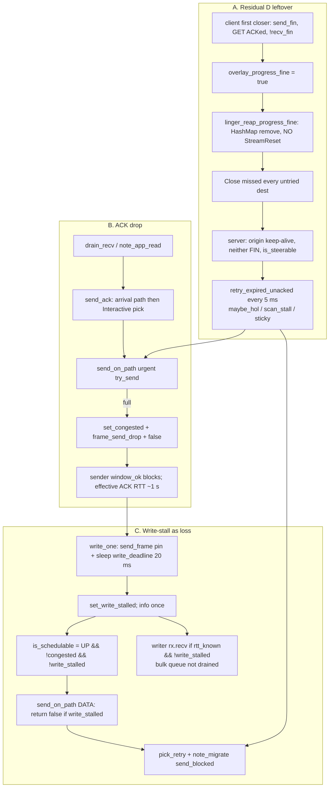
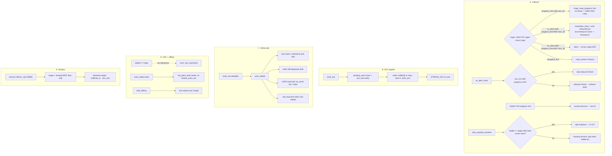

# Hytron bulk goodput: leftover, ACK rotation, write-stall, HOL, window/BDP

| Field | Value |
| --- | --- |
| **Title** | Mechanism design to remove the Hytron unusable-download failure mode and approach GZ–HK link capacity |
| **Author** | nya-link-aggregation maintainers |
| **Date** | 2026-09-10 |
| **Status** | Draft |
| **Audience** | Senior engineers who already know session / scheduler / health, `nya-client` inbound, `nya-server` outbound, and the Signoz scorecard |
| **Predecessor** | `docs/design-close-reset-delivery-regression.md` (**Implemented**, Residual D leftover now production-visible). Write-stall: `docs/design-dns-he-write-timeout.md` / `docs/design-origin-he-io-backpressure.md`. Live-session table: `docs/design-live-session-reap-pick-rtt.md`. |
| **Compatibility** | `PROTOCOL_VERSION` **stays 2**. No CloseAck. No new TOML keys. `[session]` stays `deny_unknown_fields` (four keys, `cfg.rs` L130–137). One production `Tuning::STANDARD`. Tests clone-and-mutate. Do **not** retune `chan`, `initial_window`, `inflight_bias`, `loss_timeout_floor`, `close_linger`, `down_min_silence`, `interactive_max`, `class_drop_*`, or `path_score` weights. Window auto-tune is **not** a TOML flag. |
| **Intended repo path** | `docs/design-hytron-bulk-goodput.md` |

---

## Overview

Hytron (`prod-gz-hytron`) is the user's primary path. Downloads are unusable: large-hop goodput **100–150 KB/s** (sample max ~214 KB/s), many copies 0.5–6 KB/s with `max_gap` 50–400 s, interactive feels stuck. Process `nya_bytes_data_rx` 5-min rate peaks at **~466 KB/s** and matches server `bytes_data_tx` — that *is* the download. The same window's client `bytes_data_tx` peaks at **~5.6 MB/s**. The GZ–HK pipe is not 500 KB/s.

The overlay math is exact. `initial_window = 128 KiB`. Throughput ≈ window / ACK RTT. Path RTT 7–20 ms ⇒ **6–18 MB/s**. Observed 100–150 KB/s ⇒ **effective STREAM_ACK RTT ≈ 0.8–1.3 s**. Local SOCKS `open` p99 is 0.7 ms. This is not accept, not origin dial, not IX jitter.

Four coupled mechanism holes produce that 1 s ACK RTT, and a fifth (window vs BDP) decides whether 128 KiB / 7 ms (~146 Mbps per stream) can fill the pipe once ACK RTT is path RTT:

1. **New closer leftovers (Residual D of v0.1.3).** Client first-closer progress-fine linger with `!recv_fin` silent-reaps without wire Reset; Close missed → server origin keep-alive never FINs. **Going forward**, client-only linger Reset drains that shape. The **live** Hytron table (`held ≈ live` **419** vs client **36**) is neither-FIN `is_steerable` hangover: `reap_closed_streams` continues, A1 never runs. That table is **session bounce**, not this leftover mechanism. Until bounce, ~208 stalled-with-unacked ghosts still retry (order of ~10k enqueue/s, not a precise 20k); ~211 unstalled empty-unacked ghosts still HOL-pin. Product gate is **post-bounce**.
2. **STREAM_ACK is drop-on-full** (`send_ack` → `send_on_path` urgent `try_send`). Client `akcdn` urgent **64/64**. Dropped ACKs freeze `send_window`. `window_blocks` 82008 / 24 h.
3. **Write-stall treats a working bulk flush as loss.** `write_deadline` is `loss_timeout(min_alive_fast)` = **20 ms floor** on 7 ms paths. A loaded 16 KiB `send_frame` misses it → `write_stalled` → `is_schedulable` false → DATA skipped → hedge. 6 h `path write stalled` **25474**, almost all client `soy#0/#1`. `migrates_send_blocked` **96110** / 24 h (v0.1.2 was ~0–8).
4. **HOL.** New leftover interactive stickies (and, until bounce, hangover) still count in `conn_has_interactive` and pin bulk off the only healthy TCP. `hol_place_bulk` / `hol_place_bulk_fallback` also refuse `write_stalled` dests — the TCP that is actually flushing. Fallback goes through `fastest_class_set` (`is_schedulable`), so a stalled soy is invisible while nsix is idle.
5. **Capacity.** 128 KiB at 7 ms is ~146 Mbps per stream. That may be below aggregate 3×2 GZ–HK, and bulk `send_data` re-picks every piece (`PickPref::Any`), so one stream cannot fill one 5-tuple. Window auto-tune is in scope as a *mechanism* (when the advertise grows); raising `Tuning::STANDARD.initial_window` to fit this line is not.

Yuusei (`prod-gz-yuusei`) on the same binary is the control: leftover **2**, stream success 99.9%, stall avg 161 ms, hop RST 0.88/h. Progress-fine 204 **server** silent reap and **server origin-EOF** silent linger must stay. Client Residual D Reset is wire-only; the closer pump stays EOF. Do not regress Yuusei hop RST / leftover.

This is a state-machine / scheduling / flow-control design. It does **not** retune `Tuning::STANDARD`, grow `chan`, dual-send the same offset, or change `failbacks` / e2e chatter.

---

## Background & Motivation

### Production evidence (Signoz, pulled 2026-09-10)

Current binary: **v0.1.3** (`880a43c` / mechanism `d7127d3`), deployed ~2026-09-08T04:36Z. One live session each instance.

**Throughput (Hytron, last ~6 h ending 2026-09-10T08:19Z)**

| Signal | Value |
| --- | --- |
| Client hop `first_rx` | p50 74 ms, p90 323 ms, p99 **1.55 s** |
| SOCKS `open` p99 | 0.7 ms (local accept is fine) |
| Large hops (`nya.rx_bytes >= 200000`, n≈160) | avg ~2.2 MB over ~248 s |
| Good cases | **100–150 KB/s**; sample max **~214 KB/s** |
| `boilhkt.253768.xyz` | 40 MB / ~163 s ≈ **242 KB/s** |
| Another | 32 MB / 147 s ≈ 214 KB/s |
| Client `nya_bytes_data_rx` 5-min | peak **~466 KB/s** (08:15Z); 07:50–08:00 only 15–45 KB/s |
| Server `bytes_data_tx` | matches (~464 KB/s) |
| Client `bytes_data_tx` 5-min peak | **~5.6 MB/s** (hedge/rtx inflation; order-of-magnitude above download) |
| Server large-hop `max_gap` | p50 ~2 s, p90 ~240 s |

When origin vs client speeds match at 110–150 KB/s, the overlay is pacing origin TCP. When `max_gap` is 240–400 s, the overlay is stalling the copy.

**Queues / stall (live gauges ~08:19Z)**

| Gauge | Value |
| --- | --- |
| Client urgent | `akcdn` **64/64 full**, soy 47, nsix 12. `chan = 64` |
| Client bulk | soy#0 and soy#1 **64/64 full**, soy link bulk 119 |
| Client inflight | akcdn **445 KB**, soy 200 KB, nsix 16 KB |
| Server inflight | near 0 on most paths; server `akcdn` bulk queue 64 full — writer not draining |
| 6 h `path write stalled` | **25474**, almost all client **soy#0/#1** (~9500 each) |
| 08:15Z `frame_send_drop` | client **267/s** |
| 08:15Z `data_hedge` | **572/s** |
| 08:15Z `data_retransmit` | **197/s** |
| 24 h server `migrates_send_blocked` | **96110** (v0.1.2 18 h was ~0–8) |
| 24 h client `window_blocks` | **82008** |

**Leftover (the accumulating table)**

v0.1.3 Hytron server `nya_streams_held` 30-min series:

| Time | held / client-held / stalled |
| --- | --- |
| 09-08 04:30Z (just deployed) | 41 / 39 / 2 |
| 09-08 22:30Z (~18 h) | 65 / 27 / 12 |
| 09-09 10:30Z | 206 / 24 / 77 |
| 09-09 22:30Z | 351 / 74 / 111 |
| 09-10 08:00Z | **390 / 44 / 171** |
| Live at pull | server live **419**, stalled **208**; client live **36**, stalled **7** |

`held ≈ live` ⇒ these are `is_steerable()` (no FIN / not `counted_close`). Client HashMap does not have them. They still enter HOL, stall scan, unacked retry.

Yuusei same binary: client live 0, server held **2** (1 stalled ghost, flat since deploy). Leftover contract for 204s **held**. Do not regress.

**Path flap (CWND / writer, not the throughput formula)**

Hytron `path_down` ~421/h last 24 h vs ~96/h in v0.1.2 18 h window. Silent-down concentrated on **akcdn / soy**. `failbacks=0`, `session_all_down_resets=0`, six paths UP, RTT still 7–10 ms. Do **not** retune `down_min_silence`. Upload burst disproves “the path is 500 KB/s”.

**v0.1.3 vs v0.1.2 (keep the wins)**

| Signal | v0.1.2 (~18.5 h) | v0.1.3 |
| --- | --- | --- |
| Stream success | 99.9% | 51 h 98.9%/97.8%; last 24 h **98.1%/96.5%** |
| `close_retry`/stream | 2.85 | **1.20** (spray capped; **keep**) |
| `reset_retry` | ~3700/h | ~331/h (storm collapsed; **keep**) |
| hop `ConnectionReset` | ~9/h | **96/h** (51 h) / **176/h** (last 24 h) — leftover timeout RSTs, not the 4.7% progress-fine linger RST that v0.1.3 stopped |
| leftover held vs live | balanced 44/54 | now **36 vs 419** |

Yuusei v0.1.3: stall 161 ms (was 291), lifetime 591 ms (was 873 hugging linger), hop RST 0.88/h, leftover 2. **Keep.**

### Current code (main / v0.1.3) — line-accurate



Relevant sites (verify; do not invent):

| Site | Behavior today |
| --- | --- |
| `StreamState::is_steerable` (`stream.rs` L103–108) | `!reset && !counted_close && !send_fin_sent && !recv_fin`. Half-closes are **not** steerable. Leftover with **neither** FIN is. |
| `stream_snaps` (`mod.rs` L1454–1468) | `held = HashMap.len()`, `live = is_steerable count`. Prod `held ≈ live` = neither-FIN ghosts. |
| `linger_reap_progress_fine` (`mod.rs` L1278–1303) | Progress-fine linger: `counted_close` CAS, `Inbound::Close` if flipping `recv_fin`, `remove_held_stream`. **No** `StreamReset`. Residual D of `docs/design-close-reset-delivery-regression.md`. |
| `overlay_progress_fine` (`mod.rs` L983–1002) | `acked >= next`; hole clause; `recv_fin` **or** (`send_fin` and Open not held). Client 204 after GET ACK is fine with `!recv_fin`. Server origin-EOF with client still draining is also fine with `!recv_fin`. |
| `reap_closed_streams` (`steer.rs` L334–368) | Neither FIN → `continue`. Linger never starts on origin keep-alive leftovers. |
| `retry_expired_unacked` (`mod.rs` L538–569) | Every steerable stream, every maintain 5 ms. `last_sent >= retry_after` (20 ms floor). Cycle rung via `pick_retry_tried`. |
| `send_ack` (`streams.rs` L455–468) | Builds `StreamAck { acked_offset: recv_next, window: advertised_window }`. `send_on_path(arrival)` then `pick_pref(Interactive)`. Both can drop. No coalesce. |
| `advertised_window` (`stream.rs` L135–139) | `initial_window - buffered_in`. **Does not** count `recv_buf`. Duplex is `tokio::io::duplex(initial_window)` (`streams.rs` L77–78). |
| `window_ok` / `send_data` (`stream.rs` L131–133, `streams.rs` L181–199) | Blocks when `inflight_send + extra > send_window`. Increments `window_blocks` once per wait. |
| `on_ack` (`streams.rs` L470–514) | Stores `ack.window`; advances `send_acked`; bulk ACK (`data.len() > interactive_max`) is **not** path RTT. |
| `frame_is_interactive` (`mod.rs` L1184–1188) | `StreamData` ≤ 1500 **or any non-DATA** → urgent. ACK is control → urgent. |
| `send_on_path` (`mod.rs` L1198–1236) | DATA skipped if `path.is_write_stalled()` (L1206–1208). Urgent `try_send` fail → `set_congested(true)` + `frame_send_drop`. Bulk full does **not** set congested. |
| `write_deadline` (`mod.rs` L509–519) | unknown / `up_age < unknown_degrade_min` → 300 ms; else `retry_after` = `loss_timeout(min_alive_fast)` → **20 ms floor** on 7 ms paths. |
| `write_one` (`path.rs` L880–926) | Pins `send_frame`; at deadline sets `write_stalled` (info once per episode `path write stalled`). Does **not** tear. |
| Writer bulk arm (`path.rs` L834) | `rx.recv() if path.rtt_known() && !path.is_write_stalled()`. Stalled dest **does not dequeue bulk**. |
| `Sent { stalled }` (`path.rs` L812–815, L853–856) | Clears `write_stalled` only if **this** write was on-time. Chronically slow bulk stays stalled; bulk arm stays off. |
| `is_schedulable` (`path.rs` L195–197) | `is_up() && !congested && !write_stalled`. Pick / HOL dest / `interactive_affinity` all require it. |
| `send_data` bulk pick (`streams.rs` L208–219) | `PickPref::Any` — **re-picks every piece**. No bulk affinity. Enqueue fail → `pick_retry` + `note_migrate("send_blocked")`. |
| `maybe_hol` / `conn_has_interactive` (`steer.rs` L374–454) | Interactive sticky = `is_steerable && sticky == path && !bulk`. Leftover interactive ghosts pin. `hol_place_bulk` requires `p.is_schedulable()` (`steer.rs` L388–394) — write-stalled working TCP is ineligible. |
| `pick_retry_path` (`scheduler.rs` L471–511) | First rungs `is_schedulable`; last rungs `is_alive()` (cycle). DATA keeps the cycle. Close/Reset use `pick_retry_untried` (no cycle) — **keep**. |
| `inflight_bias` (`tuning.rs` L118, `scheduler.rs` L29–36) | 64 KiB. `load = 1 + inflight/bias + sticky`. One stream at 128 KiB inflight scores 3× an empty dest → spray. |

Yuusei leftover drain that **must stay**: Close retry onto untried dests (`leftover_drains_via_close_retry_when_progress_fine`, `mod.rs` L3523). Progress-fine + `recv_fin` linger is still silent (Hytron origin-EOF hop-RST fix). `close_retry`/stream ≤ path count. `failbacks` still cross-link only.

### Causal chain (why 100 KB/s, not “the path is slow”)

```text
New closer leftovers (client silent !recv_fin linger, Close missed)
  + hangover neither-FIN 419 (bounce-only; ~208 stalled still retry)
        │
        ├─► retry_expired_unacked × stalled-with-unacked × (1000/20)
        │         ≈ O(10k) enqueue/s (order of magnitude; not 419×50)
        │         │
        │         ▼
        │   urgent 64/64, bulk 64/64, frame_send_drop 267/s
        │         │
        │         ▼
        │   STREAM_ACK try_send drops  ──►  send_window frozen
        │         │                         128 KiB / ~1 s = 128 KB/s
        │         ▼
        │   16 KiB flush takes > 20 ms at 100 KB/s (16 KiB / 100 KB/s = 160 ms)
        │         │
        │         ▼
        │   write_stalled, bulk arm off, DATA return false, hedge 572/s
        │         │
        │         ▼
        │   HOL leftover interactive pins bulk off soy; write_stalled dest
        │   ineligible for hol_place_bulk (fallback uses fastest_class_set)
        ▼
effective ACK RTT 0.8–1.3 s  ⇒  observed 100–150 KB/s
```

Until Hytron **session bounce**, A1 cannot reap the 419 neither-FIN rows. A3 can stop stalled-with-unacked retry from filling `chan`; ACK/write-stall/HOL still help **new** copies. Do not claim A–D restore goodput on the live hangover table.

Upload 5.6 MB/s in the same window is the control: the 5-tuples can carry megabytes/s when the overlay is not ACK-starved. Do not retune `down_min_silence` to chase `path_down` 421/h; that rate is a *symptom* of ping/ACK starvation on the silent-down clock, not the throughput formula.

### BDP vs `initial_window` vs concurrent streams

Let `W = initial_window = 128 KiB`, `R =` path RTT.

| Assumption | Throughput of **one** stream |
| --- | --- |
| ACK RTT = 7 ms | `W/R` = 18.3 MB/s ≈ **146 Mbps** |
| ACK RTT = 10 ms | 12.8 MB/s ≈ **102 Mbps** |
| ACK RTT = 20 ms (`loss_timeout` floor) | 6.4 MB/s ≈ **51 Mbps** |
| ACK RTT = 0.8–1.3 s (observed) | **100–160 KB/s** ← production |

One overlay stream's inflight is **stream-level**, not per-path. Bulk `send_data` re-picks every piece, so 128 KiB splits across 5-tuples at `inflight_bias` (64 KiB): typically **two** paths × 64 KiB, neither TCP sees a BDP.

Three named links × 2 TCP = 6 paths. `load_term` will spread **distinct** streams. Client live = 36, of which a handful are bulk downloads.

Realistic GZ–HK (not a retune target — a bound check):

- Single TCP across CN–HK VPS/GIA is commonly 50–200 Mbps. 146 Mbps **may already be above one 5-tuple**.
- Aggregate 3 links can be several times that. 146 Mbps per stream is **below** a healthy aggregate.
- Observed overlay **upload** 5.6 MB/s (45 Mbps) is a lower bound (includes hedge) and is already ≫ download. It does **not** prove the pipe is 45 Mbps.
- Linux BDP at 200 Mbps × 7 ms = 175 KiB; at 1 Gbps × 7 ms = 875 KiB. 128 KiB is **below** those BDPs.

**Verdict:** do **not** raise `Tuning::STANDARD.initial_window` to fit GZ–HK. After ACK RTT is path RTT, 128 KiB / 7 ms is ~146 Mbps — possibly the one-TCP cap, possibly below the pipe. A **window/BDP mechanism** (advertise `max(initial_window, 2·BDP)` from **receiver deliver rate × sticky-path RTT**, ceil derived from existing `initial_window * chan`) is in scope. If post-fix hop goodput ≈ origin goodput, the overlay is not pacing origin — that is the **product** success, not “2× of an unmeasured iperf.” Auto-tune is a no-op while `2·rate·rtt ≤ floor`.

`chan=64` of `MAX_STREAM_PAYLOAD` (`16*1024-16`) frames is still ~1 MiB queued per half per dest. That is **not** the stream window. Growing `chan` does not grow `send_window`. ARCHITECTURE already forbids it as a TTFB/throughput fix.

---

## Goals & Non-Goals

### Goals

1. **Remove the unusable-download failure mode (post-bounce).** A bulk transfer on a healthy 7–10 ms GZ–HK path is limited by the TCP/ISP pipe, not by overlay ACK RTT of ~1 s and not by a 128 KiB window that cannot rotate.
2. **Measurable capacity gate (this series).** Overlay does **not** pace origin (hop client rate ≈ origin rate on large copies); Hytron large-hop KB/s **≫ 150 KB/s**; 5-min `bytes_data_rx` ≫ 466 KB/s if origin/pipe allow; `ack_flush_us` p50 path-RTT class; queues not glued at 64. **Stretch (not a close condition):** overlay within 2× of a **measured** single-TCP baseline (quiet iperf on a named 5-tuple, or hop vs a same-window direct TCP copy). Without that measurement the series is still closeable.
3. **Leftover / stall ghosts.** **New** first-closer leftovers that have a FIN drain via client-only Residual D Reset. Hangover neither-FIN (live 419) is **session bounce only** — A1 does not reap them; do not idle-GC (`in_flight_copy_not_reaped_before_fin`). After bounce, Hytron `held` vs client `live` bounded. Yuusei leftover stays ~0. Server origin-EOF linger stays silent (no hop-RST). In-flight copies with neither FIN **must not be GC’d**. Bound retry of stalled leftover so it cannot fill `chan` (including hangover until bounce).
4. **ACK is not drop-on-full.** Coalesce / overwrite-per-stream with a **pollable** writer wakeup. Prove it cannot deadlock with `set_congested` from urgent-full, and that an idle writer emits ACK in ≪ `ping_interval_max`.
5. **Write-stall vs DATA.** Mechanism for when DATA may still enqueue and when stall is congestion-for-new-picks vs tear. `hold_stream_data` becomes unknown-only. Retry must not spray **onto** a write-stalled dest. Do **not** raise the 20 ms `loss_timeout_floor`.
6. **HOL.** **New** leftover interactive stickies must not pin bulk off the only healthy TCP. Write-stalled working dests must be eligible as bulk HOL targets **without** going through `fastest_class_set`. Hangover HOL pin until bounce is accepted.
7. **Window vs BDP.** Auto-tune advertise from **receiver deliver rate** × sticky-path RTT; one bulk stream can fill one 5-tuple; N streams can fill three links without ACK starvation. `initial_window` stays 128 KiB as the **floor**.
8. **Keep v0.1.3 wins:** `close_retry`/stream ≤ path count; `reset_retry` storm collapsed; Yuusei stall/lifetime/leftover; server origin-EOF silent linger; `failbacks=0` / `all_down=0`; e2e chatter door `failbacks/min`.
9. **Merge gates / prod watch** as in prior nya designs, with **download hop KB/s and 5-min `bytes_data_rx`** as the product gate, **post-bounce**, not ping SLA.

### Non-Goals

- Simultaneous dual-send of the same offset (explicit overlay non-goal).
- Growing `chan` as the throughput fix.
- Any numeric change to `Tuning::STANDARD` (`initial_window`, `inflight_bias`, `loss_timeout_floor`, `close_linger`, `down_min_silence`, `interactive_max`, `class_drop_*`, HOL slack, `path_score` weights).
- New `[session]` TOML keys. `deny_unknown_fields` stays four keys.
- `PROTOCOL_VERSION` bump / CloseAck / new `ResetReason`.
- Idle-timeout of streams with **neither** FIN (would GC Hytron origin-idle, `max_gap` hundreds of seconds). Hangover 419 is bounce, not GC.
- Restoring progress-fine linger Reset on the **server** (Hytron origin-EOF hop-RST). Client-only Residual D is in scope.
- Closer-pump `Inbound::Reset` on Residual D (Yuusei 204 would hop-RST locally).
- Restoring Pong-as-Close-ACK.
- A TOML flag for window auto-tune.
- Blaming IX jitter; retuning `down_min_silence` for `path_down` 421/h.
- Changing `failbacks` to include same-link.
- Fitting GZ–HK soak by twisting numbers.

---

## Key Decisions

1. **Residual D Reset is client-only.** Discriminator is `Inner.is_client` (`mod.rs` L96). At linger (`either FIN`, `close_started` aged `close_linger`): if `overlay_progress_fine && recv_fin` → silent HashMap remove (both roles; Hytron origin-EOF when the server already got client Close, and half-close with peer FIN). Else if `is_client && overlay_progress_fine && !recv_fin` → **wire** `StreamReset` (client 204 / client-gone; server leftover drain). Else if `!is_client && overlay_progress_fine && !recv_fin` → **silent** (Hytron **server** origin-EOF, client still draining — the v0.1.3 hop-RST fix). Else `!progress_fine` → `reset_stream(Timeout)` as today. Same local flags without `is_client` are origin-EOF and Residual D; there is no other discriminator. Do **not** Reset all `!recv_fin`.

2. **Closer pump gets `Inbound::Close`, not `Inbound::Reset`.** Residual D does **not** call `reset_stream`/`finish_stream` for the local hop. Helper (client-only): `remember_reset` + send `StreamReset` (no-cycle table); **`observe_stream_end` while `recv_fin` is still false** (linger split: `progress_fine && !recv_fin` → **do not** `forget_reset`); **then** `recv_fin.swap` + `Inbound::Close` (same CAS as `linger_reap_progress_fine`, `mod.rs` L1298–1301); `remove_held_stream`. Swapping `recv_fin` *before* observe would take the silent branch and `forget_reset` the table just remembered. `counted_close` CAS before remember. Must not `try_send(Inbound::Reset)` on the closer. Peer (`!recv_fin`) takes a real `on_peer_reset` → `Inbound::Reset`. Unit: closer pump EOF, peer sees Reset, `Inner.resets` still held after `debug_maintain`.

3. **Peer Reset after we already have `recv_fin` is EOF, not hop RST.** `on_peer_reset` / `finish_stream(send_frame=false)`: if `recv_fin && overlay_progress_fine`, skip `Inbound::Reset` (Close already delivered). Yuusei 204 whose Close already landed must not `ConnectionReset` when client linger-Reset races server linger.

4. **Hangover 419 neither-FIN is session bounce, not A1.** `is_steerable` leftovers have **neither** FIN; `reap_closed_streams` continues (`steer.rs` L346–348); `close_started_ms` stays 0. A1 never runs on them. Do not idle-GC (`in_flight_copy_not_reaped_before_fin`). Product gate is **post-bounce**. A3 bounds stalled-with-unacked retry until bounce. Unstalled empty-unacked hangover still HOL-pins — accepted; D1 is stall-only and does **not** cover them.

5. **Bound leftover DATA retry without GC.** `retry_expired_unacked` skips when `st.stalled && stall_age >= close_linger` **and** `tried` covers every currently-alive dest. Resume if ACK advances or a new `path_id` appears. Does not `remove_held_stream`. Does not send Reset. Also: retry must not pick a **write-stalled dest as `alt`** (spray-onto-stalled). While C4 waits on a dest, pin that offset’s `retry_not_before` to **at least `now + down_timeout`** (the wait bound), **not** `retry_after` (20 ms floor). Clear/restore when the wait completes or give-up runs.

6. **STREAM_ACK is an overwrite register with Notify wakeup, never an mpsc slot.** `PathState.pending_acks: Mutex<HashMap<u32, StreamAck>>` plus `ack_wait: Notify`. `send_ack` insert/overwrite + `notify_one()`. Writer `select!` (biased, after ping-due): `_ = ack_wait.notified()` **or** map non-empty; swap **at most K** entries; `write_one` **directly** (not `urgent.try_send` / not `send_on_path`). ACK cannot `set_congested` / `frame_send_drop`. `hold_stream_data` does not apply (ACK is not `StreamData`). Dirty/generation: clear `ack_dirty` only if this `stream_id` is **absent** from the live map **after** Sent; keep `ack_flush_from_ms` until that generation is sent or superseded. `path_failed` takes `pending_acks` **before** HashMap remove (`mod.rs` L365–392); merge onto alt with **max `acked_offset`**, then that row’s `window`.

7. **Write-stall is pick-skip for new stickies, not bulk-kill.** Writer always dequeues bulk. `hold_stream_data` is **unknown-only** (`!rtt_known()`). Stalled DATA is forced onto bulk in `send_on_path`; if bulk `try_send` fails, `send_on_path` returns **false** (park must not drop a copy that already returned true). Unacked retry skips alive+write_stalled **`from` and `alt`**. Bulk `send_data` enqueue-fail waits (`queue_wait`); pin `retry_not_before = now + down_timeout` (not `retry_after`); give-up after path `down_timeout` (~330 ms on 7 ms) then `pick_retry`. Interactive still migrates. `write_deadline` **unchanged**. Stall still does not tear. Bulk depth stays `tuning.chan`.

8. **HOL: new linger-stalled leftovers are not interactive; write-stalled dests are valid bulk targets.** `conn_has_interactive` ignores `stalled && stall_age >= close_linger`. That is **stall-only** — unstalled hangover (empty unacked, `close_started_ms==0`) still pins until bounce. `hol_place_bulk` sibling find uses D2 predicate directly. **`hol_place_bulk_fallback` must not call `fastest_class_set`** (that function keeps `is_schedulable` until the set is empty, hiding stalled soy while nsix is idle). Fallback builds cands with D2’s predicate, then `class_rtt <= cur` and `pick_from`. `fastest_class_set` / `interactive_affinity` **unchanged** (still skip write-stalled for new Open/Interactive).

9. **One bulk stream fills one 5-tuple.** `bulk_affinity` reuses sticky while `is_alive() && (is_schedulable() || is_write_stalled()) && is_loss_fresh`. HOL may still move bulk off an interactive TCP. `inflight_bias` still spreads **distinct** streams.

10. **Window auto-tune is a mechanism, not a new `initial_window`.** Advertise from **receiver deliver rate** (bytes successfully `drain_recv`'d per second), not sender ACK rate. `bdp_bytes = rate_bytes_s * rtt.as_secs_f64()`; `target = clamp(2 * bdp_bytes, floor, ceil)` with floor = `initial_window`, ceil = `initial_window * chan` (8 MiB, derived). RTT = sticky path fast EWMA if that dest is alive, else `min_alive_fast_rtt`, else **do not grow**. Duplex stays 128 KiB (app buffer). Overlay `recv_buf` is the BDP buffer; live-stream memory is up to ceil (36 × 8 MiB worst case, not 419 after bounce). `STREAM_ACK.window` already exists — no wire change. Auto-tune is a no-op until `ack_flush_us` is path-class. Not a TOML flag.

11. **No proto bump. No TOML. `n_counter` stays 54.** Gauges (`nya_path_ack_pending` via `PathSnap.ack_pending`) + histogram `nya_ack_flush_us` with a **microsecond** bound table (existing hists are milliseconds; do not reuse `STALL_MS_BOUNDS` as µs). Do not add `nya_ack_overwrite_total`.

12. **Product gate is measurable Signoz, not unmeasurable “2× path TCP.”** Overlay not pacing origin (large-hop client ≈ origin); hop ≫ 150 KB/s; 5-min `bytes_data_rx` ≫ 466 KB/s if the pipe allows; `ack_flush_us` p50 path-RTT class; queues not glued at 64. Yuusei leftover ~0, hop RST ~1/h, `close_retry`/stream ≤ path count are **regression doors**. 2× of a measured single-TCP baseline is a stretch requiring iperf or a same-window direct copy — not a close condition.

13. **Clocks, `chan`, `failbacks`, e2e chatter stay frozen.** One `Tuning::STANDARD`. Tests clone-and-mutate `close_linger` only where linger is the subject.

14. **Ship leftover + ACK + write-stall + HOL as one goodput series; window/BDP may trail.** PR 1 is **role-split Residual D + closer EOF + A3** with Yuusei locks — not “Reset all `!recv_fin`.” Bounce Hytron **before** reading leftover-held as rollback. Without leftover drain, ACK coalesce fights new ghosts; without write-stall DATA, a working dest is unschedulable. Window auto-tune without those is a number looking for a pipe. Do not claim A–D fix goodput on the live 419 table.

---

## Proposed Design



### A. Leftover / stall ghosts

**Contract:** A1 drains **new** closer leftovers that have **either FIN**. Hangover-without-FIN (live Hytron 419 `is_steerable`) is **session bounce only** — A1 does not run (`reap_closed_streams` continues on neither FIN, `steer.rs` L346–348). In-flight copies transferring (or legitimately origin-idle with empty unacked, neither FIN) are not GC’d. Client-gone + origin keep-alive is not in flight once the **client** closer has lingered with `send_fin`.

#### A1. Residual D: client-only linger + `!recv_fin` sends **wire** Reset; closer pump stays EOF

`reap_closed_streams` (`steer.rs` L359–366) after this change. Discriminator is `self.inner.is_client` (`mod.rs` L96). Table and algorithm are the same:

```text
either FIN, close_started aged close_linger:
  if overlay_progress_fine AND recv_fin:
      linger_reap_progress_fine(id)     # KEEP both roles
  else if is_client AND overlay_progress_fine AND !recv_fin:
      residual_d_client(id)             # NEW — wire Reset, local Close
  else if !is_client AND overlay_progress_fine AND !recv_fin:
      linger_reap_progress_fine(id)     # KEEP — server origin-EOF, no Reset
  else:
      reset_stream(id, Timeout)         # no-progress, both roles
```

`residual_d_client` is **not** `reset_stream` / `finish_stream` (those `try_send(Inbound::Reset)` on `first_reset`, `mod.rs` L1314–1317 — Yuusei 204 closer hop-RST). Sketch:

```text
st = get_stream(id) or return
if !is_client or recv_fin or !overlay_progress_fine:  # raced
    fall through to existing silent / reset_stream
if counted_close CAS fails: return                    # do not forget_reset
remember_reset(id, pick_pref or 0, Timeout)
send StreamReset (no-cycle; push_tried on success only)
# Copy linger_reap_progress_fine order (mod.rs L1298–1302): OBSERVE FIRST,
# while recv_fin is still false, so the linger split does NOT forget_reset.
observe_stream_end(Timeout)   # progress_fine && !recv_fin → linger counters,
                              # forget_close, DO NOT forget_reset
if !recv_fin.swap(true): inbound_tx.try_send(Inbound::Close)  # same CAS as linger_reap
remove_held_stream(id)
```

If `recv_fin.swap(true)` ran **before** observe, `overlay_progress_fine` is still true (`mod.rs` L995–996: `if recv_fin { return true }`) and observe takes `progress_fine AND recv_fin` → **`forget_reset`**. The table just remembered is gone; `retry_resets` never runs; server leftover drain is a no-op if Close missed. **Do not** invert this order. `linger_reap_progress_fine` already observes then swaps (`mod.rs` L1298–1302). Residual D copies that order and inserts `remember_reset` + send **before** observe (same remember-before-observe as `finish_stream` L1323 then L1354–1359). `observe_stream_end` linger branch (`mod.rs` L1391–1403) today always `forget_reset`. Split:

```text
observe_stream_end Timeout:
  if overlay_progress_fine AND recv_fin:
      linger counters, forget_close, forget_reset, return   # silent
  if overlay_progress_fine AND !recv_fin:
      linger counters, forget_close, DO NOT forget_reset, return  # Residual D
  else:
      stream_resets_timeout, forget_close, keep resets
```

| Shape | Role | Fine? | `recv_fin`? | Linger action |
| --- | --- | --- | --- | --- |
| Hytron **server** origin EOF, client still draining | server | yes | no | **silent** — hop-RST fix. Unit: no `StreamReset`. |
| Hytron **server** origin EOF, client already `recv_fin` | server | yes | yes | silent |
| Hytron **client** 204 / drop, GET ACKed, origin keep-alive | client | yes | no | **wire Reset**, local `Inbound::Close` |
| Yuusei leftover, unacked / Open held | client | no | no | `reset_stream` (already) |
| In-flight download, neither FIN | either | n/a | n/a | not linger-eligible; **not GC** |
| Hangover 419 neither FIN | server | n/a | n/a | **bounce**; A1 never runs |

`linger_progress_fine_does_not_send_reset` (`mod.rs` L3442) is the **client** Residual D shape (write, ACK, drop tun, `!recv_fin`). Invert: expect **wire** `StreamReset`, closer pump `Inbound::Close` (not Reset), `Inner.resets` held **after `debug_maintain`** (`retry_resets` still has the id — RED if observe ran after `recv_fin.swap`). Add **`server_origin_eof_linger_does_not_send_reset`**: server `send_fin`, ACK, **no** client `StreamClose`, mutated linger, **no** `StreamReset`. Add `linger_progress_fine_with_recv_fin_does_not_send_reset` (either role).

`reap_stream` (`streams.rs` L367–373): progress-fine pump-join currently `return`s so Close retry can land. **Keep** for both `recv_fin` and `!recv_fin`. Residual D fires from `reap_closed_streams` at linger, not from pump-join. `leftover_drains_via_close_retry_when_progress_fine` stays: Close dest-2 still drains **before** linger Reset.

#### A2. Peer Reset after Close is EOF

`on_peer_reset` stays `finish_stream(..., send_frame=false)` + `forget_reset`. `finish_stream` (`mod.rs` L1314–1317) today always `Inbound::Reset` on `first_reset`. After:

```text
if first_reset:
    why = reset_reason.unwrap_or(SessionDead)
    if st.recv_fin AND overlay_progress_fine:
        # recv_fin already delivered Inbound::Close (apply_recv_fin)
        # skip Inbound::Reset — copy_bidirectional sees EOF
    else:
        inbound_tx.try_send(Inbound::Reset(why))
    ... remember_reset as today if send_frame && !dead
```

Server leftover (`!recv_fin`) still gets `Inbound::Reset` → origin abort → hop `ConnectionReset`. Volume is leftover, not every 204. Yuusei Close-landed race: `recv_fin` already true → no hop RST.

#### A3. Bound DATA retry of stalled leftover (no spray onto write-stalled)

`retry_expired_unacked` (`mod.rs` L538) after `is_steerable` check:

```text
if st.stalled
   && stall_from_ms != 0
   && now - stall_from_ms >= close_linger_ms
   && unacked.tried covers every currently-alive path_id:
    continue  # no send_data_frame, no note_retry
```

Then, per expired offset, **before** `pick_retry_tried`:

```text
if get_path(from).is_alive() && get_path(from).is_write_stalled():
    continue  # copy in mpsc or send_frame; not lost
let Some(alt) = pick_retry_tried(&tried) else { continue };
if get_path(alt).is_write_stalled():
    continue  # do NOT spray onto a stalled dest (C3 dest-side)
```

“Covers” = every `path_list().is_alive()` id is in `u.tried` for **that** offset (or FIFO-8 cap and no untried alive dest). Production N=6 never evicts FIFO-8.

Unstalled leftovers (empty unacked, `scan_stall` false) do not enter `retry_expired_unacked` — they do not fill `chan`. They still HOL-pin until bounce (D1 stall-only).

Resume: ACK advances → leave stall → retries resume. `path_added` → new id not in `tried`.

**Must not GC.** `in_flight_copy_not_reaped_before_fin` stays green. New: `stalled_leftover_retry_stops_after_all_dests_and_linger`; `retry_does_not_pick_write_stalled_alt`.

**No dual-send while C4 waits.** When bulk `send_data` is waiting on `queue_wait` for offset O, set `Unacked.retry_not_before` to **at least `now + down_timeout`** (the wait bound, ~330 ms on 7 ms: `max(5×RTT, 320 ms)+probe`). **Do not** use `retry_after` (`loss_timeout(min_alive_fast)` = 20 ms floor): maintain would `send_data_frame` the same offset while `send_data` is still blocked. C3 skip of write-stalled `from`/`alt` does **not** cover this — C4 is queue-full with on-time flushes, dest may be `!write_stalled`. On wait complete or give-up, clear/restore `retry_not_before` (e.g. `= last_sent` so a later real expiry can retry). Dual-send remains a Non-Goal.

#### A4. Hangover (bounce, not A1)

The live 419 server entries are already gone from the client HashMap. After deploy, **nothing** will send Close/Reset for those ids (client linger already ran). Server has neither FIN, `close_started_ms==0`, `reap_closed_streams` **continues**. Idle-GC is a Non-Goal. **Bounce the Hytron session** after canary (same as `2c34217` Yuusei hangover). Product gate is **post-bounce**. Do not treat pre-bounce 419 as rollback.

A3 bounds stalled-with-unacked (~208) so they cannot fill `chan` before bounce. ~211 unstalled empty-unacked still `conn_has_interactive` until bounce — accepted; D1 does not cover them. Watch **new** leftovers after bounce.

### B. ACK overwrite register

**Contract:** A stream’s latest `acked_offset`/`window` is never lost because `chan=64` urgent is full. ACK cannot `set_congested`. ACK cannot deadlock a window-blocked sender. An **idle** writer (no urgent/bulk) emits ACK in ≪ `ping_interval_max` (50 ms) — not at ping cadence.

#### B1. Data model (session-memory, no wire)

```rust
// PathState
pending_acks: Mutex<HashMap<u32, StreamAck>>, // stream_id → latest
ack_wait: Notify,                             // writer wakeup; send_ack notify_one

// StreamState
ack_dirty: AtomicBool,
ack_gen: AtomicU64,           // bumped on each store; Sent clears dirty only if map lacks id
ack_flush_from_ms: AtomicU64, // 0 = not waiting; set when dirty goes 0→1; kept until that gen Sent or superseded
recv_buffered: AtomicU64,     // recv_buf byte count; PR 2 accounts; PR 5 subtracts from recv_cap
```

No new frame. `StreamAck` already has `window: u32` (`frame.rs` L138–142).

#### B2. `send_ack`

Replace `streams.rs` L455–468. Dest: the passed `path_id` if alive (DATA arrival from `drain_recv`), else sticky if alive, else `pick_pref(Interactive)`. `note_app_read` (`streams.rs` L392–394) today **always** Interactive — change it to last DATA arrival / sticky if alive, else Interactive (B5).

```text
fn send_ack(st, path_id):
    ack = StreamAck { stream_id: st.id, acked_offset: st.recv_next, window: st.advertised_window() }
    dest = path_id if get_path(path_id).is_alive()
           else sticky if alive
           else pick_pref(Interactive)
    let Some(p) = dest else { mark dirty; return }
    p.pending_acks.lock().insert(st.id, ack)   # overwrite; latest window on that offset
    if st.ack_dirty.swap(true) == false:
        st.ack_flush_from_ms = mono_ms()
    st.ack_gen.fetch_add(1)
    p.ack_wait.notify_one()
    # NO send_on_path. NO try_send. NO set_congested. NO frame_send_drop.
```

#### B3. Writer ACK arm (pollable)

`Mutex<HashMap>` is not a future. Without `Notify`, the loop only re-evaluates the map when another `select!` arm completes — idle dest sits in `sleep_until(next_ping)` (10–50 ms, `cfg.rs` L119–120) and ACK RTT becomes ping cadence.

`spawn_path_io` write loop (`path.rs` L740–876), biased:

```text
close_rx
ping_due ready()
_ = ack_wait.notified(), if map was empty at arm construction
    OR std::future::ready(()), if !pending_acks.is_empty()
  → take at most K entries (K = 8, same as push_tried FIFO; not Tuning)
    write_one(StreamAck) DIRECTLY on FramedWrite
    # not urgent.try_send, not send_on_path, not hold_stream_data
urgent.recv
rx.recv                 → bulk, NO write_stalled guard (see C)
sleep_until next_ping
```

`hold_stream_data` does **not** apply to ACK (ACK is not `StreamData`) — state it next to this arm. ACKs go out on a write-stalled dest (the dest with DATA in flight).

**Take-K, not take-all.** After K `write_one`s, return to `select!` so ping-due can run. Hangover 419 must not delay Ping by 419 flushes. After leftover drain, tens of streams is fine; K=8 matches FIFO-8 and is not a GZ–HK fit.

**Dirty vs in-flight overwrite.** After `WriteOne::Sent` of ACK for `stream_id`:

```text
if pending_acks does not contain stream_id:   # gen2 did not land during write_one
    st.ack_dirty = false
    observe ack_flush_us from ack_flush_from_ms; clear from
else:
    # gen2 pending; leave dirty; leave ack_flush_from_ms (original wait)
    ack_wait.notify_one()                     # ensure another drain
```

Do **not** clear dirty blindly on Sent of gen1 while gen2 sits in the map.

**`path_failed` merge.** Take `pending_acks` **before** `paths.remove` (`mod.rs` L365–392 today removes at L392 after rehome). Merge onto `pick_retry(dead)`:

```text
for (id, ack) in taken:
    match dest2.pending_acks.entry(id) {
        Occupied(e) if e.acked_offset > ack.acked_offset => keep dest2
        Occupied(e) if e.acked_offset == ack.acked_offset => keep dest2.window
            # equal offset: dest2 is at least as fresh; do not go backwards
        _ => insert ack   # max offset wins; that row's window
    }
    dest2.ack_wait.notify_one()
```

If no alt, stream `ack_dirty` stays; next `send_ack` / `note_app_read` re-homes. Do not drop the map.

**K constant:** 8 is the existing `push_tried` cap, not a new Tuning field. Tests may assert “≤8 ACK `write_one`s before a ping arm runs” with a stuffed map.

#### B4. Deadlock proof with `set_congested`

Urgent-full today:

```text
send_on_path ACK → try_send fail → set_congested → is_schedulable false
→ pick skips dest → send_ack Interactive pick also fails → ACK dropped
→ sender window_ok waits forever
→ no more DATA → no drain_recv → no further send_ack
DEADLOCK
```

After this change:

| Step | Why it cannot deadlock |
| --- | --- |
| ACK never `try_send`s | `set_congested` is unreachable from ACK |
| Urgent-full from Close/Open/small DATA | Writer still runs; ACK arm is **above** urgent; ACKs drain even when urgent is 64/64 |
| `is_schedulable` false | ACK dest is the arrival path’s register, not a pick. Writer of that path flushes the register. Pick is not on the ACK path. |
| Writer blocked in `send_frame` | ACK waits behind **one** flush (the in-flight frame), then the ACK arm runs. Bound = that TCP flush, not `chan` × retry. |
| All six writers blocked | ACK waits on TCP. That is the pipe. Overlay did not drop the window update. |
| Arrival path `path_failed` | Map taken **before** remove; merge max offset onto alt; `ack_wait.notify_one()`. Dirty stays until Sent. |
| Idle writer (no urgent/bulk) | `ack_wait.notify_one()` wakes `select!`; ACK on wire in ≪ `ping_interval_max`. Unit: RED without Notify. |
| `window_ok` waiter | `on_ack` still `send_wait.notify_waiters()` (`streams.rs` L513). |
| Slow SOCKS consumer | `advertised_window` shrinks with `buffered_in`; ACK carries window 0; sender blocks **correctly**. Not a deadlock. |

**Invariant:** `set_congested` remains urgent-`try_send`-fail only (`mod.rs` L1227–1228). Writer ACK arm calls `write_one` directly. ACK is not urgent mpsc. Bulk still does not congest. `hold_stream_data` does not apply to ACK.

#### B5. `note_app_read` / `drain_recv` cadence

Keep calling `send_ack` on every drain and every `note_app_read`. Those become register stores (cheap). Do **not** rate-limit stores — overwrite is the rate limit on the wire. Do **not** move ACK generation to maintain-only (that would add 5 ms to ACK RTT on an idle path).

**Dest policy.** `drain_recv` already passes DATA arrival `ack_path`. `note_app_read` (`streams.rs` L392–394) today **always** `pick_pref(Interactive)` — bulk window ACKs can land on a ping-only TCP. After: reuse last DATA arrival / sticky if alive, else Interactive. One line; overwrite register does not fix dest choice by itself.

### C. Write-stall vs DATA

**Contract:** A 20 ms missed flush marks the dest unschedulable for **new** Interactive/Open picks. It does **not** mean “this TCP lost the DATA” and does **not** stop the writer from draining bulk. Stall is not tear (already). Do not raise `loss_timeout_floor`. Bound in one sentence: **bulk depth stays `tuning.chan`; DATA may occupy up to `chan` slots; app `send_data` waits; retry must not spray onto a write-stalled dest.** No `chan` growth.

#### C1. Writer always dequeues bulk

`path.rs` L834: drop `&& !path_w.is_write_stalled()` from the bulk `recv` guard. Keep `if path_w.rtt_known()`.

**`hold_stream_data` becomes unknown-only.** Today (`path.rs` L627–629):

```rust
matches!(frame, Frame::StreamData(_)) && (!path.rtt_known() || path.is_write_stalled())
```

After: `matches!(frame, Frame::StreamData(_)) && !path.rtt_known()`. Unknown dests still park DATA to bulk so ping can complete first RTT. The `is_write_stalled()` disjunct is **deleted** — otherwise C2 is a lie for interactive DATA (urgent enqueue returns true, writer parks to bulk, bulk full **drops** the frame after `send_on_path` already returned true, C3 skips retry because `from` is stalled-alive).

Ping-due and ACK arm stay biased **above** bulk. `Sent { stalled: true }` still leaves the flag (pick stays off for new streams). `Sent { stalled: false }` still clears.

#### C2. `send_on_path` DATA: stalled → bulk; fail returns false

Delete `mod.rs` L1206–1208 skip. Then: if `data && p.is_write_stalled() && p.rtt_known()`, force the bulk sender (`p.writer`), not urgent. If that `try_send` fails: `note_dequeue`, `note_send_drop`, return **false** (do **not** `set_congested` — bulk full). Park (`park_stream_data`) if it remains for unknown DATA: if bulk `try_send` fails, that path must also surface as `send_on_path` false — implement by not parking after a successful `send_on_path`; unknown hold happens **inside** `send_on_path` (force bulk, return the `try_send` result).

Keep: `!p.is_alive()` → false. Keep: unknown DATA off urgent.

Unit: stalled + urgent-full + bulk-full must **not** ACK-advance-free drop a copy (`send_on_path` false, `last_sent` unchanged, retry_not_before set, HashMap still has unacked).

#### C3. Unacked retry is not loss on stalled-alive `from` **or** `alt`

Skip retry when `from` is alive+write_stalled (copy in mpsc / `send_frame`). After `pick_retry_tried`, **also skip if `alt` is write_stalled** — last rungs of `pick_retry_path` are `is_alive()` (`scheduler.rs` L506–510) and would otherwise dump onto the stalled dest without waiting.

Do **not** skip retry on `is_congested()` alone.

Hangover: A3 + bounce, not retry-into-stalled.

#### C4. Bulk enqueue-full waits; give-up is `down_timeout`; no dual-send

`send_data` (`streams.rs` L275–298) today: fail → `pick_retry` → `note_migrate("send_blocked")`. After, for **bulk**:

```text
if !send_on_path(sticky_or_picked, frame):
    if bulk AND get_path(path_id).is_alive():
        wait = health::down_timeout(cfg, path.stable_rtt(), probe)
             # ~330 ms on 7 ms; NOT retry_after 20 ms; NOT all_down_timeout 8 s
        pin unacked[offset].retry_not_before = now + wait  # ≥ wait bound
        wait queue_wait.notified() or send_wait or sleep(wait)
        restore retry_not_before = last_sent               # wait done / give-up
        if send_on_path same dest: done, do not note_migrate
        else if still alive: pick_retry (give-up) + note_migrate if alt send succeeds
    else:
        existing pick_retry + note_migrate if alt send succeeds
```

`PathState.queue_wait: Notify`. `note_dequeue` notifies. Interactive **keeps** send-blocked migrate. Alive+stuck writer is bounded by path `down_timeout` (peer silent-down is ~330 ms; Pongs can keep it UP longer — that is the give-up). Do not wait `all_down_timeout` (8 s) then retry the same full queue forever. The pin duration **is** that wait bound: `retry_not_before = now + down_timeout`. `retry_after` (20 ms) is too short — maintain would dual-send during the wait.

#### C5. `write_deadline` unchanged

`mod.rs` L509–519 stays. Tests `write_deadline_known_fast_pool_is_floor` / `write_stall_on_one_of_six_leaves_six_up` stay. Add `write_stall_still_dequeues_bulk`; `hold_stream_data_unknown_only`; `stalled_urgent_bulk_full_does_not_drop_copy`.

### D. HOL

**Contract:** **New** leftover interactive stickies must not pin bulk off the only healthy TCP. A write-stalled dest that is flushing bulk is a valid HOL *target* for bulk, not a valid *new Interactive Open* dest. Hangover neither-FIN HOL pin until bounce is **accepted** — D1 is stall-only and does not cover empty-unacked keep-alives (`scan_stall` false when `unacked` empty and no recv hole). Do not idle-GC `close_started_ms==0` to unstick them.

#### D1. `conn_has_interactive` ignores long-stalled ghosts (stall-only)

`steer.rs` L374–379:

```text
st.is_steerable()
  && sticky == path_id
  && !bulk
  && !(st.stalled && stall_from_ms != 0 && now - stall_from_ms >= close_linger)
```

Real interactive that is briefly stalled still pins. A Residual D ghost stalled for ≥ linger does not. After A1 client Reset, **new** leftovers leave the HashMap. Unstalled hangover (GET ACKed, empty unacked, neither FIN) **still pins until bounce**. Say so; do not pretend D1 covers 419.

#### D2. `hol_place_bulk` accepts write-stalled siblings — fallback must **not** use `fastest_class_set`

D2 predicate:

```text
p.is_alive() && !p.is_congested()
  && (p.is_schedulable() || p.is_write_stalled())
  && is_loss_fresh
  && !conn_has_interactive(p.id)
```

`hol_place_bulk` sibling find (`steer.rs` L388–394) uses this **directly** (same-link first).

**`hol_place_bulk_fallback` (`scheduler.rs` L290–305) must fork candidate collection.** Today it starts from `fastest_class_set`, which keeps `p.is_schedulable()` until that set is empty (`scheduler.rs` L100–117). Write-stalled dests only appear in the `is_up()` fallback when **no** dest is schedulable. Filtering D2 *after* `fastest_class_set` is a no-op whenever nsix is idle and soy#0/#1 are stalled — the common case. KD8 says `fastest_class_set` **unchanged** for Open/Interactive (correct TTFB). Therefore fallback **builds its own cand list** with D2’s predicate, then keeps `effective_class_rtt(p) <= effective_class_rtt(cur)` and `pick_from(..., Any)`. Leave `fastest_class_set` / `interactive_affinity` untouched.

Test `hol_place_bulk_accepts_write_stalled_sibling` must **not** go through a schedulable third dest (two dests only, or the third is down).

If every dest has a real (non-ghost) interactive sticky, bulk may stay on an interactive TCP — existing “no spare 5-tuple”. Production 3×2 with leftover gone (post-bounce) has spare TCPs per link.

```text
p.is_alive()
  && !p.is_congested()
  && (p.is_schedulable() || p.is_write_stalled())
  && is_loss_fresh
  && !conn_has_interactive(p.id)
```

### E. Capacity: window/BDP, affinity, N streams

**Contract:** After A–D, ACK RTT ≈ path RTT. Then: (1) one bulk stream puts a BDP on one 5-tuple; (2) advertise can grow above 128 KiB when measured **receiver deliver rate** × sticky-path RTT exceeds the floor; (3) N bulk streams fill three links via existing `load_term`, without ACK starvation (B). Do not ship PR 5 until A–D make `ack_flush_us` path-class.

#### E1. Advertise formula (no Tuning numeric edit)

**Pick: receiver deliver rate**, on the advertising side. Sender ACK rate is the peer’s view and includes overlay ACK delay; deliver rate is `drain_recv` success (bytes handed to inbound mpsc) and is what `advertised_window` must cover. Includes inbound-mpsc backpressure — that is correct (app-slow must shrink the advertise).

`StreamState.recv_cap: AtomicU32` init = `initial_window`. **PR 2 does not change `advertised_window`.** PR 2 only accounts `recv_buffered`. PR 5 switches the formula in **one** function.

```rust
// PR 5 only
pub fn advertised_window(&self) -> u32 {
    let cap = u64::from(self.recv_cap.load(Ordering::Relaxed));
    cap.saturating_sub(self.buffered_in.load(Ordering::Relaxed))
        .saturating_sub(self.recv_buffered.load(Ordering::Relaxed))
        .min(u32::MAX as u64) as u32
}
```

`recv_buffered` tracks `recv_buf` bytes (increment on `deliver_data` insert, decrement on `drain_recv` remove). Today `recv_buf` is invisible (`stream.rs` L135–139 = `initial_window - buffered_in` only).

**Units, EWMA, RTT:**

```text
floor = tuning.initial_window                         // 128 KiB
ceil  = floor.saturating_mul(tuning.chan as u32)      // 8 MiB, derived
rate  = deliver_rate_ewma_bytes_per_s                 // 0 until first drain_recv
rtt   = sticky path fast EWMA if get_path(sticky).is_alive()
        else min_alive_fast_rtt
        else None
if rate == 0 or rtt is None:
    recv_cap = floor                                  // do not grow
else:
    bdp_bytes = rate as f64 * rtt.as_secs_f64()       // bytes
    recv_cap = clamp((2.0 * bdp_bytes) as u32, floor, ceil)
```

**Do not** use `loss_timeout_floor` (20 ms) as an RTT. After E2, BDP uses **that stream’s sticky** RTT so a slower 5-tuple is not over-advertised from pool min.

**EWMA:** α = 1/8 (same 7/8 raise used for class RTT — existing algorithm, not a new Tuning field). First sample: `rate = len / dt` with `dt` from last deliver Instant; if `dt == 0`, skip. `rate == 0` → floor.

**Duplex vs recv_buf vs `buffered_in`:**

```text
origin/overlay DATA
    → recv_buf (holes; recv_buffered)
    → drain_recv inbound_tx (buffered_in += len)
    → pump write_all → tokio duplex(initial_window)   // 128 KiB app buffer
    → SOCKS read → note_app_read (buffered_in -= n)
```

App-slow: duplex fills → pump `write_all` blocks → inbound mpsc fills (`chan=64`) → `drain_recv` `try_send` fails, chunk goes back to `recv_buf` → `advertised_window` shrinks. **Do not grow duplex to match `recv_cap`.** Overlay `recv_buf` is the BDP buffer. Memory per **live** stream is up to ceil (post-bounce 36 × 8 MiB worst case). Hangover 419 must bounce first (A4).

Sender already applies `ack.window` (`streams.rs` L474). Growing advertise grows `send_window` without a wire change.

Auto-tune is a **no-op** while ACK RTT is ~1 s: 150e3 B/s × 0.007 s × 2 = 2100 B < floor. After A–D, 10e6 B/s × 0.007 × 2 = 140 KiB ≈ floor; 50e6 × 0.007 × 2 = 700 KiB → grow. Self-gating. No TOML flag.

#### E2. `bulk_affinity`

New helper next to `interactive_affinity` (`mod.rs` L449–466):

```text
fn bulk_affinity(sticky) -> Option<u32>:
    if sticky == 0: None
    p = get_path(sticky)?
    if !p.is_alive(): None
    if p.is_congested() && !p.is_write_stalled(): None
       # urgent-full without a working flush: don't pin
    if p.is_write_stalled() || p.is_schedulable():
        if is_loss_fresh(p): Some(sticky) else None
    else: None
```

`send_data` (`streams.rs` L208–219):

```text
let mut path_id = loop {
    let picked = if pref == Interactive {
        interactive_affinity(sticky).or_else(|| pick_pref(Interactive))
    } else {
        bulk_affinity(sticky).or_else(|| pick_pref(Any))
    };
    ...
};
```

HOL still moves sticky (`maybe_hol` / `hol_place_bulk` / `hol_initial`). Loss still rehomes via `retry_expired_unacked` (C3: not on stalled-alive). One stream, one 5-tuple until HOL or loss. `inflight_bias` spreads the **next** stream onto an empty dest (load_term). Six bulk streams can occupy six 5-tuples. Two bulk streams on a 3-link pool land on different links if inflight differs by ≥ bias — existing score, not a new weight.

Interactive affinity **unchanged** (still requires `is_schedulable`, so still skips write-stalled — TTFB).

#### E3. Can one stream fill one 5-tuple? Can N fill three links?

After E1–E2:

- One bulk stream: sticky on one TCP; window `max(128 KiB, 2·BDP)` up to 8 MiB. At 7 ms, 8 MiB is ~9 Gbps — the ceil is a memory bound, TCP SNDBUF / ISP will backpressure via write-stall, and C keeps sending on that dest.
- Overlay queue cap per dest remains `chan * MAX_STREAM_PAYLOAD` ≈ 64 × 16 KiB = 1 MiB. Extra window sits in `unacked` until enqueue. C4 waits rather than sprays.
- N streams: `path_score` load_term with a 1 MiB inflight path is `1 + 1MiB/64KiB = 17` vs empty `1`. New bulk opens elsewhere. Three links fill.
- ACK starvation: B’s register is per-stream overwrite, N ACKs per dest not N×chunks. Urgent Close/Reset still capped by v0.1.3 no-cycle.

If post A–D (post-bounce) hop goodput equals origin goodput with `recv_cap` still at floor, origin/pipe is the limiter and E1 is idle. That is success, not a missed retune. It is **not** a 2×-of-unmeasured-iperf close.

---

## API / Interface Changes

Public crate API (`Session::open_stream`, SOCKS, `IncomingStream::reset`) unchanged. Wire unchanged (`PROTOCOL_VERSION = 2`). `[session]` unchanged.

| Item | Change |
| --- | --- |
| `reap_closed_streams` | role split on `inner.is_client`; server origin-EOF silent; client `!recv_fin` → `residual_d_client` |
| `residual_d_client` | new; wire Reset + local `Inbound::Close`; not `reset_stream` |
| `linger_reap_progress_fine` | `recv_fin` (both roles) **or** server progress-fine `!recv_fin` |
| `observe_stream_end` linger | `forget_reset` only if `recv_fin`; `!recv_fin` keeps `Inner.resets` |
| `finish_stream` first_reset | skip `Inbound::Reset` if `recv_fin && overlay_progress_fine` |
| `retry_expired_unacked` | A3 bound; skip stalled-alive `from` **and** write-stalled `alt`; C4 pins `retry_not_before ≥ now+down_timeout` |
| `send_ack` | `pending_acks` + `ack_wait.notify_one()`; no `try_send` |
| `note_app_read` | ACK dest = last DATA arrival / sticky if alive, else Interactive |
| `path_failed` | take `pending_acks` **before** remove; merge max offset |
| `hold_stream_data` | unknown-only (`!rtt_known()`) |
| `spawn_path_io` write loop | `ack_wait.notified()` arm; take K; `write_one` directly; bulk `recv` without `!write_stalled` |
| `send_on_path` | delete DATA+write_stalled skip; stalled known DATA forced onto bulk; fail returns false |
| `send_data` | `bulk_affinity`; bulk enqueue-fail waits `down_timeout` then pick_retry; pin `retry_not_before = now+down_timeout` (not `retry_after`) |
| `conn_has_interactive` | ignore stalled ≥ linger (**stall-only**; hangover empty-unacked still pins) |
| `hol_place_bulk` sibling find | D2 predicate directly |
| `hol_place_bulk_fallback` | **own** cand list (D2 predicate); do **not** call `fastest_class_set` |
| `StreamState` | `ack_dirty`, `ack_gen`, `ack_flush_from_ms`, `recv_buffered`; `recv_cap` + deliver EWMA in PR 5 |
| `PathState` | `pending_acks`, `ack_wait`, `queue_wait` |
| `PathSnap` | `ack_pending: u64` (catalog `nya_path_ack_pending`) |
| `advertised_window` | **PR 5 only:** `recv_cap - buffered_in - recv_buffered`. PR 2 accounts `recv_buffered` only |
| `Tuning::STANDARD` / TOML / proto | **unchanged**. Auto-tune is not a TOML flag |
| `Counters` / `n_counter` | **54 stays**. Histogram `ack_flush_us` (µs bounds) + gauges, no new `_total` |

---

## Data Model Changes

Session-memory only. No on-disk schema. No migration. Rolling restart is v2↔v2.

- `PathState.pending_acks` + `ack_wait: Notify`. `path_failed` takes the map **before** remove and merges max-`acked_offset` onto alt.
- `PathSnap.ack_pending` copied from `pending_acks.len()` (like `queued_urgent`). Catalog gauge `nya_path_ack_pending` next to `nya_path_queued_*`.
- `Counters.ack_flush_us: Histogram` with microsecond bounds (e.g. `&[500, 1_000, 2_000, 5_000, 10_000, 20_000, 50_000, 100_000, 200_000]` µs). Do **not** reuse `STALL_MS_BOUNDS` (those are milliseconds). Handwritten `Default`. Not `_total`.
- `StreamState.recv_cap` (PR 5) starts at `initial_window`; never below floor.
- `recv_buffered` is a byte counter; `recv_buf` BTreeMap stays the hole map. PR 2 adds the counter; PR 5 subtracts it.
- Hangover streams from v0.1.3 do not gain Close/Reset; bounce the session.

---

## Alternatives Considered

### 1. Idle-timeout steerable streams with no overlay progress for `close_linger`

Would reap Hytron leftover without Residual D Reset. Also reaps Hytron origin-idle (`max_gap` hundreds of seconds, empty unacked, neither FIN). Violates “must not GC in-flight”. **Rejected.** A3 bounds retry without GC; A1 Reset is the closer’s job.

### 2. Raise `loss_timeout_floor` so 16 KiB flushes do not stall

Numeric fit of GZ–HK (7 ms path, 20 ms floor). A 50 Mbps dest honestly needs the 20 ms pick-skip so Interactive Open does not sit behind a 25 ms flush. **Rejected** (LOOP-POLICY). C changes *when* stall applies, not the number.

### 3. Grow `chan` past 64 so ACKs / bulk do not drop

Hides drop counters; ACK still shares a queue with Close/Open/small DATA; 400 leftovers fill any finite chan. ARCHITECTURE forbids this as a throughput fix. **Rejected.** B removes ACK from the queue; A stops leftover fill.

### 4. Concurrent dual-send of the same offset

Explicit overlay non-goal. First-arrival already exists via retry-on-timeout. Dual-send would double overlay bytes and fight the 5.6 MB/s upload-inflation reading. **Rejected.**

### 5. Raise `initial_window` to 1 MiB (or any GZ–HK BDP guess)

Fits this line. Does not fix 1 s ACK RTT (1 MiB / 1 s = 1 MB/s still overlay-capped). After ACK fix, may overshoot a 100 Mbps 5-tuple and bufferbloat `unacked`. **Rejected** as a Tuning edit. E1 auto-tune is the mechanism; floor stays 128 KiB.

### 6. Dedicated ACK mpsc of depth 1 per stream

N channels for N streams; leftover 419 would be 419 channels. Overwrite HashMap on the path is O(1) per dest. **Rejected.**

### 7. Flush ACKs only from maintain (5 ms)

Adds 5 ms to ACK RTT on an otherwise idle path (7 ms RTT → 12 ms). Writer ACK arm is event-driven. **Rejected as the sole path.** Maintain may belt-flush `ack_dirty` streams whose dest map was lost — optional, not load-bearing.

### 8. Restore progress-fine linger Reset for all `!recv_fin` (both roles) *and* `recv_fin`

Reopens Hytron 4.7% hop-RST (server origin-EOF, client still draining). Same local flags as client Residual D. **Rejected.** Role split on `inner.is_client` (KD 1). Silent when `recv_fin` (KD 2).

### 8b. Reset all progress-fine `!recv_fin` without a role split (A1 as first drafted)

Table wanted client-only; algorithm Reset both. Server origin-EOF hop-RST returns. **Rejected.** Client-only is the chosen alternative.

### 8c. Poll ACK map from ping/`sleep_until` without Notify

Idle ACK RTT becomes 10–50 ms ping cadence — the quantity this design restores. **Rejected.** `ack_wait: Notify` is load-bearing.

### 9. Server-side hygiene Reset / idle-GC of neither-FIN hangover

False-Resets a slow SOCKS consumer paused >1 s with a full window, or GCs Hytron origin-idle (`max_gap` hundreds of seconds). **Rejected.** Residual D is the **client** closer sending Reset; hangover **bounces**. Same rejection as Alt 1.

### 10. `is_schedulable` ignore `write_stalled` for all picks

Interactive Open would land on a dest whose flush already missed 20 ms (the TTFB hole `docs/design-dns-he-write-timeout.md` closed). **Rejected.** Only bulk HOL target + bulk affinity + DATA enqueue see stalled-as-working.

### 11. Grow duplex to `recv_cap` ceil (8 MiB) per stream

Hangover 419 × 8 MiB. Even 36 live × 8 MiB is 288 MiB of Tokio buffers. Overlay `recv_buf` already exists. **Rejected.**

---

## Security & Privacy Considerations

- No new frame, no new plaintext, no new handshake field. Residual D Reset is existing `StreamReset(Timeout)`. ACK register is existing `StreamAck`.
- Duplicate Reset remains idempotent (`reset.swap`, `on_peer_reset` with `get_stream` None).
- `Inbound::Close` instead of `Inbound::Reset` when `recv_fin && progress_fine` *narrows* the abort surface (EOF vs RST on a peer that already FINed).
- Window auto-tune ceil 8 MiB is a per-stream overlay buffer bound. A hostile peer advertising a huge `window` is already trusted at the session PSK/TLS layer; we still clamp sender `send_window` to what they send, and our advertise is our `recv_cap`.
- `pending_acks` holds stream_id + offset + window — no payload.
- No user data in leftover predicates.

---

## Observability

No new `_total` if possible. `n_counter == 54` stays (`export.rs` L428–429). `Counters::default` handwritten; add histogram fields next to `stall_ms`.

| Signal | After this design | Product reading |
| --- | --- | --- |
| Hop large-copy KB/s (`rx_bytes / last_rx_us` on client; origin vs client on server) | **≫ 150 KB/s**; client ≈ origin (overlay not pacing) | **product gate (post-bounce)** |
| 5-min `nya_bytes_data_rx` / `nya_bytes_data_tx` | ≫ 466 KB/s peak if origin/pipe allow | **product gate (post-bounce)** |
| `nya_link_queued_urgent` / `_bulk` | not glued at 64 | ACK/DATA rotating |
| `nya_window_blocks_total` | collapse vs 82008/24 h | window rotating |
| `nya_migrates_send_blocked_total` | collapse vs 96110/24 h | C4 wait, not spray |
| `nya_data_hedge_total` / `nya_data_retransmit_total` | toward ≤1/stream on a quiet pool (v0.1.3 08:15Z was 572/s + 197/s) | leftover+stall retry bound |
| `nya_frame_send_drop_total` | ACK no longer contributes; leftover gone → toward quiet | not a page |
| `nya_streams_held` vs `_live` vs client live | Hytron `held ≈ client live` **after bounce**; pre-bounce 419 is hangover not rollback; Yuusei leftover ~0 | leftover door |
| hop `copy_err=ConnectionReset` | Yuusei stays ~1/h; Hytron leftover drain may RST keep-alive origins (not 4.7% of downloads) | A2 |
| `nya_close_retry_total` / stream | ≤ path count | keep v0.1.3 |
| `nya_reset_retry_total` | Residual D leftover only, no-cycle | not a 204 storm |
| `failbacks` / `session_all_down_resets` | 0 | chatter / all_down unchanged |
| `nya_ack_flush_us` histogram (new, not `_total`) | p50 ≪ 20 ms, p99 ≪ 100 ms on a quiet 7 ms pool | ACK RTT probe |
| `nya_path_ack_pending` gauge (new, not `_total`) | ~0–few per dest | register depth |
| `PathSnap.write_stalled` / `queued_*` | stalled dests still dequeue bulk; queues not 64 glued | C |

**How we will measure the product gate in prod (Signoz; no iperf required to close)**

1. **Hop copy rate (application).** Client: `rx_bytes / last_rx_us` on hops with `rx_bytes >= 200000`. Server: origin `rx_bytes / origin_last_rx_us` vs client `crx` / `clast`. **Pass:** large-hop KB/s ≫ 150 KB/s **and** origin ≈ client (overlay not pacing). Fail: origin ≫ client (overlay still the limiter). This does **not** prove overlay ≈ path TCP.
2. **Process goodput.** 5-min `nya_bytes_data_rx` (client download) ≫ 466 KB/s if origin/pipe allow. Client TX 5.6 MB/s is hedge-inflated — a pipe **lower bound**, not a baseline.
3. **Queue depth.** `nya_link_queued_urgent` / `_bulk` not stuck at `chan`. `nya_path_ack_pending` near 0.
4. **ACK delay.** `nya_ack_flush_us` p50 / p99. Target p50 path-RTT class (≤ ~2× min-alive-fast, 14–20 ms on this pool). If p99 is still ~1 s, B did not land or leftover still fills the writer.
5. **Window bound vs origin bound.** If `recv_cap` stays at floor and hop ≈ origin ≪ 128 KiB / ACK_flush_p50, origin is the limiter — **success**, do not grow. If hop ≪ origin and `ack_flush_us` is path-class, overlay is still broken.

**Stretch (not a close condition):** overlay within 2× of a **measured** single-TCP baseline — one quiet iperf on a named 5-tuple, or hop goodput vs a same-window direct TCP copy. Without that series the 2× claim is un-closeable; do not use it as the product gate.

Prefer unit + prod Signoz. Optional e2e `prod_like_bulk_copy` only gates `elapsed ≪ 1 MiB / 100 KB/s` (would be 10 s today) — not line rate.

Info snapshot (`export.rs` `emit_snapshot`): add `ack_p50_ms` from the histogram if the compact line budget allows; otherwise rely on catalog + `q=urgent/bulk` already in `format_paths`. **Do not** attach `metrics=` on info.

Logs: `path write stalled` stays info once per episode. ACK/DATA still silent. Residual D Reset uses existing `debug!(..., "reset_retry")`. No per-STREAM_DATA logs.

---

## Rollout Plan

No feature flag (no new TOML). One production `Tuning::STANDARD`. Both ends already on v2.

1. Land PRs in order (see PR Plan). `cargo test -p nya-core`; `cargo test -p nya-e2e --test matrix short_matrix`. Mixed soak: no new SLA reds, no chatter, no `all_down`.
2. Canary **Yuusei first** (leftover ~0, server origin-EOF silent, hop RST 0.88/h, closer-pump EOF). PR 1 must not merge without the role split (Issues 1/6). Then Hytron.
3. **Bounce the Hytron session** after deploy **before** reading leftover-held as rollback (hangover 419 will not drain; A1 never runs on neither-FIN). Yuusei leftover 2 may sit until bounce.
4. Watch a 17 h-class window **post-bounce**:

   | Signal | Expect |
   | --- | --- |
   | Yuusei server `streams_held` leftover | stays ~0 (do **not** regress to 81) |
   | Yuusei hop RST / h | ~1, not 96 |
   | Yuusei stall avg / lifetime | not back to 305 / 910 ms |
   | Hytron `held` vs client `live` **after bounce** | bounded, not 419 vs 36. Pre-bounce 419 is **not** rollback |
   | Hytron large-hop KB/s | **product:** ≫ 150 KB/s **and** origin ≈ client |
   | Hytron 5-min `bytes_data_rx` | ≫ 466 KB/s peak if origin/pipe allow |
   | `window_blocks` / `migrates_send_blocked` / `data_hedge` | collapse vs v0.1.3 24 h |
   | urgent/bulk queue | not glued at 64 |
   | `ack_flush_us` p50 | path-RTT class |
   | `close_retry`/stream | ≤ path count |
   | `failbacks` / `all_down` / mixed SLA | unchanged |
   | `path_down` | may fall as a side effect of ACK/ping making it through; **not** a retune gate |

5. **Rollback:** revert the PR(s). Wire still v2. Restoring silent `!recv_fin` linger reintroduces leftover; restoring ACK `try_send` reintroduces 100 KB/s; restoring bulk-off-on-stall reintroduces hedge. Acceptable as rollback.

Hangover: streams already in the table at deploy with neither FIN stay until bounce (A4). New closes after deploy take A1.

---

## Risks

| Risk | Sev | Mitigation |
| --- | --- | --- |
| Residual D Reset hop-RSTs **server origin-EOF** (same flags as client 204) | **High** | KD 1: `!is_client && progress_fine && !recv_fin` is **silent**. Unit: `server_origin_eof_linger_does_not_send_reset`. Do not merge PR 1 without this. |
| Residual D `reset_stream` hop-RSTs **closer pump** (Yuusei 204 client) | **High** | KD 2: `residual_d_client` sends wire Reset + local `Inbound::Close`, not `finish_stream` Reset. Unit: closer EOF, peer Reset. |
| Residual D Reset hop-RSTs Yuusei 204 whose Close already landed | Med | KD 3: `recv_fin && progress_fine` skip `Inbound::Reset`. Watch Yuusei hop RST ~1/h. |
| Residual D Reset truncates a client write-half-close download at 1 s | Low | Pre-existing: silent reap already local-EOFs client recv at linger. Production 163 s downloads ⇒ HTTP/1.1 does not half-close. `in_flight_copy_not_reaped_before_fin` has neither FIN. |
| Claiming A1 drained the live 419 table | **High** | A4: bounce. Product gate post-bounce. Pre-bounce 419 is not rollback. |
| A3 retry bound stops a real lossy copy | Med | Resume on ACK or new path_id. Bound requires stall ≥ linger **and** all dests tried. Real loss on a 6-path pool rehomes in ≪ linger. |
| ACK register forgotten on `path_failed` | High | Take map **before** remove; merge max offset; dirty until Sent. |
| Idle ACK waits for ping | **High** | `ack_wait: Notify`. Unit: idle writer, ACK on wire ≪ `ping_interval_max`. |
| Dirty cleared while gen2 pending | Med | Clear dirty only if `stream_id` absent from map after Sent. |
| Take-all ACKs delay Ping (hangover 419) | Med | Take K=8 per loop; return to `select!`. |
| Writer ACK arm starves bulk | Low | Take-K; ACK arm above bulk; leftover drain first. |
| Enabling bulk dequeue while stalled reorders TLS records / poisons codec | — | We never cancel `send_frame`. One `FramedWrite`. |
| `hold_stream_data` still parks stalled DATA; park drops; C3 skips retry | **High** | Unknown-only hold; stalled DATA onto bulk; `try_send` fail returns false. |
| Retry sprays onto write-stalled dest (cycle rung `is_alive()`) | **High** | Skip write-stalled `alt`. Hangover: A3 + bounce. |
| C4 wait dual-sends with maintain retry | **High** | Pin `retry_not_before = now + down_timeout` (wait bound), **not** `retry_after` (20 ms). Restore on wait complete/give-up. Test: wait > `retry_after` and < `down_timeout`; hedge/rtx unchanged. |
| Bulk wait-on-full livelocks on alive+stuck writer | Med | Give-up after path `down_timeout` (~330 ms) then `pick_retry`. Not 8 s `all_down_timeout`. |
| HOL allowing write-stalled dest puts Interactive DATA on a slow flush | Low | D2 is bulk-only. Interactive affinity still requires `is_schedulable`. |
| `hol_place_bulk_fallback` still uses `fastest_class_set` | **High** | Fork cand list. Test with no schedulable third dest. |
| Window auto-tune 8 MiB bufferbloat | Med | Ceil derived; TCP SNDBUF backpressures via write-stall; C4 waits; `recv_buf` counted in advertise. Canary: if `ack_flush_us` rises with `recv_cap`, the gain is too high — that is a follow-up *gain* discussion, not a Tuning retune of `initial_window`. |
| Hangover 419 misread as failed leftover fix | Med | Bounce; watch **new** 204s / new downloads. A3 stops their enqueue immediately even before bounce. |
| `n_counter` drift | High | No new `_total`. Assert 54 stays. |
| Mixed soak Close/Reset chatter looking like failback | Low | `failbacks` still cross-link only. |

---

## Open Questions

None that block implementation. Resolved here:

- Residual D Reset is **client-only** (`inner.is_client && progress_fine && !recv_fin`). Server origin-EOF stays silent. Closer pump `Inbound::Close`; peer wire Reset. `residual_d_client` observes **while `recv_fin` is still false**, then swaps (copy `linger_reap_progress_fine` order) so the linger split does not `forget_reset`.
- Hangover 419 neither-FIN is **bounce**, not A1. No idle-GC. Product gate post-bounce. D1 stall-only.
- ACK register: `Notify` wakeup, take-K, dirty/generation, `path_failed` merge max offset. Writer `write_one` directly.
- `hold_stream_data` unknown-only; stalled DATA onto bulk; retry skip `from` **and** `alt` write-stalled; C4 pins `retry_not_before ≥ now+down_timeout` (not `retry_after`); bulk wait give-up = `down_timeout`.
- Product gate: hop ≫ 150 KB/s and origin ≈ client; `ack_flush_us` p50 path-RTT; queues not glued. 2× path TCP is a stretch requiring iperf — not a close condition.
- BDP: receiver deliver rate; `rate_bytes_s * rtt.as_secs_f64()`; sticky RTT; duplex 128 KiB; `recv_buf` is BDP buffer. PR 2 accounts `recv_buffered`; PR 5 switches `advertised_window`.
- `hol_place_bulk_fallback` does not call `fastest_class_set`.
- `n_counter` 54; `PROTOCOL_VERSION` 2; no TOML; auto-tune not a flag.

Soak-followup (not this series): if after A–D hop goodput ≈ origin ≪ 128 KiB / path RTT, the limiter is origin/ISP — stop. If hop ≪ origin and `ack_flush_us` is path-RTT and `recv_cap` is at ceil, the 8 MiB derived ceil is the limiter — then discuss a *mechanism* for ceil (still not a one-shot `initial_window` bump). If Yuusei leftover climbs while `close_retry` per first-closer is 0 **and** Residual D Reset is not sending, that is a delivery bug in A1.

---

## Tests required

Clone-and-mutate `close_linger` only where linger is the subject. Helpers: `inject_live` / `inject_live_cap` / `stuff_urgent_keep_schedulable` / `handle_frame` / `debug_maintain`. Do **not** use `pair_echo` (it sets `loss_timeout_floor = 150 ms`) for 20 ms-floor stall/retry gates. `in_flight_copy_not_reaped_before_fin` stays.

| Test | Gate |
| --- | --- |
| `server_origin_eof_linger_does_not_send_reset` (**new**; **PR 1 merge gate**) | **Server** `send_fin`, ACK, **no** client `StreamClose`, mutated linger, **no** `StreamReset`. RED if A1 has no role split |
| `linger_progress_fine_with_recv_fin_does_not_send_reset` (**new**) | either role: `send_fin`, StreamAck, `handle_frame(StreamClose)` so `recv_fin`, linger, **no** `StreamReset` |
| `linger_progress_fine_without_recv_fin_sends_reset` (**replace** `linger_progress_fine_does_not_send_reset`) | **Client** Residual D: write, ACK, drop tun, `!recv_fin`, linger → **wire** `StreamReset`; closer pump `Inbound::Close` **not** Reset; `Inner.resets` still held **after `debug_maintain`** (`retry_resets` still has the id — RED if observe ran after `recv_fin.swap`) |
| `leftover_drains_via_close_retry_when_progress_fine` (existing) | **Keep.** Close dest-2 still drains without waiting linger Reset |
| `server_leftover_close_swallowed_reset_retried` (existing) | **Keep.** No-progress still Resets |
| `in_flight_copy_not_reaped_before_fin` (existing) | **Keep.** Neither FIN survives 2× linger |
| `peer_reset_after_recv_fin_is_eof_not_hop_rst` (**new**) | Server has `recv_fin` + progress-fine; `on_peer_reset`; pump sees Close/EOF, **no** `Inbound::Reset`; `stream_resets_timeout` unchanged |
| `stalled_leftover_retry_stops_after_all_dests_and_linger` (**new**) | Two dests, unacked, no ACK, age linger; further maintain does not increment hedge/rtx; HashMap still holds id |
| `ack_overwrite_does_not_use_urgent_chan` (**new**) | Stuff urgent 64/64 `stuff_urgent_keep_schedulable`; `send_ack`; urgent depth unchanged; `pending_acks` has the stream; `frame_send_drop` unchanged; `congested` unchanged |
| `ack_coalesce_keeps_latest_offset` (**new**) | Two `send_ack` with acked 100 then 200; map has 200 only |
| `ack_unblocks_window_when_urgent_full` (**new**) | **Deadlock lock.** Fill urgent; sender blocked on `window_ok`; register ACK + writer flush; `send_wait` resumes |
| `ack_idle_writer_emits_before_ping_interval` (**new**) | **Notify lock.** No urgent/bulk; `send_ack`; ACK on wire in ≪ `ping_interval_max`. RED without `ack_wait` |
| `ack_dirty_survives_in_flight_overwrite` (**new**) | Store gen1; during `write_one` store gen2; after Sent of gen1, `ack_dirty` still true and map has gen2 |
| `ack_take_k_does_not_starve_ping` (**new**) | Stuff >K pending ACKs; ping-due fires before all are written |
| `ack_moves_on_path_failed` (**new**) | ACK in map on dest 1; dest 2 already has older offset for same stream; `path_failed(1)`; dest 2 keeps **max** offset |
| `write_stall_still_dequeues_bulk` (**new**) | Known dest, duplex writer, miss deadline, enqueue bulk DATA; frame is written; `path_down==0` |
| `send_on_path_data_enqueues_while_write_stalled` (**new**) | `set_write_stalled(true)`; `send_on_path(StreamData)` returns true if bulk has room (forced onto bulk) |
| `hold_stream_data_unknown_only` (**new**) | Known+stalled DATA is not parked-from-urgent; unknown DATA still parks |
| `stalled_urgent_bulk_full_does_not_drop_copy` (**new**) | Stalled + urgent full + bulk full; `send_on_path` **false**; unacked still held; `last_sent` unchanged |
| `retry_expired_unacked_skips_alive_write_stalled_from` (**new**) | Unacked on stalled-alive dest; maintain; hedge unchanged |
| `retry_does_not_pick_write_stalled_alt` (**new**) | `from` not stalled; only alt is write_stalled alive; maintain does not send there |
| `bulk_send_blocked_waits_does_not_migrate` (**new**) | Fill bulk chan; `send_data` bulk; `migrates_send_blocked` unchanged **until** `down_timeout` give-up |
| `c4_wait_pins_retry_not_before` (**new**) | Fill bulk; `send_data` waiting. Age **> `retry_after` (20 ms) and < `down_timeout` (~330 ms)**; `debug_maintain`; `data_hedge`/`data_retransmit` **unchanged** on that offset. RED if pin is `retry_after`. Restore after wait/give-up so a later real expiry can retry |
| `hol_leftover_interactive_does_not_pin_after_linger_stall` (**new**) | Ghost `!bulk` sticky on dest 1, stalled ≥ linger; dest 1 is not `conn_has_interactive` |
| `hol_place_bulk_accepts_write_stalled_sibling` (**new**) | **Two dests only** (no schedulable third). Interactive on #0; #1 write_stalled, `!congested`, loss-fresh; bulk HOL target is #1. Must not go through `fastest_class_set` |
| `bulk_affinity_stays_on_write_stalled_sticky` (**new**) | Bulk sticky dest stalled; next `send_data` piece stays on that id |
| `advertised_window_counts_recv_buf` (**new**) | Insert hole in `recv_buf`; advertise shrinks by that byte count |
| `recv_cap_grows_with_bdp_and_not_below_floor` (**new**) | Synthesize deliver rate so 2 BDP > 128 KiB; `recv_cap` > floor, ≤ ceil; zero rate → floor |
| `interactive_affinity_still_skips_write_stalled` (control) | Sticky stalled → `interactive_affinity` None |
| existing write-stall six-up / unknown-300 ms / `path_failed_completes_add_path` | **Keep** |
| existing Close no-cycle / HashMap-gone / six-path cap | **Keep** |

**e2e**

- `cargo test -p nya-e2e --test matrix short_matrix` green. `prod_like_*` first-byte unchanged (payload 204 ≤ `interactive_max`).
- New short row **only if** a unit cannot hold bulk across a stalled writer: optional `prod_like_bulk_copy` 1 MiB over the 7 ms impair, gate = elapsed ≪ 1 MiB / 100 KB/s (would be 10 s today) and ≫ not required to hit line rate in CI. Prefer unit + prod Signoz for the product gate.
- `nya-e2e --mixed`: no new SLA reds, no chatter (`failbacks/min`), no `all_down`.

---

## Docs

In the mechanism PRs:

- `docs/ARCHITECTURE.md` stream-control: ACK overwrite register + Notify; write-stall pick-skip not bulk-kill; `hold_stream_data` unknown-only; bulk affinity; advertise `max(initial_window, 2 BDP)` ceil `initial_window * chan`; **client-only** Residual D wire Reset, closer EOF; server origin-EOF silent; hangover bounce. HOL: stall-only ghost belt; fallback does not use `fastest_class_set`. Do not grow `chan`.
- `docs/OBSERVABILITY.md`: product gate = hop ≫ 150 KB/s and origin ≈ client, post-bounce; not ping SLA; not unmeasured 2× path TCP. `nya_ack_flush_us` (µs) / `nya_path_ack_pending`. `n_counter` 54.
- `docs/design-close-reset-delivery-regression.md`: Residual D soak-followup is implemented **client-only**. Do not rewrite history; pointer at the top.

Copy this file to `docs/design-hytron-bulk-goodput.md`.

---

## References

- `docs/design-close-reset-delivery-regression.md` — Implemented; Residual D leftover
- `docs/design-live-session-reap-pick-rtt.md` — live-session table; hangover bounce
- `docs/design-origin-he-io-backpressure.md` / `docs/design-dns-he-write-timeout.md` — write-stall congests, does not tear; `chan=64`
- `docs/ARCHITECTURE.md`, `docs/OBSERVABILITY.md`, `.local/LOOP-POLICY.txt`
- `crates/nya-core/src/session/{mod,streams,steer}.rs` — `send_on_path`, `send_ack`, `retry_expired_unacked`, `linger_reap_progress_fine`, `overlay_progress_fine`, `maybe_hol`
- `crates/nya-core/src/path.rs` — `write_one`, `is_schedulable`, writer select
- `crates/nya-core/src/scheduler.rs` — `pick_retry_path`, `hol_place_bulk_fallback`, `path_score` / `load_term`
- `crates/nya-core/src/stream.rs` — `is_steerable`, `window_ok`, `advertised_window`
- `crates/nya-core/src/tuning.rs` — `Tuning::STANDARD`
- `crates/nya-proto/src/{lib,frame}.rs` — `PROTOCOL_VERSION = 2`, `StreamAck.window`, `MAX_STREAM_PAYLOAD`
- `crates/nya-client/src/inbound.rs` `copy_with_hop`; `crates/nya-server/src/outbound.rs` `copy_bidirectional`
- Production: Signoz 2026-09-10, `prod-gz-hytron` / `prod-gz-yuusei`, v0.1.3 `880a43c`

---

## PR Plan

Incremental, independently reviewable. Yuusei leftover/hop-RST tests ride with PR 1. Goodput cannot land ACK-only while **new** leftover ghosts fill `chan`. Hangover 419 is bounce, not PR 1.

### PR 1 — `session: client-only Residual D wire Reset; closer EOF; bound stalled retry`

- **PR title:** `session: client-only Residual D wire Reset; closer EOF; bound stalled retry`
- **Files/components:**
  - `crates/nya-core/src/session/steer.rs` — `reap_closed_streams` split on `is_client` × `recv_fin`; `conn_has_interactive` linger-stall belt (stall-only)
  - `crates/nya-core/src/session/mod.rs` — `residual_d_client` (**observe while `recv_fin` still false**, then swap+Close); `observe_stream_end` linger `forget_reset` only if `recv_fin`; `finish_stream` skip `Inbound::Reset` if `recv_fin && progress_fine`; `retry_expired_unacked` A3 bound + skip write-stalled `from`/`alt`; tests
  - `crates/nya-core/src/session/streams.rs` — `reap_stream` unchanged progress-fine wait
  - `docs/design-close-reset-delivery-regression.md` — Residual D pointer (client-only)
- **Dependencies:** none. Merges on current main (v0.1.3).
- **Description:** Role-split Residual D. **Client** progress-fine `!recv_fin` linger: wire `StreamReset`, local `Inbound::Close` (not `reset_stream`). **Server** origin-EOF progress-fine `!recv_fin`: silent (hop-RST fix). `recv_fin` silent both roles. Peer Reset after `recv_fin` is EOF. A3 bounds stalled-with-unacked retry (no GC). **Does not drain hangover 419 neither-FIN** — bounce Hytron **before** leftover-held is a rollback signal. Yuusei merge gates: Close-retry still silent of Reset **until linger**, then client-only wire Reset; server origin-EOF linger **no** Reset; closer pump EOF not RST; `close_retry`/stream ≤ path count; `leftover_drains_via_close_retry_when_progress_fine` green; `in_flight_copy_not_reaped_before_fin` green; `n_counter` 54. Invert client Residual D test; add `server_origin_eof_linger_does_not_send_reset`. No Tuning / proto / `chan`. Do not merge without the role split.

### PR 2 — `session: STREAM_ACK overwrite register; never drop-on-full`

- **PR title:** `session: STREAM_ACK overwrite register; never drop-on-full`
- **Files/components:**
  - `crates/nya-core/src/path.rs` — `pending_acks`, `ack_wait: Notify`; writer ACK arm (`notified()` / take K / `write_one` directly)
  - `crates/nya-core/src/session/streams.rs` — `send_ack` store+notify; `note_app_read` dest = arrival/sticky; `recv_buffered` **accounting only** (do not change `advertised_window`)
  - `crates/nya-core/src/session/mod.rs` — `path_failed` takes map before remove, merge max offset; `ack_flush_us` observe
  - `crates/nya-core/src/{stream,metrics,catalog,export}.rs` — `ack_dirty`/`ack_gen`; `PathSnap.ack_pending`; `nya_path_ack_pending` gauge; `nya_ack_flush_us` histogram with **µs** bounds; handwritten `Default`; `n_counter` still 54
- **Dependencies:** PR 1 (new ghosts otherwise fill the writer). Merge after PR 1.
- **Description:** ACK is not an urgent `try_send`. Notify wakeup so idle dests are not ping-cadence. Take K=8. Dirty/generation. `path_failed` merge. Deadlock unit + idle-writer unit (RED without Notify). `recv_buffered` counter only — formula change is PR 5. No `chan` growth. No proto.

### PR 3 — `path: write-stall is pick-skip, not bulk-kill`

- **PR title:** `path: write-stall is pick-skip, not bulk-kill`
- **Files/components:**
  - `crates/nya-core/src/path.rs` — bulk `recv` without `!write_stalled`; `hold_stream_data` unknown-only; `queue_wait` notify on dequeue
  - `crates/nya-core/src/session/mod.rs` — `send_on_path` stalled DATA onto bulk, fail returns false; retry skip stalled `from` **and** `alt`
  - `crates/nya-core/src/session/streams.rs` — bulk enqueue-fail waits `down_timeout` then pick_retry; pin `retry_not_before = now+down_timeout` (not `retry_after`); restore on wait complete/give-up
- **Dependencies:** PR 2 (ACK arm must exist so enabling bulk dequeue cannot starve window rotation). Do not split the write loop across PRs. Land **after** PR 2.
- **Description:** 20 ms `write_deadline` still pick-skips new Interactive/Open and still does not tear. Writer drains bulk. `hold_stream_data` unknown-only. Park/bulk-full must not drop a copy. Retry must not spray onto write-stalled dests. C4 wait does not dual-send. Bulk give-up is path `down_timeout`, not 8 s. No floor retune. No `chan` growth.

### PR 4 — `steer: HOL leftover ghosts and write-stalled bulk targets; bulk affinity`

- **PR title:** `steer: HOL leftover ghosts and write-stalled bulk targets; bulk affinity`
- **Files/components:**
  - `crates/nya-core/src/session/steer.rs` — `hol_place_bulk` sibling D2 predicate
  - `crates/nya-core/src/scheduler.rs` — `hol_place_bulk_fallback` **own cand list** (do not call `fastest_class_set`)
  - `crates/nya-core/src/session/mod.rs` — `bulk_affinity`; `send_data` uses it
  - `crates/nya-core/src/session/streams.rs` — pick loop
- **Dependencies:** PR 3 (`bulk_affinity` treats write-stalled as working). PR 1 for stall-only ghost pin.
- **Description:** Stall-only: leftover interactive stalled ≥ linger is not `conn_has_interactive`. Unstalled hangover still pins until bounce — accepted. Bulk HOL may land on a write-stalled sibling **without** going through `fastest_class_set`. Test uses two dests only. `bulk_affinity` one stream / one 5-tuple. Interactive affinity still skips write-stalled. `inflight_bias` / `path_score` **unchanged**.

### PR 5 — `session: BDP window auto-tune from ACK/deliver rate`

- **PR title:** `session: BDP window auto-tune from ACK/deliver rate`
- **Files/components:**
  - `crates/nya-core/src/stream.rs` — `recv_cap`; **switch** `advertised_window` to `recv_cap - buffered_in - recv_buffered` (single function; PR 2 must not have half-subtracted)
  - `crates/nya-core/src/session/{mod,streams,steer}.rs` — deliver-rate EWMA; sticky-path RTT; maintain update `recv_cap`
  - tests: floor, grow, ceil `initial_window * chan`, `recv_buf` counted, rate 0 → floor, no-sticky-rtt → floor
- **Dependencies:** PRs 1–4. Do not ship until `ack_flush_us` is path-class.
- **Description:** `initial_window` stays 128 KiB. Receiver deliver rate × sticky RTT × 2, units `bytes/s * secs`. Duplex stays 128 KiB; `recv_buf` is the BDP buffer. No TOML flag, no proto, no `chan` change. If canary after PR 4 already shows hop ≈ origin, this PR is still the mechanism for faster pipes; it is not a GZ–HK bump.

### PR 6 (later, not this series) — Release tag

- **PR title:** `Release v0.1.4` (or whatever `docs/RELEASE.md` says next)
- **Files/components:** workspace `Cargo.toml` `version`; `docs/RELEASE.md` procedure
- **Dependencies:** PRs 1–4 on main at minimum (PR 5 if canary showed window-bound). CI green. Yuusei then Hytron canary as in Rollout, **including Hytron session bounce before leftover-held is a rollback signal**. Product gate is post-bounce hop ≫ 150 KB/s and origin ≈ client.
- **Description:** Patch tag only. No algorithm. Follow `docs/RELEASE.md` annotated tag.

No catalog `_total` PR. No `chan`/HOL-numeric PR. No `down_min_silence` PR.
