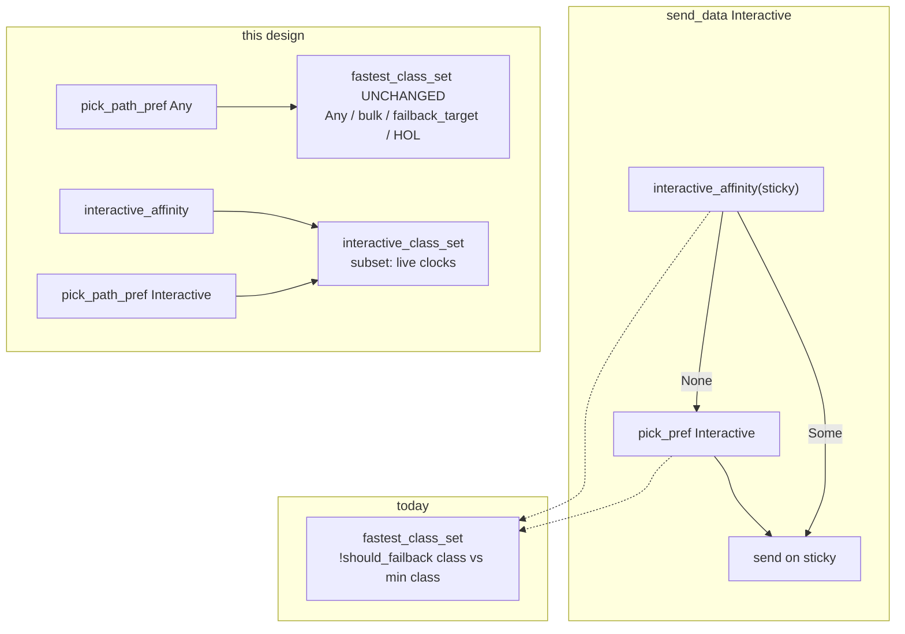

# Interactive class set: keep far-band ping off the 258 ms extra

| Field | Value |
| --- | --- |
| **Title** | `far_peer3_slow1` p50 class-jump door: root cause and interactive-only membership fix |
| **Author** | nya-link-aggregation maintainers |
| **Date** | 2026-09-11 |
| **Status** | Draft |
| **Audience** | Senior engineers working in `nya-core` scheduler / session pick / affinity, and `nya-e2e` mixed soak |
| **Predecessor** | `docs/design-interactive-ttfb-rto.md` (min-id affinity; `maybe_failback` stays dead). `docs/design-close-retry-silent-pick.md` (`maybe_failback` off maintain and off the send path). `docs/design-hytron-bulk-goodput.md` (`bulk_affinity`; `hol_place_bulk_fallback` must not call `fastest_class_set`). v0.1.4 `1cea024` / `9e65a70` (Pong/ACK cap is this dest's class, not `min_alive_fast`). |
| **Compatibility** | `PROTOCOL_VERSION` **stays 2**. No CloseAck. No new TOML keys. `[session]` stays `deny_unknown_fields` (four keys). One production `Tuning::STANDARD`. Do **not** retune `chan`, `initial_window`, `inflight_bias`, `loss_timeout_floor`, `close_linger`, `down_min_silence`, `interactive_max`, `class_drop_*`, `path_score` weights, or `failback_class_*`. |

---

## Overview

v0.1.4 mixed soak `far_peer3_slow1` fails the **peer-class p50 door**, not survival, not Hytron KB/s, not GitHub CI:

```
far_peer3_slow1_15m0s FAIL  p50=262.5ms  limit=250ms
note: p50 left peer class (limit 250ms)
surv=true n=9306/9306 ok_rate=1.000 min=185.4 avg=290.2 p90=400.3 p99=692.3
links at end: a:203ms b:226ms c:233ms s:285ms
tx=43840608 (bulk present) mig=0 down=294 hedge=2697 probe_miss=4722
```

The same 15 min without the extra slow link **passes** the same 250 ms door (`far_peer3` p50=239.5 ms). Adding bulk + `s=258±20` moves **median** application ping by **+23 ms**, and every one of the 15 one-minute windows is already above 250 ms. A 2 min rerun of the same case fails at the **identical** p50=262.5 ms, so this is not a 15 min time-weighted mix that only goes red after `peer_collapse`.

**Root cause is both a mechanism knife-edge and a door that was sized against the wrong peer.** It is not "jitter" and it is not the v0.1.4 near-band Pong poison (that is fixed; this row is the leftover red).

1. **Mechanism.** `PickPref::Interactive` and `interactive_affinity` both consume `fastest_class_set`, whose membership is `!should_failback(effective_class_rtt, best_class)`. The soak extra `s=258` was placed as a class-jump from **162 ms** (251 ms) but `far_peer3`'s fastest peer is **168 ms**, where 258 ms is **not** a class-jump (need 260 ms) and is only **14 ms** past `failback_delta(168)=75.6 ms`. Class freeze copies the **8th fast EWMA** (`path.rs` `update_class` L428–436, not a mean of eight samples), which on 258±20 routinely lands ~244 (15 min snapshots: `s#0` **class=244 ms** for most of the run). `should_failback(244, 168)` is 76 vs 75.6 — one millisecond. After the first peer fault (~2.8 s `flash_disconnect` on `a`), affinity pins ping on `s` because `maybe_failback` is dead and `Role::Slow` is mostly-stable. Median sits on the extra. Production 0.45 still says `s` is same-class vs an equal-clock recovered peer at ~200 (`should_failback(287, 203)` is 84 vs 91); Interactive must eject that snapshot with an extra cliff reused from `class_should_drop`, not wait for a lucky-low peer stable.

2. **Door.** 250 ms **is** the class-jump cliff from 162 ms, copied onto the p3 row. The honest p3 cliff is `168×1.5+8=260 ms`. `far_peer3` already consumes 239.5 of 250 (10.5 ms headroom). Raising the door enough to pass 262.5 without a membership fix (**~280 ms**) would hide sitting on `s`. So the door **stays 250**; the fix is an **Interactive-only** class set that uses live clocks, not a Tuning twist and not a door bump.

The fix introduces `interactive_class_set` in `scheduler.rs`, used by `pick_path_pref(Interactive)`, `interactive_affinity`, and `format_candidates` (`interactive_out=` debug suffix). Leave predicate is `should_failback(cand, best) || class_should_drop(cand, best)` — must-eject on equal-clock ~200, no new Tuning field. That extra cliff is ≈4/3: it also Interactive-splits native mid p3 `c=96` vs `a=68` (same 1.41× as 283/200). **Accepted:** ping sits on `{a,b}` while `a` is live (door 125 ms, v0.1.4 p50=105.1). `fastest_class_set` (bulk / `PickPref::Any` / `failback_target` / HOL) is unchanged. `maybe_failback` stays dead. After a recovered peer is live, the next Interactive `send_data` drops affinity on `s` and `pick_pref` returns to **a peer** (score winner among the tight set, not necessarily `a`) — that is the pull-off `peer_collapse` expected, without incrementing `failbacks`.

---

## Background & Motivation

### What the gate actually is

`crates/nya-e2e/src/mixed.rs` after a ≥8 min soak:

```1270:1277:crates/nya-e2e/src/mixed.rs
    if let Some(p50) = r.stats.percentile_us(50.0) {
        if p50 / 1000 > case.p50_ms {
            r.notes.push(format!(
                "p50={}us left peer class (limit {}ms)",
                p50, case.p50_ms
            ));
            r.sla.min_success = 2.0;
        }
    }
```

`p50` is **application** echo RTT from `workload.rs` `ping_for` (16-byte seq, overlay stream, origin echo). It is not path EWMA. `percentile_us` is a nearest-rank median of successful samples.

`far_suite()` (`mixed.rs` L418–458):

| Case | Topology | Workload | `p50_ms` |
| --- | --- | --- | --- |
| `far_peer3` | a=168±28, b=182±32, c=196±36, loss 1.5–1.8% | 3 ping, 0 bulk | 250 |
| `far_peer3_slow1` | same + `s=258±20` loss 0.5% | 3 ping + **1 bulk** | 250 |

Comment in-tree: *"Slow ~255–280ms: class-jump from 162ms (251ms), backup starts at 344ms."* 250 ms is that class-jump cliff. Intent: ping p50 must stay in the **peer** class, not sit on the 258 ms extra.

`Tuning::STANDARD` (`crates/nya-core/src/tuning.rs`):

| Knob | Value | Far 168 ms |
| --- | --- | --- |
| `failback_class_mult/add` | 1.5 + 8 ms | class-jump at **260 ms** |
| `failback_abs` / `failback_abs_frac` | 8 ms / 0.45 | `failback_delta=75.6 ms` |
| `backup_rtt_mult/add` | 2.0 + 20 ms | backup at **356 ms** |

`should_failback(258, 168)`: class-jump `258 ≥ 260`? **false**. delta `258-168=90 ≥ 75.6` → **true**. At **honest** class_rtt, `s` is out of `fastest_class_set`. The 258 ms extra is **not** a backup; it is a 0.45-delta candidate placed 2 ms short of class-jump from this row's fastest peer.

### v0.1.4 near-band poison is a different bug (do not reopen)

`1cea024` / `9e65a70`: Pong/ACK sample cap used pool `min_alive_fast`, so a 7 ms peer made `loss_timeout=20 ms` and **dropped 60 ms backup Pongs**. Lucky-low ACKs pulled class into the fast set; `interactive_affinity` stuck on the slow impair.

That fix (`session/mod.rs` `rtt_sample_cap`): cap = this dest's **class** (or stable), not `min_alive_fast`; known-path expired Pongs are clear-only (`allow_late=false`); ACK samples `< class/2` ignored.

After it: `failback_fast_paths` 3/3 PASS; mixed `--band near` 4/4, p50 ~32 ms; full mixed 16×15 min **15/16**; **only** `far_peer3_slow1` red. Far-band snapshots show `s` class 244–277 ms, not 7 ms. This is not residual sample-cap poison.

### Control rows (same binary, same 250 / band doors)

| Row | p50 | Door | Bulk on slow extra? | Result |
| --- | --- | --- | --- | --- |
| `far_peer3` 15 m | 239.5 | 250 | n/a | PASS, 10.5 ms headroom |
| `far_peer3_slow1` 15 m | **262.5** | 250 | s 28.7 MB / 83 MB WAN | FAIL +23 ms |
| `far_peer3_slow1` 2 m | **262.5** | 250 | s only 1.25 MB | FAIL, same median |
| `far_peer5_slow2` 15 m | 242.8 | 250 | s1+s2 ~92 MB | PASS, +3 ms vs p3 |
| `mid_peer3` / `_slow1` | 105.1 / 104.7 | 125 | s 87 MB | PASS, **0 ms** tax |
| `high_peer3` / `_slow1` | 175.6 / 183.9 | 190 | s 45 MB | PASS, +8 ms, 6 ms under door |

`mid_peer3_slow1` puts **more** bulk on the extra than `far_peer3_slow1` and ping p50 does **not** move. `far_peer5_slow2` puts even more bulk on two extras and ping p50 stays at 242.8. **Bulk-on-slow does not inflate application ping** when the extra is a true class-jump (mid 128 vs 68 is class-jump at 110 ms; far p5 255 vs 162 is class-jump at 251 ms).

The far p3 extra is the one that is **not** a class-jump from its own fastest peer.

### Soak numbers that pin the leak to ping-on-`s`, not HOL leftover

15 min `far_peer3_slow1` (`e2e-reports/far_peer3_slow1_15m0s.txt`):

- Every minute p50 ∈ [253.9, 274.6] — systematic, not a 20% mix. (A 20% / 80% mix of 280 ms and 220 ms would still have p50 in the 220 ms family; median is not a mean.)
- hist `80-200=114` vs `far_peer3`'s 228 — half as many sub-200 ms samples. The left half of the distribution lost the fastest dest.
- min=185.4 vs 181.4 — fastest samples still peer-like. Some pings do hit `a`.
- p90 400 vs 426 — **better** tail than `far_peer3`. Not a retry/hedge tail problem.
- `failbacks=0`, `hol=1`, `mig=0`. `maybe_failback` is dead (expected). One HOL at becoming-bulk.
- `s#0` class stays **244 ms** for long stretches (`s#0=283/152/244ms` in the switch log). Fast ~280–290. Stable 152 is a lucky-low; class did not follow it (`class_should_drop(244, 152)` is true but 7/8 drop is on `stable_up_hold`).
- End snapshot `a:203 b:226 c:233 s:285`. `should_failback(285, 203)`: class-jump 285≥312.5? no. delta=91.4; 82<91 → **`s` is in `fastest_class_set` at teardown.** "class looks correct (slow is slow)" means `s` did not freeze at 7 ms; it does **not** mean `s` is out of the class set.
- WAN: a 20.9 / b 18.7 / c 15.1 / **s 28.7 MB**. Bulk mixes onto `s` (allowed: `pick_retry_path` is not class-gated; `bulk_affinity` does not check class). `peer_wan_10pct_names=3` still passes.

2 min `far_peer3_slow1`:

- First fault on `a` is `flash_disconnect` at **t=2790 ms**. Minute 0 p50 is already 271.4.
- WAN `s` is only 1.25 MB — ping is 16 B, so ping-on-`s` does not show up in byte totals. p50=262.5 anyway. **Bulk-on-`s` is not required for the fail.**

Impair (`crates/nya-e2e/src/impair.rs`) is per-packet delay + independent loss, **no shared bandwidth queue**. Bulk on `a#1` does not add 23 ms to ping on `a#0` through the emulator. The +23 ms is dest choice.

### Why affinity keeps ping on `s` once it lands

```498:515:crates/nya-core/src/session/mod.rs
    fn interactive_affinity(&self, sticky: u32) -> Option<u32> {
        // ...
        let class = crate::scheduler::fastest_class_set(&paths, &self.inner.cfg);
        if !class.iter().any(|q| q.id == sticky) {
            return None;
        }
        Some(sticky)
    }
```

`send_data` Interactive (`streams.rs` L215–217): affinity else `pick_pref`. `maybe_failback` is `#[allow(dead_code)]` and is **not** on maintain or the send path (`steer.rs`). `Role::Slow` actors only fire `Kind::mild()` (delay_spike / jitter_burst / loss_burst) with long idle. Once ping Open/re-pick lands on `s`, sticky stays until `s` is unschedulable or leaves `fastest_class_set`.

`peer_collapse` (L896–936) blackholes every peer for 800–1500 ms up to twice per run, **forcing** traffic onto `s`, then lifts and "expects failback". With dead `maybe_failback`, the only pull-off is affinity returning None. If `s` is still in the class set after lift, ping stays. Collapse is not the first-minute cause (first collapse waits 180–280 s) but it is a second stick event on the 15 min row.

### Math the suite comment got wrong

```
class_jump from 162 ms = 162×1.5+8 = 251 ms   // far_peer5 fastest; door 250
class_jump from 168 ms = 168×1.5+8 = 260 ms   // far_peer3 fastest
failback_delta(168)    = 0.45×168   = 75.6 ms // 168+76 = 244 ms
backup from 168        = 168×2+20   = 356 ms
```

`s=258` vs `a=168`: out by **delta**, in by **class-jump**. Class freeze at 244 ms is **exactly** `168+failback_delta`. The extra was sized against p5's 162 ms then copied onto p3.

`effective_class_rtt` (`scheduler.rs` L43–51) yields fast only when `should_failback(class, fast)`. A recovered peer with class 200 / fast 168 does **not** yield 168 (`200-168=32 < failback_delta(168)=76`, and `class_should_drop(200, 168)` needs 50 ms). Min of the set becomes 200. Then `should_failback(244, 200)` is 44<90, and `s` **joins**. Transitivity of "not `should_failback`" is not an equivalence: 244 vs 168 **is** a failback.

This is the same 0.45 that must keep 198 vs 162 in one class (`health.rs` `failback_when_better_is_clearly_faster`: "Native far spread stays same-class; do not widen frac to fix it"). **Do not retune `failback_abs_frac`.** Interactive membership needs a live-clock predicate that 0.45 on frozen class_rtt does not provide.

---

## Goals & Non-Goals

### Goals

- Ping p50 on `far_peer3_slow1` stays in the peer class (≤250 ms door) because Interactive pick/affinity **does not land on `s`** while any unspiked peer is live, not because the door moved.
- Short unit (scheduler + session) reproduces "258 ms extra with lucky-low class freeze is in `fastest_class_set` but **out** of Interactive eligibility"; soak 15 min is confirmation, not the only proof.
- After `peer_collapse` / first `flash_disconnect` on `a`, the next Interactive `send_data` returns to a recovered peer without calling `maybe_failback` and without incrementing `failbacks`.
- Bulk may still use `s` (`bulk_affinity`, `pick_retry_path`, 10% WAN mix on peers). That is not the p50 bug (`mid_peer3_slow1`, `far_peer5_slow2`).

### Non-Goals

- Retune `failback_class_*`, `class_drop_*`, `path_score`, `inflight_bias`, `chan`, `loss_timeout_floor`, `interactive_max`.
- Restore `maybe_failback` on maintain or the send path. Failbacks stay cross-link only; e2e chatter door 25/min unchanged.
- Wire / `PROTOCOL_VERSION` / CloseAck / new TOML / `[session]` keys.
- Reopen Residual D, server origin-EOF silent linger, hangover bounce, write-stall-as-loss, `hold_stream_data` unknown-only, HOL calling `fastest_class_set`.
- Hytron hop ≫ 150 KB/s. This far-band soak is not that gate.
- Make `PickPref::Any` refuse `s`. Bulk mix across named links is a 15 min gate (`peer_wan_10pct_names`).
- "Fix" `far_peer3` 239.5 vs 250 headroom by loosening 0.45 so 196 vs 168 splits. Native far spread stays same-class.

---

## Proposed Design

### Architecture



```mermaid
sequenceDiagram
  participant Ping as ping send_data
  participant Aff as interactive_affinity
  participant ICS as interactive_class_set
  participant FCS as fastest_class_set
  participant Pick as pick_pref Interactive
  Note over Ping,FCS: t=2.8s a flash_disconnect, s class=244
  Ping->>Aff: sticky=s
  Aff->>ICS: is s eligible?
  ICS->>FCS: base set includes s (244 vs 200)
  ICS-->>Aff: None (cand 283 vs best 200; class_should_drop)
  Ping->>Pick: Interactive
  Pick->>ICS: candidates
  ICS-->>Pick: peers only
  Pick-->>Ping: a peer (path_score winner, not specifically a)
  Note over Ping: failbacks stays 0
```

### Predicate (exact)

New helpers in `crates/nya-core/src/scheduler.rs`. No new `Tuning` fields. Reuse `should_failback`, `class_jump`, `class_should_drop`, `class_drop_frac`.

**Leave cliff (KD7).** `should_failback` alone does **not** eject `s` on equal-clock recovered peers at ~200: `should_failback(283, 200)` is class-jump 283≥308? no; delta 83 < 90. That snapshot is real (`t=857382 a#0=205/203/205ms` with `s#0=287/159/244ms`; `should_failback(287, 203)` is 84 vs 91.4). A residual “one 168-stable pull-off plus affinity-on-peer” is **not** enough: every 15 min window is already p50>250, the 2 min row fails at the same 262.5 before `peer_collapse`, and `a` has 15 `flash_disconnect`s so sticky is re-picked while peers are inflated. Interactive therefore **must-eject** on that snapshot.

Extra cliff = `class_should_drop(cand, best)` — the existing “this gap is large enough that class would walk toward the lower clock” predicate (`tuning.rs` L178–183: `class − fast >= max(8 ms, 0.25 × class)`). No new constant. Combined:

```
interactive_leave(cand, best) =
    should_failback(cand, best)
    || class_should_drop(cand_us, best_us)
```

Worked: `class_should_drop(283_000, 200_000)` need `max(8_000, 70_750)=70_750`; gap 83_000 ≥ need → **eject**. Near 16 vs 9: need 8_000, gap 7_000 < need and `should_failback(16, 9)` is 7<8 → **stay**. Far peers 196 vs 168: need 49_000, gap 28_000 → **stay**. Native 198 vs 162 stays (`fastest_class_set` 0.45). Mid extra 128 vs 96: need 32_000, gap 32_000 → Interactive ejects the soak extra vs the slowest mid peer.

**Same 4/3 ratio, accepted:** native mid p3 `c=96` vs `a=68` is `96/68 = 1.412` (soak `283/200 = 1.415`). `should_failback(96, 68)` is **false** (class-jump needs 110; delta 28 < 30.6 — same-class in `fastest_class_set`; p5 `96 vs 62` already splits). `class_should_drop(96_000, 68_000)` is **true** (need 24_000, gap 28_000). No existing `Tuning` number separates 1.415 from 1.412 without a new constant (forbidden). **Product call (KD7):** accept Interactive `{a,b}` while `a` is live as a ping win. `c` returns when `a` is DEGRADED (`best=b=82`; `class_should_drop(96, 82)` need 24, gap 14 → stay). Mid door 125 ms; v0.1.4 `mid_peer3` p50=105.1. `PickPref::Any` still sees `{a,b,c}`.

```rust
/// Live RTT a dest may contribute as the Interactive *reference min*.
/// Spikes keep class (same as `effective_class_rtt` for fast >> class).
/// Lucky-low stable still in class-drop hold does not become the pool min
/// (s#0 stable=152 with class=244 must not look like the fastest dest).
fn interactive_best_rtt(cfg: &SessionConfig, p: &PathState) -> Duration {
    let fast = p.rtt();
    let class = p.class_rtt();
    let stable = p.stable_rtt();
    if p.class_known() && cfg.tuning.class_jump(fast, class) {
        return class;
    }
    let low = fast.min(stable).min(class);
    if p.class_known()
        && cfg
            .tuning
            .class_should_drop(class.as_micros() as u64, low.as_micros() as u64)
    {
        return class;
    }
    low
}

/// Pessimistic clock for the dest under test. Lucky-low class freeze
/// (244 on a 258±20 path) cannot hide a live-slow extra.
fn interactive_cand_rtt(p: &PathState) -> Duration {
    p.rtt().max(p.class_rtt())
}

fn interactive_leave(cfg: &SessionConfig, cand: Duration, best: Duration) -> bool {
    if best >= cand {
        return false;
    }
    health::should_failback(cfg, cand, best)
        || cfg.tuning.class_should_drop(
            cand.as_micros() as u64,
            best.as_micros() as u64,
        )
}

pub(crate) fn interactive_class_set<'a>(
    paths: &'a [Arc<PathState>],
    cfg: &SessionConfig,
) -> Vec<&'a Arc<PathState>> {
    let base = fastest_class_set(paths, cfg);
    if base.is_empty() {
        return base;
    }
    let unspiked: Vec<&Arc<PathState>> = base
        .iter()
        .copied()
        .filter(|p| !p.class_known() || !cfg.tuning.class_jump(p.rtt(), p.class_rtt()))
        .collect();
    let src = if unspiked.is_empty() { &base } else { &unspiked };
    let Some(raw_best) = src.iter().map(|p| interactive_best_rtt(cfg, p)).min() else {
        return base;
    };
    // Do not follow jitter low-tail below (1 - class_drop_frac) of min class.
    // Near: 12 ms class, fast 8 → floor 9 ms; should_failback(16, 9) is false
    // (abs 8) and class_should_drop(16ms, 9ms) is 7 < 8. Far equal-clock 200
    // does not need this floor; class_should_drop(283, 200) ejects on its own.
    let class_floor = src
        .iter()
        .filter(|p| p.class_known())
        .map(|p| p.class_rtt())
        .min()
        .map(|c| crate::tuning::scale(c, 1.0 - cfg.tuning.class_drop_frac, Duration::ZERO))
        .unwrap_or(raw_best);
    let best = raw_best.max(class_floor);
    let tight: Vec<&Arc<PathState>> = base
        .iter()
        .copied()
        .filter(|p| !interactive_leave(cfg, interactive_cand_rtt(p), best))
        .collect();
    if tight.is_empty() {
        base // all peers elevated / collapse: Interactive may sit on s
    } else {
        tight
    }
}
```

Call sites — **three**, all in-tree:

1. `pick_path_pref` (`scheduler.rs` L82–88):

```rust
pub fn pick_path_pref(
    paths: &[Arc<PathState>],
    cfg: &SessionConfig,
    pref: PickPref,
) -> Option<u32> {
    let cands = match pref {
        PickPref::Interactive => interactive_class_set(paths, cfg),
        PickPref::Any => fastest_class_set(paths, cfg),
    };
    pick_from(&cands, cfg, pref)
}
```

2. `Session::interactive_affinity` (`session/mod.rs` L498–515): replace `fastest_class_set` with `interactive_class_set`. Schedulable + `is_loss_fresh` checks stay.

3. `format_candidates` (`scheduler.rs` L241–285): keep scoring `fastest_class_set` (Any/class membership, existing `backup=` = alive not in that set). When `pref == PickPref::Interactive`, append ` interactive_out={name},...` for dests in `fastest_class_set` minus `interactive_class_set` (id/name sorted). Grammar addition is optional-suffix, same style as `backup=`. `open_stream` already `debug!`s this string (`streams.rs` L40–52); a red soak then shows `s#0` in `interactive_out=` instead of looking “in class”. Unit: E2b clocks, Interactive dump contains `interactive_out=s#0` and does not star `s`.

### Worked examples (must hold as unit assertions)

**E1. Honest far p3, the suite comment's intent**

| dest | fast / class / stable |
| --- | --- |
| a | 168 / 168 / 168 |
| s | 258 / 258 / 258 |

`fastest_class_set`: `should_failback(258, 168)` true → `s` out. `interactive_class_set` also out. No behavior change.

**E2. Two-dest leak lock (merge-critical): 244 vs 200, no honest `b=182`**

| dest | fast / class / stable |
| --- | --- |
| a | 213 / 200 / 168 |
| s | 283 / 244 / 152 |

No `b`/`c`. `effective_class_rtt(a)=200` (32 ms gap < 0.45). `should_failback(244, 200)` false → **`s` ∈ `fastest_class_set`**. This is the membership leak; it must not be masked by a class-jump vs an honest 182 ms sibling (`182×1.5+8=281`; cand 283 ≥ 281).

Interactive: `interactive_best_rtt(a)`: not spike, `class_should_drop(200, 168)` false → 168. `interactive_best_rtt(s)`: `class_should_drop(244, 152)` true → 244 (do not trust 152). `best=168`, floor=`200×0.75=150`, best stays 168. `interactive_cand_rtt(s)=max(283,244)=283`. `should_failback(283, 168)` true (class-jump 283≥260). **`s` ∉ `interactive_class_set`.** Affinity on `s` returns None. `pick_pref(Interactive)` returns **`a`** (only peer).

**E2b. Equal-clock recovered peer ~200 (must-eject; soak `t=857382`)**

| dest | fast / class / stable |
| --- | --- |
| a | 213 / 200 / 200 |
| s | 283 / 244 / 152 |

Stable=class on the peer. `interactive_best_rtt(a)=200`. `should_failback(283, 200)` is **false** (83 < 90). `class_should_drop(283_000, 200_000)` is **true** (83_000 ≥ 70_750). **`s` ∉ `interactive_class_set`.** Same two-dest topology. This is the snapshot 0.45 alone cannot fix.

Four-dest “peers stay together”: a as in E2b, b/c **inflated** ~220/220/220 (not honest 182 — that would class-jump-eject `s` by itself), s as above. `interactive_class_set` contains a,b,c not s. `pick_path_pref(Interactive)` ∈ {a,b,c}; with empty load `path_score` prefers the lowest class among them (a at 200), **not** a claim that score always picks `a` if b is 182.

**E3. Near jitter must not eject 16 ms peer**

| dest | fast / class |
| --- | --- |
| a | 8 / 12 |
| b | 16 / 16 |

`interactive_best_rtt(a)=8`, floor=`12×0.75=9`, `best=9`. `should_failback(16, 9)`: class-jump 16≥21.5? no. delta=8; 7<8. `class_should_drop(16_000, 9_000)`: need 8_000, gap 7_000. **b stays**. Production GZ–HK 7 vs 10: `should_failback(10, 7)` is 3<8, stays.

**E3b. Mid p3: Interactive `{a,b}` while `a` is live (accepted ping win)**

| dest | fast / class |
| --- | --- |
| a | 68 / 68 |
| b | 82 / 82 |
| c | 96 / 96 |

`fastest_class_set` = {a,b,c} (`should_failback(96, 68)` false). `interactive_class_set` = **{a,b}** (`class_should_drop(96_000, 68_000)` true). `pick_path_pref(Interactive)` ∈ {a,b}. When `a` is DEGRADED, `best=82`, `class_should_drop(96, 82)` false → `{b,c}`. No new Tuning field.

**E4. `peer_collapse`: peers DEGRADED, `s` UP**

`peer_collapse` (`mixed.rs` L896–936) blackholes peers 800–1500 ms. Far 168 ms `degrade_timeout` is ~336 ms (`health.rs`: `loss=2×168=336`), so collapse usually marks peers **DEGRADED** while `s` stays UP. `is_schedulable` is `is_up() && !congested && !write_stalled` (`path.rs` L207–208); `is_up` is **STATE_UP only**. `fastest_class_set`’s first filter then keeps only schedulable `s` — Interactive sits on `s` **without** needing the empty-tight fallback.

Empty-tight → base still covers all-DOWN / all-congested (no schedulable dest; later rungs `is_up` then all alive). After peers lift to UP, E2/E2b apply: next ping leaves `s`. `failbacks` stays 0. The first ~300 ms of a blackhole while peers are still UP is `pick_retry_path` / hedge (not class-gated), not this predicate.

**E5. Bulk unchanged**

`pick_path_pref(Any)` still `fastest_class_set`. `hol_place_bulk_fallback` still builds its own cand list (`scheduler.rs` L301–316). `bulk_affinity` still does not consult class. `far_class_cliff_min_182_includes_slow_but_scores_peer` stays.

### Why not compare class_rtt only (today) and why not retune 0.45

`failback_abs_frac=0.45` exists so 40 ms jitter on a 180 ms path does not split same-class peers (`health.rs` L286–291). The soak extra sits **on** that cliff at far p3. Tightening 0.45 to eject 258 vs 168 would also split 198 vs 162 (forbidden: "Native far spread stays same-class"). Widening it would let `s` in even at honest 168. `fastest_class_set` keeps 0.45. Interactive adds `class_should_drop(cand, best)` on live clocks so equal-clock ~200 ejects `s` without retuning 0.45. That is a ≈4/3 test: native mid p3 `96 vs 68` splits Interactive the same way (E3b, accepted). Far 196 vs 168 does not.

### `retry_after` / hedge are not the p50 mechanism

`retry_after` is still `loss_timeout(min_alive_fast)` (v0.1.4 TTFB). `data_hedge` 2697 vs `far_peer3`'s 1771 is extra bulk/ping copies onto other named links. First-arrival of a 16-byte ping on `a` at ~200 ms still beats a hedge on `s` at ~280 ms. Hedge cannot move **median** +23 ms unless the primary dest is already `s`. Do not clock Interactive retry against class to "fix" this row.

---

## API / Interface Changes

No public API. No TOML. No wire.

| Function | Before | After |
| --- | --- | --- |
| `pick_path_pref(..., Interactive)` | `pick_from(fastest_class_set)` | `pick_from(interactive_class_set)` |
| `pick_path_pref(..., Any)` / `pick_path` | `fastest_class_set` | unchanged |
| `Session::interactive_affinity` | sticky if in `fastest_class_set` | sticky if in `interactive_class_set` |
| `Session::bulk_affinity` | no class check | unchanged |
| `failback_target` / `maybe_failback` | dead on send/maintain | still dead |
| `hol_place_bulk_fallback` | own cand list | unchanged |
| `format_candidates` | scores `fastest_class_set`; `backup=` = alive not in that set | same, plus `interactive_out=` when `pref` is Interactive |

`interactive_class_set` is `pub(crate)` next to `fastest_class_set`. Tests in `scheduler.rs` may call it directly (same as `hol_place_bulk_fallback`).

---

## Data Model Changes

None. No new atomics, no class-clock rewrite, no snapshot field. `format_candidates` gains an optional ` interactive_out=` suffix (PR 1); not a metrics/catalog change.

---

## Alternatives Considered

### A. Raise `p50_ms` for far slow cases (rejected as the only fix)

| New door | From | vs 262.5 | Hides ping-on-`s`? |
| --- | --- | --- | --- |
| 260 | class-jump from p3 fastest 168 | still FAIL | no, but does not go green |
| 270 | 0.45 from 168 plus slack | PASS | **yes** — 262 is sitting on `s`, not on 196±36 |
| 280 | suite comment upper slow | PASS | **yes** |
| 344 | backup from 162 | PASS | yes, and then the door is not a class door |

`far_peer3` p50=239.5 plus the +3 ms bulk tax measured on `far_peer5_slow2` is **242.8**, under 250. A door bump is what you do if the mechanism fix lands and a later soak is still 251–255 from far jitter; it is **not** the fix for 262.5. Historical Aug 27–28 269/251/273/284 reds on this row are the same knife-edge, not a reason to hide it.

### B. Restore `maybe_failback` on maintain / send path (rejected)

`docs/design-close-retry-silent-pick.md` and `docs/design-interactive-ttfb-rto.md`: `maybe_failback` off maintain and off the send path; production `failbacks_class_empty=0`; chatter door 25/min. Restoring it to pull ping off `s` reopens Upgrade chatter on 0.45 among far peers (`failback_target` already special-cases "258 vs a busy 168 picks 182, and 258 vs 182 is not 0.45"). Interactive re-pick on the next 40–80 ms ping is enough and does not increment `failbacks`.

### C. `pick` never lands ping on `Role::Slow` (rejected)

`Role` is an e2e soak tag (`mixed.rs`), not a path property. Production has no Role. A "never pick the 4th named link" rule is topology-specific and fights `peer_collapse` (traffic **must** sit on the extra when all peers are blackholed). Soak collapse is peers **DEGRADED** so `fastest_class_set` already has only schedulable `s`; empty-tight is the all-DOWN belt.

### D. HOL isolate bulk harder / never co-locate bulk with ping (rejected as this fix)

`hol=1` already moved bulk once. `mid_peer3_slow1` and `far_peer5_slow2` prove bulk-on-extra does not move ping p50. 2 min `far_peer3_slow1` fails with almost no bytes on `s`. HOL is not the median shift. `hol_place_bulk_fallback` must not call `fastest_class_set` (Hytron). Do not reopen.

### E. Affinity skip class-jump dests only (rejected as insufficient)

`s=258` vs `a=168` is **not** a class-jump (260). Skipping only `class_jump` leaves `s` eligible. Equal-clock ~200 vs cand 283 is not a class-jump either (need 308). The leave predicate is `should_failback || class_should_drop` on live clocks, not class-jump alone.

### F. Residual: one 168-stable pull-off is enough (rejected)

`t=790228 a#0=213/168/200ms` would eject via `should_failback(283, 168)` even without the extra cliff. Affinity would then stick on a peer. That does **not** save the row:

- Every 15 one-minute p50 is already >250, including minutes **before** any 168-stable slice.
- 2 min fails at 262.5 from minute 0 (`flash_disconnect` on `a` at 2.8 s). No time for a late pull-off.
- `a` has 15 `flash_disconnect`s. Each re-picks while remaining peers may be equal-clock ~200 (`t=857382`). Sticky on `s` until `interactive_leave` is true.
- 2 min `a#0=199/188/199ms` vs `s` cand 267: `should_failback(267, 188)` is 79 vs 84.6 — **0.45 misses even a “low” stable**. `class_should_drop(267_000, 188_000)` hits (79_000 ≥ 66_750).

Must-eject with the extra cliff. Not a product fork that needs user input.

### G. Change class freeze / `class_drop_frac` so `s` cannot freeze at 244 (rejected)

Class freeze copies the 8th fast EWMA (`path.rs` `update_class`) and `class_drop_frac=0.25` is the anti-jitter-collapse control (`tuning.rs` L49–57). Retuning them to make one soak row green is the forbidden one-shot. Interactive distrusts a dest's lucky-low class **as a candidate** via `max(fast,class)` without changing freeze.

---

## Security & Privacy Considerations

No new attack surface. Pick still stays inside the existing path pool. Interactive refusing a live-slow dest cannot starve Open: empty-tight falls back to `fastest_class_set`, then the existing alive fallbacks. No new frames, no identity change, no extra logging of payloads. Debug `format_candidates` still lists `fastest_class_set` plus optional `interactive_out=` names (path names already in the dump).

---

## Observability

No new catalog counters (`n_counter` unchanged). Existing signals already diagnose this row:

| Signal | Expectation after fix |
| --- | --- |
| mixed note `p50=… left peer class` | absent on `far_peer3_slow1` |
| `failbacks` / `failbacks_per_min` | still 0 / ≪ 25 |
| `hol_rebalances` | still O(1) per bulk stream |
| `data_hedge` | may stay thousands; not the p50 gate |
| switch log `s#0=…/…/244ms` | class freeze may still look "in class"; ping must not follow it |
| WAN bytes on `s` | bulk may still dominate `s`; not a fail |
| `open_stream` `debug!` `format_candidates` | `interactive_out=s#0` when Interactive excluded `s`; `backup=` still means not in `fastest_class_set` |

If a later soak is red, the Open dump's `interactive_out=` is the log signal; replay those clocks in the two-dest unit. Do not add a production counter for "ping on slow extra".

Alerting: none. This is an e2e door, not a Signoz burn.

---

## Rollout Plan

1. Land PR 1 (scheduler + session units). No feature flag: the predicate is local, `PickPref::Any` unchanged, near-band units lock the 8 ms floor. **CI merge gate is units**, not a 15 min soak.
2. On PR 1 (checklist, not a second commit): `failback_fast_paths`; mixed `--band near` 4/4 at 2 min (affinity collapse); `prod_like_bulk_copy`.
3. Manual soak on PR 1: mixed `--band far --filter far_peer3_slow1` **15 min** is the row gate. A 2 min probe of *this* p3_slow1 row is informative (currently FAIL p50=262.5, same as 15 min) but **not** a far-band 4/4 gate: in-tree `far_peer5_slow2_2m0s` is already FAIL p50=257.9 while its 15 min is 242.8 PASS.
4. If 15 min `far_peer3_slow1` is still 251–255 with E2/E2b units green, that is **PR 2** (door on **that row only**), not a silent bump in PR 1.
5. Rollback: revert PR 1. No on-disk state. Chatter cannot have increased (`failbacks` still not on the send path).

No staged percentage. Overlay pick is process-local.

---

## Risks

| Risk | Severity | Mitigation |
| --- | --- | --- |
| Near 12 vs 16 splits when 12 jitters to 8 ms | Med | `class_drop_frac` floor on `best`; unit `near_16ms_peer_stays_in_interactive_when_12ms_jitters_to_8`. 7 vs 10 prod still 3<8 abs. |
| All Interactive Opens pile on min-id after the tighter set shrinks | Low | Same as today's min-id affinity on a quiet pool (`design-interactive-ttfb-rto.md`). Load_term still spreads new Opens inside the tight set. |
| `peer_collapse` has nowhere to send | Low | Soak shape: peers DEGRADED, `s` still schedulable → base set is already `{s}`. All-DOWN: empty-tight → base → alive `s`. |
| Bulk mix gate fails because Interactive also left `s` | Low | Bulk uses `Any` / `bulk_affinity` / retry, not Interactive. Control: `far_peer5_slow2` already mixes on extras. |
| 15 min still ~251–255 after membership fix (far jitter + 36 ms on c) | Low | Follow-up door **only** on `far_peer3_slow1` (not the no-slow row). Units still prove `s` ∉ `interactive_class_set`. Not in PR 1. |
| Affinity drop every 40 ms looks like failback chatter | Low | `failbacks` does not increment. No `set_sticky` storm beyond last-send. Chatter door is `failbacks/min`, not sticky writes. |
| `interactive_best_rtt` trusts a lucky-low **peer** stable and ejects far `c=196` | Low | `should_failback(196, 168)` is 28<75.6; `class_should_drop(196_000, 168_000)` is 28_000 < 49_000. Far `c` stays. |
| Native `s` fast dips to ~250 vs inflated peer 205 | Low | `class_should_drop(250, 205)` is 45 < 62.5 and 0.45 misses too. Soak `s` fast is 280–310 in the red windows; E2b locks 283 vs 200. Do not add a third cliff for a 250-vs-205 dip. |
| Mid p3 Interactive drops `c=96` while `a=68` is live (same 1.41× as E2b) | Low | **Accepted ping win** (KD7 / E3b). `fastest_class_set` still {a,b,c}. `c` returns when `a` is DEGRADED. Door 125 ms vs v0.1.4 p50=105.1. Unit `interactive_set_mid_p3_drops_c_when_a_live`. No new Tuning constant. |

---

## Open Questions

None that block implementation. Equal-clock ~200 is must-eject (KD7). Mid p3 Interactive `{a,b}` while `a` is live is an accepted ping win (E3b), not a user fork. Door stays 250 until a post-fix soak shows a **peer-only** p50 above 250; that would change **only** `far_peer3_slow1` (260 = class-jump from 168), not the no-slow row, and not as a hidden leak.

---

## Key Decisions

1. **Root cause is Interactive membership/affinity on a 0.45 knife-edge, not bulk HOL and not the v0.1.4 sample cap.** Evidence: mid/far5 bulk-on-slow does not move p50; 2 min fails with ~no bytes on `s`; every minute p50>250; `s#0` class=244; `should_failback(244, 200)` false; `maybe_failback` dead; `Role::Slow` stable. Severity: High if unfixed (the only remaining full-mixed red). Mitigation: `interactive_class_set`.

2. **Do not raise `p50_ms` as the fix.** 260 still fails 262.5; 270+ hides sitting on `s`. Keep 250. If a later door change is needed, change **only** `far_peer3_slow1` (the no-slow row already passes 239.5 with 10.5 ms headroom). Allowed only after two-dest units prove `s` is not Interactive-eligible.

3. **Do not retune `failback_abs_frac` / `failback_class_*` / `class_drop_*`.** 0.45 is the far same-class spread (198 vs 162). The extra was copied from p5's 162 ms cliff onto p3's 168 ms row; that is a test-topology accident, not a production-table bug.

4. **`fastest_class_set` unchanged.** Bulk mix, `failback_target`, HOL, and "spiked peer stays in class and loses score" stay on class_rtt 0.45. Interactive is a **subset**. `format_candidates` still *scores* `fastest_class_set`; PR 1 only appends `interactive_out=` when `pref` is Interactive.

5. **`maybe_failback` stays dead.** Pull-off-slow is the next Interactive `send_data` seeing affinity None. `failbacks` stays 0. Chatter door 25/min untouched.

6. **Collapse sits on `s` because peers are DEGRADED (`!is_schedulable`), not because empty-tight is the soak path.** Empty-tight → base remains the all-DOWN / all-congested belt.

7. **Interactive leave is `should_failback(cand, best) \|\| class_should_drop(cand, best)`.** Pessimistic cand `max(fast, class)`; trusted `best` with spike / drop-hold guards and `(1-class_drop_frac)` floor. **Must-eject** on equal-clock ~200 (E2b). Reuses `class_should_drop` (≈4/3 of cand, 8 ms abs) — not a new Tuning field, not a 0.45 retune. **Accepted side effect:** native mid p3 Interactive is `{a,b}` while `a=68` is live (`c=96` is 1.41×, same ratio as 283/200). `c` returns when `a` is DEGRADED. Far 196 vs 168 and 198 vs 162 stay. Rejected: new constant to separate 1.415 from 1.412; residual “168-stable pull-off is enough”.

8. **Proof is a two-dest unit (E2 + E2b), then this row’s 15 min soak.** A far-band 2 min 4/4 is not a gate (`far_peer5_slow2_2m0s` FAIL 257.9 / 15 min PASS 242.8). Do not wait 15 min to know the predicate is wrong.

---

## Tests

### Scheduler units (`crates/nya-core/src/scheduler.rs`)

Use existing `mk_class` / `mk_named`. Do **not** go through a 15 min soak.

| Test | Setup | Assert |
| --- | --- | --- |
| `interactive_set_ejects_s_when_peer_class_is_200` (**merge-critical, two-dest**) | **only** a 213/200/168 and s 283/244/152 (`rtt_stable_us` stored independently). **No** b=182 / c=196. | `should_failback(244 ms, 200 ms)` is false. `fastest_class_set` **contains** s. `interactive_class_set` **does not**. `pick_path_pref(Interactive)==a`. `pick_path_pref(Any)` is not required to eject s (score may still pick a). |
| `interactive_set_ejects_s_on_equal_clock_200` (**merge-critical, two-dest**) | **only** a 213/200/200 (stable=class) and s 283/244/152 | `should_failback(283, 200)` is false. `class_should_drop(283_000, 200_000)` is true. `fastest_class_set` contains s. `interactive_class_set` does not. `format_candidates(..., Interactive, Some(a))` contains `interactive_out=s#0` and does not star s. |
| `interactive_set_keeps_inflated_peers_together` | a 213/200/200, b 220/220/220, c 225/225/225, s 283/244/152 | Interactive set is {a,b,c} not s. Pick Interactive ∈ {a,b,c}. Honest 182 is **not** in this test (would class-jump-eject s by itself). |
| `interactive_set_ejects_honest_258_vs_168` | a 168/168, s 258/258 | both sets eject s (control that we did not *add* s to Any). |
| `near_16ms_peer_stays_in_interactive_when_12ms_jitters_to_8` | a fast 8 class 12, b 16/16 | `interactive_class_set` contains b. `pick_path_pref(Interactive)` may still pick a (score). |
| `interactive_set_sits_on_s_when_peers_degraded` | a,b,c `STATE_DEGRADED`; s 258 UP | Interactive pick is s. Soak collapse shape. |
| `interactive_set_sits_on_s_when_peers_down` | a,b,c DOWN; s 258 | Interactive pick is s (empty-tight / alive fallback). |
| `interactive_set_keeps_far_peers_together` | a 168, b 182, c 196 | all three in `interactive_class_set`. 198 vs 162 still together if added. |
| `interactive_set_mid_p3_drops_c_when_a_live` | a 68, b 82, c 96 (no extra). **Do not name this `keeps_mid_peers_together`.** | `fastest_class_set` = {a,b,c} (`should_failback(96, 68)` false). `interactive_class_set` = **{a,b}**. Pick Interactive ∈ {a,b}. With a `STATE_DEGRADED`, Interactive set contains c. |
| existing `spiked_peer_stays_in_class_and_loses_score` | unchanged | `fastest_class_set` still has spiked a; Interactive may drop spiked a — **add** `interactive_prefers_unspiked_sibling` asserting Interactive picks b not s. Ping win, not a regression. |
| existing `hol_fallback_never_picks_far_slow_from_182` | unchanged | still None. |
| existing `far_class_cliff_min_182_includes_slow_but_scores_peer` | unchanged | Any still scores peer. |
| existing `format_candidates_score_monotonic_star_on_winner` | unchanged | still `backup=` grammar; new suffix absent when pref is Any. |

For `mk_class` the helper today sets fast and class equal-or-as-given but stable=class. E2/E2b must `store` `rtt_stable_us` independently.

### Session units (`crates/nya-core/src/session/mod.rs`)

`inject_live` sets fast=stable=class=`rtt_ms`. After inject, poke clocks:

Two-dest only — same clocks as E2b so honest `b=182` cannot secretly class-jump-eject:

```rust
#[tokio::test]
async fn interactive_affinity_skips_far_slow_on_equal_clock_200() {
    let client = Session::new_client(SessionConfig::default());
    let (a, ..) = inject_live(&client, 1, "a#0", 168);
    let (s, ..) = inject_live(&client, 2, "s#0", 258);
    a.rtt_ewma_us.store(213_000, Ordering::Relaxed);
    a.rtt_class_us.store(200_000, Ordering::Relaxed);
    a.rtt_stable_us.store(200_000, Ordering::Relaxed);
    s.rtt_ewma_us.store(283_000, Ordering::Relaxed);
    s.rtt_class_us.store(244_000, Ordering::Relaxed);
    s.rtt_stable_us.store(152_000, Ordering::Relaxed);

    // Recover contract without a send_data script (`send_data` is private):
    // sticky on s, recovered equal-clock peer → affinity None, pick is a.
    assert!(
        client.interactive_affinity(2).is_none(),
        "s must not keep Interactive sticky vs equal-clock 200"
    );
    assert_eq!(client.pick_pref(PickPref::Interactive).unwrap(), 1);
    client.shutdown();
}
```

Also: same two-dest with a stable=168 (E2). Keep `interactive_affinity_still_skips_write_stalled`. If `send_data` is private, `interactive_affinity` + `pick_pref` **is** the recover contract; do not add a 15 min e2e as the only proof.

Keep `backup_pong_records_even_when_pool_has_fast_peer` (v0.1.4 cap). Do not change `rtt_sample_cap`.

### Mixed soak

- **Do not change** `far_suite()` RTTs or `p50_ms=250`.
- CI merge gate: the two-dest scheduler units + session affinity unit. Not mixed 2 min 4/4 far.
- Manual: `mixed --band far --filter far_peer3_slow1` **15 min**. A 2 min probe of this one row is ok as a smoke (p50 already matches 15 min at 262.5) but `far_peer5_slow2_2m0s` FAIL 257.9 vs 15 min PASS 242.8, so do not treat far 2 min as the band gate.
- Expect 15 min p50 in the 235–245 ms family of `far_peer3` 239.5 / `far_peer5_slow2` 15 min 242.8, `failbacks_per_min=0`, `peer_wan_10pct_names≥2`, `hol_rebalances` O(1).
- Regression pack on PR 1: `failback_fast_paths`; mixed `--band near` 4×2 min; `prod_like_bulk_copy`; Yuusei leftover / hop-RST units; chatter `failbacks/min`; `all_down` / `blackhole_all_5s`.

Optional later (not PR 1): a 30 s **fault-free** far p3+slow ping-only scenario if someone wants a faster e2e than mixed. The scheduler unit is the merge-critical proof.

---

## References

- `crates/nya-e2e/src/mixed.rs` — `MixCase`, `far_suite`, p50 door, bulk 10% WAN, `peer_collapse`
- `crates/nya-e2e/src/workload.rs` — `ping_for`, `percentile_us`
- `crates/nya-core/src/scheduler.rs` — `fastest_class_set`, `effective_class_rtt`, `failback_target`, `hol_place_bulk_fallback`, `pick_path_pref`
- `crates/nya-core/src/session/mod.rs` — `interactive_affinity`, `bulk_affinity`, `rtt_sample_cap`, `retry_after`
- `crates/nya-core/src/session/streams.rs` — `send_data` pick
- `crates/nya-core/src/session/steer.rs` — `maybe_hol`, `maybe_failback` (dead), `conn_has_interactive`
- `crates/nya-core/src/health.rs` / `tuning.rs` — `class_jump`, `should_failback`, `is_backup`, `class_should_drop`
- `crates/nya-core/src/path.rs` — class freeze copies the 8th fast EWMA (`update_class` L428–436), 7/8 raise/drop
- `e2e-reports/far_peer5_slow2_2m0s.txt` — 2 min FAIL p50=257.9 vs 15 min PASS 242.8 (do not gate far on 2 min 4/4)
- `docs/design-interactive-ttfb-rto.md` — min-id affinity, `maybe_failback` stays dead
- `docs/design-close-retry-silent-pick.md` — failbacks cross-link only, chatter 25/min
- `docs/design-hytron-bulk-goodput.md` — `bulk_affinity`, HOL must not call `fastest_class_set`
- `docs/ARCHITECTURE.md` — stream-control, pick vs last-send
- `e2e-reports/far_peer3_slow1_15m0s.txt`, `far_peer3_15m0s.txt`, `far_peer3_slow1_2m0s.txt`, `far_peer5_slow2_15m0s.txt`, `mid_peer3_slow1_15m0s.txt`

---

## PR Plan

### PR 1 — `interactive_class_set` + units

- **Title:** Interactive class set: keep far-band ping off the 258 ms extra
- **Files:** `crates/nya-core/src/scheduler.rs` (`interactive_best_rtt`, `interactive_cand_rtt`, `interactive_leave`, `interactive_class_set`, `pick_path_pref` branch, `format_candidates` `interactive_out=` suffix, scheduler tests including two-dest E2/E2b); `crates/nya-core/src/session/mod.rs` (`interactive_affinity` uses `interactive_class_set`; session test `interactive_affinity_skips_far_slow_on_equal_clock_200`); `docs/ARCHITECTURE.md` one sentence: Interactive membership is a live-clock subset of `fastest_class_set` (`should_failback \|\| class_should_drop`).
- **Dependencies:** none
- **Description:** Interactive Open/DATA/affinity no longer treat a dest as same-class just because frozen `class_rtt` sits inside 0.45 of an inflated peer. Must-eject on equal-clock ~200 via `class_should_drop`. `PickPref::Any`, HOL, `failback_target`, `maybe_failback` (dead), Tuning, TOML, protocol unchanged. **Merge gate: units** (two-dest E2/E2b, near 12-vs-16, `interactive_set_mid_p3_drops_c_when_a_live`, DEGRADED collapse, existing class tests, `interactive_affinity_still_skips_write_stalled`, `backup_pong_records_even_when_pool_has_fast_peer`). Soak is a checklist on this PR, not a second empty commit: `failback_fast_paths`; mixed `--band near` 4×2 min; `prod_like_bulk_copy`; **15 min** `far_peer3_slow1` (not far 2 min 4/4).

### PR 2 — (only if needed) door **only** `far_peer3_slow1`

- **Title:** far_peer3_slow1 p50 door 250 → 260 (class-jump from 168 ms)
- **Files:** `crates/nya-e2e/src/mixed.rs` `far_suite` `p50_ms` for **`far_peer3_slow1` only**. Do **not** move `far_peer3` (already 239.5 / 10.5 ms under 250) or the p5 rows (250 = class-jump from 162).
- **Dependencies:** PR 1. **Do not land without** `interactive_set_ejects_s_when_peer_class_is_200` and `interactive_set_ejects_s_on_equal_clock_200` still passing. A 260 door alone does not prove ping is off `s`; a sloppy 270 would pass 262.5 and hide the leak.
- **Description:** Only if 15 min `far_peer3_slow1` is still 251–255 with E2/E2b green. Align that row’s door with p3 class-jump math. Not a substitute for PR 1.
