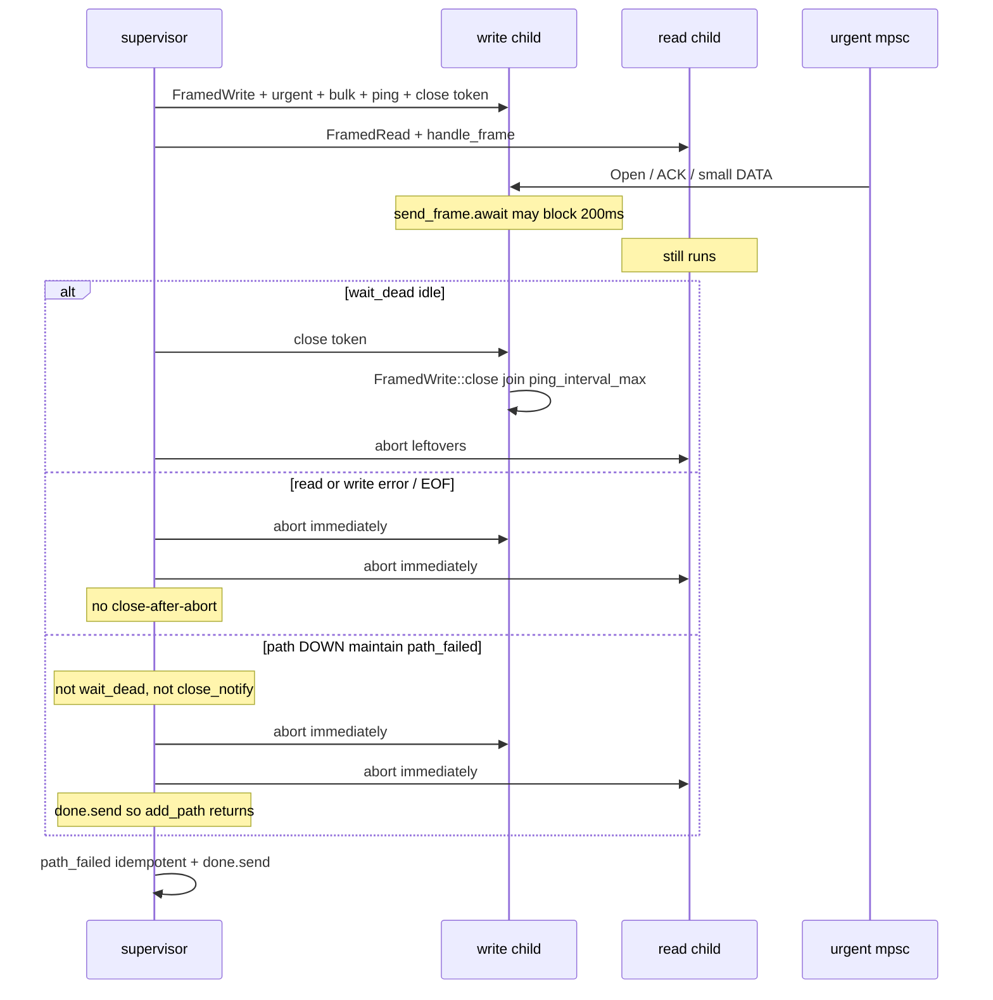

# Interactive TTFB: pin Open+DATA on one warm TCP, retry vs dests we can still send to, split path IO

| Field | Value |
| --- | --- |
| **Title** | Interactive TTFB vs Linux TCP min-RTO: pin Open+DATA, dest-RTT retry, RTT hygiene, path-IO split |
| **Author** | nya-link-aggregation maintainers |
| **Date** | 2026-08-31 |
| **Status** | Draft |
| **Audience** | Senior engineers working in `nya-core` session / scheduler / path IO, `nya-client` inbound, and `nya-e2e` prod-like first-byte SLA |
| **Predecessor** | `docs/design-path-agnostic-offset.md` (Implemented, `PROTOCOL_VERSION=2` / ALPN `nya/2`, commit `24298e3`). `docs/design-close-retry-silent-pick.md` (Implemented, commit `e941121`). |
| **Compatibility** | `PROTOCOL_VERSION` **stays 2**. No new TOML keys. `[session]` stays `deny_unknown_fields`. One production `Tuning::STANDARD`. No wire change. Path-agnostic offsets stay: one copy in flight, retry different `path_id`, first-arrival. |
| **Production** | `prod-gz-yuusei`, post-deploy window **10:50Z–11:35Z**. Server `run_id` `20260831T104804Z-28010ceb`, client `20260831T104841Z-3cb91b11`. |

---

## Overview

Path-agnostic offsets and Close-retry / silent-pick are in production. Manual tests through the overlay on `prod-gz-yuusei` are **mostly 8–15 ms**, with a **~40 ms** family (overlay `loss_timeout_floor` retry — acceptable) and **about every 15th request ~200 ms** — not acceptable. The same manual test through **one underlay 5-tuple** is **stable <10 ms**. Origin dial spans are deterministic per dest; no destination has a 1/15 200 ms think-time. This is overlay multiplexing, pick, and TCP interaction.

The 200 ms family is Linux `TCP_RTO_MIN` (200 ms) leaking through. `open_stream` still `pick_pref_spread`s Interactive Open across six equal-class ~7 ms paths (`3 ISPs × 2 conns`). `send_data` uses a **separate** `pick_pref` after `open_stream` has already `set_sticky` on the Open dest, so `load_term` self-penalizes that 5-tuple and first DATA lands on a sibling. Open therefore rides a ping-only TCP even when DATA finds a “warm” one. A lost Open on a thin 5-tuple waits kernel min-RTO unless overlay retry caps TTFB. Retry today is `loss_timeout(path.fast_rtt)` of the **sick** 5-tuple. A 200 ms TCP-RTO Pong is recorded even after `expire_stale_pings` dropped the pending Instant (`on_pong_record` wall-clock fallback), and StreamAck samples `last_sent.elapsed()` from enqueue. One 200 ms sample into EWMA 0.8/0.2 turns 7 ms into ~45 ms; retry becomes 90 ms, approaching useless vs 200 ms RTO. Independently, `spawn_path_io` is **one task** with `select biased` urgent-send → read → bulk → ping: `send_frame.await` (Sink send+flush) blocks the read loop while the TCP send buffer is full, so response DATA can sit unread in the kernel for the same 200 ms. SOCKS/Forward accepted sockets do not set `TCP_NODELAY` (overlay TLS and origin already do).

**This design pins Interactive Open *and* that stream’s Interactive DATA onto the same 5-tuple (no stream_id spread; sticky affinity for Interactive `send_data` while the dest is still fastest-class, schedulable, loss-fresh), clocks retry against the min fast RTT of dests we could still send to, refuses expired-Pong and delayed-ACK samples as path RTT, sets inbound nodelay, and splits path IO so reads never wait on writes.** One copy in flight. Clocks stay RTT multiples of existing `loss_timeout`. Path down stays pool hygiene (320 ms). No new Tuning keys. `PROTOCOL_VERSION` stays 2.

---

## Background & Motivation

### What already works (do not reopen)

Commit `24298e3` (`docs/design-path-agnostic-offset.md`):

- Each new offset / StreamOpen is sent **once** on `pick_pref` / `pick_pref_spread`.
- Unacked retry at `health::loss_timeout(cfg, path.rtt)` (`session/mod.rs` `retry_after`).
- `PROTOCOL_VERSION = 2`, ALPN `nya/2`. Concurrent k-send stays rejected.

Commit `e941121` (`docs/design-close-retry-silent-pick.md`):

- Pick excludes `last_rx_ago >= loss_timeout(path.rtt)` when a fresher class-set peer exists (`scheduler.rs` `loss_fresh_or_all`).
- Tried `path_id`s per in-flight copy; `pick_retry_path(..., tried: &[u32])`.
- StreamClose retries; linger is not product Timeout.
- `maybe_failback` is `#[allow(dead_code)]` and **not** on the send path (`steer.rs`). Production `failbacks_class_empty = 0` — keep it that way.

The data-plane retry of DATA/Open/Close is the working TTFB mechanism. It is not capping the 200 ms tail.

### Manual test vs single-link (the existence proof)

| Path | First-byte |
| --- | --- |
| Overlay (6 equal-class 5-tuples) | most **8–15 ms**; occasional **40 ms**; **~1/15 ~200 ms** |
| One named underlay link (single 5-tuple) | **stable <10 ms** |

The warm TCP is fine. Spraying Open onto ping-only siblings is not. Do not "fix" origin Happy Eyeballs; do not retune `down_min_silence` / `ping_interval_*` / `loss_timeout_floor` as a 200 ms knob.

### Production counters (`prod-gz-yuusei`, 10:50Z–11:35Z)

| Series | Client | Server | Reading |
| --- | --- | --- | --- |
| streams opened / closed | 2054 / 2044 | 2039 / 2025 | healthy open/close |
| timeout resets | 5 | 9 | not the 200 ms TTFB (those still succeed) |
| linger | 28 | 25 | Close-retry series |
| **data_hedge** | **1952 (≈0.95 / stream)** | 425 | almost every client stream retries once |
| data_retransmit | 208 | 188 | same-link retry |
| close_retry | 8 | 1 | Close-retry working, rare |
| migrates | 0 | 0 | sticky gone from send path |
| failbacks_class_empty | 0 | 0 | dead code, not on send path |
| path_down | 33 | 33 | nsix#0 8, akcdn#0 7, others 4–5 — pool hygiene |
| probe_miss | ~2.6k | ~2.9k | expire_stale_pings on stable_rtt loss_timeout |
| hol_rebalances | 624 | 1787 | bulk isolation onto same-link sibling |
| frame_send_drop | 13 | 0 | urgent/bulk mpsc full |
| stall_ms count / sum | 4850 / 4.1e6 | 3746 / 9.7e6 | see CDF |

Stall CDF client (`STALL_MS_BOUNDS` 20, 50, 100, 200, 500, … in `metrics.rs`):

| Bucket | Cumulative | Slice | Reading |
| --- | --- | --- | --- |
| le20 | 0 | — | floor is 20 ms |
| le50 | 1646 | **(20,50] 34%** | `loss_timeout_floor` retry (~40 ms user) — **expected, acceptable** |
| le100 | 3190 | (50,100] 32% | |
| le200 | 3909 | (100,200] 15% | |
| le500 | 4718 | **(200,500] 17%** | **200 ms family — the bug** |

`scan_stall` (`steer.rs`) prefers `last_ack_ms` as send origin when unacked is non-empty — think-time inflates stall. Stall is **not** TTFB. The 200 ms family is still real (manual test + RTT max + Linux min-RTO). Do not block the TTFB fix on redefining stall. Do not use hedge as a TTFB proxy: 0.95/stream vs user mostly 8–15 ms is **false retries** (enqueue `last_sent` + 7 ms RTT + queue ≥ 20 ms floor) plus real 40 ms retries.

Path RTT latest **~7.0–8.1 ms on all six client paths**. RTT **max** in window: nsix#0 / #1 client **40.7 / 41.4 ms**; soy / akcdn max 8–13 ms. Server nsix 41–48 ms. Fast EWMA is `(old * 8 + sample * 2) / 10` (`path.rs` `record_rtt`). One 200 ms sample into 7 ms → **~45 ms**. Matches nsix max. Overlay cannot invent a fourth ISP; nsix jitter is underlay. The bug is letting that 200 ms sample (and min-RTO) become user TTFB and then stretching retry toward it.

### Origin dial is not the 1/15 200 ms (do not "fix" Happy Eyeballs)

`nya.outbound.dial`, last 500 spans, **deterministic per dest**:

| Dest | Dial |
| --- | --- |
| `175.99.218.72:80` | always ~23 ms |
| `cp.cloudflare.com:443` | always ~3 ms |
| `175.99.29.65:80` | always ~23 ms |
| `217.116.175.244:80` | always ~31 ms |
| `173.249.210.102:80` | always ~158 ms (soak host, every 30s ×2) |
| `pzhkt.388222.xyz:52471` | n=4, 5.5–12.5 ms (manual-test shaped) |

**No destination has a 1/15 200 ms dial.** Park Happy Eyeballs. Do not treat `173.249.210.102` 158 ms soak as this bug.

### Current contracts that produce the 200 ms

#### 1. Open spread onto thin TCP; first DATA does not share that 5-tuple

```22:32:crates/nya-core/src/session/streams.rs
    pub async fn open_stream(&self, target: Target) -> Result<TunnelStream, SessionError> {
        // ...
        let path_id = self
            .pick_pref_spread(crate::scheduler::PickPref::Interactive, id)
            .ok_or(SessionError::NoPath)?;
        let (tun, _st) = self.alloc_local_stream(id);
        self.set_sticky(id, path_id);
```

```205:212:crates/nya-core/src/session/streams.rs
            let pref = if st.bulk.load(Ordering::Relaxed) {
                PickPref::Any
            } else {
                PickPref::Interactive
            };
            let mut path_id = loop {
                if let Some(p) = self.pick_pref(pref) {
```

`pick_from_spread` (`scheduler.rs`) takes the loss-fresh class set, scores it, then **rotates exact `(score, known)` ties by `(stream_id - 1) % n`**. Prod is six equal-class 7 ms paths. Every 6th Open goes to a given 5-tuple.

`send_data` does **not** reuse sticky as affinity. `load_term` for `PickPref::Interactive` is `1 + inf/(bias/4) + sticky` (`scheduler.rs` L35). Quiet-pool sequence today:

1. Open → path 1 (spread or min-id), `set_sticky` → sticky=1 on path 1.
2. First DATA `pick_pref(Interactive)` → path 1 is load 2 vs siblings load 1 → **not a tie** → path 2.
3. `set_sticky` moves the stream to path 2.

Path 1 then carries Open + pings only — still a **thin** TCP. Path-agnostic offsets deliver DATA that arrived on path 2; they do not make Open’s 5-tuple warm. Deleting spread **without** DATA affinity makes every sequential Open land on ping-only min-id while DATA lives elsewhere — potentially **worse** than today’s 1/6 Opens that happen to coincide with the DATA path.

Linux `TCP_RTO_MIN` is 200 ms. Thin streams (Ping ≈ 17 B + occasional Open) that lose a packet wait min-RTO. Overlay retry is supposed to cap that. 40 ms = `loss_timeout_floor` retry (working). 200 ms = min-RTO leaking through.

#### 2. Retry waits 2× the sick 5-tuple

```389:394:crates/nya-core/src/session/mod.rs
    fn retry_after(&self, path_id: u32) -> Duration {
        match self.get_path(path_id) {
            Some(p) => health::loss_timeout(&self.inner.cfg, p.rtt()),
            None => self.inner.cfg.tuning.loss_timeout_floor,
        }
    }
```

`p.rtt()` is **fast EWMA**. After a 200 ms sample → ~45 ms → `loss_timeout` = `clamp(2×45, 20, 2000)` = **90 ms**. Open / DATA / Close retry (`retry_opens`, `retry_expired_unacked`, `retry_closes`) all call this. First-arrival wants "is this copy late vs a dest we could still send to", not "wait twice the broken 5-tuple" and not "2× frozen class_rtt forever". `min_known_rtt()` already exists (`session/mod.rs`, min **fast** EWMA among paths still in the map — DOWN are removed at `path_failed`) and on this pool is ~7 ms → `loss_timeout` = **20 ms floor**. `pick_retry_path(&[a0], &cfg, &[1])` is already `None` (`scheduler.rs` `retry_none_when_only_avoid_is_alive`); `retry_opens` / `retry_expired_unacked` **skip** when there is no alt — they do not cancel the in-flight copy.

Maintain stays 5 ms. Floor stays 20 ms. One copy in flight. Must not spam.

#### 3. Late Pong and delayed ACK poison fast EWMA

Maintain expires pending pings on **stable** RTT (`steer.rs`):

```52:53:crates/nya-core/src/session/steer.rs
            let loss_for = health::loss_timeout(&self.inner.cfg, p.stable_rtt());
            let miss = p.expire_stale_pings(loss_for);
```

On a 7 ms path that is 20 ms. The pending Instant is gone. A TCP-RTO Pong still arrives with `sent_at_ms` on the wire:

```497:510:crates/nya-core/src/path.rs
    pub fn on_pong_record(&self, seq: u64, sent_at_ms: u64, record: bool) {
        let started = self.pending_ping.lock().unwrap().remove(&seq);
        if !record {
            return;
        }
        if let Some(t0) = started {
            self.record_rtt(t0.elapsed());
            return;
        }
        let now = now_ms();
        if now >= sent_at_ms {
            self.record_rtt(Duration::from_millis(now - sent_at_ms));
        }
    }
```

Expired seq → wall-clock `now_ms - sent_at_ms` → 200 ms `record_rtt`. That is the nsix 45 ms EWMA.

`on_ack` (`streams.rs`) samples `u.last_sent.elapsed()` when payload ≤ `interactive_max` (1500 **bytes**), `ack_rtt_min < sample < ack_rtt_max` (100 µs / **2 s**), and inflight `< inflight_bias`. `last_sent` is set at **enqueue** (`send_data` insert, `remember_open` `sent_at`). Delayed ACK / queue / app delay is recorded as path RTT. Ping/Pong Instant is the primary RTT; ACK must not move fast EWMA past the retry clock.

#### 4. Path IO: write blocks read (retry cannot help)

```567:614:crates/nya-core/src/path.rs
            tokio::select! {
                biased;
                out = urgent.recv() => {
                    // send_frame.await  — Sink send+flush
                }
                incoming = framed.next() => { /* decode + handle_frame */ }
                out = rx.recv() => { /* send_frame.await */ }
                _ = tokio::time::sleep_until(next_ping) => { /* ping */ }
```

One `Framed<TlsStream, LengthDelimitedCodec>`. `send_frame` is `framed.send(bytes).await` (encode + write + flush). While that future is pending, `framed.next()` cannot run. If the peer is not ACKing (RTO in progress), the TCP send buffer fills, flush blocks, **response DATA sits in the kernel unread for 200 ms**. Overlay retry of Open onto another path does not move DATA the server already sent on this TCP. Biased select that always prefers urgent over read is the same hole when urgent is ready.

`one_conn_stall` in e2e (`set_conn_stall`) already exists for send-buffer HOL; it gates the 1500 **ms** ping timeout / failover budget (`Sla::failover(120, 1500)`), not SOCKS first-byte.

#### 5. SOCKS/Forward inbound lacks `TCP_NODELAY`

| Socket | nodelay? |
| --- | --- |
| Overlay TLS client (`tls.rs` `connect_pinned`) | **yes** (`tcp.set_nodelay(true)`) |
| Overlay TLS server (`nya-server/src/lib.rs` `serve_one`) | **yes** |
| Origin dial (`nya-server/src/outbound.rs`) | **yes** |
| SOCKS / Forward accepted (`nya-client/src/inbound.rs`) | **no** — `listener.accept` then spawn; zero `set_nodelay` in `nya-client` |

Localhost Nagle + delayed ACK is a known 40 ms (Linux `tcp_delack_min`) / 200 ms (Windows / RTO) SOCKS bug. Single-link test may or may not have used the same SOCKS; still fix. Forward inbound is the same hole.

### Clocks (do not retune)

On a 7 ms path with `Tuning::STANDARD` + `SessionConfig` defaults:

| Clock | Formula | 7 ms path |
| --- | --- | --- |
| `loss_timeout` | `clamp(2×RTT, 20ms, 2000ms)` | **20 ms floor** |
| `degrade_timeout` | `max(loss, probe+rtt, ping_interval_max)` | **50 ms** |
| `down_timeout` | `max(5×RTT, down_min_silence=320ms) + probe` | **~330 ms** |
| `maintain_interval` | 5 ms | retry detection granularity |
| `ack_rtt_max` | 2 s | **too loose** as an ACK-as-RTT cap; do not retune the field — cap ACK samples with the same `loss_timeout` as `retry_after` |
| Linux `TCP_RTO_MIN` | kernel | **200 ms** — overlay must cap TTFB before this |

Do not retune `down_min_silence` / `ping_interval_*` / `loss_timeout_floor` (20 ms) / `interactive_max` (1500 **bytes**) / `ack_rtt_max` as a fitted 200 ms knob.

---

## Goals & Non-Goals

### Goals

1. **Interactive Open *and* first Interactive DATA share one 5-tuple on a quiet pool.** `open_stream` uses `pick_pref(Interactive)`, not `pick_from_spread`. `send_data` prefers `st.sticky` while that path is still in `fastest_class_set`, schedulable, and loss-fresh. HOL isolation stays `hol_place_bulk` onto the same-link sibling — bulk may leave; interactive stays on that dest.
2. **Retry clock is “late vs a dest we could still send to”, not 2× the sick 5-tuple and not 2× frozen class.** `retry_after` = `loss_timeout(min_alive_fast)` (min **fast** EWMA among alive `rtt_known` paths). Floor 20 ms, ceil 2 s. A 200 ms poisoned EWMA on nsix must not delay the hedge onto soy/akcdn. Two honestly-180 ms dests with class frozen at 7 ms must **not** rotate copies every 20 ms. If `pick_retry_path` returns `None`, skip (today’s behavior; do not replace the in-flight copy).
3. **RTT sample hygiene.** Expired Pong: known path is clear-only (TCP min-RTO must not poison EWMA); unknown path still takes a first wall-clock sample capped by `ack_rtt_max` so a 60–200 ms dest can freeze class. StreamAck: do not `record_rtt` when `sample > retry_after`’s clock (`loss_timeout(min_alive_fast)`). Ping/Pong Instant remains primary.
4. **Inbound `TCP_NODELAY`** on SOCKS and Forward accepted sockets.
5. **Path IO: `framed.next()` never waits on `send_frame.await`.** Split TLS into a read task and a write task. Children do not `path_failed` / `close`; supervisor owns lifecycle **and** observes `!path.is_alive()` so maintain silent-tear still completes `add_path` / `run_link` reconnect.
6. **e2e split:** a **product SLO** (3×2, one unimpaired 5-tuple, interactive payload ≤1500 B, `first_byte_sla(120, 0.95)`, p99 ≪ 200 ms) **and** a **forced-retry** gate (Open lands on an impaired dest while a healthy dest exists; fail if retry waits `loss_timeout(200ms)`). Existing `prod_like_*` stay green.
7. **No new TOML / Tuning fields / proto bump.** Tests clone-and-mutate only.

### Non-goals

- Retune `down_min_silence` / `ping_interval_*` / `loss_timeout_floor` to hide 200 ms.
- Concurrent k-copy of one offset (rejected; stays rejected).
- Happy Eyeballs on origin dial (park; `173.249.210.102` 158 ms is a slow dest, not 1/15).
- Restoring `maybe_failback` onto the send path.
- Changing `PROTOCOL_VERSION` / ALPN.
- Snapshot hop hists to OTLP.
- Redefining `scan_stall` as a merge-blocking change (optional small fix only if it fits; do not expand the PR).
- Using stall mean or `data_hedge` as a product TTFB gate.
- Inventing a fourth ISP; nsix dual-down stays underlay.

---

## Proposed Design

```mermaid
flowchart TB
  subgraph A [A. Interactive pick]
    Open[open_stream] --> Pref["pick_pref(Interactive) min-id ties"]
    Pref --> Stick[set_sticky]
    Data[send_data Interactive] --> Aff{"sticky still class + schedulable + loss-fresh?"}
    Aff -->|yes| Stick
    Aff -->|no| Pref
    Spread[pick_from_spread] -.->|delete call + helpers| X[gone]
  end
  subgraph B [B. Retry clock]
    RA[retry_after] --> MinFast["loss_timeout(min alive fast EWMA)"]
    MinFast --> Skip{"pick_retry_path None?"}
    Skip -->|yes| Hold[keep in-flight copy]
    Skip -->|no| Rehome[replace onto alt]
  end
  subgraph C [C. RTT hygiene]
    Pong[on_pong_record expired seq] --> Clear[clear pending only]
    Ack[on_ack sample] --> Cap{"sample <= loss_timeout(min_alive_fast)?"}
    Cap -->|no| NoRec[do not record_rtt]
    Cap -->|yes| Rec[record_rtt]
  end
  subgraph D [D. Inbound]
    Acc[SOCKS / Forward accept] --> Nagle["set_nodelay(true)"]
  end
  subgraph E [E. Path IO]
    TLS[TlsStream] --> Split["tokio::io::split — not Framed::split"]
    Split --> R[read child: FramedRead + handle_frame]
    Split --> W[write child: FramedWrite urgent / bulk / ping]
    R --> Sup[supervisor: close-on-idle / abort-on-error / abort-on-DOWN / done.send]
    W --> Sup
  end
```



### A. Interactive pick: stop stream_id spread; pin first DATA to Open’s 5-tuple

**Contract:** Interactive Open **and** the first Interactive DATA of that stream share a 5-tuple on a quiet pool. Deleting spread without this affinity is a TTFB regression (Open on ping-only min-id, DATA on a sibling).

#### A1. Open uses `pick_pref(Interactive)`

```rust
let path_id = self
    .pick_pref(crate::scheduler::PickPref::Interactive)
    .ok_or(SessionError::NoPath)?;
```

`Session::pick_pref` → `pick_path_pref` → `pick_from` → `pick_from_scored` (min-id among equal `(score, known)`). `set_sticky(id, path_id)` stays where it is (`streams.rs` L32) — last-send + affinity seed.

**Delete** (do not leave Open on spread; unused helpers are dead_code):

| Symbol | File |
| --- | --- |
| `Session::pick_pref_spread` | `session/mod.rs` |
| `pick_path_pref_spread` | `scheduler.rs` |
| `pick_from_spread` | `scheduler.rs` |
| import of `pick_path_pref_spread` | `session/mod.rs` |

**Delete tests that lock spread** (`scheduler.rs`): `spread_does_not_rotate_onto_silent_equal_score_sibling`, `zero_load_sequential_spreads`, `load_beats_spread`, `in_class_6_vs_7_does_not_spread`. Silent-skip coverage remains on `pick_path` / `pick_from` (`pick_skips_silent_but_up_when_a_fresh_peer_exists`, etc.).

#### A2. Interactive `send_data` sticky affinity (chosen implementation)

Smallest diff that actually shares a TCP with Open. **Not** a restore of sticky-as-home for bulk, failback, or retry.

In `send_data`, when `pref == PickPref::Interactive`, prefer `st.sticky` if `interactive_affinity` returns it; otherwise the existing `pick_pref` loop.

```rust
fn interactive_affinity(&self, sticky: u32) -> Option<u32> {
    if sticky == 0 {
        return None; // StreamState::new; path ids start at 1
    }
    let p = self.get_path(sticky)?;
    if !p.is_schedulable() {
        return None;
    }
    if !crate::scheduler::is_loss_fresh(&self.inner.cfg, &p) {
        return None;
    }
    let class = crate::scheduler::fastest_class_set(&self.path_list(), &self.inner.cfg);
    if !class.iter().any(|q| q.id == sticky) {
        return None;
    }
    Some(sticky)
}
```

Quiet-pool sequence after A1+A2:

1. Open `pick_pref` → path 1 (min-id among ties), `set_sticky`.
2. First DATA `interactive_affinity` → path 1 still class / schedulable / loss-fresh → **same** `path_id`.
3. That kernel TCP sees Open+DATA and stays warm. The other five stay ping-only.

**Not affinity:**

- Bulk (`st.bulk` / `PickPref::Any`): still `pick_pref` + `hol_place_bulk` onto the same-link sibling.
- Retry: still `pick_retry_path` / `tried` (one copy in flight; do not pin retry to sticky).
- `send_on_path` false on the affinity dest: existing `pick_retry` alt.
- Sticky dest left the class, went silent, or congested: fall back to `pick_pref`.

This is last-send **reuse with a gate**, not `ensure_sticky`. `maybe_failback` stays dead.

**Rejected for this pin** (see Alternatives 10): delay `set_sticky` until first DATA (Open dest still thin until DATA; HOL/`load_term` blind until then); `load_term` ignores *this* stream’s sticky (every Interactive pick still prefers empty siblings for **new** streams, and first DATA of *this* stream still self-penalizes unless Open’s sticky is excluded with a stream-id filter that `path_score` does not have).

#### A3. Silent-skip clock (same helper as retry freshness)

**Do not** leave `is_loss_fresh` on sick-path fast EWMA only. After C, a leftover 45 ms fast would skip a silent path only at 90 ms while retry already fired at 20 ms.

```rust
/// Per-path input to `loss_timeout` for pick freshness.
/// `min(fast, class)` so a poisoned fast EWMA cannot hide a silent path
/// for 2×45 ms while class is still 7 ms. Slow-only freeze (class 7 ms,
/// fast 180 ms): skip at 20 ms; `loss_fresh_or_all` already falls back
/// to the same candidate list when every member looks stale.
pub fn path_loss_rtt(p: &PathState) -> Duration {
    p.rtt().min(p.class_rtt())
}

pub fn is_loss_fresh(cfg: &SessionConfig, p: &PathState) -> bool {
    p.last_rx_ago() < health::loss_timeout(cfg, path_loss_rtt(p))
}
```

`loss_fresh_or_all` keeps consuming `is_loss_fresh`. `scan_stall` **stays** on `loss_timeout(..., p.rtt())` — do not expand this PR into a stall-origin rewrite. Divergence (pick hygiene vs stall hist) is accepted.

HOL (`hol_place_bulk`, `should_rebalance_conn`) unchanged except they inherit the tighter `is_loss_fresh`. `maybe_failback` stays dead.

**Why min-id + affinity, not link-spread.** Alternative: one path per `link_key`, pick min score among those (three warm TCPs, HOL sibling free). Rejected for this ship: single-link <10 ms is the existence proof that **one** warm 5-tuple is enough; HOL already wants the sibling free for bulk; retry (B) still escapes a dead min-id at `loss_timeout(min_alive_fast)` onto another `link_key`. Soak trigger for revisiting link-spread: sequential **p50** sits in the 40 ms retry family while soy/akcdn class is live (Key Decision / Risks) — that is score-blind min-id, not underlay.

**Concurrent streams.** New streams still `pick_pref` (load_term penalizes inflight/sticky). That is load spread of **new Opens**, not stream_id rotation, and not first-DATA leaving Open’s TCP. Do not invert `load_term` in this PR.

**Update** the `scheduler.rs` module comment: drop stream_id spread. New streams stay on the fastest class; exact ties pick min-id; Interactive DATA may reuse last-send while that dest is still the class dest; HOL is same-link rebalance.

**Merge-gate unit tests:**

- Six equal 7 ms paths: consecutive `pick_path_pref(..., Interactive)` all return the same min-id (spread is gone).
- Six equal 7 ms paths: `open_stream` then one Interactive `send_data` (write ≤ `interactive_max` through the `TunnelStream` pump; session test inspects `OpenUnacked.path_id` and the DATA `Unacked.path_id`) → **same** `path_id`. The pick-only test is not sufficient.

### B. Retry clock: late vs dests we could still send to

**Key decision:** `retry_after` is “is this copy late vs a dest we could still send to?”, not “2× this path’s class forever” and not “2× this path’s poisoned fast EWMA”.

Delay-spike **keeps class** (`scheduler.rs` L39–42). After C, expired Pongs no longer lift fast EWMA, but an Instant sample still in pending — or a leftover — can leave `fast ≈ 180 ms` with `class ≈ 7 ms`. `min(fast, class, min_known)` then becomes 7 ms on a pool whose **remaining alive dests** are all 180 ms: copies rotate every 20 ms (`pick_retry_path` last rung is any other alive). TTFB is still ~180 ms (first-arrival); the damage is hedge spam and extra HOL.

**Do not** fold class into `min_known_rtt`. That helper is min **fast** EWMA among paths still in the map (DOWN already removed at `path_failed` L336). It is also `expire_early_data`’s clock (`2 × loss_timeout(min_known)`, `session/mod.rs` L734–736). Tightening it with class would drop early DATA at 40 ms on a 7 ms freeze. Leave `min_known_rtt` as min alive fast; Open retry is 1× that clock, early DATA stays a second cycle.

Replace `retry_after`:

```rust
fn min_alive_fast_rtt(&self) -> Option<Duration> {
    self.path_list()
        .iter()
        .filter(|p| p.is_alive() && p.rtt_known())
        .map(|p| p.rtt()) // FAST — honest dest RTT, not frozen class
        .min()
}

fn retry_after(&self, path_id: u32) -> Duration {
    match self.min_alive_fast_rtt() {
        Some(d) => health::loss_timeout(&self.inner.cfg, d),
        None => match self.get_path(path_id) {
            Some(p) => health::loss_timeout(&self.inner.cfg, p.rtt()),
            None => self.inner.cfg.tuning.loss_timeout_floor, // empty pool: today's 20 ms, not ping_interval_max
        },
    }
}
```

`health::loss_timeout` is already `clamp(2×rtt, floor 20ms, ceil 2s)`. No new knobs.

| Pool | `min_alive_fast` | `retry_after` |
| --- | --- | --- |
| nsix fast 200 ms, soy/akcdn 7 ms (product) | 7 ms | **20 ms floor** |
| two dests, both class 7 ms / fast 180 ms | 180 ms | **360 ms** (no 20 ms rotation) |
| only one alive dest, fast 180 ms, class 7 ms | 180 ms | 360 ms, but `pick_retry_path` **None** → skip |
| `get_path` None, other dests known | those dests | `loss_timeout(min_alive_fast)` |
| `get_path` None, nothing known | — | **floor 20 ms** (do not widen to `loss_timeout(ping_interval_max)` = 100 ms) |

**`pick_retry_path` None ⇒ skip.** Already true (`retry_opens` / `retry_expired_unacked` / `retry_closes` `continue` when `pick_retry_tried` is `None`; `retry_none_when_only_avoid_is_alive`). Document it: the clock is a no-op maintain tick; the in-flight copy is **not** replaced and **not** cancelled. First-arrival still waits on that dest.

Callers already go through `retry_after`. One change covers DATA / Open / Close. `path_failed` immediate rehome is unchanged (path is gone; do not wait).

**Must not spam.** Floor 20 ms, maintain 5 ms, one copy in flight. False hedge (enqueue + 7 ms + queue ≥ 20 ms) on a **7 ms dest pool** is pre-existing and is **not** this bug; do not raise the floor to hide it. The slow-only case is what the min-fast formula fixes.

**Mixed class with a live fast dest.** Copy on a 180 ms path while a 7 ms dest is alive: `min_alive_fast` = 7 ms → 20 ms hedge; `pick_retry_path` is **not** class-gated. First-arrival onto the healthy dest. Intentional.

**Rejected:** clock = min fast among `pick_retry_path` candidates only (excludes current / tried / not-fresh). Same as min-alive-fast on the product case and the two-slow case. Diverges when current is 7 ms and the only alt is 180 ms (would wait 360 ms to hedge onto backup). That couples the clock to pick rungs; first-arrival already allows escape onto a slower ISP. One helper, shared with the ACK cap (C).

### C. RTT sample hygiene

#### Expired Pong: known path clear-only; unknown path first sample

Instant sample is preferred. If `expire_stale_pings` already dropped the Instant:

- **Known path:** ignore wall-clock. A TCP min-RTO late Pong must not move EWMA (prod 7 ms nsix).
- **Unknown path:** still take `now_ms - sent_at_ms` capped by `ack_rtt_min`/`ack_rtt_max`. Unknown `loss_timeout` is 40 ms, so the first Pong on a 60–200 ms dest is *always* expired before it returns. Without this first sample, `wait_paths` / class freeze never complete (e2e `delay_60ms`).

`record=false` (inflight ≥ `inflight_bias`) already returns after remove — unchanged. Ping/Pong **in pending** still uses local Instant (`t0.elapsed()`). A 15 ms Instant still updates EWMA; a 200 ms Instant on a **known** 7 ms path does not arrive before expire (20 ms) and is ignored.

#### StreamAck is not path RTT past the retry clock

`on_ack` lives in `streams.rs`, which does not `use crate::health` today — add that import.

After `sample = u.last_sent.elapsed()`, cap with the **same** clock as `retry_after` (`loss_timeout(min_alive_fast)`), not `min(class, min_known)` and not a retune of `ack_rtt_max` (2 s stays as a sanity ceiling):

```rust
let cap = health::loss_timeout(
    &self.inner.cfg,
    self.min_alive_fast_rtt().unwrap_or(p.class_rtt()),
);
if u.data.len() <= t.interactive_max
    && sample > t.ack_rtt_min
    && sample < t.ack_rtt_max
    && sample <= cap
    && loaded < t.inflight_bias
{
    p.record_rtt(sample);
}
```

On the 7 ms dest pool: `cap = 20 ms`. Linux delayed ACK (40 ms) and TCP min-RTO (200 ms) do not move fast EWMA. A legitimate Instant ping is ~7–14 ms, well under 20 ms. On a slow-only 180 ms pool: `cap = 360 ms`, so a real ~180 ms ACK is not rejected because class is frozen at 7 ms.

**Why this formula, not `max(4×class, ping ceil)`.** 4×class on a 60 ms path is 240 ms and **admits a 200 ms min-RTO** as path RTT. Same clock as retry (B) so the two cannot drift. Ping Instant remains primary; ACK is a secondary sample that must not exceed the overlay's own "this is late vs dests we can send to" clock.

#### `expire_early_data` coupling

`min_known_rtt` is **not** rewritten to `min(fast, class)`. `expire_early_data` stays `2 × loss_timeout(min_known_rtt)` = 2× min alive **fast**. Open retry is 1× that clock; early DATA keeps a second cycle. DATA-on-path-2 / Open-in-flight-on-path-1 is less common after A2 (same 5-tuple) but still possible on retry. Do not shrink the early-DATA window as a side effect of the retry formula.

### D. Inbound TCP_NODELAY

`nya-client/src/inbound.rs`: immediately after `listener.accept()`, before spawn, on **both** SOCKS and Forward:

```rust
let (tcp, peer) = acc?;
let _ = tcp.set_nodelay(true);
```

Extract a helper and unit-test it in `inbound.rs` with `#[tokio::test]` (`nya-client` has no `#[cfg(test)]` today — add one; do not hide this in e2e only):

```rust
fn configure_inbound_tcp(tcp: &tokio::net::TcpStream) {
    let _ = tcp.set_nodelay(true);
}
```

Connect two `TcpStream`s (or `TcpListener::bind("127.0.0.1:0")` + accept), call the helper, `assert!(tcp.nodelay().unwrap())`.

Server overlay accept already has `tcp.set_nodelay(true)?` in `nya-server/src/lib.rs` `serve_one` — **do not change**. Origin already sets it in `outbound.rs`. Overlay client already sets it in `tls.rs` `connect_pinned`. D has **no** dependency on A–E; if the rest slips, D can land first.

### E. Path IO: reads must not wait on writes

**Do not** `Framed::split()` / `futures_util` `split()`. That is a `BiLock` over the **same** `Framed`; `send().await` holds the lock during flush and `next()` still cannot run. Same hole. `tokio::io::split` only holds its mutex during `poll_*` and releases on `Pending`, so a blocked `poll_write` does not starve `poll_read`. Put that in a comment on `spawn_path_io` so the next reviewer does not “simplify” it back.

**Do** `tokio::io::split` the TLS stream, then independent codec halves:

```rust
// after the existing io.flush() post-handshake
let (rd, wr) = tokio::io::split(io);
let codec = LengthDelimitedCodec::builder()
    .max_frame_length(MAX_FRAME_SIZE)
    .new_codec();
let reader = FramedRead::new(rd, codec.clone());
let writer = FramedWrite::new(wr, codec);
```

`tokio-util` already has `features = ["codec"]` (`nya-core/Cargo.toml`). `LengthDelimitedCodec` is `Clone`; encoder and decoder state are independent (each frame is `u32be length || payload`). Session duplex tests already `add_path` on `tokio::io::duplex` (`session/mod.rs` L1398–1404), which is split-safe.

**Children return `Result`; they do not call `path_failed` or `close`.** An aborted child will not run an epilogue — only the supervisor is reliable. `path_failed` is idempotent (`session/mod.rs` L325–328) but abort skips it.



**Write child** owns both queues (`urgent` + `rx`). Biased select is **only among sends**: urgent → bulk → ping timer → **close token** (oneshot/watch). Do **not** also `select wait_dead` + `framed.close()` — that races the supervisor. Do **not** `framed.close()` on error-path or DOWN-path exit. `send_frame` takes `&mut FramedWrite<...>` (or a `Sink<Bytes, Error = io::Error>`).

Mirror today’s loop (`path.rs` L568–569, L616–618): at the top of the write loop **and** on the ping tick, `if !path.is_alive() { return Ok(()); }`. That is how an idle writer notices maintain silent-tear without waiting for the next mpsc frame. `should_send_ping` is already false when DOWN; returning Ok is what unblocks the supervisor.

**Read child** only `reader.next()` → decode → `path.touch_rx()` → `session.handle_frame`. `handle_frame` is synchronous; Ping reply is `send_on_path` `try_send` onto the urgent mpsc. No lock inversion. Do not `close` the write half from here. The reader **cannot** notice `!path.is_alive()` while blocked on `framed.next()` (the peer TCP is still up; maintain tear does not inject EOF). Supervisor abort is the wake.

**Supervisor:**

| Event | Action |
| --- | --- |
| `session.wait_dead()` (idle shutdown) | Signal write child to `FramedWrite::close()`. Join that child with timeout **`ping_interval_max` (50 ms)** — existing SessionConfig duration, not a new Tuning knob. Then `abort()` leftovers (reader, or writer if close is stuck in a blocked flush). Then `path_failed`, `done.send`. |
| Read or write child **error** / EOF | `abort()` the other immediately. `path_failed`. `done.send`. **No close-after-abort** — the write child owns the `FramedWrite`; after abort you cannot close a half you no longer have. Drop of `WriteHalf` is the shutdown. Today’s `framed.close().await` (`path.rs` L643) **is** the 200 ms wait this design refuses on the error path. |
| **`!path.is_alive()`** (maintain silent-tear / other `path_failed`) | **Fourth event. Same class as error, not idle `wait_dead`.** `abort()` both children immediately. `done.send` so `Session::add_path` returns and client `run_link` (`nya-client/src/lib.rs` L294) reconnects. `path_failed` only as today’s idempotent safety (`prev == STATE_DOWN` returns). **Do not** `FramedWrite::close` — the path is already DOWN; close-notify on a silent-torn TCP is the 200 ms wait. Prod `path_down` (33 / 45 min) depends on this exit. |
| Write child returns `Ok(())` because `!path.is_alive()` | Same as the DOWN row (abort reader, `done.send`, idempotent `path_failed`, no close). Belt with the supervisor poll. |
| Either child returns Ok while path is still UP | Unexpected clean exit: same as error (abort other, `path_failed`, `done.send`). |

**How the supervisor observes DOWN** without a new `Notify` on `PathState`: `select` a waiter

```rust
async {
    loop {
        if !path.is_alive() {
            break;
        }
        tokio::time::sleep(session.config().tuning.maintain_interval).await;
    }
}
```

`maintain_interval` is 5 ms — the same tick that called `path_failed` (`steer.rs` L120–122). No new Tuning field, no `PathState` notify. Do not fold this waiter into the idle close-token path.

TLS `close_notify`: dropping the write half without `close()` is a behavior change vs today’s happy-path `framed.close()`. **Idle session shutdown** uses close-then-abort (table row 1). **Blocked-flush / IO error / maintain DOWN** abort without close — same as today’s write-error `path_failed` for errors; DOWN skips close because the socket is already being discarded for `run_link` redial.

Do not wait for a blocked flush to finish before tearing the path on the error path. `chan` (64) unchanged. Writer still marks congested only when **urgent** `try_send` fails (`send_on_path`). `add_path` signature and the two mpsc channels are unchanged.

### F. e2e (prod-like 3×2, 10 ms class)

Reuse `prod_like_spec` / `socks_first_byte` / `collect_first_bytes` / `first_byte_sla` (`nya-e2e/src/scenarios.rs`). Register new rows as **short** so `short_matrix` is the merge gate. Existing `prod_like_one_conn_hole_first_byte` (120 ms / 0.95), `prod_like_one_link_hole_first_byte`, `prod_like_close_swallowed`, `prod_like_two_isp_hole_first_byte`, `prod_like_all_path_blackhole` stay green — **do not retune those p99s**.

**Payload:** ≤ `interactive_max` (1500 **bytes**). Use **204 bytes** (production 204/curl). Do **not** copy `vec![0u8; 2048]` from `prod_like_one_conn_hole_first_byte` — that is bulk (`frame_is_interactive` is `data.len() <= interactive_max`, `becoming_bulk` is true).

**`first_byte_sla(80, 0.95)` on n=16 is a max-of-16, 16/16 gate** (`percentile_us(99)` uses `idx = round(0.99*(n-1))` → index 15; `15/16 = 0.9375`). One 81 ms SOCKS blip fails CI. Sibling hole tests use **120 ms**. Product SLO uses the 120 ms family unless retry is **forced**.

**Do not map `{name}#{idx}` → `live_conns()[idx]`.** Client `spawn_links` starts all six connects concurrently (`nya-client/src/lib.rs` L71–82). Impair `ConnCtrl` is pushed on **accept order** (`impair.rs` L341). Path `id` is handshake-completion order (`next_path_id` from 1). `PathSnap` has `name` / `link` but **no `path_id`** (`metrics.rs` L250–268). None of these equal `akcdn#0`. Existing `set_conn_blackhole(0)` means “some 5-tuple on this link”; keep that convention.

**Impair kinds (do not claim min-RTO emulation):**

| Primitive | What it is | What it is not |
| --- | --- | --- |
| `set_conn_blackhole` / `blackhole_conn_for` (**preferred** for these scenarios) | **Loss**: `transmit` returns without delivering (`packet_wan.rs`). Overlay TCP is locally ACKed; recovery is overlay retry. Closest analogue to “Open vanished until overlay recopy”. Already implemented. | Not kernel `TCP_RTO_MIN`. Not a 200 ms hold. |
| `set_conn_extra` (optional harness addition) | **Delay**: extra one-way in `transmit`. First-arrival still wins if the packet eventually arrives. | Not min-RTO. Both directions add to ping RTT (fast EWMA diverges; delay-spike keeps class). Userspace `rto_of` stays floor 20 ms. |
| kernel delayed-ACK / `TCP_RTO_MIN` | — | **Do not invent.** |

If `ConnCtrl.extra_us` is added, `clear_conn_faults` (`impair.rs` L233–239) **must** also store 0 on it (today it only clears blackhole/stall).

**Rejected as a B-gate:** `set_conn_extra` on **all six** then expect 80 ms. First-arrival cannot beat 200 ms if every dest is 200 ms.

#### Scenario 1 — product SLO: `prod_like_thin_tcp_rto_first_byte`

“p99 ≪ 200 ms while ≥1 warm 5-tuple exists.” Does **not** alone gate B+C+E (A or silent-skip may already avoid the impaired dests).

1. `start(prod_like_spec())`.
2. Baseline: 3× `socks_first_byte` with **204-byte** payload.
3. Impair **five of six** using the same idx convention as `prod_like_close_swallowed` / `prod_like_one_conn_hole_first_byte`: `h.link("akcdn").set_conn_blackhole(0 and 1)`, soy 0 and 1, nsix 0. Leave nsix `live_conns[1]` unimpaired. Do **not** claim that survivor is min `path_id`.
4. `collect_first_bytes(16, payload=204, 250ms)` immediately (do not wait for last_rx to age past `loss_timeout` — that would make silent-skip do all the work).
5. `clear_conn_faults` on all three links.

**Pass:** `first_byte_sla(120, 0.95)` — same family as the hole tests. `session_all_down_resets==0`. `stream_resets_timeout` delta low. Notes: hedge/rtx may rise. A is locked by the Open+DATA same-`path_id` unit test, not solely by this row.

#### Scenario 2 — forced retry: session duplex (primary B+C gate) + optional e2e

**Session test** (in `session/mod.rs` tests, two `tokio::io::duplex` paths named `akcdn#0` / `soy#0`):

1. `open_stream` + write 200 bytes; assert Open `path_id` == DATA `Unacked.path_id` (A2).
2. Store that dest as `from`. Set `from.rtt_ewma_us` to 200 ms; leave class at 7 ms; leave the other path at 7 ms fast **and** class.
3. Assert `retry_after(from) == loss_timeout_floor` (20 ms) — product case of B.
4. Age `Unacked.last_sent` / `OpenUnacked.sent_at` past that clock; `debug_maintain`; assert the copy was rehomed onto the 7 ms dest (`data_hedge` or Open path_id changed).
5. **Only-dest:** tear the 7 ms path (`path_failed` or never add it). Two-path fixture with only `from` alive, fast 180 ms, class 7 ms: `pick_retry_path` None; age past 20 ms; `debug_maintain`; in-flight copy **not** replaced.
6. **Two slow:** both class 7 ms / fast 180 ms. `retry_after` = `loss_timeout(180ms)` = 360 ms, **not** 20 ms. Age 30 ms; `debug_maintain`; copy **not** rotated.

This is the merge gate that fails if B uses `min(fast, class)` (20 ms rotation on the two-slow pool) or still uses sick-path fast (90 ms on the product case).

**Optional short e2e** `prod_like_forced_retry_first_byte` if we want a SOCKS gate: same 3×2, 204 B, blackhole **all six** except keep one live using the idx convention — **but first send is not guaranteed onto a blackholed dest** (min-id may be the survivor). Do not add this row unless the session tests are green and we still want a lab SLO; it is **not** a substitute for tests 2–6. Do not add `path_id` to `PathSnap` in this PR just to chase min-id (out of scope; existing idx convention).

E (write-blocks-read) is exercised by existing session duplex `add_path` plus `prod_like_*` after the split. A dedicated first-byte stall scenario is not required for merge if `one_conn_stall` still passes and the new product SLO is green; `one_conn_stall` remains ping-timeout, not SOCKS first-byte.

### G. Observability (optional, do not expand the PR)

No new Prometheus names. Existing `data_hedge` / `data_retransmit` / `stall_ms` / `path_rtt` / `probe_miss` suffice.

**Optional, only if small and unit-tested in the same PR:** `scan_stall` send origin currently prefers `last_ack_ms` if set, else oldest `last_sent`. For a new unacked after an ACK, that credits origin think-time as overlay stall. Prefer oldest `last_sent` among current unacked when computing send origin. Do not let this rewrite stall bounds or dashboards. If it grows, drop it from the PR.

Soak reading after deploy (45 min on `prod-gz-yuusei`):

- Manual overlay TTFB: **no 200 ms family**.
- Sequential **p50** stays **8–15 ms**, **or** the 40 ms retry family if min-id is nsix (B capping TTFB, not restoring single-link p50). **If sequential p50 sits at ~40 ms while soy/akcdn class is live, that is A2/score-blind min-id — not underlay.** Trigger follow-up alt 1 (one path per `link_key`) on that reading.
- Client stall CDF `(200,500]` slice shrinks; do not page on stall mean.
- `data_hedge` may stay high (false 20 ms retries); not a TTFB proxy.
- nsix RTT **max** may still be 40 ms (underlay); fast EWMA **latest** should stay ~7–8 ms (C: no 200 ms Pong/ACK into EWMA). After C, a persistently lossy min-id keeps looking like 7 ms (expired Pongs are clear-only) and absorbs every sequential Open — that is the p50-at-40 ms trigger above.
- `failbacks_class_empty` stays 0. `migrates_*` stays 0.

---

## API / Interface Changes

| Surface | Change |
| --- | --- |
| `PROTOCOL_VERSION` / ALPN | **unchanged** (2 / `nya/2`) |
| TOML / `SessionOpts` / `[session]` | **no new keys**, still `deny_unknown_fields` |
| `Tuning::STANDARD` | **no new fields**, no retune of `loss_timeout_*` / `down_*` / `ping` / `interactive_max` / `ack_rtt_*` |
| `Session::open_stream` | `pick_pref(Interactive)` instead of `pick_pref_spread` |
| `Session::interactive_affinity` | new; Interactive `send_data` prefers sticky when class + schedulable + loss-fresh |
| `Session::pick_pref_spread` | **deleted** |
| `scheduler::pick_from_spread` / `pick_path_pref_spread` | **deleted** with the tests that lock them |
| `scheduler::path_loss_rtt` / `is_loss_fresh` | `loss_timeout(min(fast, class))` so poisoned fast cannot hide silence |
| `Session::retry_after` | `loss_timeout(min_alive_fast)`; None path + no known dest → **floor** |
| `min_known_rtt` | **unchanged** (min alive fast; `expire_early_data` keeps 2×) |
| `PathState::on_pong_record` | expired seq: clear-only; param `_sent_at_ms` |
| `Session::on_ack` | ACK sample capped at `loss_timeout(min_alive_fast)`; `use crate::health` in `streams.rs` |
| `spawn_path_io` | supervisor + children that return `Result`; idle close vs error/DOWN abort; `!path.is_alive()` completes `done`; `tokio::io::split` |
| `nya-client` inbound | `set_nodelay(true)` on accept; `#[tokio::test]` in `inbound.rs` |
| `nya-e2e` `clear_conn_faults` | also zero `ConnCtrl.extra_us` **if** that field is added |
| Public crate API (`Session::open_stream` signature, inbound SOCKS) | unchanged |

---

## Data Model Changes

No on-disk schema. No wire change. Session-memory only.

- `Unacked` / `OpenUnacked` / `CloseUnacked` / `tried` **unchanged** (Close-retry series).
- `StreamState.sticky` stays last-send (`AtomicU32`, 0 = unset). Interactive `send_data` may **reuse** it under the A2 gate; it is not a send contract for bulk or retry.
- `min_known_rtt` **unchanged** (min fast among mapped paths). `expire_early_data` stays `2 × loss_timeout(min_known)` — not tightened by class.
- `PathState` pending ping map **unchanged**; only the expired-Pong **record** path is removed.
- Path IO: two child tasks + supervisor share one `PathState`; write child owns the two `mpsc::Receiver`s that `add_path` already creates; close token is new and in-memory only.

No migration. Rolling restart is v2↔v2.

---

## Alternatives Considered

### 1. Spread-across-links-but-pin-warmer-conn

Predicate: one path per `link_key` in the fastest class (e.g. min score among `{akcdn#?, soy#?, nsix#?}`), leave the HOL sibling free. Spreads ISP risk; still avoids spraying onto both conns of one link.

**Rejected for this ship.** Single-link <10 ms is the existence proof. HOL already isolates bulk onto the sibling. Retry already prefers another `link_key`. **Soak trigger:** sequential p50 sits in the 40 ms retry family while soy/akcdn class is live (lossy min-id + expired-Pong clear-only). Specify the predicate then.

### 2. Keep stream_id spread; only fix retry + RTT + path IO

B+C+E cap the 200 ms tail to ~one retry + RTT (~30–50 ms). User still sees 40 ms on every Open that landed on a thin TCP, vs single-link 8–15 ms. Spread is what **puts** Open on the min-RTO 5-tuple. **Rejected as the sole mechanism;** A1+A2 are in the ship.

### 3. Concurrent k-send of Open (reopen first-arrival)

User already rejected k-copy. Duplicate Open is idempotent (`try_alloc_local_stream` vacant-only) but k-DATA is bandwidth × k. **Rejected.**

### 4. Retune `loss_timeout_floor` to 200 ms, or shrink `down_min_silence`

Hides the symptom by waiting as long as kernel RTO, or tears TCP on 80–250 ms spikes. Overlay's job is to cap TTFB **before** min-RTO with a class clock. **Rejected.**

### 5. Cap ACK samples with `ack_rtt_max` retune / `4× class_rtt`

Retuning `ack_rtt_max` (2 s) to 20 ms is a new absolute-ms business knob in Tuning. `4× class` on a 60 ms path is 240 ms and **admits** 200 ms min-RTO as RTT. **Rejected.** Use `loss_timeout(min(class, min_known))` — same clock as retry, existing fields.

### 6. `Framed::split()` / futures `BiLock` instead of `tokio::io::split`

Shares one `Framed`; flush holds the lock; `next()` still waits. **Rejected.** Independent `FramedRead` / `FramedWrite` on split TLS halves.

### 7. Two-thread `select` without split: always poll read first (unbiased / read-biased)

If `send_frame.await` is in flight, the task cannot poll `framed.next()` regardless of select order. The hole is **ownership of one Framed**, not bias. Bias is a secondary starve when urgent is continuously ready. Split removes both. **Rejected as the sole fix.**

### 8. Happy Eyeballs on origin dial

No dest has 1/15 200 ms dial. Soak host 158 ms is every 30 s ×2. **Parked.**

### 9. Restore `maybe_failback` as TTFB switch / wait for `path_down` (320 ms)

Dead code, production 0, down clock is pool hygiene. **Rejected.**

### 10. Pin Open+DATA without sticky affinity

(a) Delay `set_sticky` until first DATA: Open dest is still thin until DATA; HOL / `load_term` / snapshots are blind until then. (b) `load_term` ignores *this* stream’s sticky: `path_score` has no stream-id; first DATA still self-penalizes unless every Interactive pick stops counting sticky (then load spread of new streams also changes). **Rejected.** A2 (affinity when sticky is still class + schedulable + loss-fresh) is the smallest diff that shares a TCP. This is **not** alt 1.

### 11. Retry clock = min fast among `pick_retry_path` candidates only

Excludes current / tried / not-fresh dests. Product case and two-slow-alive case match `min_alive_fast`. Diverges when current is 7 ms and the only alt is 180 ms (would wait 360 ms to hedge onto backup). Couples the clock to pick rungs. First-arrival already allows escape onto a slower ISP (`pick_retry_path` is not class-gated). **Rejected** for one helper, shared with the ACK cap.

---

## Security & Privacy Considerations

- No new frame, no new plaintext, no new handshake field. Retry is the existing StreamOpen / StreamData / StreamClose.
- Duplicate Open remains vacant-only (`try_alloc_local_stream`); one origin dial. Unchanged.
- Path IO: idle shutdown `FramedWrite::close` then abort; error **and maintain DOWN** abort without close (drop of `WriteHalf`). Peer already has Close/Reset. Threat model unchanged vs today’s write-error `path_failed`.
- `set_nodelay` is a socket option; no user data.
- `ConnCtrl.extra_us` is e2e-only.

---

## Observability

| Name | After this series | Product reading |
| --- | --- | --- |
| `nya_data_hedge_total` / `nya_data_retransmit_total` | may stay ~1/stream (false 20 ms retries) | **not** TTFB. Do not page |
| `stall_ms` CDF | `(20,50]` may remain; **`(200,500]` should shrink** | 200 ms family is the bug. Mean is not a gate |
| path RTT latest / max | latest ~7–8 ms; nsix **max** may still be ~40 ms (underlay) | latest must not sit at ~45 ms from one 200 ms Pong |
| `nya_probe_miss_total` | unchanged clock (`expire_stale_pings` on stable) | hygiene |
| `nya_failbacks_class_empty_total` | stays 0 | keep proving dead |
| `nya_session_all_down_resets_total` | 0 unless true all-path | unchanged |
| `frame_send_drop` | may drop if writer abort races | notes; not SLO |

Logs: existing `debug!(..., "pick")` / `close_retry` / path write-failed. Do not info-log per Open pick (every stream). Optional `debug` on expired-Pong clear is too noisy (`probe_miss` already counts expire).

Alerts: page on overlay first-byte / `stream_resets_timeout` if a named link is live — not on hedge, not on stall mean, not on nsix `path_down`.

---

## Rollout Plan

Single production `Tuning::STANDARD`, both ends already on v2. No mixed-session story. **No feature flag.** No new TOML.

1. Land the one PR (unit tests + e2e `short_matrix`).
2. Deploy client **and** server together as usual (path IO split is both roles; pick/retry/RTT hygiene is both; inbound nodelay is client-only but origin/overlay already nodelay).
3. Watch 45 min on `prod-gz-yuusei`:
   - Manual overlay TTFB: 8–15 ms typical; **no ~1/15 200 ms**.
   - Sequential **p50** 8–15 ms, or 40 ms retry family **only if** min-id is nsix. p50 ~40 ms with soy/akcdn live → follow-up alt 1, not “underlay”.
   - Stall CDF `(200,500]` slice shrinks.
   - Path RTT **latest** stays ~7–8 ms on all six; nsix max may still spike (underlay) but must not **stick** at ~45 ms.
   - `failbacks_class_empty=0`, `migrates=0`.
   - Do not retune down clocks if nsix dual-down continues.
4. **Rollback:** revert the PR. v2 wire unchanged. Inbound nodelay revert is harmless. Path IO split revert restores the write-blocks-read hole — acceptable as rollback.

---

## Risks

| Risk | Sev | Mitigation |
| --- | --- | --- |
| Min-id path is the lossy nsix 5-tuple; all sequential Opens+DATA pin there | Med | B retries at `loss_timeout(min_alive_fast)` onto soy/akcdn. User sees ~30–50 ms, **not** 8–15 ms p50. That is an acceptable *cap*. Soak: if sequential p50 is ~40 ms while soy/akcdn are live, trigger alt 1 — not “underlay” |
| Open `set_sticky` without A2 sends first DATA to a sibling | **High** | A2 is merge-blocking. Test: `open_stream` then Interactive `send_data` same `path_id` |
| `load_term` still sends concurrent **new** streams onto empty ping-only TCPs | Med | Sequential quiet-pool is the production complaint. Do not invert `load_term` here |
| Two slow dests, class frozen 7 ms: 20 ms copy rotation | Med | B uses min **fast**, not class. Unit: `retry_after` = 360 ms; no rotate at 30 ms |
| False hedge stays ~1/stream on a 7 ms dest pool | Low | Pre-existing. Not the 200 ms. Do not raise floor |
| ACK cap 20 ms on 7 ms dest pool drops useful samples | Low | Ping Instant is primary. Slow-only pool cap is `loss_timeout(fast)` not class |
| Expired Pong clear-only: min-id stays score-equal to healthy siblings | Med | Same as row 1. Intended hygiene (15 ms Instant still records) |
| Path IO abort without `close()` skips TLS `close_notify` | Low | Idle path closes first (`ping_interval_max` join). Error and DOWN abort without close |
| Supervisor omits `!path.is_alive()` | **High** | `add_path` never returns; `run_link` never reconnects; prod `path_down` stalls. Fourth event + write-child `Ok` on DOWN. Merge-gate: duplex `path_failed` still completes `add_path` |
| Close-after-abort (implementer mistake) | High | Children do not close; supervisor never closes a half after `abort()` |
| `tokio::io::split` on `tokio_rustls::TlsStream` | Low | Standard. Comment *why* not `Framed::split` |
| Inbound nodelay | Low | `#[tokio::test]` in `inbound.rs`. D can land first |
| Product SLO e2e passes without B | Med | Accepted: scenario 1 is p99 ≪ 200 ms. B+C gated by session tests 2–6 |
| `{name}#{idx}` → `live_conns()[idx]` race | Med | Do not do that. Existing per-link idx convention only |
| `scan_stall` still over-counts think-time / still uses sick fast | Low | Optional. Do not block. `is_loss_fresh` *is* updated (`path_loss_rtt`) |

---

## Open Questions

None that block implementation. Resolved here:

- No proto bump; no k-send; no new Tuning/TOML.
- Open+DATA pin = `pick_pref` + Interactive sticky affinity (A2), not link-spread, not delayed `set_sticky`.
- Retry = `loss_timeout(min_alive_fast)`, not `min(fast, class, min_known)`. `pick_retry_path` None ⇒ skip (document; already coded). Empty pool ⇒ floor.
- `is_loss_fresh` uses `path_loss_rtt = min(fast, class)`. `scan_stall` stays on fast. `expire_early_data` stays 2× min **fast**.
- ACK cap = same `loss_timeout(min_alive_fast)` as retry. `_sent_at_ms`. `use crate::health` in `streams.rs`.
- Path IO: children return `Result`; idle `close` then abort; error **and maintain DOWN** abort without close; supervisor observes `!path.is_alive()` so `done` fires. Not `Framed::split()`. DOWN is not `wait_dead`.
- Product SLO e2e = 120 ms family, 204 B, blackhole 5/6 via existing idx convention. B+C gated by session tests, not by “leave min-id unimpaired + 80 ms”.
- Happy Eyeballs parked. `173.249.210.102` is not this bug.
- Stall origin rewrite is optional and must not expand the PR.

Soak-followup (not this PR): sequential p50 ~40 ms with soy/akcdn live → alt 1 (one path per `link_key`). Concurrent Opens on empty ping-only TCPs → prefer-warm `load_term` — new design, not a silent retune.

---

## Key Decisions

1. **Interactive Open *and* first Interactive DATA share one 5-tuple.** `open_stream` uses `pick_pref(Interactive)` (delete stream_id spread). `send_data` prefers `st.sticky` while that dest is still in `fastest_class_set`, schedulable, and loss-fresh. Quiet-pool: Open min-id, DATA same path — the warm TCP (single-link <10 ms existence proof). Merge-gate: `open_stream` then Interactive `send_data` → same `path_id`. HOL bulk still leaves via `hol_place_bulk`. Link-spread is a soak follow-up if sequential p50 is ~40 ms with soy/akcdn live.
2. **Retry is “late vs dests we could still send to”, not 2× this path’s class.** `retry_after = loss_timeout(min_alive_fast)`. Product: nsix 200 ms + soy 7 ms → 20 ms. Two dests both fast 180 ms / class 7 ms → 360 ms (no 20 ms rotation). `pick_retry_path` None ⇒ skip (keep in-flight copy). `get_path` None and no known dest ⇒ **floor**, not `loss_timeout(ping_interval_max)`.
3. **Expired Pong: known path clear-only; unknown path first sample.** Primary RTT is Ping/Pong Instant in `pending_ping`. ACK cap uses `loss_timeout(min_alive_fast)` (same helper as B). `is_loss_fresh` uses `path_loss_rtt = min(fast, class)` so poison cannot hide silence. `expire_early_data` / `min_known_rtt` stay min **fast**.
4. **Path IO splits the TLS stream; supervisor owns close/`path_failed`/`done`.** `Framed::split()` still serializes flush vs read. Children return `Result` and do not close. Idle: close token + join `ping_interval_max`, then abort leftovers. Error **and maintain DOWN** (`!path.is_alive()`): abort immediately, no close-after-abort, **`done.send` so `add_path` returns**. DOWN is not the idle `wait_dead` close-notify path.
5. **Inbound `TCP_NODELAY` on SOCKS and Forward**, unit-tested in `inbound.rs`. Overlay TLS and origin already set it. D can land independently.
6. **Clocks stay existing RTT multiples.** No `loss_timeout_floor` retune, no `down_min_silence` retune, no `PROTOCOL_VERSION` bump, no `maybe_failback` on the send path, no k-copy.
7. **Product SLO e2e is `first_byte_sla(120, 0.95)` with 204-byte payload and blackhole 5/6 via existing idx convention.** It does not claim min-RTO emulation and does not map min `path_id` → `ConnCtrl`. B+C are gated by session tests (poisoned + live dest → 20 ms rehome; only dest → no replace; two slow → no 20 ms rotation). Stall mean and hedge are not gates. Origin Happy Eyeballs is parked.

---

## References

- `docs/design-path-agnostic-offset.md` — Implemented; k-send rejected; `PROTOCOL_VERSION=2`.
- `docs/design-close-retry-silent-pick.md` — Implemented; silent-skip, tried-set, Close retry; `maybe_failback` off the send path.
- `docs/design-first-arrival-path-pool.md` — rejected concurrent k-send.
- `crates/nya-core/src/session/streams.rs` — `open_stream` (`pick_pref_spread` + `set_sticky`), `send_data` (`pick_pref`, no affinity), `on_ack` (ACK-as-RTT).
- `crates/nya-core/src/session/mod.rs` — `retry_after` (sick-path fast; None → floor), `min_known_rtt`, `expire_early_data`, `retry_opens` / `retry_closes` / `retry_expired_unacked`, `handle_frame` Pong.
- `crates/nya-core/src/session/steer.rs` — `expire_stale_pings` on `stable_rtt`, `scan_stall` `last_ack_ms` origin, `maybe_failback` dead, `hol_place_bulk`.
- `crates/nya-core/src/scheduler.rs` — `pick_from` / `pick_from_spread` / `pick_from_scored`, `load_term` Interactive sticky, `is_loss_fresh` (fast only), `pick_retry_path`, `retry_none_when_only_avoid_is_alive`.
- `crates/nya-core/src/path.rs` — `record_rtt` 0.8/0.2, `on_pong_record` wall-clock fallback, `spawn_path_io` biased select, `expire_stale_pings`.
- `crates/nya-core/src/{health,tuning}.rs` — `loss_timeout` = `clamp(2×RTT, 20ms, 2000ms)`.
- `crates/nya-core/src/tls.rs` — overlay `set_nodelay(true)`.
- `crates/nya-client/src/inbound.rs` — SOCKS/Forward accept, **no** nodelay.
- `crates/nya-server/src/{lib,outbound}.rs` — overlay accept + origin nodelay already.
- `crates/nya-e2e/src/{scenarios,impair,packet_wan,workload}.rs` — `prod_like_spec`, `first_byte_sla`, `percentile_us` n=16 max-of-16, `set_conn_blackhole` / `clear_conn_faults`, `rto_of` floor 20 ms. `PathSnap` has no `path_id`.
- `crates/nya-proto/src/lib.rs` — `PROTOCOL_VERSION = 2`.
- Production: `prod-gz-yuusei`, window 10:50Z–11:35Z, server `20260831T104804Z-28010ceb`, client `20260831T104841Z-3cb91b11`.

---

## PR Plan

**Prefer one ship** once A includes DATA affinity: pick + affinity, dest-RTT retry, RTT hygiene, inbound nodelay, path-IO split, and the prod-like first-byte gate are one TTFB fix. A without A2 is a regression (Open on ping-only min-id). A without B still waits 90 ms after poison. B without C gets re-poisoned. A+B+C without E still lose a response sitting unread on a sick TCP.

**Do not merge A1 without A2.** D (inbound nodelay) has no dependency on A–E and is client-only — land it first if the rest slips.

Path-IO split is the highest-risk diff (task lifecycle, TLS close, duplex tests, every `prod_like_*`). Combining it with pick/retry/RTT is feasible for one engineer who already lives in `path.rs`, but rollback is coarse. **If A2 grows the pick PR, use the 4-way split:**

| Order | Contents | Do not merge unless |
| --- | --- | --- |
| D | inbound nodelay + `inbound.rs` `tokio::test` | — |
| A | A1 + **A2** + spread deletion | Open+DATA same-`path_id` test is green |
| B+C | `retry_after` / `is_loss_fresh` / Pong / ACK cap | three retry unit tests + expired Pong + 200 ms ACK |
| E+e2e | path-IO supervisor + product SLO scenario | `short_matrix` green |

Do not merge A without A2 even *with* B+C+E.

### PR 1 — Interactive TTFB: pin Open+DATA, dest-RTT retry, split path IO

- **Title:** `interactive TTFB: pin Open+DATA, dest-RTT retry, split path IO`
- **Files / components:**
  - `crates/nya-core/src/session/streams.rs` — `open_stream` → `pick_pref(Interactive)`; `send_data` Interactive affinity; `on_ack` sample cap; `use crate::health`.
  - `crates/nya-core/src/session/mod.rs` — delete `pick_pref_spread`; `interactive_affinity`; `retry_after` / `min_alive_fast_rtt`; **do not** rewrite `min_known_rtt`; session tests for Open+DATA same path and retry cases.
  - `crates/nya-core/src/scheduler.rs` — delete `pick_from_spread` / `pick_path_pref_spread` and the tests that lock spread; `path_loss_rtt` / `is_loss_fresh`; six-equal-path min-id test; module comment.
  - `crates/nya-core/src/path.rs` — `on_pong_record` clear-only, `_sent_at_ms`; `spawn_path_io` supervisor + children; `!path.is_alive()` waiter + write-child `Ok` on DOWN; comment why `tokio::io::split` not `Framed::split`.
  - `crates/nya-client/src/inbound.rs` — `configure_inbound_tcp`; SOCKS and Forward accept; `#[cfg(test)]` `tokio::test`.
  - `crates/nya-e2e/src/impair.rs` — if `extra_us` is added, `clear_conn_faults` zeros it. Product SLO prefers **existing** `set_conn_blackhole`.
  - `crates/nya-e2e/src/scenarios.rs` — `prod_like_thin_tcp_rto_first_byte` short catalog row, 204-byte payload, `first_byte_sla(120, 0.95)`.
- **Deps:** none (predecessor Close-retry / path-agnostic offset already on main). D can split out.
- **Description:** Stop stream_id rotation of Interactive Open. Pin first Interactive DATA to Open’s 5-tuple via sticky affinity (class + schedulable + loss-fresh). Retry Open/DATA/Close against `loss_timeout(min_alive_fast)` so a 200 ms Pong on nsix cannot stretch hedge to 90 ms **and** a slow-only class freeze cannot rotate copies every 20 ms. Do not `record_rtt` from expired Pongs or ACK samples past that clock. Split path IO with supervisor-owned close/abort. SOCKS/Forward nodelay. e2e: 3×2, five blackholed 5-tuples, 204 B, first-byte p99 ≤ 120 ms at ≥0.95. No TOML, no Tuning fields, `PROTOCOL_VERSION` stays 2, no k-copy, `maybe_failback` stays dead.
- **Merge gates:**
  - Unit: six equal 7 ms paths, consecutive `pick_path_pref(..., Interactive)` all return the same min-id.
  - Unit: six equal 7 ms paths, `open_stream` then one Interactive `send_data` (≤1500 B) → **same** `path_id` as Open.
  - Unit: expired Pong (seq not in pending) does not raise fast EWMA; in-pending Instant Pong still does.
  - Unit: StreamAck 200 ms sample does not raise EWMA on a 7 ms dest pool; ~10 ms sample still may.
  - Unit: path fast 200 ms, class 7 ms, **another 7 ms alive dest** → `retry_after` = 20 ms floor; maintain rehomes.
  - Unit: **only** remaining dest, fast 180 ms, class 7 ms → `pick_retry_path` None; in-flight copy not replaced after 20 ms.
  - Unit: two paths, both class 7 ms / fast 180 ms → `retry_after` = `loss_timeout(180ms)`; no rotate at 30 ms.
  - Unit: `inbound.rs` `configure_inbound_tcp` → `nodelay()==true`.
  - e2e: `cargo test -p nya-e2e --test matrix short_matrix` green, including `prod_like_thin_tcp_rto_first_byte` (`first_byte_sla(120, 0.95)`, 204 B) and existing `prod_like_*`.
  - Path-IO split: existing session duplex `add_path` tests plus `prod_like_*` must still pass.
  - Path-IO DOWN: a duplex `add_path` whose path is then `path_failed` (maintain silent-tear / `debug_drop_path` / `client.path_failed`) must complete (`done` fires) so a subsequent `add_path` on a new duplex can run. Without the fourth supervisor event this hangs (`run_link` reconnect).
