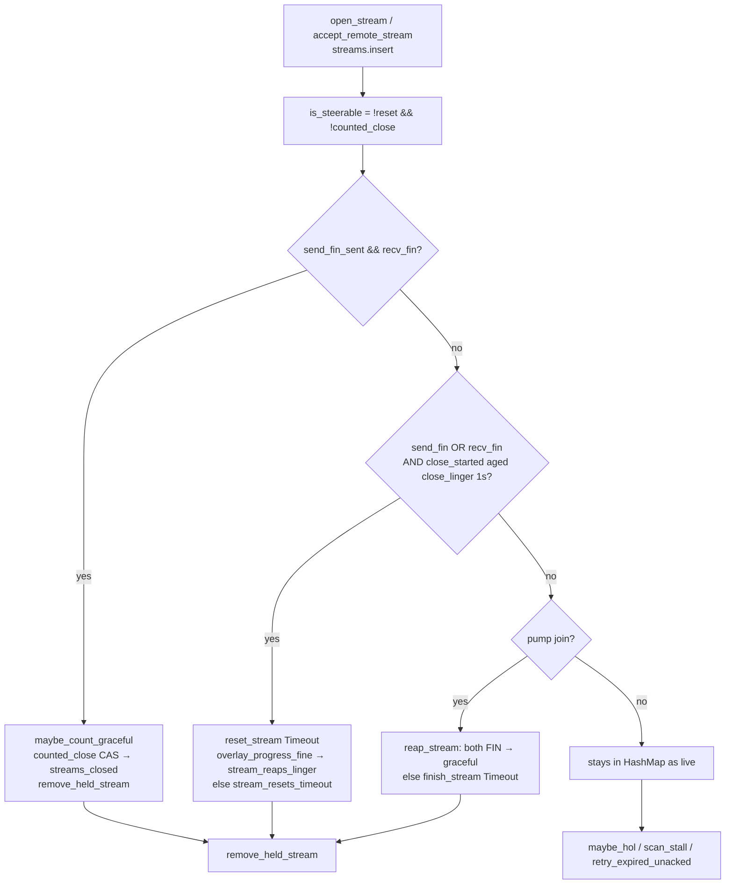
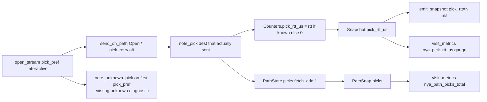

# Live-session stream reap, pick-hit RTT, and flap/HOL scope

| Field | Value |
| --- | --- |
| **Title** | Live-session stream-table reap; pick-hit RTT observability; flap/HOL non-goals |
| **Author** | nya-link-aggregation maintainers |
| **Date** | 2026-09-07 |
| **Status** | Implemented-with-regression (Close/Reset delivery superseded by [`design-close-reset-delivery-regression.md`](design-close-reset-delivery-regression.md)) |
| **Audience** | Senior engineers who already know `nya-core` session / scheduler / health, `nya-client` `run_link`, `nya-server` outbound, and `nya-e2e` SLA |
| **Predecessor** | Freeze `2c34217` (`session: reap table slot on death; snapshot live sfp`). `PROTOCOL_VERSION=2` / ALPN `nya/2`. Close-retry series: `docs/design-close-retry-silent-pick.md`. |
| **Compatibility** | `PROTOCOL_VERSION` **stays 2**. No new TOML keys. `[session]` stays `deny_unknown_fields` (`cfg.rs` L130–137: four keys). One production `Tuning::STANDARD`. Tests clone-and-mutate. Version stays `0.1.0` in mechanism PRs; `0.1.1` is a later release-docs tag (`docs/RELEASE.md`). |
| **Intended repo path** | `docs/design-live-session-reap-pick-rtt.md` (scratch file is this loop’s deliverable) |

---

## Overview

v0.1.2 leftover goal held (Yuusei `streams_held` 81→0). Close cycle + `expire_recv_closes` hole-FIN + progress-fine linger Reset are the post-deploy regression; pick-hit RTT / P2 / P3 stand. `expire_recv_closes` “unchanged” (this doc later) is the clause the successor retracts.

Production on 2026-09-07 shows the overlay is not the TTFB story. Overlay extra is ~1 GZ–HK RTT (p50 9–12 ms for every host); Cloudflare on the same overlay is p50 17–24 ms; `open_us` is tens of microseconds; `migrates=0`; stream success ~100%; `all_down=0`. Origin dial / `origin_first` tails (`173.249.210.102:80`, `boilhkt`, soy TLS timeout, 07:00Z weather) are destination or underlay and stay out of this design.

What *is* still an overlay mechanism hole is a **live-session stream table that does not reap client-gone streams**. `prod-gz-yuusei` (5-day Mihomo / generate_204 session) reports client `streams_live=0` against server `streams_held=78`, `streams_live=78`, `streams_stalled=36`. Freeze `2c34217` reaps the **`SessionTable` HashMap slot on session death**. It does not reap half-closed / client-gone **streams** while the session lives. Catalog `nya_streams_held` is already honest: “streams still in the session table (incl. unreaped closes)”. Those 78 entries are `is_steerable()` — they still enter HOL, stall scan, sticky load, and unacked retry.

Two further items are in scope as **observability** and **test-locks**, not retunes:

- **P1.** `nya_path_rtt_us` latest is the dirtiest live 5-tuple (Yuusei `soy#1` 830 ms while hop extra stayed 9 ms). Recycle only fires when a path is backup vs same-link siblings; a whole-pool walk-up has no outlier. Operators need the RTT of the dest **pick actually used**. Not a new recycle clock. Not scheduler input.
- **P2.** 24h `path_down` yuusei 1828 / hytron 1344 is soy#0 up → ~2 s silent-down → 200 ms redial. Existing `path_lived_stable` already keeps reconnect backoff; pick already refuses unknown-RTT over known-fresh sisters (`picks_unknown_rtt` prod delta 0). **No mechanism change.** Test-lock the contract.
- **P3.** Hytron `frame_send_drop` 1511/855 with `hol_rebalances` 237k/560k is bulk-queue full, not interactive sharing `chan=64`. Interactive already rides urgent and skips `!is_schedulable()`. **Non-Goal.** Do not grow `chan`.

---

## Background & Motivation

### Freeze `2c34217` is the wrong table

`SessionTable::create_with_incoming` (`session/mod.rs` L1515–1547) sets `reap_on_all_down=true` and spawns:

```text
reap.wait_dead().await;
slots.lock().unwrap().remove(&session_id);
```

`get()` / `aggregate_snapshot()` already skip dead sessions. The freeze stops a dead session’s slot (and hop-tail `sfp`) from sitting until the next 10 s obs tick. Yuusei’s session is **not dead** — no `ending session` / `session dead`. The leftover is `Inner.streams: HashMap<u32, Arc<StreamState>>`.

### Current stream lifecycle (line-accurate)



Relevant sites:

| Site | Behavior today |
| --- | --- |
| `StreamState::is_steerable` (`stream.rs` L103–105) | `!reset && !counted_close` |
| `stream_snaps` (`mod.rs` L1246–1279) | `streams_held = HashMap.len()`, `streams_live = is_steerable count` |
| `maybe_count_graceful` (`streams.rs` L339–351) | Both FINs → `counted_close` CAS → `observe_stream_end(None)` → **immediate** `remove_held_stream` |
| `reap_closed_streams` (`steer.rs` L332–360) | `counted_close \|\| reset` → drop; else if either FIN and `close_started_ms` aged `close_linger` → `reset_stream(Timeout)` |
| `reap_stream` (`streams.rs` L353–366) | Pump join: counted_close → remove; both FIN → graceful; else Timeout |
| `on_peer_close` (`streams.rs` L508–519) | `note_close_started`; `recv_close_off`; `try_finish_recv_close` |
| `close_send` (`streams.rs` L303–333) | CAS `send_fin_sent`; `remember_close`; `send_on_path`; one `pick_retry` if enqueue fails |
| `retry_closes` (`mod.rs` L736–796) | First closer stops on `recv_fin`; **both roles** `forget_close` if `close_rx_after_send` (`path.last_rx > sent_at`); else rehome; `reap_closes` at `started_at >= close_linger` **without** looking at `streams` |
| `apply_recv_fin` (`streams.rs` L522–528) | Sets `recv_fin`; **`forget_close`**; `maybe_count_graceful` |
| `finish_stream` (`mod.rs` L1121–1155) | First `reset.swap`; **one** `pick_pref` + `send_on_path(StreamReset)` — **no** `pick_retry` on false, **no** side table |
| `overlay_progress_fine` (`mod.rs` L832–847) | `acked >= next`; `recv_fin` **or** (`send_fin` and Open not held) |
| `observe_stream_end` (`mod.rs` L1157–1215) | Timeout + `overlay_progress_fine` → `streams_closed` + `stream_reaps_linger`, **not** `stream_resets_timeout`. **`forget_close` on every counted end** (L1194 linger early-return and L1213 every other reason, including graceful `None`) |
| `remove_held_stream` (`mod.rs` L956–963) | HashMap remove, unstick, `release_unacked`, `forget_open`. **Does not** `forget_close` |
| `IncomingStream::reset` (`mod.rs` L66–70) | Dial fail only (`outbound.rs` L153) |
| `nya-server` outbound (`outbound.rs` L107) | `copy_bidirectional(origin, overlay)` until **both** directions EOF |
| `nya-client` inbound (`inbound.rs` L268) | `copy_bidirectional(tcp, overlay)`; drop tun → pump `Ok(0)` → `close_send` |
| `2c34217` | `SessionTable` slot on `wait_dead`. Not this HashMap |

`close_linger` is 1 s (`tuning.rs` L73, L121). Frozen. Linger hygiene Reset is already specified as “send once on a loss-fresh path” (`design-close-retry-silent-pick.md`). That “once” is the remaining delivery hole.

**Every `forget_close` site today** (exhaustive; `remove_held_stream` is not one):

| Site | Who | Typical HTTP | Yuusei first closer (origin keep-alive) |
| --- | --- | --- | --- |
| `retry_closes` first-closer `recv_fin` (`mod.rs` L756–761) | first closer | n/a (already second) | Keep — peer FIN is real Close delivery |
| `retry_closes` `close_rx_after_send` (`mod.rs` L767–770) | **both roles** | Dead code: second closer already forgot via `observe_stream_end` | **The bug** — Pong cancels Close on a live pool |
| `reap_closes` (`mod.rs` L712–726) | both, `started_at >= close_linger` | Cap | Keep — table bound, no `streams` lookup |
| `apply_recv_fin` (`streams.rs` L526) | the end that received peer Close | First closer stops | Keep |
| `observe_stream_end` (`mod.rs` L1194, L1213) | **every counted end** | Second closer: `close_send` + already-`recv_fin` → `maybe_count_graceful` → forget **immediately**. Predecessor `design-close-retry-silent-pick.md` L392 said product accounting must **not** `forget_close`; the implementation diverged; second closer is quiet because of this | First closer linger Timeout also forgets here after the one-shot Reset |

Predecessor required “product accounting may close the stream, but **do not `forget_close`**.” Current main undoes second-closer `remember_close` in `observe_stream_end`. That is why `close_rx_after_send` is dead for typical HTTP and why deleting only that stop does **not** restore ~50 Close frames per request.

Unit tests already lock **happy-path** reap: `graceful_close_reaps_stream_table`, `concurrent_open_close_reaps_stream_table`, `half_close_linger_reaps_stream_table` (`mod.rs` L2533–2667). The linger test **holds** `IncomingStream` without copying (origin never FINs) and still asserts server `held=0` after 250 ms with `close_linger=80 ms`. That only works if **Close arrived**. e2e `short_stream_churn` (`scenarios.rs` L1546–1563) snapshots the **client** session (`Harness.session`) and gates `held ≤ live+2`. Yuusei’s leak is the **server** table on a live session.

### Why Yuusei can sit at 78 live server streams for days

Mihomo generate_204 is short-lived on the client (client `streams_live=0`) and often HTTP keep-alive on the origin (server `copy_bidirectional` never sees origin EOF → server never `close_send` → `send_fin_sent=false`, `close_started_ms=0` unless Close arrived).

Linger (`reap_closed_streams`) **does not run** unless `send_fin_sent || recv_fin`. Idle origin copies with no FIN are treated as in-flight. That is correct for Hytron long-lived copies (`max_gap` hundreds of seconds is origin/app idle — must not GC). It is incorrect when the **client already counted_close** and Close/Reset never landed.

Close retry exists, but `retry_closes` L767–770:

```text
if self.close_rx_after_send(from, sent_at) {  // path.last_rx > Close.sent_at
    self.forget_close(id);
    continue;
}
```

`PathState.last_rx` is any frame on that TCP: Pong, other streams’ DATA/ACK, Ping. Overlay is multiplexed; read and write halves are independent. A Pong 5 ms after Close was `try_send`’d into `chan=64` does **not** mean StreamClose left the writer, let alone reached the peer.

On a healthy GZ–HK pool, Pong arrives every `probe_interval` (min(fast, stable) clamped to ping_min/max, typically 7–50 ms). `retry_after` is `loss_timeout(min_alive_fast)` (20 ms floor). **First closer therefore forgets Close after ~one retry_after on a live session**, even when the peer never got FIN. That is a **predicate bug**, not a missing millisecond.

Then `reap_closed_streams` at 1 s sends `StreamReset(Timeout)` **once** (`finish_stream` L1135–1144: `pick_pref` + `send_on_path`, no retry on false, no side table). If that enqueue is dropped, the dest dies after queue, or pick returns `None`, the server keeps a steerable stream for the rest of the 5-day session. Those entries:

- inflate `nya_streams_live` / `nya_streams_held` / `nya_streams_stalled` (36/78 stalled = send-unacked DATA toward a client who already left)
- keep `sticky_count` / `inflight` / `conn_has_interactive` dirty
- still run `maybe_hol` / `retry_expired_unacked` (`steer.rs` L209–237 filters `is_steerable`, which these are)

Hytron ~58/63 held/live is balanced: real copies have both FINs. Yuusei is Mihomo residue.

### Pick-hit RTT (P1) — ops lie, not a recycle miss

`visit_metrics` exports `nya_path_rtt_us` per live `PathSnap` (`catalog.rs` L443–445), filled from `PathState.rtt_us()` (`path.rs` L200–203; snapshot copy `metrics.rs` L528). Signoz “latest” of `soy#1` is that 5-tuple’s fast EWMA. `rtt_us()` returns `Tuning::STANDARD.unknown_rtt_us` (20 ms) when EWMA is 0. Recycle (`maybe_recycle_outliers`, `steer.rs` L284–330) only starts when **both** class and fast are `is_backup` vs the **same-link sibling class** (H6). A whole-pool 80–105 ms (Hytron) or one soy 830 ms vs 7 ms sisters on **other** named links is not that predicate — correctly. Hop extra 9 ms means pick was not using the dirty dest.

`open_stream` already calls `note_unknown_pick` (`mod.rs` L1294–1311) after pick. There is **no** record of *which* dest was chosen or *its* RTT. Info snapshot (`export.rs` `emit_snapshot` L167–204) has packed `mig/hol/hedge/rtx/fb_slink/picks_unk/recycle/corr` and `paths=` (fast/stable/class ms). No pick-hit field. `metrics=` stays debug-only (L205–209).

Hop p99 histograms live on `ProcessCounters`, snapshot-only, **not** in `visit_metrics` (`n_counter == 52` today, `export.rs` L423). That contract holds.

### Short-lived flap (P2) — already closed

| Existing contract | Site | Prod evidence |
| --- | --- | --- |
| Backoff resets only if the dest was up ≥ `stable_up_hold` (1 s) | `path_lived_stable` (`mod.rs` L905–910); `run_link` (`nya-client/src/lib.rs` L124–135) logs `"reconnect backoff kept after short-lived path"` | Fires |
| Backoff 200 ms–2 s, doubles each loop | `Tuning::STANDARD` L123–124; `run_link` L108–152 | 200 ms redial is the **min**, not a bug |
| Unknown RTT not in `fastest_class_set` when a known schedulable dest exists | `scheduler.rs` L100–108, tests L1416–1426 | `picks_unknown_rtt` prod increase **0** |
| Silent-but-UP skipped at pick | `is_loss_fresh` / `loss_fresh_or_all` (`scheduler.rs` L182–199) | Overlay extra stayed 9 ms |
| Single 5-tuple is not `correlated_hold` | `steer.rs` L28–39: needs N≥3 and (exact N−1 quiet **or** quiet≥3 spanning ≥2 links) and `silent>=1` | Correctly not entered |
| Recycle does not tear sisters | `maybe_recycle_outliers` same-link sibling only | Correct |
| Handshake timeout uses `last_known_rtt`, not pick | `run_link` L115–118; `last_known_rtt` (`mod.rs` L891–899) | Replacement starts unknown; pick does not inherit 830 ms |

Raising `down_min_silence` / backoff / soy-special-case is forbidden retune. The hole the prompt named (“must not re-enter pick as a fresh unknown-RTT dest and must not force sisters to tear”) is already the pick + recycle contract.

### HOL / bulk drop (P3) — already isolated

`send_on_path` (`mod.rs` L1043–1080):

- Control frames and `StreamData` with `len <= interactive_max` (1500 **bytes**, `tuning.rs` L64, L115) go **urgent**.
- Larger DATA goes **bulk** (`writer`). Unknown-RTT DATA is forced off urgent so ping can complete first RTT.
- Two independent `mpsc` of depth `chan=64`. Bulk full does **not** `set_congested` (comment L1071: “A full bulk queue must not mark the path unusable for ACKs/pings”).
- Urgent full → `set_congested(true)` + `frame_send_drop`. `is_schedulable` = `is_up && !congested && !write_stalled` (`path.rs` L191–194). Pick / `interactive_affinity` / HOL dest all require it.
- Write-stall: DATA `send_on_path` returns false **without** `frame_send_drop` (L1051–1052); path stays UP. Already congests-not-tears.

Hytron drops are therefore bulk-queue full on long copies, not interactive sharing one `chan`. `hol_rebalances` 237k/560k is isolation working (`hol_place_bulk` / `should_rebalance_conn`). Enlarging `chan` is Tuning. **P3 is a Non-Goal.**

`OBSERVABILITY.md` L64 already notes `frame_send_drop` has no urgent vs bulk split. A split would be catalog noise for a Non-Goal; not in this ship.

---

## Goals & Non-Goals

### Goals

1. **P0 — Live-session stream table invariant.** Client HashMap empty within one `close_linger` of local FIN. Server leftover (client counted_close, origin keep-alive, Close never landed) empty within one linger of Reset hygiene — **worst-case ~2× `close_linger` from client FIN** if Close never arrives (Close retry until linger, then Reset retry until another linger). In-flight copies (no FIN, no Reset, origin/app still transferring **or** legitimately idle) must not be GC’d. Linger still must not increment product `stream_resets_timeout`. Pre-deploy hangover ids are **not** this invariant (see Rollout).
2. **P1 — Pick-hit RTT observability.** Record the fast RTT of the dest `open_stream` actually scheduled. Export via existing `Counters` / `Snapshot` / `PathSnap` / `visit_metrics`. Info snapshot may grow by one short field. Hop p99 stays out of Prometheus. Not scheduler input. Do not restore `metrics=` on the default info line.
3. **P2 — Test-lock only.** Short-lived unknown replacement is not pick’s best while a known-RTT, loss-fresh sister exists. No backoff / `down_min_silence` / soy change.
4. Docs: `docs/ARCHITECTURE.md` and `docs/OBSERVABILITY.md` in the PR that adds the mechanism/metrics.
5. `cargo test -p nya-e2e` `short_matrix` stays green; `nya-e2e --mixed` must not introduce new SLA reds, chatter, or all-down.

### Non-Goals

- Origin TTFB (dial / `origin_first`) and Happy Eyeballs for literal IPv4
- Squeezing overlay extra 9 ms → 5 ms
- UDP/QUIC datapath
- soy-specific code
- `Tuning::STANDARD` / TOML default / hold / `class_drop_*` / `path_score` / `down_min_silence` / `ping_interval` / `chan` / `close_linger` numeric changes
- Concurrent k-copy
- Restoring snapshot `metrics=` blob on info
- Changing `failbacks` to include same-link (e2e chatter frozen)
- Treating linger as product `stream_resets_timeout`
- P3 HOL/chan (interactive already on urgent; bulk full does not congest)
- P2 scheduler/backoff mechanism (existing contract holds; test-lock only)
- SessionTable slot reap (already `2c34217`)
- Idle-timeout of streams with no FIN (would GC Hytron origin-idle copies)
- CloseAck / new `ResetReason` / proto bump
- Version bump to `0.1.1` in mechanism PRs
- New `[session]` TOML keys

---

## Key Decisions

1. **P0 is Close/Reset *delivery*, not a new reap clock.** Do not idle-timeout steerable streams. In-flight = no local FIN, no peer FIN, no Reset. Hytron `max_gap` of hundreds of seconds is origin idle and must survive. The Yuusei leftover is client-gone without FIN on the server because Close was forgotten on Pong and Reset is one-shot.

2. **Yuusei-minimal Close forget set — not “both roles until linger.”** Exhaustive `forget_close` sites after this change:

   | Keep | Drop |
   | --- | --- |
   | `retry_closes` first-closer `recv_fin` | **`close_rx_after_send`** (Pong ≠ Close delivery) |
   | `reap_closes` at `started_at >= close_linger` | |
   | `apply_recv_fin` | |
   | **`observe_stream_end` on every counted end** | |

   Second closer stays quiet: `close_send` with `recv_fin` already true → `maybe_count_graceful` → `observe_stream_end(None)` → `forget_close` immediately. That is current main, not a regression, and it is **not** the Yuusei shape (server never FINs). Removing `observe_stream_end`’s `forget_close` would restore ~50 Close/s/stream on every HTTP complete — rejected (Alternative 7). First-closer half-close still retries until `recv_fin` or linger (~50 Close frames / 1 s) — the bound the close-retry design already accepted for that path. **Do not change `close_linger`.**

3. **Hygiene `StreamReset` gets an `Inner.resets` side table**, mirroring `Inner.closes` / `Inner.opens`. `finish_stream(send_frame=true && !dead)` remembers Reset even if `pick_pref` is `None` or `send_on_path` fails; `pick_retry`s once immediately when a dest exists; then `retry_resets` / `reap_resets` in `maintain`. Bound is existing `close_linger` from `started_at`. **No** `last_rx > sent_at` short-circuit (same lie). Retry stays **rehome-shaped** like Open/Close (no same-path resend). No new Tuning field. `reset.swap` still prevents a second *logical* Reset; the side table retries that one frame. `on_peer_reset` stays `finish_stream(..., send_frame=false)` and **`forget_reset`** so the two ends do not ping-pong. `mark_dead` CAS is first; skip `remember_reset` when `dead`; clear `resets` **after** the `finish_stream` loop.

4. **Linger accounting stays frozen.** Timeout + `overlay_progress_fine` → `stream_reaps_linger` + `streams_closed`, not `stream_resets_timeout`. `close_linger` stays 1 s. Soak watch remains `(closed - linger) / opened`.

5. **P1 records the dest that actually sent Open, not the first `pick_pref`.** Call `note_pick` after a **successful** `send_on_path` of StreamOpen (primary or `pick_retry` alt). Still not from `send_data` / HOL. If `!p.rtt_known()`, store `pick_rtt_us = 0` and leave `picks_unknown_rtt` as the unknown signal — do not publish the 20 ms placeholder (`path.rs` L200–203). Session gauge `nya_pick_rtt_us` + per-path counter `nya_path_picks_total` (labeled `path`, `link`). Scheduler stays a pure function. Info adds `pick_rtt` (ms). No hop hist in catalog. `n_counter` 52 → 54 (`nya_path_picks_total`, `nya_reset_retry_total`). Path-labeled counter **resets** when `path_failed` drops the 5-tuple (unlike gauges disappearing); document `_created`.

6. **P2 is test-locked, not a mechanism PR.** Evidence: `picks_unknown_rtt` delta 0; `unknown_not_in_fastest_class_with_7ms_peers`; `path_lived_stable`; correlated_hold ignores a single 5-tuple; recycle is same-link backup AND. Do not raise backoff numbers.

7. **P3 is a Non-Goal.** Interactive DATA (`<= 1500 B`) and all control frames use urgent; bulk full does not `set_congested`; `is_schedulable` skips congested/write-stalled; `chan` stays 64. Do not split `frame_send_drop` in this ship.

8. **No new TOML. No Tuning::STANDARD numeric edits.** `[session]` stays four keys, `deny_unknown_fields`. Tests clone-and-mutate `close_linger` only.

9. **`PROTOCOL_VERSION` stays 2 / ALPN `nya/2`.** Close and Reset frames already exist.

10. **Version `0.1.1` is a later release PR**, not these mechanism PRs (`docs/RELEASE.md`).

---

## Proposed Design

### P0 — Live-session reap

#### Contract

A stream may occupy `Inner.streams` while the session is alive only if it is **in flight**: not `counted_close`, not `reset`, and not past half-close linger. “Client gone, origin keep-alive” is **not** in flight once Close or hygiene Reset has been given `close_linger` of retries. Client table: one linger from local FIN. Server leftover if Close never lands: one linger of Reset after that — **~2× linger worst case**. Streams already in the table **before** deploy are hangover (Rollout); this contract is for closes after the new binary.

```mermaid
sequenceDiagram
  participant C as Client pump
  participant CC as Inner.closes
  participant CR as Inner.resets
  participant S as Server streams
  participant O as Origin copy_bidirectional
  C->>CC: close_send / remember_close
  loop until recv_fin or started_at >= close_linger
    CC->>S: StreamClose (retry_closes; no last_rx short-circuit)
  end
  alt Close landed
    S->>S: recv_fin, note_close_started
    Note over S,O: linger 1s if origin never FINs
    S->>S: reset_stream Timeout → linger count, remove_held_stream
  else linger without recv_fin
    C->>CR: finish_stream send Reset, remember_reset
    loop until Reset started_at >= close_linger
      CR->>S: StreamReset rehome
    end
    S->>S: on_peer_reset → finish_stream send_frame=false, forget_reset, remove
  end
  Note over O: keep-alive aborted by Reset/Inbound::Reset<br/>not by idle GC. Worst-case ~2× linger from client FIN.
```

#### Close retry predicate (mechanism, not a number)

`retry_closes` (`mod.rs` L736–796) after this change:

1. `reap_closes` if `started_at.elapsed() >= close_linger` (keep).
2. First closer (`!second`): `forget_close` if `get_stream` has `recv_fin` (keep).
3. Rate-limit with `retry_after(from)` (keep).
4. **`close_rx_after_send` → `forget_close` (delete this stop).** Delete the helper. Do not use path `last_rx` as Close ACK.
5. `pick_retry_tried` + send (keep). Failed send still bumps `sent_at` / `tried` (keep). **Rehome-only** — a singleton pool (`pick_retry_tried` → `None`) does not resend on the same TCP. Yuusei is N≥2; that is the merge gate. Do not add same-path resend.

**Unchanged forget sites (not `retry_closes`):** `apply_recv_fin`; `observe_stream_end` on every counted end. Second closer (typical HTTP: server already Close’d, client then shutdown-write) still `remember_close` then immediately `forget_close` via `maybe_count_graceful` → `observe_stream_end`. Duplicate Close stays idempotent. The Pong short-circuit is what made **first closer** not retry on a live Yuusei pool; second closer was already quiet via `observe_stream_end`, not via `close_rx_after_send`.

#### Reset side table

New on `Inner`, next to `closes`:

```rust
struct ResetUnacked {
    path_id: u32,
    sent_at: Instant,
    started_at: Instant, // first remember; reap_resets uses it
    tried: Vec<u32>,
    reason: ResetReason,
}
```

API mirrors Close (names that do **not** already exist):

- `remember_reset(id, path_id, reason)` — insert or update `path_id`/`sent_at`/`tried`; `started_at` set once. `path_id` may be `0` if no dest yet.
- `forget_reset(id)` — not called from `remove_held_stream` (table outlives the HashMap entry, like Close). **Called from `on_peer_reset` and from `finish_stream(..., send_frame=false)`** so a peer Reset stops our retry.
- `retry_resets` / `reap_resets` in `maintain` after `retry_closes`.
- `retry_reset_from(dead)` from `path_failed`, next to `retry_close_from`.

`finish_stream` when `first_reset`:

```text
if send_frame && !inner.dead.load(Relaxed) {  // mark_dead CAS already ran
    match pick_pref(Any) {
        Some(p) => {
            remember_reset(id, p, why);
            if !send_on_path(p, StreamReset { id, why }) {
                if let Some(alt) = pick_retry(p) {
                    remember_reset(id, alt, why);
                    send_on_path(alt, StreamReset { id, why });
                }
            }
        }
        None => remember_reset(id, /*path_id=*/0, why), // later path_added → retry_resets
    }
} else {
    forget_reset(id); // send_frame=false (on_peer_reset) or session already dead
}
```

Today there is no `remember` and no `pick_retry` on false — that is the one-shot hole. `pick_pref == None` must still insert so a later dest can `retry_resets` / `retry_reset_from`. Retry remains **rehome-shaped**; a singleton pool does not same-path resend (same as Close/Open). Yuusei N≥2 is the merge gate.

`reap_resets`: `started_at.elapsed() >= close_linger` → `forget_reset`. No `streams` lookup.

`mark_dead` (`mod.rs` L199–234) today **clears `closes` first**, then `finish_stream(..., send_frame)` for remaining ids. Do **not** clear `resets` next to `closes` before that loop — `remember_reset` is skipped because `dead` is already true. **Clear `resets` after the `finish_stream` loop** (and still skip remember). Session is dead so `retry_resets` will not run.

Do **not** short-circuit Reset on `last_rx > sent_at`. There is no `recv_fin` analogue; `forget_reset` on peer Reset is the stop. Linger-bounded duplicate Resets if both ends linger-Reset before the peer frame arrives are accepted (idempotent `on_peer_reset` when `get_stream` is None after the first).

Increment new `Counters.reset_retry` only on a **successful** rehome send (same gate as `close_retry`, `mod.rs` L786–789). Immediate first send in `finish_stream` does not count (that is the original hygiene frame). Catalog: `nya_reset_retry_total` “STREAM_RESET rehomes onto another path”.

`reset.swap` remains the second-frame gate. `counted_close` remains the Q1 accounting gate. Linger classifier unchanged.

#### What does *not* change

- `reap_closed_streams` still drops `counted_close || reset` immediately and linger-Timeouts half-closes. That path already reaps **if a FIN exists**.
- `maybe_count_graceful` still immediate-remove on both FINs.
- `reap_stream` on pump join unchanged.
- `expire_recv_closes` (Close beat in-flight DATA → FIN after `loss_timeout`) unchanged.
- `IncomingStream` / `copy_bidirectional` unchanged. Reset delivers `Inbound::Reset`, which breaks the pump; HashMap is already empty after `finish_stream`.
- SessionTable slot reap unchanged.
- No idle GC: a stream with `close_started_ms==0` and neither FIN stays until Close/Reset/local FIN/pump-end/session death.

#### Server leftover after client counted_close (the Yuusei shape)

Client first closer (204 then drop; origin keep-alive so server never FINs):

1. `close_send` → Close retried until linger (now actually retried on a Ponging path).
2. If Close landed: server `recv_fin` + `close_started` → existing linger 1 s → `reset_stream` classified linger → HashMap empty. Origin copy aborted. **This is the `half_close_linger_reaps_stream_table` path, which is already green when Close arrives.**
3. If Close never landed: client linger `reset_stream` → Reset retried up to **another** `close_linger` → server `on_peer_reset` → `finish_stream(send_frame=false)` + `forget_reset` → remove. **This is the missing path.** Server HashMap empty is ~2× linger from client FIN, not one.

In-flight protection: a Hytron copy with neither FIN and a live client is never in `closes`/`resets` and never hits linger. `scan_stall` may mark it stalled; that is observational only.

### P1 — Pick-hit RTT



Implementation:

- `PathState.picks: AtomicU64` (new; `with_writers` init 0). Not used by `path_score` / `load_term` / `is_schedulable`. **Scheduler does not read it.**
- `Session::note_pick(path_id)` next to `note_unknown_pick`: if `p.rtt_known()` store `p.rtt_us()` else store `0`; `p.picks.fetch_add(1)`. Call from `open_stream` **after the successful Open `send_on_path`** (primary, or the `pick_retry` alt if primary enqueue failed) (`streams.rs` L59–66). Keep `note_unknown_pick` on the **first** `pick_pref` (existing diagnostic: we *tried* an unknown dest). Do not credit `pick_rtt_us` / `PathState.picks` to a dest that did not carry Open.
- `Snapshot.pick_rtt_us: u64`. `snap_with_paths` loads the atomic. `add_counters`: **last non-zero wins** (gauge, not a sum). Multi-session `SessionTable::aggregate_snapshot` last-writer is acceptable; per-path `picks` still sum via `flatten_paths`.
- `PathSnap.picks: u64` copied like `sticky`. `#[derive(Default)]` stays valid (0).
- `Counters::default` handwritten: `pick_rtt_us: AtomicU64::new(0)`, `reset_retry: AtomicU64::new(0)`.
- `catalog.rs` `visit_metrics`:
  - gauge `nya_pick_rtt_us` “fast RTT of last open_stream pick”, unlabeled (session-level, same as `nya_streams_live`)
  - counter `nya_path_picks_total` “open_stream picks onto this dest”, labels `path`, `link` (with the other `nya_path_*` loop)
  - counter `nya_reset_retry_total` (P0)
- `export.rs` `emit_snapshot`: add `pick_rtt = s.pick_rtt_us / 1000` (ms, like `paths=`). Packed keys otherwise unchanged. **Do not** attach `metrics=`. `n_counter` assert 52 → **54**. `format_paths` may append ` p=N` when `p.picks > 0` if the 4-path fixture stays `< 2048`; if that threatens the compact-line budget, skip the `paths=` tweak and rely on the catalog counter + `pick_rtt` field.
- `nya-obs` unchanged (already `visit_metrics`).
- Hop p99 / `tail=` / `ProcessCounters` hop hists **not** in this diff.

Do not call `note_pick` from `send_data`, HOL, or `failback_target`. `pick_retry` of Open is the one exception: credit the alt that actually sent.

### P2 — Test lock (no production branch)

No change to `run_link`, `path_lived_stable`, `maybe_recycle_outliers`, `correlated_hold`, `unknown_rtt_score_mult`, or pick. Add session/scheduler tests listed below so a future “make soy stick” patch fails CI.

### P3 — Out of scope

Document in ARCHITECTURE one sentence: interactive frames use urgent; bulk full does not congest the dest; `chan` 64 is not a TTFB knob. No code.

---

## API / Interface Changes

Public crate API (`Session::open_stream`, SOCKS, `IncomingStream::reset`) unchanged.

Internal:

| Item | Change |
| --- | --- |
| `Inner.resets` | new `HashMap<u32, ResetUnacked>` |
| `retry_closes` | drop `close_rx_after_send` stop only; keep `recv_fin` / `reap_closes` |
| `observe_stream_end` / `apply_recv_fin` | **unchanged** `forget_close` |
| `finish_stream` | `remember_reset` even if `pick_pref` is `None`; `pick_retry` on enqueue fail; skip remember when `dead`; `forget_reset` when `send_frame=false` |
| `on_peer_reset` | stays `send_frame=false`; `forget_reset` (via `finish_stream`) |
| `path_failed` | `retry_reset_from` |
| `mark_dead` | `closes.clear()` stays **before** the stream loop; `resets.clear()` **after** the `finish_stream` loop |
| `Counters` / `Snapshot` | `reset_retry`, `pick_rtt_us` |
| `PathState` / `PathSnap` | `picks` |
| `visit_metrics` | three new names (two counters, one gauge) |
| `emit_snapshot` | `pick_rtt` field |
| `close_rx_after_send` | delete or `#[cfg(test)]` unused |

No wire change. No TOML. No `SessionOpts` keys.

---

## Data Model Changes

Session-memory only.

- `Inner.resets` lives until `reap_resets`, `forget_reset` (peer Reset), or `mark_dead` (cleared **after** the stream loop). Outlives `remove_held_stream`.
- `PathState.picks` dies with the path (`path_failed` removes the HashMap entry). **This is the first path/link-labeled catalog *counter*.** Existing `nya_path_*` are gauges: a disappearing series is not a counter reset. A soy#1 reconnect reuses labels at 0; Prometheus `rate()` sees a reset. Operators: treat the value as “picks since this 5-tuple came up”; use `_created` / `increase()` with care. The counter still answers “was soy#1 even hit?” on the live dest. Do not put picks into `path_score`.
- No on-disk schema. No migration.

`n_counter` 52 → 54. Touch list for any new counter (existing discipline):

- `Counters` field + handwritten `Default`
- `Snapshot` field + `add_counters` + `snap_with_paths`
- `catalog.rs` `visit_metrics`
- `export.rs` `n_counter == 54` and `prometheus_metric_names` contains the new `_total` names

Gauge `nya_pick_rtt_us` does not affect `n_counter`.

---

## Alternatives Considered

### P0

**1. Idle-timeout steerable streams with no overlay progress for `close_linger`.** Would reap Yuusei leftovers without Reset. Also reaps Hytron origin-idle copies (`max_gap` hundreds of seconds). Violates “must not GC in-flight”. **Rejected.**

**2. Keep Close Pong short-circuit; only add Reset retry.** Close-retry design’s short-circuit is what disables Close on a live pool (Pongs every 7–50 ms). Reset would still be the only signal, delayed a full linger, still racing path death. **Rejected as the sole fix.** Reset retry is belt-and-suspenders **on top of** dropping `close_rx_after_send` (first closer). Not on top of “both roles until linger.”

**3. CloseAck / new ResetReason::Linger.** Proto bump. `PROTOCOL_VERSION` stays 2. **Rejected.**

**4. Lengthen `close_linger` so one-shot Reset is more likely to land.** Numeric retune; does not fix Pong-forget of Close; 5-day leftovers are not a 1 s vs 2 s problem. **Rejected.**

**5. Abort origin in `on_peer_close` immediately (skip linger).** Changes half-close semantics for slow origin FIN; linger 1 s is already the table bound and is fine **once Close arrives**. Not the 5-day hole. **Rejected.**

**6. Snapshot the e2e *server* session in `apply_table_invariants`.** `Harness` (`harness.rs` L18–28) only holds the client `Session`; server is `run_on_until` in another task. Unit tests already have both ends (`half_close_linger_reaps_stream_table`). Server leftover is a unit merge gate, not an e2e harness rewrite. **Deferred.** Client `held ≤ live+2` is a **client-ghost regression door**, not Yuusei proof.

**7. Remove `forget_close` from `observe_stream_end` so both roles retry until linger.** Predecessor `design-close-retry-silent-pick.md` L392. Would make second closer emit ~50 Close/s/stream on every HTTP complete (20 ms `retry_after` floor × 1 s). Yuusei is first closer (server never FINs). **Rejected.** Keep `observe_stream_end` forget; delete only `close_rx_after_send`.

### P1

**A. Put pick RTT into `path_score` / recycle.** Forbidden: scheduler input and a new recycle clock. **Rejected.**

**B. Snapshot-only hop-style hist of pick RTT, no Prometheus.** Operators looking at Signoz `nya_path_rtt_us` would still see soy#1 830 ms and have no catalog name for “what pick used”. A last-value gauge plus per-path pick counter answers “was soy#1 even hit?” **Rejected as the sole export.**

**C. Record every `send_data` pick.** Hot path; bulk dominates; not TTFB. **Rejected.**

**D. Restore `metrics=` on info.** Frozen. **Rejected.**

**E. Export `PathSnap.picks` as a gauge (`nya_path_picks`) instead of `_total`.** Avoids Prometheus counter-reset on dest recycle. **Rejected for this ship** — a counter still answers “was this dest hit?” in the live window; document `_created` / reset. Do not bump `n_counter` with a fake `_total` gauge.

**F. Credit `note_pick` at first `pick_pref`, before `send_on_path`.** Credits a dest that did not carry Open when primary enqueue fails. **Rejected.** Call after successful Open send; unknown → 0 not 20 ms.

### P2

**Raise `down_min_silence` / `reconnect_backoff_min` / soy special-case.** Fitting this GZ–HK line. Prod `picks_unknown_rtt` delta 0 and existing skip-silent / unknown-not-in-fastest-class already close the named hole. **Rejected.** P2 is tests only.

**Inherit `last_known_rtt` into the replacement PathState EWMA.** Would make a flapping soy re-enter as 830 ms known, possibly backup, possibly picked if sisters degrade. Handshake timeout already uses `last_known_rtt`. Pick must not. **Rejected.**

### P3

**Grow `chan` past 64.** Tuning. Interactive is not on that queue. Predecessor C2 already rejected this. **Rejected.**

**Split `frame_send_drop` urgent vs bulk.** Useful later; not required to prove isolation (code already has two mpsc + `set_congested` only on urgent). Not in this ship.

---

## Security & Privacy Considerations

- Close/Reset retry does not change the threat model: a peer already able to send Close/Reset can abort origin copy. Linger already sends hygiene Timeout Reset (`design-close-retry-silent-pick.md`). This series only makes that frame actually arrive.
- `nya_pick_rtt_us` / `nya_path_picks_total` use existing `path`/`link` labels (`a#0` / `a`; multi-session `a1b2:a#0`). No host, PSK, exporter, or full session id.
- Duplicate Close/Reset remain idempotent; no new frame types; no extra unauthenticated surface.
- Aborting a keep-alive origin copy at linger/Reset is already today’s linger behavior when Close arrives.

---

## Observability

| Signal | Where | Use |
| --- | --- | --- |
| `nya_streams_held` / `nya_streams_live` / `nya_streams_stalled` | existing gauges | **New** 204s after deploy: `held` must not grow while `streams_opened` climbs and client `streams_live≈0`. Pre-deploy 78 hangover does **not** drain (no Close/Reset will be retried for those ids). After a Yuusei session bounce, `held ≈ live` for in-flight only |
| `nya_stream_reaps_linger_total` | existing | half-close / Timeout-Reset with `overlay_progress_fine`. **Do not page.** Soak: `(closed - linger) / opened` |
| `nya_stream_resets_timeout_total` | existing | must **not** absorb Yuusei leftovers |
| `nya_close_retry_total` | existing | will rise on first-closer 204s (Pong no longer cancels). Expected; not chatter in the e2e `failbacks` sense |
| `nya_reset_retry_total` | **new** counter | hygiene Reset rehomes. Quiet on happy-path both-FIN |
| `nya_pick_rtt_us` | **new** gauge | last `open_stream` dest fast RTT. Compare to hop extra / `nya_link_rtt_us` |
| `nya_path_picks_total{path,link}` | **new** counter | soy#1 830 ms with `picks=0` is weather, not pick. **Resets to 0** when that 5-tuple is `path_failed` and a reconnect reuses the labels; not a gauge disappearance |
| `pick_rtt` on info snapshot | short field | 10 s journals; no `metrics=` |
| Hop p99 / `tail=` | snapshot-only | **unchanged**, not in `visit_metrics` |

Alerting (optional, not in-tree): page if server `streams_live` **grows monotonically after deploy** while `streams_opened` still climbs and client `streams_live≈0`. Do **not** expect the live 78 to return to 0 without a session bounce. Do not page `close_retry` / `reset_retry` / `path_down`. Do not page hop p99 of generate_204 origin TLS.

Logging: Close retry stays `debug!(stream_id, from, to, "close_retry")`. Reset retry: same shape `debug!(stream_id, from, to, "reset_retry")`. Linger stays `debug!(reason="linger")`. No per-STREAM_DATA logs.

`n_counter == 54`. `Snapshot` / `PathSnap` keep `Default`. `Counters` handwritten `Default`.

---

## Rollout Plan

No feature flag (no new TOML). Staged by PR merge + canary one GZ–HK pair (`prod-gz-yuusei` first: that is the 78-stream signature).

**Hangover:** the live 78 server entries are already `counted_close` on the client (`streams_live=0`). Client `Inner.closes` was forgotten on Pong; client linger already sent one-shot Reset; after this binary lands **nothing will send Close/Reset for those ids**. Server leftovers have `send_fin_sent=false`, `recv_fin=false`, `close_started_ms=0`, so `reap_closed_streams` keeps skipping them (`steer.rs` L344–347). Idle GC is a Non-Goal. **Bounce the Yuusei session** (or wait for the 5-day Mihomo restart) after canary. Canarying without a recycle will look like a failed fix.

Watch after deploy (and after bounce):

- **New** 204s: `streams_opened` still climbing while server `held` / `live` do **not** accumulate. Pre-bounce 78 is not a rollback signal.
- Client table empty within one linger of local FIN; server leftover of a **post-deploy** Close-miss within ~2× linger.
- `nya_stream_resets_timeout_total` does not step with 204 churn; `nya_stream_reaps_linger_total` may absorb half-closes.
- `close_retry` up vs today on **first-closer** 204s (Pong short-circuit gone) without `failbacks` / `session_all_down_resets` / mixed-SLA reds. Second closer stays quiet (`observe_stream_end` forget).
- `nya_pick_rtt_us` in the 7–15 ms band while `soy#1` `nya_path_rtt_us` can still spike; `nya_path_picks_total` on the spiked dest stays near 0 if pick skipped it. Unknown dests do not publish 20 ms as a hit.
- Info line gains `pick_rtt=` and does **not** gain `metrics=`. Journal rate stays ~1 snapshot / 10 s + rare path/class/recycle.

Rollback: revert the PR(s). Wire is still v2. Restoring Pong-forget of Close reintroduces 5-day leftovers — acceptable as rollback. One-shot Reset restore is the same.

`0.1.1` tag after the mechanism PRs are on main (`docs/RELEASE.md`): bump workspace `version`, annotated `v0.1.1`. Not part of PRs 1–3.

---

## Risks

| Risk | Severity | Mitigation |
| --- | --- | --- |
| Close retry storm on origin-slow **first-closer** half-close (~50 Close/s/stream for 1 s) | Med | Idempotent `on_peer_close`. Cap is existing `close_linger`. Second closer does **not** join this storm (`observe_stream_end` still `forget_close`). e2e chatter gate is `failbacks`, not Close count |
| Both ends linger-Reset ⇒ ~50 extra `StreamReset` after peer already removed the stream | Low | `forget_reset` from `on_peer_reset` / `finish_stream(send_frame=false)` cuts the tail. Remainder is linger-bounded and idempotent (`get_stream` None) |
| `mark_dead` re-inserts `ResetUnacked` after clearing | Low | Skip `remember_reset` when `dead`; clear `resets` **after** the `finish_stream` loop |
| Singleton-pool leftover (no rehome dest) | Low | Yuusei N≥2 is the merge gate. `remember_reset` with `path_id=0` if `pick_pref` is `None` so a later dest can retry. No same-path resend |
| Close retry storm on every HTTP complete (second closer) | — | **Not a risk of this ship.** `observe_stream_end` forget stays |
| Reset retry after stream HashMap remove races a new stream id | Low | Client `next_stream_id` is monotonic fetch_add; ids are not reused in a session |
| Reaping an in-flight Hytron copy | High | Predicate requires FIN or Reset table. Unit test: origin-held copy with no client close stays in HashMap past 2× linger |
| `note_pick` accidentally read by scheduler | High | `PathState.picks` / `Counters.pick_rtt_us` have **zero** call sites in `scheduler.rs`. Review gate |
| `add_counters` summing `pick_rtt_us` | Med | Last non-zero wins, documented next to `streams_held` sum (held already sums; pick must not) |
| `n_counter` drift | High | Assert 54 in the same PR as `visit_metrics` |
| Mixed soak Close chatter looking like failback chatter | Low | `failbacks` still cross-link only. `nya-e2e --mixed` chatter door unchanged |

---

## Open Questions

None that need a human. Decisions: no new TOML; no Tuning numbers; P2 test-lock only; P3 Non-Goal; Close forget is Yuusei-minimal (drop `close_rx_after_send` only; keep `observe_stream_end`); Reset retry uses `close_linger`, rehome-only, `remember` even if `pick_pref` is `None`; skip remember when `dead`; P1 credits the dest that actually sent Open, 0 if unknown.

---

## Tests required

### P0 unit (`session/mod.rs`, next to `half_close_linger_reaps_stream_table`)

**Enqueue-fail helper (do not use `fill_urgent`).** `fill_urgent` (`mod.rs` L2762–2772) loops `send_on_path`, which `set_congested(true)` on urgent full (`L1072–1073`). `pick_pref` / `fastest_class_set` then drop that dest (`scheduler.rs` L100–108 `is_schedulable`; `path.rs` L191–194 `!congested`), so the first send already lands on the alt, `reset_retry` stays 0 (first hygiene frame does not count), and `note_pick` never sees an enqueue-fail. For tests that need `pick_pref` to return the full dest then `send_on_path` false:

- Inject with `inject_live` / `inject_live_cap` (`mod.rs` L2734–2760) so both receivers are held.
- Stuff `p.urgent.try_send(...)` (or `inject_live_cap` with cap=1 then one direct send) **without** `send_on_path` / **without** `set_congested`. Path stays `is_schedulable`.
- New test helper e.g. `stuff_urgent_keep_schedulable` — not `fill_urgent`.

| Test | Gate |
| --- | --- |
| `half_close_linger_reaps_stream_table` (existing) | **Close-arrived control.** Clone-and-mutate `close_linger=80 ms`. Both HashMaps empty; `stream_resets_timeout` unchanged; `stream_reaps_linger` +1. Keep as-is — green on current main when Close lands |
| `graceful_close_reaps_stream_table` (existing) | both ends held=0; no migrate on path down. Second-closer `observe_stream_end` forget: `close_retry` must **not** storm |
| **`close_retry_continues_while_path_pongs`** | first closer; inject Pong/`last_rx=now` after `remember_close`; `debug_maintain`; `close_retry` increases; `Inner.closes` still holds the id until `recv_fin` or linger |
| **`server_leftover_close_swallowed_reset_retried`** | **Yuusei shape, red on current main.** Two named paths via `inject_live`. Clone-and-mutate `close_linger` (80 ms). Server holds `IncomingStream` (no copy). Client writes + drop. Impair: after `close_send`/`remember_close`, force `last_rx=now` on the Close dest **and do not deliver StreamClose on any path** (drop both writers’ Close frames / do not feed the server duplex). Stuff primary `urgent` with `stuff_urgent_keep_schedulable` so the first linger `StreamReset` `send_on_path` is false **while `pick_pref` still returns primary**. Split assertions: (1) **server** `streams.lock().len()==0`; (2) **`reset_retry >= 1`** (rehome of the hygiene Reset — this is the Yuusei miss; do not accept `close_retry` alone, Close never reaches the server); `close_retry` may also rise and is not a substitute. Client `stream_resets_timeout` unchanged if `overlay_progress_fine`. Wait up to ~2× mutated linger + several `retry_after`. Do **not** pass this test with a working duplex Close (that is the control above) |
| **`in_flight_copy_not_reaped_before_fin`** | both ends copying; no drop; wait 2× mutated `close_linger`; both HashMaps still hold the id; `stream_reaps_linger` unchanged |
| **`reset_retry_rehomes_when_enqueue_fails`** | two dests via `inject_live`; `stuff_urgent_keep_schedulable` on the min-id / `pick_pref` dest (**not** `fill_urgent`); `finish_stream(Timeout, send_frame=true)`; first `send_on_path` false; `pick_retry` lands on the 7 ms alt; **`reset_retry +1`** on that rehome (not the first failed enqueue) |
| **`reset_retry_remembers_when_pick_pref_none`** | no alive dest; `finish_stream(..., send_frame=true)` still inserts `Inner.resets`; later `start_path` + `debug_maintain` sends |
| **`reset_retry_stops_at_close_linger`** | `remember_reset`; age `started_at`; `debug_maintain`; `Inner.resets` empty; no `streams` insert |
| **`on_peer_reset_forgets_reset_table`** | `remember_reset` then `on_peer_reset`; `Inner.resets` empty; no Reset ping-pong (`send_frame=false`) |
| **`second_closer_does_not_retry_until_linger`** | duplex echo, both FINs; `close_retry` does not step ~50 times; `Inner.closes` empty after `maybe_count_graceful` |
| **`linger_without_stream_empties_closes`** (existing) | still empty without streams lookup |
| `counted_close` immediate drop in `reap_closed_streams` | already covered by graceful tests |

### P0 e2e (`scenarios.rs`)

- Existing `short_stream_churn` / `socks_short_churn` / `concurrent_short_churn` / `abort_unread_churn` / `churn_during_path_flap`: `apply_table_invariants` `held ≤ live+2` **must not regress client ghosts** (comment L1546–1550: client HashMap leftover migrating on flap). `Harness.session` is the **client** (`harness.rs` L18–24). This is **not** Yuusei server-leftover proof — that gate is `server_leftover_close_swallowed_reset_retried` only. Do not rewrite Harness.
- `cargo test -p nya-e2e` `short_matrix` green.
- `nya-e2e --mixed`: no new SLA reds, no chatter (`failbacks/min`), no `all_down`.

### P1

- `open_stream` onto a 7 ms dest with an 80 ms backup live: `snapshot().pick_rtt_us` in the 7 ms band (not 80 ms); `PathSnap.picks` +1 on the 7 ms dest, 0 on backup.
- **`note_pick_credits_alt_when_primary_enqueue_fails`:** two dests via `inject_live`; `stuff_urgent_keep_schedulable` on the dest `pick_pref` would return (**not** `fill_urgent` — congested primary is skipped and Open never fails enqueue). First Open `send_on_path` false; alt 7 ms succeeds; `pick_rtt_us` in the 7 ms band; `picks` +1 on alt, 0 on primary.
- **`note_pick_unknown_stores_zero`:** only unknown dest; `pick_rtt_us == 0`; `picks_unknown_rtt` +1 (existing).
- `catalog_includes_held_and_snapshot_uses_catalog_names`: `n_counter == 54`; names contain `nya_path_picks_total`, `nya_reset_retry_total`; body/gauge contains `nya_pick_rtt_us`.
- `Snapshot` / `PathSnap` `Default` still compile; `Counters::default()` initializes new atomics to 0.
- `emit_snapshot` test: `pick_rtt` present; `metrics=` still only on the debug line.

### P2 (test-lock, no prod code)

- **`short_lived_unknown_not_pick_best_with_known_fresh_sister`**: known 7 ms UP loss-fresh sister + unknown replacement (rtt_ewma=0, new path_id); `pick_path` / `pick_path_pref(..., Interactive)` returns the known id. (Scheduler already has `unknown_not_in_fastest_class_with_7ms_peers`; add a session-level variant that inserts via `start_path`/`inject_named` after `path_failed` of a short-lived dest so the names match prod `soy#0` replacement.)
- Existing `short_lived_path_is_not_stable` / `hold_aged_path_is_stable` (`mod.rs` L1767–1788) stay.
- **`path_failed_does_not_tear_sisters`**: two same-link dests; `path_failed` one; other still `is_alive()`; `path_down` +1 not +2.

### P3

Not landed. No `interactive DATA is not frame_send_drop’d when bulk filled the other queue` test in this series. (Would be a one-liner unit if we ever split the counter.)

---

## Docs

Update in the PR that adds the code:

- `docs/ARCHITECTURE.md` — stream control: live-session HashMap reap; first-closer Close stop = `recv_fin` / linger, not path `last_rx`; second closer still forgotten at `observe_stream_end`; hygiene Reset retries like Close (rehome; remember even if no dest); linger ≠ `stream_resets_timeout`. Observability sentence: pick-hit RTT gauge (dest that sent Open; 0 if unknown); hop p99 still snapshot-only. HOL sentence: interactive urgent vs bulk `chan=64`, do not grow `chan`. Recycle sentence unchanged (H6). Hangover: bounce session after deploy.
- `docs/OBSERVABILITY.md` — Q1: **do** GC HashMap on counted_close / linger / Reset (supersedes L118 “超出观测范围；计数用 counted_close CAS，不 GC” and Key Decision 12 “不 GC HashMap”). Catalog tables: `nya_reset_retry_total`, `nya_pick_rtt_us`, `nya_path_picks_total`. Info packed field `pick_rtt`. `n_counter` 54. Hop p99 still not in `visit_metrics`.

Intended archival copy: `docs/design-live-session-reap-pick-rtt.md`.

---

## References

- Freeze: `2c34217` `session: reap table slot on death; snapshot live sfp`
- `docs/design-close-retry-silent-pick.md` — Close side table, linger accounting, `last_rx > sent_at` short-circuit (this design **retracts** that short-circuit for first closer; keeps `observe_stream_end` forget for second closer, contrary to predecessor L392)
- `docs/design-origin-he-io-backpressure.md` / `docs/design-dns-he-write-timeout.md` — `chan=64`, urgent vs bulk, write-stall, `is_schedulable`
- `docs/design-algorithm-completeness-4.md` — H6 recycle AND fast backup
- `docs/ARCHITECTURE.md`, `docs/OBSERVABILITY.md`, `docs/RELEASE.md`
- `crates/nya-core/src/session/{mod,streams,steer}.rs`
- `crates/nya-core/src/{scheduler,metrics,catalog,export,stream,path,tuning,cfg}.rs`
- `crates/nya-client/src/lib.rs` `run_link` / `path_lived_stable`
- `crates/nya-server/src/outbound.rs` `copy_bidirectional`
- `crates/nya-e2e/src/scenarios.rs` `apply_table_invariants` / `short_stream_churn`
- Prod: Signoz ~2026-09-07, `prod-gz-yuusei` (5-day Mihomo / generate_204), `prod-gz-hytron` (long-lived)

---

## PR Plan

### PR 1 — `session: live-session stream reap; Close stop is recv_fin/linger; Reset retry`

- **Files/components:** `crates/nya-core/src/session/{mod,streams,steer}.rs` (`close_rx_after_send` stop **only** removed; `observe_stream_end` / `apply_recv_fin` forget stay; `ResetUnacked`; `remember_reset` / `forget_reset` / `retry_resets` / `reap_resets` / `retry_reset_from`; `finish_stream` pick_retry + remember even if `pick_pref` is `None` + skip remember when `dead`; `on_peer_reset` forgets Reset table; `mark_dead` clears `resets` **after** the stream loop; unit tests listed under P0); `crates/nya-core/src/metrics.rs` + `catalog.rs` + `export.rs` (`reset_retry`; handwritten `Default`; `n_counter == 53` **if this PR lands without P1** — see note); `docs/ARCHITECTURE.md` stream-control paragraph.
- **Dependencies:** none. Can merge alone.
- **Description:** Stop treating multiplexed path `last_rx` as Close delivery for **first closer**. Second closer stays quiet via `observe_stream_end`. Hygiene `StreamReset` gets an Open/Close-shaped side table (rehome-only; remember if no dest) so server leftover after client counted_close reaps on a live session. Linger still is not `stream_resets_timeout`. No Tuning / TOML / proto bump. Merge gates: `close_retry_continues_while_path_pongs`, **`server_leftover_close_swallowed_reset_retried`** (red on current main), `in_flight_copy_not_reaped_before_fin`, `reset_retry_*`, `on_peer_reset_forgets_reset_table`, `second_closer_does_not_retry_until_linger`, existing linger/graceful tests. e2e `short_stream_churn` `held ≤ live+2` is a **client** regression door, not the Yuusei gate.

**n_counter note:** If PR 1 merges before PR 2, assert `n_counter == 53` (`nya_reset_retry_total` only). PR 2 bumps to 54. Do not split `reset_retry` out of PR 1 — the counter is the retry’s catalog name, same discipline as `close_retry`.

### PR 2 — `obs: pick-hit RTT gauge and per-path open picks`

- **Files/components:** `crates/nya-core/src/path.rs` (`picks` atomic); `session/streams.rs` (`note_pick` from `open_stream`); `session/mod.rs` (`note_pick`); `metrics.rs` (`pick_rtt_us`, `PathSnap.picks`, `add_counters` last-wins, handwritten `Default`); `catalog.rs` (`nya_pick_rtt_us`, `nya_path_picks_total`); `export.rs` (`pick_rtt` on info, `n_counter == 54`, prometheus name asserts); `docs/OBSERVABILITY.md` catalog + info field; `docs/ARCHITECTURE.md` observability sentence.
- **Dependencies:** PR 1 if `n_counter` is 53; can merge after PR 1 only. Could theoretically land first with `n_counter == 53` (`nya_path_picks_total` only) if PR 1 is delayed — **do not**: then two PRs fight over the assert. Land **after** PR 1.
- **Description:** Fast RTT of the dest that **actually sent** StreamOpen as a session gauge (0 if unknown); per-path pick counter so a dirty `nya_path_rtt_us` series is distinguishable from pick-hit. Counter resets when the 5-tuple recycles — document `_created`. Scheduler does not read the new fields. Hop p99 stays out of Prometheus. No `metrics=` on info. Merge gates: 7 ms dest vs 80 ms backup; primary-full credits alt; unknown stores 0; catalog names; `Default` / handwritten `Counters`.

### PR 3 — `test: short-lived unknown dest is not pick best`

- **Files/components:** `crates/nya-core/src/scheduler.rs` and/or `session/mod.rs` tests only (`short_lived_unknown_not_pick_best_with_known_fresh_sister`, `path_failed_does_not_tear_sisters`). No production branch. No catalog. No docs required beyond a one-line ARCHITECTURE “unknown replacement is not fastest_class when a known sister exists” if not already implied.
- **Dependencies:** none. Can merge in parallel with PR 1/2.
- **Description:** Lock the existing pick + `path_lived_stable` + recycle contract so a future backoff/soy retune fails CI. Prod `picks_unknown_rtt` delta 0 is the evidence this is not a mechanism hole.

### PR 4 (later, not this series) — `Release v0.1.1`

- **Files/components:** workspace `Cargo.toml` `version = "0.1.1"`; `docs/RELEASE.md` unchanged procedure.
- **Dependencies:** PRs 1–3 on main, CI green.
- **Description:** Patch tag only. No algorithm. Follow `docs/RELEASE.md` annotated `v0.1.1`.

P3 HOL/chan: **no PR.**
