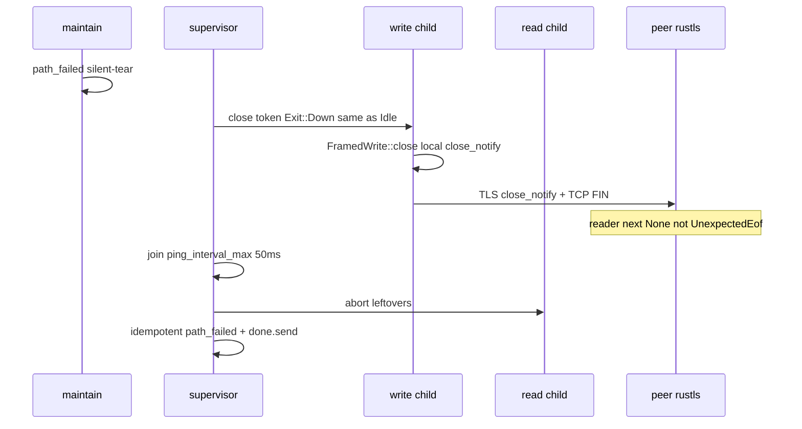

# Origin Happy Eyeballs, TLS close_notify, writer backpressure

| Field | Value |
| --- | --- |
| **Title** | Origin HE with short CAD, DOWN close_notify, write deadline, Instant-kept first RTT |
| **Author** | nya-link-aggregation maintainers |
| **Date** | 2026-08-31 |
| **Status** | Draft |
| **Audience** | Senior engineers working in `nya-server` outbound, `nya-core` path IO / session send / RTT, and `nya-e2e` prod-like first-byte SLA |
| **Predecessor** | `docs/design-interactive-ttfb-rto.md` (deployed `f11f33f`). `PROTOCOL_VERSION=2` / ALPN `nya/2`. Production: `prod-gz-yuusei`, client `run_id` `20260831T143043Z-fdcd4649`, server `20260831T142948Z-5b95e7d7`. |
| **Compatibility** | `PROTOCOL_VERSION` **stays 2**. No new TOML keys. `[session]` stays `deny_unknown_fields`. One production `Tuning::STANDARD` (clone-and-mutate in tests). Path-agnostic offsets stay: one copy in flight, retry different `path_id`, first-arrival. No concurrent k-copy. `maybe_failback` stays off the send path. |

---

## Overview

Interactive TTFB (`f11f33f`) pinned Interactive Open+DATA on one warm TCP, set `retry_after = loss_timeout(min_alive_fast)`, refused expired-Pong wall-clock on **known** paths, split path IO with `tokio::io::split`, and set inbound nodelay. Path RTT **latest** on all six overlay 5-tuples is ~7 ms. That was real.

User generate_204 through the overlay is **still ~200 ms every ~15th**. Underlay direct to the same origin is **~10 ms stable**. Post-deploy journals on `prod-gz-yuusei` (14:31Z–14:50Z) split the leftover 200 ms **and** two control-plane regressions this deploy introduced:

1. **Origin dial is the 204 TTFB**, not overlay pick/retry. `nya.outbound.dial` to `www.gstatic.com:443` is p50 2.6 ms and **p99 = max = 205.6 ms** (3/50 ≈ 1/17). Tokio 1.53.1 `TcpStream::connect((host, port))` is sequential `lookup_host` order, AAAA-first, IPv6 blackhole/slow then IPv4. 205 ms is a timer, not RTT. The predecessor **parked** Happy Eyeballs; that parking is now falsified.
2. **TLS unexpected-EOF reconnect storm.** `spawn_path_io` treats `Exit::Down | Exit::Child` as `abort()` with **no** `FramedWrite::close`. The predecessor skipped close_notify on DOWN to avoid a 200 ms wait. That was wrong: close_notify is a local TLS write; idle paths already join `ping_interval_max` (50 ms). Abort without close_notify is the WARN (`peer closed connection without sending TLS close_notify`) and the peer-side immediate tear. Timeline 14:49:28.057–.611: **all six** client paths EOF+down in 550 ms; `handshake_join_ok` 159 = `path_down` 159.
3. **Write-queue drop → 20 ms hedge storm.** `send_on_path` is `try_send` into `chan=64`. Writer `send_frame.await` blocks on TCP; the queue fills; ACK/Open/DATA drop (`frame_send_drop` **3033 server / 192 client** on 678 streams; server was **0** in the `e941` quiet window); unacked retries at `retry_after` 20 ms floor; more enqueue; worse. Hedge **15.6/stream** server vs quiet 0.94/stream. All 39/20 migrates are `send_blocked`. Biased select urgent→bulk→ping starves ping if urgent never empties.
4. **Residual RTT max 223–957 ms** while latest is 7 ms. Unknown-path first wall-clock is still admitted (`on_pong_record` if `!rtt_known`). Reconnect storm makes unknown first samples common.

**This design is one systematic ship of three coupled contracts, plus a tight RTT first-sample fix that must not reopen C from the last design.** Origin hostname dial races families with a **short** Connection Attempt Delay (20 ms = `loss_timeout_floor`, **not** RFC 8305 250 ms). DOWN and idle `wait_dead` send TLS close_notify (join 50 ms) so local silent-tear does not look like a peer incident. Writer `send_frame` is bounded by the same clock as `retry_after`; timeout / IO error / silent-down are the only `path_failed` of a 5-tuple. Urgent `try_send` full `set_congested`s and returns false — **it does not tear the dest** (`pick_retry_path` already skips `!is_schedulable()`). `note_retry` / `note_migrate` fire only on a successful send; ping cannot starve more than `ping_every`. Pending Ping Instant is kept until Pong or `ack_rtt_max`; unknown path takes **no** wall-clock and caps Instant at `unknown_degrade_min` (300 ms). No new TOML. `chan` stays 64. Overlay link dial stays sequential named-IP connect.

---

## Background & Motivation

### What already works (do not reopen)

Commit `f11f33f` (`docs/design-interactive-ttfb-rto.md`):

- Interactive Open uses `pick_pref(Interactive)`; first Interactive DATA reuses sticky while that dest is still class + schedulable + loss-fresh (`session/mod.rs` `interactive_affinity`).
- `retry_after = loss_timeout(min_alive_fast_rtt)` (`session/mod.rs` L411–429). Floor 20 ms. `pick_retry_path` None ⇒ skip.
- Known-path expired Pong is clear-only (`path.rs` `on_pong_record` L511–512). StreamAck capped at `loss_timeout(min_alive_fast)` (`streams.rs` L475–482).
- Path IO: `tokio::io::split` + `FramedRead` / `FramedWrite` (not `Framed::split`). Supervisor observes `!path.is_alive()` so `add_path` / `run_link` reconnect. `path_failed_completes_add_path` is green.
- Inbound SOCKS/Forward `set_nodelay(true)` (`nya-client/src/inbound.rs` `configure_inbound_tcp`).
- Path-agnostic offsets (`docs/design-path-agnostic-offset.md`, `PROTOCOL_VERSION=2`). Close-retry / silent-pick (`docs/design-close-retry-silent-pick.md`). `maybe_failback` is dead and **stays** dead.

Do not retune `loss_timeout_floor` / `down_min_silence` / `ping_interval_*` / `interactive_max` (1500 **bytes**). Do not restore `maybe_failback` on the send path. Do not concurrent k-copy. Do not HE overlay `spawn_links` / `connect_pinned` (named IPs).

### Production evidence (`prod-gz-yuusei`, 14:31Z–14:50Z, post-`f11f33f`)

User: manual generate_204 through overlay still **~200 ms every ~15th**; underlay direct **~10 ms stable**.

#### A. Origin dial is the 204 TTFB (not overlay)

`nya.outbound.dial` last 500 spans:

| Dest | n | Dial |
| --- | --- | --- |
| `www.gstatic.com:443` | 50 | p50 **2.6 ms**, **p99 = max = 205.6 ms**; 3 samples **205.1 / 205.5 / 205.6 ms** at 14:39:29, 14:39:44, 14:40:19. 3/50 ≈ **1/17** |
| `175.99.*:80` | — | ~23 ms deterministic |
| cloudflare | — | ~3 ms deterministic |
| `173.249.*` | — | always ~158 ms soak — **not this bug** |

The 205 ms cluster is a **timer**, not path RTT (overlay latest ~7 ms) and not GZ direct IPv4 (~10 ms on a **different** 5-tuple).

Code: `crates/nya-server/src/outbound.rs` L28–30:

```28:30:crates/nya-server/src/outbound.rs
            let connected = TcpStream::connect((inc.target.host.as_str(), inc.target.port))
                .instrument(span.clone())
                .await;
```

Workspace Tokio is **1.53.1** (`Cargo.lock`). `TcpStream::connect((host, port))` resolves via `lookup_host` and **connects addresses sequentially**. There is no Tokio CAD. Dual-stack AAAA-first (`getaddrinfo` `AF_UNSPEC`); IPv6 blackhole/slow (no RST) then IPv4. The 205.6 ms cluster is sequential connect + kernel SYN RTO (~200 ms), not an RFC 8305 250 ms timer already in Tokio. RFC 8305’s 250 ms CAD would **reproduce** the user-visible 200 ms — do not use it. Application CAD is `tokio::time::sleep(20ms)` between `JoinSet` connects.

IPv4-only dests and literal IPs are already fine (one address, no wait). Overlay client `tls.rs` `connect_pinned` / `nya-client` `spawn_links` dial **named IPs** — not this bug; **do not** HE those.

#### B. TLS unexpected-EOF reconnect storm (this deploy)

| WARN group | Client | Server |
| --- | --- | --- |
| `path read failed` unexpected-eof | **177** | **81** |
| `path silent, marking down` | 85 | 192 |

All read-failed samples: `peer closed connection without sending TLS close_notify`.

Timeline **14:49:28.057–.611**: **all six** client paths EOF+down in **550 ms** (akcdn#0, soy#0, nsix#0, akcdn#1, nsix#1, soy#1). `path_id`s 259→258 then immediately 264, 265, 266, 270… **20 path_ids in ~3.5 s**. `handshake_join_ok` **159** = `path_down` **159**.

Code: `crates/nya-core/src/path.rs` `spawn_path_io` supervisor:

```698:711:crates/nya-core/src/path.rs
        match exit {
            Exit::Idle => {
                let _ = close_tx.send(());
                let _ = tokio::time::timeout(ping_max, &mut write_task).await;
                read_task.abort();
                write_task.abort();
            }
            Exit::Down | Exit::Child => {
                read_task.abort();
                write_task.abort();
            }
        }
        session.path_failed(path.id);
        let _ = done.send(());
```

Idle `wait_dead` already does close_notify then join `ping_interval_max` (50 ms). **DOWN does not.** The write child also returns `Ok(())` at loop head when `!path.is_alive()` (L621–623), which wins the supervisor `select` as `Exit::Child` **before** the 5 ms DOWN waiter — same abort-without-close. The predecessor skipped close on DOWN “to avoid a 200 ms wait.” Close_notify is a **local TLS write**, not “wait for TCP RTO”. An idle path already joins 50 ms. Abort without close_notify is the WARN and the peer-side immediate tear.

A second hole: read child `Some(Err(e))` **always** `warn!(..., "path read failed")` (L594–596), including unexpected-eof on a path we already marked DOWN.

#### C. Write-queue drop → 20 ms hedge storm (this deploy, amplified)

| Series | Client | Server | Quiet `e941` |
| --- | --- | --- | --- |
| `frame_send_drop` | 192 | **3033** | 13 / **0** |
| streams (drop denom) | — | 678 | — |
| hedge | **3470 (5/stream)** | **10604 (15.6/stream)** | ~0.94/stream |
| `migrates` | 39 | 20 | 0 |
| migrate reason | **all `send_blocked`** | speculative/path_down/ensure_sticky = 0 | — |
| failbacks | 0 | 0 | 0 |

`send_on_path` (`session/mod.rs` L914–944) is `try_send` into `tuning.chan` (64). Writer `send_frame.await` (`path.rs` L532–546: Sink send+flush) blocks on TCP; the mpsc fills; ACK/Open/Close/small DATA drop; `retry_expired_unacked` still `rehome_unacked` (bumps `last_sent`) **and** `note_retry` even when `send_data_frame` returns false (L462–465). Maintain is 5 ms; `retry_after` is 20 ms floor. The queue never drains.

Biased write select (`path.rs` L625–673): close → **urgent** → bulk → ping. If urgent never empties, the ping arm does not run. A stalled TCP then also looks silent.

`send_data` (`streams.rs` L272–293) `note_migrate("send_blocked")` after `pick_retry` **without** requiring the replacement `send_on_path` to succeed — production `migrates` 39/20 all `send_blocked`.

#### D. Residual RTT max 223–957 ms while latest is 7 ms

Unknown-path first wall-clock is still admitted:

```511:521:crates/nya-core/src/path.rs
        if self.rtt_known() {
            return;
        }
        let now = now_ms();
        if now >= sent_at_ms {
            let sample = Duration::from_millis(now - sent_at_ms);
            let t = &Tuning::STANDARD;
            if sample > t.ack_rtt_min && sample < t.ack_rtt_max {
                self.record_rtt(sample);
            }
        }
```

`expire_stale_pings` **drops** the Instant at `loss_timeout(stable)` (`steer.rs` L52–53). Unknown `stable` is the 20 ms placeholder → expire at 40 ms. A 60 ms dest’s first Pong is always expired, which is why C of the last design kept wall-clock for unknown (e2e `delay_60ms`). Reconnect storm (B) makes **every new 5-tuple unknown**. Wall-clock then admits 223–957 ms as the first sample. Latest can still sit at 7 ms after later Instant Pongs; **max** in the window is the poison.

### Clocks (do not retune)

On a 7 ms path with `Tuning::STANDARD` + `SessionConfig` defaults:

| Clock | Formula | 7 ms path |
| --- | --- | --- |
| `loss_timeout` | `clamp(2×RTT, 20ms, 2000ms)` | **20 ms floor** |
| `ping_interval_max` | SessionConfig | **50 ms** (idle close join; not a new knob) |
| `down_timeout` | `max(5×RTT, down_min_silence=320ms) + probe` | **~330 ms** (pool hygiene) |
| `maintain_interval` | 5 ms | retry / DOWN waiter granularity |
| `ack_rtt_max` | 2 s | Instant-keep ceiling; **do not** admit as StreamAck / unknown wall-clock |
| RFC 8305 CAD | 250 ms | **the user-visible 200 ms** — do not use |
| Linux `TCP_RTO_MIN` / IPv6 SYN hang | kernel | **~200 ms** origin timer on gstatic AAAA |

Do not raise `loss_timeout_floor` to hide 200 ms. Do not HE overlay link dial.

---

## Goals & Non-Goals

### Goals

1. **Origin hostname dial: Happy Eyeballs with short CAD.** After `lookup_host`, start the first address immediately; start the next family (or next addr) after **20 ms** (`Tuning::STANDARD.origin_connect_attempt_delay` = `loss_timeout_floor`). First success wins; cancel losers. IPv4-only dests unchanged. Literal IPs unchanged. nodelay after connect stays. Helper is small and e2e-callable.
2. **DOWN / idle `wait_dead` send TLS close_notify.** Same recipe: signal writer `FramedWrite::close()`, join `ping_interval_max` (50 ms), abort leftovers, `done.send`, idempotent `path_failed`. IO error (reset, broken pipe): abort immediately, no close-after-abort. Peer unexpected-eof on a path already `!is_alive()`: **do not WARN**. Reader `None` vs rustls unexpected-eof mapped so local silent-tear is not an incident. `add_path` still completes (`path_failed_completes_add_path` stays green).
3. **Writer backpressure: do not drop control frames into a blocked TCP then hedge-storm.** `send_frame` bounded by `loss_timeout(min_alive_fast)` / floor 20 ms; timeout → write error → `path_failed` **that** 5-tuple (the one whose flush blocked). Urgent `try_send` full → `set_congested` + drop counter + return false; **never** `path_failed` (a full `chan=64` is a burst, not a dead kernel send buffer; `pick_retry_path` already skips `!is_schedulable()`, `scheduler.rs` L495–504). `retry_expired_unacked` `note_retry` only if send **succeeds**; do not bump `last_sent` on failed send; do not `path_failed` the alt; rate-limit the next attempt with `retry_not_before`. Biased select still sends pings: ping cannot starve more than `ping_every`. `chan` stays 64.
4. **RTT first-sample: Instant kept; unknown path no wall-clock.** Keep Instant until Pong or `ack_rtt_max`. `expire_stale_pings` still counts `probe_miss` at `loss_timeout(stable)` but does **not** drop Instant for that reason. Unknown: no wall-clock; Instant capped at `unknown_degrade_min` (300 ms) so `delay_60ms` / `delay_200ms` still record and 957 ms cannot enter EWMA. Known: Instant sample capped by `loss_timeout(min_alive_fast)`. Do not admit 2 s `ack_rtt_max` StreamAck (already capped).
5. **e2e simulates production**, not ping-1500: HE is gated by injectable-future **unit** tests (F1 is skip/soft if the harness cannot hang AAAA). Silent-tear of one 5-tuple does not WARN-storm the other five; blocked writer does not drop-storm **or** `path_down` siblings. Existing `prod_like_*`, `delay_60ms`, and `delay_200ms` stay green.
6. **No new TOML / proto bump.** Tests clone-and-mutate `Tuning::STANDARD` only.

### Non-goals

- IPv4-only as the only origin policy (rejected alternative).
- RFC 8305 250 ms CAD.
- Raising `loss_timeout_floor` to hide 200 ms.
- Concurrent k-copy.
- Retuning class drop log level (1 µs info) — parked since design-5.
- Happy Eyeballs on overlay link dial (client `spawn_links` to named IPs — **only** origin hostname dial).
- Restoring `maybe_failback` onto the send path.
- Changing `PROTOCOL_VERSION` / ALPN / `interactive_max` / `chan` / `ping_interval_*` / `down_min_silence`.
- Reopening Interactive pin / `retry_after = loss_timeout(min_alive_fast)` / ACK cap (last design C, except the unknown Instant-keep tightening below).

---

## Proposed Design

```mermaid
flowchart TB
  subgraph A [A. Origin HE]
    Host[hostname Target] --> Lookup[lookup_host]
    Literal[literal IP] --> One[single TcpStream::connect]
    Lookup --> Interleave["interleave_families: 2nd attempt is other family"]
    Interleave --> First[start interleaved 0 immediately]
    First --> CAD["CAD 20 ms = loss_timeout_floor"]
    CAD --> Next[start next interleaved addr]
    First --> Win[first Ok wins]
    Next --> Win
    Win --> Cancel[abort losers + set_nodelay]
  end
  subgraph B [B. Path IO close_notify]
    Idle[wait_dead] --> Close["FramedWrite::close join ping_interval_max 50ms"]
    Down["!is_alive maintain"] --> Close
    Close --> Done[abort leftovers + path_failed + done.send]
    IoErr[reset / broken pipe] --> Abort[abort immediately no close]
    UnexpEOF[rustls unexpected-eof] --> Alive{"path.is_alive()?"}
    Alive -->|no we tore it| Debug[debug no WARN]
    Alive -->|yes peer death| Warn[WARN]
  end
  subgraph C [C. Writer backpressure]
    Send["send_frame timeout = retry_after clock"] --> TO{timeout?}
    TO -->|yes| FailPath["path_failed THIS 5-tuple only"]
    TrySend[urgent try_send full] --> Congest["set_congested + drop + false — no path_failed"]
    Retry[retry_expired_unacked] --> OkSend{"send_on_path ok?"}
    OkSend -->|yes| Note[note_retry + rehome]
    OkSend -->|no| NoNote["push tried, retry_not_before, no last_sent, no hedge, no path_failed"]
    Ping[ping_due arm before urgent drain]
  end
  subgraph D [D. Instant-kept RTT]
    Expire["expire_stale_pings → late_ping at loss_timeout"] --> Miss[probe_miss once]
    Late[late_ping Instant kept] --> Pong[Pong records Instant]
    Unk["unknown: no wall-clock; Instant cap unknown_degrade_min 300ms"]
    Known[known Instant capped by loss_timeout min_alive_fast]
  end
```



### A. Origin connect: Happy Eyeballs with short CAD

**Contract:** A dual-stack origin whose AAAA blackholes/hangs must not add ~200 ms to user TTFB. IPv4-only and literal-IP dests must not change. Overlay link dial must not change.

#### A1. CAD = 20 ms = `loss_timeout_floor` (not RFC 8305 250 ms)

RFC 8305’s recommended 250 ms **is** the user-visible 200 ms on gstatic (p99 205.6 ms). Chrome-class stacks already race faster than 250 ms; we are not a browser, we are a 7 ms overlay in front of a ~10 ms IPv4 origin.

Pick **20 ms**:

| CAD | Origin TTFB if AAAA hangs, A answers in ~10 ms | Verdict |
| --- | --- | --- |
| 250 ms (RFC 8305) | ~260 ms | **the bug** |
| 50 ms (`ping_interval_max`) | ~60 ms | works, but invents a second “late” clock |
| **20 ms (`loss_timeout_floor`)** | **~30 ms** | same “this is late” threshold the overlay already uses; p99 ≪ 200 ms |

GZ IPv4 is ~10 ms class. Overlay latest is ~7 ms. HE TTFB ≈ CAD + IPv4 connect + overlay first-byte ≪ 80 ms typical, well under the 120 ms n=16 first-byte family.

Do **not** make CAD a TOML key. Add a `Tuning` field used **only** from origin dial (tests clone-and-mutate; production `STANDARD` documents it):

```rust
// crates/nya-core/src/tuning.rs — new field, no TOML
/// Origin hostname connect: delay before the next family/addr.
/// Not overlay link dial. Not RFC 8305 250 ms. Equals loss_timeout_floor.
pub origin_connect_attempt_delay: Duration,

// Tuning::STANDARD
origin_connect_attempt_delay: Duration::from_millis(20),
```

`standard_is_the_production_table` asserts it equals `loss_timeout_floor` (20 ms). Outbound does not have a `SessionConfig`; it reads `Tuning::STANDARD.origin_connect_attempt_delay`. Helper takes `cad: Duration` so tests mutate.

#### A2. Helper in `nya-core` hop (injectable race)

`hop.rs` is today `HopClock` / `HopProbe` poll wrappers, not dial. Origin hop clocks already live there; putting `connect_origin` next to them is slightly odd but acceptable if exported from `lib.rs`. Do **not** add `origin_connect_attempt_delay_ms` to TOML.

**Nodelay lives only in the helper.** Outbound drops its duplicate `set_nodelay` (`outbound.rs` L36) so there is one owner.

```rust
/// Literal IP: one connect, nodelay. Hostname: lookup_host then race.
pub async fn connect_origin(host: &str, port: u16, cad: Duration) -> io::Result<TcpStream> {
    if let Ok(ip) = host.parse::<IpAddr>() {
        return connect_and_nodelay(SocketAddr::new(ip, port)).await;
    }
    let addrs: Vec<SocketAddr> = tokio::net::lookup_host((host, port)).await?.collect();
    race_origin_addrs(addrs, cad).await
}

async fn connect_and_nodelay(addr: SocketAddr) -> io::Result<TcpStream> {
    let tcp = TcpStream::connect(addr).await?;
    let _ = tcp.set_nodelay(true);
    Ok(tcp)
}

/// Stable-within-family, then alternate families starting with `addrs[0]`'s
/// family. `[v6, v6, v4]` → `[v6, v4, v6]` so the **second** attempt is IPv4
/// (CAD 20 ms), not the third AAAA (CAD 40–60 ms). `lookup_host` typically
/// returns all AAAA then all A — do **not** race that order.
fn interleave_families(addrs: Vec<SocketAddr>) -> Vec<SocketAddr> {
    let v6: Vec<_> = addrs.iter().copied().filter(|a| a.is_ipv6()).collect();
    let v4: Vec<_> = addrs.iter().copied().filter(|a| a.is_ipv4()).collect();
    // start with addrs[0]'s family (getaddrinfo order inside each family)
    let (head, tail) = if addrs.first().is_some_and(|a| a.is_ipv6()) {
        (v6, v4)
    } else {
        (v4, v6)
    };
    let mut out = Vec::with_capacity(head.len() + tail.len());
    for i in 0..head.len().max(tail.len()) {
        if let Some(&a) = head.get(i) {
            out.push(a);
        }
        if let Some(&a) = tail.get(i) {
            out.push(a);
        }
    }
    out
}

/// Production: **interleave families**, then each addr → `TcpStream::connect`.
/// Loopback v6 with nothing listening is ECONNREFUSED (hard-fail, not a CAD hang).
pub async fn race_origin_addrs(addrs: Vec<SocketAddr>, cad: Duration) -> io::Result<TcpStream> {
    race_origin_connects(
        interleave_families(addrs)
            .into_iter()
            .map(|a| Box::pin(connect_and_nodelay(a)) as _)
            .collect(),
        cad,
    )
    .await
}

/// Unit-test seam: inject `pending()` vs `Ok` in 10 ms vs `Err(ECONNREFUSED)`.
/// This host has no CAP_NET_ADMIN (`impair.rs` header); kernel IPv6 SYN-drop
/// is not a unit-test primitive.
pub async fn race_origin_connects(
    connects: Vec<Pin<Box<dyn Future<Output = io::Result<TcpStream>> + Send>>>,
    cad: Duration,
) -> io::Result<TcpStream>
```

`crates/nya-server/src/outbound.rs` replaces `TcpStream::connect((host, port))` with `nya_core::connect_origin(..., Tuning::STANDARD.origin_connect_attempt_delay)` and **removes** L36 `set_nodelay` (helper already set it).

**Do not** change `tls.rs` `connect_pinned` or `spawn_links`.

#### A3. Race shape (implementable)

`lookup_host` order is **not** the race order. Preserve it only as the **start family** (production AAAA-first). Interleave the other family so the **second** attempt is IPv4 when the first is IPv6. Three AAAA + one A with the first AAAA hanging must start IPv4 at **20 ms**, not 60 ms.

**IPv4-mapped `::ffff:`:** `SocketAddr::is_ipv6()` is true, so they sit in the v6 partition. Production gstatic AAAA is real IPv6, not mapped. Do not unmap; one line of policy, no extra code.

1. If the connect list is empty → `ErrorKind::AddrNotAvailable`.
2. `interleave_families`: partition v6 / v4 **stable** (getaddrinfo order inside each family). Interleave starting with `addrs[0]`’s family. Then map to connect futures. (`race_origin_connects` takes an **already-ordered** list and must not interleave again — units inject `[pending(), ok_in_10ms]`.)
3. Start `interleaved[0]` immediately (`tokio::task::JoinSet`).
4. **On CAD** (if more remain): start the next not-yet-started future.
5. **On hard fail** (RST, refused, `ENETUNREACH`): start the next immediately — do **not** wait CAD. Sequential IPv6-nothing-listening on loopback must stay fast. Unit: inject `Err(ECONNREFUSED)` then `Ok` in ~ms.
6. First `Ok(TcpStream)` wins: **`JoinSet::abort_all()`** (or drop the set) so loser SYNs do not leak FDs, then return (nodelay already applied in `connect_and_nodelay`).
7. If all fail: last error.

CAD only covers **hang** (no RST), which is the gstatic AAAA blackhole. Unit hang: inject `std::future::pending()` for the first future and `Ok` in 10 ms for the second — completes in ≪ 200 ms; sequential control (await first then second) exceeds CAD. A 205 ms SYN timer never becomes user TTFB because IPv4 is in flight at 20 ms.

IPv4-only: one family, one (or more A) address, first starts immediately, CAD starts the next A only if the first hangs — no behavior change vs today’s sequential for a fast first A.

#### A4. Why not IPv4-only origin policy

Rejected. AAAA-capable dests that are healthy on IPv6 must still use IPv6. HE is a race, not a policy. Dual-stack happy IPv6 (cloudflare ~3 ms) must keep winning when it is first and fast.

---

### B. Path IO: DOWN/error must not skip TLS close_notify; unexpected-EOF must not WARN-storm

**Contract:** Local silent-tear (maintain `path_failed`) produces a TLS close_notify on that 5-tuple. The peer sees clean reader `None`, not rustls unexpected-eof. Siblings stay up. `done` still fires so `add_path` / `run_link` reconnect that **one** link.

#### B1. Unify Idle and Down on the close recipe



Supervisor table (replaces `path.rs` L698–708):

| Event | Action |
| --- | --- |
| `session.wait_dead()` (**Idle**) | Signal `close_tx`. Join writer with **`ping_interval_max` (50 ms)**. Abort leftovers. `path_failed`, `done.send`. |
| `!path.is_alive()` (**Down**, maintain silent-tear / other `path_failed`) | **Same as Idle.** Close_notify is a local TLS write; the 50 ms join is the existing idle budget, not TCP RTO. Prod `path_down` still happens — the path is already DOWN; we are only shutting the socket cleanly so the **peer** does not see unexpected-eof. |
| Read or write child **IO error** (reset, broken pipe, timed-out `send_frame`) | `abort()` the other immediately. `path_failed`. `done.send`. **No close-after-abort** — the write child owns `FramedWrite`; after abort you cannot close a half you no longer have. Socket is already dead. |
| Write child returns `Ok` because `close_rx` fired | Supervisor already in Idle/Down join. |
| Write child returns `Ok` while path is still UP | Unexpected clean exit: same as IO error. |
| Read `None` (clean EOF) | If `!is_alive()`: expected peer reaction to our close; abort leftovers, no WARN. If still UP: peer closed; treat as peer death (debug+error or WARN — see B3). `done.send`. |

**Remove** the write-child early `if !path.is_alive() { return Ok(()); }` at `path.rs` L621–623 (and the ping-tick copy at L648–650 **as a return**). **Also remove** `if session_w.is_dead() { return Ok(()); }` (C4). Either return is `Exit::Child` and **skips** close: Down races the 5 ms waiter, Idle races `wait_dead`. The write child notices DOWN/Idle **only** via `close_rx` (supervisor owns lifecycle). Ping-tick may **skip sending** if `!is_alive()` or `is_dead()`, but must not `return`. Unexpected `Ok` while still UP is IO-error class (table row).

`path_failed` is already idempotent (`session/mod.rs` L325–328). `done.send` still runs after close+join — `path_failed_completes_add_path` 500 ms timeout stays green (50 ms ≪ 500 ms and ≪ `reconnect_backoff_min` 200 ms). Extra 50 ms before reconnect is not a hang. If `close()` is stuck in a blocked flush, the 50 ms join fires, abort leftovers, `done` still sends. **Do not** apply the Idle close recipe to `Exit::Child` without that timeout — unbounded `writer.close().await` would hang `add_path` / `run_link` until TCP unsticks.

#### B2. close vs in-flight `send_frame`

`send_frame` after C is `timeout(deadline, framed.send())`. Nested with `close_rx`. **Bound `close()` itself** with `timeout(ping_max, writer.close())` so close_notify cannot sit on a blocked flush for the full supervisor join:

```rust
enum WriteOne { Sent, Closed, TimedOut, Io(io::Error) }

async fn write_one<S>(
    writer: &mut S,
    close_rx: &mut oneshot::Receiver<()>,
    deadline: Duration,
    ping_max: Duration,
    /* session, path, frame */
) -> WriteOne
where
    S: Sink<Bytes, Error = io::Error> + Unpin + SinkExt<Bytes>,
{
    tokio::select! {
        biased;
        _ = &mut *close_rx => {
            let _ = tokio::time::timeout(ping_max, writer.close()).await;
            WriteOne::Closed
        }
        r = tokio::time::timeout(deadline, send_frame(writer, session, path, frame)) => match r {
            Ok(Ok(())) => WriteOne::Sent,
            Ok(Err(e)) => WriteOne::Io(e),
            Err(_) => WriteOne::TimedOut,
        }
    }
}
```

**Exhaustive `WriteOne` handling — never continue the loop after timeout/IO/Closed:**

| Arm | Write child | Supervisor |
| --- | --- | --- |
| `Sent` | continue loop | — |
| `Closed` | `return Ok(())` | Idle/Down join already in progress |
| `TimedOut` / `Io` | `return Err(...)` | IO-error class: abort immediately, **no** close-after-abort |

After timeout the codec may be mid-frame; dropping `FramedWrite` is the shutdown. Do not send another frame on that sink. Close during `send_frame` prefers `close_rx` (biased). The write-loop `close_rx` arm uses the same `timeout(ping_max, writer.close())` then `return Ok`.

**Ping Instant vs failed send:** `path.next_ping()` inserts into `pending_ping` **before** `write_one`. If that ping then times out / IO-errors, Instant stays in pending until expire (or the path dies with the child `Err`). That is OK: the child returns `Err` and the path is torn. Do not call `next_ping()` only after a successful write — then a failed ping would not occupy pending and `should_send_ping` would immediately fire another.

Add a unit: `path_failed` while `send_frame` is blocked (stall the write half) still completes `add_path` within 500 ms. Today’s `path_failed_completes_add_path` uses a quiet duplex.

#### B3. Unexpected-eof WARN policy (pick one, test it)

**Picked: keep WARN for a real peer death; do not WARN if we already tore the path.**

| Read outcome | Mapping | Log |
| --- | --- | --- |
| `None` | rustls saw close_notify (or clean TCP FIN after close_notify) | `debug!(path, "path eof")` — today. If `!is_alive()`, this is local silent-tear completing. |
| `Some(Err(e))` with `e.kind() == UnexpectedEof` (rustls: `"peer closed connection without sending TLS close_notify"`) | **If `!path.is_alive()`:** we tore it (or are tearing it); **`debug`**, not WARN. **If still UP:** real peer death — **keep WARN** `path read failed`. |
| `Some(Err(e))` reset / broken pipe / other | IO error class | WARN + abort immediately |

Helper (unit-testable, no string matching required beyond kind):

```rust
fn is_tls_unexpected_eof(e: &io::Error) -> bool {
    e.kind() == io::ErrorKind::UnexpectedEof
}
```

rustls 0.23 maps missing close_notify to `ErrorKind::UnexpectedEof`. **Kind-only is broader:** a TCP FIN mid-length-delimited frame is also `UnexpectedEof`. That is what we want: missing close_notify **or** truncated frame. On a path already DOWN, both debug (acceptable). On UP, both WARN (acceptable). Do **not** string-match the rustls message.

Tests: peer `TcpStream` drop **without** TLS shutdown while UP → WARN; same drop **after** local `path_failed` → no WARN.

Do **not** demote real peer death to debug: an UP path that the **peer** abort-tore is still an incident on **this** 5-tuple. The production storm was local-DOWN unexpected-eof WARNs.

#### B4. Must not hang `add_path`

Every supervisor exit path `done.send` **after** abort leftovers (`path.rs` L710–711 today; keep that after the match). Close+join 50 ms does not change that. Merge-gate: existing `path_failed_completes_add_path` (`session/mod.rs` L1464–1475) stays green. New: `path_failed` while the write child is blocked in `send_frame` still completes `done` within 500 ms. After `path_failed`, the **peer** duplex’s read child sees `None` (or unexpected-eof **without WARN** if we abort past 50 ms); a subsequent `add_path` on a new duplex can run.

---

### C. Writer backpressure: do not drop control frames into a blocked TCP then hedge-storm

**Contract:** A stalled TCP send buffer fails **that** 5-tuple within one `retry_after` clock (write deadline / IO error). Interactive frames are not silently dropped into a full mpsc while maintain hedges every 20 ms. A full mpsc is **not** `path_failed`. Ping still goes out. `chan` stays 64. Stall or urgent-full on **one** of six must leave the other five up.

#### C1. Write deadline = same clock as `retry_after`

`send_frame` must not await forever. Deadline:

```rust
// session method, pub(crate), same formula as retry_after (mod.rs L422–429)
fn write_deadline(&self, path_id: u32) -> Duration {
    self.retry_after(path_id) // loss_timeout(min_alive_fast) else this path else floor
}
```

Writer child has `session` + `path`. Bound every `send_frame` (urgent, bulk, ping) by `session.write_deadline(path.id)`.

On timeout: treat as write error → write child `Err` → supervisor IO-error class (abort immediately, `path_failed` that 5-tuple). Do **not** sit filling mpsc. Pool hygiene: `run_link` reconnects that named `{link}#{i}`; other 5-tuples stay up.

Why min-alive-fast, not this-path fast: a 200 ms poisoned EWMA on nsix would wait `loss_timeout(200ms)=400 ms` still filling the queue. Why not a raw 20 ms constant: a slow-only 180 ms pool honestly needs `loss_timeout(180ms)=360 ms`. Same helper as retry so the two cannot drift.

A 16 KiB bulk flush on a 7 ms dest with a healthy send buffer completes in ≪ 20 ms. A flush that cannot finish in the retry clock **is** a full kernel send buffer (peer not ACKing) — the path is unusable for interactive, which is the production hole.

Do not reuse `FramedWrite` after timeout (codec may be mid-frame).

#### C2. `try_send` full: congested, not `path_failed`

`send_on_path` (`session/mod.rs` L914–944) stays `try_send`, `chan` stays 64.

**Who may `path_failed` a 5-tuple:** C1 write-timeout, IO error (reset / broken pipe / timed-out `send_frame`), maintain silent-down. **Not** `try_send` full. Production already filled queues (`frame_send_drop` 3033 server / 192 client, 678 streams). After a failed alt send, `last_sent` stays stale so the copy is still expired; `pick_retry_tried` would walk the remaining dests; `path_failed` on each failed `try_send` tears all six in one maintain pass — that **is** the 14:49:28 signature, now caused by the fix. `chan=64` full is a burst (hedge already enqueued into healthy alts), not proof the kernel send buffer is dead.

Urgent (ACK / Open / Close / small DATA / Pong — `frame_is_interactive`):

- Count `frame_send_drop` as today.
- `set_congested(true)` as today (`is_schedulable` already excludes congested; `pick_retry_path` first rungs skip `!is_schedulable()`, `scheduler.rs` L495–504).
- Return `false`.
- **Do not** `path_failed` from `send_on_path` or from any caller because `try_send` returned false.

Bulk `try_send` full: keep today’s “do not mark unusable for ACKs” (`set_congested` only if urgent). Count `frame_send_drop`. **Do not** `path_failed`. Unacked DATA can be > `interactive_max` (1500 B) and rides the bulk queue (`frame_is_interactive`, `session/mod.rs` L906–911). C1 fails the 5-tuple if TCP is actually stuck.

Callers:

| Site | Today | After |
| --- | --- | --- |
| `retry_expired_unacked` | `rehome` (bumps `last_sent`) + `send_data_frame` + **always** `note_retry` | **Only if send succeeds:** rehome + `note_retry`. If send fails (urgent **or** bulk): push `tried`, **do not** bump `last_sent`, **do not** `note_retry`, **do not** `path_failed`. Set `retry_not_before = now + retry_after(from)` so maintain cannot spin every 5 ms (`frame_send_drop` storm). |
| `send_data` migrate | `pick_retry` + `send_on_path(alt)` + **always** `note_migrate("send_blocked")` | `note_migrate` **only if** alt send succeeds. If both fail: no migrate count, no `path_failed`. |
| `open_stream` | `remember_open` primary (L58) then `pick_retry` + `send_on_path(alt)` + `remember_open(alt)` even if alt fails | Keep `remember_open` on the dest we last **attempted**. Always remember **primary** so `retry_opens` can fire (`mod.rs` L568–582, already success-gated). `remember_open(alt)` only if we actually send on alt. Do **not** skip remembering the original dest on send fail — otherwise SOCKS sits until `all_down_timeout`. |
| `retry_opens` / `retry_closes` | already `if send_on_path { note_retry / close_retry }` | unchanged success gate; on fail **do not** `path_failed`. Open/Close: bump `sent_at` on failed attempt **without** `note_retry` so the retry clock rate-limits (these timestamps are not ACK-RTT samples). |
| `send_ack` / Ping→Pong `handle_frame` L344–350 | try alt pick | try alt pick; **never** `path_failed` because Pong/ACK `try_send` failed. A DATA-backed-up path must still probe. |

#### C3. `retry_expired_unacked`: only `note_retry` if send succeeds; never `path_failed` on `false`

Restructure so `unacked` is **not** held across send (lock hygiene; `path_failed` is no longer a caller of this function on the fail path, but C1/`maintain` still re-enter `rehome_unacked_from`).

`Unacked` gains `retry_not_before: Instant` (`crates/nya-core/src/stream.rs`). Init = `last_sent`. `last_sent` remains enqueue / last **successful** send (ACK RTT origin). Session-memory only.

```rust
fn retry_expired_unacked(&self, st: &StreamState) {
    if !st.is_steerable() {
        return;
    }
    let now = Instant::now();
    let expired: Vec<(u64, u32, Vec<u8>, Vec<u32>)> = {
        let unacked = st.unacked.lock().unwrap();
        unacked
            .iter()
            .filter(|(_, u)| {
                u.last_sent.elapsed() >= self.retry_after(u.path_id)
                    && now >= u.retry_not_before
            })
            .map(|(off, u)| (*off, u.path_id, u.data.clone(), u.tried.clone()))
            .collect()
    };
    for (offset, from, data, mut tried) in expired {
        Self::push_tried(&mut tried, from);
        let Some(alt) = self.pick_retry_tried(&tried) else {
            continue;
        };
        if self.send_data_frame(st.id, offset, data, alt) {
            if let Some(u) = st.unacked.lock().unwrap().get_mut(&offset) {
                self.rehome_unacked(u, alt); // last_sent = now; retry_not_before = now
            }
            self.note_retry(from, alt);
        } else {
            // urgent or bulk full: congested-not-path_failed (C2).
            if let Some(u) = st.unacked.lock().unwrap().get_mut(&offset) {
                Self::push_tried(&mut u.tried, alt);
                u.retry_not_before = Instant::now() + self.retry_after(from);
                // last_sent unchanged — ACK RTT origin stays the successful send
            }
            // NO path_failed(alt). NO note_retry.
        }
    }
}
```

`rehome_unacked` also sets `retry_not_before = last_sent`. Failed send must not bump `last_sent` into a hedge loop and must not tear siblings. `pick_retry_path` last rung (`scheduler.rs` L506–510) can still pick a previously-tried alive dest once `tried` is exhausted, so we do not black-hole the copy after six full queues; `retry_not_before` is the rate limit.

Merge-gate unit: stall or urgent-full on **one** of six → `path_down` delta on the **other five is 0**; `data_hedge` unchanged on failed send; `last_sent` unchanged.

#### C4. Biased select must still send pings

Write child **exits only** via `close_rx` (`WriteOne::Closed` / close arm) or `WriteOne::TimedOut`/`Io` (`return Err`). No `is_dead()` / `!is_alive()` early `return Ok`.

Implementable write-loop shape — **ping-due is a first-class arm**, not “after the urgent queue happens to empty”:

```rust
loop {
    let ping_every = session_w.probe_interval_for(&path_w);
    let ping_due = tokio::time::Instant::now() >= next_ping
        && path_w.is_alive()
        && !session_w.is_dead()
        && path_w.should_send_ping(path_w.last_rx_ago(), ping_every);

    tokio::select! {
        biased;
        _ = &mut close_rx => {
            let _ = tokio::time::timeout(ping_max, writer.close()).await;
            return Ok(());
        }
        // Ready immediately when ping is due — before draining more urgent.
        _ = std::future::ready(()), if ping_due => {
            // next_ping() BEFORE write_one: failed ping still occupies pending.
            let ping = path_w.next_ping();
            match write_one(..., Frame::Ping(ping)).await {
                WriteOne::Sent => {
                    next_ping = tokio::time::Instant::now() + ping_every;
                }
                WriteOne::Closed => return Ok(()),
                WriteOne::TimedOut | WriteOne::Io(_) => {
                    return Err(io::Error::new(io::ErrorKind::TimedOut, "path write"));
                }
            }
        }
        out = urgent.recv() => {
            let Some(frame) = out else { return Ok(()); };
            match write_one(..., frame).await {
                WriteOne::Sent => {}
                WriteOne::Closed => return Ok(()),
                WriteOne::TimedOut | WriteOne::Io(e) => return Err(e),
            }
        }
        out = rx.recv() => { /* same exhaustive match as urgent */ }
        _ = tokio::time::sleep_until(next_ping), if !ping_due => {
            // skip send if !is_alive / is_dead; do not return
        }
    }
}
```

`std::future::ready(())` + `if ping_due` is immediately ready and biased **above** `urgent.recv()`. That is intended. It busy-loops if `ping_due` stays true: after `Sent`, `next_ping = now + ping_every` so `ping_due` becomes false; after `next_ping()` the pending count is 1 so `should_send_ping` is false even before the write completes. Never fall through TimedOut/Io into another send (poisoned sink). Advance `next_ping` **only** after a successful ping `Sent`.

Worst ping delay: one `write_one` deadline (≤ `retry_after`, 20 ms on the 7 ms pool) plus loop. Combined with C1, urgent cannot starve ping for 200 ms.

Do not switch the whole select to unbiased as the **sole** fix: bulk vs urgent fairness is still wanted; ping is the starved arm. The `if ping_due` ready future is enough.

---

### D. RTT first-sample (tight; do not reopen last-design C)

**Contract:** Unknown 60 ms dests still freeze class (`delay_60ms` green) **without** wall-clock. `delay_200ms` first Instant (~200 ms) still records. Known-path 200 ms Instant is not recorded. Reconnect-storm unknown Instant **above** `unknown_degrade_min` (300 ms) is not recorded (957 ms gone; 223 ms Instant is under the cap and is the same class as `delay_200ms`).

#### D1. Keep Instant until Pong or `ack_rtt_max`; expire does not drop it

Today `expire_stale_pings` **removes** Instant at `loss_timeout(stable)` and returns the count as `probe_miss`. That is why unknown 60 ms dests needed wall-clock.

**Split pending vs late** (session-memory only, no wire, no Tuning field):

| Map | Role |
| --- | --- |
| `pending_ping: HashMap<u64, Instant>` | in-flight; `should_send_ping` still requires `pending_ping_count()==0` (`path.rs` L275–277) |
| `late_ping: HashMap<u64, Instant>` | Instant kept for a late Pong; does **not** block the next ping; **not** in-flight |

**Lock order: `pending_ping` then `late_ping`, never reverse.** Maintain (`expire_stale_pings` / `drop_ancient_pings` / `next_ping`) vs the read child (`on_pong_record`) otherwise deadlock.

`pending_ping_count` / `pending_ping_age` / catalog `nya_path_pending_ping` (`metrics.rs` L538, `catalog.rs` L486) stay **pending only**. Late is not in-flight. `probe_miss` is counted once at the move; do not also count late as pending.

**Degrade:** `should_mark_degraded` (`health.rs` L89–98) uses `pending_after_expire`. Expire now leaves `pending==0` (moved, not dropped), same as today’s drop. Late does **not** count as in-flight. Do not change `should_mark_degraded`. `steer.rs` L128 keeps `p.pending_ping_count()`.

```rust
pub fn expire_stale_pings(&self, max_age: Duration) -> u64 {
    let mut pending = self.pending_ping.lock().unwrap();
    let mut late = self.late_ping.lock().unwrap(); // pending then late
    let stale: Vec<u64> = pending
        .iter()
        .filter(|(_, t)| t.elapsed() >= max_age)
        .map(|(seq, _)| *seq)
        .collect();
    let n = stale.len() as u64;
    for seq in stale {
        if let Some(t0) = pending.remove(&seq) {
            late.insert(seq, t0);
        }
    }
    n
}

fn drop_ancient_pings(&self, max_age: Duration) {
    let mut pending = self.pending_ping.lock().unwrap();
    let mut late = self.late_ping.lock().unwrap();
    pending.retain(|_, t| t.elapsed() < max_age);
    late.retain(|_, t| t.elapsed() < max_age);
}

pub fn next_ping(&self) -> Ping {
    let seq = self.ping_seq.fetch_add(1, Ordering::Relaxed);
    let mut pending = self.pending_ping.lock().unwrap();
    let mut late = self.late_ping.lock().unwrap();
    // should_send_ping requires pending==0, so pending is 0|1.
    // Overflow is late-only. Never clear() pending (today's wipe, path.rs L479–482).
    let cap = Tuning::STANDARD.pending_ping_max;
    while pending.len() + late.len() >= cap {
        let Some(oldest) = late
            .iter()
            .min_by_key(|(_, t)| *t)
            .map(|(k, _)| *k)
        else {
            break; // late empty: do not wipe pending
        };
        late.remove(&oldest);
    }
    pending.insert(seq, Instant::now());
    Ping { seq, sent_at_ms: now_ms() }
}
```

`HashMap` has no order: oldest late is `min_by_key` on the stored `Instant`. If late is empty and pending is somehow at cap, dropping oldest late is a no-op — **do not** fall through to `clear()` pending.

`steer.rs` `maintain`: keep `expire_stale_pings(loss_timeout(stable))` for `probe_miss` / degrade. Also `drop_ancient_pings(cfg.tuning.ack_rtt_max)` once per tick.

`should_send_ping` **stays** `pending_ping_count()==0`. Expire **moves** to `late_ping`, so the next ping is allowed while the old Instant remains. Combined with C4’s ping-due arm, a 60 ms dest may send ping 1 at ~`ping_interval_max` (50 ms) while ping 0 is late — two Instant maps, fine.

#### D2. Unknown path: no wall-clock; Instant cap `unknown_degrade_min`

Delete the `!rtt_known()` wall-clock branch in `on_pong_record`. Look up Instant in `pending_ping` **or** `late_ping`. If neither: **return** (clear-only, both known and unknown).

Unknown 60 ms dest: Instant moved to `late_ping` at 40 ms; Pong at 60 ms still finds it; `t0.elapsed()` ≈ 60 ms < 300 ms; `rtt_known` becomes true; class freeze works; `delay_60ms` stays green. `delay_200ms` (catalog `scenarios.rs` L1578–1580) first Instant ~200 ms < 300 ms still records.

**Unknown Instant cap = `Tuning::STANDARD.unknown_degrade_min` (300 ms), not `None` and not `ack_rtt_max` (2 s).** A reconnect-storm Pong that actually arrives at 957 ms still has Instant if we kept it; cap 300 ms refuses it. 223 ms Instant is under the cap — same class as `delay_200ms`; retract “all residual max becomes handshake-scale.” Wall-clock is gone; Instant above 300 ms is gone; Instant 60–200 ms stays.

**`record=false`:** `on_pong_record` removes from pending/late **then** `if !record { return; }`. Instant is discarded. Unknown first Pong behind `inflight_bias` stays unknown with no wall-clock fallback. **Acceptable:** `delay_60ms` / `delay_200ms` are ping workloads, not bulk; `record` is true when `inflight < inflight_bias`. Do not keep the Instant after `record=false` for a later sample.

#### D3. Known path: Instant sample capped

`handle_frame` Pong (`session/mod.rs` L352–356) passes a cap. Existing 3-arg call sites must be updated: `PathState::on_pong` (`path.rs` L491–492), unit tests `expired_pong_does_not_raise_ewma` / `expired_pong_unknown_path_records_first_sample` / `in_pending_pong_still_records_instant` (`path.rs` L740–770), and `session/mod.rs` L355.

```rust
Frame::Pong(p) => {
    if let Some(path) = self.get_path(path_id) {
        let record = path.inflight_bytes() < self.inner.cfg.tuning.inflight_bias;
        let cap = if path.rtt_known() {
            Some(health::loss_timeout(
                &self.inner.cfg,
                self.min_alive_fast_rtt().unwrap_or_else(|| {
                    crate::scheduler::path_loss_rtt(&path)
                }),
            ))
        } else {
            Some(self.inner.cfg.tuning.unknown_degrade_min) // 300 ms
        };
        path.on_pong_record(p.seq, p.sent_at_ms, record, cap);
    }
}
```

```rust
pub fn on_pong_record(&self, seq: u64, _sent_at_ms: u64, record: bool, cap: Option<Duration>) {
    // lock order: pending then late
    let started = {
        let mut pending = self.pending_ping.lock().unwrap();
        pending.remove(&seq)
    };
    let started = match started {
        Some(t0) => Some(t0),
        None => self.late_ping.lock().unwrap().remove(&seq),
    };
    if !record {
        return;
    }
    let Some(t0) = started else {
        return; // no wall-clock
    };
    let sample = t0.elapsed();
    if let Some(cap) = cap {
        if sample > cap {
            return;
        }
    }
    self.record_rtt(sample);
}
```

The `or_else` form that locks late while pending is still held is **forbidden** (lock-order). Split as above.

Known 7 ms pool: cap = 20 ms. A 200 ms Instant is **not** recorded. Unknown: cap = 300 ms; 60 ms and 200 ms Instant record; 957 ms does not.

StreamAck stays as last design C (`streams.rs` L475–482): `sample <= loss_timeout(min_alive_fast)` **and** `sample < ack_rtt_max`. Do **not** admit 2 s `ack_rtt_max` as the ACK cap.

Do not reopen known-path expired-Pong clear-only, `retry_after`, or Interactive pin.

---

## API / Interface Changes

| Surface | Change |
| --- | --- |
| `PROTOCOL_VERSION` / ALPN | **unchanged** (2 / `nya/2`) |
| TOML / `SessionOpts` / `[session]` | **no new keys**, still `deny_unknown_fields` |
| `Tuning::STANDARD` | **one new field** `origin_connect_attempt_delay = 20ms` (= `loss_timeout_floor`). No retune of `loss_timeout_*` / `down_*` / `ping` / `interactive_max` / `chan` / `ack_rtt_*`. Tests clone-and-mutate. |
| `nya_core::connect_origin` / `interleave_families` / `race_origin_addrs` / `race_origin_connects` | new; outbound uses `connect_origin`; `race_origin_addrs` interleaves then connects; units inject futures into `race_origin_connects` |
| `nya-server` `outbound.rs` | `connect_origin` instead of sequential `TcpStream::connect((host, port))`; **drop** duplicate `set_nodelay` (helper owns it) |
| `tls.rs` `connect_pinned` / `spawn_links` | **unchanged** (named IPs; no HE) |
| `spawn_path_io` | Idle **and Down** close+join 50 ms; write child does not `return Ok` on `!is_alive` **or** `is_dead`; unexpected-eof WARN gated on `is_alive`; `write_one` exhaustive + ping-due arm; `close()` itself `timeout(ping_max)` |
| `PathState` | `late_ping` map; lock order pending then late; `expire_stale_pings` moves; `drop_ancient_pings`; `next_ping` drops oldest late, never `clear()` pending; `on_pong_record(..., cap)` no wall-clock |
| `Session::send_on_path` callers | `note_retry` / `note_migrate` only on successful send; **never** `path_failed` because `try_send` returned false |
| `Session::retry_expired_unacked` | do not hold `unacked` across send; no `last_sent` bump / no `path_failed` on failed send; `retry_not_before` rate-limit |
| `Unacked` | new `retry_not_before: Instant` (init = `last_sent`) |
| `chan` | **64 unchanged** |
| Public SOCKS / `open_stream` signatures | unchanged |

---

## Data Model Changes

No on-disk schema. No wire change. Session-memory only.

- `PathState.late_ping: Mutex<HashMap<u64, Instant>>` — Instant kept after `loss_timeout` expire for a late Pong. Dropped at `ack_rtt_max`. Not in `pending_ping_count` / `nya_path_pending_ping`.
- `Tuning.origin_connect_attempt_delay` — production 20 ms; not deserialized. **Not** a `SessionOpts` key.
- `Unacked.retry_not_before: Instant` — rate-limit after failed `try_send`; `last_sent` / `tried` otherwise unchanged. `OpenUnacked` / `CloseUnacked` stay as-is (`sent_at` bumps on failed attempt without `note_retry`).
- Path IO: close token already exists; Down uses it. Write deadline is in-memory only.
- No migration. Rolling restart is v2↔v2.

---

## Alternatives Considered

### 1. IPv4-only origin policy

Skip AAAA. gstatic 205 ms goes away. Dual-stack dests that are **healthy** on IPv6 (cloudflare ~3 ms) lose IPv6. A policy, not a race. **Rejected** (non-goal). HE with 20 ms CAD keeps fast IPv6 and caps blackhole AAAA at CAD+IPv4.

### 2. RFC 8305 250 ms CAD

The recommended browser CAD **is** the user-visible 200 ms. **Rejected.** 20 ms = `loss_timeout_floor`.

### 3. Raise `loss_timeout_floor` to 200 ms (or hide TTFB in overlay retry)

Waits as long as the origin timer. Overlay’s job is to cap **before** that timer, and this 200 ms is **origin dial**, not overlay loss. **Rejected.**

### 4. Happy Eyeballs on overlay `spawn_links` / `connect_pinned`

Client links are named IPs (`nya-client/src/lib.rs` `spawn_links`). Sequential connect is correct. HE there races nothing useful and couples overlay reconnect to origin CAD. **Rejected** (non-goal).

### 5. Keep abort-without-close on DOWN (predecessor E)

“Close_notify waits 200 ms.” False: close_notify is a local TLS write; idle already joins 50 ms. Abort-without-close **is** the unexpected-eof WARN storm and peer-side immediate tear (14:49:28 all-six-in-550 ms). **Rejected.** IO error still aborts without close.

### 6. Grow `chan` past 64 / unbounded mpsc

Hides drop counters while `send_frame` still blocks forever; hedge still storms when retry enqueues faster than TCP. **Rejected.** Deadline + fail **the stuck** 5-tuple. `chan` stays 64.

### 6b. Urgent-full → `path_failed` (first draft of this design)

A full `chan=64` is a burst. `path_failed(alt)` on failed `try_send` walks the pool in one maintain pass and reproduces 14:49:28. **Rejected.** C1 is the stuck-TCP signal; `set_congested` + `pick_retry_path` `!is_schedulable()` is enough for queue-full.

### 7. Unbiased write select as the sole ping-starve fix

If `send_frame.await` is in flight, no arm runs. Bias is secondary. Deadline + ping-due arm. **Rejected as the sole fix.**

### 8. Keep unknown-path wall-clock (last design C)

Needed only because Instant was dropped at `loss_timeout(stable)` (40 ms on unknown). Reconnect storm makes unknown first samples common; wall-clock admits 223–957 ms. Keep Instant in `late_ping` instead, cap unknown Instant at `unknown_degrade_min` (300 ms). **Rejected** as a standing policy; `delay_60ms` / `delay_200ms` stay green via Instant < 300 ms.

### 9. Concurrent k-copy / restore `maybe_failback`

User already rejected both. Production failbacks 0. **Rejected.**

### 10. `Framed::split` / close-after-abort

`Framed::split` still serializes flush vs read (last design; rejected). Close-after-abort cannot close a half the supervisor no longer owns. **Rejected.**

---

## Security & Privacy Considerations

- No new frame, no new plaintext, no new handshake field. Origin dial is still `TcpStream` to `StreamOpen.target`.
- HE cancels loser sockets (drop). No extra origin request: TCP handshake only on losers; first success is the only stream `copy_bidirectional` uses. Duplicate StreamOpen remains vacant-only (`try_alloc_local_stream`).
- TLS close_notify on DOWN is the **standard** clean shutdown. Abort-without-close on IO error matches today’s write-error `path_failed`. Peer already has Close/Reset on overlay streams.
- CAD is not a user-data timer. `set_nodelay` is a socket option.
- Dual-stack e2e echo is local harness if present, not the public internet. HE correctness is unit-tested with injectable futures.

---

## Observability

No new Prometheus names. Existing `nya.outbound.dial` (`nya_dial_us`), `path_down`, `handshake_join_ok`, `frame_send_drop`, `data_hedge`, `migrates_send_blocked`, path RTT latest/max, `probe_miss` suffice.

| Signal | Success after this ship | Do not page |
| --- | --- | --- |
| `nya.outbound.dial` `www.gstatic.com:443` | **p99 ≪ 200 ms** (CAD+IPv4, not 205.6 cluster) | cloudflare ~3 ms / 175.99 ~23 ms / 173.249 ~158 ms soak stay dest-shaped |
| `path read failed` unexpected-eof | **rate collapses** (local DOWN is debug) | a true UP-path peer death still WARNs |
| `handshake_join_ok` vs `path_down` | no 1:1 reconnect storm; no 20 path_ids / 3.5 s | per-link hygiene `path_down` at ~330 ms still exists |
| `frame_send_drop` server | **~0** like `e941` quiet | — |
| hedge | back toward **≤1/stream** on a quiet pool | false 20 ms retries on a 7 ms dest pool are pre-existing; not a TTFB proxy |
| `migrates_send_blocked` | **rare** (only count if alt send succeeds; urgent-full does not tear dests) | — |
| path RTT latest / max | latest ~7 ms; **max** not 957 ms from unknown wall-clock or Instant > 300 ms | nsix underlay max ~40 ms may remain; unknown Instant ≤ 300 ms (delay_200ms class) is admitted |
| class 1 µs info chatter | **out of scope** (parked since design-5) | — |

Logs: keep WARN on real `path read failed` / `path write failed`. Do not info-log per origin HE winner (every 204). Optional `debug` on HE loser cancel is too noisy at 20 streams/s.

Alerts: page on overlay first-byte / gstatic dial p99 if IPv4 to that dest is live — not on hedge, not on stall mean, not on nsix `path_down`.

---

## Rollout Plan

Single production `Tuning::STANDARD`, both ends already on v2. No mixed-session story. **No feature flag.** No new TOML.

1. Land **one PR after C2 is “congested, not path_failed”** (unit tests + e2e `short_matrix` minus F1 as a hard gate). Instant-keep must land with B. Writer deadline must land with success-gated `note_retry`.
2. **Split only if HE unit injection or F1 slips:** PR(HE, server-only, `outbound.rs` + `hop.rs` + Tuning field) can land first. PR(B+C+D) is the control-plane ship and **must not wait** on dual-stack e2e. Do not split Instant-keep from B. Do not ship C2-as-`path_failed` in the same binary as anything else.
3. Deploy client **and** server together for B+C+D (both roles). HE is server-only and can ride the same tag.
4. Watch 45 min on `prod-gz-yuusei`:
   - Manual overlay generate_204: **no ~1/15 200 ms**.
   - `nya.outbound.dial` gstatic:443 p99 ≪ 200 ms.
   - `path read failed` unexpected-eof collapses; no all-six-down-in-550 ms.
   - `frame_send_drop` server ~0; hedge toward ≤1/stream on quiet; `migrates_send_blocked` rare; **`path_down` must not flap all six** on a write-queue burst.
   - Path RTT **latest** ~7 ms; **max** not 957 ms from unknown wall-clock / Instant > 300 ms.
   - `failbacks_class_empty=0`. Do not retune down clocks if nsix dual-down continues.
5. **Rollback:** revert the PR(s). v2 wire unchanged. Origin sequential connect restore reintroduces 205 ms gstatic — acceptable as rollback. Path IO abort-without-close on DOWN restore reintroduces the WARN storm — acceptable as rollback. A writer cascade that `path_failed`s all six is **worse** than leaving gstatic 1/17 205 ms — that is why C2 is rewritten before land.

---

## Risks

| Risk | Sev | Mitigation |
| --- | --- | --- |
| CAD 20 ms still misses a slow-but-alive AAAA that would have won at 30 ms | Low | First success wins; if IPv6 is actually 15 ms it wins before CAD IPv4. If IPv6 is 205 ms it **must** lose |
| HE opens extra SYNs (losers) | Low | At most a handful of addresses; `JoinSet::abort_all` on win. Not k-copy of StreamOpen |
| `localhost` / CI has no IPv6 blackhole (RST instead of hang) | Med | HE merge gate is `race_origin_connects` + `interleave_families`. **F1 not in `catalog()`.** If present, skip SLA is `must_survive: false, p99_ms: None, min_success: 0.0` so `pass()` is true |
| Close_notify on DOWN waits 200 ms | Low | Join is `ping_interval_max` 50 ms then abort. `close()` itself `timeout(ping_max)`. Close is a local TLS write |
| Write-child `return Ok` on `!is_alive` **or** `is_dead` races as Child | **High** | Remove **both** returns. Child exits only via `close_rx` or IO/`write_one` error |
| Write deadline 20 ms fails a healthy slow-only dest | Med | Deadline is `loss_timeout(min_alive_fast)`: 180 ms-only pool → 360 ms |
| Urgent-full `path_failed` flaps all six (14:49:28) | **High** | **Do not `path_failed` on `try_send` false.** Merge-gate: stall/full on one of six leaves five up |
| `note_retry` on failed send still storms hedge | **High** | C3: failed send does not increment `data_hedge` / bump `last_sent`; `retry_not_before` rate-limits 5 ms spin |
| Instant-keep without `late_ping` blocks next ping (`should_send_ping` pending==0) | Med | Expire **moves** to `late_ping`. `pending_ping_max` drops oldest late by Instant, does not `clear()` pending |
| Unknown Instant 957 ms still records | Med | Cap unknown Instant at `unknown_degrade_min` (300 ms). `delay_60ms` / `delay_200ms` still < 300 ms |
| Lock-order deadlock pending vs late | **High** | Always pending then late. `on_pong_record` does not `or_else` late while pending is held |
| Accept-queue IPv6 “blackhole” RSTs / v4-first `localhost` | Med | Do not block the PR on F1. Unit hang is the CAD gate |
| All-six-down was underlay, not close_notify | Low | F2 sibling-alive is hygiene. B merge gate is WARN-capture (zero unexpected-eof WARN on five live paths + debug-not-WARN on the torn path) |
| Supervisor omits `done.send` after close join | **High** | Existing `path_failed_completes_add_path` + blocked-`send_frame` variant; every exit path `done.send` after abort leftovers |
| Unbounded `writer.close().await` hangs `add_path` | Med | Bound close with `timeout(ping_max)` in the write child. Supervisor still times out the JoinHandle |

---

## Open Questions

None that block implementation. Resolved here:

- CAD = **20 ms** = `loss_timeout_floor` via `Tuning.origin_connect_attempt_delay`. Not 50 ms, not 250 ms. Not a TOML key. Helper takes `Duration` so tests mutate. Tokio 1.53.1 has no built-in HE; application `JoinSet` + `sleep(cad)` + `abort_all`.
- Helper lives in `nya-core` `hop.rs` (`connect_origin` / `interleave_families` / `race_origin_addrs` / `race_origin_connects`). `race_origin_addrs` interleaves **then** maps; `race_origin_connects` is already-ordered. Overlay `connect_pinned` unchanged. Nodelay only in the helper. `::ffff:` partitions as v6; do not unmap.
- DOWN uses the **Idle close recipe** (50 ms join). IO error aborts immediately. Write child does not `return Ok` on `!is_alive` **or** `is_dead`. `close()` bounded by `timeout(ping_max)`.
- Unexpected-eof: **WARN if path still UP; debug if `!is_alive()`.** Kind-only = missing close_notify **or** truncated frame.
- Write deadline = `retry_after` clock. `chan` 64. `note_retry` / `note_migrate` only on successful send. **`try_send` false never `path_failed`.** `retry_not_before` rate-limits. `open_stream` always remembers primary.
- Ping-due `ready()` arm in biased select; exhaustive `WriteOne`; `next_ping()` before write.
- Instant-keep via `late_ping`; lock order pending then late; overflow drops oldest late, never `clear()` pending; unknown **no** wall-clock; unknown Instant cap `unknown_degrade_min` 300 ms; known Instant capped by `loss_timeout(min_alive_fast)`. Degrade still uses `pending_ping_count()` after expire (late does not count).
- e2e n=16 uses `first_byte_sla(120, 0.95)`. HE sequential-fail is a unit test of `race_origin_connects` + `interleave_families`. **F1 is not in `catalog()`.** If registered anyway, skip must return `Sla { must_survive: false, p99_ms: None, min_success: 0.0 }` so `pass()` is true — notes alone still red `short_matrix`. F2 WARN-capture is the B gate. F3 `alive_path_count() >= 5`.
- No proto bump; no k-copy; no overlay HE; no `maybe_failback`; no `loss_timeout_floor` retune.

Soak-followup (not this PR): class 1 µs info chatter (parked since design-5). Link-spread if sequential overlay p50 sits at 40 ms with soy/akcdn live (last design alt 1).

---

## Testing

### Unit

| Test | Where | Pass |
| --- | --- | --- |
| HE prefers fast family | `hop.rs` | `race_origin_connects([pending(), ok_in_10ms], cad=20ms)` completes in ≪ 200 ms; winner is the 10 ms future |
| Family interleave | `hop.rs` | `interleave_families([v6, v6, v4])` == `[v6, v4, v6]` (second attempt is IPv4). IPv4-first `[v4, v6]` stays `[v4, v6]`. |
| Sequential hang exceeds CAD | `hop.rs` | same two futures awaited one-by-one exceed CAD |
| Hard-fail skips CAD | `hop.rs` | inject `Err(ECONNREFUSED)` then `Ok` in ~ms; does not wait 20 ms |
| IPv4-only / literal IP | `hop.rs` | single addr, no CAD wait; nodelay true (helper) |
| `JoinSet` abort losers | `hop.rs` | after first `Ok`, remaining futures cancelled (drop/abort_all) |
| Write timeout fails **that** path | `path.rs` / session duplex | stalled write half → `path_failed` within ~`retry_after`; `done` fires; siblings stay up |
| `path_failed` during blocked `send_frame` | `session/mod.rs` | `add_path` completes within 500 ms (today’s test is a quiet duplex) |
| Retry does not hedge **or** `path_failed` on failed send | `session/mod.rs` | full urgent **or** bulk chan: `data_hedge` unchanged, `last_sent` not bumped, `path_down` of **other** dests unchanged; `retry_not_before` delays next attempt |
| Urgent-full on one of six leaves five up | session duplex | six paths; fill one urgent chan; maintain ticks; `alive_path_count() == 6` (congested, not down) |
| `send_data` does not `note_migrate` when alt send fails | `streams.rs` / session | `migrates_send_blocked` unchanged |
| `open_stream` still `remember_open` primary on send fail | `streams.rs` | `retry_opens` can still fire |
| Unexpected-eof after local DOWN does not WARN | `path.rs` | peer `TcpStream` drop without TLS shutdown **after** `path_failed` → no WARN |
| Unexpected-eof on UP path still WARNs | `path.rs` | same drop while UP → WARN (truncated frame **or** missing close_notify) |
| Instant kept after `loss_timeout` expire | `path.rs` | `expire_stale_pings` increments miss; `late_ping` still has Instant; `pending_ping_count()==0` so `should_send_ping` true; `on_pong_record` of the late seq records ~60 ms on unknown |
| Known-path 200 ms Instant not recorded | `path.rs` / session | known 7 ms, cap 20 ms, 200 ms Instant ignored; EWMA unchanged |
| Unknown Instant 957 ms not recorded; 200 ms is | `path.rs` | cap `unknown_degrade_min`; 957 ms ignored; 200 ms records (`delay_200ms`) |
| `record=false` discards Instant | `path.rs` | seq removed from pending/late; no later wall-clock |
| `next_ping` overflow drops oldest late | `path.rs` | fill late to `pending_ping_max`; `next_ping` does not `clear()` pending; oldest Instant gone |
| `path_failed_completes_add_path` | `session/mod.rs` | stays green |
| `standard_is_the_production_table` | `tuning.rs` | `origin_connect_attempt_delay == loss_timeout_floor == 20ms` |

### e2e (`short_matrix`, prod-like, not ping-1500)

Reuse `prod_like_spec` / `socks_first_byte` / `collect_first_bytes` / `first_byte_sla` (`nya-e2e/src/scenarios.rs`). Register **F2 and F3** as **short**. Do **not** put F1 in `catalog()` (see F1). Payload **204 bytes** (≤ `interactive_max` 1500 **bytes**). Existing `prod_like_*` and `delay_60ms` stay green — **do not retune those p99s**.

`first_byte_sla(80, 0.95)` on n=16 is a max-of-16 gate (`percentile_us` `idx = round(0.99*(n-1))` → index 15). Use **`first_byte_sla(120, 0.95)`** for n=16 (same family as hole tests). Origin sequential-fail is the **unit** control, not this percentile.

**Do not** map `{name}#{idx}` → `live_conns()[idx]` as `path_id`. Existing per-link idx convention only.

#### F1. `prod_like_origin_ipv6_blackhole_first_byte` (optional / skip — **not** a merge gate)

Overlay impair (`set_conn_blackhole` / `set_conn_stall`) is a userspace MSS/WAN pipe in front of IPv4 `127.0.0.1` listeners (`harness.rs` `bind_local` L70–72). It cannot blackhole an origin AAAA SYN. Accept-queue `listen(1)` + dummy connect is kernel-flaky (Linux inflates backlog; `tcp_abort_on_overflow=1` RSTs; completed handshake + never `accept()` hangs first-byte until timeout; `lookup_host("localhost")` is not AAAA-first). **Do not block the PR on F1 p99 ≪ 200 ms.** Gate HE on unit `race_origin_connects` **and** `interleave_families`.

**Prefer: do not put F1 in `catalog()`.** `short_matrix` (`nya-e2e/tests/matrix.rs` `assert_all_pass`) filters `!r.pass()`. `ScenarioReport::pass()` (`report.rs` L50–71) **never reads notes**. Empty stats + `first_byte_sla(120, 0.95)` fail: `success_rate()` on zero samples is 0.0 (`workload.rs` L72–76) `< min_success`, and missing p99 + `must_survive` → false. A skip that only `notes.push("F1 skipped: no AAAA hang")` **reds** `short_matrix` on v4-first / RST CI.

If F1 is still registered as a short row (manual `nya-e2e --filter origin_ipv6` convenience):

1. Dual-stack echo as a best-effort setup (IPv6 `IPV6_V6ONLY` + IPv4 same port). New `socks5_connect_host` ATYP 0x03 (`inbound.rs` L165–171 already parses domain). Do not use public gstatic.
2. **Detect hang vs RST vs v4-first at setup.** Probe `TcpStream::connect` to the v6 addr with a 50 ms timeout **before** collecting SOCKS samples. If v6 is RST / refused / v4-first `localhost`, return a **passing** report — do **not** call `first_byte_sla`. Pattern already in-tree (`scenarios.rs` L275–280):

```rust
let sla = Sla {
    must_survive: false,
    p99_ms: None,
    failover_ms: None,
    min_success: 0.0,
};
let mut r = finish("prod_like_origin_ipv6_blackhole_first_byte", &h, WorkloadStats::default(), sla, None);
r.notes.push("F1 skipped: no AAAA hang".into());
// pass() == true: empty samples, min_success 0, no p99 check
```

Never treat a v4-first `localhost` as proof of HE.
3. If hang **is** detected: SOCKS domain + 204-byte, `first_byte_sla(120, 0.95)`, `session_all_down_resets==0`.

Other `prod_like_*` stay on `connect_socks_echo` (IPv4 ATYP literal) so they do not depend on HE.

#### F2. `prod_like_silent_tear_no_eof_cascade`

3×2, 10 ms. Blackhole **one** 5-tuple long enough for silent-down (`down_timeout` ≈ 330 ms — hold ≥ 500 ms via `blackhole_conn_for` / `set_conn_blackhole`). Overlay blackhole is per-conn (`impair.rs` L203–221); `path_failed` is per `path_id` (`session/mod.rs` L314–338). Abort-without-close makes the **peer** fail the same 5-tuple, not siblings. `alive_path_count() >= 5` is likely green **today** if 14:49:28 was correlated underlay silence. **F2 does not prove B** and does not claim to prove the 14:49:28 root cause.

**Pass (hygiene):**

- `alive_path_count() >= 5` for **≥ 200 ms** after the one down.
- **No** all-six-down-in-550 ms.

**Pass (B merge gate — WARN capture):**

- Local silent-tear of one path produces **zero** `path read failed` unexpected-eof WARN on the five live paths.
- Torn path: debug-not-WARN if `!is_alive()` (unit table already; copy here). Peer unexpected-eof WARN on the torn path is OK **once** if close join times out.

#### F3. `prod_like_blocked_writer_no_drop_storm`

One path stall (`set_conn_stall` — send-buffer HOL) with other paths live. Interactive 204-byte streams (`collect_first_bytes` n=16). n=16 will not fill five sibling `chan=64`s; the sibling-alive unit (six duplex paths, fill one urgent) is the Issue 1 gate. F3 still asserts:

**Pass:**

- `alive_path_count() >= 5` for the collect window (stall/full on **one** of six must not `path_down` the other five).
- `frame_send_drop` **delta ≪ 1/stream**: **≤ 2** for n=16 (prod was ~4.5/stream server; `e941` server 0).
- hedge **not 15/stream**: **delta ≤ 32** (≤2/stream; quiet ~1/stream; prod storm 15.6).
- first-byte still in retry+RTT order: `first_byte_sla(120, 0.95)`.
- `migrates_send_blocked` delta **≤ n** (only successful alt sends count).
- `path_down` delta on the **stalled** dest is allowed (C1 write deadline); `path_down` delta on the other five is **0**.

Write deadline must `path_failed` **the stalled** 5-tuple so interactive frames go on live dests instead of filling `chan=64`. Urgent-full on a healthy sibling must not `path_failed` it.

#### Existing rows

`prod_like_one_conn_hole_first_byte`, `prod_like_one_link_hole_first_byte`, `prod_like_close_swallowed`, `prod_like_two_isp_hole_first_byte`, `prod_like_all_path_blackhole`, `prod_like_thin_tcp_rto_first_byte`, `delay_60ms`, `delay_200ms` stay green. `delay_60ms` / `delay_200ms` lock unknown Instant first sample (60 ms and 200 ms < 300 ms cap).

---

## Key Decisions

1. **Origin HE CAD is 20 ms = `loss_timeout_floor`, not RFC 8305 250 ms.** `Tuning.origin_connect_attempt_delay` (no TOML). `race_origin_addrs` **interleaves families then** maps to connect; `race_origin_connects` is the already-ordered unit seam (`pending()` vs `Ok` in 10 ms vs `ECONNREFUSED`). `[v6, v6, v4]` races as v6 then v4 (second attempt), not three AAAA. `JoinSet::abort_all` on first `Ok`. Literal IPs and IPv4-only unchanged. Overlay `spawn_links` / `connect_pinned` not HE’d. Nodelay only in the helper. IPv4-only origin policy rejected.
2. **DOWN uses the Idle close_notify recipe** (signal `FramedWrite::close`, join `ping_interval_max` 50 ms, abort leftovers, `done.send`). Write child must **not** `return Ok` on `!is_alive` **or** `is_dead`. `close()` bounded by `timeout(ping_max)`. IO error still aborts immediately.
3. **Unexpected-eof WARNs only if the path is still UP.** Kind-only = missing close_notify **or** truncated frame. Local silent-tear is `debug`. F2 WARN-capture is the B gate; sibling-alive is hygiene and may already pass.
4. **Write deadline = `retry_after` clock. Urgent-full does not `path_failed`.** Only C1 write-timeout / IO error / silent-down tear a 5-tuple. `chan` stays 64. `retry_expired_unacked` does not bump `last_sent` / `note_retry` / `path_failed` on failed send; `retry_not_before` rate-limits. Ping-due arm; exhaustive `WriteOne`. Stall/full on one of six leaves five up.
5. **Instant kept in `late_ping` until Pong or `ack_rtt_max`; unknown path no wall-clock.** Lock order pending then late. Overflow drops oldest late, never `clear()` pending. Unknown Instant cap = `unknown_degrade_min` (300 ms) so `delay_60ms` / `delay_200ms` stay green and 957 ms cannot enter EWMA. Known Instant capped by `loss_timeout(min_alive_fast)`. Degrade still uses `pending_ping_count()` after expire. Do not reopen Interactive pin / `min_alive_fast` retry.
6. **One PR after C2 is rewritten.** Instant-keep lands with B. Writer deadline lands with success-gated `note_retry`. Split **only if** HE unit injection slips: PR(HE, server-only) can land first; PR(B+C+D) must not wait on F1. Do not split Instant-keep from B. F1 is not a merge gate for B/C/D.
7. **e2e is prod-like SOCKS first-byte, 204 bytes, `first_byte_sla(120, 0.95)` on n=16 for F2/F3.** HE sequential-fail is a unit test of `race_origin_connects` + `interleave_families`. **F1 is not in `catalog()`.** A skip that only writes notes still fails `ScenarioReport::pass()` (`report.rs` L50–71 ignores notes; empty samples + `must_survive` reds `short_matrix`). If F1 is registered, skip returns `Sla { must_survive: false, p99_ms: None, min_success: 0.0 }` and does not call `first_byte_sla`. F3 `alive_path_count() >= 5`. Existing `prod_like_*` / `delay_60ms` / `delay_200ms` stay green. No public internet.

---

## References

- `docs/design-interactive-ttfb-rto.md` — predecessor; parked origin HE (now falsified); skipped close_notify on DOWN (now known wrong); `retry_after = loss_timeout(min_alive_fast)`; path IO split.
- `docs/design-path-agnostic-offset.md` — Implemented; k-send rejected; `PROTOCOL_VERSION=2`.
- `docs/design-close-retry-silent-pick.md` — Implemented; silent-skip, tried-set, Close retry; `maybe_failback` off the send path.
- `crates/nya-server/src/outbound.rs` — sequential `TcpStream::connect((host, port))` L28; nodelay L36; `nya.outbound.dial` span.
- `crates/nya-core/src/hop.rs` — origin hop clocks; new `connect_origin` / `interleave_families` / `race_origin_addrs` / `race_origin_connects`.
- `crates/nya-core/src/tls.rs` — overlay `connect_pinned` named IP; **no HE**.
- `crates/nya-client/src/lib.rs` — `spawn_links` named IPs; `run_link` reconnect L108–137.
- `crates/nya-core/src/path.rs` — `spawn_path_io` supervisor L552–714; `Exit::Down | Exit::Child` abort; write child `!is_alive` return Ok L621 and `is_dead` L621; `send_frame` unbounded await; biased select L684–696; `on_pong` L491–492 and `on_pong_record` 3-arg L502 + tests L740–770; `expire_stale_pings` drop Instant L280–285; `should_send_ping` L275–277; `next_ping` `clear()` L479–482; `pending_ping_age` L229.
- `crates/nya-core/src/session/mod.rs` — `send_on_path` try_send chan L914–944; `retry_expired_unacked` L449–466; `retry_after` / `min_alive_fast_rtt` L411–429; `path_failed` idempotent L314–338 / L325–328; `path_failed_completes_add_path` L1464–1475; `handle_frame` Ping/Pong L344–356; `add_path` awaits `done` L270–276; `retry_opens` success-gated L568–582.
- `crates/nya-core/src/session/streams.rs` — `send_data` `note_migrate("send_blocked")` L272–293; `open_stream` `remember_open` L58–64; `on_ack` cap L475–482; `frame_is_interactive` via `send_on_path`.
- `crates/nya-core/src/stream.rs` — `Unacked` L24–29 (`last_sent`, `tried`; add `retry_not_before`).
- `crates/nya-core/src/{tuning,health,cfg}.rs` — `loss_timeout_floor` 20 ms; `unknown_degrade_min` 300 ms; `chan` 64; `interactive_max` 1500 **bytes**; `ack_rtt_max` 2 s; `ping_interval_max` 50 ms; `pending_ping_max` 32; `reconnect_backoff_min` 200 ms (`tuning.rs` L120); `[session] deny_unknown_fields` four keys (`cfg.rs` L102–137). `maybe_failback` `#[allow(dead_code)]` `steer.rs` L400–401, zero call sites.
- `crates/nya-core/src/scheduler.rs` — `pick_retry_path` skips `!is_schedulable()` L495–504; last rung any alive L506–510; `path_loss_rtt` / `is_loss_fresh`.
- `crates/nya-core/src/catalog.rs` / `metrics.rs` — `nya_path_pending_ping` from `pending_ping_count` only (L486 / L538).
- `crates/nya-e2e/src/{scenarios,harness,impair,report}.rs` — `prod_like_spec`, `first_byte_sla`, `ScenarioReport::pass` L50–71 (ignores notes; empty samples + `must_survive` fails), skip-SLA pattern L275–280, `socks5_connect` IPv4 ATYP L237–278, `bind_local` L70–72, `set_conn_blackhole` / `set_conn_stall` / `blackhole_conn_for` L203–221, `alive_path_count`, `delay_60ms` / `delay_200ms` catalog L1578–1580, `percentile_us` n=16 max-of-16. Impair: no `CAP_NET_ADMIN`.
- `crates/nya-proto/src/lib.rs` — `PROTOCOL_VERSION = 2`.
- Tokio **1.53.1** `TcpStream::connect` sequential `lookup_host`; `task::JoinSet`; `time::sleep`. RFC 8305 CAD 250 ms (rejected). rustls 0.23 unexpected-eof = missing close_notify **or** truncated frame.
- Production: `prod-gz-yuusei`, window **14:31Z–14:50Z**, client `20260831T143043Z-fdcd4649`, server `20260831T142948Z-5b95e7d7`, commit `f11f33f`. Quiet baseline `e941121` `frame_send_drop` server 0, hedge ~0.94/stream.

---

## PR Plan

**One PR after C2 is “congested, not `path_failed`.”** Instant-keep must land with B (B makes unknown first samples common; D without B is why wall-clock existed). Writer deadline without success-gated `note_retry` still storms. Those couplings are real. They do **not** justify shipping urgent-full → `path_failed` (that reproduces 14:49:28).

**Split only if HE unit injection slips:** PR(HE, server-only) can land first. PR(B+C+D) is the control-plane ship and **must not wait** on dual-stack e2e / F1. Do not split Instant-keep from B. F1 must not gate B/C/D.

Rollback “one revert” is only a virtue if the PR is safe. A writer cascade in production is worse than leaving gstatic 1/17 205 ms.

### PR 1 — Origin HE, DOWN close_notify, writer deadline, Instant-kept RTT

- **Title:** `origin HE 20ms CAD, DOWN close_notify, write deadline, keep ping Instant`
- **Files / components:**
  - `crates/nya-core/src/tuning.rs` — `origin_connect_attempt_delay` 20 ms; `standard_is_the_production_table` asserts `== loss_timeout_floor`. **No** `origin_connect_attempt_delay_ms` on `SessionOpts`.
  - `crates/nya-core/src/hop.rs` — `connect_origin`, `interleave_families`, `race_origin_addrs` (interleave **then** map), `race_origin_connects`; unit `[v6,v6,v4]→[v6,v4,v6]`, injectable `pending()` / `Ok` / `ECONNREFUSED`; `JoinSet::abort_all`.
  - `crates/nya-core/src/lib.rs` — export the three fns.
  - `crates/nya-server/src/outbound.rs` — `connect_origin` + STANDARD CAD; **remove** duplicate `set_nodelay`.
  - `crates/nya-core/src/path.rs` — Down=Idle close recipe; remove write-child `return Ok` on `!is_alive` **and** `is_dead`; `write_one` exhaustive + `timeout(ping_max, close)`; ping-due arm; unexpected-eof WARN gate; `late_ping`; lock order; `expire_stale_pings` move; `drop_ancient_pings`; `next_ping` oldest-late; `on_pong_record` 4-arg (update `on_pong` + tests L740–770).
  - `crates/nya-core/src/session/mod.rs` — `write_deadline`; `retry_expired_unacked` success-only hedge, **no** `path_failed` on `try_send` false; Pong cap including unknown 300 ms; blocked-`send_frame` `add_path` completes.
  - `crates/nya-core/src/session/streams.rs` — `note_migrate` only if alt send succeeds; `open_stream` keep `remember_open` primary.
  - `crates/nya-core/src/stream.rs` — `Unacked.retry_not_before`.
  - `crates/nya-core/src/session/steer.rs` — `drop_ancient_pings(ack_rtt_max)` next to `expire_stale_pings`; degrade still `pending_ping_count()`.
  - `crates/nya-e2e/src/harness.rs` — optional dual-stack echo + hang detection; optional `socks5_connect_host` ATYP domain.
  - `crates/nya-e2e/src/scenarios.rs` — F2 + F3 short rows required. **F1 not in `catalog()`.** If added, skip path returns passing SLA (`must_survive: false`, `p99_ms: None`, `min_success: 0.0`), never `first_byte_sla` on skip. 204-byte; `first_byte_sla(120, 0.95)` on F2/F3.
- **Deps:** none (predecessor Interactive TTFB / Close-retry / path-agnostic offset already on main).
- **Description:** Race origin hostname connects with 20 ms CAD so gstatic AAAA blackhole cannot add 200 ms. Send TLS close_notify on maintain DOWN (50 ms join) so local silent-tear is not a peer unexpected-eof reconnect storm. Bound `send_frame` by `loss_timeout(min_alive_fast)` and `path_failed` **only** the dest whose flush blocked — never because `chan=64` was full. `note_retry` only on successful send. Keep Ping Instant across `expire_stale_pings` (`late_ping`); unknown path no wall-clock, Instant cap 300 ms. No TOML, `PROTOCOL_VERSION` stays 2, `chan` 64, no overlay HE, no k-copy, `maybe_failback` stays dead.
- **Merge gates:**
  - Unit: HE hang via injectable futures ≪ 200 ms; sequential hang exceeds CAD; hard-fail skips CAD; `interleave_families([v6,v6,v4]) == [v6,v4,v6]`; `abort_all` losers; literal/IPv4-only unchanged.
  - Unit: write timeout `path_failed` **that** dest; `done` fires; `path_failed` during blocked `send_frame` completes `add_path` within 500 ms.
  - Unit: failed send does not `note_retry` / `note_migrate` / bump `last_sent` / `path_failed` siblings. Urgent-full on one of six leaves five up.
  - Unit: unexpected-eof after local DOWN does not WARN; UP-path unexpected-eof does (`TcpStream` drop without TLS shutdown).
  - Unit: Instant kept after expire; `should_send_ping` true; unknown ~60 ms Instant records; unknown 957 ms does not; known 200 ms Instant does not; `record=false` discards Instant; `next_ping` overflow drops oldest late; `path_failed_completes_add_path` green.
  - e2e: `cargo test -p nya-e2e --test matrix short_matrix` green, including F2/F3, existing `prod_like_*`, `delay_60ms`, `delay_200ms`. F1 **not** in `catalog()` (or skip `pass()==true` without `first_byte_sla`).
- **Optional follow-up PR (only if PR 1 HE injection slips):** server-only `connect_origin` + Tuning CAD. Must not block B+C+D.
