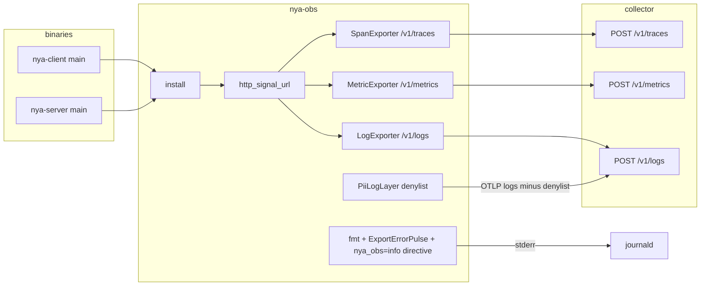

# Production OTEL path bug + overlay/ops hardening

| Field | Value |
| --- | --- |
| **Author** | nya-link-aggregation maintainers |
| **Date** | 2026-08-29 |
| **Status** | Draft |
| **Audience** | Senior engineers working in `crates/nya-obs`, `crates/nya-core` (`export.rs`, `cfg.rs`), `crates/nya-server`, docs |
| **Incident** | Journals in `nya-link-aggregation-logs-20260828T1650Z.tar.gz`; production binary `main` `451ea39` with OTEL |
| **Compatibility** | No new TOML keys. `[obs]` / `[obs.otel]` remain `#[serde(deny_unknown_fields)]`. Default OTEL stays off. HTTP gzip default stays true. Auth stays `[obs.otel.headers]`. Parent `[obs.otel].endpoint` may now be empty if every **enabled** signal has its own `endpoint` (today `install()` bails on empty parent before per-signal is considered). Snapshot `metrics=` blob leaves the default info line (breaking for anyone grepping that field in journald). Query/fragment on a HTTP **base** URL becomes an `install()` error. e2e still does not enable OTEL. |

---

## Overview

Production ran `[obs.otel]` against `https://otlp.srv.akalyn.cn` for ~10 h and received **zero** telemetry. `opentelemetry-otlp` 0.31 treats programmatic `with_endpoint` as a **full signal URL** and does not append `/v1/traces|metrics|logs`. `nya-obs` currently passes the TOML/env parent base through `apply_http` → `with_endpoint`, so every BatchLog/BatchSpan POST hits `https://otlp.srv.akalyn.cn/` and the gateway returns 404 (TLS and Basic auth succeeded). Docs claim the opposite. The same code path also breaks env-only `OTEL_EXPORTER_OTLP_ENDPOINT` because we resolve the env var ourselves and then call `with_endpoint`.

While OTLP was dead, three log-volume bugs were already on the hot path: the 10 s `nya_core::obs` snapshot dumps a 6–7 KiB Prometheus blob to stderr (and would flood Loki once the URL is fixed); SDK `ExportError` is ERROR every 5–10 s and is eligible for re-queue as OTLP logs; the public server `listen = 0.0.0.0:24443` emits thousands of TLS-accept WARNs and control-plane spans for scanners. Overlay soak quality is comparable to the previous non-OTEL binary; down-floor / ping-interval **do not** change in this work.

This design: (1) join HTTP parent/env bases onto `/v1/{signal}` in `nya-obs` before `with_endpoint`, without double-appending per-signal URLs and without touching gRPC; (2) shrink the default snapshot and keep it off OTLP logs; (3) rate-limit SDK export errors to stderr (keeping status/`error` text) and exclude the SDK from `PiiLogLayer`; (4) skip OTEL spans for failed TLS accept, rate-limit TLS-accept **warn**, and treat only non-overlay codec errors as handshake noise. One PR, three stacked commits.

---

## Key Decisions

1. **HTTP URL join lives in `nya-obs`, not the SDK.** `opentelemetry-otlp` 0.31 `resolve_http_endpoint` only appends `/v1/{signal}` when the builder endpoint is empty and `OTEL_EXPORTER_OTLP_ENDPOINT` is read **inside the crate**. We always call `with_endpoint`, so we must produce the full signal URL ourselves for TOML parent, TOML per-signal, **and** env base. We will not skip `with_endpoint` to “let the SDK append.”

2. **Parent/env = base; per-signal = base-or-full.** Parent and `OTEL_EXPORTER_OTLP_ENDPOINT` always receive `/v1/{signal}` (after stripping a trailing `/v1/traces|metrics|logs` so a mis-copied signal URL does not become `/v1/traces/v1/metrics`). A per-signal TOML endpoint that already ends with **any** `/v1/{traces|metrics|logs}` is used as-is. gRPC never gets HTTP paths. Query/fragment is allowed only on a full `/v1/{signal}` URL; a base with `?`/`#` is an `install()` error (tokens belong in `[obs.otel.headers]`, not the URL). Parent may be empty when every enabled signal has its own endpoint.

3. **Default 10 s snapshot stays on, but the `metrics=` blob leaves info.** Keep `paths=` / `links=` / `streams=` plus a short numeric scorecard. Full `format_snapshot_metrics` dump moves to `debug`. OTLP logs **do not** ingest `target=nya_core::obs` (otherwise Loki inherits the blob after the URL fix). `/metrics` and OTLP metrics remain the catalog.

4. **SDK export errors: first ERROR immediately, then one pulse per 60 s with `suppressed=N`.** `target=nya_obs`. Pulse copies `event.metadata().name()` (`BatchLogProcessor.ExportError` vs `BatchSpanProcessor.ExportError`) and a short `error`/`status` display (query strings stripped). Matcher uses the same three crate prefixes as `fmt_filter` (`opentelemetry`, `opentelemetry_sdk`, `opentelemetry_otlp`). fmt turns those crates **off** unless `RUST_LOG` names them; `nya_obs=info` is **`add_directive` even when `RUST_LOG` is set**, unless `RUST_LOG` already names `nya_obs`. `PiiLogLayer` excludes the SDK crates and `nya_obs` so a 404 cannot re-queue itself. The pulse covers span/log Batch* processors only — **not** metrics `PeriodicReader` (`otel_debug!`).

5. **Failed TLS accept: no `nya.link.accept` span; log stays `warn`, rate-limited at a process-global pulse** (`static OnceLock<Mutex<TlsPulseState>>` in `nya-server`, never local to `serve_one`). First event + 1/60 s with `suppressed` and last `peer`/`error`. **Emit immediately and reset `last_emit` when `error` Display differs from the last emitted error** so a cert/config failure is not stuck behind a scanner’s 60 s bucket (compare error text only, not `peer`). Overlay handshake failures (`Rejected`, `UnknownSession`) stay `warn` with an ERROR **marker** span (`tls_ms`/`hs_ms`; Tempo duration is not I/O time). Handshake **noise** is `Unexpected` plus non-overlay codec errors (`BadLength`, `UnknownType`, `Truncated`, `Invalid`) — `debug`, counted, no span. `HandshakeError::Proto(Io)` / `Proto(Version)` stay `warn` (real RST/EOF mid-handshake is not a scanner).

6. **`Tuning::STANDARD` and example ping intervals are out of scope.** `down_min_silence=320ms` is the documented floor against 80–250 ms delay spikes (`tuning.rs`, `health.rs` tests). Soak 0.023 % curl-28 matches the previous binary; the session never went all-down. Idle `bytes_ctrl_tx` growth is the operator ping budget already shipped in `examples/client.toml`. Changing either is a protocol/tuning change with its own matrix, not this incident fix.

---

## Background & Motivation

### Production evidence (2026-08-28/29)

TOML (client and server):

```toml
[obs]
instance_name = "test-gz-hkix-260828"
[obs.otel]
enabled = true
endpoint = "https://otlp.srv.akalyn.cn"
protocol = "http/protobuf"
[obs.otel.headers]
Authorization = "Basic …"
```

Startup: `nya_obs: otel enabled … traces=true metrics=true logs=true`. Then ~10 h of:

```
BatchLogProcessor.ExportError  Status(404) url="https://otlp.srv.akalyn.cn/"
BatchSpanProcessor.ExportError Status(404) url="https://otlp.srv.akalyn.cn/"
```

| Process | log 404 | span 404 | metric ExportError in journal |
| --- | ---: | ---: | --- |
| client | 3737 | 390 | 0 |
| server | 3777 | 3893 | 0 |

404 (not 401) means TLS and Basic reached the gateway. Zero metric export ERRORs because `PeriodicReader` logs through `otel_debug`, not tracing ERROR — metrics were almost certainly POSTing to `/` as well and failing silently.

Shared `instance_name` across client and server collides `service.instance.id` (Resource uses that string in `crates/nya-obs/src/resource.rs`). `service.name` still differs (`nya-client` / `nya-server`).

### Root cause (verified in SDK 0.31.1)

`crates/nya-obs/src/lib.rs` `apply_http`:

```372:388:crates/nya-obs/src/lib.rs
fn apply_http<B: opentelemetry_otlp::WithExportConfig + opentelemetry_otlp::WithHttpConfig>(
    builder: B,
    endpoint: &str,
    gzip: bool,
    headers: &std::collections::HashMap<String, String>,
    timeout: Duration,
) -> B {
    let mut b = builder
        .with_endpoint(endpoint)
        .with_timeout(timeout)
        .with_protocol(opentelemetry_otlp::Protocol::HttpBinary)
        .with_headers(headers.clone());
    // ...
}
```

`resolve_endpoint` returns the parent base (`https://otlp.srv.akalyn.cn`) or env, and `build_tracer` / `build_meter` / `build_logger` pass that string in.

SDK `resolve_http_endpoint` (`opentelemetry-otlp-0.31.1` `src/exporter/http/mod.rs`):

- If `provided_endpoint` is non-empty → **parse as-is, do not append**.
- Else if `OTEL_EXPORTER_OTLP_{TRACES,METRICS,LOGS}_ENDPOINT` is set → as-is.
- Else if `OTEL_EXPORTER_OTLP_ENDPOINT` is set → `build_endpoint_uri(env, "/v1/{signal}")`.
- Else default `http://localhost:4318/v1/{signal}`.

`test_http_exporter_endpoint` asserts: builder endpoint `http://localhost:4318/v1/tracesbutnotreally` is used verbatim. `docs/OBSERVABILITY.md` line 1109 (`HTTP 路径由 SDK 追加 /v1/metrics /v1/logs /v1/traces`) is wrong for our call pattern. README only calls `endpoint` an “OTLP 基址” and does **not** mention SDK append; the PR still makes README explicit that **nya-obs** joins `/v1/{signal}` for HTTP.

We also resolve `OTEL_EXPORTER_OTLP_ENDPOINT` in `resolve_endpoint` and then `with_endpoint`, so **env-only base URLs are broken the same way**.

### Snapshot / export-error / scanner (same journals)

- Default `snapshot_interval_ms=10000` (`ObsOpts::snapshot_interval` in `cfg.rs`). `emit_snapshot` (`export.rs`) attaches `metrics = %format_snapshot_metrics(ps)` — the full catalog, ~6–7 KiB. Client journal ~26 MiB / 10 h. After the URL fix, `PiiLogLayer` (`subscribe.rs`) uses `EnvFilter::new(level)` with **no target denylist**, so those snapshots become OTLP logs. Docs already say “全量 tracing 事件”.
- `fmt_filter` sets `opentelemetry_sdk=warn` unless `RUST_LOG` names the crate. ExportError is **ERROR**, so it still prints every 5–10 s. Same events match `PiiLogLayer` at info+.
- Server `listen = 0.0.0.0:24443`. 3719 `WARN nya_server: connection closed peer=… error=tls accept` from `45.207.156.126` (~10 s). Some complete TLS and send HTTP (`frame length 1195725856` = ASCII `GET ` → `nya_proto::ProtoError::BadLength`). `serve_one` wraps TLS accept in `nya.link.accept` and the handshake in `nya.handshake` **before** knowing the peer is overlay. That is why server span 404s (3893) ≫ client (390). Overlay handshake failures log at `error!`.

### Overlay soak (do not over-scope)

204 soak 30 min, 34572 samples, 8 curl-28 (0.023 %), comparable to the previous binary without OTEL. Session never all-down. Under load: 40 `path_down` / 130 `path_degraded` / 1678 `probe_miss`. `path silent, marking down` at `ago≈330ms down=330ms` is exactly `down_min_silence=320ms + probe≈10ms` on 7 ms RTT paths (`Tuning::down_timeout` in `tuning.rs`). Failures cluster with tear/redial. Idle 10 h: `bytes_ctrl_tx` 19 MB → 256 MB with ping 10–50 ms (operator TOML; `examples/client.toml` ships those values). soy TLS connect timeout and akcdn#1 `class_rtt` stuck ~14 ms vs 7 ms peers are separate path issues.

Health formulas are **not** operator-tunable (`docs/ARCHITECTURE.md`, `SessionOpts` four keys only, leftover algorithm keys are parse errors in `cfg.rs` tests).

---

## Goals & Non-Goals

### Goals

- HTTP OTLP from TOML parent, TOML per-signal, and env base posts to `/v1/traces`, `/v1/metrics`, `/v1/logs` with no double-append.
- gRPC endpoints unchanged (no HTTP paths).
- Default stderr snapshot is a compact scorecard (~1 KiB), not a Prometheus dump. OTLP logs do not ingest snapshots.
- SDK span/log export failures cannot feedback into OTLP logs; a persistent collector outage still produces a 60 s ERROR pulse on stderr **with processor name + status/error**. Metrics export health is **not** that pulse (PeriodicReader stays `otel_debug!`).
- Public-server scanner TLS does not create control-plane spans or unbounded WARN/ERROR journal spam; a broken TLS stack still produces a rate-limited `warn`; real overlay handshake I/O and auth failures remain visible.
- Docs match the code (endpoint join, instance names, snapshot fields, log targets).
- Unit tests for URI join and handshake noise classification. e2e stays OTEL-off.

### Non-Goals

- No new TOML keys, no username/password keys, no change to gzip default, no `OTEL_EXPORTER_OTLP_{TRACES,METRICS,LOGS}_ENDPOINT` support (docs already: remaining `OTEL_*` unread).
- No OTel SDK in `nya-core`.
- No change to `Tuning::STANDARD` (`down_min_silence`, loss/failback). No change to example ping 10/50 ms.
- No allowlist of OTLP log targets beyond a small denylist (snapshots, SDK, `nya_otel` spans, `nya_obs` exporter pulse).
- No e2e collector; no live HTTP export test that calls `install()` (process-global subscriber).
- No PeriodicReader wrapper to promote metrics export failures to tracing ERROR (would be a later SDK-reader change).
- No `nya_tls_accept_fail_total` catalog counter (Open Questions).
- No fix for soy TLS timeout / akcdn class_rtt in this PR.

---

## Proposed Design

### Architecture (after)



SDK stays in `nya-obs` + binary `main.rs` only (`nya_obs::install` already).

### 1. HTTP endpoint normalization

Add in `crates/nya-obs/src/lib.rs` (or a new `endpoint.rs` module if `lib.rs` grows past comfort; prefer `lib.rs` next to `resolve_endpoint` unless the file splits naturally):

```rust
const SIGNAL_PATHS: [&str; 3] = ["/v1/traces", "/v1/metrics", "/v1/logs"];

#[derive(Clone, Copy, Debug, PartialEq, Eq)]
enum EndpointKind {
    /// Parent `[obs.otel].endpoint` or `OTEL_EXPORTER_OTLP_ENDPOINT`.
    Base,
    /// `[obs.otel.{traces,metrics,logs}].endpoint`.
    Signal,
}

fn resolve_endpoint_kind(otel: &OtelOpts, sig: Option<&OtelSignalOpts>) -> (String, EndpointKind) {
    if let Some(sig) = sig {
        if let Some(e) = sig.endpoint.as_deref().map(str::trim).filter(|s| !s.is_empty()) {
            return (e.to_string(), EndpointKind::Signal);
        }
    }
    if let Some(e) = otel.endpoint.as_deref().map(str::trim).filter(|s| !s.is_empty()) {
        return (e.to_string(), EndpointKind::Base);
    }
    let env = std::env::var("OTEL_EXPORTER_OTLP_ENDPOINT")
        .ok()
        .map(|s| s.trim().to_string())
        .filter(|s| !s.is_empty())
        .unwrap_or_default();
    (env, EndpointKind::Base)
}

/// Full URL passed to `with_endpoint` for one HTTP signal.
fn http_signal_url(raw: &str, signal: &'static str, kind: EndpointKind) -> Result<String> {
    let raw = raw.trim();
    if raw.is_empty() {
        bail!("empty OTLP endpoint");
    }
    if !(raw.starts_with("http://") || raw.starts_with("https://")) {
        bail!("OTLP HTTP endpoint must start with http:// or https://");
    }
    let (base, query) = split_query_fragment(raw);
    let want = match signal {
        "traces" | "metrics" | "logs" => format!("/v1/{signal}"),
        _ => bail!("unknown OTLP signal {signal}"),
    };
    let trimmed = base.trim_end_matches('/');
    if let Some(existing) = known_signal_suffix(trimmed) {
        match kind {
            EndpointKind::Signal => {
                // Operator gave a full signal URL. Do not rewrite, even if
                // it is a different signal (their override).
                return Ok(format!("{trimmed}{query}"));
            }
            EndpointKind::Base => {
                // Parent/env was a copied `/v1/traces` URL. Strip, then
                // append the requested signal so metrics/logs still work.
                let stripped = trimmed
                    .strip_suffix(existing)
                    .unwrap_or(trimmed)
                    .trim_end_matches('/');
                return Ok(join_slash(stripped, &want) + query);
            }
        }
    }
    if !query.is_empty() {
        bail!("query/fragment only allowed on a full /v1/{{signal}} HTTP URL");
    }
    Ok(join_slash(base, &want))
}

fn known_signal_suffix(url: &str) -> Option<&'static str> {
    SIGNAL_PATHS.iter().copied().find(|p| url.ends_with(p))
}

fn join_slash(base: &str, path: &str) -> String {
    // Match SDK `build_endpoint_uri`: one slash between host and path.
    if base.ends_with('/') && path.starts_with('/') {
        format!("{base}{}", &path[1..])
    } else if !base.ends_with('/') && !path.starts_with('/') {
        format!("{base}/{path}")
    } else {
        format!("{base}{path}")
    }
}

fn split_query_fragment(s: &str) -> (&str, &str) {
    match s.find(['?', '#']) {
        Some(i) => (&s[..i], &s[i..]),
        None => (s, ""),
    }
}

fn exporter_url(
    otel: &OtelOpts,
    sig: &OtelSignalOpts,
    protocol: OtelProtocol,
    signal: &'static str,
) -> Result<String> {
    let (raw, kind) = resolve_endpoint_kind(otel, Some(sig));
    if raw.is_empty() {
        bail!(
            "obs.otel.endpoint, obs.otel.{signal}.endpoint, or OTEL_EXPORTER_OTLP_ENDPOINT required when this signal is enabled"
        );
    }
    match protocol {
        OtelProtocol::HttpProtobuf => http_signal_url(&raw, signal, kind),
        OtelProtocol::Grpc => Ok(raw.trim().to_string()),
    }
}
```

Keep `resolve_endpoint` as a thin wrapper over `resolve_endpoint_kind(...).0` if other call sites want the raw string for the startup log.

**Call sites**

- `install`: **delete** the current parent-empty check (`resolve_endpoint(&obs.otel, None)` then `bail!` if empty, `lib.rs` 76–79). That check currently makes per-signal-only TOML unstartable. After protocol is known, for each **enabled** signal call `exporter_url(...)` and fail install only if that signal still has an empty/invalid URL.
- `build_tracer` / `build_meter` / `build_logger`: pass the **already joined** HTTP URL into `apply_http`. gRPC branch keeps the raw base (no `/v1/...`).
- Startup `info!` (`target` is `nya_obs` today). `tracing` does **not** omit `Option`; use `"-"` when a signal is off or the parent is empty:

```rust
info!(
    instance_name = %instance,
    endpoint = raw_parent.as_str().unwrap_or("-"),
    traces_endpoint = traces_url.as_deref().unwrap_or("-"),
    metrics_endpoint = metrics_url.as_deref().unwrap_or("-"),
    logs_endpoint = logs_url.as_deref().unwrap_or("-"),
    protocol = ?protocol,
    traces = traces_on,
    metrics = metrics_on,
    logs = logs_on,
    "otel enabled"
);
```

Never log header values. Query/fragment is **not** a place for tokens: document next to “no `username`/`password` keys” that `?`/`#` is allowed only on a full `/v1/{signal}` URL; Basic/Bearer stay in `[obs.otel.headers]`.

**Worked examples (these are the unit tests)**

| Input | kind | signal | Output |
| --- | --- | --- | --- |
| `https://otlp.srv.akalyn.cn` | Base | traces | `https://otlp.srv.akalyn.cn/v1/traces` |
| `https://otlp.srv.akalyn.cn/` | Base | logs | `https://otlp.srv.akalyn.cn/v1/logs` |
| `http://127.0.0.1:4318` | Base | metrics | `http://127.0.0.1:4318/v1/metrics` |
| `https://host:4318/v1/traces` | Base | traces | `https://host:4318/v1/traces` |
| `https://host:4318/v1/traces` | Base | metrics | `https://host:4318/v1/metrics` (strip then append) |
| `https://host:4318/v1/traces/` | Base | traces | `https://host:4318/v1/traces` |
| `https://host:4318/otlp` | Base | traces | `https://host:4318/otlp/v1/traces` |
| `https://host:4318/v1/traces` | Signal | traces | `https://host:4318/v1/traces` (no double) |
| `https://host:4318` | Signal | traces | `https://host:4318/v1/traces` |
| `https://host:4318/v1/metrics` | Signal | traces | `https://host:4318/v1/metrics` (as-is) |
| `https://host:4318/v1/traces?foo=1` | Signal | traces | `https://host:4318/v1/traces?foo=1` |
| `https://host:4318?foo=1` | Base | traces | **error** (query without signal path) |
| `https://host:4318?foo=1` | Signal | traces | **error** (same: query only on a full `/v1/{signal}` URL) |
| `otlp.srv.akalyn.cn` | Base | traces | **error** (no scheme) |
| `https://host:4317` | gRPC (`exporter_url`) | traces | `https://host:4317` (unchanged) |
| parent empty + `[obs.otel.traces].endpoint = "http://127.0.0.1:4318/v1/traces"` | Signal | traces | `http://127.0.0.1:4318/v1/traces` (`install` must not bail on empty parent) |

Priority (unchanged): per-signal TOML → parent TOML → `OTEL_EXPORTER_OTLP_ENDPOINT`. Empty after all three still fails install when that signal is on.

**Env-only (the footgun we currently have)**

TOML `endpoint` empty, `OTEL_EXPORTER_OTLP_ENDPOINT=https://otlp.srv.akalyn.cn`:

1. `resolve_endpoint_kind` → `(url, Base)`.
2. `http_signal_url` → `https://otlp.srv.akalyn.cn/v1/{signal}`.
3. `with_endpoint` that full URL.

We do **not** leave the builder endpoint empty so the SDK can append. That would also pick up unread per-signal env vars and the SDK default `localhost:4318` in surprising ways. Join in our code; always `with_endpoint` for HTTP.

### 2. Snapshot volume + OTLP log denylist

**`emit_snapshot` in `crates/nya-core/src/export.rs`**

Info line **drops** `metrics = %format_snapshot_metrics(ps)`. Keep the compact tables and promote the scorecard counters operators actually grep after a soak:

```rust
fn emit_snapshot(ps: &ProcessSnapshot) {
    let s = &ps.session;
    let (stall_p99, failover_p99) = snapshot_p99(ps);
    info!(
        target: "nya_core::obs",
        stall_p99_ms = stall_p99,
        failover_p99_ms = failover_p99,
        stall_count = s.stall_ms.count,
        failover_count = s.failover_ms.count,
        paths_alive = s.paths.len() as u64,
        streams_live = s.streams_live,
        streams_closed = s.streams_closed,
        stream_resets = s.stream_resets,
        path_down = s.path_down,
        path_degraded = s.path_degraded,
        probe_miss = s.probe_miss,
        failbacks = s.failbacks,
        session_all_down_resets = s.session_all_down_resets,
        bytes_data_tx = s.bytes_data_tx,
        bytes_ctrl_tx = s.bytes_ctrl_tx,
        paths = %format_paths(&s.paths),
        links = %format_links(&s.links),
        streams = %format_streams(&s.streams, s.streams_live),
        "snapshot"
    );
    debug!(
        target: "nya_core::obs",
        metrics = %format_snapshot_metrics(ps),
        "snapshot metrics"
    );
}
```

- Default interval stays 10 s (`None` → 10_000 ms). `Some(0)` still disables.
- `format_snapshot_metrics` stays; catalog tests in `export.rs` still call it.
- Expected info line: hundreds of bytes to ~1–2 KiB (path/link/stream tables), not 6–7 KiB. 10 h client journal on the order of a few MiB instead of ~26 MiB.
- Breaking: anyone scraping `metrics=nya_path_added_total=` from journald must switch to `/metrics` or OTLP metrics. Document that.

**OTLP logs still ingest other info events** (`dialing`, `path up`, `session created`, overlay `path silent, marking down`, …). They do **not** ingest snapshots.

**`PiiLogLayer` filter** (`crates/nya-obs/src/subscribe.rs`)

Replace `EnvFilter::new(level.as_str().to_lowercase())` with:

```rust
fn otel_log_filter(level: tracing::Level) -> EnvFilter {
    let spec = format!(
        "{level},nya_core::obs=off,nya_otel=off,nya_obs=off,\
         opentelemetry=off,opentelemetry_sdk=off,opentelemetry_otlp=off,\
         hyper=off,reqwest=off,tonic=off",
        level = level.as_str().to_lowercase()
    );
    spec.parse().expect("static otel log filter")
}
```

`on_event` already returns early on `target == "nya_otel"`; keep that. DenyList field names (`psk`, `proof`, `exporter`, `session`) unchanged.

`logs.level = debug` will still ship overlay debug decisions to Loki; that is the existing contract. It will **not** ship snapshots or SDK export errors.

### 3. Rate-limit SDK export errors

**fmt default filter** (`fmt_filter` in `subscribe.rs`)

Today (`subscribe.rs` 67–94):

```
EnvFilter::try_from_default_env().unwrap_or_else(|_| "{crate}=info,nya_core=info")
```

plus `opentelemetry=warn`, `opentelemetry_sdk=warn`, `opentelemetry_otlp=warn`, `tonic=warn`, `hyper=warn`, `reqwest=warn` unless `rust_log_has_target` is true.

Change: split so tests never `set_var("RUST_LOG")` (process-global, races `install()` tests):

```rust
fn fmt_filter(role: &str) -> EnvFilter {
    fmt_filter_from(role, std::env::var("RUST_LOG").ok().as_deref())
}

fn fmt_filter_from(role: &str, rust_log: Option<&str>) -> EnvFilter {
    let crate_name = match role {
        "server" => "nya_server",
        _ => "nya_client",
    };
    let rust_log = rust_log.unwrap_or("").trim();
    let mut filter = if rust_log.is_empty() {
        format!("{crate_name}=info,nya_core=info,nya_obs=info")
            .parse()
            .expect("static filter")
    } else {
        EnvFilter::try_new(rust_log).unwrap_or_else(|_| {
            format!("{crate_name}=info,nya_core=info,nya_obs=info")
                .parse()
                .expect("static filter")
        })
    };
    for target in [
        "opentelemetry",
        "opentelemetry_sdk",
        "opentelemetry_otlp",
        "tonic",
        "hyper",
        "reqwest",
    ] {
        if rust_log_has_target(rust_log, target) {
            continue;
        }
        if let Ok(d) = format!("{target}=off").parse() {
            filter = filter.add_directive(d);
        }
    }
    if !rust_log_has_target(rust_log, "nya_obs") {
        if let Ok(d) = "nya_obs=info".parse() {
            filter = filter.add_directive(d);
        }
    }
    filter
}
```

- Fallback (empty `rust_log`): `{crate_name}=info,nya_core=info,nya_obs=info`.
- **Also** `add_directive("nya_obs=info")` unless `rust_log_has_target(..., "nya_obs")`. Putting `nya_obs` only in the fallback is not enough: unit/systemd `RUST_LOG=nya_server=info,nya_core=info` makes `try_from_default_env` succeed, EnvFilter’s unmatched default is ERROR, and the `otel enabled` startup line (joined URLs — verification step 1) would vanish. Documented default in `docs/OBSERVABILITY.md` and README becomes `nya_client|nya_server=info,nya_core=info,nya_obs=info`. Operators can still set `RUST_LOG=nya_obs=warn` (has-target skip).
- SDK/http crates: `=off` instead of `=warn` when `RUST_LOG` does not name them. ERROR is a subset of warn, which is why ExportError floods today.

Operators who want every SDK line set `RUST_LOG=opentelemetry_sdk=error` (existing `rust_log_has_target` skip). The pulse still fires; they get both.

**`ExportErrorPulse` layer** (same file)

```rust
const EXPORT_ERROR_PULSE: Duration = Duration::from_secs(60);

fn is_otel_sdk_target(t: &str) -> bool {
    const PREFIXES: [&str; 3] = ["opentelemetry", "opentelemetry_sdk", "opentelemetry_otlp"];
    PREFIXES.iter().any(|p| t == *p || t.starts_with(&format!("{p}::")))
}

struct ExportErrorPulse { /* Mutex<PulseState> */ }

struct PulseState {
    last_emit: Option<Instant>,
    suppressed: u64,
}

fn pulse_should_emit(st: &mut PulseState, now: Instant, every: Duration) -> Option<u64> {
    match st.last_emit {
        None => {
            st.last_emit = Some(now);
            st.suppressed = 0;
            Some(0)
        }
        Some(prev) if now.duration_since(prev) >= every => {
            let n = st.suppressed;
            st.last_emit = Some(now);
            st.suppressed = 0;
            Some(n)
        }
        Some(_) => {
            st.suppressed += 1;
            None
        }
    }
}

fn strip_url_query(s: &str) -> String {
    // Drop `?…` up to the next `"` or whitespace so a vendor token in a URL
    // does not land in journald. Status(404) url="https://host/v1/logs" is kept.
    let mut out = String::with_capacity(s.len());
    let mut chars = s.chars().peekable();
    while let Some(c) = chars.next() {
        if c == '?' {
            while matches!(chars.peek(), Some(ch) if *ch != '"' && !ch.is_whitespace()) {
                chars.next();
            }
            continue;
        }
        out.push(c);
    }
    out
}
```

`Layer::on_event`: if `is_otel_sdk_target(event.metadata().target())` **and** level is ERROR:

1. Visit the event; take `error`, `status`, or `message` (SDK 0.31 `BatchLogProcessor.ExportError` / `BatchSpanProcessor.ExportError` set `error = format!("{}", err)`, whose Display is `Status(404) url="…"`).
2. `error = strip_url_query(...)`, truncate to 256 chars. If the text contains `Status(N)`, also record `status = N` as `u16`.
3. `let n = { let mut g = self.state.lock()…; pulse_should_emit(...) };` — **drop the guard before** `tracing::error!` (re-entrant deadlock: the new event is `nya_obs`, which the matcher skips, but the mutex must not be held).
4. On `Some(n)` emit:

```rust
tracing::error!(
    target: "nya_obs",
    sdk_target = event.metadata().target(),
    sdk_name = event.metadata().name(),
    status = status,             // Option<u16>, use `.unwrap_or(0)` or skip field if None
    error = error.as_deref().unwrap_or("-"),
    suppressed = n,
    "otlp export error"
);
```

`otel_error!` (`opentelemetry-0.31.0` `internal_logging.rs`) is `#[macro_export]` with `target: env!("CARGO_PKG_NAME")`. Expanded at the call site that is almost certainly `opentelemetry_sdk` for `Batch*Processor.ExportError`, but the API crate name `opentelemetry` is already in `fmt_filter`. Matching all three prefixes is the silence-safety net: if the matcher misses, fmt is `off` and `PiiLogLayer` is `off` — export errors become **total silence**.

Do **not** copy arbitrary event fields (avoid query tokens). Do copy `name` + `error`/`status` so a remaining 404 vs 401 vs timeout, and logs vs traces, is visible on the pulse. Production auth is headers; this incident’s URLs have no query.

First failure: `suppressed=0` immediately. Collector down for 10 h: ~600 raw errors → **1 + 599/60 ≈ 11** stderr lines. **Do not auto-reset `last_emit` on quiet.**

`init_otel` registry: `.with(pulse_layer)` **without** a filter that drops SDK events before the pulse (the pulse is the consumer). fmt layer has SDK `=off`, so raw ExportError does not print. `PiiLogLayer` has SDK/`nya_obs` off, so the pulse does not re-enter OTLP.

`init_fmt_only` (OTEL disabled): no pulse, no SDK noise (SDK not installed).

**Metrics are not this pulse.** `opentelemetry_sdk` 0.31 `PeriodicReader` logs collect/export with `otel_debug!` (`periodic_reader.rs` timer path ~281–291). `otel_error!` there is only `PeriodReaderThreadStartError`. After this PR, no `otlp export error` line does **not** mean metrics are reaching `/v1/metrics`. Metrics health = Prometheus/OTLP series appearing (or a later reader-wrapper). Do not page “OTLP is healthy” from a quiet pulse alone.

### 4. Public server accept / handshake noise

**`crates/nya-server/src/lib.rs` `serve_one`**

Today TLS accept is `.instrument(nya.link.accept)` and handshake is `.instrument(nya.handshake)` before the result is known; TLS failure uses `?` → outer `warn!(..., "connection closed")`. Span **duration** is real I/O time. After this change, accept/handshake spans are **markers** (same pattern as `nya.path.up`): Tempo `duration` is microseconds; query `tls_ms` / `hs_ms`. Do **not** enter the handshake span across `add_path.await` (today `drop(hs_span)` before `add_path`; keep that). Keep the second `table.is_closed()` check after TLS (present today).

**TLS accept: skip span (correct); do not demote to `debug`.** A dead cert/config/accept loop would otherwise be silent at default `nya_server=info`.

**Process-global pulse state — not local to `serve_one`.** `run_on_table` `tokio::spawn`s one task per TCP (`lib.rs` 98–101). `ExportErrorPulse` is process-global because it is a single subscriber `Layer`. A `Mutex<TlsPulseState>` constructed (or defaulted) inside `serve_one` gives every scanner `suppressed=0` and restores the 3719 WARNs. Specify:

```rust
// nya-server/src/lib.rs — process-wide. Never construct inside serve_one.
static TLS_ACCEPT_PULSE: OnceLock<Mutex<TlsPulseState>> = OnceLock::new();

#[derive(Default)]
struct TlsPulseState {
    last_emit: Option<Instant>,
    last_error: String, // Display of last *emitted* error (not peer)
    last_peer: String,
    suppressed: u64,
}

fn tls_accept_warn(peer: std::net::SocketAddr, err: &impl std::fmt::Display) {
    let slot = TLS_ACCEPT_PULSE.get_or_init(|| Mutex::new(TlsPulseState::default()));
    let msg = err.to_string();
    let n = {
        let mut g = slot.lock().unwrap_or_else(|e| e.into_inner());
        let out = tls_pulse_should_emit(&mut g, Instant::now(), Duration::from_secs(60), &msg);
        if out.is_some() {
            g.last_peer = peer.to_string();
        }
        out
    }; // drop guard before tracing::warn
    if let Some(n) = n {
        tracing::warn!(%peer, error = %msg, suppressed = n, "tls accept");
    }
}
```

Rate-limit at the **emit site**, not a tracing Layer, so OTLP (`logs.level=info` ingests `nya_server=warn`) also sees ≤1/min of the same error class. Duplicate the helper in `nya-server` (do not pull SDK types into nya-core); comment “same 60 s cap as `nya-obs` `ExportErrorPulse`, plus class-change”. `Arc<TlsAcceptPulse>` from `run_on_table` into `serve_one` is also valid; `OnceLock` is the default spec (one listener, no extra args). Tests call `tls_pulse_should_emit` on a local `TlsPulseState`, not the static.

**Class-change: emit immediately.** A scanned `0.0.0.0:24443` already has a 60 s window. A cert/config failure whose Display differs from the last **emitted** error must not wait for the heartbeat. Compare **error text only**, not `peer` (scanners rotate IPs).

```rust
fn tls_pulse_should_emit(
    st: &mut TlsPulseState,
    now: Instant,
    every: Duration,
    error: &str,
) -> Option<u64> {
    match st.last_emit {
        None => {
            st.last_emit = Some(now);
            st.last_error = error.to_string();
            st.suppressed = 0;
            Some(0)
        }
        Some(_) if error != st.last_error => {
            // New failure class (scanner EOF → expired cert). Reset window.
            let n = st.suppressed;
            st.last_emit = Some(now);
            st.last_error = error.to_string();
            st.suppressed = 0;
            Some(n)
        }
        Some(prev) if now.duration_since(prev) >= every => {
            let n = st.suppressed;
            st.last_emit = Some(now);
            st.last_error = error.to_string();
            st.suppressed = 0;
            Some(n)
        }
        Some(_) => {
            st.suppressed += 1;
            None
        }
    }
}
```

Residual: two rustls failures that stringify identically (rare) still share the bucket. Different scanner error strings (EOF vs invalid header) each get one immediate WARN — acceptable, still not 3719/10 h.

```rust
fn handshake_is_noise(e: &HandshakeError) -> bool {
    use nya_proto::ProtoError;
    match e {
        HandshakeError::Unexpected => true,
        HandshakeError::Proto(
            ProtoError::BadLength(_)
            | ProtoError::UnknownType(_)
            | ProtoError::Truncated
            | ProtoError::Invalid(_),
        ) => true,
        HandshakeError::Proto(ProtoError::Io(_) | ProtoError::Version(_)) => false,
        HandshakeError::Rejected(_) | HandshakeError::UnknownSession => false,
    }
}

async fn serve_one(...) -> Result<()> {
    tcp.set_nodelay(true)?;
    if table.is_closed() {
        return Ok(());
    }
    let t0 = std::time::Instant::now();
    let mut tls = match acceptor.accept(tcp).await {
        Ok(t) => t,
        Err(e) => {
            tls_accept_warn(peer, &e); // process-global pulse; no span
            return Ok(());
        }
    };
    if table.is_closed() {
        return Ok(());
    }
    {
        let _s = tracing::info_span!(
            target: "nya_otel",
            "nya.link.accept",
            otel.kind = "server",
            peer = %peer,
            tls_ms = t0.elapsed().as_millis() as u64,
        )
        .entered();
    }
    let exporter = export_from_server(&tls).map_err(|e| anyhow::anyhow!("exporter: {e}"))?;
    let hs_t0 = std::time::Instant::now();
    let result = server_accept_handshake(&mut tls, &psk, &exporter, &table).await;
    match result {
        Ok(HandshakeResult::Created { session, incoming, path_name, session_id }) => {
            {
                let _g = tracing::info_span!(
                    target: "nya_otel",
                    "nya.handshake",
                    otel.kind = "server",
                    peer = %peer,
                    nya.kind = "create",
                    hs_ms = hs_t0.elapsed().as_millis() as u64,
                )
                .entered();
                session.process().handshake_create_ok.fetch_add(1, Relaxed);
                info!(%peer, session = %hex_encode(&session_id), "session created");
            } // drop marker span *before* add_path
            if table.is_closed() {
                session.shutdown();
                return Ok(());
            }
            tokio::spawn(handle_incoming(incoming));
            { let _up = tracing::info_span!(target: "nya_otel", "nya.path.up", nya.path_name = %path_name).entered(); }
            session.add_path(path_name, tls).await;
        }
        Ok(HandshakeResult::Joined { session, path_name }) => { /* same: marker span, drop, then add_path */ }
        Err(e) if handshake_is_noise(&e) => {
            table.process().inc_handshake_fail(&e);
            tracing::debug!(%peer, error = %e, "handshake discarded");
        }
        Err(e) => {
            table.process().inc_handshake_fail(&e);
            let _g = tracing::info_span!(
                target: "nya_otel",
                "nya.handshake",
                otel.kind = "server",
                peer = %peer,
                otel.status_code = "ERROR",
                hs_ms = hs_t0.elapsed().as_millis() as u64,
            )
            .entered();
            tracing::warn!(%peer, error = %e, "handshake failed");
        }
    }
    Ok(())
}
```

First TLS failure: `suppressed=0`. Scanner at ~10 s with the same rustls Display: one WARN/min (`suppressed` growing). A cert that starts failing **during** that window: immediate WARN because Display ≠ `last_error`, window reset, then 1/60 s of the new class. Distinguishable from “no logs at all” and from “scanner-only”.

No `nya_tls_accept_fail_total` in this PR (catalog follow-up under Open Questions).

```mermaid
sequenceDiagram
    participant Peer
    participant Serve as serve_one
    participant Otel as nya_otel spans
    participant Log as stderr
    Peer->>Serve: TCP
    Serve->>Serve: acceptor.accept
    alt TLS fail (scanner or broken cert)
        Serve->>Log: warn tls accept (process-global; first + 1/60s or new error class)
        Note over Otel: no span
    else TLS ok
        Serve->>Otel: nya.link.accept marker (tls_ms)
        Serve->>Serve: server_accept_handshake
        alt codec noise (GET, junk)
            Serve->>Log: debug handshake discarded
            Note over Otel: no handshake span
            Note over Serve: handshake_fail_other++
        else Proto Io / Version
            Serve->>Otel: nya.handshake ERROR marker
            Serve->>Log: warn handshake failed
        else Rejected / UnknownSession
            Serve->>Otel: nya.handshake ERROR marker
            Serve->>Log: warn handshake failed
        else Created / Joined
            Serve->>Otel: nya.handshake marker then drop
            Serve->>Log: info session created / path joined
            Serve->>Serve: add_path (no handshake span)
        end
    end
```

Classification:

| Outcome | log | span | counter |
| --- | --- | --- | --- |
| TLS accept fail | `warn` `tls accept` via process-global pulse: first + 1/60 s of the **same** `error` Display; immediate emit + reset if Display changes; `suppressed` + last `peer` | none | none this PR |
| Codec noise: `Unexpected`; `Proto(BadLength\|UnknownType\|Truncated\|Invalid)` (includes `frame length 1195725856` = ASCII `GET `) | `debug` `handshake discarded` | none | `handshake_fail_other` |
| `Proto(Io)` / `Proto(Version)` (RST/EOF / frame version mid-handshake) | `warn` `handshake failed` | `nya.handshake` ERROR **marker** | `handshake_fail_other` (Io) or version bucket if `Rejected` |
| Overlay `Rejected("auth"\|"version"\|"closed")`, `UnknownSession` | `warn` `handshake failed` (was `error!`) | `nya.handshake` ERROR **marker** | existing `inc_handshake_fail` buckets |
| Create / Join ok | `info` as today | `nya.handshake` ok **marker**, dropped before `add_path` | create/join ok |

`HandshakeError::Proto` is not uniformly noise: `Io` is a genuine overlay peer dying mid-handshake. Only clearly non-overlay codec errors plus `Unexpected` go debug.

`connection closed` WARN remains only for unexpected `serve_one` errors (`set_nodelay`, exporter). TLS fail returns `Ok(())`.

Client `nya.link.dial` / `nya.handshake` unchanged — the client is not a public acceptor.

`logs.level=info` OTLP **does** ingest `nya_server=warn`. Rate-limit at the emit site keeps Loki at ≤1 TLS-accept line/min **per error class** per process (class-change is an extra line). `handshake discarded` at debug stays off OTLP at default `logs.level`.

### 5. Overlay down-timeout / ping defaults — out of scope

**Do not change `Tuning::STANDARD.down_min_silence` (320 ms).**

Rationale, from existing comments and tests, not from a casual bump:

- `tuning.rs`: “Floor on path-down silence (then +probe). Keeps 80–250 ms delay spikes from tearing TCP on fast paths; 5×RTT still binds on slow paths.”
- `health.rs`: “Down stays `max(5×rtt, 320ms)+probe` so 80–250 ms spikes do not tear TCP.”
- `down_timeout_covers_delay_spike_extra_on_fast_path` requires down > 274 ms on a 12 ms path and < 1 s.
- Production `ago≈330ms down=330ms` **is the floor working**: `320ms + probe≈10ms` on a 7 ms path (`5×7ms = 35ms` loses to the floor). Raising the floor is a failover-latency trade, needs the mixed matrix (near 11–16 / mid / high / far) and a soak that currently already matches the previous binary (0.023 % curl-28, never all-down).
- Tear/redial clustering is the *consequence* of marking down, not evidence the constant is wrong relative to the documented 250 ms spike budget.

**Do not change example `ping_interval_min_ms=10` / `max_ms=50`.** Those are already the operator surface (`SessionOpts`). Idle `bytes_ctrl_tx` 19→256 MB / 10 h is that budget × paths × ping frames. Operators who want quieter idle raise `ping_interval_min_ms` in TOML. Shipping quieter examples would diverge from the soak topology this overlay was tuned against.

soy TLS connect timeout and akcdn#1 class_rtt stickiness are **not** this PR.

### 6. `instance_name` (docs / examples only)

No code uniqueness check (would need a side channel). Docs + examples:

- `service.instance.id` == `[obs].instance_name` (or `NYA_INSTANCE_NAME`).
- Client and server **must not** share one name even on the same overlay; `service.name` differs but instance id still collides in Tempo/Loki.
- Pattern already in examples: client `edge-sh-03`, server `exit-hk-01`. Production `test-gz-hkix-260828` on both was wrong.

---

## API / Interface Changes

No public Rust API additions outside `nya-obs` (private helpers). No new serde fields.

| Surface | Before | After |
| --- | --- | --- |
| `[obs.otel].endpoint` | Documented as base; SDK “appends” (false in OBSERVABILITY.md) | Documented as HTTP **base**; **nya-obs** appends `/v1/{signal}` |
| Parent empty + per-signal `endpoint` | `install()` bails (`lib.rs` 76–79) | Allowed; fail only if an **enabled** signal still has empty `exporter_url` |
| HTTP base with `?` / `#` | Passed through (SDK POSTs to `/?foo=1`, still 404) | `install()` error; query only on a full `/v1/{signal}` URL; tokens in `[obs.otel.headers]` |
| `[obs.otel.{traces,metrics,logs}].endpoint` | Passed through | If suffix is `/v1/{any signal}`, as-is; else treated as base |
| `OTEL_EXPORTER_OTLP_ENDPOINT` | Resolved then `with_endpoint` (broken as base) | Same join as parent |
| stderr snapshot info | `metrics=` full catalog | scorecard + `paths`/`links`/`streams`; catalog at debug |
| `handshake failed` | `error!` | `warn!` for overlay and `Proto(Io)`; `debug` for codec noise |
| `tls accept` fail | unbounded `warn` `connection closed` | process-global rate-limited `warn` `tls accept` (first + 1/60 s per error class; immediate on Display change); no span |
| `nya.link.accept` | every TCP, including fail; span duration = TLS I/O | successful TLS only; **marker** + `tls_ms` |
| `nya.handshake` (server) | every post-TLS; duration = handshake I/O | overlay outcomes only; **marker** + `hs_ms`; not entered across `add_path` |
| fmt default | `nya_client=info,nya_core=info` | plus `nya_obs=info` via **`add_directive` even when `RUST_LOG` is set**; SDK crates `off` |

---

## Data Model Changes

None. No Resource attribute changes. No catalog name changes. `handshake_fail_other` will be high on a public listener (scanners that complete TLS); that counter already existed. Do not alert on it; alert on `handshake_fail_auth` / `session_all_down_resets`.

---

## Alternatives Considered

### A. Leave builder endpoint empty so the SDK appends from env

Only works when we **do not** call `with_endpoint`. TOML parent would then have to be copied into `OTEL_EXPORTER_OTLP_ENDPOINT` (process-global, races in tests, surprises if the operator also set env). Per-signal TOML would still need `with_endpoint` (full URL). Rejected: two code paths, env mutation, still a footgun for TOML.

### B. Document “put `/v1/traces` in TOML” and do nothing in code

Production config is a parent base, which matches every collector example including ours (`examples/otel-collector.yaml` `:4318`, README `http://collector:4318`). Operators cannot win. Rejected.

### C. Disable the 10 s snapshot by default (`snapshot_interval_ms` default 0)

Fixes journal size but removes the “no scraper” quality line `docs/OBSERVABILITY.md` designed. e2e already forces 0. Rejected; shrink the line instead.

### D. Allowlist OTLP logs (`nya_client`, `nya_server`, `nya_core` minus `obs`)

Stricter than a denylist. Would drop third-party crates we might want later and is a bigger behavior change than “全量 tracing 事件”. Denylist of snapshots + SDK is enough for this incident.

### E. Wrap OTLP exporters to swallow 404

Hides the outage. The pulse exists so a down collector is still an ERROR. Rejected as the only mitigation; the URL join is the fix.

### F. Raise `down_min_silence` to 500 ms–1 s because production marked down at 330 ms

Conflicts with `health.rs` / `tuning.rs` comments and the 250 ms spike test. Soak already matches the previous binary. Rejected for this PR (see §5).

### G. Keep `nya.link.accept` span around failed TLS but mark `ERROR`

Still exports thousands of spans per 10 h to Tempo (and 404s while the URL is wrong). Skipping creation is the point.

### H. Rate-limit existing TLS `connection closed` WARNs (accepted)

Same 60 s cap as SDK export errors; keep default **warn**. This is the TLS-noise design (§4): **process-global** `OnceLock` (never per-`serve_one` task); first + 1/60 s with `suppressed` and last `peer`/`error`; immediate emit when `error` Display changes; **no** span. Demoting to `debug` (rejected) would hide a broken cert/listener at `nya_server=info`. A per-task pulse (rejected) restores the 3719 WARNs.

### I. Bump `opentelemetry-otlp` past 0.31.1 instead of joining in `nya-obs`

Rejected. 0.32 still uses the same `resolve_http_endpoint` rule: a non-empty programmatic `with_endpoint` is verbatim and does **not** append `/v1/{signal}`. An upgrade does not fix this incident. Join stays in `nya-obs`.

---

## Security & Privacy Considerations

| Risk | Severity | Mitigation |
| --- | --- | --- |
| Startup log prints full exporter URLs | Low | No query tokens in our config; headers still never logged (`Authorization` stays in `[obs.otel.headers]`) |
| Rate-limit pulse copies `error` which may include `url=` | Low | `strip_url_query` drops `?…`; headers still never logged |
| Scanner IPs on rate-limited TLS `warn` | Low | ≤1 line/min; `redact_targets` does not apply to `peer`. Public `listen` already exposes the IP |
| Downgrading handshake to warn/debug hides auth brute force | Medium | Overlay `Rejected("auth")` stays **warn** + ERROR marker span + `handshake_fail_auth`. Only codec noise (`BadLength` / `UnknownType` / `Truncated` / `Invalid` / `Unexpected`) goes debug. `Proto(Io)` stays warn |
| Snapshot scorecard still has topology (`paths=`) | Low (existing) | Same as today; just without the 7 KiB catalog |

No new secrets. `deny_unknown_fields` unchanged — no accidental `username`/`password` keys.

---

## Observability

### Log targets after this change

| target | default stderr | OTLP logs (level=info) | notes |
| --- | --- | --- | --- |
| `nya_client` / `nya_server` / `nya_core` | info | yes | unchanged except handshake/TLS levels |
| `nya_core::obs` | info compact snapshot; debug catalog dump | **off** | |
| `nya_obs` | info (`otel enabled`, `otlp export error`) | **off** | `add_directive` even when `RUST_LOG` is set |
| `nya_otel` | off (fmt filter never included it) | **off** | spans only |
| `opentelemetry` / `opentelemetry_sdk` / `opentelemetry_otlp` | off | **off** | pulse reprints ERROR with `sdk_name` + `error`/`status` |

### Metrics / traces

- After join, PeriodicReader should POST `/v1/metrics` every `export_interval_ms` (default 10 s). No new instruments.
- **Span/log export health** = `nya_obs` `otlp export error` pulse (`sdk_name` distinguishes BatchLog vs BatchSpan). **Metrics export health is not that pulse.** PeriodicReader 0.31 logs export results with `otel_debug!`; a quiet pulse can still mean `/v1/metrics` 404s. Confirm metrics by Prometheus/OTLP series appearing. This PR does not wrap the reader.
- Successful TLS: `nya.link.accept` **marker** with `tls_ms` (Tempo duration ≈ 0). Failed TLS: **no span**.
- Overlay handshake: `nya.handshake` **marker** with `hs_ms`. Codec noise: no span.

### Alerting (ops, informal)

- **Page:** `otlp export error` repeating on `nya_obs` (collector/URL/auth). Read `sdk_name` + `status`/`error` on the pulse (`Status(404)` vs 401 vs timeout; logs vs traces). Do **not** look for raw `Batch*Processor.ExportError url=` lines — fmt has those crates `off`.
- **Do not** treat a quiet pulse as “all three signals work”. Confirm metrics independently.
- **Do not page:** `handshake_fail_other` or steady rate-limited `tls accept` on a public `0.0.0.0` listener. **Do** investigate if `tls accept` starts on a previously quiet process, **or** if `error=` changes (new failure class emits immediately — cert/config while scanners are already hitting the port).
- Unchanged overlay: `session_all_down_resets`, `path_down` without planned damage, failbacks/min chatter.

### Verification in production (cannot be e2e)

After deploy of the OTEL-on TOML:

1. Startup line (target `nya_obs`, must appear even with `RUST_LOG=nya_server=info,nya_core=info`) lists `traces_endpoint=https://otlp.srv.akalyn.cn/v1/traces` (and metrics/logs). **This is the join check** — not SDK `url=` fields, which no longer print at default verbosity.
2. If export still fails, the `nya_obs` pulse `error` text shows `Status(404)` (or 401/timeout) **and** a `/v1/...` path, not a bare `/`. If 404 persists **on** `/v1/traces`, the gateway is not spec-compliant — do **not** “fix” by reverting join.
3. Tempo/Loki receive traces/logs; Prometheus/OTLP **metrics** series appear (separate from the pulse).
4. Snapshot lines lack `metrics=nya_path_added_total=`.
5. Scanner TLS: at most one `warn tls accept` per 60 s **per error Display** (`suppressed` growing), no `nya.link.accept` for failures. A cert/config failure during that window is an immediate extra WARN (`error=` changed). Overlay auth still `warn handshake failed`.

---

## Rollout Plan

- **Feature flags:** none. OTEL remains default-off; production already sets `enabled = true`.
- **Build:** same default `otel` feature on binaries. e2e still `--` without enabling otel; harness still `snapshot_interval_ms: Some(0)`.
- **Staged:** land the single PR (three stacked commits, below); restart client then server with the existing TOML (parent base URL, no operator rewrite required). Confirm startup `traces_endpoint=` / `metrics_endpoint=` / `logs_endpoint=` before leaving it up.
- **Rollback:** revert **commit 1** only if join is wrong (startup URLs or pulse `error` path). Revert **commit 3** if scanner/auth logging is wrong. Revert **commit 2** if snapshot/pulse/denylist is wrong. Reverting the whole PR restores known-broken `/` posts **and** the scanner WARN flood **and** the 7 KiB snapshot — too coarse if only handshake classification is wrong.
- **Config rewrite:** none required for the incident TOML. Recommend distinct `instance_name` on next edit; not a blocker for the URL fix.
- **Gateway assumption:** 404 on `https://otlp.srv.akalyn.cn/` with successful TLS+Basic is evidence the collector wants spec paths `/v1/{signal}`. If 404 continues on `/v1/traces` after join, do not revert join.

---

## Tests

### Unit (must)

`crates/nya-obs/src/lib.rs` `tests` (table-driven `http_signal_url` / `exporter_url`):

- All rows in the worked-examples table above.
- Trailing-slash parent, prefix path `/otlp`, strip-other-signal on Base, no double-append on Signal.
- gRPC: `exporter_url(..., OtelProtocol::Grpc, "traces")` returns the raw host (`https://host:4317`), including if someone put `/v1/traces` in it (we do not rewrite gRPC).
- Empty string errors; missing `http(s)` scheme errors; query without signal path errors (Base **and** Signal).
- `resolve_endpoint_kind`: per-signal wins over parent; parent wins over env. Env-only is `EndpointKind::Base`.
- Parent empty + `[obs.otel.traces].endpoint = "http://127.0.0.1:4318/v1/traces"` → traces join succeeds; `exporter_url` for metrics (enabled, no override) still errors. If metrics disabled, `install` validation for traces-only must not require parent.

`is_otel_sdk_target`: true for `opentelemetry`, `opentelemetry_sdk`, `opentelemetry_sdk::logs::batch_log_processor`, `opentelemetry_otlp`; false for `nya_obs`, `nya_server`.

`pulse_should_emit`: first → Some(0); 10 more inside 60 s → None and suppressed=10; at +60 s → Some(10). **Do not auto-reset on quiet** (a new error 10 s after the last emit is still suppressed; 61 s later emits). `strip_url_query("Status(404) url=\"https://host/v1/logs?token=x\"")` drops `?token=x`.

`otel_log_filter(INFO)` directive string contains `nya_core::obs=off` and `opentelemetry_sdk=off`.

`fmt_filter_from` (do **not** `set_var("RUST_LOG")` — races `install()` tests):

```rust
#[test]
fn fmt_filter_injects_nya_obs_when_rust_log_omits_it() {
    let f = fmt_filter_from("server", Some("nya_server=info,nya_core=info"));
    let s = f.to_string();
    assert!(s.contains("nya_obs=info"), "{s}");
}

#[test]
fn fmt_filter_respects_explicit_nya_obs() {
    let f = fmt_filter_from("server", Some("nya_obs=warn"));
    let s = f.to_string();
    assert!(s.contains("nya_obs=warn"), "{s}");
    assert!(!s.contains("nya_obs=info"), "{s}");
}
```

`tls_pulse_should_emit` (local `TlsPulseState`, not the `OnceLock`; freeze `now`):

- first error `"eof"` → `Some(0)`.
- second `"eof"` 10 s later → `None`, `suppressed == 1` (shared state — this is the “two sequential warns share the count” test).
- `"expired cert"` 10 s after that → `Some(1)` (class-change; suppressed count of the previous class), `last_emit` reset.
- same `"expired cert"` 10 s later → `None`.
- `"expired cert"` 61 s after the class-change emit → `Some(0)` or `Some(n)` of that class.

`crates/nya-server` tests:

```rust
#[test]
fn handshake_noise_is_codec_not_io() {
    use nya_proto::ProtoError;
    assert!(handshake_is_noise(&HandshakeError::Unexpected));
    assert!(handshake_is_noise(&HandshakeError::Proto(ProtoError::BadLength(1195725856))));
    assert!(handshake_is_noise(&HandshakeError::Proto(ProtoError::UnknownType(0x47))));
    assert!(handshake_is_noise(&HandshakeError::Proto(ProtoError::Truncated)));
    assert!(handshake_is_noise(&HandshakeError::Proto(ProtoError::Invalid("x"))));
    assert!(!handshake_is_noise(&HandshakeError::Proto(ProtoError::Io(
        std::io::Error::new(std::io::ErrorKind::ConnectionReset, "rst")
    ))));
    assert!(!handshake_is_noise(&HandshakeError::Rejected("auth".into())));
    assert!(!handshake_is_noise(&HandshakeError::UnknownSession));
}
```

`export.rs`: existing `format_snapshot_metrics` tests stay. Add a comment on `emit_snapshot` that info must not attach `metrics=`; no tracing-subscriber capture required.

`cfg.rs`: no new keys; existing `deny_unknown_fields` tests stay.

### What cannot be e2e’d

- Live OTLP HTTP path against a collector (`nya-e2e` does not enable otel; harness `ObsOpts { snapshot_interval_ms: Some(0), .. }`).
- `install()` + Batch*Processor round-trip: process-global tracer/subscriber, fights other tests (`sample_ratio_rejected_at_resolve` already calls `install` only on the error path before providers stay).
- Scanner TLS against rustls (would need a TCP client sending `GET /`). Classification unit test covers the handshake side; TLS fail is a rate-limited `warn` arm with no span.
- PeriodicReader metrics export errors (SDK `otel_debug!`; this PR does not wrap the reader).
- Production 404 counts.

Manual: local collector or `nc -l` recording the POST path; production checks in Observability.

### Commands

```bash
cargo test -p nya-obs -p nya-core -p nya-server --offline
cargo test --workspace --exclude nya-e2e --offline
# e2e unchanged, otel off
```

---

## Open Questions

None blocking this PR. Product follow-ups (not this work):

- Whether a public `0.0.0.0` listener should increment a dedicated `nya_tls_accept_fail_total` (would be a catalog change).
- Whether `down_min_silence` should rise after a dedicated mixed+WAN soak; needs its own design.

---

## Risks

| Risk | Severity | Mitigation |
| --- | --- | --- |
| Strip `/v1/traces` from a vendor base that is *supposed* to end with that string for all signals | Medium | Only Base kind strips; Signal kind keeps as-is. Parent is documented as a **base** (`http://127.0.0.1:4318`). Startup log prints the joined URLs |
| Double-append if suffix check is case-sensitive and a proxy lowercases | Low | OTLP paths are lowercase; we compare exact `/v1/traces` |
| Pulse hides a persistent 404 after a “successful” mis-join | Medium | First error is immediate; 60 s heartbeat copies `sdk_name` + `error`/`status`; startup URLs are grep-able |
| Quiet pulse read as “metrics work” | Medium | Docs: PeriodicReader is `otel_debug!`; confirm series independently |
| Operators lose `metrics=` in journal scripts | Low | Document; `/metrics` and OTLP metrics are the catalog |
| Rate-limited TLS `warn` still reaches OTLP logs at info | Low | ≤1/min per error class; class-change is an extra line |
| Two rustls failures stringify identically | Low | They share the 60 s bucket; residual of Display compare. Cert vs scanner EOF does not collide in practice |
| Query on a vendor **base** URL fails `install()` | Low | Fail-fast is better than 404; tokens in `[obs.otel.headers]`; full `/v1/{signal}?…` still works |
| Handshake/accept Tempo duration ≈ 0 | Low | Document as **markers**; query `tls_ms`/`hs_ms`. Do not enter handshake span across `add_path` |

---

## References

- SDK join rules: `opentelemetry-otlp-0.31.1` `src/exporter/http/mod.rs` `resolve_http_endpoint`, `build_endpoint_uri`, `test_http_exporter_endpoint`.
- Spec: https://github.com/open-telemetry/opentelemetry-specification/blob/main/specification/protocol/exporter.md#endpoint-urls-for-otlphttp
- `crates/nya-obs/src/{lib.rs,subscribe.rs,metrics_export.rs,resource.rs}`
- `crates/nya-core/src/{cfg.rs,export.rs,catalog.rs,health.rs,tuning.rs,handshake.rs,session/steer.rs}`
- `crates/nya-server/src/lib.rs` `serve_one`
- `crates/nya-client/src/lib.rs` `connect_one` (unchanged)
- `docs/OBSERVABILITY.md` 「远程 OTLP」, snapshot field list
- `docs/ARCHITECTURE.md` config layering
- `examples/{client,server}.toml`, `examples/otel-collector.yaml`
- Incident journals: `nya-link-aggregation-logs-20260828T1650Z.tar.gz`; binary `451ea39`

---

## PR Plan

One PR (incident-scoped). Overlay tuning is out of scope. Stack **three commits** so rollback can pick the broken layer.

### PR 1 — Fix OTLP HTTP URLs and quiet production journals

- **Title:** `obs: join OTLP HTTP /v1/{signal}, shrink snapshots, quiet scanners`
- **Depends on:** nothing
- **Stacked commits:**

  1. **`http_signal_url` + tests + docs** — `crates/nya-obs/src/lib.rs` (`http_signal_url`, `exporter_url`, delete parent-empty bail, `apply_http` call sites, startup log with `unwrap_or("-")`). URI table tests including per-signal-only parent-empty. `docs/OBSERVABILITY.md`: replace “HTTP 路径由 SDK 追加” with nya-obs join. `README.md`: state explicitly that **nya-obs** appends `/v1/{signal}` for HTTP (it does not currently claim SDK append). Examples: parent is a base; query/fragment only on full signal URLs; tokens in `[obs.otel.headers]`; distinct `instance_name`. **Revert this commit only if join is wrong.**

  2. **snapshot + OTLP denylist + pulse** — `crates/nya-core/src/export.rs` (`emit_snapshot` scorecard; debug catalog dump). `crates/nya-obs/src/subscribe.rs`: `otel_log_filter`, `fmt_filter` / `fmt_filter_from(role, rust_log)` (`nya_obs=info` via `add_directive` even when the rust_log string omits it; SDK crates `off`; tests call `fmt_filter_from`, never `set_var("RUST_LOG")`), `ExportErrorPulse` (three crate prefixes, `sdk_name` + `error`/`status`, drop mutex before `tracing::error!`). Docs: default filter `…,nya_obs=info`; pulse does not cover PeriodicReader. **Revert this commit if snapshot/pulse/denylist is wrong.**

  3. **server accept/handshake** — `crates/nya-server/src/lib.rs`: process-global `OnceLock<Mutex<TlsPulseState>>` (never local to `serve_one`); `tls_accept_warn` at the emit site; class-change immediate emit; `handshake_is_noise` (codec only, not `Proto(Io)`); marker spans + `tls_ms`/`hs_ms`; drop handshake span before `add_path`; keep `table.is_closed()` after TLS. Tests: noise table + `tls_pulse_should_emit` shared-state / class-change. **Revert this commit if scanners/auth logging is wrong.**

- **Do not** touch `tuning.rs` / `health.rs` / `[session]` ping defaults. e2e harness stays `snapshot_interval_ms = 0`, otel off.
- **Review focus:** URI table tests; gRPC not rewritten; parent-empty + per-signal start; `PiiLogLayer` cannot see `opentelemetry_sdk` or `nya_core::obs`; `fmt_filter_from("server", Some("nya_server=info,nya_core=info"))` injects `nya_obs=info`; pulse matcher includes `opentelemetry`; TLS pulse is a `static OnceLock`, not per-task; class-change emits immediately; overlay auth and `Proto(Io)` still warn.

No follow-up PR in this series. A later overlay-floor change would be a new design with mixed-soak numbers, not a sibling of this incident fix.
