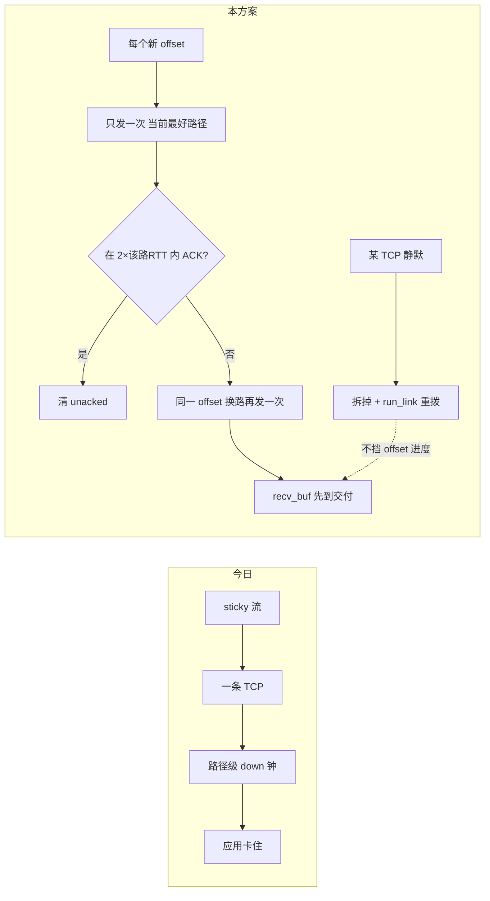

# Path-agnostic offsets: 流进度与单条 TCP 解耦

| 字段 | 值 |
| --- | --- |
| **Author** | nya-link-aggregation maintainers |
| **Date** | 2026-08-31 |
| **Status** | Implemented（取代 `design-first-arrival-path-pool.md`：并发 k 发已否决） |
| **Compatibility** | 不要求与 sticky 数据面兼容；`PROTOCOL_VERSION` / ALPN 可 bump |

---

## Overview

产品要的是：一堆 **RTT 很低但会抖** 的 underlay TCP，在 SOCKS/转发顶层变成 **低延迟且稳** 的一条连接。

现网已经证明 underlay 的 **均值 RTT 没问题**（多条 TLS TCP 都在最快 class）。顶层超时、超长间隔，是因为 **一条应用流的字节进度绑在某一条 overlay TCP 上**：这条 TCP 一旦相对 RTT 出现长空洞，流就停；算法还要等路径级「死了」才 migrate，再重传在途 offset。其它 TCP 再活，也救不了已经打在死路上的那一包，也救不了还粘在上面的后续包。

**否决：** 同一 offset 同时往多条路各发一份（k 发、首窗三发、串绑）。那是用带宽买探测，没有把流进度从单条 TCP 上拿下来；第一次并发了，后面要么继续浪费，要么又回到 sticky。

**方案：** 每个 offset **只先发一次**，发在 **此刻最好的活路径** 上。未 ACK 则按 **发出那条路的 RTT 倍数** 判定过期，**换一条路再发这一包**（可靠传输，不是并发）。接收端按 offset 重组，先到的一份交付。路径池自己拆/重拨坏 TCP，与流的 TTFB 时钟无关。

---

## Background & Motivation

今日数据面（`open_stream` → `set_sticky` → `ensure_sticky`；`maybe_speculative` 仅当 `!PathState::is_schedulable()`；unacked hedge 等 `degrade_for`；path 撕毁等 `down_for`）：

```text
应用流 ──sticky──► 一条 overlay TCP
                      │
                      ├─ ping 还在 → 路径仍标 UP → 流 stall 也不切
                      └─ 静默超过路径级 down 钟 → path_failed → migrate → 重传
```

生产（prod-gz-yuusei）：各 5-tuple 最快 RTT 仍在最短 class；空洞是 **相对该 RTT 很长的单连接静默**；六条几乎从不同时死；同 link 另一条 TCP 多数时候还活着。Client 会主动拆 TCP 再 `run_link` 重拨。应用仍看到 stall 与秒级 TTFB。

e2e 没拦住：验的是「应用 TCP 别断、ping 在宽松预算里回来」，不是「新流第一字节跟 min(RTT) 一个量级」。

根因不是「少发了两份拷贝」，是 **流的下一个可交付字节取决于某一条 5-tuple 何时再响**。

---

## Goals & Non-Goals

### Goals

1. 有 ≥2 条不同 named link 的活 TCP 时，**单条 5-tuple 空洞不得把流的下一字节卡住到路径级 down 钟**。
2. **每个 offset 发送时只上一份**。第二份只允许作为 **超时后的换路重传**。
3. 选路与超时只用 **测到的 RTT 的倍数**（已有 `loss_timeout` = 2×RTT 等），不引入新的绝对毫秒业务阈值。
4. 路径拆/重拨可以继续勤快：那是池子卫生，不是 TTFB 开关。
5. e2e 用 **新流 first-byte**（相对 min RTT）做门，而不是 ping 存活。

### Non-goals

- 同一包同时打多条路。
- 用加大应用超时来「过」。
- 改 origin。
- 新帧类型（offset 已够重组/去重）。
- 把 `failbacks` 当成功指标。

---

## Proposed Design

### 翻转



### 1. 路径是池，不是流的家

`run_link`、ping、`path_failed`、outlier recycle 只负责 **N 条活着的 overlay TCP**。

流 **不再 sticky**。删 `StreamState.sticky` 作为发送契约（本系列删字段；snapshot 改为最近一次发送的 `path_id` / `copies` 仅诊断）。

路径级 down 钟继续用现有公式：`down_timeout(rtt, probe)` = `max(5×RTT, …)` 等 **RTT 缩放**（`tuning.rs`）。它只决定 **要不要丢掉这条 TCP**。不决定流等不等。

### 2. 每个新 offset 发一次：当前最好路径

`send_data` / `StreamOpen`：

1. `pick_path`：活着、尽量最快 class、尽量不拥塞。**不要** `backup_prefer_class` 的「同 link 姐妹优先」作为 TTFB 默认——换路重传时必须 **避开刚才失败的那条 path_id，并优先不同 `link_key`**。
2. 只 `send_on_path` **一次**，`Unacked` 记 `{data, path_id, sent_at}`。
3. 下一帧重新 pick。允许条带化（连续 offset 落在不同 TCP 上）。接收端 `recv_buf` 按 offset 重组。

`open_stream`：有 **一条** 活路径即可发 StreamOpen（不要 `wait_paths` 等到 `rtt_known` 才开门）。Open 也走同一套：一次发送，超时换路重传。

### 3. 未 ACK → 按发出路径的 RTT 换路重传

时钟（与现有 ping loss 对齐，不新造绝对阈值）：

```text
retry_after(path) = loss_timeout(cfg, path.rtt)   # 已有：2×RTT，带已有 floor/ceil
```

`maintain`（或 ACK 路径上）：

- 若 `now - unacked.sent_at >= retry_after(unacked.path)`：
  - **禁止**在同一 `path_id` 上原地再发（那条 TCP 正在抖）。
  - 选一条 **不同 path_id**、能的话不同 `link_key`，发同一 offset。
  - 更新 `path_id` / `sent_at`；`inflight` 从旧路减、新路加。
- 若没有第二条活路径：只能等池子 `run_link` 补上；这才是真 all-down。

这不是并发双发：第二份只有第一份 **已经过了 2×该路 RTT 还没 ACK** 才上。正常 7 ms class 上，这就是「大约两个 RTT 没响就换路」，不是等路径死。

StreamOpen 用旁表 `OpenUnacked { path_id, sent_at, target }`（不要用假 offset）。重传 Open 的选路规则相同。对端 `accept_remote_stream` 必须 **`streams.entry` 原子**：只有 vacant 臂 `alloc` + `IncomingStream`（一次 origin dial）。occupied → 丢掉重复 Open。

### 4. 接收：offset 先到者赢

已有 `recv_buf: BTreeMap<u64, Vec<u8>>`。`on_data`：

- `offset < recv_next`：丢（重传重复）。
- 否则 insert；`drain_recv` 连续交付。
- 同 offset 后到的覆盖或丢均可（payload 相同）。**不要**为重传双计 `buffered_in`。

**Open 与 DATA 跨路：** 允许 DATA 与 Open 不同 path（条带）。若 DATA 先到、流尚不存在：按 `retry_after(min_rtt)` 量级缓冲 early DATA，Open 到了再 drain；超时未 Open 则丢。禁止「DATA 打在从没 Open 过的路上就静默丢字节」。

### 5. ACK / 窗口

- 任一路径上的 ACK 推进 `send_acked`、删 unacked、`sub_inflight` **一次**（`unacked.remove` 成功才减）。并发双 ACK 不得双减。
- `on_ack(path_id, ack)`：RTT 只在「我们确实在这条路上发过这一份」时采样。
- 窗口仍是 `send_next - send_acked`，与发过几路无关。

### 6. 乱序

条带会乱序。`recv_buf` 已按 offset。洞（有后字节、缺 `recv_next`）的放弃钟用 **8× min_rtt**（与现有 failback/class 同一类 RTT 缩放），不是绝对秒。应用层 in-order：缺头包时后面先到的停在 buf 里，头包换路重传到了再交付——这就是 TTFB 只等 **2×RTT 换路** 而不是等路径死。

空 buf、仅 in-order 堵在应用读（parked）**不是**洞，不 RESET。

### 7. 路径卫生（与流解耦）

某 TCP 相对自身 RTT 长期无 rx → `path_failed` 从池里拿掉 → `run_link` 重拨。此时：

- 所有 `unacked.path_id == dead` 的 offset **立即**换到仍活的路上（不必再等 `retry_after`：路已经没了）。
- 流 **不** migrate sticky（没有 sticky）。

### 8. SLO（overlay，不含 origin）

有 ≥2 个 named link 各至少一条活 TCP 时：

- 单条 5-tuple 进入长静默，新流 **第一字节相对 min_rtt 的额外等待** 应落在 **一次 `retry_after(min_rtt)` + 一跳 RTT** 量级（两倍 RTT 发现 + 另一条路的 RTT），而不是路径 down 钟量级。
- `stall_ms` 在「≥2 link 活着」时应收到 `retry_after` 量级，而不是路径 down 量级。
- `path_down` 高 **允许**（池子在换 5-tuple）。

不把绝对毫秒写进协议常量；实现引用 `loss_timeout(rtt)`。

---

## API / Interface Changes

- `PROTOCOL_VERSION = 2`，ALPN `nya/2`，与「Open 原子去重 + 无 sticky 发送」同一合并，避免 main 上只升版本仍 sticky。
- 删发送路径上的 `set_sticky` / `ensure_sticky`；本系列删 `StreamState.sticky`。
- `Unacked` 保持单 `path_id`（同一时刻一份在途）。换路重传是 **替换** path_id，不是 `copies[]`。
- `Tuning`：不新增绝对 ms。重传用已有 `loss_timeout_*`。不要 TOML 旋钮。

---

## Data Model Changes

`Unacked { data, path_id, last_sent }` 语义变为「当前在途的那一份」。无 `copies[]`。

`OpenUnacked` 旁表。early DATA 缓冲：未知 `stream_id` 的 DATA 短住，钟为 `loss_timeout(min_rtt)`。

`load_term` 只看 inflight，不看 sticky 计数。

---

## Alternatives Considered

### A. 只改钟：sticky 留下，`down_min_silence` 改小，hedge 改 2×RTT

流仍绑一条 TCP。发现再快，第一包仍在那条 5-tuple 的缓冲区里；同 link 姐妹优先会把重传打回同一 ISP。**否决。**

### B. 并发 k 发（已被否决）

同一 offset 同时上多条路。治标：第一次 TTFB 可能好看，后面要么一直 ×k 带宽，要么又 sticky。用户明确禁止。**否决。**

### C. 纯条带、不换路重传（MPTCP spray without extra retry）

头包打在即将静默的 TCP 上，接收端 HOL 仍等这条。条带只能提高后面吞吐。**否决作为唯一机制**；本方案允许条带，但 **缺包必须 RTT 缩放换路重传**。

### D. 本方案：每 offset 一次发送 + RTT 缩放换路重传

带宽 ≈ 无损 TCP；抖动时多一倍那一包。发现时间跟 RTT 走。

---

## Security & Privacy

- StreamOpen 原子 `entry`：k 路重传 Open 不得双拨 origin。
- 不新帧、不新明文。early DATA 只对已握手会话。
- 窗口不因重传加倍。

---

## Observability

- `stall_ms` 进入/离开钟改为 `loss_timeout(sticky_or_unacked_path_rtt)`，不是 `degrade_for` / 路径 down。
- `data_retransmit` / `data_hedge`：换路重传计入现有计数（hedge = 换 `link_key`，rtx = 换 path 可同 link）。
- **不要**加「副本数」计数。`path_down` 高不是告警。
- e2e：**新流** `open_stream` + 一写，测 first-byte − origin_first。在 **一条** 5-tuple 注入相对其 RTT 很长的黑洞、姐妹和其它 link 仍活。超时按 RTT 倍数，不要 1500 ms ping 门。`min_success ≥ 0.95`。warm ping 只作辅。

---

## Rollout

两端一起升 v2。回滚：两端回 v1。无混会话。

---

## Risks

| 风险 | 缓解 |
| --- | --- |
| 条带乱序放大 buf | 洞钟 8×min_rtt；只缺头才 HOL |
| 2×RTT 误判导致多余换路重传 | 重复 offset 接收端丢；带宽偶发 ×2 一包，可接受 |
| 只有一条 link 活着 | 无法藏空洞，如实变慢；这是真 all-link 坏 |
| Open/DATA 跨路竞态 | early buffer + 原子 Open |

---

## Open Questions

无。并发 k 发已否决；sticky 本系列删除；不引入新的绝对 ms 业务阈值。

---

## Key Decisions

1. **治本：offset 进度与单条 TCP 解耦。** 不是并发多发。
2. **每个新 offset / Open 只发一次**，路径 = 此刻最快活 TCP。
3. **超时换路重传** = `loss_timeout(发出路径的 RTT)`，禁止原地再发同一 5-tuple。优先不同 `link_key`。
4. **路径 down 钟只拆 TCP，不挡流。** 死路立刻把该路上的 unacked 换出去。
5. **无新帧。** 原子 Open。删 sticky。
6. **时钟全是 RTT 倍数**（已有 loss/down/probe 公式）。设计叙述不引入新的绝对毫秒业务阈值。
7. **e2e 门是新流 first-byte**，不是 ping 1500 ms。
8. **PROTOCOL_VERSION=2 与行为改变同一合并。**

---

## References

- `crates/nya-core/src/session/{mod,streams,steer}.rs`
- `crates/nya-core/src/{stream,path,scheduler,health,tuning}.rs` — `loss_timeout` 2×RTT
- `crates/nya-client/src/lib.rs` — `run_link`
- `crates/nya-e2e/src/{scenarios,report,workload}.rs` — 今日 SLA 验的是存活不是 TTFB
- 被否决：`docs/design-first-arrival-path-pool.md`（并发 k 发）

---

## PR Plan

### PR 1 — Unacked 换路重传（仍可先沿用 pick 一次）

- **Files:** `stream.rs`；`session/{mod,streams,steer}.rs`
- **Deps:** 无
- **Description:** maintain：unacked 超过 `loss_timeout(path.rtt)` 则换 path 再发；避开原 `path_id`。行为在 sticky 仍在时即可测：比等到 `degrade_for` 早。
- **Merge gate:** 单 path 注入长静默、第二条路活着，offset 在 `loss_timeout` 量级出现在第二路上，不必等到路径 down。

### PR 2 — 每帧重新 pick，去掉发送 sticky

- **Files:** `streams.rs` `send_data` / Open；删 `ensure_sticky` 发送门
- **Deps:** PR 1
- **Description:** 每新 offset `pick_path`。sticky 字段停止被发送读取。
- **Merge gate:** 连续帧可以落在不同 path_id；接收重组正确。

### PR 3 — 原子 Open + Open 换路重传 + ALPN v2

- **Files:** `nya-proto`；handshake/tls；`accept_remote_stream`；OpenUnacked；early DATA
- **Deps:** PR 1–2
- **Description:** 版本与「无 sticky 发送 + 原子 Open」同合并。
- **Merge gate:** 双 Open 一次 origin dial；Open 打在即将静默的 TCP 上、另一 link 活着时，first-byte 不等路径 down。

### PR 4 — 删 sticky 字段；load_term 只用 inflight

- **Deps:** PR 3
- **Merge gate:** 无 `StreamState.sticky` 读取；snapshot 不靠 sticky 做正确性。

### PR 5 — stall 钟改为 loss_timeout(path rtt)；乱序洞钟 8×min_rtt

- **Deps:** PR 1
- **Merge gate:** ≥2 link 时 stall 分布落到 RTT 倍数，而不是路径 down 倍数。

### PR 6 — e2e 新流 first-byte + 单 5-tuple 长静默

- **Files:** nya-e2e
- **Deps:** PR 3–5
- **Description:** 换掉 1500 ms ping 作为产品门。注入「相对 RTT 很长」的单连接黑洞，其它路活着。
- **Merge gate:** extra first-byte 在 `retry_after + RTT` 量级；应用 TCP 不断。

### PR 7 — 文档

- ARCHITECTURE / OBSERVABILITY：sticky 不再是延迟契约；路径 down 是池卫生。
